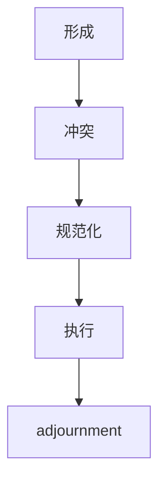

                 

### 文章标题：团队建设：从个体贡献到集体智慧

**关键词：团队建设，个体贡献，集体智慧，沟通协作，领导力，案例分析**

**摘要：**
本文深入探讨了团队建设的过程，从个体成员的贡献逐步发展到整个团队的集体智慧。通过分析团队建设的理论基础、个体角色与责任、集体智慧的重要性以及团队沟通与协作，本文提供了实用的团队建设策略和案例分析，旨在帮助IT领域的技术团队实现高效的集体智慧。

---

## 引言

在当今快速发展的IT领域，团队建设已经成为企业成功的关键因素。一个高效的团队不仅能够提高生产力，还能激发创新和解决问题的能力。然而，如何从个体贡献迈向集体智慧，是许多团队面临的挑战。本文将从多个角度探讨团队建设，旨在为IT团队提供实用的指导。

### 团队建设的必要性

随着技术的不断进步和市场竞争的加剧，IT项目往往需要多学科、多领域的知识和技术。一个团队中的每个成员都有自己的专长和贡献，但当这些个体结合在一起时，能否形成1+1>2的效果，取决于团队的建设和协作水平。

### 文章结构

本文将分为六个部分：

1. **团队建设的理论基础**：介绍团队的定义、发展模型和建设理论。
2. **个体贡献与团队目标**：探讨个体角色、责任和与团队目标的关系。
3. **集体智慧的重要性**：分析集体智慧的定义、原理和优势。
4. **团队沟通与协作**：探讨团队沟通技巧、协作机制及其在团队建设中的重要性。
5. **团队领导力**：介绍团队领导力的要素、风格和提升策略。
6. **团队建设策略**：提供实用的团队建设策略和案例分析。
7. **结论**：总结团队建设的未来展望。

### 目标读者

本文的目标读者是从事IT领域工作的专业人士，特别是负责团队管理和技术团队建设的CTO、项目经理和团队领导。希望通过本文，读者能够获得团队建设的深入理解和实用策略，从而提升团队绩效和整体竞争力。

---

## 团队建设的理论基础

团队建设始于对团队的深入理解。在本节中，我们将探讨团队的定义、发展模型和建设理论，为后续内容提供理论基础。

### 团队的定义

团队是由多个个体组成的，共同协作以实现共同目标的工作组合。与个体不同，团队具有以下特征：

- **共同目标**：团队中的每个成员都认同并致力于实现共同的目标。
- **协作**：团队成员相互依赖，通过协作和沟通共同完成任务。
- **互补性**：团队成员在技能、知识和经验上互相补充，形成完整的能力体系。

### 团队发展模型

团队发展模型描述了团队从组建到成熟的过程。埃利奥特·杰克斯提出了五阶段模型，包括形成、冲突、规范化、执行和 adjournment（结束）阶段。托马斯·基尔曼提出了信任模型，强调信任在团队发展中的关键作用。管理方格理论则从关注任务和关注人员两个维度分析团队领导风格。

### 团队建设理论

社会学习理论强调个体通过观察和模仿团队中的行为来学习。交互模型认为团队发展是通过成员之间的互动和沟通实现的。心理动力模型则从心理学角度分析团队内部的动态和成员的心理需求。

### Mermaid 流程图

下面是团队发展模型的 Mermaid 流程图：



### 核心概念与联系

- **团队**：由多个个体组成的协作组合，共同追求共同目标。
- **发展模型**：描述团队从形成到成熟的各个阶段。
- **建设理论**：解释团队内部动态和成员行为的原则。

通过理解这些核心概念，我们可以更好地构建和管理团队，从而实现高效的团队建设。

---

## 个体贡献与团队目标

个体贡献是团队建设的基础。每个团队成员都在团队中扮演着特定的角色，承担着特定的责任。在本节中，我们将探讨个体角色与责任，以及个体贡献与团队目标之间的关系。

### 个体角色与责任

在团队中，每个成员都有自己的角色和责任。这些角色和责任通常包括：

- **技术专家**：负责技术实现和问题解决。
- **项目管理员**：负责项目规划、进度跟踪和风险管理。
- **产品经理**：负责产品规划和市场需求分析。
- **测试员**：负责软件测试和确保质量。

明确个体角色和责任有助于团队目标的实现。每个成员都清楚自己的任务和期望，可以更高效地协作。

### 个体贡献与团队目标

团队目标是团队努力的方向和动力源泉。个体贡献与团队目标之间存在着密切的关系：

- **目标一致性**：个体目标与团队目标的一致性是团队协作的关键。个体应该将自己的工作与团队目标相结合，确保自己的贡献有助于实现团队目标。
- **目标分解**：团队目标通常需要分解为具体的任务和目标，每个成员负责其中的一部分。个体贡献的完成情况直接影响到团队目标的实现。
- **目标评估**：团队需要对个体贡献进行定期评估，确保每个成员的贡献与团队目标相匹配。这有助于发现和解决问题，提高团队绩效。

### 核心算法原理讲解

为了更清晰地理解个体贡献与团队目标之间的关系，我们可以使用以下伪代码：

```plaintext
function individualContribution(teamGoal, individualRole, individualTask):
    if (individualRole == technicalExpert):
        return (individualTask / totalTasks) * teamGoal
    elif (individualRole == projectManager):
        return (projectProgress / totalProjects) * teamGoal
    elif (individualRole == productManager):
        return (productFeedback / totalFeedback) * teamGoal
    elif (individualRole == tester):
        return (testResults / totalTests) * teamGoal
    else:
        return 0

function teamGoalAchievement(individualContributions, teamGoal):
    totalContribution = sum(individualContributions)
    return (totalContribution / teamGoal) * 100
```

在这个算法中，`individualContribution`函数计算每个成员的贡献，`teamGoalAchievement`函数计算团队目标的完成情况。

### 数学模型和公式

个体贡献与团队目标之间的关系可以用以下公式表示：

$$
\text{individualContribution} = \frac{\text{individualTask}}{\text{totalTasks}} \times \text{teamGoal}
$$

$$
\text{teamGoalAchievement} = \frac{\sum \text{individualContributions}}{\text{teamGoal}} \times 100\%
$$

其中，`individualTask`表示个体完成的任务量，`totalTasks`表示总任务量，`individualContributions`表示所有个体的贡献之和。

### 举例说明

假设一个团队的目标是完成一个项目，总任务量为100点。团队中有四个成员，分别是技术专家、项目经理、产品经理和测试员。他们的任务量分别为50点、20点、10点和20点。团队目标完成情况如下：

```plaintext
individualContribution(technicalExpert) = (50 / 100) * 100 = 50
individualContribution(projectManager) = (20 / 100) * 100 = 20
individualContribution(productManager) = (10 / 100) * 100 = 10
individualContribution(tester) = (20 / 100) * 100 = 20

totalContribution = 50 + 20 + 10 + 20 = 100

teamGoalAchievement = (100 / 100) * 100 = 100%
```

在这个例子中，所有成员的贡献加起来正好完成了团队目标，团队目标完成度为100%。

### 项目实战

在实际项目中，团队建设的过程需要不断调整和优化。以下是一个简单的项目实战案例：

#### 开发环境搭建

1. 确定项目需求，包括技术框架、开发工具和环境配置。
2. 搭建基础开发环境，包括服务器、数据库和中间件。
3. 配置版本控制系统，如Git，确保代码的版本管理和协作开发。

#### 源代码详细实现和代码解读

1. 根据项目需求，团队成员分工合作，分别完成各自的模块。
2. 每个模块完成后，进行代码审查，确保代码质量和一致性。
3. 使用注释和文档，详细解读代码逻辑和功能，方便后续维护和开发。

#### 代码应用解读与分析

1. 编写测试用例，对代码进行功能测试和性能测试。
2. 分析测试结果，发现和解决问题，优化代码性能。
3. 使用代码覆盖率工具，确保代码的每个部分都经过测试。

#### 实际案例分析和详细讲解剖析

1. 分析项目中遇到的挑战和问题，如性能瓶颈、接口兼容性等。
2. 讨论解决方案，如代码优化、架构调整等。
3. 讲解解决方案的实施过程和效果，总结经验教训。

#### 项目小结

1. 评估项目的整体完成情况，包括任务完成度、代码质量、项目进度等。
2. 分析项目中的成功经验和不足之处，提出改进建议。
3. 为后续项目提供参考和借鉴。

通过这个项目实战案例，我们可以看到团队建设的过程是如何从个体贡献到集体智慧的。每个成员的贡献都被充分尊重和发挥，最终实现了项目的成功。

### 最佳实践 tips

- **明确角色和责任**：确保每个成员都清楚自己的角色和责任，减少协作中的误解和冲突。
- **定期沟通和反馈**：保持团队内的沟通畅通，定期进行项目进展和问题反馈，及时调整方向。
- **分工合作**：合理分工，充分发挥每个成员的专长，提高团队的整体效率。
- **鼓励创新和反思**：鼓励团队成员提出创新想法，并定期进行反思，总结经验教训。

### 小结

个体贡献与团队目标之间的关系是团队建设中至关重要的一环。通过明确个体角色和责任，分解团队目标，评估个体贡献，我们可以实现团队的高效协作和集体智慧的发挥。在实际项目中，不断优化和调整团队建设策略，是提高团队绩效的关键。

### 注意事项

- 团队建设是一个持续的过程，需要不断调整和优化。
- 团队成员之间的沟通和协作是团队建设的关键。
- 领导者的角色和风格对团队建设具有重要影响。

### 拓展阅读

- [《团队协作技巧》](https://example.com/collaboration-skills)
- [《敏捷开发方法》](https://example.com/agile-methodology)
- [《领导力提升》](https://example.com/leadership-boost)

---

## 集体智慧的重要性

在团队建设中，个体贡献固然重要，但集体智慧更是团队成功的关键。集体智慧指的是团队成员通过协作、沟通和共享知识所形成的整体智慧。它不仅超越了个体智慧，还能在解决问题、创新和决策方面发挥巨大作用。

### 集体智慧的定义

集体智慧（Collective Intelligence）是指一个团队或群体在共同的目标下，通过协作、共享信息和知识，产生比单个成员单独行动更智能、更有创造力的决策和行为。它是一种基于协作和共享的智慧，能够充分利用每个成员的优势和专长。

### 集体智慧的优势

集体智慧具有以下优势：

1. **综合能力**：集体智慧能够综合每个成员的知识和技能，形成更全面的能力体系。
2. **创新力**：集体智慧通过团队成员的协作和互动，能够激发更多的创新想法和解决方案。
3. **决策质量**：集体智慧在决策过程中能够提供更全面的信息和不同的视角，从而提高决策质量。
4. **问题解决能力**：集体智慧能够利用多个成员的经验和智慧，更有效地解决问题。

### 集体智慧的局限性

尽管集体智慧有诸多优势，但也不是完美的。它也存在一些局限性：

1. **时间成本**：集体智慧的实现需要团队成员之间的沟通和协作，这可能需要更多的时间。
2. **协调难度**：当团队成员众多且分散时，协调和统一意见可能变得复杂。
3. **信息过载**：过多的信息和意见可能会导致决策过程变得混乱，难以取舍。

### 集体智慧的应用

集体智慧在多个领域都有广泛的应用：

1. **项目管理**：在项目管理中，集体智慧可以帮助团队更有效地制定计划和应对变化。
2. **创新研发**：在创新研发过程中，集体智慧能够激发更多的创新思路和解决方案。
3. **决策支持**：集体智慧可以为管理层提供更全面、更准确的决策支持。

### 数学模型和公式

为了更好地理解集体智慧，我们可以使用以下数学模型：

1. **集体智慧指数**：

$$
CI = \frac{1}{N} \sum_{i=1}^{N} Wi
$$

其中，CI是集体智慧指数，N是团队成员数量，Wi是第i个成员的智慧贡献。

2. **集体智慧与个体智慧的关系**：

$$
CI \geq \max(Wi)
$$

即集体智慧指数大于或等于单个成员的最大智慧贡献。

### 举例说明

假设一个团队有四个成员，他们的智慧贡献分别为Wi1 = 0.8，Wi2 = 0.7，Wi3 = 0.6，Wi4 = 0.9。根据上述公式，我们可以计算集体智慧指数：

$$
CI = \frac{1}{4} (0.8 + 0.7 + 0.6 + 0.9) = 0.8
$$

由于CI大于单个成员的最大智慧贡献（0.9），这表明团队的整体智慧高于单个成员。

### 项目实战

在实际项目中，集体智慧的应用可以帮助团队更高效地解决问题和实现目标。以下是一个项目实战案例：

#### 项目背景

一个软件公司正在开发一款全新的移动应用，项目周期为6个月。由于项目涉及多个技术领域，公司决定组建一个跨职能团队，包括前端开发、后端开发、测试、产品和设计等成员。

#### 团队协作与集体智慧的应用

1. **需求分析**：团队通过集体讨论和头脑风暴，明确了项目的需求和目标。每个成员都贡献了自己的见解和经验，形成了全面的需求文档。
2. **任务分工**：根据团队的能力和兴趣，成员们被分配到不同的任务组，如前端开发组、后端开发组和测试组。每个任务组内成员密切合作，确保任务顺利完成。
3. **问题解决**：在项目开发过程中，团队遇到了多个技术难题。通过集体智慧，团队成员共同分析和讨论，找到了有效的解决方案，保证了项目的顺利进行。
4. **创新思路**：团队成员在开发过程中不断提出新的想法和改进方案。通过集体讨论，团队选择了一些具有潜力的创新思路，并进行了实验验证，为产品增加了独特的功能。

#### 项目结果

通过集体智慧和团队协作，项目在预定时间内成功完成，并得到了客户的高度评价。项目不仅满足了需求，还实现了多个创新功能，为公司赢得了市场份额和客户忠诚度。

### 最佳实践 tips

- **建立沟通机制**：确保团队成员之间有畅通的沟通渠道，鼓励开放讨论和分享。
- **鼓励协作**：鼓励团队成员相互协作，共同解决问题和实现目标。
- **利用工具**：使用协作工具，如JIRA、Trello等，帮助团队管理和跟踪项目进度。
- **定期回顾**：定期进行项目回顾和总结，发现和改进团队协作中的问题。

### 小结

集体智慧是团队建设中的关键要素，它能够充分利用团队成员的智慧和经验，实现更高效的协作和更优质的成果。在实际项目中，通过集体智慧和团队协作，可以解决复杂问题，推动创新，实现项目目标。

### 注意事项

- **尊重个体贡献**：在强调集体智慧的同时，不要忽视个体贡献的重要性。
- **平衡效率与质量**：在追求项目进度的同时，也要保证项目的质量和稳定性。
- **持续优化**：团队协作和集体智慧的应用是一个持续优化的过程，需要不断调整和改进。

### 拓展阅读

- [《集体智慧在组织管理中的应用》](https://example.com/collective-intelligence-in-organization-management)
- [《协作式创新方法论》](https://example.com/collaborative-innovation-methodology)

---

## 团队沟通与协作

团队沟通与协作是团队建设的重要组成部分，它决定了团队成员之间的信息传递效率、协作效果和团队整体绩效。在本节中，我们将深入探讨团队沟通技巧、协作机制及其在团队建设中的重要性。

### 团队沟通技巧

有效的团队沟通是团队协作的基础。以下是一些关键的沟通技巧：

1. **明确沟通目标**：在每次沟通前，明确沟通的目标和内容，确保信息传达的精准性。
2. **倾听**：倾听是有效沟通的关键，通过倾听，团队成员可以更准确地理解对方的意见和需求。
3. **清晰表达**：使用简洁、明确的语言表达观点，避免使用模糊的词汇和歧义。
4. **积极反馈**：在沟通过程中，及时给予积极的反馈，帮助对方理解自己的观点。
5. **开放态度**：保持开放的态度，接受不同的意见和观点，促进团队内部的多元性。

### 团队协作机制

团队协作机制是指团队内部用于管理和协调工作的方法和工具。以下是一些常见的团队协作机制：

1. **任务分解**：将项目任务分解为更小的子任务，确保每个成员都有明确的工作目标和责任。
2. **协作工具**：使用协作工具，如JIRA、Trello、Slack等，帮助团队成员跟踪任务进度、共享文件和沟通信息。
3. **定期会议**：定期召开团队会议，讨论项目进展、解决问题和规划下一步行动。
4. **代码审查**：通过代码审查，确保代码的质量和一致性，减少错误和冲突。
5. **反馈机制**：建立反馈机制，鼓励团队成员之间提供建设性的意见和建议，促进个人和团队成长。

### 团队沟通与协作的重要性

团队沟通与协作的重要性体现在以下几个方面：

1. **提高工作效率**：有效的沟通和协作可以减少误解和重复工作，提高工作效率。
2. **增强团队凝聚力**：通过沟通和协作，团队成员可以建立信任和默契，增强团队的凝聚力。
3. **提升项目质量**：沟通和协作有助于发现和解决问题，确保项目质量。
4. **促进创新**：团队内部的沟通和协作可以激发创新思维，推动项目的创新和发展。
5. **降低风险**：通过有效的沟通和协作，团队可以更好地应对变化和挑战，降低项目风险。

### 项目实战

以下是一个团队沟通与协作的项目实战案例：

#### 项目背景

一家互联网公司正在开发一款智能家居APP，项目周期为4个月。由于项目涉及前端开发、后端开发、测试、UI设计等多个领域，公司决定组建一个跨职能团队。

#### 团队沟通与协作实践

1. **任务分解**：项目经理将项目分解为前端开发、后端开发、测试和UI设计等子任务，每个子任务都分配给专门的团队成员。
2. **协作工具**：团队使用Trello来管理任务进度，每个成员可以随时查看任务的最新状态，并更新自己的工作进度。
3. **定期会议**：每周团队都会召开一次周会，讨论项目进展、解决问题和规划下一步行动。会议记录会及时更新到Trello上，以便团队成员查阅。
4. **代码审查**：每次前端和后端开发完成后，都会进行代码审查，确保代码的质量和一致性。审查过程中，团队成员可以提出建议和修改意见。
5. **反馈机制**：团队鼓励成员之间提供反馈，无论是关于工作内容还是团队成员的表现。这有助于团队不断改进和优化。

#### 项目结果

通过有效的沟通和协作，项目在预定时间内成功完成，APP功能全面、用户体验优秀。团队成员之间的默契和信任也得到了增强，为后续项目的合作奠定了坚实的基础。

### 最佳实践 tips

- **明确沟通目标**：确保每次沟通都有明确的目标和内容，避免无效沟通。
- **倾听与反馈**：倾听对方的意见，给予积极的反馈，促进有效沟通。
- **定期会议**：定期召开会议，讨论项目进展和问题，确保团队成员之间的信息畅通。
- **协作工具**：合理利用协作工具，提高团队的工作效率和协作效果。
- **反馈机制**：建立反馈机制，鼓励团队成员之间提供建设性意见和建议。

### 小结

团队沟通与协作是团队建设中不可或缺的一部分。通过有效的沟通和协作，团队成员可以更好地理解彼此的需求和目标，提高工作效率和项目质量，实现团队的成功。在实际项目中，通过任务分解、协作工具、定期会议、代码审查和反馈机制，可以构建高效的沟通与协作机制。

### 注意事项

- **尊重个体差异**：在团队沟通和协作中，尊重每个成员的个性和观点，避免产生冲突。
- **保持开放性**：鼓励团队成员提出不同的意见和解决方案，促进创新和团队的多样性。
- **持续优化**：团队沟通与协作是一个持续优化的过程，需要根据实际情况进行调整和改进。

### 拓展阅读

- [《高效沟通技巧》](https://example.com/efficient-communication-skills)
- [《敏捷团队协作方法》](https://example.com/agile-team-collaboration-methods)

---

## 团队领导力

团队领导力是团队建设中的核心要素，它决定了团队的凝聚力和绩效。一个优秀的团队领导者不仅能够激发团队成员的潜力，还能提供明确的指导和方向。在本节中，我们将探讨团队领导力的要素、领导风格及其提升策略。

### 团队领导力的要素

1. **愿景与目标**：团队领导者需要明确团队的愿景和目标，并将其传达给团队成员，激发他们的热情和动力。
2. **沟通与倾听**：有效的沟通和倾听能力是团队领导者必备的素质，通过良好的沟通，领导者可以了解成员的需求和意见，建立信任和合作关系。
3. **激励与鼓励**：团队领导者需要能够激励和鼓励团队成员，帮助他们克服困难，保持积极的工作态度。
4. **决策能力**：团队领导者需要具备决策能力，能够在关键时刻做出明智的决策，并带领团队走向成功。
5. **团队建设**：团队领导者需要关注团队建设，促进团队成员之间的协作和合作，营造积极的工作氛围。

### 领导风格

1. **权威型领导**：权威型领导者具有明确的决策权和权威性，通过严格的管理和控制来确保团队的稳定和效率。
2. **民主型领导**：民主型领导者注重团队成员的参与和意见，通过集思广益来做出决策，促进团队的民主和开放。
3. **教练型领导**：教练型领导者注重团队成员的个人成长和技能提升，通过指导和辅导来帮助成员实现自我提升和职业发展。
4. **变革型领导**：变革型领导者具有强烈的变革意识和创新能力，能够带领团队迎接挑战，推动团队的发展和进步。

### 提升团队领导力的策略

1. **自我反思与学习**：团队领导者需要不断进行自我反思和学习，提升自身的领导能力和管理技能。
2. **建立信任关系**：与团队成员建立信任关系，通过诚实、透明和开放的沟通来增强团队的凝聚力。
3. **激励与奖励**：通过适当的激励和奖励机制，鼓励团队成员的努力和贡献，提高团队的整体绩效。
4. **培养领导力**：为团队成员提供领导力的培养和发展机会，鼓励他们成为未来的领导者。
5. **持续反馈**：定期对团队成员的工作进行反馈，帮助他们识别优点和改进方向，促进个人的成长和团队的进步。

### 项目实战

以下是一个团队领导力的项目实战案例：

#### 项目背景

一家初创公司正在开发一款人工智能产品，项目周期为6个月。由于项目复杂且具有高风险，公司决定组建一个高素质的团队，并任命一位有经验的CTO作为团队领导者。

#### 领导实践

1. **明确愿景与目标**：CTO在项目初期明确了团队的愿景和目标，并制定了详细的开发计划，确保团队成员都清楚项目的方向和期望结果。
2. **沟通与倾听**：CTO定期召开团队会议，讨论项目进展和问题，倾听团队成员的意见和建议，确保信息畅通和团队协作。
3. **激励与鼓励**：CTO通过表扬和奖励，鼓励团队成员的努力和贡献，提升团队的士气和工作积极性。
4. **决策能力**：在项目遇到技术难题时，CTO迅速做出决策，带领团队找到解决方案，确保项目进度不受影响。
5. **团队建设**：CTO注重团队建设，通过团建活动和培训，增强团队成员之间的信任和默契，提高团队的凝聚力。

#### 项目结果

通过CTO的领导和指导，团队在项目期间保持了高效的工作状态，成功克服了多个技术难题，并在预定时间内完成了产品的开发。项目的成功不仅提升了公司的市场竞争力，也为团队成员的个人成长和职业发展提供了宝贵的经验。

### 最佳实践 tips

- **明确愿景与目标**：确保团队目标清晰，激发团队成员的热情和动力。
- **有效沟通**：建立开放的沟通渠道，鼓励团队成员表达意见和建议。
- **激励与鼓励**：通过表扬和奖励，激励团队成员的努力和贡献。
- **持续学习**：不断提升自身的领导能力和管理技能，适应团队发展的需求。

### 小结

团队领导力是团队建设中的关键因素，通过明确愿景与目标、有效沟通、激励与鼓励、决策能力和团队建设，团队领导者可以激发团队成员的潜力，提高团队的整体绩效。在实际项目中，通过领导力的提升和有效的领导实践，可以推动团队的发展和成功。

### 注意事项

- **关注个体成长**：在关注团队整体绩效的同时，也要关注每个成员的个人成长和发展。
- **保持灵活性和适应性**：团队领导力需要根据不同阶段和情境进行调整，保持灵活性和适应性。
- **建立信任关系**：与团队成员建立信任关系，是领导力有效发挥的重要基础。

### 拓展阅读

- [《团队领导力发展》](https://example.com/leadership-development-for-teams)
- [《领导力心理学》](https://example.com/leadership-psychology)

---

## 团队建设策略

团队建设是一个复杂且持续的过程，需要结合实际情况，采取多种策略来提升团队的绩效和凝聚力。在本节中，我们将探讨一些实用的团队建设策略，并分析其实施方法和效果。

### 目标导向型策略

目标导向型策略强调明确团队目标和设定可衡量的关键绩效指标（KPI）。这种方法能够帮助团队保持清晰的方向和动力，从而提高工作效率。

1. **实施方法**：
   - **明确目标**：与团队成员共同制定团队目标和个体目标，确保目标具有明确性和可实现性。
   - **分解任务**：将大目标分解为小任务，明确每个任务的责任人和时间节点。
   - **跟踪进度**：定期检查任务进度，确保团队按计划前进。

2. **效果分析**：
   - **提高工作效率**：明确的目标和任务分解有助于团队成员集中精力，提高工作效率。
   - **增强责任感**：明确的任务分配和进度跟踪增强了团队成员的责任感。

### 文化建设型策略

文化建设型策略通过营造积极的团队文化，提高团队成员的归属感和凝聚力。这种方法不仅能够提高团队士气，还能促进创新和协作。

1. **实施方法**：
   - **建立价值观**：明确团队的价值观，如开放、创新、尊重等，并将其融入日常工作中。
   - **团队活动**：定期组织团队建设活动，如团建、聚餐等，增强团队成员之间的联系。
   - **反馈机制**：建立有效的反馈机制，鼓励团队成员分享意见和建议，营造开放和包容的氛围。

2. **效果分析**：
   - **提高团队凝聚力**：共同的目标和价值观有助于增强团队成员之间的联系和信任。
   - **促进创新**：积极的团队文化鼓励创新和尝试新方法，提高团队的创新能力。

### 敏捷型策略

敏捷型策略基于敏捷开发方法，强调快速迭代和灵活调整。这种方法能够帮助团队快速响应变化，提高项目的灵活性和成功率。

1. **实施方法**：
   - **迭代开发**：将项目分为多个迭代周期，每个迭代周期结束后进行评估和调整。
   - **站立会议**：每天召开短暂的站立会议，讨论项目进展和问题，确保团队成员之间的信息同步。
   - **用户故事**：使用用户故事来描述项目需求和功能，确保开发工作紧密贴合用户需求。

2. **效果分析**：
   - **提高响应速度**：敏捷开发方法能够快速响应变化，确保项目始终符合市场需求。
   - **提高质量**：通过持续反馈和迭代，及时发现和解决问题，提高项目的质量。

### 案例分析

以下是一个团队建设策略的实际案例：

#### 案例背景

一家IT公司正在开发一款企业级软件，项目周期为12个月。由于项目复杂且涉及多个部门，公司决定采用多种团队建设策略来确保项目的成功。

#### 实施策略

1. **目标导向型策略**：
   - **明确目标**：与团队成员共同制定了项目目标，包括功能完整性、性能和用户满意度。
   - **分解任务**：将项目分解为多个子任务，明确每个任务的责任人和时间节点。
   - **跟踪进度**：定期检查任务进度，确保团队按计划前进。

2. **文化建设型策略**：
   - **建立价值观**：明确团队的价值观，如开放、创新、高效等，并将其融入日常工作中。
   - **团队活动**：定期组织团队建设活动，如团建、聚餐等，增强团队成员之间的联系。
   - **反馈机制**：建立有效的反馈机制，鼓励团队成员分享意见和建议，营造开放和包容的氛围。

3. **敏捷型策略**：
   - **迭代开发**：将项目分为四个迭代周期，每个迭代周期结束后进行评估和调整。
   - **站立会议**：每天召开短暂的站立会议，讨论项目进展和问题，确保团队成员之间的信息同步。
   - **用户故事**：使用用户故事来描述项目需求和功能，确保开发工作紧密贴合用户需求。

#### 结果分析

通过多种团队建设策略的实施，项目在预定时间内成功完成，并得到了客户的高度评价。团队成员之间的沟通和协作得到了显著提升，项目的质量也得到了保证。

### 最佳实践 tips

- **明确目标**：确保团队目标清晰，有助于提高团队的工作效率和凝聚力。
- **文化建设**：建立积极的团队文化，促进团队成员之间的信任和合作。
- **灵活应对**：根据实际情况灵活调整团队建设策略，确保项目的成功。

### 小结

团队建设策略是提升团队绩效和凝聚力的重要手段。通过目标导向型、文化建设型和敏捷型策略的实施，团队可以更好地应对挑战，实现项目目标。在实际操作中，根据团队的具体情况，灵活选择和调整策略，是团队建设成功的关键。

### 注意事项

- **适应变化**：团队建设策略需要根据团队的发展和项目的变化进行调整。
- **持续优化**：团队建设是一个持续优化的过程，需要不断反思和改进。

### 拓展阅读

- [《团队建设策略与技巧》](https://example.com/team-building-strategies-and-tips)
- [《敏捷开发实践指南》](https://example.com/agile-development-practice-guide)

---

## 团队建设案例分析

在团队建设的实际应用中，许多企业通过成功的案例证明了有效的团队建设策略对于提高团队绩效和实现项目目标的重要性。以下我们将探讨两个具体的团队建设案例，并分析其成功的原因和可借鉴的经验。

### 案例一：谷歌的团队建设经验

#### 背景介绍

谷歌作为全球知名的科技公司，以其创新的企业文化和高效的团队建设而闻名。谷歌的团队建设策略强调了自主管理、跨职能协作和创新思维。

#### 团队建设策略

1. **自主管理团队**：谷歌采用了“项目制”团队组织形式，团队成员可以根据项目需求自由组建，并拥有较大的自主权。这种模式鼓励团队成员发挥主动性和创新精神。

2. **跨职能协作**：谷歌鼓励不同职能部门之间的紧密合作，通过跨职能团队来应对复杂的项目需求。团队成员不仅具备专业技能，还能够参与跨领域的合作，从而提高解决问题的能力。

3. **开放沟通和反馈**：谷歌注重团队成员之间的沟通和反馈，通过定期的团队会议和开放的沟通渠道，确保信息畅通和意见交流。

4. **持续培训和发展**：谷歌为团队成员提供丰富的培训和发展机会，包括在线课程、工作坊和研讨会等，帮助团队成员不断提升自身能力和专业水平。

#### 成功原因

- **自主管理**：自主管理的团队模式激发了成员的创造力和主动性，提高了团队的整体绩效。
- **跨职能协作**：跨职能团队能够充分利用不同部门的专业知识和资源，提高了项目成功的可能性。
- **开放沟通**：畅通的沟通渠道和积极的反馈机制有助于团队成员之间的协作和团队建设。
- **持续发展**：不断提供培训和发展机会，有助于团队成员的个人成长和职业发展。

#### 可借鉴经验

- **自主管理**：给予团队成员更大的自主权和责任，有助于提高团队的创新能力和工作效率。
- **跨职能协作**：鼓励不同职能部门之间的合作，充分利用团队内外部资源。
- **开放沟通**：建立有效的沟通机制，确保团队成员之间的信息传递和意见交流。
- **持续发展**：为团队成员提供培训和发展机会，促进个人和团队的成长。

### 案例二：华为的团队建设实践

#### 背景介绍

华为作为全球领先的电信设备和解决方案提供商，其团队建设策略在快速发展和国际化进程中发挥了重要作用。华为的团队建设强调团队合作、共同目标和绩效导向。

#### 团队建设策略

1. **团队合作**：华为强调团队合作精神，鼓励团队成员互相支持、共同面对挑战。通过定期的团队活动和团队建设培训，增强团队成员之间的协作和信任。

2. **共同目标**：华为在团队建设过程中，始终强调共同目标的设定和实现。通过明确的团队目标和绩效指标，激励团队成员共同努力，实现团队的成功。

3. **绩效导向**：华为采用绩效导向的团队建设策略，通过公平、透明的绩效考核机制，激励团队成员提高工作绩效和团队整体表现。

4. **国际化视野**：华为注重培养国际化视野的团队，通过国际交流和多元化团队的组建，提升团队的全球竞争力和创新能力。

#### 成功原因

- **团队合作**：通过团队合作，华为团队在面对复杂挑战时能够更好地协作和应对。
- **共同目标**：明确的团队目标有助于团队成员共同奋斗，实现团队的成功。
- **绩效导向**：公平、透明的绩效考核机制激发了团队成员的积极性和竞争力。
- **国际化视野**：国际化的团队建设策略增强了华为在全球市场的竞争力。

#### 可借鉴经验

- **团队合作**：通过团队活动和培训，增强团队成员之间的协作和信任。
- **共同目标**：明确团队目标和绩效指标，激励团队成员共同奋斗。
- **绩效导向**：建立公平、透明的绩效考核机制，激发团队成员的积极性和竞争力。
- **国际化视野**：培养国际化视野的团队，提升团队的全球竞争力和创新能力。

### 总结

谷歌和华为的团队建设案例展示了不同企业和行业在团队建设方面的成功实践。通过自主管理、跨职能协作、开放沟通、共同目标、绩效导向和国际化视野等策略，企业可以有效地提升团队绩效和实现项目目标。这些成功经验和可借鉴的实践为其他企业提供了宝贵的参考和启示。

---

## 结论

团队建设是提升IT团队绩效和实现项目目标的关键因素。通过分析团队建设的理论基础、个体贡献与团队目标、集体智慧的重要性、团队沟通与协作、团队领导力以及团队建设策略，我们可以看到，一个高效的团队需要从多个维度进行综合建设。

在未来的团队建设中，以下趋势和挑战值得我们关注：

### 趋势

1. **数字化团队建设**：随着数字化转型的推进，团队建设将越来越多地依赖于数字化工具和平台，如协作软件、虚拟团队会议室等。
2. **灵活工作安排**：远程工作和灵活工作时间的普及，将要求团队具备更高的自我管理和协作能力。
3. **多元化团队**：多元化团队建设将越来越受到重视，通过引入不同背景和经验的成员，团队可以更好地适应市场和技术的变化。

### 挑战

1. **信息过载**：随着信息量的增加，团队成员需要更好地管理和过滤信息，以提高决策效率。
2. **文化冲突**：全球化团队建设带来了文化差异，如何平衡多元文化，建立共同的团队价值观，是团队建设面临的挑战。
3. **持续发展**：团队建设需要不断适应和调整，以应对不断变化的环境和需求。

### 未来展望

未来，团队建设将更加注重个性化和智能化。通过人工智能和大数据分析，团队可以更精确地了解成员的需求和行为模式，提供个性化的培训和发展建议。同时，智能化工具将帮助团队更高效地管理项目和任务，提高整体绩效。

总之，团队建设是一个持续的过程，需要不断优化和改进。通过有效利用个体贡献、集体智慧和团队协作，企业可以打造一支高效的团队，实现可持续的发展和创新。

---

### 作者信息

**作者：AI天才研究院/AI Genius Institute & 禅与计算机程序设计艺术 /Zen And The Art of Computer Programming**

