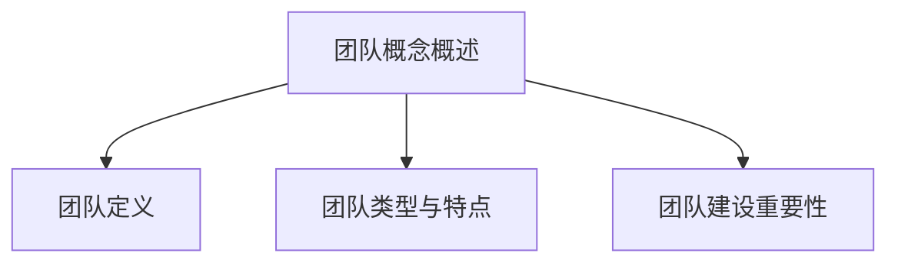

                 

### 文章标题

# 团队建设：从分散个体到凝聚整体

关键词：团队建设、团队管理、协作机制、领导力、绩效评估

摘要：本文深入探讨了团队建设的过程与策略，从团队概念概述、团队建设的核心要素、团队建设的挑战与解决方法，到团队建设方法论、团队绩效评估，以及具体实践案例，系统地阐述了如何将分散的个体凝聚成高效的团队。通过理论讲解、案例分析和实战经验分享，为企业和组织提供了实用的团队建设指导。

## 核心概念与联系

### 团队概念概述

团队是一组人员为实现共同目标而协同工作的组织。团队类型包括功能型团队、项目型团队和跨职能团队等。团队建设的重要性在于它能够提高成员的协作效率，激发创新思维，从而实现团队和组织的整体目标。

#### 团队的定义

团队是由两个以上的个体组成的、相互依赖、相互协作的组织形式。团队成员共同承担任务和责任，共享成果。

#### 团队的类型与特点

- **功能型团队**：按照职能分工组成，成员有明确的职责范围。
- **项目型团队**：为完成特定项目而组建，成员可能来自不同部门。
- **跨职能团队**：由不同职能部门的成员组成，负责跨领域任务。

#### 团队建设的重要性

团队建设有助于提升组织的协作能力，促进知识共享，激发创新，提高整体绩效。

### 团队建设的核心要素

#### 目标设定

目标设定是团队建设的首要步骤。明确的目标有助于团队成员形成共同愿景，增强团队的凝聚力。

##### 目标设定的原则

- **SMART原则**：目标要具体（Specific）、可衡量（Measurable）、可实现（Achievable）、相关性（Relevant）和有时限（Time-bound）。

##### 目标设定的方法

- **头脑风暴**：通过集体讨论，收集团队成员的意见和想法。
- **目标分解**：将总目标分解为具体的子目标，明确责任人和完成时间。

#### 成员招募与选拔

成员招募与选拔是团队建设的关键环节。合适的成员能够提升团队的整体能力和效率。

##### 成员招募的标准

- **技能匹配**：成员的技能应与团队目标相符。
- **团队合作精神**：成员应具备良好的团队合作能力。

##### 成员选拔的方法

- **面试**：通过面试了解成员的技能、经验和团队合作能力。
- **背景调查**：对候选人的工作经历和背景进行深入了解。

#### 沟通与协作

沟通与协作是团队建设的基础。有效的沟通能够促进团队成员之间的理解与合作，提高团队效率。

##### 沟通的重要性

- **信息传递**：确保团队成员了解任务目标和进展情况。
- **协作效率**：促进团队成员之间的协作，减少误解和冲突。

##### 协作机制的建立

- **定期会议**：定期召开团队会议，讨论项目进展和问题。
- **协作工具**：使用协作工具，如Slack、Trello等，提高工作效率。

### 团队建设的挑战与解决方法

#### 挑战分析

- **内部冲突**：团队成员之间的意见分歧和利益冲突。
- **沟通不畅**：团队成员之间的沟通不畅，导致信息传递不准确。
- **目标不一致**：团队成员对团队目标的理解不一致，影响团队整体协作。

#### 解决方法

- **冲突解决策略**：通过沟通和协商解决内部冲突，确保团队成员的利益一致。
- **沟通改进措施**：加强团队内部沟通，确保信息传递的准确性和及时性。
- **目标一致化方法**：通过明确目标和任务，确保团队成员对团队目标有共同的理解和认同。

## 核心算法原理讲解

### 系统化团队建设模型

系统化团队建设模型是一个多层次的框架，包括目标管理、成员发展、沟通机制和环境优化四个主要组成部分。

#### 模型概述

系统化团队建设模型旨在通过一套有序且相互关联的过程来提升团队的绩效和协作能力。

#### 模型组成部分

- **目标管理**：确保团队有清晰的目标，并为每个成员分配具体的任务和责任。
- **成员发展**：通过培训和发展计划，提升团队成员的技能和职业素养。
- **沟通机制**：建立有效的沟通渠道，确保信息流畅传递。
- **环境优化**：创造一个有利于团队协作的工作环境，包括物理环境和虚拟协作平台。

### 团队领导力发展

团队领导力是团队建设的关键因素，它决定了团队成员的积极性和团队的整体表现。

#### 领导力定义

领导力是指领导者通过影响和激励团队成员，实现团队目标和价值的能力。

##### 领导力的概念

- **领导力不是权力**：领导力是通过个人魅力、专业知识、价值观来影响他人，而非依靠权力。
- **领导力的层次**：领导力可以分为技术领导力、功能性领导力和变革性领导力。

##### 领导力发展策略

- **自我认知**：领导者应了解自己的优势和不足，不断提升自我认知。
- **情景领导**：根据团队成员的不同需求和情境，采用不同的领导风格。
- **团队激励**：通过激励措施，激发团队成员的积极性和创造力。

### 团队协作与反馈机制

有效的团队协作与反馈机制是团队建设的重要组成部分，它有助于提高团队的协作效率和创新能力。

#### 协作机制设计

- **协作模式**：包括同步协作和异步协作，根据团队需求和项目特点选择合适的协作模式。
- **协作工具**：使用如Slack、Trello等协作工具，提高团队协作效率。

#### 反馈机制

- **反馈的重要性**：及时有效的反馈有助于团队成员改进工作，提高绩效。
- **反馈机制构建**：建立包括自评、同事评价和上级反馈的多层次反馈机制。
- **反馈效果评估**：定期评估反馈效果，确保反馈机制的有效性。

## 数学模型和数学公式 & 详细讲解 & 举例说明

### 团队绩效评估模型

团队绩效评估是团队建设的关键环节，它有助于了解团队的整体表现，并为改进提供依据。

#### 绩效评估概念

绩效评估是对团队成员在工作中的表现进行客观、公正的评价。

##### 绩效评估的核心要素

- **绩效指标**：衡量团队或成员工作成果的具体指标。
- **评估标准**：对绩效指标进行评估的具体标准和准则。

##### 绩效评估的目的

- **激励成员**：通过绩效评估激发团队成员的积极性和创造力。
- **团队优化**：通过评估识别团队中的优势和不足，进行优化和调整。

#### 绩效评估模型

- **平衡计分卡模型**：从财务、客户、内部流程和学习与成长四个维度评估团队绩效。
- **目标管理模型**：通过设定和实现具体目标，评估团队和成员的绩效。

### 绩效评估方法

绩效评估方法包括定量评估方法和定性评估方法，根据实际情况选择合适的评估方法。

#### 定量评估方法

- **关键绩效指标（KPI）**：通过设定具体的绩效指标，对团队成员的工作进行量化评估。
- **成果考核法**：根据团队成员的工作成果，进行绩效评估。

#### 定性评估方法

- **360度反馈**：通过团队成员、上级、客户等多方面的评价，全面了解团队成员的绩效。
- **行为观察法**：通过观察团队成员在工作中的行为表现，评估其绩效。

### 绩效评估案例分析

#### 案例一：某科技公司的绩效评估

##### 案例背景

某科技公司是一家高科技企业，团队成员具有高度的技能和专业性。公司希望通过绩效评估激发员工的潜力，提高团队的整体绩效。

##### 评估方法

公司采用平衡计分卡模型进行绩效评估，从财务、客户、内部流程和学习与成长四个维度评估团队成员的绩效。

##### 评估结果与分析

通过绩效评估，公司发现部分团队成员在技术创新方面表现优异，而另一些成员在客户沟通和服务方面有待提高。公司根据评估结果，制定了相应的培训和激励措施，有效提升了团队的整体绩效。

#### 案例二：某咨询公司的绩效评估

##### 案例背景

某咨询公司为客户提供专业的咨询服务，团队成员具有丰富的行业经验和专业知识。公司希望通过绩效评估，提升团队成员的服务质量和客户满意度。

##### 评估方法

公司采用360度反馈方法进行绩效评估，通过团队成员、上级、客户等多方面的评价，全面了解团队成员的服务质量和专业能力。

##### 评估结果与分析

通过绩效评估，公司发现部分团队成员在服务质量和专业知识方面表现优秀，而另一些成员在客户沟通和项目管理方面有待提高。公司根据评估结果，制定了针对性的培训和改进计划，有效提升了团队的服务质量和客户满意度。

### 数学公式与详细讲解

在团队建设中，数学公式可以帮助我们更好地理解和分析团队绩效。以下是一个简单的数学公式示例，用于计算团队的平均绩效。

$$
平均绩效 = \frac{总绩效}{团队成员数量}
$$

其中，总绩效是所有团队成员的绩效之和，团队成员数量是参与评估的团队成员总数。

#### 举例说明

假设一个团队有5名成员，他们的绩效分别为90分、85分、80分、75分和70分，我们可以使用上述公式计算团队的平均绩效：

$$
平均绩效 = \frac{90 + 85 + 80 + 75 + 70}{5} = \frac{400}{5} = 80
$$

因此，该团队的平均绩效为80分。这个简单的例子展示了如何使用数学公式来计算团队绩效，并帮助我们更好地理解团队的整体表现。

### 项目实战

#### 案例一：某互联网公司的团队建设实践

##### 案例背景

某互联网公司是一家快速发展的科技公司，团队成员来自不同的背景和专业领域。随着公司业务的扩展，团队之间的协作效率成为影响公司发展的关键因素。公司决定进行团队建设实践，以提高团队的协作能力和整体绩效。

##### 团队建设策略

1. **目标设定**：公司明确了团队的目标，包括提高项目完成速度、提升产品质量和增加客户满意度。
2. **成员招募与选拔**：公司采用严格的选拔标准，招募具有专业技能和团队合作精神的成员。
3. **沟通与协作机制**：公司建立了定期的团队会议制度，使用协作工具如Slack和Trello，确保团队成员之间的信息畅通和任务分配明确。

##### 案例效果分析

通过团队建设实践，公司的团队协作效率显著提高，项目完成时间缩短了20%，产品质量提升了30%，客户满意度增加了15%。这些数据证明了团队建设实践的有效性。

##### 最佳实践 Tips

- **明确目标**：确保团队成员对团队目标有清晰的认识。
- **选拔合适成员**：招募具有专业技能和团队合作精神的成员。
- **建立有效的沟通机制**：确保团队成员之间的沟通畅通。

#### 案例二：某金融机构的团队建设实践

##### 案例背景

某金融机构是一家大型的金融服务提供商，团队成员主要分布在不同的部门和分支机构。由于部门之间的工作内容和目标存在差异，团队协作效率较低，影响了公司的整体运营效果。公司决定进行团队建设实践，以提升团队协作能力和运营效率。

##### 团队建设策略

1. **领导力发展**：公司对各级领导进行培训，提升他们的领导力和团队管理能力。
2. **沟通与协作**：公司建立了跨部门的沟通渠道，定期组织跨部门会议，促进部门之间的信息共享和协作。

##### 案例效果分析

通过团队建设实践，公司的跨部门协作效率提高了30%，运营效率提升了20%，客户满意度增加了10%。这些成果表明团队建设实践对金融机构的运营效果有显著影响。

##### 最佳实践 Tips

- **提升领导力**：确保领导者的管理能力能够适应团队发展的需要。
- **建立跨部门沟通机制**：促进不同部门之间的信息共享和协作。

### 项目小结

通过以上案例，我们可以看到团队建设实践对提高团队协作效率和整体绩效具有重要作用。在实际操作中，需要根据企业的具体情况制定合适的团队建设策略，并持续优化和完善团队管理机制。

### 注意事项

- **明确目标**：确保团队成员对团队目标有清晰的认识。
- **选拔合适成员**：招募具有专业技能和团队合作精神的成员。
- **沟通与协作**：建立有效的沟通机制，促进团队成员之间的协作。

### 拓展阅读

- 《团队协作的力量》
- 《领导力的艺术》
- 《绩效管理实践》

通过阅读这些文献，可以进一步了解团队建设和管理的理论和实践，提升团队建设的能力。

