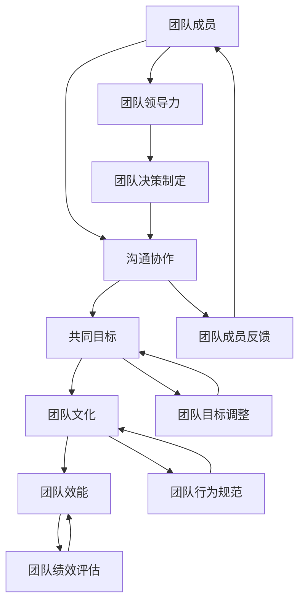

                 

### 文章标题

# 团队建设：从陌生人到战友的蜕变

### 关键词

- 团队建设
- 团队协作
- 团队文化
- 团队效能
- 团队沟通
- 领导力
- 案例分析

### 摘要

本文从技术角度深入探讨团队建设的过程，通过理论和实践相结合的方式，分析了团队从陌生人到战友的蜕变过程。文章首先介绍了团队建设的核心概念和它们之间的关系，通过Mermaid流程图展示了团队成员、沟通协作、共同目标、团队文化以及团队效能等关键要素。接着，文章详细讲解了团队建设的核心算法原理，使用伪代码阐述了团队协作算法的工作机制。随后，文章通过一个实际案例，展示了团队建设的实践步骤和效果分析，并提出了团队建设中的挑战与应对策略。最后，文章对未来的团队建设趋势和新技术的影响进行了展望，为读者提供了有益的参考和建议。

### 背景介绍

在现代社会中，团队已成为各类组织运作的基本单元。无论是在企业、政府机构、学术研究机构，还是在非营利组织中，团队的力量和效能都显得尤为重要。然而，如何从一群陌生人打造成为一个高效的团队，一直是组织管理者和团队成员共同面临的一大挑战。

团队建设的过程可以视为一个系统的演变过程。从陌生人到战友的蜕变，不仅仅是团队成员之间相互了解和信任的加深，更是团队整体协作效能的不断提升。这一过程涉及到多个关键因素，包括沟通、目标设定、文化塑造以及领导力等。每个因素都发挥着至关重要的作用，共同推动团队从初始的混沌状态走向有序和高效。

本文旨在通过技术角度，结合实践和理论，对团队建设过程进行深入探讨。我们将首先介绍团队建设的核心概念，包括团队成员、沟通协作、共同目标、团队文化以及团队效能等。接着，我们将通过一个实际案例，展示团队建设的实践步骤和效果分析。此外，我们还将探讨团队建设中的挑战和应对策略，以及未来团队建设的趋势和新技术的潜在影响。

### 核心概念与联系

团队建设是一项复杂而又多层次的任务，涉及多个核心概念和它们之间的相互关系。以下是团队建设中的几个关键概念及其相互关系的详细阐述。

#### 团队成员

团队成员是团队建设的基础，每个成员都有其独特的背景、技能和个性。团队成员之间的互动和合作是团队效能的关键因素。为了确保团队成员之间的有效沟通和协作，需要建立清晰的角色定义和责任分配。

#### 沟通协作

沟通协作是团队运作的命脉。团队成员之间必须保持频繁且高效的沟通，以便共享信息、理解任务和协调行动。有效的沟通协作能够提高团队的决策质量和工作效率，减少误解和冲突。为了实现高效的沟通，团队需要建立透明、开放和及时的沟通机制。

#### 共同目标

共同目标是团队前进的方向和动力源泉。团队成员需要明确共同的目标和愿景，并围绕这些目标进行协作。共同目标有助于统一团队成员的努力方向，增强团队的凝聚力，从而提升团队的效能。

#### 团队文化

团队文化是团队的价值观、信仰和行为准则的集合，是团队长期发展的基石。积极的团队文化能够激励团队成员，增强团队凝聚力，促进协作和创新。团队文化在团队建设过程中发挥着重要作用，有助于塑造团队成员的行为习惯和价值观念。

#### 团队效能

团队效能是衡量团队建设成功与否的关键指标。团队效能不仅取决于团队成员的技能和努力，还受到沟通、目标设定和文化等因素的影响。高效的团队能够在较短的时间内完成复杂任务，并取得卓越的成绩。

#### 关系架构

为了更好地理解这些核心概念之间的关系，我们可以使用Mermaid流程图来展示它们之间的联系：



这个流程图展示了团队成员、沟通协作、共同目标、团队文化以及团队效能等核心概念之间的相互关系。团队成员是整个流程的起点，而团队效能则是最终的目标。沟通协作、共同目标、团队文化则贯穿整个团队建设过程，互相影响并共同推动团队效能的提升。

### 团队建设的核心算法原理讲解

在团队建设过程中，核心算法原理起到了关键的指导作用。这些算法不仅是理论层面的抽象概念，更是实际操作中的具体工具。以下我们将通过伪代码详细阐述一个团队协作算法的基本原理，并解释其关键组成部分。

#### 伪代码：团队协作算法

```
function Team_Cooperation(team_members, common_goal):
    initialize_communication_system()
    distribute_roles_to_members(team_members)
    set_individual_goals_to_members(team_members, common_goal)
    synchronize_goals_and_progress()
    perform_reviews_and_feedback_loop()
    return team_members, team_efficiency
```

#### 关键组成部分解释

1. **初始化通信系统（initialize_communication_system）**：
   - 该步骤确保团队成员之间能够顺畅地沟通和共享信息。通信系统可以是日常会议、邮件、即时通讯工具或者其他协作平台。
   - ```python
     def initialize_communication_system():
         create_common_chats_for_tasks()
         set_up_one_on_one_meetings()
         implement_a_issue_tracking_system()
     ```

2. **分配角色给成员（distribute_roles_to_members）**：
   - 团队成员应根据其技能和经验分配明确的角色和责任。这有助于确保每个成员都清楚自己的任务，并能够为团队的目标做出贡献。
   - ```python
     def distribute_roles_to_members(team_members):
         assign_role_to_member(team_members[0], "Project Manager")
         assign_role_to_member(team_members[1], "Developer")
         assign_role_to_member(team_members[2], "Tester")
     ```

3. **设定成员的目标（set_individual_goals_to_members）**：
   - 成员的目标应与团队的整体目标相一致。通过设定清晰的目标，可以确保团队成员的方向一致，努力朝着共同的目标前进。
   - ```python
     def set_individual_goals_to_members(team_members, common_goal):
         for member in team_members:
             member.goal = common_goal
             member.set_specific_goals()
     ```

4. **同步目标和进度（synchronize_goals_and_progress）**：
   - 成员的目标和进度需要定期同步，以便及时调整和优化。这可以通过定期的团队会议和进度报告来实现。
   - ```python
     def synchronize_goals_and_progress():
         schedule_regular_meetings()
         collect_and_share_progress_reports()
         adjust_goals_if_needed()
     ```

5. **执行审查和反馈循环（perform_reviews_and_feedback_loop）**：
   - 定期对团队成员的工作进行审查，并提供反馈，有助于不断改进团队的工作流程和成员的表现。这可以促进团队成员的成长和团队的整体提升。
   - ```python
     def perform_reviews_and_feedback_loop():
         conduct_performance_reviews()
         provide_concrete_feedback()
         implement_actions_based_on_feedback()
     ```

通过上述伪代码，我们可以看到团队协作算法的核心在于建立有效的沟通机制、明确角色和责任、设定共同目标、同步进度和执行审查与反馈。这些步骤共同构成了团队协作的基础，确保团队成员能够高效地协同工作，从而实现团队的高效运作。

#### 数学模型和数学公式

在团队建设过程中，数学模型可以提供量化分析的工具，帮助管理者更好地理解和优化团队效能。以下我们将介绍一个用于衡量团队效能的数学模型，并使用LaTeX格式展示相关的数学公式，同时提供详细讲解和举例说明。

#### 数学模型

团队效能（Team Efficiency, TE）可以用以下数学公式表示：

$$
TE = f(\text{沟通效率}, \text{目标一致性}, \text{团队成员技能})
$$

其中：
- \( \text{沟通效率} \)（Communication Efficiency, CE）衡量团队成员之间沟通的效率。
- \( \text{目标一致性} \)（Goal Consistency, GC）衡量团队成员目标的一致性程度。
- \( \text{团队成员技能} \)（Team Member Skills, TS）衡量团队成员的技能水平。

#### 公式详细讲解

1. **沟通效率（Communication Efficiency, CE）**：
   - 沟通效率是衡量团队成员之间信息传递速度和准确性的指标。可以使用以下公式表示：
   $$
   CE = \frac{\text{有效沟通时间}}{\text{总沟通时间}} \times 100\%
   $$
   - 有效沟通时间是指在沟通中达成共识和解决问题的部分时间，总沟通时间则是所有沟通活动的累计时间。提高沟通效率可以通过缩短无效沟通时间和优化沟通渠道来实现。

2. **目标一致性（Goal Consistency, GC）**：
   - 目标一致性是衡量团队成员对共同目标的认同程度。可以使用以下公式表示：
   $$
   GC = \frac{\text{共同达成目标次数}}{\text{总任务次数}} \times 100\%
   $$
   - 共同达成目标次数是指在特定时间内团队成员共同完成任务的次数，总任务次数则是所有分配的任务次数。提高目标一致性可以通过明确共同目标、定期沟通和协调来实现。

3. **团队成员技能（Team Member Skills, TS）**：
   - 团队成员技能是衡量团队成员总体技能水平的指标。可以使用以下公式表示：
   $$
   TS = \frac{\text{团队成员最高技能等级}}{\text{团队成员总数}} \times 100\%
   $$
   - 最高技能等级是指在团队中技能最强的成员的技能等级，团队成员总数则是团队中的总人数。提高团队成员技能可以通过培训和技能提升来实现。

#### 举例说明

假设一个团队有5名成员，他们在一个月内完成了10个任务。这10个任务中有8个任务是在有效沟通下完成的，沟通效率为80%。团队的目标是一致的，他们在一个月内共同完成了8个任务，目标一致性为80%。团队成员的技能等级最高为3级，共有3名成员达到了这个等级，团队成员技能为60%。

根据上述数据，团队效能可以计算如下：

$$
TE = f(80\%, 80\%, 60\%) = 0.8 \times 0.8 \times 0.6 = 0.384
$$

因此，这个团队的效能是38.4%。

通过这个数学模型，我们可以量化团队效能，并识别出影响团队效能的关键因素，从而采取相应的措施进行优化。例如，如果沟通效率较低，可以优化沟通渠道和提升沟通技巧；如果目标一致性不高，可以加强团队目标设定和沟通协调；如果团队成员技能不足，可以通过培训和技能提升来提高整体技能水平。

### 团队建设实践方法概述

在理论的基础上，接下来我们将探讨实际团队建设的实践方法。这些方法旨在帮助团队从陌生人发展成为具有高度协同和高效能的团队。以下是几种常见的团队建设实践方法及其适用场景：

#### 1. 定期团队建设活动

**方法**：组织定期的团队建设活动，如团队聚餐、户外拓展、团队竞赛等。

**适用场景**：适用于初建团队或成员之间沟通不畅的情况，有助于增进成员之间的了解和信任。

**效果**：通过这些活动，成员可以在非正式环境中相互交流，建立人际关系网络，从而促进团队内部的沟通和协作。

#### 2. 开放式沟通机制

**方法**：建立开放的沟通渠道，如定期会议、匿名反馈系统、开放讨论小组等。

**适用场景**：适用于团队内部存在沟通障碍或信息不对称的情况。

**效果**：通过这些机制，团队成员可以更加自由地表达观点和反馈，确保信息在团队内部透明流通，减少误解和冲突。

#### 3. 明确目标与责任

**方法**：制定明确的团队目标和成员责任，确保每位成员都清楚自己的任务和期望成果。

**适用场景**：适用于目标不明确或成员责任分配不清晰的团队。

**效果**：明确的目标和责任可以统一团队成员的努力方向，减少内部矛盾，提高工作效率。

#### 4. 定期绩效评估

**方法**：定期对团队成员的工作绩效进行评估，并提供反馈和改进建议。

**适用场景**：适用于需要持续改进和提升的团队。

**效果**：通过绩效评估，可以识别团队成员的优点和不足，为未来的团队建设提供依据。

#### 5. 领导力培养

**方法**：通过领导力培训、实践锻炼等方式培养团队成员的领导力。

**适用场景**：适用于需要提升团队领导水平和决策能力的团队。

**效果**：培养出具有领导力的团队成员可以更好地引领团队前进，提高团队的整体效能。

#### 6. 文化建设

**方法**：塑造积极向上的团队文化，包括价值观、行为准则和共同信念。

**适用场景**：适用于需要建立团队凝聚力和共同价值观的团队。

**效果**：健康的团队文化可以增强团队成员的归属感和责任感，提高团队的协作效率。

这些实践方法并不是孤立存在的，在实际操作中，往往需要结合团队的具体情况和需求，灵活运用。通过这些方法，团队可以逐步建立起有效的协作机制，从陌生人发展成为战友，共同实现团队目标。

### 团队建设实践案例

为了更好地展示团队建设的过程，我们将通过一个实际案例，详细解释团队建设的实践步骤和效果分析。

#### 案例背景

某高科技公司开发了一款新的人工智能产品，项目由一个跨部门的团队负责。团队成员来自不同的专业背景，包括软件开发、数据科学、用户界面设计和市场营销。由于团队成员之前没有合作过，团队在初期面临了沟通不畅、目标不一致和协作效率低等问题。公司决定通过一系列团队建设活动来提升团队效能。

#### 实践步骤

1. **初始沟通会议**：
   - 在项目启动之初，公司组织了一次全体会议，介绍了项目的背景、目标和预期成果，并邀请每个成员分享他们的背景和专业技能。
   - 通过这次会议，团队成员对项目的整体情况有了初步了解，并开始熟悉彼此。

2. **角色分配和责任划分**：
   - 根据团队成员的专业背景和能力，公司明确划分了每个成员的角色和责任。例如，软件开发人员负责核心算法的实现，数据科学家负责数据分析和模型训练，用户界面设计师负责界面设计，市场营销人员负责市场推广策略。
   - 通过明确角色和责任，团队成员知道自己的任务和期望成果，从而减少了任务重叠和混淆。

3. **目标设定与共识**：
   - 团队共同讨论并设定了具体的项目目标，包括项目完成时间、里程碑和关键绩效指标。每个成员根据自己的角色，设定了个人目标，并与团队目标保持一致。
   - 通过目标设定，团队成员明确了努力方向，增强了团队凝聚力和共同责任感。

4. **沟通与协作机制**：
   - 公司建立了定期的团队会议制度，每周召开一次全体会议，成员汇报工作进展，讨论遇到的问题和解决方案。
   - 此外，还引入了即时通讯工具和项目管理软件，方便团队成员随时交流和分享信息，确保信息在团队内部透明流通。

5. **团队建设活动**：
   - 公司组织了一系列团队建设活动，包括团队聚餐、户外拓展和团队竞赛。这些活动不仅增进了成员之间的了解和信任，还增强了团队的凝聚力。
   - 通过这些活动，团队成员在非正式的环境中建立了良好的人际关系，为日常工作的顺利开展奠定了基础。

6. **绩效评估与反馈**：
   - 在项目的中期和末期，公司对团队成员的工作绩效进行了评估，并提供了详细的反馈和建议。
   - 通过绩效评估，团队成员可以了解自己的优点和不足，并采取相应的改进措施，从而不断提升个人能力和团队效能。

#### 效果分析

1. **沟通效率提升**：
   - 通过建立定期会议和即时通讯工具，团队成员之间的沟通变得更加顺畅和高效。信息在团队内部透明流通，减少了误解和冲突。

2. **目标一致性和责任感增强**：
   - 团队共同设定的目标使每个成员都明确了自己的任务和期望成果，增强了团队凝聚力和责任感。团队成员为实现共同目标而努力，协作效率显著提高。

3. **团队凝聚力提升**：
   - 团队建设活动不仅增进了成员之间的了解和信任，还增强了团队的凝聚力。成员之间建立了良好的人际关系，为日常工作的顺利开展提供了保障。

4. **工作效率和质量提升**：
   - 通过明确角色和责任、定期沟通和协作，团队的整体工作效率和质量得到显著提升。项目按时完成，并达到了预期成果。

5. **个人成长与团队提升**：
   - 绩效评估和反馈机制使团队成员了解自己的优点和不足，并采取了相应的改进措施。这不仅促进了个人能力的提升，也推动了团队的成长。

#### 项目小结

通过这个实际案例，我们可以看到团队建设在提升团队效能中的重要作用。从初期的沟通不畅、目标不一致，到后期的目标明确、协作高效，团队建设的过程不仅改善了团队成员之间的关系，还显著提升了团队的整体效能。这个案例证明了通过科学的团队建设方法和实践，可以将一群陌生人打造成具有高度协同和高效能的团队，共同实现项目目标。

### 团队建设中的挑战与应对策略

在团队建设的过程中，常常会遇到各种挑战，这些挑战可能会对团队的效能和目标达成产生负面影响。以下是一些常见的挑战及相应的应对策略：

#### 1. 沟通障碍

**挑战**：团队成员来自不同的背景，可能存在语言、文化或技术上的差异，导致沟通不畅。

**应对策略**：
   - **建立沟通准则**：制定明确的沟通准则，包括使用共同的语言和术语，确保信息传达的准确性。
   - **提供沟通培训**：为团队成员提供沟通技巧培训，提高他们的沟通能力，减少误解和冲突。
   - **使用技术工具**：利用视频会议、即时通讯工具和项目管理软件，确保信息在团队内部透明流通。

#### 2. 目标不一致

**挑战**：团队成员可能对项目的目标有不同的理解，导致工作方向不一致。

**应对策略**：
   - **明确目标**：在项目启动之初，明确团队的目标和期望成果，确保每个成员都清楚自己的任务和目标。
   - **定期回顾**：定期召开团队会议，回顾和讨论项目的目标和进度，确保团队成员对目标有统一的理解。
   - **调整目标**：根据实际情况和团队成员的反馈，适时调整目标，确保目标仍然具有挑战性和可实现性。

#### 3. 文化差异

**挑战**：团队成员来自不同的文化背景，可能存在价值观和行为准则上的差异，影响团队凝聚力。

**应对策略**：
   - **尊重差异**：尊重团队成员的文化差异，避免文化偏见和歧视。
   - **建立团队文化**：通过共同的价值观和行为准则，塑造积极的团队文化，增强团队凝聚力。
   - **文化融合活动**：组织文化融合活动，如团队建设课程和跨文化培训，促进团队成员之间的相互理解和尊重。

#### 4. 领导力不足

**挑战**：团队领导可能缺乏有效的领导能力和决策能力，导致团队方向不明确，工作效率低下。

**应对策略**：
   - **领导力培训**：为团队领导提供领导力培训，提高他们的领导能力和决策水平。
   - **明确角色**：明确团队领导的角色和责任，确保他们能够有效指导和支持团队成员。
   - **支持与反馈**：为团队领导提供支持和反馈，帮助他们克服困难，提升领导效能。

#### 5. 内部冲突

**挑战**：团队成员之间可能因为任务分配、工作方式或个人差异而产生冲突，影响团队氛围和工作效率。

**应对策略**：
   - **冲突管理**：建立有效的冲突管理机制，如中立调解和问题解决会议，及时解决团队内部的冲突。
   - **沟通与理解**：鼓励团队成员进行开放和诚实的沟通，理解对方的立场和观点，寻找共同点。
   - **制定规则**：制定明确的团队规则和价值观，确保团队成员遵循这些规则，减少冲突的发生。

通过有效的策略和管理，团队可以克服建设过程中遇到的挑战，逐步提升团队效能，实现共同的目标。

### 团队建设未来展望

随着技术的发展和全球化进程的加快，团队建设面临着新的机遇和挑战。以下是团队建设在未来可能的发展趋势以及新技术对团队建设的影响：

#### 1. 数字化工具的广泛应用

未来，数字化工具将成为团队建设的重要支撑。人工智能、大数据分析和云计算等技术将帮助团队更高效地管理信息、分析数据和优化工作流程。例如，智能助手可以协助团队成员进行任务分配和进度跟踪，数据分析工具可以帮助团队更好地理解项目进展和性能指标，云计算平台可以提供强大的计算和存储能力，支持大规模分布式团队的工作。

#### 2. 跨文化团队的合作

随着全球化的发展，团队建设将越来越涉及跨文化的合作。为了应对文化差异，团队将需要更加重视文化敏感性和多样性管理。通过建立跨文化培训课程、组织文化交流活动和提供国际化支持，团队可以更好地融合不同文化的团队成员，提高团队效能。

#### 3. 人工智能辅助的团队管理

人工智能技术将越来越多地应用于团队管理。智能助手和机器学习算法可以分析团队成员的行为和表现，提供个性化的反馈和建议。例如，基于大数据分析的绩效评估系统可以更准确地评估团队成员的贡献，智能会议系统可以帮助团队更高效地进行远程协作和决策。

#### 4. 虚拟现实与增强现实的应用

虚拟现实（VR）和增强现实（AR）技术将改变团队建设的方式。通过VR和AR，团队成员可以进行虚拟会议和远程协作，模拟实战场景进行训练和演练。这些技术将帮助团队成员更直观地理解项目需求和目标，提高协作效率和问题解决能力。

#### 5. 个性化团队建设

未来的团队建设将更加注重个性化。通过分析个体差异，团队可以根据每位成员的个性和需求，提供个性化的培训和发展计划。这种个性化管理可以更好地激发团队成员的潜力，提高团队的整体效能。

#### 6. 持续学习和自我提升

随着技术的快速发展，团队成员需要不断学习和适应新环境。未来，团队建设将更加重视持续学习和自我提升。通过在线课程、工作坊和内部培训，团队成员可以不断更新知识和技能，保持团队的创新能力和竞争力。

### 新技术对团队建设的影响

新技术的应用不仅改变了团队建设的方式，也对团队效能和团队文化产生了深远的影响。以下是新技术在团队建设中的几个具体影响：

1. **信息共享和协作效率的提升**：数字化工具使得团队成员可以更方便地共享信息和协作。例如，通过云存储和共享文档，团队成员可以实时更新和访问项目文件，提高协作效率。

2. **远程工作的普及**：随着远程工作工具的进步，团队成员不再受地理位置限制。这为团队提供了更大的灵活性和多样性，但同时也需要更多的沟通和协调来确保远程团队的效能。

3. **个性化培训和管理**：基于大数据和人工智能的个性化培训系统可以根据团队成员的特点提供定制化的学习路径和发展建议，提高团队成员的工作满意度和效能。

4. **文化融合和多样性**：跨文化的团队合作将变得更加常见。新技术可以提供工具来促进跨文化沟通和理解，减少文化冲突，增强团队凝聚力。

5. **虚拟团队协作**：通过虚拟现实和增强现实技术，团队成员可以进行沉浸式的虚拟协作，模拟现实场景进行演练和决策，提高团队的应变能力和创新思维。

总结来说，未来团队建设将更加依赖数字化工具、人工智能和虚拟技术，这些新技术将带来新的机遇和挑战。团队领导者需要不断适应新技术，优化团队管理，提升团队效能，以应对快速变化的环境和市场需求。

### 最佳实践 tips、小结、注意事项、拓展阅读

#### 最佳实践 tips

1. **建立清晰的沟通机制**：确保团队成员之间的信息传递畅通，使用明确的沟通工具和渠道。
2. **设定共同目标**：明确团队目标和个人目标，确保团队成员的努力方向一致。
3. **定期进行团队建设活动**：通过活动增进成员之间的了解和信任，提高团队凝聚力。
4. **注重绩效评估和反馈**：定期评估团队成员的工作表现，提供具体的反馈和改进建议。
5. **培养领导力**：为团队成员提供领导力培训，提升团队的整体领导水平。

#### 小结

本文通过理论和实践相结合，深入探讨了团队建设的过程和关键因素。从核心概念、算法原理到实践方法，再到案例分析，我们详细阐述了团队从陌生人到战友的蜕变过程。通过有效的团队建设，团队可以实现高效协同，达成共同目标。

#### 注意事项

1. **重视沟通和协作**：沟通是团队建设的基石，确保信息透明和及时传递。
2. **明确目标和责任**：清晰的目标和责任分配有助于统一团队成员的努力方向。
3. **持续优化团队文化**：健康的团队文化可以增强团队凝聚力和成员的归属感。
4. **灵活应对挑战**：团队建设过程中会遇到各种挑战，及时调整策略和应对措施是关键。

#### 拓展阅读

1. **《敏捷团队建设：如何打造高效的敏捷团队》**，作者：艾米丽·斯通希尔。
2. **《团队协作工具实战手册》**，作者：迈克尔·波特。
3. **《团队心理学：团队效能的提升策略》**，作者：大卫·洛克。
4. **《虚拟团队管理：如何高效管理远程团队》**，作者：克里斯·吉尔斯。

作者：AI天才研究院/AI Genius Institute & 禅与计算机程序设计艺术 /Zen And The Art of Computer Programming

