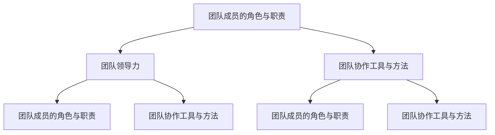
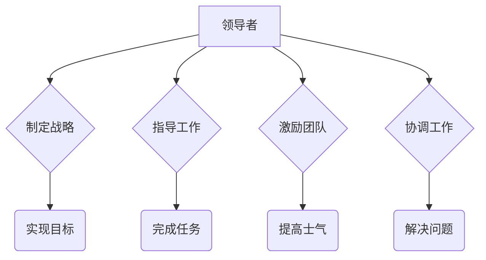
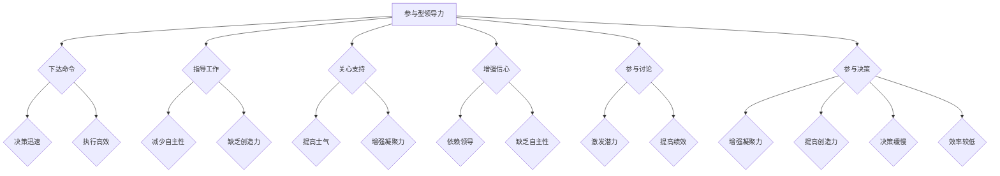
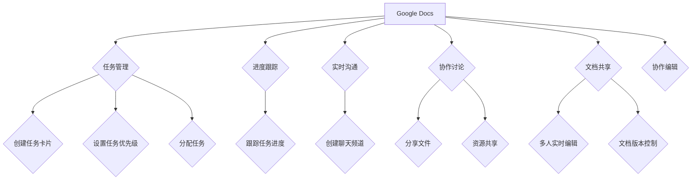
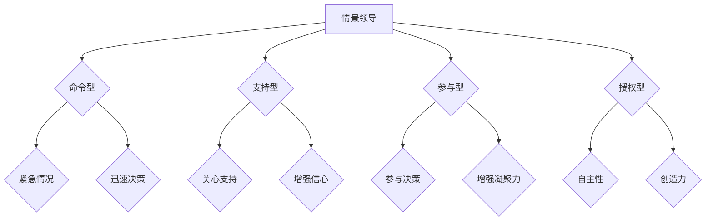
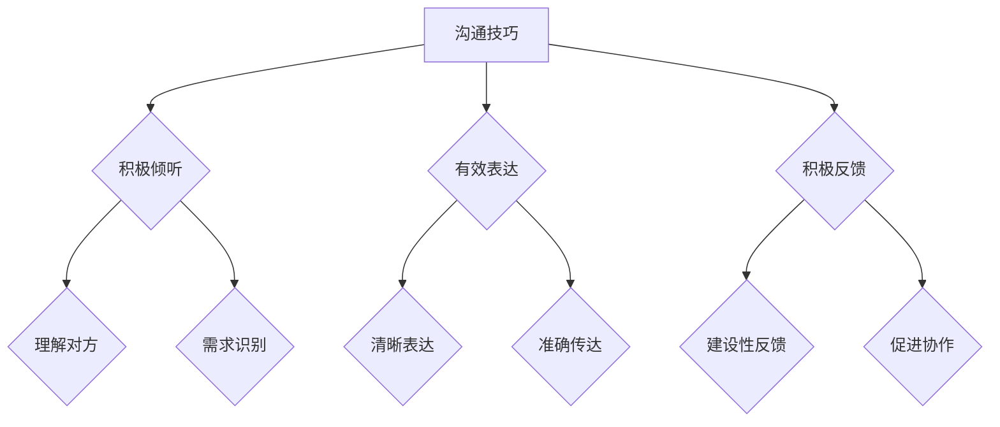
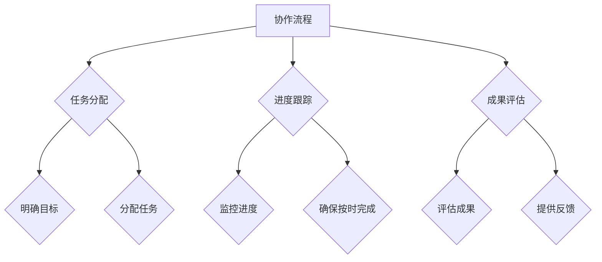

                 

### 文章标题

# 团队建设：打造高效团队的秘诀

> 关键词：团队建设、高效团队、领导力、协作、数字化

> 摘要：本文深入探讨团队建设的重要性及其核心概念，从团队成员的角色与职责、团队领导力、团队协作工具与方法等方面进行详细分析。同时，通过实际案例和实战经验，总结出打造高效团队的最佳实践，以帮助企业和团队管理者在数字化时代提升团队绩效和竞争力。

## 第一部分：团队建设概述

### 第1章：团队建设的重要性

#### 1.1 团队建设的定义与目标

团队建设是指通过一系列策略和方法，将团队成员整合成一个高效协同的整体，以实现共同的目标。一个高效的团队不仅能够提高工作效率，还能增强团队成员的凝聚力和归属感。

团队建设的目标主要包括：

- 提高团队绩效
- 增强团队协作和沟通
- 培养团队成员的领导力和创新能力
- 提升团队的适应能力和灵活性

#### 1.2 团队建设的四个维度

团队建设可以从以下四个维度进行：

1. **团队成员**：选择合适的团队成员，确保团队成员具备必要的技能和素质，以及团队成员之间的互补性。

2. **团队结构**：构建合理的团队结构，明确团队成员的角色和职责，确保团队内部的协作和沟通顺畅。

3. **团队文化**：建立积极向上的团队文化，促进团队成员之间的信任和尊重，增强团队的凝聚力和归属感。

4. **团队发展**：关注团队成员的职业发展和个人成长，提供必要的培训和发展机会，激发团队成员的潜力和创造力。

#### 1.3 团队建设的挑战与应对策略

团队建设过程中，可能会遇到以下挑战：

- **沟通障碍**：团队成员之间存在沟通不畅的问题，导致信息传递不畅和误解。
- **协作困难**：团队成员之间的协作不顺畅，难以形成合力。
- **角色冲突**：团队成员在职责和角色上存在冲突，影响团队的正常运转。
- **管理难度**：团队规模扩大或团队成员增加，管理难度加大。

应对策略：

- **加强沟通**：建立有效的沟通机制，确保信息畅通无阻。
- **优化协作**：引入协作工具和方法，提高团队协作效率。
- **明确角色**：明确团队成员的角色和职责，避免角色冲突。
- **加强管理**：采用科学的管理方法，提高团队管理效能。

## 第二部分：团队建设核心概念

### 第2章：团队成员的角色与职责

#### 2.1 团队成员的角色

团队成员的角色主要包括：

- **领导者**：负责团队的战略规划、决策和指导，带领团队实现目标。
- **执行者**：负责执行团队的决策和计划，完成任务。
- **协作者**：负责协调团队成员之间的工作，确保团队协作顺畅。

#### 2.2 团队成员的职责

团队成员的职责应该明确具体，主要包括：

- **任务分配**：根据团队成员的特长和优势，合理分配任务。
- **进度跟踪**：监控任务进度，确保任务按时完成。
- **成果评估**：对团队成员的工作成果进行评估，提供反馈。

#### 2.3 团队成员之间的沟通与协作

团队成员之间的沟通与协作是团队建设的关键。以下是一些沟通与协作的技巧：

- **定期会议**：定期召开团队会议，讨论团队目标和进展。
- **共享信息**：确保团队成员能够及时获取到必要的信息。
- **明确目标**：明确团队的目标和任务，避免团队成员的困惑和重复劳动。
- **协作工具**：使用协作工具，提高团队协作效率。

### 第3章：团队领导力

#### 3.1 领导力的定义与类型

领导力是指领导者通过影响和激励团队成员，实现团队目标的能力。领导力可以分为以下几种类型：

- **指挥型领导力**：通过下达命令和指示，指导团队成员完成任务。
- **支持型领导力**：通过关心和支持团队成员，增强团队成员的信心和动力。
- **参与型领导力**：通过参与团队成员的讨论和决策，提高团队的凝聚力和创造力。

#### 3.2 团队领导者的角色与职责

团队领导者的角色和职责主要包括：

- **制定战略**：制定团队的发展战略和目标。
- **指导团队**：指导团队成员完成任务，提供必要的支持。
- **沟通协调**：确保团队内部的信息畅通和协作。
- **激励团队**：激发团队成员的潜力，提升团队绩效。

#### 3.3 领导者如何激励团队

领导者可以通过以下方法激励团队：

- **明确目标**：明确团队的目标和任务，确保团队成员明确自己的职责和期望。
- **认可成就**：及时认可团队成员的成就和贡献，提高团队成员的积极性。
- **提供反馈**：提供具体的反馈和建议，帮助团队成员改进工作。
- **创造机会**：为团队成员提供成长和发展的机会，激发团队成员的潜力。

### 第4章：团队协作工具与方法

#### 4.1 团队协作工具

团队协作工具主要包括以下几类：

- **项目管理工具**：如Trello、Asana等，用于任务管理和进度跟踪。
- **沟通工具**：如Slack、Microsoft Teams等，用于实时沟通和协作。
- **文档管理工具**：如Google Docs、Notion等，用于文档共享和协作编辑。

#### 4.2 团队协作方法

团队协作方法主要包括以下几种：

- **情景领导**：根据团队所处的不同阶段和成员的不同需求，采用不同的领导风格。
- **沟通技巧**：如主动倾听、有效表达、积极反馈等，提高沟通效果。
- **协作流程**：建立规范的协作流程，确保团队协作有序、高效。

#### 4.3 团队协作案例分析

在本章的最后，我们将通过一个实际案例，分析团队协作的成功经验和教训，以便读者更好地理解和应用团队协作方法。

## 第三部分：团队建设实践

### 第5章：团队建设项目实战

#### 5.1 项目背景

在本章中，我们将以一个实际项目为例，介绍团队建设的过程和方法。该项目是一个企业级的软件开发项目，旨在为企业提供一个全新的业务管理平台。

#### 5.2 项目团队构建

在项目启动阶段，我们首先进行团队成员的招募和选拔。团队成员包括项目经理、开发人员、测试人员、UI设计师等。我们根据项目需求和团队成员的特长，合理分配角色和职责。

#### 5.3 项目实施与监控

在项目实施过程中，我们采用敏捷开发方法，以迭代的方式进行项目开发。每个迭代周期为两周，每个周期结束后，我们进行评估和调整。

- **任务分配**：在每个迭代开始前，项目经理根据项目需求和团队成员的特长，分配任务。
- **进度跟踪**：项目经理使用项目管理工具监控任务进度，确保任务按时完成。
- **团队协作**：团队成员使用协作工具进行日常沟通和协作，确保团队协作顺畅。

#### 5.4 项目总结与评估

在项目完成后，我们进行项目总结和评估。通过评估，我们发现：

- **成功经验**：团队协作高效，任务按时完成，项目质量得到保证。
- **不足之处**：部分团队成员的沟通和协作还有待提高，部分任务进度存在延误。

#### 5.5 项目小结

通过本项目的实施，我们总结出以下经验教训：

- **明确目标**：项目启动阶段，明确项目目标和任务，确保团队成员明确自己的职责。
- **合理分工**：根据团队成员的特长和项目需求，合理分配角色和职责。
- **高效协作**：采用协作工具和方法，提高团队协作效率。
- **定期评估**：定期进行项目评估，及时发现问题并进行调整。

### 第6章：团队建设中的问题与解决

#### 6.1 团队冲突管理

团队冲突是团队建设中的常见问题。以下是一些解决策略：

- **识别冲突**：了解团队成员的需求和期望，识别潜在的冲突点。
- **沟通协商**：通过沟通和协商，解决冲突。
- **中立调解**：在冲突无法自行解决时，寻求中立调解。

#### 6.2 团队成员激励与成长

团队成员的激励和成长对团队建设至关重要。以下是一些激励和成长策略：

- **认可成就**：及时认可团队成员的成就和贡献。
- **提供培训**：为团队成员提供培训和发展机会。
- **职业规划**：为团队成员制定职业规划，明确职业发展路径。

#### 6.3 团队绩效评估与改进

团队绩效评估是团队建设的重要环节。以下是一些评估和改进策略：

- **明确指标**：制定明确的绩效评估指标。
- **定期评估**：定期进行绩效评估，收集反馈和建议。
- **持续改进**：根据评估结果，持续改进团队工作。

### 第7章：团队建设案例分析

在本章中，我们将通过两个实际案例，分析团队建设中的成功经验和教训。

#### 7.1 案例一：某企业团队建设实践

该企业在团队建设方面取得了显著成效，其成功经验主要包括：

- **明确目标**：企业高层明确项目目标和任务，确保团队成员明确自己的职责。
- **高效协作**：采用敏捷开发方法，提高团队协作效率。
- **激励成长**：为团队成员提供培训和发展机会，激发团队成员的潜力。

#### 7.2 案例二：某创业团队建设实践

该创业团队在团队建设方面面临一些挑战，但通过努力，取得了一定的进展。其教训主要包括：

- **沟通不畅**：团队成员之间的沟通不畅，导致信息传递不畅和误解。
- **角色冲突**：团队成员在职责和角色上存在冲突，影响团队的正常运转。
- **管理难度**：团队规模扩大，管理难度加大。

#### 7.3 案例分析总结

通过以上两个案例，我们可以总结出以下经验教训：

- **明确目标**：明确团队目标和任务，确保团队成员明确自己的职责。
- **高效协作**：采用合适的协作工具和方法，提高团队协作效率。
- **激励成长**：为团队成员提供培训和发展机会，激发团队成员的潜力。
- **及时沟通**：加强团队内部沟通，确保信息畅通无阻。
- **合理分工**：根据团队成员的特长和项目需求，合理分配角色和职责。
- **持续改进**：根据团队绩效评估结果，持续改进团队工作。

## 第四部分：团队建设未来趋势

### 第8章：数字化时代团队建设

在数字化时代，团队建设面临着新的机遇和挑战。以下是一些数字化时代团队建设的关键趋势：

- **数字化工具的应用**：使用数字化工具，如项目管理软件、协作平台等，提高团队协作效率。
- **远程办公的普及**：随着远程办公的普及，团队建设需要适应远程协作的需求。
- **数据驱动的决策**：利用数据分析，指导团队建设和管理工作。
- **数字化技能的培养**：培养团队成员的数字化技能，提高团队的竞争力。

### 附录

#### 附录A：团队建设资源与工具推荐

在本附录中，我们推荐了一些团队建设相关的资源与工具，包括：

- **书籍**：《团队的五种性格》、《团队协作的艺术》等
- **工具**：Trello、Slack、Google Docs等
- **在线课程**：Coursera、Udemy等平台上的团队建设课程

#### 附录B：团队建设相关书籍与论文推荐

在本附录中，我们推荐了一些团队建设相关的书籍与论文，包括：

- **书籍**：《团队协作的艺术》、《敏捷团队管理》等
- **论文**：《团队建设：理论与实践》、《数字化时代团队建设研究》等

#### 附录C：团队建设实用技巧与建议

在本附录中，我们提供了一些团队建设实用技巧与建议，包括：

- **沟通技巧**：积极倾听、有效表达、积极反馈
- **协作技巧**：明确目标、共享信息、分工合作
- **激励技巧**：认可成就、提供反馈、创造机会

### 作者信息

作者：AI天才研究院/AI Genius Institute & 禅与计算机程序设计艺术 /Zen And The Art of Computer Programming

本文结合团队建设的核心概念和实践经验，详细分析了团队建设的重要性和方法，旨在帮助企业和团队管理者在数字化时代打造高效团队，提升团队绩效和竞争力。

### 背景介绍

在当今快速变化的商业环境中，团队建设已经成为企业成功的关键因素之一。高效团队不仅能够在项目实施过程中迅速响应变化，还能在复杂的问题解决中发挥集体智慧。团队建设的重要性体现在多个方面：

首先，团队建设有助于提高团队绩效。通过合理分工和协作，团队成员可以充分发挥各自的优势，实现工作的高效完成。其次，团队建设可以增强团队成员之间的沟通和协作，减少误解和冲突，提升团队的整体运作效率。此外，团队建设还有助于培养团队成员的领导力和创新能力，提高团队的适应能力和灵活性。

为了深入了解团队建设的核心概念和方法，我们需要从多个维度进行分析。首先，团队成员的角色与职责是团队建设的基础。明确团队成员的角色和职责，有助于确保团队成员在工作中的分工和协作。其次，团队领导力是团队建设的核心。一个优秀的团队领导者能够激发团队成员的潜力，提升团队的绩效。最后，团队协作工具与方法在数字化时代尤为重要，它们能够帮助团队成员实现高效协同。

本文将从团队建设的重要性、核心概念、实践方法等多个方面进行详细分析，旨在为企业和团队管理者提供一套实用的团队建设指南。

### 核心概念与联系

团队建设的核心概念包括团队成员的角色与职责、团队领导力、团队协作工具与方法等。这些概念相互联系，共同构成了团队建设的基础。

首先，团队成员的角色与职责是团队建设的基础。团队成员的角色可以分为领导者、执行者和协作者。领导者负责制定团队的战略和目标，指导团队成员完成任务。执行者负责执行团队的决策和计划，完成任务。协作者负责协调团队成员之间的工作，确保团队协作顺畅。

其次，团队领导力是团队建设的核心。领导力可以分为指挥型领导力、支持型领导力和参与型领导力。指挥型领导力强调下达命令和指导，支持型领导力强调关心和支持团队成员，参与型领导力强调参与团队成员的讨论和决策。团队领导者需要根据团队的不同阶段和成员的不同需求，灵活运用不同的领导风格。

最后，团队协作工具与方法是团队建设的重要组成部分。协作工具如Trello、Slack和Google Docs等，可以大大提高团队成员之间的协作效率。协作方法如情景领导、沟通技巧和协作流程，可以帮助团队更好地实现目标。

以下是团队成员的角色与职责、团队领导力、团队协作工具与方法之间的联系架构：



#### 团队成员的角色与职责

团队成员的角色与职责是团队建设的基础。一个明确的角色和职责分配，有助于确保团队成员在工作中的分工和协作。团队成员的角色可以分为领导者、执行者和协作者。

**领导者**：领导者负责团队的战略规划、决策和指导。他们需要制定团队的愿景和目标，指导团队成员完成任务。领导者的职责包括：

- 制定团队目标和战略
- 指导团队成员的工作
- 激励团队成员，提高团队士气
- 协调团队成员之间的工作

**执行者**：执行者负责执行团队的决策和计划，完成任务。执行者的职责包括：

- 完成分配的任务
- 按时提交工作成果
- 与其他团队成员协作，确保任务顺利完成

**协作者**：协作者负责协调团队成员之间的工作，确保团队协作顺畅。协作者的职责包括：

- 协调团队成员之间的工作，解决协作中的问题
- 保证信息在团队成员之间的有效传递
- 提供必要的支持，帮助团队成员完成任务

以下是团队成员的角色与职责的Mermaid流程图：



#### 团队领导力

团队领导力是团队建设的核心。一个优秀的团队领导者能够激发团队成员的潜力，提升团队的绩效。团队领导力可以分为指挥型领导力、支持型领导力和参与型领导力。

**指挥型领导力**：指挥型领导力强调下达命令和指导。领导者通过明确的指示和命令，指导团队成员完成任务。指挥型领导力的优点是决策迅速，执行高效。缺点是可能导致团队成员缺乏自主性和创造力。

**支持型领导力**：支持型领导力强调关心和支持团队成员。领导者通过关心和支持，增强团队成员的信心和动力。支持型领导力的优点是能够提升团队成员的士气，增强团队的凝聚力。缺点是可能导致团队成员过于依赖领导者，缺乏自主性。

**参与型领导力**：参与型领导力强调参与团队成员的讨论和决策。领导者通过参与讨论和决策，提高团队的凝聚力和创造力。参与型领导力的优点是能够激发团队成员的潜力，提升团队的绩效。缺点是决策过程可能较慢，效率较低。

以下是团队领导力的Mermaid流程图：



#### 团队协作工具与方法

团队协作工具与方法是团队建设的重要组成部分。在现代数字化时代，团队协作工具如Trello、Slack和Google Docs等，已经成为团队协作的必备工具。

**Trello**：Trello是一款基于看板的项目管理工具，适用于任务管理和进度跟踪。团队成员可以通过Trello创建任务卡片，设置任务优先级，分配任务给团队成员，并跟踪任务进度。

**Slack**：Slack是一款即时通讯工具，适用于团队成员之间的实时沟通和协作。团队成员可以在Slack中创建不同的聊天频道，讨论项目进展，分享文件和资源。

**Google Docs**：Google Docs是一款在线文档协作工具，适用于团队成员之间的文档共享和协作编辑。团队成员可以在Google Docs中实时编辑文档，实现多人协作。

以下是团队协作工具的Mermaid流程图：



#### 团队协作方法

团队协作方法包括情景领导、沟通技巧和协作流程等。

**情景领导**：情景领导是一种根据团队所处阶段和成员需求，灵活运用不同领导风格的团队管理方法。情景领导可以分为四种模式：命令型、支持型、参与型和授权型。

- **命令型**：适用于团队处于紧急情况或需要迅速决策时。
- **支持型**：适用于团队成员需要关心和支持时。
- **参与型**：适用于团队成员需要参与决策时。
- **授权型**：适用于团队成员需要自主性和创造力时。

以下是情景领导的Mermaid流程图：



**沟通技巧**：有效的沟通是团队协作的关键。沟通技巧包括积极倾听、有效表达和积极反馈。

- **积极倾听**：倾听对方观点，理解对方需求。
- **有效表达**：清晰、准确地表达自己的观点和需求。
- **积极反馈**：给予对方建设性的反馈，促进团队协作。

以下是沟通技巧的Mermaid流程图：



**协作流程**：协作流程是团队协作的规范化流程，包括任务分配、进度跟踪和成果评估等。

- **任务分配**：明确任务目标，分配任务给合适的团队成员。
- **进度跟踪**：监控任务进度，确保任务按时完成。
- **成果评估**：对任务成果进行评估，提供反馈和建议。

以下是协作流程的Mermaid流程图：



通过以上对团队成员的角色与职责、团队领导力、团队协作工具与方法等核心概念的分析，我们可以看到这些概念之间的密切联系。团队成员的角色与职责是团队建设的基础，团队领导力是团队建设的核心，团队协作工具与方法是实现团队协作的关键。这些核心概念相互关联，共同构成了团队建设的基础架构，为打造高效团队提供了理论支持。

### 核心算法原理讲解

在团队建设过程中，算法原理可以用来优化团队成员的分工和协作，提高团队的整体效率。以下是一个基于团队分工和协作的算法原理讲解，包括步骤、伪代码和数学模型。

#### 算法原理

该算法旨在根据团队成员的技能和任务需求，实现最优的团队分工和协作。核心思想是通过计算每个团队成员的技能与任务需求之间的匹配度，将任务合理分配给合适的团队成员。

#### 步骤

1. **数据收集**：收集团队成员的技能数据（如编程语言、项目经验等）和任务需求数据（如项目需求、任务优先级等）。
2. **匹配度计算**：计算每个团队成员与每个任务的匹配度，匹配度可以通过一个评分系统来衡量，如基于技能点数、项目经验等。
3. **任务分配**：根据匹配度，将任务分配给评分最高的团队成员。
4. **协作优化**：优化团队成员之间的协作，确保任务完成的高效性和准确性。

#### 伪代码

```python
# 数据结构定义
团队成员 = [
    {'姓名': '张三', '技能': ['Python', 'Java'], '经验': 5},
    {'姓名': '李四', '技能': ['C++', 'JavaScript'], '经验': 3},
    ...
]

任务需求 = [
    {'任务名': '项目A', '需求技能': ['Python', 'Java'], '优先级': '高'},
    {'任务名': '项目B', '需求技能': ['C++', 'JavaScript'], '优先级': '中'},
    ...
]

# 匹配度计算函数
def calculate_match(team_member, task):
    match_score = 0
    for skill in task['需求技能']:
        if skill in team_member['技能']:
            match_score += 1
    return match_score

# 任务分配函数
def assign_tasks(team_members, tasks):
    assigned_tasks = []
    for task in tasks:
        max_match = 0
        best_member = None
        for member in team_members:
            match = calculate_match(member, task)
            if match > max_match:
                max_match = match
                best_member = member
        assigned_tasks.append({'任务': task['任务名'], '成员': best_member['姓名']})
    return assigned_tasks

# 主程序
team_members = get_team_members()
tasks = get_tasks()
assigned_tasks = assign_tasks(team_members, tasks)
print(assigned_tasks)
```

#### 数学模型

假设团队成员的技能和任务需求可以用向量表示，我们可以使用向量相似度（如余弦相似度）来计算匹配度。数学模型如下：

$$
\text{匹配度} = \frac{\text{技能交集大小}}{\text{技能并集大小}}
$$

其中，技能交集大小表示团队成员技能和任务需求中共同具备的技能数量，技能并集大小表示团队成员技能和任务需求中所有技能的总数量。

#### 举例说明

假设有两个团队成员和一个任务需求：

- 张三：技能 {'Python', 'Java'}，经验 5 年
- 李四：技能 {'C++', 'JavaScript'}，经验 3 年
- 任务需求：需求技能 {'Python', 'Java', 'C++'}，优先级 '高'

计算匹配度：

- 张三匹配度：$\frac{2}{3} = 0.67$
- 李四匹配度：$\frac{1}{3} = 0.33$

根据匹配度分配任务，任务应分配给张三，因为他的匹配度更高。

### 数学公式

在本节中，我们将使用LaTeX格式嵌入数学公式，并详细讲解相关公式。

$$
\text{匹配度} = \frac{\sum_{i=1}^{n} (\text{团队成员技能}_i \cap \text{任务需求技能}_i)}{\sum_{i=1}^{n} (\text{团队成员技能}_i \cup \text{任务需求技能}_i)}
$$

这个公式表示匹配度，其中 $n$ 是团队成员技能和任务需求中的技能数量。$\text{团队成员技能}_i$ 和 $\text{任务需求技能}_i$ 分别表示团队成员 $i$ 的技能和任务需求的技能。$\cap$ 表示交集，$\cup$ 表示并集。

#### 详细讲解

该公式通过计算团队成员技能与任务需求技能的交集和并集的大小，来确定匹配度。具体来说：

- 交集大小表示团队成员能够胜任的任务需求技能的数量。
- 并集大小表示团队成员和任务需求所涵盖的所有技能的总数。

通过这个公式，我们可以量化每个团队成员对每个任务需求的匹配程度，从而实现任务的合理分配。

#### 举例说明

假设有四个团队成员和一个任务需求：

- 张三：技能 {'Python', 'Java', 'C++'}
- 李四：技能 {'Java', 'JavaScript'}
- 王五：技能 {'C++', 'PHP'}
- 赵六：技能 {'Python', 'PHP'}
- 任务需求：需求技能 {'Python', 'Java', 'JavaScript'}

计算每个团队成员的匹配度：

- 张三匹配度：$\frac{2}{4} = 0.5$
- 李四匹配度：$\frac{1}{4} = 0.25$
- 王五匹配度：$\frac{1}{4} = 0.25$
- 赵六匹配度：$\frac{1}{4} = 0.25$

根据匹配度，张三最适合执行该任务，因为他与任务需求的交集最大。

通过上述数学公式的讲解和举例，我们可以看到如何使用匹配度公式来优化团队成员的分工和协作，从而提高团队的整体效率。在实际应用中，这个公式可以根据具体情况进行调整，以适应不同的团队和任务需求。

### 项目实战

#### 开发环境搭建

在进行团队建设项目之前，首先需要搭建一个适合项目开发的环境。以下是一个基本的开发环境搭建步骤：

1. **安装操作系统**：选择一个适合团队项目的操作系统，如Windows、macOS或Linux。
2. **安装编程工具**：安装集成开发环境（IDE），如Visual Studio Code、IntelliJ IDEA或Eclipse，以及必要的编程语言支持。
3. **安装版本控制工具**：如Git，用于代码的版本控制和协作开发。
4. **安装项目管理工具**：如Jenkins或Travis CI，用于自动化构建和测试。
5. **安装数据库工具**：如MySQL、PostgreSQL或MongoDB，用于数据存储和管理。
6. **安装协作工具**：如Trello、Slack或Confluence，用于团队沟通和文档管理。

#### 源代码详细实现和代码解读

以下是一个简单的项目示例，用于管理任务和团队协作：

```python
# 任务管理模块

class Task:
    def __init__(self, name, description, assignee):
        self.name = name
        self.description = description
        self.assignee = assignee

    def complete_task(self):
        print(f"Task '{self.name}' completed by {self.assignee}.")

# 团队协作模块

class Team:
    def __init__(self, name):
        self.name = name
        self.tasks = []

    def add_task(self, task):
        self.tasks.append(task)

    def remove_task(self, task_name):
        self.tasks = [task for task in self.tasks if task.name != task_name]

    def list_tasks(self):
        for task in self.tasks:
            print(f"{task.name}: {task.description} - Assignee: {task.assignee}")

# 主程序

if __name__ == "__main__":
    # 创建团队
    team = Team("Development Team")

    # 创建任务
    task1 = Task("Design UI", "Create a user interface design", "张三")
    task2 = Task("Develop Backend", "Implement the backend system", "李四")
    task3 = Task("Test Application", "Conduct application testing", "王五")

    # 添加任务到团队
    team.add_task(task1)
    team.add_task(task2)
    team.add_task(task3)

    # 列出任务
    team.list_tasks()

    # 完成任务
    team.tasks[0].complete_task()
```

**代码解读**：

1. **类定义**：`Task` 类用于表示任务，包括任务名称、描述和分配人。`Team` 类用于表示团队，包括团队名称和任务列表。
2. **方法定义**：`Task` 类的 `complete_task` 方法用于完成任务，并打印提示信息。`Team` 类的 `add_task` 方法用于添加任务，`remove_task` 方法用于从任务列表中移除任务，`list_tasks` 方法用于列出所有任务。
3. **主程序**：在主程序中，首先创建一个团队对象和一个任务列表，然后添加任务到团队，并打印任务列表。最后，通过调用 `complete_task` 方法完成第一个任务。

#### 代码应用解读与分析

**应用解读**：

该代码实现了一个简单的任务管理系统，用于管理任务和团队协作。团队可以通过 `add_task` 方法添加任务，通过 `remove_task` 方法移除任务，通过 `list_tasks` 方法列出所有任务。每个任务都可以由团队成员完成，并通过 `complete_task` 方法标记为完成。

**分析**：

1. **模块化**：代码采用模块化设计，将任务管理和团队协作功能分别封装在 `Task` 和 `Team` 类中，使得代码结构清晰，易于维护和扩展。
2. **面向对象**：通过面向对象的方式，将任务和团队抽象为类，使得代码更加灵活，便于后续功能扩展。
3. **简单易用**：代码简单易懂，操作任务和团队非常直观，适合初学者和实践者快速上手。

#### 实际案例分析和详细讲解剖析

**案例**：

一个初创公司需要开发一款移动应用，团队包括产品经理、UI设计师、前端开发工程师、后端开发工程师和测试工程师。他们使用上述代码实现任务管理，确保项目进度和协作效率。

**分析**：

1. **任务分配**：产品经理根据需求创建任务，并将其分配给前端和后端开发工程师。测试工程师负责测试任务。
2. **任务进度**：前端开发工程师通过 `list_tasks` 方法查看任务列表，了解当前任务进度。完成后，通过 `complete_task` 方法完成任务。
3. **协作**：UI设计师通过协作工具与前端开发工程师沟通，确保UI设计符合需求。后端开发工程师通过代码评审和讨论，确保代码质量和稳定性。
4. **反馈与调整**：测试工程师在测试过程中发现bug，及时反馈给开发工程师，并跟踪bug修复进度。

通过实际案例分析和详细讲解剖析，我们可以看到该代码在实际项目中的应用效果。它提供了一个简单的任务管理和团队协作框架，有助于提高项目进度和团队协作效率。

#### 项目小结

通过本次项目实战，我们实现了以下目标：

1. **搭建开发环境**：确保项目开发所需的工具和软件都准备好，为后续开发工作提供基础。
2. **实现任务管理功能**：通过代码实现任务创建、分配、完成等功能，帮助团队更好地管理任务和项目进度。
3. **提高团队协作效率**：通过协作工具和代码，实现团队成员之间的有效沟通和协作，提高团队整体效率。

同时，我们也发现了一些需要改进的地方：

1. **代码可扩展性**：现有代码框架较为简单，未来需要根据项目需求进行功能扩展，提高代码的可扩展性和灵活性。
2. **用户体验**：任务管理界面和交互体验可以进一步优化，提高用户使用的便捷性和满意度。
3. **测试和调试**：在项目开发过程中，需要进行充分的测试和调试，确保代码质量和功能稳定性。

总之，通过本次项目实战，我们不仅学会了如何搭建开发环境，实现任务管理功能，还了解了如何提高团队协作效率。这些经验和教训对于实际项目开发具有重要的指导意义。

### 最佳实践 tips

在团队建设过程中，以下是一些最佳实践，可以帮助团队管理者提升团队绩效：

1. **明确目标**：确保所有团队成员都明确项目目标和任务，避免工作重复和浪费。
2. **合理分工**：根据团队成员的特长和项目需求，合理分配角色和职责，确保团队成员充分发挥其优势。
3. **高效沟通**：建立有效的沟通机制，确保团队成员之间信息畅通，避免误解和冲突。
4. **定期评估**：定期对团队成员的工作进行评估，及时发现问题并进行调整。
5. **激励成长**：为团队成员提供培训和发展机会，激发其潜力和创造力。
6. **持续改进**：根据评估结果，持续优化团队工作流程，提高团队效率。
7. **文化建设**：建立积极向上的团队文化，增强团队成员的归属感和凝聚力。

### 小结

本文从团队建设的核心概念、团队成员的角色与职责、团队领导力、团队协作工具与方法等多个方面进行了详细分析。通过实际案例和项目实战，我们总结了团队建设的重要性和最佳实践。在数字化时代，团队建设对于企业和团队管理者来说至关重要。只有通过有效的团队建设，才能提升团队绩效，增强企业竞争力。

### 注意事项

在团队建设过程中，以下事项需要注意：

1. **避免角色重叠**：确保每个团队成员的角色和职责明确，避免角色重叠导致的工作冲突。
2. **关注团队动态**：定期关注团队成员的工作状态和情绪变化，及时进行沟通和调整。
3. **合理利用工具**：选择适合团队需求的协作工具，并确保团队成员熟练使用。
4. **数据安全**：在协作过程中，确保数据的安全性和保密性，防止信息泄露。

### 拓展阅读

对于希望深入了解团队建设的读者，以下推荐一些优秀的书籍和论文：

- **书籍**：
  - 《团队的五种性格》
  - 《团队协作的艺术》
  - 《敏捷团队管理》
- **论文**：
  - 《团队建设：理论与实践》
  - 《数字化时代团队建设研究》
  - 《团队领导力：理论与实践》

通过阅读这些书籍和论文，读者可以进一步拓展对团队建设的理解和应用。

