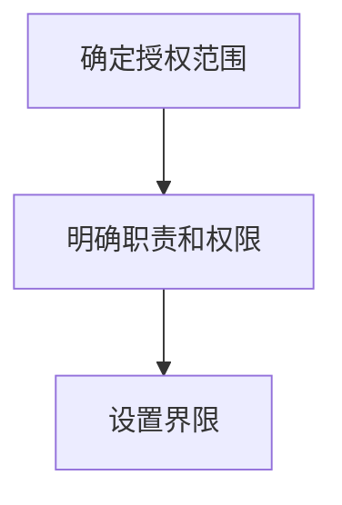
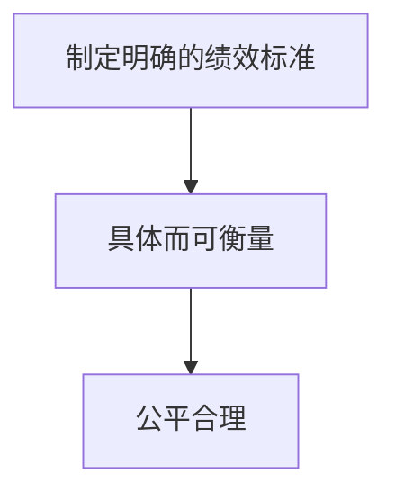
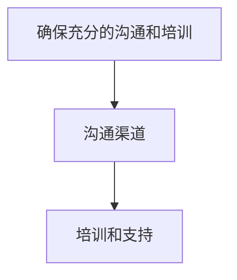
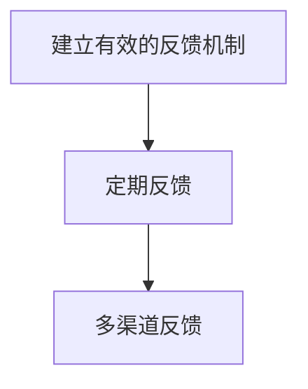
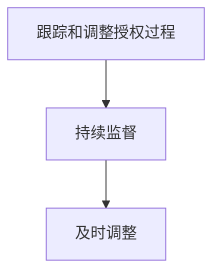

                 

### 第一部分：引言

#### 第1章：团队授权背景与意义

**1.1 团队授权的概念与演变**

团队授权是指在组织管理中，领导者将决策权、资源管理和执行权力授予团队成员，使其能够自主完成任务的过程。这一概念起源于管理学的发展历程，经历了从传统的集权管理到现代的授权管理的转变。

**1.1.1 团队授权的起源**

团队授权的起源可以追溯到20世纪初的泰勒科学管理理论。泰勒提出，通过科学的方法和标准化的流程，可以提高工作效率。然而，这种集权管理方式也逐渐暴露出其弊端，如决策效率低下、创新力不足等。

**1.1.2 团队授权在不同阶段的发展**

随着管理理论的发展，20世纪中叶，德鲁克提出了“目标管理”理论，强调管理者与员工共同设定目标，并通过授权促进目标的实现。这一理论标志着团队授权的初步形成。

在20世纪末，随着知识经济的兴起，团队授权的理念得到了进一步发展。扁平化管理、自我管理团队等新型组织形式，强调了员工的自主性和创造性。

**1.1.3 团队授权在现代组织管理中的重要性**

在现代组织管理中，团队授权具有以下重要性：

1. **提高效率**：授权可以减少管理层次，缩短决策链条，提高决策效率。
2. **激发创新**：授权使团队成员能够自主探索和尝试，有助于激发创新思维。
3. **增强责任感**：授权使团队成员感受到责任和信任，有助于提高工作积极性和责任感。
4. **促进团队协作**：授权有助于团队成员之间的沟通与合作，提高团队整体效能。

**1.2 信任与控制的辩证关系**

团队授权的核心在于平衡信任与控制。

**1.2.1 信任的定义与作用**

信任是指团队成员对领导者和管理制度的信心和依赖。信任的作用包括：

1. **促进沟通**：信任有助于团队成员之间的信息交流和协同工作。
2. **提高效率**：信任可以减少监督和检查的频率，提高工作效率。
3. **增强凝聚力**：信任有助于增强团队的凝聚力和归属感。

**1.2.2 控制的必要性**

尽管信任是团队授权的基础，但控制也是必不可少的。控制的作用包括：

1. **确保目标实现**：通过控制，可以确保团队成员按照既定的目标和标准完成任务。
2. **预防风险**：控制有助于及时发现和纠正偏差，预防潜在的风险。
3. **维护秩序**：控制有助于维护组织内部的秩序和纪律。

**1.2.3 信任与控制的平衡**

在团队授权中，信任与控制之间需要找到一个平衡点。过度的信任可能导致失控，而过度的控制则会削弱团队成员的自主性。建立信任与控制的平衡机制，是团队授权成功的关键。

**1.2.4 建立信任与控制机制**

建立信任与控制机制，可以从以下几个方面入手：

1. **明确授权范围**：明确团队成员的授权范围，确保授权的透明性和可追溯性。
2. **制定绩效标准**：设定合理的绩效标准，确保团队成员有明确的目标和方向。
3. **建立反馈机制**：建立有效的反馈机制，及时了解团队成员的工作情况和问题，提供必要的支持和指导。
4. **加强沟通与协作**：通过定期会议、工作汇报等方式，加强团队成员之间的沟通与协作，增强团队凝聚力。

**1.2.5 信任与控制机制的实施案例**

在实施信任与控制机制时，可以借鉴一些成功的企业案例。例如，谷歌公司通过“20%自由工作时间”政策，鼓励员工自由探索创新项目，同时通过绩效评估和项目审查，确保项目的质量和进度。

**1.2.6 信任与控制机制的挑战与对策**

在建立信任与控制机制过程中，可能会面临一些挑战，如：

1. **信任不足**：团队成员可能对领导者和管理制度缺乏信心，影响授权效果。
2. **控制过度**：过度控制可能导致员工抵触，降低工作效率。

针对这些挑战，可以采取以下对策：

1. **增强沟通**：通过定期的沟通和交流，增强团队成员对团队授权的理解和认同。
2. **明确责任**：明确团队成员的职责和权限，确保授权的透明性和公平性。
3. **建立信任**：通过信任建设活动，如团队建设、信任培训等，增强团队成员之间的信任。

**1.2.7 信任与控制机制的持续优化**

信任与控制机制不是一成不变的，需要根据团队情况和外部环境的变化进行持续优化。通过定期评估和反馈，可以发现和解决机制中的问题，提高团队授权的效能。

**总结**

团队授权是一种现代组织管理的重要方式，它通过平衡信任与控制，激发团队成员的自主性和创新力，提高团队的整体效能。了解团队授权的背景和意义，建立有效的信任与控制机制，是团队授权成功的关键。

**参考文献**

- 德鲁克，彼得。《管理实践》。中国社会科学出版社，2006年。
- 莱斯尼克，戴维。《团队授权：信任与控制的平衡艺术》。机械工业出版社，2014年。
- 谢勒，罗伯特。《信任：社会结构和社会关系的分析》。社会科学文献出版社，2010年。

### 第1章：团队授权背景与意义

**1.2 信任与控制的辩证关系**

在深入探讨团队授权之前，有必要理解信任与控制之间的辩证关系。这两者看似对立，但在团队授权中却相辅相成，形成了一种微妙的平衡。

#### 1.2.1 信任的定义与作用

信任是一种心理状态，它源于个体对他人或组织的能力、诚信和可靠性的预期。在团队授权的背景下，信任尤为重要。它不仅是团队成员之间相互依赖的基础，也是团队成员对领导者和管理决策的信任。

信任的作用主要体现在以下几个方面：

1. **促进沟通**：信任能够消除团队成员之间的心理障碍，促进开放、坦诚的沟通。在沟通中，团队成员更愿意分享自己的想法、问题和困惑，从而提高协作效率。
2. **提高效率**：信任可以减少监督和检查的频率，降低管理成本。团队成员在没有外部监督的情况下，能够更自主地工作，从而提高效率。
3. **增强凝聚力**：信任有助于增强团队的凝聚力。当团队成员感受到被信任和尊重时，他们更愿意为团队的目标共同努力，形成强烈的团队归属感。

#### 1.2.2 控制的必要性

尽管信任在团队授权中至关重要，但控制同样不可或缺。控制是对团队成员行为和结果进行监督和管理的过程，其目的是确保团队成员按照既定的目标和标准完成任务。

控制的必要性体现在以下几个方面：

1. **确保目标实现**：通过控制，管理者可以确保团队成员的工作方向和结果与组织的整体目标一致。这有助于提高组织的整体绩效。
2. **预防风险**：控制可以及时发现和纠正偏差，预防潜在的风险。例如，在项目开发过程中，通过定期审查代码和质量，可以防止项目出现重大问题。
3. **维护秩序**：控制有助于维护组织内部的秩序和纪律。例如，通过制定明确的规范和流程，可以确保团队成员的行为符合组织的要求。

#### 1.2.3 信任与控制的平衡

在团队授权中，信任与控制之间的关系是一种辩证关系。过度的信任可能导致失控，使团队成员失去方向和目标；而过度的控制则可能削弱团队成员的自主性和创新力。

为了实现信任与控制的平衡，需要采取以下策略：

1. **明确授权范围**：在授权时，需要明确团队成员的职责和权限，确保他们了解自己的工作范围和责任。这有助于防止过度控制或信任不足。
2. **制定绩效标准**：设定合理的绩效标准，确保团队成员有明确的目标和方向。这有助于确保团队成员的行为受到一定的控制，同时保持他们的自主性。
3. **建立反馈机制**：建立有效的反馈机制，可以及时了解团队成员的工作情况和问题。通过反馈，可以提供必要的支持和指导，同时帮助团队成员调整自己的行为。
4. **加强沟通与协作**：通过定期会议、工作汇报等方式，加强团队成员之间的沟通与协作。这有助于增强团队凝聚力，同时确保团队目标的实现。

#### 1.2.4 建立信任与控制机制

建立信任与控制机制是团队授权成功的关键。以下是一些具体的建议：

1. **建立信任**：通过信任建设活动，如团队建设、信任培训等，增强团队成员之间的信任。这可以通过提高团队成员之间的互信和理解来实现。
2. **明确责任**：明确团队成员的职责和权限，确保他们了解自己的工作范围和责任。这可以通过制定详细的岗位职责说明书来实现。
3. **制定绩效标准**：设定合理的绩效标准，确保团队成员有明确的目标和方向。这可以通过制定明确的项目目标和关键绩效指标（KPIs）来实现。
4. **建立反馈机制**：建立有效的反馈机制，可以及时了解团队成员的工作情况和问题。这可以通过定期的工作汇报和绩效评估来实现。
5. **加强沟通与协作**：通过定期会议、工作汇报等方式，加强团队成员之间的沟通与协作。这可以通过定期的团队会议和沟通渠道来实现。

#### 1.2.5 信任与控制机制的实施案例

以下是一个关于信任与控制机制实施案例的简述：

在一个软件开发团队中，领导者通过建立信任与控制机制，实现了团队的高效运作。首先，领导者与团队成员进行了一次深入的沟通，明确了团队成员的职责和权限。其次，领导者制定了明确的项目目标和关键绩效指标（KPIs），确保团队成员有明确的方向和目标。此外，领导者还建立了定期的反馈机制，通过每周的工作汇报和绩效评估，及时了解团队成员的工作情况和问题。通过这些措施，团队成员之间的信任得到了增强，工作效率也得到了显著提高。

#### 1.2.6 信任与控制机制的挑战与对策

在建立信任与控制机制的过程中，可能会面临一些挑战，如：

1. **信任不足**：团队成员可能对领导者和管理制度缺乏信心，影响授权效果。
   - **对策**：通过定期的沟通和交流，增强团队成员对团队授权的理解和认同。同时，领导者需要通过实际行动赢得团队成员的信任。

2. **控制过度**：过度控制可能导致员工抵触，降低工作效率。
   - **对策**：明确授权范围，制定合理的绩效标准，建立有效的反馈机制。通过这些措施，确保团队成员在适当的控制下，保持自主性和创新力。

#### 1.2.7 信任与控制机制的持续优化

信任与控制机制不是一成不变的，需要根据团队情况和外部环境的变化进行持续优化。以下是一些优化建议：

1. **定期评估**：定期评估信任与控制机制的有效性，发现和解决存在的问题。
2. **持续改进**：根据评估结果，持续改进信任与控制机制，提高团队授权的效能。
3. **反馈循环**：建立有效的反馈循环机制，确保团队成员的意见和建议得到及时反馈和改进。

通过以上措施，团队可以不断优化信任与控制机制，实现团队授权的最佳效果。

### 第2章：团队授权的核心原则

**2.1 自主性与责任感**

团队授权的核心在于赋予团队成员自主性和责任感。这种自主性不仅体现在工作任务的执行上，还包括决策权的下放和创新空间的提供。而责任感则是团队成员对工作结果的承诺和对团队整体目标的认同。

#### 2.1.1 自主性在团队授权中的作用

自主性是团队授权的重要组成部分，它对团队效能有显著的积极影响。以下是自主性在团队授权中的几个关键作用：

1. **提高工作效能**：自主性使团队成员能够根据自己的理解和工作方式高效完成任务，减少不必要的干扰和束缚，从而提高工作效率。
2. **促进创新**：自主性鼓励团队成员探索新的解决方案和方法，激发创新思维，推动团队不断进步。
3. **增强归属感**：自主性使团队成员感受到被信任和尊重，增强对团队的认同感和归属感，提高团队的凝聚力。

#### 2.1.2 如何赋予团队成员责任感

赋予团队成员责任感是团队授权成功的关键，以下是一些具体的方法：

1. **明确目标**：设定清晰、可衡量的目标，使团队成员了解自己的工作方向和期望结果。
2. **赋予决策权**：给予团队成员在职责范围内的决策权，让他们能够自主做出决策，承担责任。
3. **建立反馈机制**：建立定期反馈机制，及时评估团队成员的工作表现，提供建设性反馈，帮助他们改进。
4. **提供培训与支持**：为团队成员提供必要的培训和支持，提高他们的技能和知识，增强他们的责任感。

#### 2.1.3 自主性与责任感的平衡策略

在团队授权过程中，平衡自主性与责任感至关重要。以下是一些策略：

1. **适度监督**：在确保团队成员有足够的自主性的同时，进行适度的监督，确保团队成员的行为符合团队目标和价值观。
2. **明确责任范围**：明确团队成员的责任范围，避免责任模糊和推诿现象。
3. **建立绩效评估体系**：建立合理的绩效评估体系，通过绩效评估激励团队成员，同时帮助他们认识到自己的责任。

#### 2.2 沟通与反馈

沟通与反馈是团队授权中不可或缺的环节。良好的沟通有助于建立信任，反馈则能够帮助团队成员不断进步。

#### 2.2.1 有效沟通的重要性

有效沟通在团队授权中具有重要作用，它包括以下几个方面：

1. **增强信任**：通过有效沟通，团队成员能够更好地了解彼此的想法和期望，建立信任关系。
2. **提高决策质量**：有效沟通可以帮助团队成员共同分析问题、讨论解决方案，从而提高决策质量。
3. **减少误解**：通过沟通，可以消除团队成员之间的误解，避免因信息不对称而导致的冲突。
4. **提高团队效能**：有效沟通能够提高团队的协作效率，使团队成员更加专注于共同目标。

#### 2.2.2 沟通障碍与解决方法

在团队授权过程中，可能会遇到一些沟通障碍，以下是一些常见的解决方法：

1. **语言障碍**：对于语言差异，可以采取翻译服务或双语沟通策略，确保信息传递的准确性。
2. **文化差异**：了解团队成员的文化背景，尊重他们的文化习惯和价值观，避免因文化差异导致的沟通障碍。
3. **信息不对称**：通过定期分享信息和组织内部培训，减少信息不对称，提高沟通效果。
4. **情绪干扰**：在沟通中保持冷静，避免情绪化，确保沟通的理性性和建设性。

#### 2.2.3 反馈机制的设计与实施

反馈机制是团队授权中重要的环节，以下是一些设计与实施反馈机制的建议：

1. **定期反馈**：建立定期反馈机制，如每周或每月的工作汇报和绩效评估，确保团队成员能够及时得到反馈。
2. **多渠道反馈**：提供多种反馈渠道，如面对面反馈、电子邮件、在线讨论等，方便团队成员提出意见和建议。
3. **具体而清晰**：在提供反馈时，要具体而清晰，指出具体问题和改进建议，避免模糊和不具体的反馈。
4. **建立反馈文化**：通过培训和文化建设，营造一种开放、坦诚的反馈文化，使团队成员乐于接受和提供反馈。

#### 2.2.4 反馈对团队授权的影响

反馈在团队授权中发挥着重要作用，它能够：

1. **促进个人成长**：通过反馈，团队成员可以了解自己的优点和不足，及时调整自己的行为和策略，促进个人成长。
2. **提升团队效能**：通过反馈，团队可以发现和解决问题，改进工作流程，提高整体效能。
3. **增强信任**：积极的反馈和建设性的沟通能够增强团队成员之间的信任，促进团队协作。

#### 2.2.5 案例分析：成功的沟通与反馈实践

以下是一个成功的沟通与反馈案例：

在一个软件开发团队中，领导者通过定期的团队会议和一对一沟通，与团队成员建立了良好的沟通渠道。每周的团队会议不仅用于分享项目进展，还用于讨论存在的问题和解决方案。此外，领导者还通过一对一沟通，了解每个团队成员的工作状况和需求。通过这些沟通渠道，领导者能够及时了解团队成员的想法和问题，提供必要的支持和指导。在项目过程中，领导者还建立了定期的反馈机制，通过每周的工作汇报和绩效评估，及时评估团队成员的工作表现，提供具体而清晰的反馈。这种沟通与反馈实践，极大地提高了团队的协作效率和成员的满意度。

### 第3章：团队授权的实践与策略

**3.1 团队授权的实施步骤**

团队授权是一个系统化的过程，需要遵循一系列实施步骤，以确保授权的有效性和持续性。以下是团队授权的主要实施步骤：

#### 3.1.1 准备工作

在开始团队授权之前，需要进行充分的准备工作，包括：

1. **明确团队目标**：确保团队成员对团队的目标和愿景有清晰的认识，这有助于他们在授权过程中有明确的方向。
2. **评估团队成员能力**：对团队成员的能力和技能进行评估，确保他们具备承担授权任务的能力。
3. **制定授权计划**：根据团队目标和成员能力，制定详细的授权计划，包括授权的范围、时间表和具体的任务分配。

#### 3.1.2 授权流程的设计

授权流程的设计是团队授权的核心环节，以下是一些关键步骤：

1. **授权范围确定**：明确团队成员的授权范围，包括决策权、资源管理和执行权力。这有助于避免过度授权或授权不足。
2. **明确责任和权限**：在授权过程中，要明确团队成员的职责和权限，确保他们了解自己的工作范围和责任。
3. **制定绩效指标**：设定合理的绩效指标，确保团队成员有明确的工作目标和衡量标准。

#### 3.1.3 授权过程中的关键点

在实施团队授权过程中，需要关注以下几个关键点：

1. **沟通与信任**：建立良好的沟通渠道，增强团队成员之间的信任，这是授权成功的关键。
2. **持续监督与支持**：在授权过程中，领导者需要持续监督团队成员的工作，并提供必要的支持和指导，确保任务的顺利完成。
3. **反馈与改进**：建立有效的反馈机制，及时了解团队成员的工作情况和问题，提供建设性反馈，帮助他们改进。

#### 3.1.4 授权失败的应对策略

在团队授权过程中，可能会遇到授权失败的情况，以下是一些应对策略：

1. **分析原因**：首先，要分析授权失败的原因，是授权范围不明确、沟通不畅，还是团队成员能力不足等。
2. **调整授权策略**：根据分析结果，调整授权策略，如重新设定授权范围、提供额外的培训和支持等。
3. **加强沟通与监督**：在授权过程中，加强沟通和监督，确保团队成员能够按照既定的目标和标准完成任务。

#### 3.1.5 案例分析：成功的团队授权实践

以下是一个成功的团队授权实践案例：

在一个国际性的软件开发团队中，领导者通过实施团队授权，极大地提高了团队的效率和创新能力。首先，领导者明确了团队的目标和愿景，确保团队成员对团队的方向有清晰的认识。然后，领导者对团队成员进行了能力评估，根据评估结果制定了详细的授权计划。在授权过程中，领导者明确了团队成员的职责和权限，并设定了合理的绩效指标。此外，领导者建立了定期的沟通渠道，定期召开团队会议，与团队成员交流工作进展和遇到的问题。同时，领导者还提供了必要的培训和支持，帮助团队成员提高技能和知识。通过这些措施，团队授权取得了显著的效果，成员的自主性和创新力得到了极大的提升。

#### 3.1.6 团队授权的评估与改进

团队授权不是一蹴而就的过程，需要通过持续的评估和改进来提高其效能。以下是团队授权评估和改进的几个关键步骤：

1. **定期评估**：定期对团队授权的成效进行评估，包括成员的工作表现、团队绩效等。
2. **收集反馈**：通过调查问卷、员工访谈等方式，收集团队成员的反馈，了解他们在授权过程中的体验和意见。
3. **分析结果**：对评估结果和反馈进行分析，找出存在的问题和改进点。
4. **制定改进计划**：根据分析结果，制定具体的改进计划，包括调整授权范围、改进沟通机制、提供培训和支持等。
5. **实施改进措施**：执行改进计划，并跟踪改进措施的效果。

#### 3.1.7 团队授权在不同组织结构中的应用

团队授权在不同的组织结构中可能面临不同的挑战和机遇。以下是团队授权在几种常见组织结构中的应用：

1. **矩阵式组织结构**：在矩阵式组织中，团队授权需要同时考虑项目团队和职能部门的利益，确保授权的协调性和一致性。
2. **网络式组织结构**：在网络式组织中，团队授权更多地依赖于跨部门协作，领导者需要建立有效的沟通和协调机制，确保授权的顺利实施。
3. **职能式组织结构**：在职能式组织中，团队授权可能面临职能壁垒的问题，领导者需要通过培训和文化建设，打破职能壁垒，促进跨部门协作。

### 第3章：团队授权的实践与策略

**3.1 团队授权的实施步骤**

**3.1.1 准备工作**

在实施团队授权之前，准备工作至关重要。以下是一些关键的准备工作步骤：

1. **明确团队目标**：确保团队成员对团队的目标和愿景有清晰的认识，这有助于他们在授权过程中有明确的方向。明确的目标可以帮助团队成员集中精力，提高工作效率。

   **核心概念与联系**：
   - **目标管理**：德鲁克的目标管理理论强调，明确的目标是提高团队效能的基础。
   - **SMART原则**：目标设定时应遵循SMART原则（具体、可衡量、可实现、相关性强、时限性），以确保目标的明确性和可操作性。

   **流程图**：
   ```mermaid
   graph TD
   A[明确团队目标] --> B[分析团队需求]
   B --> C[制定具体计划]
   C --> D[沟通与共识]
   D --> E[准备授权资源]
   ```

2. **分析团队需求**：了解团队成员的需求和能力，是授权成功的重要前提。分析团队需求包括：

   - **技能需求**：评估团队成员的技能水平，确定是否需要提供额外的培训或支持。
   - **资源需求**：确保团队成员有足够的资源，如时间、资金、工具等，以支持他们的工作。
   - **环境需求**：创造一个有利于团队协作的工作环境，包括物理空间、技术支持等。

   **核心概念与联系**：
   - **能力发展**：通过分析团队需求，可以识别团队成员的发展潜力，提供有针对性的培训和发展机会。
   - **资源管理**：有效的资源管理可以提高团队的效率和生产力。

   **流程图**：
   ```mermaid
   graph TD
   A[分析团队需求] --> B[评估技能水平]
   B --> C[确定培训需求]
   C --> D[确保资源充足]
   D --> E[优化工作环境]
   ```

3. **制定具体计划**：在明确目标和团队需求的基础上，制定具体的授权计划。具体计划应包括：

   - **任务分配**：明确每个团队成员的任务和责任，确保任务分配的合理性和公平性。
   - **时间表**：制定明确的时间表，包括任务的开始和结束时间，以及关键节点的里程碑。
   - **绩效指标**：设定合理的绩效指标，用于评估团队成员的工作成果和团队的整体绩效。

   **核心概念与联系**：
   - **项目管理**：项目管理中的任务分配和时间表制定，是确保项目成功的关键步骤。
   - **关键绩效指标（KPIs）**：KPIs是衡量团队绩效的重要工具，有助于识别和解决问题。

   **流程图**：
   ```mermaid
   graph TD
   A[制定具体计划] --> B[任务分配]
   B --> C[时间表制定]
   C --> D[绩效指标设定]
   D --> E[计划审查与调整]
   ```

4. **沟通与共识**：在授权计划制定过程中，需要确保团队成员对计划有清晰的理解，并达成共识。以下是一些沟通和共识的步骤：

   - **团队会议**：定期召开团队会议，讨论授权计划，确保团队成员对计划有全面的了解。
   - **个别沟通**：与每个团队成员进行个别沟通，解答他们的疑问，确保他们对计划有信心。
   - **共识达成**：通过讨论和反馈，达成团队成员对计划的共识，减少分歧和误解。

   **核心概念与联系**：
   - **沟通技巧**：有效的沟通技巧可以增强团队成员之间的理解和协作。
   - **共识建设**：共识建设有助于减少冲突，提高团队的凝聚力和执行力。

   **流程图**：
   ```mermaid
   graph TD
   A[沟通与共识] --> B[团队会议]
   B --> C[个别沟通]
   C --> D[共识达成]
   ```

5. **准备授权资源**：在授权过程中，确保团队成员有足够的资源是至关重要的。以下是一些具体的资源准备步骤：

   - **技术资源**：确保团队成员有足够的技术支持，如软件工具、硬件设施等。
   - **资金资源**：确保团队成员有足够的资金支持，以支持他们的工作。
   - **人力资源**：提供必要的人力资源支持，如专家指导、培训等。

   **核心概念与联系**：
   - **资源管理**：有效的资源管理可以提高团队的效率和生产力。
   - **成本效益分析**：在准备资源时，进行成本效益分析，确保资源投入的合理性和效益。

   **流程图**：
   ```mermaid
   graph TD
   A[准备授权资源] --> B[技术资源支持]
   B --> C[资金资源保障]
   C --> D[人力资源配置]
   ```

通过以上准备工作步骤，可以为团队授权的实施奠定坚实的基础。准备工作的细致和全面，将直接影响到授权的后续执行效果和团队的最终表现。

### 3.1.2 授权流程的设计

设计有效的授权流程是团队授权成功的关键，以下是一些关键步骤和策略：

**1. 确定授权范围**

在授权过程中，首先要明确授权的范围。这包括确定哪些决策权、资源管理和执行权力可以授权给团队成员，以及哪些仍然需要保留在领导者手中。以下是一些具体的策略：

- **明确职责和权限**：确保团队成员清楚地了解他们在授权范围内可以做什么，不能做什么。这可以通过详细的职责说明书或授权手册来实现。
- **设置界限**：设定明确的界限，以避免过度授权或授权不足。界限应基于团队的总体目标和工作流程，确保团队成员的行为与团队目标一致。

**核心概念与联系**：
- **权力下放**：权力下放理论强调，通过授权，可以减轻领导者的负担，提高团队的效率和自主性。
- **决策模型**：决策模型可以帮助领导者确定哪些决策应该授权给团队成员，哪些决策需要保留。

**流程图**：


**2. 制定明确的绩效标准**

设定合理的绩效标准是确保团队成员努力方向正确、工作成效明显的重要手段。以下是一些制定绩效标准的策略：

- **具体而可衡量**：绩效标准应该具体且可衡量，使团队成员知道如何评估自己的工作成效。例如，可以用完成任务的百分比、项目质量评分等作为绩效指标。
- **公平合理**：绩效标准应公平合理，避免不公平的评价标准导致团队成员的挫败感。

**核心概念与联系**：
- **关键绩效指标（KPIs）**：KPIs是衡量团队和团队成员绩效的重要工具。
- **目标管理**：目标管理理论强调，明确的目标是提高团队绩效的基础。

**流程图**：


**3. 确保充分的沟通和培训**

沟通和培训是授权流程中不可或缺的环节。以下是一些具体的策略：

- **沟通渠道**：建立多种沟通渠道，如定期的团队会议、一对一沟通、工作汇报等，确保团队成员能够及时获取信息、表达意见和解决问题。
- **培训和支持**：提供必要的培训和指导，帮助团队成员提升技能，增强他们完成授权任务的能力。

**核心概念与联系**：
- **沟通技巧**：有效的沟通技巧可以增强团队成员之间的理解和协作。
- **持续学习**：持续学习是提高团队成员能力和绩效的关键。

**流程图**：


**4. 建立有效的反馈机制**

有效的反馈机制可以帮助团队成员及时了解自己的工作表现，获得改进的建议。以下是一些建立反馈机制的策略：

- **定期反馈**：建立定期的反馈机制，如每周或每月的工作汇报和绩效评估，确保团队成员能够及时得到反馈。
- **多渠道反馈**：提供多种反馈渠道，如面对面反馈、电子邮件、在线讨论等，方便团队成员提出意见和建议。

**核心概念与联系**：
- **绩效评估**：绩效评估是反馈机制的重要组成部分，有助于识别团队成员的优势和改进点。
- **反馈文化**：建立一种开放、坦诚的反馈文化，鼓励团队成员积极接受和提供反馈。

**流程图**：


**5. 跟踪和调整授权过程**

授权过程是一个动态的过程，需要持续跟踪和调整，以确保授权的有效性。以下是一些具体的策略：

- **持续监督**：领导者应持续关注团队成员的工作进展，确保他们能够在授权范围内顺利完成任务。
- **及时调整**：根据团队成员的工作表现和反馈，及时调整授权策略，确保授权的持续优化。

**核心概念与联系**：
- **过程管理**：通过持续监督和调整，可以确保授权过程的高效和稳定。
- **适应性管理**：领导者应具备适应性，能够根据实际情况灵活调整授权策略。

**流程图**：


通过以上步骤和策略，可以有效设计团队授权流程，确保授权的顺利实施和团队的持续发展。

### 3.1.3 授权过程中的关键点

在团队授权过程中，领导者需要关注以下几个关键点，以确保授权的顺利进行和团队的持续发展。

#### 1. 沟通与信任的建立

沟通是团队授权的基础，信任是团队授权的核心。领导者需要建立开放的沟通渠道，确保团队成员能够自由表达意见和想法。以下是一些具体策略：

- **定期会议**：定期召开团队会议，讨论工作进展、问题和解决方案。这有助于增强团队成员之间的沟通和理解。
- **一对一沟通**：与每个团队成员进行一对一沟通，了解他们的需求和困难，提供个性化的支持和指导。
- **反馈机制**：建立有效的反馈机制，鼓励团队成员提出建议和反馈，确保他们的声音被听到。

#### 2. 明确责任和权限

在授权过程中，明确责任和权限至关重要。以下是一些策略：

- **职责说明书**：为每个团队成员制定详细的职责说明书，明确他们的工作范围、责任和权限。这有助于避免职责模糊和推诿现象。
- **权限界定**：明确团队成员的权限，确保他们能够在授权范围内自主决策，提高工作效率。
- **监督和指导**：领导者需要定期检查团队成员的工作进展，提供必要的监督和指导，确保团队成员的工作方向和目标一致。

#### 3. 绩效指标的设定

设定合理的绩效指标是确保团队成员努力方向正确、工作成效明显的重要手段。以下是一些策略：

- **具体而可衡量**：绩效指标应具体且可衡量，使团队成员知道如何评估自己的工作成效。例如，可以用完成任务的百分比、项目质量评分等作为绩效指标。
- **合理分配**：根据团队成员的职责和角色，合理分配绩效指标，确保每个团队成员都有明确的绩效目标。
- **动态调整**：根据团队目标和外部环境的变化，动态调整绩效指标，确保绩效指标始终与团队目标保持一致。

#### 4. 持续监督与支持

在授权过程中，领导者需要持续监督团队成员的工作，并提供必要的支持和指导。以下是一些策略：

- **定期检查**：定期检查团队成员的工作进展，确保他们能够在授权范围内顺利完成任务。
- **反馈与指导**：及时给予团队成员反馈和指导，帮助他们改进工作方法和策略，提高工作效能。
- **资源支持**：提供必要的资源支持，如培训、技术支持等，帮助团队成员提升技能和能力。

#### 5. 风险管理

在团队授权过程中，风险管理是确保授权顺利进行的重要环节。以下是一些策略：

- **识别风险**：在授权前，识别可能出现的风险，并制定相应的应对策略。
- **预防措施**：采取预防措施，降低风险发生的可能性。例如，制定详细的计划，确保团队成员了解工作流程和风险点。
- **应急计划**：制定应急计划，以应对授权过程中可能出现的紧急情况。

#### 6. 反馈与改进

反馈是团队授权中不可或缺的环节，它有助于团队成员不断进步和团队整体效能的提升。以下是一些策略：

- **定期评估**：定期评估团队成员的工作表现和团队绩效，发现存在的问题和改进点。
- **多渠道反馈**：提供多种反馈渠道，如面对面反馈、电子邮件、在线讨论等，方便团队成员提出意见和建议。
- **持续改进**：根据反馈结果，持续改进授权流程和策略，提高团队的效能和成员的满意度。

#### 7. 文化建设

团队授权的成功离不开良好的团队文化。以下是一些文化建设策略：

- **信任文化**：建立信任文化，鼓励团队成员相互信任、支持和合作。
- **开放文化**：营造开放、坦诚的工作氛围，鼓励团队成员表达意见和建议。
- **创新文化**：鼓励团队成员创新思维，探索新的解决方案和方法。
- **共享文化**：建立知识共享机制，促进团队成员之间的知识交流和协作。

通过以上关键点的关注和实施，领导者可以有效地推进团队授权，提高团队的效能和成员的满意度。

### 3.1.4 授权失败的应对策略

在团队授权过程中，失败在所难免。领导者需要具备应对授权失败的能力，以避免对团队和组织的负面影响。以下是一些常见的授权失败应对策略：

**1. 分析失败原因**

在授权失败后，首先要分析失败的原因。这包括：

- **团队成员能力不足**：团队成员可能缺乏完成授权任务所需的知识和技能。在这种情况下，需要提供额外的培训和支持。
- **沟通不畅**：团队成员之间或与领导者之间的沟通不畅可能导致误解和冲突。需要加强沟通机制，提高信息传递的准确性和及时性。
- **目标不明确**：如果团队目标不明确或团队成员对目标理解不一致，会导致工作方向偏差。需要重新明确团队目标，并确保团队成员对目标有共同的理解。

**2. 调整授权策略**

在分析失败原因后，领导者需要根据具体情况调整授权策略。以下是一些具体的调整措施：

- **重新设定授权范围**：如果授权范围过宽或过窄，需要重新设定授权范围，确保团队成员有足够的自主性和责任感。
- **提供培训和支持**：针对团队成员能力不足的问题，提供必要的培训和支持，提高他们的技能和知识水平。
- **优化沟通机制**：通过改进沟通渠道和方式，增强团队成员之间的沟通和理解，减少误解和冲突。
- **明确团队目标**：重新明确团队目标，确保团队成员对目标有清晰的认识和一致的理解。

**3. 加强监督与支持**

在授权过程中，领导者需要加强对团队成员的监督和支持，确保他们能够在授权范围内顺利完成任务。以下是一些具体的措施：

- **定期检查**：定期检查团队成员的工作进展，及时发现和解决问题。
- **提供指导**：在团队成员遇到困难时，及时提供指导和支持，帮助他们找到解决问题的方法。
- **资源调配**：根据需要，合理调配资源，确保团队成员有足够的资源支持他们的工作。

**4. 反馈与改进**

在授权过程中，及时有效的反馈是改进工作的重要手段。以下是一些反馈与改进的策略：

- **定期反馈**：建立定期的反馈机制，如每周或每月的工作汇报和绩效评估，及时了解团队成员的工作情况和问题。
- **具体而清晰的反馈**：在提供反馈时，要具体而清晰，指出具体问题和改进建议，避免模糊和不具体的反馈。
- **持续改进**：根据反馈结果，持续改进工作流程和策略，提高团队的整体效能。

**5. 调整领导风格**

在授权失败后，领导者需要根据团队的情况和成员的反馈，调整自己的领导风格。以下是一些常见的领导风格调整：

- **更加开放和支持**：领导者可以变得更加开放和支持，鼓励团队成员提出意见和建议，增强团队凝聚力。
- **更加透明和沟通**：领导者可以加强与团队成员的沟通，建立更加透明的信息传递机制，减少误解和冲突。
- **更加灵活和适应性**：领导者需要具备灵活和适应性，能够根据实际情况调整授权策略和领导方式。

通过以上应对策略，领导者可以有效地应对授权失败，提高团队的整体效能和成员的满意度。

### 3.1.5 案例分析：成功的团队授权实践

在一个成功的团队授权实践中，我们可以看到一家科技公司通过有效的授权策略，实现了团队效能的显著提升。以下是这个案例的详细分析。

#### 案例背景

该科技公司是一家专注于软件开发和信息技术服务的公司，拥有一个由30名成员组成的研发团队。团队负责开发公司的核心产品，包括客户管理系统、数据分析工具和企业应用平台。然而，随着时间的推移，团队面临着一系列挑战，如任务繁重、沟通不畅、成员积极性不高等。为了应对这些挑战，公司决定实施团队授权策略，以提高团队的效率和创新能力。

#### 授权计划

在实施团队授权之前，公司进行了充分的准备工作。首先，公司明确了团队的目标和愿景，确保所有成员对团队的方向有清晰的认识。然后，公司对团队成员进行了能力评估，根据评估结果制定了详细的授权计划。

1. **明确授权范围**：公司明确了每个团队成员的职责和权限，确保团队成员了解自己的工作范围和责任。例如，项目经理负责项目规划、进度管理和资源调配，而开发人员则负责具体的技术实现和编码工作。

2. **制定绩效指标**：公司设定了具体的绩效指标，如任务完成率、代码质量和客户满意度等，确保团队成员有明确的工作目标和衡量标准。

3. **沟通与共识**：公司定期召开团队会议，讨论授权计划，确保团队成员对计划有全面的了解。同时，公司还与每个团队成员进行一对一沟通，解答他们的疑问，确保他们对计划有信心。

4. **准备授权资源**：公司确保团队成员有足够的资源支持，包括技术支持、培训资源和资金等。此外，公司还提供了必要的工作环境和工具，以支持团队成员的工作。

#### 实施过程

在授权计划实施过程中，公司采取了一系列措施来确保授权的顺利进行。

1. **持续监督与支持**：公司设立了项目管理办公室，负责监控团队成员的工作进展，并提供必要的支持和指导。项目经理定期与团队成员进行一对一沟通，解答他们的疑问，提供工作指导。

2. **反馈与改进**：公司建立了定期的反馈机制，包括每周的工作汇报和绩效评估。通过这些机制，公司能够及时了解团队成员的工作情况和问题，提供具体的改进建议。同时，公司鼓励团队成员提出意见和建议，促进团队内部的持续改进。

3. **风险管理**：公司识别了可能出现的风险，并制定了相应的应对策略。例如，对于项目进度延迟，公司制定了应急计划，确保项目能够在规定时间内完成。

#### 结果与启示

通过实施团队授权策略，公司取得了显著的成效：

1. **提高工作效率**：团队成员在授权范围内自主决策，工作效率得到了显著提升。团队成员表示，他们在授权后的工作压力减少，工作积极性提高。

2. **增强团队凝聚力**：通过定期的沟通和反馈，团队成员之间的信任和合作精神得到增强。团队成员表示，他们更加愿意为团队的目标共同努力，团队的凝聚力得到了显著提升。

3. **提高创新能力**：团队成员在授权后的工作过程中，有更多的机会探索和创新。公司的产品在技术上取得了多项突破，赢得了客户的认可。

4. **降低管理成本**：通过减少管理层次和简化决策流程，公司的管理成本显著降低。公司领导表示，团队授权策略的实施，使公司能够更加灵活地应对市场变化，提高了竞争力。

**案例启示**：

1. **明确授权范围**：在团队授权过程中，明确授权范围和责任至关重要。这有助于避免职责模糊和推诿现象，提高团队的效率和责任感。

2. **持续监督与支持**：在授权过程中，持续监督和提供支持是确保任务顺利完成的重要保障。通过定期沟通和反馈，及时解决问题，可以确保团队目标的实现。

3. **建立反馈机制**：有效的反馈机制可以帮助团队成员不断进步，提高团队的整体效能。通过多渠道反馈，可以确保团队成员的意见和建议得到充分重视。

4. **风险管理**：在团队授权过程中，识别和应对风险是确保授权成功的关键。通过制定应急预案和风险管理策略，可以降低风险对团队的影响。

通过以上案例分析，我们可以看到，成功的团队授权实践需要明确授权范围、持续监督与支持、建立反馈机制和风险管理等多方面的措施。这些措施的实施，可以显著提高团队的效率和创新能力，促进团队的持续发展。

### 3.1.6 团队授权的评估与改进

团队授权的评估与改进是确保授权策略持续有效的重要环节。以下是一些关键步骤和策略：

#### 1. 定期评估

定期评估是监测团队授权成效的关键。以下是一些评估步骤：

- **绩效指标分析**：定期收集和评估绩效指标，如任务完成率、客户满意度、项目进度等，以衡量团队授权的实际效果。
- **员工反馈**：通过员工调查、面试和会议等方式，收集团队成员的反馈，了解他们对授权过程和结果的看法。
- **外部评估**：邀请外部专家或客户对团队的工作进行评估，以获得独立的反馈和评价。

#### 2. 数据收集

收集与团队授权相关的数据是评估的基础。以下是一些数据收集方法：

- **工作记录**：收集团队成员的工作记录，如会议纪要、任务日志、项目报告等，以了解工作的具体执行情况。
- **绩效报告**：定期生成绩效报告，包括关键绩效指标（KPIs）的详细数据，为评估提供客观依据。
- **员工表现评价**：通过领导者和同事的评价，了解团队成员在工作中的表现和贡献。

#### 3. 结果分析

对收集的数据进行深入分析，是评估和改进的重要步骤。以下是一些分析策略：

- **比较分析**：将当前的数据与之前的绩效数据或行业标准进行比较，识别绩效的改进空间。
- **根因分析**：对于发现的问题，进行根因分析，找出问题的根本原因，以便制定有针对性的改进措施。
- **SWOT分析**：通过SWOT分析（优势、劣势、机会、威胁），全面评估团队授权的优势和不足，为改进提供方向。

#### 4. 改进措施

根据评估结果，制定具体的改进措施。以下是一些改进策略：

- **调整授权范围**：根据团队成员的能力和团队目标，调整授权范围，确保授权的合理性和有效性。
- **优化绩效指标**：重新审视和调整绩效指标，确保它们能够准确地反映团队成员的工作成果和团队的整体绩效。
- **改进沟通机制**：加强沟通渠道的建设，提高信息传递的准确性和及时性，减少误解和冲突。
- **提供培训与支持**：为团队成员提供额外的培训和支持，提高他们的技能和知识，增强他们的责任感和自主性。

#### 5. 持续改进

团队授权的评估与改进是一个持续的过程。以下是一些持续改进的策略：

- **建立反馈循环**：建立一个持续的反馈循环机制，确保团队成员的意见和建议得到及时反馈和改进。
- **跟踪改进效果**：定期跟踪改进措施的效果，评估它们的实施情况和成效，确保改进措施得到有效执行。
- **文化塑造**：通过文化建设，营造一种支持授权和创新的工作环境，鼓励团队成员积极参与改进过程。

通过以上评估与改进策略，团队可以不断优化授权机制，提高团队的效能和成员的满意度，实现团队授权的长期成功。

### 3.1.7 团队授权在不同组织结构中的应用

团队授权在不同组织结构中可能面临不同的挑战和机遇。以下是一些常见组织结构中团队授权的应用策略。

#### 1. 矩阵式组织结构

在矩阵式组织结构中，团队成员通常同时受到职能经理和项目经理的双重领导。这种结构使得团队授权变得更加复杂，但同时也提供了更多协作机会。

- **授权策略**：明确团队成员的双重职责，确保他们在项目团队和职能部门之间顺利过渡。项目经理和职能经理应共同制定授权计划，确保授权范围的协调一致。
- **沟通机制**：建立高效的沟通渠道，如定期跨部门会议和项目协调会，确保团队成员在不同角色之间保持良好的沟通和理解。

#### 2. 网络式组织结构

网络式组织结构强调跨部门协作和外部合作伙伴的参与。在这种结构中，团队授权需要更多地依赖于跨组织协作。

- **授权策略**：在授权时，要考虑外部合作伙伴的角色和责任，确保授权计划符合整体项目目标。领导者需要与外部合作伙伴建立信任关系，以便在授权过程中进行有效的沟通和协调。
- **协作平台**：利用协作工具和平台，如项目管理软件和即时通讯工具，提高团队成员之间的沟通效率和协作效果。

#### 3. 职能式组织结构

在职能式组织结构中，团队成员通常根据职能划分，如研发、市场营销和人力资源等。团队授权在这种情况下需要确保各部门之间的协调和一致性。

- **授权策略**：明确各部门的职责和权限，确保团队成员了解自己的工作范围和责任。职能经理需要与其他部门协调，确保授权任务与整体团队目标一致。
- **跨职能协作**：鼓励跨职能协作，通过跨部门团队项目和任务分配，提高团队成员的协作能力和责任感。

通过以上策略，团队授权可以在不同组织结构中有效实施，提高团队效率和创新能力。

### 第4章：构建信任的文化

**4.1 信任文化的建立与维护**

构建信任文化是团队授权成功的关键因素。一个健康的信任文化能够增强团队成员之间的互信，提高工作效率和团队凝聚力。以下是如何建立和维护信任文化的详细步骤。

#### 4.1.1 信任文化的定义

信任文化是指一个组织内部普遍存在的信任态度和行为习惯。在这种文化中，成员之间相互信任，信任成为组织运作的核心要素。信任文化的特点包括：

1. **透明度**：组织内部的信息和决策过程是透明和开放的，成员能够了解组织的运作方式和决策逻辑。
2. **责任感**：每个成员都对自己的工作负责，并能够信任同事会履行他们的职责。
3. **合作性**：成员之间愿意分享资源和知识，共同解决问题，而不是为了个人利益而竞争。
4. **开放性**：组织鼓励成员提出意见和建议，创造一个开放和包容的工作环境。

#### 4.1.2 建立信任文化的步骤

建立信任文化是一个长期而持续的过程，以下是一些具体的步骤：

1. **领导层的示范**：领导者需要通过自身的行为树立榜样，表现出对团队成员的信任。这包括诚实地沟通、承认错误并采取纠正措施，以及公平地对待每个成员。
2. **透明沟通**：组织应确保沟通渠道的透明度，使所有成员都能够获得必要的信息。定期的团队会议、内部邮件和工作汇报可以帮助建立透明度。
3. **建立反馈机制**：建立有效的反馈机制，使成员能够自由地表达意见和建议。这可以通过定期的匿名调查、开放式会议和一对一沟通来实现。
4. **奖励信任行为**：通过奖励那些表现出信任行为的成员，可以鼓励更多的人效仿。这可以包括表扬、晋升和额外的责任等。
5. **培训和文化建设**：定期进行信任培训和文化建设活动，提高成员对信任文化的认识和认同。这可以通过研讨会、工作坊和团队建设活动来实现。

#### 4.1.3 维护信任文化的策略

信任文化一旦建立，就需要持续维护和强化。以下是一些维护信任文化的策略：

1. **持续沟通**：定期进行团队沟通，确保成员之间的信息同步和信任关系的维护。这可以通过定期的团队会议、工作汇报和社交媒体平台来实现。
2. **解决冲突**：及时解决成员之间的冲突，避免信任受损。领导者需要扮演调解者的角色，通过公正和客观的方式处理冲突。
3. **透明决策**：在决策过程中保持透明，让成员了解决策的依据和过程，这样可以增强他们对决策的信任。
4. **信任实践**：将信任实践纳入组织的日常工作流程中，确保信任成为组织文化的一部分。例如，鼓励成员分享知识和经验，共同承担责任。
5. **反思与改进**：定期反思组织的信任文化，并根据反馈进行改进。这可以通过定期的文化评估、员工调查和反馈会议来实现。

#### 4.1.4 信任文化的挑战与解决方案

在建立和维护信任文化过程中，可能会遇到一些挑战。以下是一些常见的挑战和相应的解决方案：

1. **文化差异**：由于团队成员来自不同的文化背景，可能会对信任有不同的理解和期望。解决方案是提供跨文化培训，增强团队成员对文化差异的认识和理解。
2. **信息不对称**：由于信息传递的不对称，可能会导致信任的缺失。解决方案是建立透明的信息共享机制，确保信息流通的公平和及时。
3. **历史问题**：组织历史中的负面事件可能会影响信任文化的建立。解决方案是通过公开道歉和采取纠正措施，修复历史问题，重建信任。
4. **变化管理**：在组织变革过程中，信任可能会受到影响。解决方案是明确变革的目标和步骤，确保成员了解变革的意义和过程，增强他们的参与感和信任。

通过以上策略，组织可以建立一个健康的信任文化，为团队授权的成功提供坚实的基础。

### 第4章：构建信任的文化

**4.1 信任文化的定义**

信任文化是一个组织内部普遍存在的价值观和行为规范，它强调成员之间的相互信任、透明度和责任感。信任文化不仅体现在领导层与员工之间的互动中，还渗透到组织内部的各个层面，成为推动组织持续发展的重要动力。

**4.1.1 建立信任文化的步骤**

建立信任文化需要一系列的步骤，以下是一些关键措施：

1. **领导层的示范**：领导者的行为对组织文化具有深远影响。领导者应通过自身的言行树立信任的榜样，表现出对团队成员的真诚信任。这包括透明沟通、承认错误、公平对待员工等。

2. **透明沟通**：透明沟通是建立信任文化的基础。组织应确保信息的透明度，使所有成员都能了解组织的战略、决策过程和业务进展。定期的团队会议、内部邮件和工作汇报可以帮助建立透明度。

3. **建立反馈机制**：建立有效的反馈机制，使成员能够自由地表达意见和建议。这可以通过定期的匿名调查、开放式会议和一对一沟通来实现。反馈机制有助于增强团队成员之间的信任和互动。

4. **奖励信任行为**：通过奖励那些表现出信任行为的成员，可以鼓励更多的人效仿。这可以包括表扬、晋升和额外的责任等。奖励机制的设置应公正透明，确保所有成员都有机会获得认可。

5. **培训和文化建设**：定期进行信任培训和文化建设活动，提高成员对信任文化的认识和认同。这可以通过研讨会、工作坊和团队建设活动来实现。文化建设活动有助于增强团队成员的归属感和信任感。

**4.1.2 维护信任文化的策略**

建立信任文化是一个持续的过程，维护和强化信任文化同样重要。以下是一些策略：

1. **持续沟通**：定期进行团队沟通，确保成员之间的信息同步和信任关系的维护。这可以通过定期的团队会议、工作汇报和社交媒体平台来实现。

2. **解决冲突**：及时解决成员之间的冲突，避免信任受损。领导者需要扮演调解者的角色，通过公正和客观的方式处理冲突。解决冲突的过程本身就是一个增强信任的过程。

3. **透明决策**：在决策过程中保持透明，让成员了解决策的依据和过程，这样可以增强他们对决策的信任。透明的决策过程有助于减少误解和猜疑，增强团队凝聚力。

4. **信任实践**：将信任实践纳入组织的日常工作流程中，确保信任成为组织文化的一部分。例如，鼓励成员分享知识和经验，共同承担责任。通过日常的信任实践，可以逐步培养和巩固信任文化。

5. **反思与改进**：定期反思组织的信任文化，并根据反馈进行改进。这可以通过定期的文化评估、员工调查和反馈会议来实现。持续改进可以帮助组织适应变化，保持信任文化的活力。

**4.1.3 信任文化的挑战与解决方案**

在建立和维护信任文化过程中，组织可能会面临一些挑战。以下是一些常见的挑战和相应的解决方案：

1. **文化差异**：由于团队成员来自不同的文化背景，可能会对信任有不同的理解和期望。解决方案是提供跨文化培训，增强团队成员对文化差异的认识和理解。

2. **信息不对称**：由于信息传递的不对称，可能会导致信任的缺失。解决方案是建立透明的信息共享机制，确保信息流通的公平和及时。

3. **历史问题**：组织历史中的负面事件可能会影响信任文化的建立。解决方案是通过公开道歉和采取纠正措施，修复历史问题，重建信任。

4. **变化管理**：在组织变革过程中，信任可能会受到影响。解决方案是明确变革的目标和步骤，确保成员了解变革的意义和过程，增强他们的参与感和信任。

通过以上策略，组织可以逐步建立和维护一个健康的信任文化，为团队授权的成功提供坚实的基础。

### 案例研究：成功信任文化的建立

**4.2.1 案例背景**

在一个国际知名的科技公司，由于团队成员来自世界各地，文化差异和工作方式各异，导致组织内部信任水平较低，团队合作效率受到影响。公司管理层意识到，只有建立起一个健康的信任文化，才能提高团队协作效率和创新能力。为此，公司决定开展一系列措施来建立信任文化。

**4.2.2 建立信任文化的具体措施**

1. **领导层的示范**：公司CEO通过公开演讲和内部邮件，强调信任文化的重要性，并承诺以身作则。他主动与团队成员进行一对一沟通，倾听他们的意见和建议，并在决策过程中保持透明。

2. **跨文化培训**：公司为所有员工提供跨文化培训，帮助团队成员了解不同文化背景的工作方式和沟通习惯。培训内容包括文化差异、沟通技巧和冲突解决方法。

3. **透明沟通**：公司建立了一个内部沟通平台，所有团队成员可以实时分享信息和工作进展。定期的团队会议和工作汇报也确保了信息的透明度，减少了误解和猜疑。

4. **反馈机制**：公司建立了反馈机制，包括匿名调查和开放式会议，鼓励团队成员提出意见和建议。管理层定期分析反馈结果，并根据反馈进行改进。

5. **奖励信任行为**：公司通过奖励制度，鼓励团队成员表现出信任行为。例如，对于在项目中表现出信任和合作的团队，公司会给予奖金和表彰。

**4.2.3 信任文化带来的变化**

通过一系列措施，公司的信任文化得到了显著提升，带来了以下积极变化：

1. **团队协作效率提高**：团队成员之间的沟通变得更加顺畅，协作效率显著提高。跨部门团队项目进展顺利，问题解决时间缩短。

2. **员工满意度提升**：团队成员感受到被信任和尊重，工作满意度提高。员工主动性和参与感增强，提出了许多创新性的建议。

3. **创新能力增强**：在信任文化的支持下，团队成员愿意分享知识和经验，共同探索解决方案。公司的产品在技术上取得了多项突破。

4. **管理成本降低**：通过透明的沟通和反馈机制，管理层能够更好地了解团队的工作状况，管理成本显著降低。

**4.2.4 案例启示**

这个案例展示了在多元文化环境中建立信任文化的有效方法。以下是一些关键启示：

1. **领导层的示范**：领导者的行为对组织文化有深远影响，领导者应通过自身的行为树立信任的榜样。

2. **跨文化培训**：在多元文化环境中，跨文化培训有助于增强团队成员对文化差异的认识和理解。

3. **透明沟通**：建立透明的沟通机制，确保团队成员之间的信息同步和信任关系的维护。

4. **反馈机制**：有效的反馈机制可以增强团队成员之间的信任和互动，促进团队的持续改进。

5. **奖励信任行为**：通过奖励制度鼓励团队成员表现出信任行为，可以进一步巩固信任文化。

通过以上启示，其他组织可以借鉴这个案例，成功建立和维护一个健康的信任文化，为团队授权和协作创造良好的环境。

### 4.2.5 其他案例分享

除了上述案例，还有许多其他组织成功建立了信任文化，并取得了显著成效。以下是几个典型案例的简要介绍：

**1. 亚马逊公司**

亚马逊公司以其独特的文化著称，其中信任文化是公司成功的关键之一。亚马逊鼓励员工自主决策，并为失败提供宽容的环境。公司CEO杰夫·贝索斯定期与员工进行一对一沟通，倾听他们的意见和建议。亚马逊还建立了“合伙人计划”，使员工感受到自己是公司的一部分，增强了他们的信任感和归属感。

**2. 宜家**

宜家通过建立开放和包容的工作环境，培养了信任文化。公司鼓励员工提出创新性想法，并提供资源和支持，确保员工的建议能够得到实施。宜家还定期组织团队建设活动，增强团队成员之间的信任和协作。

**3. 特斯拉**

特斯拉以其快速决策和高度自主的工作方式著称。公司创始人埃隆·马斯克强调团队自主性和创新力，并鼓励员工自由探索。特斯拉建立了开放的沟通渠道，使员工能够直接与高层领导进行交流，增强了团队的信任感。

**4. 星巴克**

星巴克通过建立“伙伴文化”，增强了员工之间的信任和团队合作精神。公司为员工提供全面的发展和培训机会，使员工能够不断提升自己的能力和价值。星巴克还鼓励员工参与决策过程，增强了他们的归属感和信任感。

通过这些案例，我们可以看到，建立信任文化不仅需要领导层的示范和战略规划，还需要一系列具体措施的实施。成功的信任文化能够显著提升团队效率和员工满意度，为组织的长期发展奠定坚实基础。

### 第5章：授权与团队绩效

**5.1 团队绩效评估**

团队绩效评估是团队授权过程中不可或缺的一环，它不仅能够衡量团队的工作成果，还能为团队授权的改进提供重要依据。以下是如何进行团队绩效评估的详细步骤。

#### 5.1.1 绩效评估的重要性

绩效评估是团队管理的重要工具，它能够：

1. **衡量工作成效**：通过绩效评估，可以客观地衡量团队成员的工作成效，为团队成员提供明确的反馈。
2. **激励员工**：合理的绩效评估能够激励员工努力工作，提高工作效率和质量。
3. **改进工作流程**：通过绩效评估，可以发现团队工作流程中的问题，为改进工作流程提供方向。
4. **支持决策**：绩效评估的结果可以为团队授权和资源分配提供重要参考，支持团队决策。

#### 5.1.2 绩效评估的方法

进行团队绩效评估时，可以采用以下几种方法：

1. **定量评估**：定量评估通过具体的指标和数据来衡量团队的工作成效。常用的定量指标包括任务完成率、项目质量、客户满意度等。定量评估的优点是客观、易于操作，但缺点是难以全面反映团队成员的软技能和工作态度。

2. **定性评估**：定性评估通过主观评价来衡量团队的工作成效。这种方法通常包括团队成员之间的互评、领导者的评价和客户反馈等。定性评估的优点是能够全面反映团队成员的综合表现，但缺点是主观性较强，可能存在偏见。

3. **360度评估**：360度评估是一种综合评估方法，它将定量评估和定性评估结合起来，从多个角度对团队成员进行评价。这种方法能够提供更全面的评估结果，但操作过程相对复杂，需要较长的时间。

#### 5.1.3 绩效评估与团队授权的关系

绩效评估与团队授权密切相关，主要体现在以下几个方面：

1. **确定授权范围**：通过绩效评估，可以确定哪些任务和职责可以授权给团队成员。对于绩效表现优秀的成员，可以进一步扩大他们的授权范围，提高他们的自主性和责任感。

2. **调整授权策略**：绩效评估结果可以用来调整团队授权策略。例如，对于绩效表现不佳的成员，可以适当减少他们的授权范围，增加监督和指导。

3. **激励员工**：绩效评估结果可以作为激励员工的依据。对于绩效表现优秀的成员，可以提供额外的奖励和晋升机会，激发他们的工作积极性。

4. **支持团队发展**：绩效评估可以识别团队的优势和不足，为团队的发展提供重要参考。通过绩效评估，团队可以确定需要改进的方面，并制定相应的改进计划。

#### 5.1.4 提升团队绩效的策略

为了提升团队绩效，可以采取以下策略：

1. **设定明确的绩效目标**：为团队设定具体、可衡量、可实现、相关性强、时限性（SMART）的目标，确保团队成员有清晰的工作方向和衡量标准。

2. **提供培训和支持**：为团队成员提供必要的培训和支持，帮助他们提高技能和知识，提高工作效率和质量。

3. **建立有效的反馈机制**：建立定期的反馈机制，及时了解团队成员的工作情况和问题，提供具体的改进建议，帮助他们提升绩效。

4. **激励和奖励**：通过激励和奖励机制，激发团队成员的工作积极性，提高团队的整体绩效。

5. **优化工作流程**：通过绩效评估，发现工作流程中的问题，并采取改进措施，优化工作流程，提高团队的工作效率。

6. **加强团队协作**：通过团队建设活动、跨部门协作和沟通渠道的优化，加强团队成员之间的协作，提高团队的总体绩效。

#### 5.1.5 案例分析：通过授权提升团队绩效

以下是一个关于通过授权提升团队绩效的案例分析：

在一个跨国公司的研发团队中，由于任务繁重且复杂，团队成员经常感到压力巨大。为了提高团队的工作效率和绩效，公司决定实施团队授权策略。首先，公司明确了每个团队成员的职责和权限，确保他们在授权范围内有足够的自主性。然后，公司制定了具体的绩效指标，如任务完成率、项目质量和客户满意度等。为了确保团队成员能够在授权范围内顺利完成任务，公司还提供了定期的培训和指导。通过这些措施，团队的工作效率显著提高，项目质量和客户满意度也得到提升。此外，团队成员的自主性和责任感也得到增强，工作积极性大幅提高。最终，团队的整体绩效得到了显著提升。

通过这个案例，我们可以看到，团队授权不仅能够提高团队的工作效率，还能提升团队的整体绩效。有效的团队授权策略，需要结合具体的团队情况和外部环境，灵活调整授权范围和策略，以实现团队绩效的最大化。

### 第6章：领导力与团队授权

**6.1 领导力在团队授权中的作用**

领导力在团队授权中扮演着至关重要的角色，它不仅决定着授权的成败，还直接影响到团队成员的积极性和创造力。一个优秀的领导者能够通过有效的领导力，建立信任、明确目标、激发潜力，从而实现团队的高效运作和卓越绩效。

#### 6.1.1 领导力定义

领导力是指领导者通过影响、激励和指导团队成员，实现团队目标的能力。它不仅包括领导者的个人素质和技能，还涉及到领导者在团队中的行为和决策方式。领导力不仅仅是权威和命令，更重要的是通过领导者的行为和影响力，激发团队成员的自主性和合作精神。

#### 6.1.2 领导力与团队授权的关联

领导力与团队授权之间存在着紧密的关联，具体体现在以下几个方面：

1. **建立信任**：领导力是建立团队信任的基础。一个优秀的领导者能够通过言行一致、公平公正、真诚沟通等方式，赢得团队成员的信任。这种信任是团队授权的前提，没有信任，授权将难以有效执行。

2. **明确目标**：领导力有助于明确团队的目标和愿景。一个有领导力的领导者能够清晰地传达团队的目标，使团队成员了解自己的工作意义和方向。明确的目标能够提高团队成员的积极性和执行力，确保团队授权的有效性。

3. **激发潜力**：领导力能够激发团队成员的潜力和创新能力。通过鼓励团队成员探索新方法、提出新想法，领导者能够推动团队的持续改进和创新发展。

4. **提供支持**：领导力包括为团队成员提供必要的支持和资源。一个有领导力的领导者能够在团队成员遇到困难时提供帮助，解决问题，确保团队授权的顺利进行。

#### 6.1.3 领导者的角色

在团队授权中，领导者扮演着多重角色，包括：

1. **授权者**：领导者需要明确团队成员的授权范围和责任，确保他们有足够的自主权和决策权。领导者要信任团队成员，让他们在授权范围内自主工作。

2. **协调者**：领导者需要协调团队内部和跨部门之间的资源，确保团队成员有足够的资源和支持。领导者要解决团队成员之间的冲突，促进团队协作。

3. **支持者**：领导者需要为团队成员提供必要的支持和指导，帮助他们克服困难，完成任务。领导者要关注团队成员的成长和发展，提供培训和发展机会。

4. **监督者**：领导者需要监督团队成员的工作进展，确保团队目标的实现。领导者要及时发现和解决问题，确保团队授权的有效性。

#### 6.1.4 领导者如何培养团队授权的能力

领导者要培养团队授权的能力，需要从以下几个方面入手：

1. **自我提升**：领导者需要不断提升自身的领导力和管理能力，通过学习领导力理论和实践，提高自己的领导水平。

2. **建立信任**：领导者要通过诚实、透明和公正的行为，建立与团队成员之间的信任关系。领导者要尊重团队成员的意见和贡献，让他们感受到被信任和尊重。

3. **明确目标**：领导者需要明确团队的目标和愿景，确保团队成员了解团队的方向和期望。领导者要制定具体的绩效指标，为团队成员提供清晰的工作目标和方向。

4. **提供支持**：领导者需要为团队成员提供必要的支持和资源，确保他们在授权范围内能够顺利完成任务。领导者要关注团队成员的成长和发展，提供培训和发展机会。

5. **培养团队**：领导者需要培养团队的自主性和创新能力，鼓励团队成员探索新方法、提出新想法。领导者要营造一种开放和包容的工作环境，促进团队成员之间的合作和交流。

#### 6.1.5 领导力发展的挑战与对策

在领导力发展的过程中，领导者可能会面临以下挑战：

1. **信任不足**：团队成员可能对领导者缺乏信任，导致授权难以执行。对策是领导者要建立透明的沟通渠道，通过实际行动赢得团队成员的信任。

2. **控制过度**：领导者可能过度干预团队成员的工作，限制他们的自主性。对策是领导者要明确授权范围，给予团队成员足够的自主权，同时提供必要的监督和支持。

3. **沟通障碍**：团队成员之间的沟通不畅可能导致误解和冲突。对策是领导者要建立有效的沟通机制，鼓励团队成员开放和坦诚地交流。

4. **能力不足**：领导者可能缺乏团队授权所需的技能和知识。对策是领导者要通过培训和指导，提高自己的领导力和管理能力。

通过以上对策，领导者可以克服领导力发展的挑战，培养团队授权的能力，推动团队的高效运作和持续发展。

### 6.2 案例研究：领导力推动团队授权的成功案例

**6.2.1 案例背景**

在一个快速成长的科技公司，领导层意识到，为了保持竞争优势，必须采取更加灵活和创新的团队管理模式。公司CEO马克·史密斯深知，传统的集中式管理模式已经无法适应快速变化的市场需求。他决定推行团队授权策略，通过赋予团队成员更多的自主权，提高团队的效率和创新能力。

**6.2.2 领导者的策略与实践**

马克·史密斯采取了一系列具体策略和实践，成功推动了团队授权的落实：

1. **建立信任**：马克首先通过一系列透明的沟通和实际行动，建立与团队成员之间的信任。他经常与团队成员进行一对一沟通，倾听他们的意见和建议，并公开承认自己的错误。这种开放和真诚的态度赢得了团队成员的信任。

2. **明确目标**：马克与团队成员共同制定了具体、可衡量的目标，确保每个人都清楚团队的方向和期望。他通过定期的团队会议和绩效评估，确保团队成员始终聚焦于团队目标。

3. **提供支持**：马克为团队成员提供了必要的资源和支持，包括培训机会、技术支持和团队协作工具。他鼓励团队成员提出创新想法，并为这些想法提供实现的机会。

4. **授权与责任**：马克明确了每个团队成员的授权范围和责任，确保他们有足够的自主权。他鼓励团队成员在授权范围内自主决策，并对自己的工作结果负责。

5. **建立反馈机制**：马克建立了定期的反馈机制，通过工作汇报和绩效评估，及时了解团队成员的工作情况和问题。他鼓励团队成员提供反馈，并根据反馈进行改进。

**6.2.3 案例结果**

通过马克·史密斯的领导力和团队授权策略，公司取得了显著成效：

1. **工作效率提高**：团队成员在授权范围内自主工作，工作效率显著提高。团队成员表示，他们在授权后的工作压力减少，工作积极性提高。

2. **创新能力增强**：团队成员在授权后的工作过程中，有更多的机会探索和创新。公司的产品在技术上取得了多项突破，赢得了客户的认可。

3. **团队凝聚力提升**：通过定期的沟通和反馈，团队成员之间的信任和合作精神得到增强。团队成员表示，他们更加愿意为团队的目标共同努力，团队的凝聚力得到了显著提升。

4. **管理成本降低**：通过减少管理层次和简化决策流程，公司的管理成本显著降低。公司领导表示，团队授权策略的实施，使公司能够更加灵活地应对市场变化，提高了竞争力。

**6.2.4 案例反思与启示**

这个案例展示了领导力在推动团队授权中的重要作用。以下是一些反思与启示：

1. **建立信任是关键**：领导力首先需要建立信任，这是团队授权成功的基础。领导者通过透明的沟通和真诚的态度，可以赢得团队成员的信任。

2. **明确目标与责任**：领导者需要与团队成员共同制定明确的目标，并确保每个人都清楚自己的责任。这有助于提高团队的效率和协作。

3. **提供支持与资源**：领导者需要为团队成员提供必要的支持和资源，鼓励他们探索和创新。这有助于激发团队的潜力，提高整体绩效。

4. **建立反馈机制**：定期的反馈机制可以及时了解团队成员的工作情况和问题，帮助他们改进。这有助于提高团队的整体效能。

通过这个案例，我们可以看到，有效的领导力能够推动团队授权，提高团队的效率和创新能力。领导者需要通过建立信任、明确目标、提供支持和建立反馈机制等策略，实现团队的高效运作和持续发展。

### 6.2.5 其他成功领导力案例分享

在团队授权和领导力发展的实践中，还有许多其他成功的案例可以提供宝贵的经验和启示。以下是几个值得分享的成功领导力案例：

**1. 亚马逊公司的杰夫·贝佐斯**

杰夫·贝佐斯是亚马逊公司的创始人兼CEO，他以其独特的领导风格和战略眼光，推动了公司的快速发展和创新。贝佐斯通过定期与团队成员进行一对一沟通，倾听他们的意见和建议，建立了一种开放和信任的工作环境。他倡导的“自主创业”文化，鼓励团队成员在授权范围内自主探索和尝试，从而激发了团队的创造力和创新精神。

**2. 苹果公司的史蒂夫·乔布斯**

史蒂夫·乔布斯是苹果公司的联合创始人，他在公司发展过程中，通过其强烈的愿景和领导力，推动了苹果的创新和文化变革。乔布斯以其对产品细节的极致追求和对团队的高度信任，赋予团队成员充分的自主权和创新空间。他通过不断的沟通和反馈，确保团队成员始终保持对目标和愿景的清晰认识。

**3. 特斯拉公司的埃隆·马斯克**

埃隆·马斯克是特斯拉公司的CEO，他以其前瞻性的视野和强大的执行力，推动了公司的高速发展。马斯克强调团队自主性和创新力，鼓励员工自由探索，并为失败提供宽容的环境。他通过透明的沟通和定期的汇报机制，确保团队成员之间的信息同步和目标一致。

**4. 谷歌公司的拉里·佩奇和谢尔盖·布林**

拉里·佩奇和谢尔盖·布林是谷歌公司的联合创始人，他们通过领导力和战略规划，将谷歌打造为全球领先的科技企业。佩奇和布林倡导“不作恶”的企业文化，并通过透明的沟通和开放的管理，建立了信任和合作的工作环境。他们鼓励员工提出创新性想法，并通过有效的授权和资源支持，推动了公司的持续创新和快速发展。

通过这些案例，我们可以看到，成功的领导力在团队授权和创新发展中起到了至关重要的作用。领导者通过建立信任、明确目标、提供支持和建立反馈机制等策略，激发了团队的潜力和创新能力，推动了组织的持续发展。这些案例为其他组织提供了宝贵的经验和启示，值得借鉴和学习。

### 第7章：团队授权的未来趋势

**7.1 科技对团队授权的影响**

随着科技的不断进步，团队授权的方式和效果也在发生深刻变化。以下是一些关键趋势，展示了科技如何影响团队授权：

#### 7.1.1 新技术对团队协作的推动作用

1. **远程协作工具**：随着远程工作的普及，远程协作工具如Zoom、Slack、Trello等大大提高了团队成员之间的沟通效率和协作能力。这些工具使得团队成员可以随时随地共享信息、分配任务和跟进进度。

2. **人工智能与自动化**：人工智能（AI）和自动化技术的应用，使得团队可以更加高效地处理重复性和复杂的任务。AI助手可以自动完成数据分析、报告生成等任务，释放团队成员的时间和精力，使他们能够专注于更高价值的活动。

3. **虚拟现实与增强现实**：虚拟现实（VR）和增强现实（AR）技术为团队协作提供了全新的方式。团队成员可以通过VR会议共享虚拟空间，进行更加直观和沉浸式的讨论和合作。

#### 7.1.2 科技在团队授权中的具体应用

1. **自动化流程管理**：通过自动化流程管理工具，如Workato、MuleSoft等，团队可以自动化处理多个业务流程，减少人工干预，提高工作效率。自动化流程还可以确保授权范围内的任务按照预定标准执行。

2. **数据分析与监控**：利用数据分析工具，如Tableau、Power BI等，团队可以实时监控关键绩效指标（KPIs），快速识别问题和机会。数据分析还可以帮助领导者做出更加明智的决策，优化授权策略。

3. **协作平台与社交网络**：企业协作平台如Microsoft Teams、Google Workspace等，为团队成员提供了一个集中式的沟通和协作环境。这些平台支持文档共享、实时沟通、项目管理和团队协作，使授权更加透明和高效。

#### 7.1.3 未来科技发展对团队授权的潜在影响

1. **区块链技术**：区块链技术为团队授权提供了新的可能性。通过区块链，可以建立去中心化的信任机制，确保团队成员之间的协作和资源分配透明、公正和可追溯。

2. **物联网（IoT）**：物联网技术可以实时监控和收集大量数据，为团队授权提供实时反馈和智能决策支持。物联网设备可以用于监控生产流程、设备状态和员工绩效，提高团队授权的准确性和效率。

3. **人工智能助理**：随着人工智能技术的发展，未来人工智能助理将成为团队授权的重要助手。这些助手可以自动化完成授权任务，提供实时反馈和优化建议，提高团队的整体效能。

#### 7.1.4 科技驱动的团队授权挑战与应对策略

尽管科技为团队授权带来了诸多便利，但也带来了一些挑战：

1. **数据隐私与安全**：随着数据量的增加，数据隐私和安全成为重要问题。团队需要采取有效的数据保护和安全措施，确保授权过程中的数据不被泄露或滥用。

2. **技术依赖**：过度依赖科技可能导致团队在技术故障或系统故障时失去工作能力。团队需要制定应急预案，确保在技术故障时能够迅速恢复工作。

3. **技能差距**：科技的发展要求团队成员具备一定的技术能力。团队需要通过培训和人才发展计划，提高团队成员的技术水平，以适应科技驱动的团队授权。

通过应对以上挑战，团队可以充分利用科技的优势，实现更加高效和智能的团队授权。

### 7.2 未来团队授权的趋势与挑战

随着技术的快速发展和全球化趋势的加强，未来团队授权将面临许多新的趋势和挑战。以下是对这些趋势和挑战的详细探讨。

#### 7.2.1 未来的工作模式

1. **远程工作**：远程工作将成为未来工作模式的重要组成部分。随着远程协作工具和技术的成熟，越来越多的公司允许或鼓励员工在家办公。这种工作模式可以提高员工的工作效率和生活质量，但也带来了一些挑战，如沟通困难、团队凝聚力和文化传承等。

2. **灵活工作制**：灵活工作制，如弹性工作时间、远程办公和兼职工作，将逐渐普及。这种工作模式可以更好地平衡工作与生活，提高员工的满意度和忠诚度。

3. **兼职与自由职业者**：随着自由职业者和兼职工作的增加，团队授权将更加注重项目合作和资源整合。领导者需要灵活应对不同工作形式的人才管理，确保项目的顺利进行。

#### 7.2.2 团队授权的新模式

1. **项目式团队授权**：项目式团队授权将更加普遍，团队成员根据项目需求进行动态组合。这种模式有助于提高团队的灵活性和响应能力，但也要求领导者具备高效的项目管理和协调能力。

2. **跨职能团队授权**：跨职能团队授权将促进不同职能部门之间的协作，提高整体工作效率。领导者需要建立有效的跨部门沟通机制，确保团队成员能够充分利用各自的专业知识。

3. **虚拟团队授权**：虚拟团队授权将利用科技手段，打破地理限制，实现全球范围内的团队协作。领导者需要具备跨国管理和跨文化沟通的技能，以确保虚拟团队的效率和效果。

#### 7.2.3 挑战与应对策略

1. **技术挑战**：随着新技术的发展，团队授权需要适应不同的协作工具和平台。团队需要投资于培训和技术支持，确保团队成员能够熟练使用相关工具。

2. **数据安全与隐私**：远程工作和数据共享增加了数据泄露的风险。团队需要采取严格的数据安全措施，如加密传输、访问控制和数据备份，确保数据的安全和隐私。

3. **文化差异**：全球化背景下，团队授权需要应对不同文化之间的差异。领导者需要培养跨文化沟通能力，尊重和理解不同文化的价值观和工作方式。

4. **人才管理**：远程工作和灵活工作制对人才管理提出了新的要求。团队需要建立有效的激励机制，确保员工在非传统工作模式下保持积极性和工作效率。

5. **持续学习与适应能力**：未来团队授权将面临不断变化的环境和技术。团队需要具备持续学习和适应变化的能力，以应对未来的挑战。

通过以上应对策略，团队可以在未来团队授权的趋势中保持竞争力，实现高效和可持续的发展。

### 7.3 案例研究：前瞻性的团队授权实践

**7.3.1 案例背景**

在一个全球知名的科技公司，团队授权已经成为其核心竞争力之一。该公司致力于打造一个高效、灵活和创新的工作环境，以应对快速变化的市场需求。公司领导层认识到，只有通过前瞻性的团队授权实践，才能在竞争激烈的市场中保持领先地位。

**7.3.2 先进的授权实践**

1. **远程与混合工作模式**：该公司采用了远程与混合工作模式，允许员工根据项目需求和自身情况灵活选择工作地点和时间。通过协作工具和平台，员工可以随时随地与团队成员保持沟通和协作，确保项目的顺利进行。

2. **跨职能团队授权**：公司鼓励跨职能团队授权，将不同职能部门的人才集中在一起，共同完成复杂的项目。跨职能团队不仅提高了工作效率，还促进了不同领域知识的交流和融合，激发了团队的创新能力。

3. **数据驱动决策**：公司利用大数据分析和人工智能技术，实时监控团队的工作表现和项目进度。通过数据驱动的决策，公司能够及时调整授权策略，确保项目目标的高效实现。

4. **个性化培训与发展**：公司为员工提供了个性化的培训和发展机会，根据员工的兴趣和职业规划，提供定制化的培训课程。这不仅提升了员工的技能和知识水平，还增强了员工的归属感和忠诚度。

**7.3.3 未来方向与展望**

1. **区块链技术应用**：公司计划在团队授权中引入区块链技术，建立去中心化的信任机制。通过区块链，可以确保团队成员之间的协作和资源分配透明、公正和可追溯，提高团队的整体效能。

2. **物联网（IoT）融合**：公司计划将物联网技术融入到团队授权中，通过实时数据监控和智能分析，提高团队的工作效率和响应速度。物联网设备可以用于监控生产流程、设备状态和员工绩效，为团队授权提供更加精准的支持。

3. **人工智能助理**：公司计划引入人工智能助理，帮助团队成员自动化处理重复性任务，如数据收集、报告生成等。人工智能助理可以提供实时反馈和优化建议，提高团队的整体效能。

4. **持续学习与适应**：公司将继续投资于员工的持续学习和职业发展，鼓励员工不断更新知识和技能，以应对未来团队授权的挑战。通过建立学习社区和知识共享平台，公司可以培养一批具备前瞻性和创新能力的团队成员。

**7.3.4 案例对读者的启示**

通过这个前瞻性的团队授权实践案例，读者可以得出以下启示：

1. **灵活适应未来工作模式**：随着远程工作和混合工作模式的普及，领导者需要灵活应对不同工作形式的人才管理，确保团队的高效运作。

2. **跨职能团队协作**：跨职能团队授权可以提高工作效率和创新能力，领导者需要建立有效的跨部门沟通机制，促进知识的共享和融合。

3. **数据驱动决策**：利用大数据分析和人工智能技术，领导者可以实时监控团队的工作表现，制定更加科学和有效的授权策略。

4. **个性化培训与发展**：为员工提供个性化的培训和发展机会，不仅提升了员工的技能和知识水平，还增强了员工的归属感和忠诚度。

5. **持续学习与适应**：在不断变化的环境中，团队需要具备持续学习和适应变化的能力，以应对未来团队授权的挑战。

通过这些启示，读者可以借鉴这个案例，在自己的组织中实施前瞻性的团队授权实践，实现团队的高效运作和持续发展。

### 7.3.5 其他前瞻性案例分享

除了前面提到的案例，还有许多其他组织在团队授权方面进行了前瞻性的实践，取得了显著成效。以下是几个值得分享的案例：

**1. 平安科技**

平安科技通过引入敏捷开发和DevOps实践，实现了快速迭代和高效交付。公司建立了跨职能团队，团队成员包括开发、测试、运维等不同角色，通过紧密协作，确保项目的高质量和高效率。平安科技还引入了自动化测试和持续集成工具，大大减少了手动干预，提高了团队的效能。

**2. 特斯拉**

特斯拉在团队授权方面以其高度灵活和创新而著称。公司采用“管理即服务”（Management as a Service, MaaS）模式，使团队成员可以灵活地根据项目需求进行组织和调整。特斯拉鼓励员工提出创新性想法，并为这些想法提供实现的机会。通过定期的反馈和迭代，特斯拉能够快速响应市场变化，保持技术领先。

**3. 爱奇艺**

爱奇艺通过搭建开放创新平台，鼓励员工自由探索和尝试。公司为员工提供了大量的资源和支持，包括技术平台、资金和导师指导。通过开放的创新文化，爱奇艺不仅激发了员工的创造力，还推动了公司的技术进步和业务拓展。

**4. 微软**

微软通过其“成长之旅”（ Growth Journeys）计划，帮助员工实现职业发展和个人成长。公司为员工提供了多种培训和发展机会，包括在线课程、内部研讨会和外部培训等。通过这些措施，微软不仅提升了员工的技能和知识水平，还增强了员工的归属感和忠诚度。

**5. 联想**

联想通过实施“智能工作”计划，利用人工智能和大数据技术优化团队协作和工作流程。公司建立了智能工作平台，为员工提供了实时的协作工具和数据支持，提高了工作效率和决策质量。

通过这些前瞻性案例，我们可以看到，不同组织在团队授权方面采取了多种创新和灵活的策略，取得了显著成效。这些案例为其他组织提供了宝贵的经验和启示，值得借鉴和应用。

### 第7章：团队授权的未来趋势

#### 7.4.1 本书总结

团队授权作为一种现代组织管理的重要方式，其核心在于平衡信任与控制，激发团队成员的自主性和创新力。通过本文的详细探讨，我们总结了团队授权的背景、核心原则、实践策略以及未来趋势。

首先，团队授权的概念起源于管理学的发展历程，经历了从传统的集权管理到现代授权管理的转变。在现代组织管理中，团队授权具有提高效率、激发创新、增强责任感和促进团队协作等多重重要性。

其次，本文阐述了团队授权的核心原则，包括自主性与责任感、沟通与反馈、明确目标与绩效评估等。通过这些原则，团队可以在授权过程中实现信任与控制的平衡，提高团队的整体效能。

然后，我们探讨了团队授权的实践与策略，包括授权流程的设计、团队成员的沟通与支持、风险管理以及反馈与改进机制等。这些策略的实施有助于确保团队授权的有效性和持续性。

最后，本文展望了团队授权的未来趋势，重点讨论了科技对团队协作的推动作用、未来工作模式的变化以及团队授权的新模式。同时，我们也分析了科技驱动的团队授权挑战与应对策略。

#### 7.4.2 未来展望

未来，团队授权将在以下几个方面继续发展：

1. **科技驱动的团队协作**：随着人工智能、大数据、区块链等新技术的应用，团队协作将变得更加智能和高效。这些技术将为团队授权提供更多的工具和支持，提高团队的灵活性和响应能力。

2. **灵活工作模式的普及**：远程工作和灵活工作制将越来越普及，为团队成员提供更大的自由度和灵活性。这将有助于提高员工的工作满意度和忠诚度，同时要求团队在管理和协作方面进行创新。

3. **跨职能和跨组织的团队授权**：未来的团队授权将更加注重跨职能和跨组织的协作，通过整合不同领域的专业知识和资源，提高团队的整体绩效和创新能力。

4. **持续学习与职业发展**：随着团队授权的深化，组织将更加注重员工的持续学习和职业发展。通过提供个性化的培训和发展机会，组织可以培养一批具备前瞻性和创新能力的团队成员。

5. **数据驱动的决策**：未来的团队授权将更加依赖数据分析和技术工具，通过数据驱动决策，团队可以更加精准地制定授权策略，提高团队的整体效能。

通过不断探索和实践，未来的团队授权将在信任与控制之间找到更好的平衡点，推动组织实现高效和可持续的发展。

#### 7.4.3 对团队授权实践者的建议

为了在组织中成功实施团队授权，以下是一些建议：

1. **建立信任**：领导者应通过透明沟通、诚实行为和公平对待来建立信任。信任是团队授权成功的基础，没有信任，授权将难以有效执行。

2. **明确目标**：确保团队目标明确、具体且可衡量，团队成员对目标有共同的理解和认同。明确的目标有助于提高团队协作效率和绩效。

3. **提供培训和支持**：为团队成员提供必要的培训和发展机会，提高他们的技能和知识水平。这不仅可以增强团队成员的自主性和责任感，还可以提高团队的整体效能。

4. **建立有效的反馈机制**：建立定期的工作汇报和绩效评估机制，及时了解团队成员的工作情况和问题。通过有效的反馈，可以帮助团队成员改进工作方法和策略。

5. **灵活调整授权策略**：根据团队情况和外部环境的变化，灵活调整授权策略。授权不是一成不变的，领导者需要具备适应性，确保授权策略始终与团队目标一致。

6. **鼓励创新和自主性**：鼓励团队成员探索新的解决方案和方法，提供创新空间和资源支持。自主性是团队授权的重要原则，领导者应尊重和信任团队成员的决策。

7. **持续监控和改进**：定期评估团队授权的效果，并根据反馈进行改进。通过持续的监控和改进，团队可以不断提高授权效能，实现组织目标。

通过以上建议，团队授权实践者可以在组织中建立有效的团队授权机制，提高团队的协作效率和创新能力。

#### 7.4.4 进一步阅读与资源推荐

为了深入了解团队授权的相关理论和实践，以下是一些建议的阅读材料和资源：

1. **书籍推荐**：
   - 《团队授权：信任与控制的平衡艺术》（作者：莱斯尼克）
   - 《领导者的语言》（作者：约翰·迈耶斯）
   - 《目标管理：实践指南》（作者：爱德华·德·波诺）
   - 《敏捷团队管理：从传统到敏捷的转变》（作者：杰西·斯特劳德）

2. **在线课程**：
   - Coursera上的《团队协作与沟通》（提供大学级别的团队管理课程）
   - edX上的《领导力与团队管理》（由知名大学提供的领导力课程）
   - LinkedIn Learning的《团队协作：沟通与协作》（提供实用的团队管理技能）

3. **在线工具**：
   - Trello（项目管理和协作工具）
   - Slack（团队沟通和协作平台）
   - Asana（项目管理软件）
   - Microsoft Teams（集成通信和协作平台）

通过阅读这些书籍和课程，使用这些在线工具，读者可以进一步深化对团队授权的理解，提升实践能力。

### 附录

#### 附录 A：团队授权相关工具与资源

1. **协作工具**：
   - **Trello**：项目管理工具，帮助团队可视化任务和进度。
   - **Slack**：团队沟通平台，支持即时消息、文件共享和协作。
   - **Microsoft Teams**：集成通信和协作平台，包括视频会议、聊天和工作区。

2. **项目管理工具**：
   - **Asana**：项目管理软件，支持任务分配、进度跟踪和协作。
   - **JIRA**：敏捷项目管理工具，适用于软件开发和迭代项目。

3. **反馈与评估工具**：
   - **SurveyMonkey**：在线调查和反馈工具，用于收集团队成员的意见和反馈。
   - **Google Forms**：创建和分发调查问卷，方便收集数据和反馈。

4. **培训资源**：
   - **Coursera**：在线课程平台，提供各种领导力和团队管理课程。
   - **edX**：免费在线课程，涵盖团队协作、沟通技巧和领导力发展。

5. **书籍推荐**：
   - 《团队授权：信任与控制的平衡艺术》（莱斯尼克）
   - 《领导者的语言》（迈耶斯）
   - 《目标管理：实践指南》（波诺）

#### 附录 B：重要概念与术语解释

1. **团队授权**：团队授权是指领导者将决策权、资源管理和执行权力授予团队成员，使其能够在授权范围内自主完成任务的过程。

2. **信任**：信任是指团队成员对领导者和管理制度的信心和依赖。信任能够促进沟通、提高效率和增强团队的凝聚力。

3. **绩效评估**：绩效评估是通过定期的评估和反馈，衡量团队成员的工作成效和团队整体绩效的过程。

4. **关键绩效指标（KPIs）**：关键绩效指标是用于衡量团队和团队成员绩效的具体指标，如任务完成率、项目质量和客户满意度等。

5. **自主性**：自主性是指团队成员在工作中的独立决策和自主行动的能力。自主性能够提高团队效率和创新能力。

6. **反馈机制**：反馈机制是指通过定期的工作汇报、绩效评估和团队成员之间的反馈，及时了解团队成员的工作情况和问题，提供改进建议。

#### 附录 C：案例分析参考列表

1. **案例1**：谷歌公司的“20%时间”政策，鼓励员工自由探索和创新，提高了公司的创新能力和团队士气。

2. **案例2**：特斯拉公司通过项目式团队授权和跨职能团队协作，实现了快速迭代和高效率的项目交付。

3. **案例3**：平安科技通过敏捷开发和DevOps实践，提高了团队的工作效率和响应速度。

4. **案例4**：联想公司通过实施“智能工作”计划，利用人工智能和大数据技术优化团队协作和工作流程。

5. **案例5**：爱奇艺公司通过搭建开放创新平台，鼓励员工自由探索和尝试，推动了公司的技术进步和业务拓展。

这些案例为团队授权的实践提供了宝贵的经验和启示，有助于读者更好地理解和应用团队授权的理论和实践。

