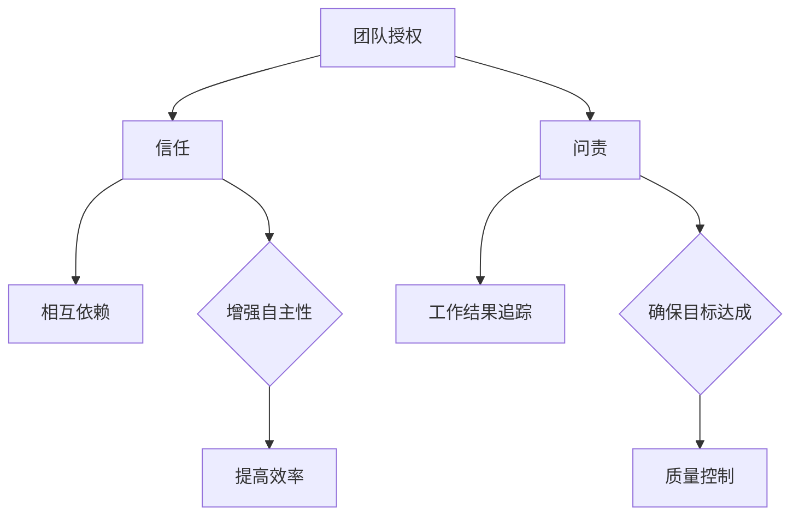

                 

### 文章标题

《团队授权：信任与问责的平衡艺术》

#### 关键词

团队授权、信任、问责、组织文化、领导力

#### 摘要

本文旨在深入探讨团队授权在信息技术领域的实践与挑战。团队授权不仅是提高工作效率的关键，更是建立信任与问责机制的重要手段。文章从背景介绍、核心概念与联系、团队授权的原理与实践、挑战与解决方案、文化与制度支持、领导力要求等多个角度，详细阐述了团队授权的理论和实践。通过具体案例和最佳实践，本文旨在为读者提供一套系统的团队授权指南。

---

### 背景介绍

在现代信息技术行业中，团队的效率和质量成为企业竞争力的核心。团队授权作为管理哲学的重要组成部分，被认为是提升团队效能的有效途径。然而，团队授权并非简单的权力下放，而是在信任与问责机制下的平衡艺术。

#### 核心概念与联系

团队授权、信任与问责是本文的核心概念。团队授权指的是管理者将决策权和资源分配给团队成员，以增强其自主性和责任感。信任是团队授权的基础，指的是团队成员之间的相互依赖和可靠性。问责则是对团队成员工作结果的追踪和评估，确保团队目标的达成。

#### Mermaid 流程图

下面是团队授权的核心概念与联系的 Mermaid 流程图：



### 团队授权的原理与实践

团队授权的原理在于通过权力的下放，使团队成员能够更加自主地开展工作，从而提高团队的整体效率。以下是团队授权的实践步骤：

#### 实践步骤

1. **明确团队目标**：确保所有团队成员对团队目标有清晰的认识。
2. **评估团队成员能力**：了解每个成员的技能和潜力，以确保授权的内容与能力相匹配。
3. **信任建设**：通过沟通和反馈，建立团队成员之间的信任关系。
4. **授权内容**：明确授权的范围和内容，确保团队成员有足够的自主性。
5. **监督与反馈**：建立监督机制，确保团队工作在正确的轨道上，并及时给予反馈。

#### 伪代码

```python
def team_authorization(team_goals, member_skills, trust, authorization_scope):
    """
    团队授权函数
    :param team_goals: 团队目标
    :param member_skills: 成员技能
    :param trust: 信任度
    :param authorization_scope: 授权范围
    :return: 成功与否
    """
    if evaluate_member_skills(member_skills) and build_trust(trust):
        # 分配任务和资源
        assign_tasks_and_resources(team_goals, authorization_scope)
        # 监督与反馈
        monitor_and_feedback(authorization_scope)
        return True
    else:
        return False
```

#### 数学模型和公式

团队授权的成功不仅依赖于成员的能力和信任，还与团队的激励机制密切相关。以下是一个简单的数学模型来描述团队授权的效果：

$$
E = f(A, T, M)
$$

其中，$E$ 代表团队效率，$A$ 代表授权程度，$T$ 代表信任度，$M$ 代表团队成员的技能水平。该模型表明，团队效率是授权程度、信任度和团队成员技能水平的函数。

#### 举例说明

假设一个开发团队需要完成一个复杂的项目。团队成员具备不同的技能，如前端开发、后端开发和测试。通过团队授权，管理者将项目的一部分任务分配给具有相应技能的团队成员，并在整个项目周期中提供必要的支持和反馈。

- **明确团队目标**：确保所有团队成员了解项目的重要性和目标。
- **评估团队成员能力**：根据成员的技能水平，分配合适的任务。
- **信任建设**：通过定期会议和沟通，建立团队成员之间的信任。
- **授权内容**：明确团队成员的任务和责任，并赋予其决策权。
- **监督与反馈**：定期检查项目进展，提供必要的指导和反馈。

通过这种方式，团队成员能够在信任和问责机制的保障下，更加自主地开展工作，从而提高团队的整体效率。

### 团队授权的挑战与解决方案

尽管团队授权具有诸多优势，但在实际操作中仍会面临一系列挑战。

#### 挑战

1. **信任不足**：团队成员可能对管理者缺乏信任，导致授权难以落实。
2. **技能不匹配**：团队成员的技能可能无法满足授权任务的要求。
3. **监督不足**：缺乏有效的监督机制，可能导致团队成员工作偏离目标。
4. **文化冲突**：组织文化可能不支持团队授权，导致实施难度增加。

#### 解决方案

1. **加强沟通与反馈**：通过定期沟通和反馈，建立团队成员之间的信任关系。
2. **培训与发展**：为团队成员提供培训和发展机会，提高其技能水平。
3. **建立监督机制**：制定明确的监督计划和流程，确保团队成员的工作在正确的轨道上。
4. **文化变革**：推动组织文化变革，使团队授权成为组织内部的常态。

#### 成功案例的启示

一个成功的团队授权案例来自一家快速发展的互联网公司。该公司通过团队授权，成功提高了开发团队的效率。以下是该案例的几个启示：

1. **明确目标**：公司为每个团队设定了清晰的目标，使团队成员能够明确自己的职责和任务。
2. **信任建设**：公司通过透明化的管理方式，建立了团队成员之间的信任。
3. **授权与支持**：公司赋予团队成员足够的决策权，并在项目周期中提供必要的技术支持。
4. **反馈与改进**：公司建立了定期的反馈机制，及时调整团队工作方向，提高团队效率。

### 团队授权的文化与制度

团队授权不仅需要信任与问责机制的支撑，还需要组织文化和制度的支持。

#### 组织文化

组织文化是团队授权成功的关键。一个支持团队授权的文化将鼓励团队成员自主决策和创新，减少对管理者的依赖。

1. **透明化**：建立透明的沟通渠道，使团队成员能够了解组织的整体目标和战略。
2. **协作精神**：鼓励团队成员之间的合作与支持，形成共同的目标和价值观。
3. **认可与激励**：通过奖励和认可，鼓励团队成员在授权环境中发挥最佳水平。

#### 制度设计

制度设计是团队授权的有力保障。合理的制度能够确保团队成员在授权环境中能够高效工作，并确保组织目标的实现。

1. **决策权下放**：制定明确的决策权下放规则，使团队成员能够自主决策。
2. **绩效评估**：建立科学的绩效评估体系，确保团队成员的工作结果得到公正评估。
3. **监督机制**：建立有效的监督机制，确保团队成员的工作不会偏离组织目标。

#### 文化与制度的关系

组织文化和制度设计是相辅相成的。文化为团队授权提供了土壤，而制度则为团队授权提供了框架。一个成功的团队授权需要二者紧密结合，共同推动团队的高效运作。

### 团队授权的领导力

团队授权对于领导者提出了新的要求。在传统管理模式下，领导者扮演着决策者和监督者的角色。而在团队授权的环境中，领导者需要转变角色，成为支持者和指导者。

#### 领导者的新角色

1. **支持者**：领导者需要为团队成员提供必要的资源和支持，帮助他们克服工作中的困难。
2. **指导者**：领导者需要为团队成员提供指导和建议，帮助他们提升技能和实现目标。
3. **激励者**：领导者需要通过激励措施，激发团队成员的积极性和创造力。

#### 领导力的提升策略

1. **自我反思**：领导者需要定期进行自我反思，了解自己在团队授权中的角色和行为，不断改进。
2. **学习与成长**：领导者需要不断学习新的管理理念和方法，提升自己的领导力。
3. **建立信任**：领导者需要通过建立信任，营造一个支持团队授权的文化氛围。

### 项目实战

为了更好地理解团队授权的实施过程，我们可以通过一个具体的案例来进行分析。

#### 案例背景

某互联网公司计划开发一款社交应用。公司决定采用团队授权的方式，将项目的不同部分分配给不同的团队，以提高开发效率。

#### 开发环境搭建

1. **技术栈选择**：团队选择了React.js作为前端框架，Node.js作为后端服务，并使用MongoDB作为数据库。
2. **开发工具**：团队使用了Git进行版本控制，Jenkins进行持续集成和部署。

#### 源代码详细实现

以下是前端部分的伪代码实现：

```javascript
// React组件：Feed
class Feed extends React.Component {
  constructor(props) {
    super(props);
    this.state = {
      posts: []
    };
  }

  componentDidMount() {
    fetch('/api/posts')
      .then(response => response.json())
      .then(data => this.setState({ posts: data }));
  }

  render() {
    return (
      <div>
        {this.state.posts.map(post => (
          <Post key={post.id} post={post} />
        ))}
      </div>
    );
  }
}

// React组件：Post
class Post extends React.Component {
  render() {
    return (
      <div>
        <h3>{this.props.post.title}</h3>
        <p>{this.props.post.content}</p>
      </div>
    );
  }
}
```

#### 代码解读与分析

1. **组件结构**：Feed组件负责从后端获取帖子列表，并渲染到界面上。Post组件负责渲染单个帖子。
2. **数据流**：通过React的状态管理，Feed组件在组件挂载时发起请求，获取帖子数据，并更新状态。
3. **代码风格**：采用模块化和组件化开发，使代码易于维护和扩展。

#### 实际案例分析和详细讲解剖析

通过团队授权，该公司的开发团队在不到三个月的时间内完成了社交应用的开发。以下是该项目的主要成就：

1. **快速迭代**：团队通过快速迭代，不断优化产品功能和用户体验。
2. **高效沟通**：团队成员之间建立了良好的沟通机制，确保项目进展顺利。
3. **灵活授权**：团队管理者根据成员的技能和兴趣，灵活分配任务，提高了团队成员的自主性和积极性。

#### 项目小结

该项目通过团队授权，成功提高了开发效率，为公司的产品创新提供了有力支持。项目成功的关键在于：

1. **明确的目标和任务分配**：确保团队成员对任务有清晰的认识。
2. **信任和透明的管理文化**：建立团队成员之间的信任，提高团队的凝聚力。
3. **有效的沟通和反馈机制**：确保团队成员的工作方向与项目目标一致。

### 最佳实践 Tips

1. **定期反馈**：通过定期的团队反馈会议，确保团队成员的工作得到及时评估和指导。
2. **授权与支持并重**：在授权的同时，确保为团队成员提供必要的支持，帮助他们克服困难。
3. **持续学习与改进**：鼓励团队成员不断学习新技能，推动团队持续改进。

### 小结

团队授权是信息技术领域提升团队效率和创新能力的重要手段。通过本文的探讨，我们了解了团队授权的核心概念、原理与实践，以及其在组织文化和领导力方面的要求。通过具体案例的分析，我们看到了团队授权在实践中的成功经验。希望本文能为读者提供有益的启示，助力团队在信息技术领域取得更大的成就。

### 注意事项

1. **团队授权不是放任**：授权并不意味着放任不管，管理者仍需建立有效的监督机制。
2. **避免过度授权**：过度授权可能导致团队成员感到困惑，影响工作效率。

### 拓展阅读

- 《敏捷开发实践指南》
- 《领导者的变革》
- 《企业文化建设手册》

---

### 作者信息

作者：AI天才研究院/AI Genius Institute & 禅与计算机程序设计艺术 /Zen And The Art of Computer Programming

