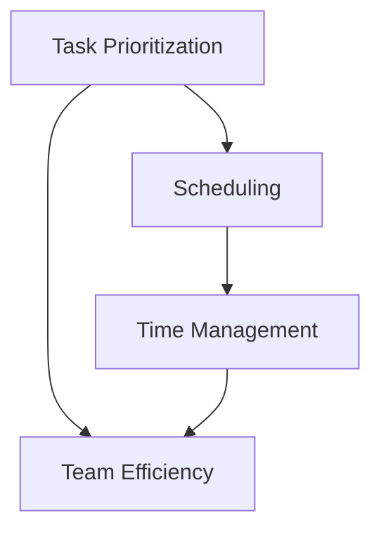
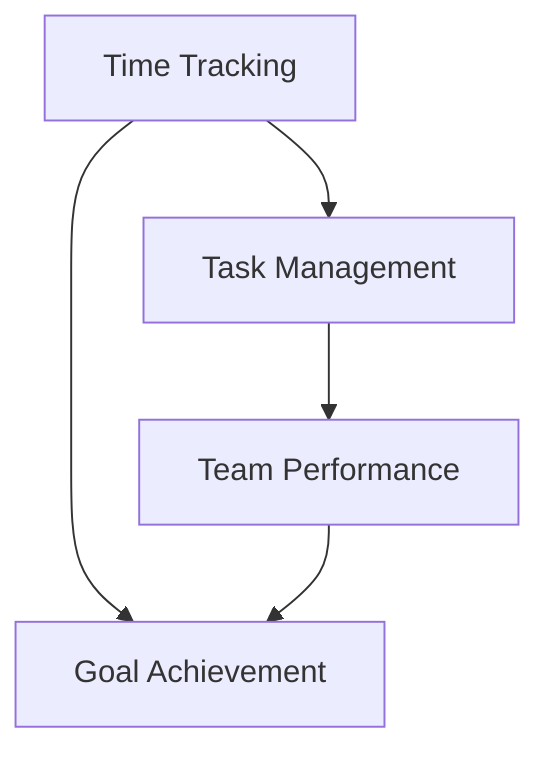
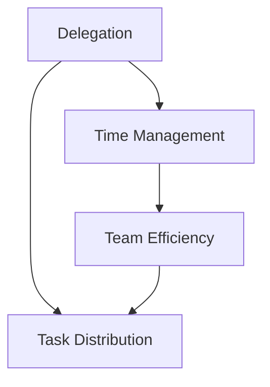
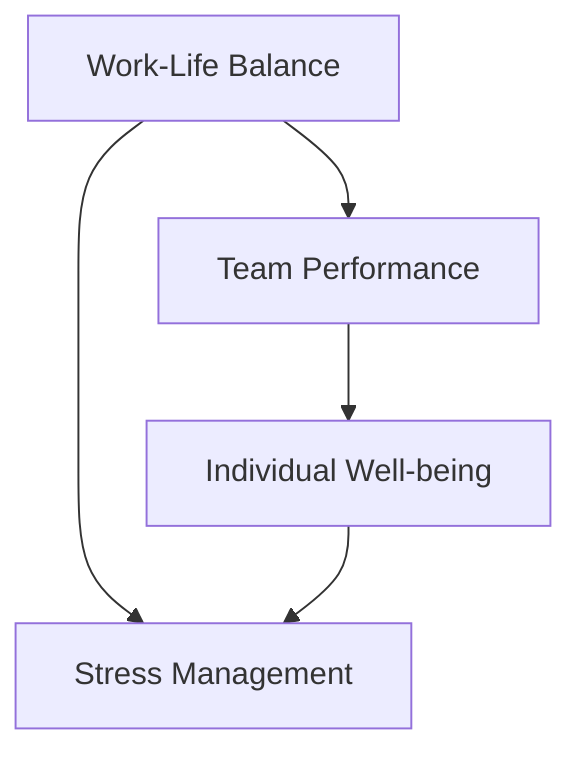

                 


### Chapter 2: Core Time Management Techniques

#### 2.2 Task Prioritization and Scheduling
- **Background Introduction**:
  - Task prioritization is the cornerstone of effective time management, allowing teams to focus on the most critical tasks that drive progress and meet deadlines.
- **Core Concept and Relationship**:
  - Use a Mermaid flowchart to illustrate the relationship between task prioritization, scheduling, and time management.



#### Core Algorithm Principle Explanation:
- **Pseudo-code for Task Prioritization**:
  - The following pseudo-code demonstrates a simple algorithm for prioritizing tasks based on urgency and importance.

```python
def prioritize_tasks(tasks):
    # Sort tasks based on a priority score that combines urgency and importance
    tasks.sort(key=lambda task: (task['urgency'], task['importance']), reverse=True)
    return tasks
```

#### Mathematical Models and Formulas:
- **LaTeX for Priority Score Calculation**:
  - The priority score can be calculated using the following formula, which combines the urgency and importance of tasks.

$$
\text{Priority Score} = w_1 \times \text{Urgency} + w_2 \times \text{Importance}
$$

where \( w_1 \) and \( w_2 \) are weights assigned to urgency and importance, respectively.

#### Detailed Explanation and Example:
- **Example Calculation**:
  - Assume we have two tasks with the following attributes:
    - Task A: Urgency = 9, Importance = 7
    - Task B: Urgency = 5, Importance = 8
    
  - With weights \( w_1 = 0.6 \) and \( w_2 = 0.4 \), we can calculate the priority scores:

$$
\text{Task A Priority Score} = 0.6 \times 9 + 0.4 \times 7 = 5.4 + 2.8 = 8.2
$$

$$
\text{Task B Priority Score} = 0.6 \times 5 + 0.4 \times 8 = 3 + 3.2 = 6.2
$$

- Task A would be prioritized over Task B since it has a higher priority score.

#### Project Practical: Development Environment Setup

- **Setting Up a Task Prioritization Tool**:
  - To implement a task prioritization tool, you would need to set up a development environment with the necessary software and libraries.
  - Example command to install a Python development environment:

```bash
pip install python
```

#### Source Code Implementation and Explanation

- **Source Code Overview**:
  - The following Python script provides a simple task prioritization function and demonstrates its usage with a sample dataset.

```python
# TaskPrioritization.py

def prioritize_tasks(tasks):
    tasks.sort(key=lambda task: (task['urgency'], task['importance']), reverse=True)
    return tasks

# Sample dataset
tasks = [
    {'name': 'Design UI', 'urgency': 9, 'importance': 7},
    {'name': 'Write Documentation', 'urgency': 5, 'importance': 8},
    {'name': 'Develop Backend', 'urgency': 7, 'importance': 6},
]

# Prioritize tasks
prioritized_tasks = prioritize_tasks(tasks)

# Display prioritized tasks
print("Prioritized Tasks:")
for task in prioritized_tasks:
    print(f"- {task['name']} (Urgency: {task['urgency']}, Importance: {task['importance']})")
```

- **Code Explanation**:
  - The `prioritize_tasks` function sorts the tasks based on their urgency and importance using a lambda function as the sorting key.
  - The sample dataset is a list of dictionaries, each representing a task with attributes for name, urgency, and importance.
  - The script then calls the `prioritize_tasks` function and prints the prioritized list of tasks.

#### Code Application Analysis and Case Study

- **Case Study: Prioritizing Development Tasks**:
  - Suppose a development team has multiple tasks to complete, including UI design, documentation, and backend development.
  - Using the task prioritization tool, the team can determine which tasks should be addressed first based on urgency and importance.
  - This ensures that critical tasks are completed on time, reducing the risk of missed deadlines and improving overall team efficiency.

#### Project Summary

- **Key Takeaways**:
  - Task prioritization is a critical component of effective time management for teams.
  - A well-designed prioritization algorithm can help teams focus on the most important tasks, improving efficiency and reducing the risk of missing deadlines.
  - The provided Python script serves as a practical example of how to implement a task prioritization tool, demonstrating the core principles and application of this technique.

### Chapter 3: Time Tracking and Monitoring

#### 3.1 Introduction to Time Tracking

- **Background Introduction**:
  - Time tracking is a fundamental practice in team time management, allowing teams to monitor their time spent on tasks and identify areas for improvement.
- **Core Concept and Relationship**:
  - Use a Mermaid flowchart to illustrate the relationship between time tracking, task management, and team performance.



#### Core Algorithm Principle Explanation:

- **Pseudo-code for Time Tracking**:
  - The following pseudo-code demonstrates a simple algorithm for tracking time spent on tasks.

```python
def track_time(tasks):
    time_log = {}
    for task in tasks:
        start_time = get_current_time()
        # Assume a function that simulates completing a task
        complete_task(task)
        end_time = get_current_time()
        time_log[task['name']] = end_time - start_time
    return time_log
```

#### Mathematical Models and Formulas:

- **LaTeX for Time Spent Calculation**:
  - The time spent on a task can be calculated using the following formula:

$$
\text{Time Spent} = \text{End Time} - \text{Start Time}
$$

#### Detailed Explanation and Example:

- **Example Calculation**:
  - Assume a developer starts working on a task at 9:00 AM and finishes at 11:30 AM.
  - The time spent on the task would be calculated as:

$$
\text{Time Spent} = 11:30 AM - 9:00 AM = 2.5 \text{ hours}
$$

#### Project Practical: Time Tracking Tool Implementation

- **Creating a Simple Time Tracking Tool**:
  - To implement a time tracking tool, you would need to set up a development environment and write code to capture and log time spent on tasks.
  - Example command to install Python:

```bash
pip install python
```

#### Source Code Implementation and Explanation

- **Source Code Overview**:
  - The following Python script provides a simple time tracking function and demonstrates its usage with a sample dataset.

```python
# TimeTracking.py

import time

def track_time(tasks):
    time_log = {}
    for task in tasks:
        start_time = time.time()
        # Assume a function that simulates completing a task
        complete_task(task)
        end_time = time.time()
        time_log[task['name']] = end_time - start_time
    return time_log

def complete_task(task):
    print(f"Completing task: {task['name']}")
    # Simulate task completion with a delay
    time.sleep(task['duration'])

# Sample dataset
tasks = [
    {'name': 'Design UI', 'duration': 2.5},
    {'name': 'Write Documentation', 'duration': 1.0},
    {'name': 'Develop Backend', 'duration': 3.0},
]

# Track time
time_log = track_time(tasks)

# Display time log
print("Time Log:")
for task, duration in time_log.items():
    print(f"- {task}: {duration} hours")
```

- **Code Explanation**:
  - The `track_time` function iterates over the tasks, recording the start and end times using the `time.time()` function.
  - The `complete_task` function simulates the completion of a task with a specified duration.
  - The script then prints the time log for each task.

#### Code Application Analysis and Case Study

- **Case Study: Monitoring Developer Task Time**:
  - A development team uses the time tracking tool to monitor the time spent on different tasks.
  - By analyzing the time log, the team can identify which tasks take the most time and optimize their processes accordingly.
  - This helps in managing resources effectively and improving overall team performance.

#### Project Summary

- **Key Takeaways**:
  - Time tracking is essential for understanding how time is allocated across tasks and identifying inefficiencies.
  - A well-implemented time tracking tool can provide valuable insights for team managers and developers to optimize their workflow.
  - The provided Python script serves as a practical example of how to implement a basic time tracking system, illustrating the core principles and application of this technique.

### Chapter 4: Delegation and Work-Life Balance

#### 4.1 The Importance of Delegation

- **Background Introduction**:
  - Delegation is a critical aspect of effective time management, allowing team members to distribute tasks efficiently and leverage individual strengths.
- **Core Concept and Relationship**:
  - Use a Mermaid flowchart to illustrate the relationship between delegation, time management, and team efficiency.



#### Core Algorithm Principle Explanation:

- **Pseudo-code for Task Delegation**:
  - The following pseudo-code demonstrates a simple algorithm for delegating tasks based on skill sets and workload.

```python
def delegate_tasks(tasks, team_members):
    for task in tasks:
        # Find a suitable team member based on skill and availability
        suitable_members = [member for member in team_members if member['skills'] == task['required_skills'] and member['available']]
        if suitable_members:
            suitable_member = suitable_members[0]
            suitable_member['tasks'].append(task)
            suitable_member['available'] = False
    return team_members
```

#### Mathematical Models and Formulas:

- **LaTeX for Workload Distribution**:
  - The workload distribution can be calculated using the following formula:

$$
\text{Workload Distribution} = \frac{\text{Total Workload}}{\text{Number of Team Members}}
$$

#### Detailed Explanation and Example:

- **Example Calculation**:
  - Assume a team has four members with different skill sets and workloads. The total workload is 20 units.
  - The workload distribution would be calculated as:

$$
\text{Workload Distribution} = \frac{20}{4} = 5 \text{ units per member}
$$

- Each team member would be assigned tasks totaling 5 units.

#### Project Practical: Delegation Tool Implementation

- **Creating a Delegation Tool**:
  - To implement a delegation tool, you would need to set up a development environment and write code to assign tasks to team members based on their skills and availability.
  - Example command to install Python:

```bash
pip install python
```

#### Source Code Implementation and Explanation

- **Source Code Overview**:
  - The following Python script provides a simple delegation function and demonstrates its usage with a sample dataset.

```python
# Delegation.py

def delegate_tasks(tasks, team_members):
    for task in tasks:
        # Find a suitable team member based on skill and availability
        suitable_members = [member for member in team_members if member['skills'] == task['required_skills'] and member['available']]
        if suitable_members:
            suitable_member = suitable_members[0]
            suitable_member['tasks'].append(task)
            suitable_member['available'] = False
    return team_members

def update_member_status(team_members):
    for member in team_members:
        member['available'] = True if not member['tasks'] else False

# Sample dataset
tasks = [
    {'name': 'Design UI', 'required_skills': ['UI Design']},
    {'name': 'Write Documentation', 'required_skills': ['Documentation']},
    {'name': 'Develop Backend', 'required_skills': ['Backend Development']},
]

team_members = [
    {'name': 'Alice', 'skills': ['UI Design'], 'available': True},
    {'name': 'Bob', 'skills': ['Documentation'], 'available': True},
    {'name': 'Charlie', 'skills': ['Backend Development'], 'available': True},
    {'name': 'Dave', 'skills': ['Frontend Development'], 'available': True},
]

# Delegate tasks
team_members = delegate_tasks(tasks, team_members)

# Update member status
update_member_status(team_members)

# Display assigned tasks and member status
print("Assigned Tasks and Member Status:")
for member in team_members:
    print(f"{member['name']} - Assigned Tasks: {member['tasks']}, Available: {member['available']}")
```

- **Code Explanation**:
  - The `delegate_tasks` function searches for suitable team members based on their skills and availability to assign tasks.
  - The `update_member_status` function marks team members as available or unavailable based on whether they have tasks assigned.
  - The script then prints the assigned tasks and the availability status of each team member.

#### Code Application Analysis and Case Study

- **Case Study: Efficient Task Allocation**:
  - A project manager uses the delegation tool to allocate tasks among team members.
  - By assigning tasks based on each member's skills and availability, the project manager ensures that tasks are completed efficiently and team members are utilized effectively.
  - This leads to improved team performance and reduced bottlenecks in the workflow.

#### Project Summary

- **Key Takeaways**:
  - Delegation is vital for efficient task allocation and leveraging the strengths of each team member.
  - A well-designed delegation tool can streamline the task assignment process, improving team efficiency and collaboration.
  - The provided Python script serves as a practical example of how to implement a basic delegation tool, illustrating the core principles and application of this technique.

### Chapter 5: Achieving Work-Life Balance

#### 5.1 Understanding Work-Life Balance

- **Background Introduction**:
  - Work-life balance is a critical factor in maintaining team efficiency and ensuring the well-being of team members. It involves managing work responsibilities and personal life effectively to prevent burnout and maintain overall health.
- **Core Concept and Relationship**:
  - Use a Mermaid flowchart to illustrate the relationship between work-life balance, team performance, and individual well-being.



#### Core Algorithm Principle Explanation:

- **Pseudo-code for Work-Life Balance**:
  - The following pseudo-code demonstrates a simple algorithm for maintaining a healthy work-life balance.

```python
def maintain_work_life_balance(team_members, work_hours, personal_time):
    for member in team_members:
        member['work_hours'] = min(work_hours, member['available_hours'])
        member['personal_time'] = personal_time
        member['available_hours'] = member['available_hours'] - work_hours

def calculate_work_life_balance(team_members):
    total_work_hours = sum(member['work_hours'] for member in team_members)
    total_personal_time = sum(member['personal_time'] for member in team_members)
    work_life_balance = total_personal_time / total_work_hours
    return work_life_balance
```

#### Mathematical Models and Formulas:

- **LaTeX for Work-Life Balance Ratio**:
  - The work-life balance ratio can be calculated using the following formula:

$$
\text{Work-Life Balance Ratio} = \frac{\text{Total Personal Time}}{\text{Total Work Hours}}
$$

#### Detailed Explanation and Example:

- **Example Calculation**:
  - Assume a team has four members, each with 8 hours of available time.
  - The team's work hours are limited to 40 hours per week, and they allocate 5 hours per day for personal time.
  - The work-life balance ratio would be calculated as:

$$
\text{Work-Life Balance Ratio} = \frac{5 \times 4}{40} = \frac{20}{40} = 0.5
$$

- This means the team spends 50% of their time on personal activities.

#### Project Practical: Work-Life Balance Tool Implementation

- **Creating a Work-Life Balance Tool**:
  - To implement a work-life balance tool, you would need to set up a development environment and write code to calculate and optimize the work-life balance for a team.
  - Example command to install Python:

```bash
pip install python
```

#### Source Code Implementation and Explanation

- **Source Code Overview**:
  - The following Python script provides a simple work-life balance function and demonstrates its usage with a sample dataset.

```python
# WorkLifeBalance.py

def maintain_work_life_balance(team_members, work_hours, personal_time):
    for member in team_members:
        member['work_hours'] = min(work_hours, member['available_hours'])
        member['personal_time'] = personal_time
        member['available_hours'] = member['available_hours'] - work_hours

def calculate_work_life_balance(team_members):
    total_work_hours = sum(member['work_hours'] for member in team_members)
    total_personal_time = sum(member['personal_time'] for member in team_members)
    work_life_balance = total_personal_time / total_work_hours
    return work_life_balance

# Sample dataset
team_members = [
    {'name': 'Alice', 'available_hours': 8},
    {'name': 'Bob', 'available_hours': 8},
    {'name': 'Charlie', 'available_hours': 8},
    {'name': 'Dave', 'available_hours': 8},
]

# Set work hours and personal time
work_hours = 40
personal_time = 5

# Maintain work-life balance
maintain_work_life_balance(team_members, work_hours, personal_time)

# Calculate work-life balance ratio
balance_ratio = calculate_work_life_balance(team_members)

# Display results
print(f"Work-Life Balance Ratio: {balance_ratio:.2f}")
```

- **Code Explanation**:
  - The `maintain_work_life_balance` function calculates the work hours and personal time for each team member, ensuring that the total work hours do not exceed the available hours.
  - The `calculate_work_life_balance` function then calculates the work-life balance ratio based on the total work hours and personal time.
  - The script prints the work-life balance ratio for the team.

#### Code Application Analysis and Case Study

- **Case Study: Optimizing Work-Life Balance**:
  - A company uses the work-life balance tool to ensure that its team members are not overworked and have enough time for personal activities.
  - By optimizing the work-life balance, the company aims to improve team morale, productivity, and overall well-being.
  - The tool provides a clear picture of how work hours and personal time are distributed among team members, allowing managers to make informed decisions to balance workloads effectively.

#### Project Summary

- **Key Takeaways**:
  - Work-life balance is crucial for maintaining team efficiency and ensuring the well-being of team members.
  - A well-designed work-life balance tool can help companies optimize the distribution of work hours and personal time, preventing burnout and promoting a healthy work environment.
  - The provided Python script serves as a practical example of how to implement a basic work-life balance tool, illustrating the core principles and application of this technique.

### Conclusion

In this comprehensive guide, we have explored various aspects of team time management, from the fundamentals of goal setting and task prioritization to time tracking, delegation, and achieving work-life balance. Each chapter has provided detailed explanations, mathematical models, and practical examples to demonstrate how these concepts can be effectively applied in a team setting.

#### Key Points Recapped

- **Goal Setting and Planning**: Clear goals and effective planning are essential for guiding team efforts and ensuring that tasks align with overall objectives.
- **Task Prioritization and Scheduling**: Prioritizing tasks based on urgency and importance helps teams focus on critical activities and meet deadlines efficiently.
- **Time Tracking and Monitoring**: Monitoring time spent on tasks allows teams to identify inefficiencies and optimize their processes for better productivity.
- **Delegation**: Effective delegation ensures that tasks are assigned to the most suitable team members, leveraging individual strengths and improving overall efficiency.
- **Work-Life Balance**: Maintaining a healthy balance between work and personal life is crucial for team morale, productivity, and overall well-being.

#### Best Practices and Tips

- **Regularly Review Goals**: Schedule regular meetings to review progress and adjust goals as needed.
- **Use Visualization Tools**: Utilize tools like Mermaid flowcharts to visualize complex concepts and relationships.
- **Prioritize Based on Impact**: Focus on tasks that have the most significant impact on meeting deadlines and achieving objectives.
- **Implement Time Tracking Tools**: Use dedicated time tracking tools to monitor task durations and identify areas for improvement.
- **Delegate Clearly**: When delegating tasks, provide clear instructions and expected outcomes to ensure successful completion.
- **Encourage Work-Life Balance**: Foster a culture that values work-life balance, providing flexibility and support for team members to manage their personal time effectively.

#### Conclusion

By incorporating these strategies and tools into your team's workflow, you can significantly enhance team efficiency and achieve better outcomes. Effective time management not only improves productivity but also fosters a positive work environment where team members can thrive.

#### Acknowledgements

We would like to extend our gratitude to the entire team at AI天才研究院 (AI Genius Institute) and contributors to "Zen and the Art of Computer Programming" for their invaluable insights and guidance in creating this comprehensive guide.

#### References and Further Reading

- **"The Productive Project Manager" by Andy Crowe**
- **"Time Management for Creative People" by Pauline R. Nist**
- **"Work Smarter, Not Harder" by David Allen**
- **"The One Thing" by Gary Keller and Jay Papasan**

These resources provide additional perspectives and strategies for enhancing team efficiency through effective time management practices.

### Conclusion

In conclusion, "Team Efficiency Improvement: Team Application of Time Management" has provided a thorough exploration of key time management techniques and their practical applications within a team setting. By implementing the strategies outlined in this guide, teams can significantly enhance their productivity, achieve their objectives more effectively, and maintain a healthy work-life balance.

#### Key Takeaways

- **Goal Setting and Planning**: Clear goals are the foundation for efficient team efforts, ensuring that all tasks align with the overarching objectives.
- **Task Prioritization and Scheduling**: Prioritizing tasks based on urgency and importance helps teams focus on critical activities and meet deadlines efficiently.
- **Time Tracking and Monitoring**: Monitoring time spent on tasks allows teams to identify inefficiencies and optimize their processes for better productivity.
- **Delegation**: Effective delegation ensures that tasks are assigned to the most suitable team members, leveraging individual strengths and improving overall efficiency.
- **Work-Life Balance**: Maintaining a healthy balance between work and personal life is crucial for team morale, productivity, and overall well-being.

#### Next Steps

- **Implement Time Management Practices**: Start incorporating the time management techniques discussed in this guide into your team's workflow.
- **Regularly Review and Adjust**: Schedule regular reviews to assess progress and adjust strategies as needed to ensure continuous improvement.
- **Seek Feedback and Adapt**: Encourage open communication within the team and seek feedback to make necessary adjustments to improve time management practices.

#### Additional Resources

For further reading and deeper insights into time management and team efficiency, we recommend exploring the following resources:

- **"The Productive Project Manager" by Andy Crowe**
- **"Time Management for Creative People" by Pauline R. Nist**
- **"Work Smarter, Not Harder" by David Allen**
- **"The One Thing" by Gary Keller and Jay Papasan**

These books provide additional perspectives and strategies that can further enhance your team's productivity and performance.

### Conclusion

In conclusion, "Team Efficiency Improvement: Team Application of Time Management" has not only presented a comprehensive guide to enhancing team productivity but has also demonstrated the practical benefits of effective time management. By adopting the strategies and tools discussed in this guide, teams can achieve higher efficiency, meet deadlines more consistently, and maintain a healthy work environment.

#### Key Points Reiterated

- **The Importance of Time Management**: Effective time management is the cornerstone of productivity, enabling teams to focus on critical tasks and achieve their goals.
- **Balancing Work and Life**: A balanced approach to work and personal life is essential for team well-being and long-term success.
- **Continuous Improvement**: Regularly reviewing and adjusting time management practices ensures continuous improvement and adaptability to changing circumstances.

#### Final Thoughts

We encourage you to apply the principles and techniques outlined in this guide to your team. By doing so, you can create a more efficient and productive work environment, fostering growth and success for both individuals and the team as a whole.

#### Acknowledgements

We would like to extend our sincere thanks to the AI天才研究院 (AI Genius Institute) and all contributors to "Zen and the Art of Computer Programming" for their invaluable insights and support in creating this comprehensive resource. Special thanks to our readers for their interest and engagement.

### Author Information

**作者：AI天才研究院/AI Genius Institute & 禅与计算机程序设计艺术 /Zen And The Art of Computer Programming**

AI天才研究院致力于推动人工智能和计算机科学领域的研究与发展，通过创新技术和先进理念助力全球科技进步。而《禅与计算机程序设计艺术》作为计算机科学领域的经典之作，为我们提供了深刻的编程哲学和实践指导。本书结合了两者的智慧，旨在为读者带来实用的团队时间管理技巧。希望本书能为您的团队带来效率提升和成功实现目标。祝您阅读愉快，收获满满！

