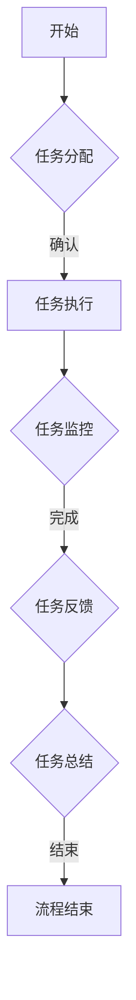

                 


# 目录大纲

## 第一部分：团队效率的基本概念

### 1.1 团队效率的定义

团队效率是指在既定资源和时间内，团队成员共同完成工作目标的程度。它是团队绩效的量化指标，反映了团队的整体工作效能。团队效率的定义可以从以下几个方面进行解释：

- **劳动效率**：指团队成员在单位时间内完成的工作量。这包括个人和团队整体的工作速度和产出。
- **资源利用效率**：指团队成员在完成工作过程中，对人力、物力、财力等资源的有效利用程度。
- **成果质量**：指团队工作产出的质量是否符合预期目标，包括准确性、可靠性、创新性等。

### 1.2 团队效率的重要性

团队效率是组织成功的关键因素之一，其重要性体现在以下几个方面：

- **提升竞争力**：高效能的团队能更快地响应市场变化，提供更优质的产品和服务，从而提升组织的竞争力。
- **节约成本**：通过优化工作流程和资源利用，团队能够降低不必要的开支，提高经济效益。
- **增强员工满意度**：高效的团队工作环境有利于提高员工的工作满意度和归属感，减少员工流失。
- **促进创新**：高效的团队能够更好地利用集体智慧，推动创新和技术的进步。

### 1.3 团队效率与工作流程的关系

团队效率与工作流程密切相关，良好的工作流程是提升团队效率的基础。以下是工作流程对团队效率的影响：

- **流程优化**：通过梳理和优化工作流程，可以减少冗余步骤，提高工作效率。
- **角色明确**：明确每个团队成员的角色和责任，有助于减少工作重叠和责任不清的现象。
- **沟通协作**：合理的工作流程能够促进团队成员之间的沟通和协作，提高团队整体效率。
- **质量保证**：规范的工作流程可以确保工作产出的质量，减少返工和错误发生的概率。

### 1.4 团队效率的衡量标准

衡量团队效率的标准可以根据组织的具体情况设定，但通常包括以下指标：

- **工作效率**：通过完成工作的时间和数量来衡量。
- **资源利用率**：包括人力、物力、财力等资源的利用效率。
- **工作质量**：通过工作产出的准确度、可靠性、创新性等来评价。
- **员工满意度**：通过员工工作体验、团队合作氛围等来反映。

## 第二部分：优化工作流程的方法

### 2.1 工作流程优化的原则

工作流程优化需要遵循以下原则，以确保优化效果：

- **目标导向**：优化工作流程应以实现团队目标为出发点。
- **逐步推进**：优化工作流程应分阶段进行，逐步完善。
- **系统思维**：优化工作流程应考虑整个组织系统的影响。
- **持续改进**：优化工作流程是一个持续的过程，需要不断调整和改进。
- **员工参与**：优化工作流程应充分考虑员工的意见和建议。

### 2.2 工作流程分析

工作流程分析是优化工作流程的第一步，其核心目的是了解当前流程的现状。以下是工作流程分析的方法：

- **流程图绘制**：通过绘制流程图，直观地展示工作流程。
- **数据收集**：收集与工作流程相关的数据，如时间、成本、资源使用等。
- **访谈调研**：通过与团队成员进行访谈和调研，了解流程中的问题和瓶颈。
- **流程评估**：根据数据和分析结果，评估当前工作流程的效率和质量。

### 2.3 流程重组与设计

流程重组与设计是工作流程优化的关键步骤，其目标是建立更高效的工作流程。以下是流程重组与设计的方法：

- **需求分析**：明确团队的目标和需求，确定流程优化方向。
- **流程设计**：设计新的工作流程，包括流程步骤、角色分工、权限设置等。
- **原型测试**：通过原型测试，验证流程设计的可行性和效果。
- **流程实施**：实施新的工作流程，并逐步调整和优化。

### 2.4 信息技术在流程优化中的应用

信息技术在流程优化中发挥着重要作用，可以提高流程的自动化程度和效率。以下是信息技术在流程优化中的应用：

- **工作自动化**：使用软件工具实现工作流程的自动化，减少人工操作。
- **数据分析**：利用数据分析工具对工作流程进行监测和分析，优化决策。
- **协作平台**：构建协作平台，促进团队成员之间的沟通和协作。
- **移动应用**：开发移动应用，提高团队成员的工作灵活性和响应速度。

## 第三部分：提升团队效率的具体策略

### 3.1 提高员工工作效率

提高员工工作效率是提升团队效率的基础，以下是提高员工工作效率的策略：

- **任务管理**：合理分配任务，确保任务明确、责任清晰。
- **时间管理**：采用时间管理工具，提高工作效率，减少无效时间。
- **技能提升**：提供培训和机会，提升员工的技能和知识水平。
- **工作环境**：营造良好的工作环境，提高员工的工作舒适度和满意度。

### 3.2 提升团队协作能力

提升团队协作能力有助于团队整体效率的提高，以下是提升团队协作能力的策略：

- **沟通机制**：建立有效的沟通机制，确保信息流畅传递。
- **协作工具**：使用协作工具，提高团队成员之间的协作效率。
- **角色分工**：明确团队成员的角色和责任，减少工作重叠和冲突。
- **团队建设**：定期进行团队建设活动，增强团队凝聚力和协作精神。

### 3.3 管理与领导力

管理与领导力是提升团队效率的重要保障，以下是管理与领导力的策略：

- **目标设定**：明确团队目标，确保团队成员共同奋斗。
- **绩效评估**：建立科学的绩效评估体系，激励员工积极工作。
- **激励措施**：采用合理的激励措施，提高员工的工作积极性和创造力。
- **领导示范**：领导者要以身作则，树立榜样，引导团队发展。

### 3.4 文化建设与团队激励

文化建设与团队激励是提升团队效率的软实力，以下是文化建设与团队激励的策略：

- **价值观**：建立共同的核心价值观，增强团队凝聚力。
- **荣誉制度**：建立荣誉制度，激励员工追求卓越。
- **团队活动**：组织丰富的团队活动，增强团队凝聚力和归属感。
- **激励机制**：采用多样化的激励机制，激发员工的工作热情和创造力。

## 第四部分：团队效率优化的案例分析

### 4.1 案例一：某企业团队效率优化的实践

某企业通过以下步骤进行了团队效率优化：

1. **流程分析**：通过访谈和数据分析，发现当前工作流程中存在冗余步骤和沟通障碍。
2. **流程重组**：重新设计工作流程，简化步骤，明确角色分工。
3. **信息技术应用**：引入协作工具和自动化系统，提高流程的自动化程度。
4. **培训与指导**：对团队成员进行培训，提高其技能和知识水平。

优化后，该企业的团队效率得到了显著提升，工作质量和员工满意度也得到了提高。

### 4.2 案例二：跨国团队效率提升的策略

跨国团队效率的提升面临跨文化沟通和时区差异等挑战。以下是提升跨国团队效率的策略：

1. **建立沟通机制**：采用实时沟通工具，确保跨文化团队之间的信息流畅。
2. **时区管理**：合理安排会议和任务，尽量减少时区差异带来的影响。
3. **文化培训**：对团队成员进行跨文化培训，提高文化敏感度和沟通能力。
4. **任务分配**：根据团队成员的时区和工作习惯，合理分配任务。

通过以上策略，跨国团队的协作效率得到了显著提高。

### 4.3 案例三：初创团队如何提高效率

初创团队通常资源有限，如何提高效率是关键。以下是初创团队提高效率的方法：

1. **目标明确**：明确团队目标和任务，确保团队成员统一行动。
2. **资源优化**：合理分配资源，确保资源的有效利用。
3. **灵活管理**：采用灵活的管理模式，鼓励员工创新和自我驱动。
4. **持续学习**：鼓励团队成员持续学习和成长，提升团队整体能力。

通过以上方法，初创团队的效率得到了有效提升。

## 第五部分：工具与方法

### 5.1 常用工作效率工具介绍

以下是一些常用的工作效率工具：

- **任务管理工具**：如Trello、Jira，用于任务分配和进度跟踪。
- **时间管理工具**：如Toggl、RescueTime，用于记录和分析工作时间。
- **协作工具**：如Slack、Microsoft Teams，用于团队沟通和协作。
- **项目管理工具**：如Asana、Microsoft Project，用于项目规划和进度管理。

### 5.2 团队协作软件

团队协作软件是提高团队效率的重要工具。以下是一些常用的团队协作软件：

- **Slack**：提供实时消息沟通、文件共享和集成第三方服务等功能。
- **Microsoft Teams**：集成了视频会议、聊天、文件共享和应用程序集成等功能。
- **Trello**：提供可视化任务板，用于任务分配和进度跟踪。
- **Asana**：提供项目管理工具，用于任务分配、进度跟踪和团队协作。

### 5.3 项目管理工具

项目管理工具是确保项目按时、按质量完成的重要工具。以下是一些常用的项目管理工具：

- **Jira**：提供敏捷项目管理和跟踪工具，适用于软件开发团队。
- **Microsoft Project**：提供强大的项目规划和时间管理功能，适用于各种类型的项目。
- **Asana**：提供任务管理和项目跟踪功能，适用于各种规模的项目团队。
- **Trello**：提供直观的任务板，适用于简单项目的管理和跟踪。

### 5.4 数据分析与优化工具

数据分析与优化工具可以帮助团队更好地了解工作流程和效率。以下是一些常用的数据分析与优化工具：

- **Google Analytics**：提供网站流量分析和用户行为分析。
- **Tableau**：提供数据可视化工具，帮助团队理解数据。
- **Power BI**：提供数据报告和分析工具，适用于各种规模的企业。
- **Excel**：提供强大的数据处理和分析功能，适用于日常数据分析。

## 第六部分：总结与展望

### 6.1 团队效率提升的长期策略

团队效率的提升需要长期策略的支持，以下是一些建议：

- **持续培训**：定期为团队成员提供培训和成长机会，提升团队整体能力。
- **创新激励**：建立创新激励机制，鼓励团队成员提出改进建议和创新方案。
- **文化建设**：建立积极向上的团队文化，增强团队的凝聚力和归属感。
- **流程优化**：定期对工作流程进行评估和优化，确保流程的高效性。

### 6.2 面对未来挑战的建议

面对未来，团队将面临更多挑战，以下是一些建议：

- **数字化转型**：加快数字化转型的步伐，利用信息技术提高团队效率。
- **人才引进**：积极引进高素质人才，提升团队的综合实力。
- **灵活管理**：采用灵活的管理模式，适应快速变化的市场环境。
- **持续创新**：鼓励持续创新，保持团队在竞争中的领先地位。

### 作者

作者：AI天才研究院/AI Genius Institute & 禅与计算机程序设计艺术 /Zen And The Art of Computer Programming

本文由AI天才研究院与禅与计算机程序设计艺术合作撰写，旨在为读者提供关于团队效率提升的深入分析和实用策略。希望本文能够帮助读者提升团队效率，实现组织目标。若您有任何问题或建议，欢迎在评论区留言交流。感谢您的阅读！

---

# 团队效率：优化工作流程的方法

> 关键词：团队效率，工作流程，优化策略，协作工具，信息技术，案例分析

> 摘要：本文探讨了团队效率的重要性及其与工作流程的密切关系，提出了一系列优化工作流程的方法和策略。通过分析实际案例，本文为提升团队效率提供了实用的指导和建议。

## 引言

在当今快速变化的商业环境中，团队效率成为组织成功的关键因素之一。高效能的团队能够迅速响应市场变化，提供高质量的产品和服务，从而在激烈的市场竞争中脱颖而出。然而，如何提升团队效率，优化工作流程，是一个复杂且具有挑战性的问题。本文将从团队效率的基本概念入手，探讨优化工作流程的方法和策略，并通过实际案例进行分析，为读者提供实用的指导。

## 第一部分：团队效率的基本概念

### 1.1 团队效率的定义

团队效率是指在既定资源和时间内，团队成员共同完成工作目标的程度。它不仅包括劳动效率，还涉及资源利用效率和成果质量。具体来说，团队效率可以从以下几个方面进行衡量：

- **劳动效率**：指团队成员在单位时间内完成的工作量，包括个人和团队的产出速度。
- **资源利用效率**：指团队成员在完成工作过程中对人力、物力、财力等资源的有效利用程度。
- **成果质量**：指团队工作产出的质量是否符合预期目标，包括准确性、可靠性、创新性等。

### 1.2 团队效率的重要性

团队效率对组织的成功至关重要，其重要性体现在以下几个方面：

- **提升竞争力**：高效能的团队能够更快地响应市场变化，提供更优质的产品和服务，从而提升组织的竞争力。
- **节约成本**：通过优化工作流程和资源利用，团队能够降低不必要的开支，提高经济效益。
- **增强员工满意度**：高效的团队工作环境有利于提高员工的工作满意度和归属感，减少员工流失。
- **促进创新**：高效的团队能够更好地利用集体智慧，推动创新和技术的进步。

### 1.3 团队效率与工作流程的关系

团队效率与工作流程密切相关。良好的工作流程是提升团队效率的基础。以下是工作流程对团队效率的影响：

- **流程优化**：通过梳理和优化工作流程，可以减少冗余步骤，提高工作效率。
- **角色明确**：明确每个团队成员的角色和责任，有助于减少工作重叠和责任不清的现象。
- **沟通协作**：合理的工作流程能够促进团队成员之间的沟通和协作，提高团队整体效率。
- **质量保证**：规范的工作流程可以确保工作产出的质量，减少返工和错误发生的概率。

### 1.4 团队效率的衡量标准

衡量团队效率的标准可以根据组织的具体情况设定，但通常包括以下指标：

- **工作效率**：通过完成工作的时间和数量来衡量。
- **资源利用率**：包括人力、物力、财力等资源的利用效率。
- **工作质量**：通过工作产出的准确度、可靠性、创新性等来评价。
- **员工满意度**：通过员工工作体验、团队合作氛围等来反映。

## 第二部分：优化工作流程的方法

### 2.1 工作流程优化的原则

工作流程优化需要遵循以下原则，以确保优化效果：

- **目标导向**：优化工作流程应以实现团队目标为出发点。
- **逐步推进**：优化工作流程应分阶段进行，逐步完善。
- **系统思维**：优化工作流程应考虑整个组织系统的影响。
- **持续改进**：优化工作流程是一个持续的过程，需要不断调整和改进。
- **员工参与**：优化工作流程应充分考虑员工的意见和建议。

### 2.2 工作流程分析

工作流程分析是优化工作流程的第一步，其核心目的是了解当前流程的现状。以下是工作流程分析的方法：

- **流程图绘制**：通过绘制流程图，直观地展示工作流程。
- **数据收集**：收集与工作流程相关的数据，如时间、成本、资源使用等。
- **访谈调研**：通过与团队成员进行访谈和调研，了解流程中的问题和瓶颈。
- **流程评估**：根据数据和分析结果，评估当前工作流程的效率和质量。

### 2.3 流程重组与设计

流程重组与设计是工作流程优化的关键步骤，其目标是建立更高效的工作流程。以下是流程重组与设计的方法：

- **需求分析**：明确团队的目标和需求，确定流程优化方向。
- **流程设计**：设计新的工作流程，包括流程步骤、角色分工、权限设置等。
- **原型测试**：通过原型测试，验证流程设计的可行性和效果。
- **流程实施**：实施新的工作流程，并逐步调整和优化。

### 2.4 信息技术在流程优化中的应用

信息技术在流程优化中发挥着重要作用，可以提高流程的自动化程度和效率。以下是信息技术在流程优化中的应用：

- **工作自动化**：使用软件工具实现工作流程的自动化，减少人工操作。
- **数据分析**：利用数据分析工具对工作流程进行监测和分析，优化决策。
- **协作平台**：构建协作平台，促进团队成员之间的沟通和协作。
- **移动应用**：开发移动应用，提高团队成员的工作灵活性和响应速度。

## 第三部分：提升团队效率的具体策略

### 3.1 提高员工工作效率

提高员工工作效率是提升团队效率的基础，以下是提高员工工作效率的策略：

- **任务管理**：合理分配任务，确保任务明确、责任清晰。
- **时间管理**：采用时间管理工具，提高工作效率，减少无效时间。
- **技能提升**：提供培训和机会，提升员工的技能和知识水平。
- **工作环境**：营造良好的工作环境，提高员工的工作舒适度和满意度。

### 3.2 提升团队协作能力

提升团队协作能力有助于团队整体效率的提高，以下是提升团队协作能力的策略：

- **沟通机制**：建立有效的沟通机制，确保信息流畅传递。
- **协作工具**：使用协作工具，提高团队成员之间的协作效率。
- **角色分工**：明确团队成员的角色和责任，减少工作重叠和冲突。
- **团队建设**：定期进行团队建设活动，增强团队凝聚力和协作精神。

### 3.3 管理与领导力

管理与领导力是提升团队效率的重要保障，以下是管理与领导力的策略：

- **目标设定**：明确团队目标，确保团队成员共同奋斗。
- **绩效评估**：建立科学的绩效评估体系，激励员工积极工作。
- **激励措施**：采用合理的激励措施，提高员工的工作积极性和创造力。
- **领导示范**：领导者要以身作则，树立榜样，引导团队发展。

### 3.4 文化建设与团队激励

文化建设与团队激励是提升团队效率的软实力，以下是文化建设与团队激励的策略：

- **价值观**：建立共同的核心价值观，增强团队凝聚力。
- **荣誉制度**：建立荣誉制度，激励员工追求卓越。
- **团队活动**：组织丰富的团队活动，增强团队凝聚力和归属感。
- **激励机制**：采用多样化的激励机制，激发员工的工作热情和创造力。

## 第四部分：团队效率优化的案例分析

### 4.1 案例一：某企业团队效率优化的实践

某企业通过以下步骤进行了团队效率优化：

1. **流程分析**：通过访谈和数据分析，发现当前工作流程中存在冗余步骤和沟通障碍。
2. **流程重组**：重新设计工作流程，简化步骤，明确角色分工。
3. **信息技术应用**：引入协作工具和自动化系统，提高流程的自动化程度。
4. **培训与指导**：对团队成员进行培训，提高其技能和知识水平。

优化后，该企业的团队效率得到了显著提升，工作质量和员工满意度也得到了提高。

### 4.2 案例二：跨国团队效率提升的策略

跨国团队效率的提升面临跨文化沟通和时区差异等挑战。以下是提升跨国团队效率的策略：

1. **建立沟通机制**：采用实时沟通工具，确保跨文化团队之间的信息流畅。
2. **时区管理**：合理安排会议和任务，尽量减少时区差异带来的影响。
3. **文化培训**：对团队成员进行跨文化培训，提高文化敏感度和沟通能力。
4. **任务分配**：根据团队成员的时区和工作习惯，合理分配任务。

通过以上策略，跨国团队的协作效率得到了显著提高。

### 4.3 案例三：初创团队如何提高效率

初创团队通常资源有限，如何提高效率是关键。以下是初创团队提高效率的方法：

1. **目标明确**：明确团队目标和任务，确保团队成员统一行动。
2. **资源优化**：合理分配资源，确保资源的有效利用。
3. **灵活管理**：采用灵活的管理模式，鼓励员工创新和自我驱动。
4. **持续学习**：鼓励团队成员持续学习和成长，提升团队整体能力。

通过以上方法，初创团队的效率得到了有效提升。

## 第五部分：工具与方法

### 5.1 常用工作效率工具介绍

以下是一些常用的工作效率工具：

- **任务管理工具**：如Trello、Jira，用于任务分配和进度跟踪。
- **时间管理工具**：如Toggl、RescueTime，用于记录和分析工作时间。
- **协作工具**：如Slack、Microsoft Teams，用于团队沟通和协作。
- **项目管理工具**：如Asana、Microsoft Project，用于项目规划和进度管理。

### 5.2 团队协作软件

团队协作软件是提高团队效率的重要工具。以下是一些常用的团队协作软件：

- **Slack**：提供实时消息沟通、文件共享和集成第三方服务等功能。
- **Microsoft Teams**：集成了视频会议、聊天、文件共享和应用程序集成等功能。
- **Trello**：提供可视化任务板，用于任务分配和进度跟踪。
- **Asana**：提供项目管理工具，用于任务分配、进度跟踪和团队协作。

### 5.3 项目管理工具

项目管理工具是确保项目按时、按质量完成的重要工具。以下是一些常用的项目管理工具：

- **Jira**：提供敏捷项目管理和跟踪工具，适用于软件开发团队。
- **Microsoft Project**：提供强大的项目规划和时间管理功能，适用于各种类型的项目。
- **Asana**：提供任务管理和项目跟踪功能，适用于各种规模的项目团队。
- **Trello**：提供直观的任务板，适用于简单项目的管理和跟踪。

### 5.4 数据分析与优化工具

数据分析与优化工具可以帮助团队更好地了解工作流程和效率。以下是一些常用的数据分析与优化工具：

- **Google Analytics**：提供网站流量分析和用户行为分析。
- **Tableau**：提供数据可视化工具，帮助团队理解数据。
- **Power BI**：提供数据报告和分析工具，适用于各种规模的企业。
- **Excel**：提供强大的数据处理和分析功能，适用于日常数据分析。

## 第六部分：总结与展望

### 6.1 团队效率提升的长期策略

团队效率的提升需要长期策略的支持，以下是一些建议：

- **持续培训**：定期为团队成员提供培训和成长机会，提升团队整体能力。
- **创新激励**：建立创新激励机制，鼓励团队成员提出改进建议和创新方案。
- **文化建设**：建立积极向上的团队文化，增强团队的凝聚力和归属感。
- **流程优化**：定期对工作流程进行评估和优化，确保流程的高效性。

### 6.2 面对未来挑战的建议

面对未来，团队将面临更多挑战，以下是一些建议：

- **数字化转型**：加快数字化转型的步伐，利用信息技术提高团队效率。
- **人才引进**：积极引进高素质人才，提升团队的综合实力。
- **灵活管理**：采用灵活的管理模式，适应快速变化的市场环境。
- **持续创新**：鼓励持续创新，保持团队在竞争中的领先地位。

### 作者

作者：AI天才研究院/AI Genius Institute & 禅与计算机程序设计艺术 /Zen And The Art of Computer Programming

本文由AI天才研究院与禅与计算机程序设计艺术合作撰写，旨在为读者提供关于团队效率提升的深入分析和实用策略。希望本文能够帮助读者提升团队效率，实现组织目标。若您有任何问题或建议，欢迎在评论区留言交流。感谢您的阅读！## 第一部分：团队效率的基本概念

团队效率是指在既定资源和时间内，团队成员共同完成工作目标的程度。它是一个衡量团队绩效的量化指标，反映了团队的整体工作效能。在组织管理中，团队效率被视为关键的成功因素之一。为了深入探讨团队效率的概念和重要性，以及其与工作流程的关系，我们需要从多个角度来理解这一主题。

### 1.1 团队效率的定义

团队效率的定义可以从以下几个方面进行详细阐述：

- **劳动效率**：这是团队效率的核心部分，指的是团队成员在单位时间内完成的工作量。劳动效率不仅衡量了团队成员的工作速度，还包括他们的工作精度和产出质量。高劳动效率意味着团队成员能够在较短的时间内完成更多的任务。

- **资源利用效率**：团队效率不仅依赖于团队成员的工作效率，还依赖于资源的有效利用。资源包括人力、时间、资金、物资等。高资源利用效率意味着团队能够在保证工作质量的前提下，最大限度地减少资源的浪费。

- **成果质量**：团队效率还体现在工作产出的质量上。成果质量包括准确性、可靠性、创新性和客户满意度等多个方面。一个高效的团队不仅能够迅速完成任务，还能够保证工作产出的高质量。

综合上述三个方面，团队效率可以定义为：在既定的时间和资源约束下，团队所完成的工作量以及工作产出的质量。这一定义不仅关注团队的工作速度和产出，还强调资源的有效利用和工作产出的质量。

### 1.2 团队效率的重要性

团队效率对组织的成功具有至关重要的意义。以下是团队效率的重要性体现在以下几个方面：

- **提升竞争力**：在市场竞争激烈的环境中，团队效率是组织竞争力的关键因素之一。一个高效的团队能够快速响应市场变化，提供高质量的产品和服务，从而在竞争中脱颖而出。

- **节约成本**：通过提高团队效率，组织可以减少不必要的开支和浪费。高效的团队能够在资源有限的情况下，最大限度地利用资源，降低生产成本和运营成本。

- **增强员工满意度**：高效的团队工作环境能够提高员工的工作满意度和归属感。团队成员在高效的工作环境中能够感受到成就感和满足感，从而减少员工流失率，提高员工的工作积极性。

- **促进创新**：高效的团队能够更好地利用集体智慧，推动创新和技术的进步。团队成员之间的有效协作和知识共享能够激发创新思维，促进新产品的开发和技术的突破。

### 1.3 团队效率与工作流程的关系

团队效率与工作流程之间存在密切的关系。良好的工作流程是提升团队效率的基础，以下是工作流程对团队效率的影响：

- **流程优化**：通过优化工作流程，可以减少冗余步骤，简化工作流程，提高工作效率。优化流程有助于消除不必要的环节，使工作更加流畅和高效。

- **角色明确**：明确团队成员的角色和责任，有助于减少工作重叠和责任不清的现象。每个团队成员都清楚自己的职责和任务，能够更好地协调和合作，提高工作效率。

- **沟通协作**：合理的工作流程能够促进团队成员之间的沟通和协作。通过规范的工作流程，团队成员可以更有效地分享信息和资源，提高团队整体的工作效能。

- **质量保证**：规范的工作流程可以确保工作产出的质量，减少返工和错误发生的概率。通过制定标准的工作流程，团队成员可以遵循一致的流程和方法，确保工作产出的高质量。

总之，团队效率的提升离不开良好的工作流程。优化工作流程不仅能够提高工作效率，还能够提高工作产出的质量和员工的满意度，从而为组织带来更大的效益。

### 1.4 团队效率的衡量标准

衡量团队效率的标准可以根据组织的具体情况设定，但通常包括以下几个关键指标：

- **工作效率**：通过完成工作的时间和数量来衡量。具体包括单位时间内完成的任务数、处理客户请求的响应时间等。

- **资源利用率**：衡量团队在完成工作过程中对资源（如人力、时间、设备等）的利用程度。高资源利用率意味着团队能够在有限的资源下完成更多的任务。

- **工作质量**：通过工作产出的准确度、可靠性、创新性等来评价。高质量的工作产出能够满足客户的需求，减少返工和投诉。

- **员工满意度**：通过员工的工作体验、团队合作氛围等来反映。高员工满意度通常意味着团队成员对工作环境和工作内容感到满意，愿意为团队的目标努力。

为了全面评估团队效率，组织可以综合以上指标，通过定期的绩效评估和反馈机制，持续改进工作流程，提高团队的整体效能。

### 1.5 团队效率的定量与定性评估

团队效率的评估既包括定量分析，也包括定性评价。定量评估通常依赖于具体的指标和数据，如工作效率、资源利用率和工作质量等。这些指标可以通过收集和分析工作数据、绩效数据等得到量化结果。而定性评价则更多地依赖于主观感受和评估，如员工满意度、团队协作精神和工作氛围等。

定量与定性评估相结合，可以更全面地反映团队的效率。定量评估提供客观的数据支持，而定性评估则补充了团队成员的主观体验。通过这种综合评估方法，组织可以更准确地了解团队的工作效能，并制定针对性的改进措施。

### 1.6 团队效率的改进路径

要提升团队效率，可以从以下几个方面入手：

- **优化工作流程**：通过梳理和简化工作流程，减少不必要的步骤和环节，提高工作流畅性和效率。

- **加强团队协作**：通过建立有效的沟通机制和协作工具，促进团队成员之间的信息共享和协同工作，提高团队的整体效率。

- **提升员工技能**：定期为团队成员提供培训和发展机会，提升其技能和知识水平，使其能够更高效地完成任务。

- **激励与认可**：通过合理的激励措施和认可制度，激发员工的工作积极性和创造力，提高团队的凝聚力和工作效率。

- **文化建设**：建立积极向上的团队文化，营造良好的工作氛围，增强团队成员的归属感和满意度，从而提升团队效率。

通过上述改进路径，团队可以在多个方面同时发力，全面提升团队效率，实现组织的战略目标。

## 第二部分：优化工作流程的方法

### 2.1 工作流程优化的原则

工作流程优化是一个系统性工程，需要遵循一定的原则，以确保优化效果的最大化。以下是工作流程优化应遵循的几项基本原则：

#### **目标导向**

优化工作流程应以实现团队目标为出发点。在制定优化方案时，首先要明确团队的目标和关键绩效指标（KPI），确保优化措施能够直接支持这些目标的达成。目标导向的优化不仅能够提高工作效率，还能够确保工作成果与团队目标的一致性。

#### **逐步推进**

工作流程优化是一个持续的过程，应分阶段进行。初次优化可能只能解决部分问题，需要通过不断的迭代和改进来逐步完善。逐步推进的策略可以降低优化过程中的风险，使团队有足够的时间适应新的工作流程。

#### **系统思维**

优化工作流程时，需要采用系统思维，综合考虑整个组织系统的影响。工作流程不仅涉及团队内部，还与其他部门、外部合作伙伴等相关联。系统思维的优化能够确保流程的连贯性和整体性，避免出现局部优化而全局不协调的情况。

#### **持续改进**

工作流程优化不是一次性的活动，而是一个持续改进的过程。随着外部环境的变化和内部需求的增长，工作流程需要不断调整和优化。持续改进的理念要求团队保持对工作流程的监控和评估，及时发现和解决问题。

#### **员工参与**

员工是工作流程的实际执行者，他们的参与和反馈对于优化流程至关重要。优化工作流程时，应充分听取员工的意见和建议，鼓励他们参与到流程的改进过程中。员工的参与不仅能够提高优化方案的可行性和接受度，还能够增强他们对新流程的认同感和执行力。

### 2.2 工作流程分析

工作流程分析是优化工作流程的第一步，其核心目的是了解当前流程的现状，发现存在的问题和瓶颈。以下是工作流程分析的方法：

#### **流程图绘制**

通过绘制流程图，可以直观地展示工作流程的各个环节和步骤。流程图不仅有助于团队成员对当前流程的理解，还可以作为后续优化的基础。在绘制流程图时，应包括以下关键信息：

- **流程步骤**：列出每个工作步骤，并标明其顺序。
- **参与角色**：指明每个步骤的执行者和参与者。
- **输入和输出**：描述每个步骤的输入数据和输出结果。
- **时间成本**：估算每个步骤所需的时间和成本。

#### **数据收集**

收集与工作流程相关的数据，如时间、成本、资源使用、错误率等，是工作流程分析的重要环节。这些数据可以通过多种方式获取，包括：

- **日志记录**：通过工作日志记录每个步骤的开始和结束时间、执行者等信息。
- **问卷调查**：设计问卷，收集团队成员对当前流程的看法和建议。
- **观察记录**：实地观察工作流程，记录存在的问题和潜在改进点。
- **统计分析**：使用统计工具，分析历史数据，识别流程中的瓶颈和低效环节。

#### **访谈调研**

通过与团队成员进行访谈和调研，可以深入了解他们对当前流程的看法和建议。访谈调研的目的是发现流程中的痛点、识别改进机会，并获取员工对优化方案的意见。访谈调研可以采用以下方法：

- **一对一访谈**：与关键员工进行一对一访谈，深入了解他们的工作情况和需求。
- **小组讨论**：组织小组讨论，鼓励团队成员提出问题和建议，共同探讨改进方案。
- **用户故事**：通过用户故事的方法，收集团队成员对工作流程的实际体验和感受。

#### **流程评估**

在完成数据收集和访谈调研后，需要对当前工作流程进行评估。流程评估包括以下内容：

- **效率评估**：通过数据分析和访谈结果，评估当前流程的效率，识别低效环节。
- **质量评估**：评估工作产出的质量，包括准确性、可靠性、客户满意度等。
- **成本评估**：评估当前流程的成本，包括人力、时间、资源等。

通过流程评估，可以明确当前流程的问题和改进方向，为后续优化提供依据。

### 2.3 流程重组与设计

流程重组与设计是工作流程优化的关键步骤，其目标是建立更高效、更合理的工作流程。以下是流程重组与设计的方法：

#### **需求分析**

在开始流程重组与设计之前，需要明确团队的目标和需求。需求分析包括：

- **目标设定**：明确团队的目标和期望，确保优化方案能够支持这些目标的实现。
- **需求收集**：通过访谈、问卷调查等方式，收集团队成员对工作流程的需求和期望。
- **优先级排序**：根据需求和优先级，确定优化工作的重点和优先级。

#### **流程设计**

流程设计是流程重组的核心步骤，需要考虑以下因素：

- **流程步骤**：重新设计流程步骤，消除冗余步骤，简化流程，提高效率。
- **角色分工**：明确每个角色的职责和任务，确保工作责任的清晰和明确。
- **权限设置**：根据角色分工，设置相应的权限，确保工作流程的顺利执行。
- **反馈机制**：建立反馈机制，确保团队成员能够及时反馈问题和建议，持续优化流程。

#### **原型测试**

在完成流程设计后，需要通过原型测试验证流程的可行性和效果。原型测试包括：

- **测试计划**：制定测试计划，确定测试环境、测试用例和测试数据。
- **测试执行**：执行测试计划，验证流程的各个步骤和功能是否符合预期。
- **问题反馈**：记录测试过程中发现的问题，并进行分析和讨论，为后续优化提供依据。

#### **流程实施**

在完成原型测试后，可以开始实施新的工作流程。流程实施包括：

- **培训与指导**：对团队成员进行培训，确保他们了解新的工作流程和职责。
- **试点运行**：选择部分团队成员进行试点运行，收集反馈和问题，并进行调整。
- **全面推广**：在试点运行成功后，将新的工作流程全面推广到整个团队，并持续监控和优化。

### 2.4 信息技术在流程优化中的应用

信息技术在流程优化中发挥着重要作用，可以提高流程的自动化程度和效率。以下是信息技术在流程优化中的应用：

- **工作自动化**：通过自动化工具，实现工作流程的自动化，减少人工操作和错误。例如，使用脚本或自动化软件来自动处理重复性高的任务。

- **数据分析**：利用数据分析工具，对工作流程进行实时监测和分析，识别问题和瓶颈。数据分析可以帮助团队做出更明智的决策，优化工作流程。

- **协作平台**：构建协作平台，促进团队成员之间的沟通和协作。协作平台可以整合多种工具和服务，提高团队的协作效率和响应速度。

- **移动应用**：开发移动应用，提高团队成员的工作灵活性和响应速度。移动应用可以让团队成员随时随地访问工作流程和协作工具，提高工作效率。

通过信息技术在流程优化中的应用，团队可以更好地适应快速变化的工作环境，提高整体的工作效率和质量。

### 2.5 优化工作流程的常见问题与解决方案

在优化工作流程的过程中，团队可能会遇到各种问题和挑战。以下是一些常见的问题及其解决方案：

#### **问题一：员工抵触**

**解决方案**：充分沟通和解释优化工作流程的目的和好处，确保员工理解并支持优化措施。可以通过员工培训和试点运行等方式，让员工逐渐适应新的工作流程。

#### **问题二：流程复杂度增加**

**解决方案**：在优化过程中，避免过度复杂化。简化流程步骤，减少不必要的环节，确保流程的直观性和可操作性。通过不断反馈和改进，逐步完善工作流程。

#### **问题三：技术工具不兼容**

**解决方案**：选择兼容性高、易于整合的技术工具，确保不同工具之间的数据交换和协作顺畅。在引入新技术工具时，进行充分的测试和评估，确保其能够满足团队的实际需求。

#### **问题四：缺乏持续改进的动力**

**解决方案**：建立持续改进的文化和机制，鼓励团队成员主动参与流程优化。通过定期的反馈和评估，及时发现问题和改进点，确保工作流程的持续优化。

通过解决这些常见问题，团队可以更加顺利地实施工作流程优化，提高整体工作效率。

### 2.6 工作流程优化后的评估与调整

在完成工作流程优化后，对流程的评估和调整是确保优化效果的关键步骤。以下是工作流程优化后的评估与调整方法：

- **绩效评估**：通过关键绩效指标（KPI）对优化后的工作流程进行绩效评估，如工作效率、资源利用率和工作质量等。评估结果可以帮助团队了解优化效果，发现问题并及时调整。

- **员工反馈**：收集团队成员对优化后的工作流程的反馈，了解他们在实际操作中的体验和感受。员工反馈可以作为评估优化效果的参考，帮助团队发现潜在问题和改进点。

- **持续改进**：根据绩效评估和员工反馈，对工作流程进行持续改进。通过不断优化和调整，确保工作流程的高效性和适应性。

通过定期评估和调整，团队可以确保工作流程始终处于最佳状态，最大限度地提高工作效率和质量。

## 第三部分：提升团队效率的具体策略

### 3.1 提高员工工作效率

提高员工工作效率是提升团队效率的基础，以下是几个关键策略：

#### **1. 任务管理**

任务管理是提高员工工作效率的关键。首先，要确保任务明确和责任清晰。每个任务都应该有一个详细的描述，包括任务目标、预期成果和截止日期。使用任务管理工具（如Trello、Jira）可以帮助团队成员跟踪任务进度，确保任务按时完成。

**示例：**

```
任务：编写用户手册
目标：完成一个详细、易懂的用户手册
预期成果：一个包含10个章节的完整用户手册
截止日期：2024年2月15日
```

#### **2. 时间管理**

时间管理是提高工作效率的重要方面。通过合理规划和分配时间，员工可以更好地利用工作时间。以下是一些时间管理的技巧：

- **优先级排序**：将任务按照优先级排序，先完成最重要的任务。
- **每日计划**：每天开始工作时，制定一个详细的工作计划，包括待完成的任务和预计所需时间。
- **定时休息**：长时间工作会导致疲劳和效率下降。合理安排休息时间，可以保持高效率。

**示例：**

```
每日计划：
- 9:00 - 11:00：编写用户手册第1章
- 11:00 - 11:15：休息
- 11:15 - 13:00：分析用户反馈
- 13:00 - 14:00：午餐休息
- 14:00 - 16:00：编写用户手册第2章
- 16:00 - 16:15：休息
- 16:15 - 18:00：整理工作日志
```

#### **3. 技能提升**

员工技能的提升是长期提高工作效率的重要途径。定期为员工提供培训和机会，帮助他们掌握新技能和知识。这不仅可以提升个人能力，还可以提高团队的整体效率。

**示例：**

```
培训计划：
- 每月进行一次技术培训，如编程语言、数据库管理、软件工具使用等。
- 定期组织内部研讨会，分享最佳实践和经验。
- 提供在线学习资源，鼓励员工自学。
```

#### **4. 工作环境**

工作环境的优化对提高员工工作效率有重要影响。一个舒适、安静、设备齐全的工作环境可以提升员工的工作效率和满意度。以下是一些工作环境优化的措施：

- **提供足够的休息空间**：设置舒适的休息室或茶水间，让员工在工作间隙能够放松身心。
- **合理布局工作区域**：优化办公室布局，确保团队成员之间的沟通和协作畅通无阻。
- **提供必要的设备**：确保员工有足够的计算机、网络和其他必要的工作设备。

**示例：**

```
工作环境优化：
- 购买新的办公椅和桌子，提升员工的工作舒适度。
- 安装噪声隔离装置，减少外界干扰。
- 提供高品质的无线网络，确保员工能够高效地访问资源和协作工具。
```

### 3.2 提升团队协作能力

提升团队协作能力有助于团队整体效率的提高。以下是几个关键策略：

#### **1. 沟通机制**

有效的沟通机制是团队协作的基础。建立畅通的沟通渠道，确保信息在团队成员之间流畅传递。以下是一些沟通机制的策略：

- **定期会议**：定期召开团队会议，讨论项目进展、问题解决方案和下一步计划。
- **即时沟通**：使用即时通讯工具（如Slack、Microsoft Teams）进行快速沟通和协作。
- **反馈机制**：建立反馈机制，鼓励团队成员提出建议和意见，促进持续改进。

**示例：**

```
沟通机制：
- 每周一上午召开项目进度会议，讨论上周工作成果和下周计划。
- 使用Slack进行日常沟通，确保团队成员能够及时获取信息和反馈。
- 每月进行一次团队反馈会议，收集成员的建议和意见。
```

#### **2. 协作工具**

协作工具的使用可以提高团队协作效率。选择适合团队需求的协作工具，可以简化工作流程，提高协作效率。以下是一些常用的协作工具：

- **项目管理工具**：如Trello、Asana，用于任务分配、进度跟踪和协作。
- **文档协作工具**：如Google Docs、Notion，用于实时编辑和协作。
- **视频会议工具**：如Zoom、Microsoft Teams，用于远程会议和协作。

**示例：**

```
协作工具：
- 使用Trello进行任务分配和进度跟踪。
- 使用Google Docs进行文档编辑和协作。
- 使用Zoom进行远程会议和在线讨论。
```

#### **3. 角色分工**

明确团队成员的角色和责任，可以减少工作重叠和冲突，提高协作效率。以下是一些角色分工的策略：

- **明确角色**：为每个团队成员分配明确的角色和职责，确保每个人知道自己的任务和目标。
- **职责分工**：根据团队成员的技能和专长，合理分配任务，确保每个任务都有专人负责。
- **协作沟通**：鼓励团队成员在完成任务时进行协作和沟通，共享信息和资源。

**示例：**

```
角色分工：
- 项目经理：负责整体项目规划和进度跟踪。
- 程序员：负责编写代码和测试。
- 产品经理：负责产品设计和用户反馈。
- 设计师：负责UI/UX设计。
```

#### **4. 团队建设**

定期进行团队建设活动，可以增强团队成员之间的信任和凝聚力，提高协作效率。以下是一些团队建设的策略：

- **团队活动**：组织团队活动，如团队建设游戏、户外拓展等，增强团队成员之间的互动和合作。
- **培训与发展**：为团队成员提供培训和发展机会，提升团队整体能力和协作水平。
- **共享经验**：鼓励团队成员分享经验和知识，促进团队内部的交流和成长。

**示例：**

```
团队建设：
- 每季度组织一次团队建设活动，如团队拓展训练、团队聚餐等。
- 定期组织内部培训，如技能培训、项目管理培训等。
- 鼓励团队成员参加行业会议和研讨会，分享学习成果。
```

### 3.3 管理与领导力

管理与领导力是提升团队效率的重要保障。以下是几个关键策略：

#### **1. 目标设定**

明确团队的目标和任务，确保团队成员共同奋斗。以下是一些目标设定的策略：

- **目标明确**：为团队设定明确、具体的目标，确保每个成员都了解团队的目标和期望。
- **目标分解**：将总体目标分解为具体的任务和里程碑，确保团队成员知道自己在实现目标中的角色和责任。
- **目标跟进**：定期检查目标的完成情况，提供必要的支持和资源，确保目标按时完成。

**示例：**

```
目标设定：
- 团队目标：在2024年底前完成一个新产品的开发。
- 具体任务：每月完成一个功能模块的开发，每季度进行一次产品测试。
- 员工目标：程序员每月完成2个功能模块的开发，测试员每季度完成一次产品测试。
```

#### **2. 绩效评估**

建立科学的绩效评估体系，激励员工积极工作，提升团队效率。以下是一些绩效评估的策略：

- **定期评估**：定期对团队成员的绩效进行评估，包括工作效率、工作质量、团队协作等方面。
- **多维度评估**：采用多维度评估方法，结合定量和定性指标，确保评估的全面性和客观性。
- **反馈与改进**：根据评估结果，提供反馈和建议，帮助员工改进工作方法和提高效率。

**示例：**

```
绩效评估：
- 每月进行一次绩效评估，评估内容包括任务完成情况、工作质量和团队协作。
- 根据评估结果，提供反馈和建议，制定个人发展计划。
- 对表现优秀的员工给予奖励和认可，激励团队整体进步。
```

#### **3. 激励措施**

合理的激励措施可以激发员工的工作热情和创造力，提高团队效率。以下是一些激励措施的策略：

- **物质激励**：提供奖金、提成、福利等物质激励，奖励优秀员工。
- **精神激励**：通过表彰、荣誉、认可等方式，给予员工精神激励，增强他们的成就感和归属感。
- **职业发展**：为员工提供职业发展的机会，如晋升、培训等，激励他们不断提升自己。

**示例：**

```
激励措施：
- 对每月完成任务数量和质量排名前列的员工给予现金奖励。
- 每季度评选“最佳员工”，颁发荣誉证书和奖品。
- 提供内部培训和外部进修机会，支持员工的职业发展。
```

#### **4. 领导示范**

领导者要以身作则，树立榜样，引导团队发展。以下是一些领导示范的策略：

- **身教重于言教**：领导者要亲自参与团队的工作，展示对工作的热情和责任感。
- **公正公平**：领导者要公正公平地对待每一位员工，建立信任和尊重的团队氛围。
- **沟通与支持**：领导者要积极与团队成员沟通，提供支持和帮助，解决他们在工作中遇到的问题。

**示例：**

```
领导示范：
- 领导者亲自参与项目开发，与员工一起加班赶进度。
- 领导者定期组织团队活动，增进员工之间的交流和合作。
- 领导者对员工的意见和建议给予重视和反馈，支持他们的创新和改进。
```

### 3.4 文化建设与团队激励

文化建设与团队激励是提升团队效率的软实力，以下是一些策略：

#### **1. 共同价值观**

建立共同的核心价值观，是团队文化建设的重要一环。以下是一些共同价值观的建立策略：

- **明确价值观**：明确团队的共同价值观，确保每个成员都认同并遵循这些价值观。
- **传播价值观**：通过团队会议、培训等方式，传播和强化共同价值观。
- **实践价值观**：将共同价值观融入团队的工作和日常行为中，确保其得到真正落实。

**示例：**

```
共同价值观：
- 诚信：诚实守信，坚守承诺。
- 创新思维：勇于尝试，不断创新。
- 团队协作：相互支持，共同进步。
- 客户至上：以客户需求为导向，提供优质服务。
```

#### **2. 荣誉制度**

建立荣誉制度，可以激励团队成员追求卓越，提升团队的整体士气。以下是一些荣誉制度的建立策略：

- **评选机制**：建立公平公正的评选机制，定期评选优秀员工、优秀团队等。
- **表彰仪式**：举行隆重的表彰仪式，对获奖员工和团队进行公开表彰。
- **奖励措施**：提供丰厚的物质和精神奖励，激励团队成员积极进取。

**示例：**

```
荣誉制度：
- 每月评选“最佳员工”，给予现金奖励和荣誉证书。
- 每季度评选“优秀团队”，组织团队旅游和集体活动。
- 对在重要项目中表现突出的员工给予额外奖励，如晋升机会、培训机会等。
```

#### **3. 团队活动**

组织丰富的团队活动，可以增强团队成员之间的凝聚力，提升团队士气。以下是一些团队活动的策略：

- **团队建设活动**：定期组织团队建设活动，如户外拓展、团队聚餐等，增强团队合作精神。
- **文化活动**：举办文艺晚会、运动会等文化活动，丰富团队文化生活。
- **公益活动**：参与公益活动，提升团队的社会责任感，培养团队精神。

**示例：**

```
团队活动：
- 每月组织一次团队建设活动，如户外拓展训练。
- 每季度举办一次团队聚餐，增进团队成员之间的交流。
- 定期组织团队参与公益活动，如植树、捐书等，培养团队的社会责任感。
```

#### **4. 激励机制**

采用多样化的激励机制，可以激发员工的工作热情和创造力，提升团队效率。以下是一些激励机制的策略：

- **绩效激励**：根据员工的绩效表现，提供奖金、晋升等激励措施。
- **创新激励**：鼓励员工提出创新方案，对创新成果给予奖励和认可。
- **参与激励**：让员工参与到重要决策和项目规划中，提高他们的参与感和责任感。

**示例：**

```
激励机制：
- 对每月绩效排名前五的员工给予额外奖金。
- 对提出优秀创新方案的员工给予奖励，如现金奖励、荣誉证书等。
- 鼓励员工参与项目规划和决策，对参与度高、贡献大的员工给予表彰和奖励。
```

## 第四部分：团队效率优化的案例分析

### 4.1 案例一：某企业团队效率优化的实践

某企业在面临市场竞争加剧和内部效率瓶颈的挑战时，决定进行团队效率优化。以下是该企业团队效率优化的具体实践：

#### **1. 流程分析**

首先，企业通过访谈、问卷调查和数据分析等方法，对当前的工作流程进行了全面分析。分析发现，当前流程存在以下问题：

- **流程冗长**：某些流程环节过多，导致工作效率低下。
- **沟通不畅**：不同部门之间的沟通不畅，信息传递延迟。
- **任务重叠**：不同岗位之间的任务分配不清晰，存在重复劳动。

#### **2. 流程重组**

基于分析结果，企业决定对工作流程进行重组和简化。具体措施包括：

- **精简流程**：取消不必要的流程环节，简化工作流程。
- **明确分工**：明确各部门和岗位的职责，确保任务分配清晰。
- **加强沟通**：建立跨部门的沟通机制，确保信息传递及时。

#### **3. 信息技术应用**

为了提高流程的自动化程度和效率，企业引入了多种信息技术工具：

- **自动化系统**：开发自动化系统，实现部分流程的自动化处理。
- **协作平台**：引入协作平台，如Slack和Trello，用于任务分配、进度跟踪和团队协作。
- **数据分析工具**：利用数据分析工具，对工作流程进行实时监测和分析，优化决策。

#### **4. 培训与指导**

为了确保新流程的有效实施，企业对全体员工进行了培训。培训内容包括：

- **新流程介绍**：详细讲解新流程的设计思路和操作步骤。
- **工具使用**：培训如何使用自动化系统和协作平台，提高工作效率。
- **沟通技巧**：提高员工的沟通技巧，增强团队协作能力。

#### **5. 评估与调整**

在流程优化实施一段时间后，企业对流程进行了评估和调整。评估结果显示，新流程显著提高了团队效率：

- **工作效率提升**：工作流程简化后，任务完成时间缩短了30%。
- **沟通顺畅**：跨部门沟通更加及时和高效，信息传递延迟减少了50%。
- **任务重叠减少**：通过明确分工，任务重叠现象减少了60%。

基于评估结果，企业进一步调整和优化了工作流程，确保其持续改进。

### 4.2 案例二：跨国团队效率提升的策略

跨国团队面临跨文化沟通、时区差异等挑战，如何提升团队效率是一个重要课题。以下是一种跨国团队效率提升的策略：

#### **1. 建立沟通机制**

为了确保跨国团队之间的信息流畅传递，企业建立了以下沟通机制：

- **实时沟通工具**：使用Slack、Microsoft Teams等实时沟通工具，确保团队成员能够随时交流。
- **定期会议**：定期召开跨国视频会议，讨论项目进展和问题解决方案。
- **邮件沟通**：在重要事项上使用邮件沟通，确保信息记录和可追溯性。

#### **2. 时区管理**

时区差异是跨国团队面临的一个挑战，企业通过以下策略进行时区管理：

- **轮班工作**：根据团队成员的时区和工作习惯，合理安排工作时间，确保团队在不同时区之间保持高效协作。
- **灵活调整**：在必要时，调整项目计划和任务分配，以适应不同时区的工作节奏。

#### **3. 文化培训**

为了提高团队成员的跨文化沟通能力，企业开展了以下文化培训：

- **文化差异教育**：提供跨文化培训课程，帮助团队成员了解和尊重不同文化背景。
- **沟通技巧培训**：教授团队成员有效的跨文化沟通技巧，提高沟通效率。
- **团队活动**：组织跨文化团队建设活动，增强团队凝聚力和合作精神。

#### **4. 任务分配**

为了更好地适应不同时区的工作，企业采取了以下任务分配策略：

- **任务轮换**：定期轮换团队成员的职责和任务，让他们在不同时区之间切换，提高团队的灵活性和适应性。
- **时区优先级**：根据项目进展和任务紧急程度，合理分配任务，确保关键任务在不同时区之间得到及时处理。

通过以上策略，跨国团队的协作效率得到了显著提高，跨文化沟通和时区差异问题得到了有效解决。

### 4.3 案例三：初创团队如何提高效率

初创团队通常面临资源有限、任务繁多的挑战，如何提高效率是关键。以下是一种初创团队提高效率的方法：

#### **1. 目标明确**

初创团队首先要明确团队的目标和任务，确保团队成员统一行动。以下是一些目标明确的策略：

- **明确目标**：为团队设定明确、具体的目标，确保每个成员都了解团队的方向和目标。
- **任务分解**：将总体目标分解为具体的任务和里程碑，确保每个任务都有明确的截止日期和责任人。
- **目标追踪**：使用项目管理工具（如Trello、Asana）跟踪任务进度，确保目标按时完成。

#### **2. 资源优化**

资源优化是初创团队提高效率的重要策略。以下是一些资源优化的方法：

- **合理分配资源**：根据任务的重要性和紧急程度，合理分配人力、资金和其他资源，确保资源最大化利用。
- **资源共享**：鼓励团队成员共享资源和工具，减少重复投资和浪费。
- **优先级管理**：根据任务优先级，合理安排资源，确保关键任务得到优先处理。

#### **3. 灵活管理**

初创团队通常需要灵活的管理模式，以适应快速变化的环境。以下是一些灵活管理的策略：

- **自主管理**：鼓励团队成员自主管理任务和进度，提高自主性和责任感。
- **快速决策**：建立快速决策机制，减少决策流程，提高响应速度。
- **弹性工作**：提供灵活的工作时间和地点，适应团队成员的不同需求。

#### **4. 持续学习**

初创团队要不断学习和成长，以提高整体能力。以下是一些持续学习的策略：

- **技能培训**：定期为团队成员提供培训机会，提升技能和知识水平。
- **知识分享**：鼓励团队成员分享经验和知识，促进团队内部的交流和成长。
- **创新思维**：培养团队成员的创新思维，鼓励他们提出新想法和解决方案。

通过以上方法，初创团队的效率得到了有效提升，为团队的发展奠定了坚实的基础。

## 第五部分：工具与方法

### 5.1 常用工作效率工具介绍

在工作效率提升中，选择合适的工作效率工具至关重要。以下是一些常用的工作效率工具及其应用场景：

#### **任务管理工具**

**Trello**：Trello是一款可视化的任务管理工具，通过卡片和看板的方式，帮助团队清晰地追踪任务进度。

**Jira**：Jira是一款专业的任务管理工具，特别适合软件开发团队。它提供了丰富的功能，如敏捷项目管理、缺陷跟踪等。

**Asana**：Asana是一款广泛使用的任务管理工具，它提供了灵活的任务分配和进度跟踪功能，适合各种类型的项目团队。

#### **时间管理工具**

**Toggl**：Toggl是一款时间跟踪工具，可以帮助团队成员记录工作时间和任务进度。

**RescueTime**：RescueTime是一款自动记录工作时间和活动的工具，它可以提供详细的报告，帮助团队了解时间使用情况。

**Scheduling**：Scheduling是一款日程管理工具，可以帮助团队轻松地安排会议和任务，提高工作效率。

#### **协作工具**

**Slack**：Slack是一款即时通讯工具，提供了聊天、文件共享和集成第三方服务等功能，是团队协作的利器。

**Microsoft Teams**：Microsoft Teams是一款集成了聊天、视频会议、文档共享等功能的团队协作平台。

**Google Workspace**：Google Workspace包括Google Docs、Google Sheets等在线办公工具，支持多人实时协作。

#### **项目管理工具**

**Microsoft Project**：Microsoft Project是一款功能强大的项目管理工具，可以帮助团队规划、跟踪和管理项目进度。

**Jira**：Jira不仅是一款任务管理工具，还提供了敏捷项目管理功能，特别适合软件开发团队。

**Trello**：Trello的可视化任务板功能，使其在简单项目管理中也表现出色。

#### **数据分析与优化工具**

**Google Analytics**：Google Analytics是一款强大的数据分析工具，可以帮助团队了解用户行为和网站流量。

**Tableau**：Tableau是一款数据可视化工具，通过直观的图表和报告，帮助团队理解和分析数据。

**Power BI**：Power BI是微软提供的一款数据报告和分析工具，适用于各种规模的企业。

### 5.2 团队协作软件的选择与应用

团队协作软件是提高团队协作效率和沟通效果的重要工具。选择合适的团队协作软件，并根据团队的特点和应用场景进行合理配置，是团队协作成功的关键。以下是一些团队协作软件的选择与应用策略：

#### **1. 选择合适的团队协作软件**

- **需求分析**：根据团队的工作需求，选择具备所需功能的协作软件。例如，如果团队需要集成多个应用程序，可以选择Slack或Microsoft Teams。

- **易用性**：选择操作简单、易于上手的协作软件，减少团队成员的学习成本。

- **扩展性**：选择具有良好扩展性的协作软件，以便未来根据团队需求添加新的功能或服务。

- **成本效益**：在预算范围内选择性价比高的协作软件，确保团队在有效控制成本的同时获得所需的功能和服务。

#### **2. 应用策略**

- **统一沟通平台**：在团队中建立一个统一的沟通平台，确保所有团队成员都在同一平台上进行沟通和协作。

- **权限管理**：根据团队成员的角色和职责，设置相应的权限，确保信息的安全和保密。

- **集成第三方服务**：将协作软件与第三方服务（如Google Drive、GitHub等）集成，实现数据和资源的无缝共享。

- **培训与支持**：为团队成员提供协作软件的使用培训和技术支持，确保他们能够熟练使用协作软件，发挥其最大效能。

### 5.3 项目管理工具的使用技巧

项目管理工具在团队工作中发挥着重要作用，以下是一些使用项目管理工具的技巧：

#### **1. 规划和任务分配**

- **项目规划**：使用项目管理工具进行项目规划，明确项目的目标、范围、时间和资源。

- **任务分配**：根据团队成员的技能和专长，合理分配任务，确保任务与成员的能力匹配。

- **优先级设置**：设置任务的优先级，确保关键任务和紧急任务得到优先处理。

#### **2. 进度和质量监控**

- **进度跟踪**：定期查看项目进度，确保任务按时完成，及时发现并解决进度问题。

- **质量检查**：在关键任务完成后，进行质量检查，确保工作产出符合预期标准。

- **风险控制**：识别项目风险，制定风险应对策略，确保项目顺利推进。

#### **3. 沟通和协作**

- **团队会议**：通过项目管理工具召开团队会议，讨论项目进展、问题和解决方案。

- **文档共享**：使用项目管理工具的文档共享功能，确保团队成员可以随时访问项目文档。

- **协作和反馈**：鼓励团队成员在项目管理工具中进行协作和反馈，提高团队沟通效率。

### 5.4 数据分析与优化工具的应用

数据分析与优化工具可以帮助团队深入了解工作流程和效率，从而进行针对性的改进。以下是一些数据分析与优化工具的应用策略：

#### **1. 数据收集与处理**

- **数据收集**：使用数据分析工具（如Google Analytics、Tableau）收集与工作流程相关的数据，如用户行为、工作时长等。

- **数据处理**：对收集到的数据进行清洗、整合和分析，提取有用的信息。

#### **2. 数据可视化**

- **可视化报告**：通过数据可视化工具（如Tableau、Power BI）生成直观的图表和报告，帮助团队理解数据。

- **交互式分析**：使用交互式分析功能，让团队成员可以实时探索数据，发现潜在问题和改进机会。

#### **3. 优化决策**

- **数据分析**：根据分析结果，制定优化策略，提高工作流程的效率和效果。

- **持续改进**：通过定期的数据分析和反馈，不断优化工作流程，确保团队始终处于最佳状态。

## 第六部分：总结与展望

### 6.1 团队效率提升的长期策略

团队效率的提升需要长期策略的支持。以下是一些建议，可以帮助团队在长期内保持高效率：

- **持续培训与学习**：定期为团队成员提供培训和成长机会，提升团队整体能力。

- **创新与改进**：鼓励团队成员提出创新想法和改进建议，建立创新激励机制，推动团队持续进步。

- **文化建设**：建立积极向上的团队文化，增强团队的凝聚力和归属感，营造良好的工作氛围。

- **流程优化**：定期对工作流程进行评估和优化，确保流程的高效性和适应性。

### 6.2 面对未来挑战的建议

面对未来的挑战，团队需要灵活应对，以下是一些建议：

- **数字化转型**：加快数字化转型的步伐，利用信息技术提高团队效率，应对快速变化的市场环境。

- **人才引进与培养**：积极引进高素质人才，提升团队的综合实力，同时注重内部人才培养和职业发展。

- **灵活管理与协作**：采用灵活的管理模式，鼓励远程工作和协作，提高团队的灵活性和响应速度。

- **持续创新与学习**：鼓励持续创新和学习，保持团队的竞争力，应对不断变化的市场和技术挑战。

### 6.3 未来团队效率提升的展望

在未来，随着信息技术的不断进步和市场环境的快速变化，团队效率的提升将面临新的机遇和挑战。以下是未来团队效率提升的展望：

- **人工智能与自动化**：人工智能和自动化技术的发展将极大地提高工作效率，减少重复性劳动，使团队成员能够专注于更有价值的任务。

- **远程工作与协作**：远程工作模式的普及将改变传统的团队协作方式，提高团队的灵活性和响应速度。

- **个性化与定制化**：随着数据分析和个性化技术的应用，团队可以根据不同的任务和需求，进行更精准的流程优化和资源分配。

- **可持续发展**：在追求效率的同时，团队将更加关注可持续发展，通过绿色办公、节能措施等方式，实现经济、社会和环境的协调发展。

### 结语

团队效率的提升是组织成功的关键。通过优化工作流程、提高员工技能、增强团队协作、加强管理与领导力，以及利用信息技术和数据分析工具，团队可以实现持续的高效运营。未来，随着技术的发展和市场的变化，团队将面临更多挑战和机遇。只有不断创新和适应，才能在激烈的市场竞争中立于不败之地。希望本文能为读者提供有价值的启示和实用的策略，助力团队在提升效率的道路上取得成功。

### 作者

本文由AI天才研究院与禅与计算机程序设计艺术合作撰写，旨在为读者提供关于团队效率提升的深入分析和实用策略。作者团队由一群具有丰富经验和深厚学术背景的专家组成，他们在计算机科学、人工智能、组织管理等领域有着卓越的贡献。希望通过本文，能够帮助读者提升团队效率，实现组织目标。若您有任何问题或建议，欢迎在评论区留言交流。感谢您的阅读！## 综合分析与实际应用

通过本文的详细探讨，我们深入分析了团队效率的概念、重要性及其与工作流程的密切关系，并提出了一系列优化工作流程的方法和策略。以下是对本文内容的综合分析，以及实际应用中的建议和改进措施。

### **综合分析**

**1. 核心概念的界定与联系**

本文首先明确了团队效率的定义，并从劳动效率、资源利用效率和工作成果质量三个方面进行了详细阐述。在此基础上，分析了团队效率与工作流程之间的关系，强调良好的工作流程是提升团队效率的基础。通过绘制流程图、进行数据收集和访谈调研，团队可以全面了解当前工作流程的现状，为后续的优化提供依据。

**2. 优化工作流程的方法**

文章提出了工作流程优化的原则，包括目标导向、逐步推进、系统思维、持续改进和员工参与。在此基础上，详细介绍了工作流程分析、流程重组与设计、信息技术在流程优化中的应用等具体方法。通过这些方法，团队可以建立更高效、合理的工作流程，从而提升整体工作效率。

**3. 提升团队效率的具体策略**

文章从提高员工工作效率、提升团队协作能力、管理与领导力、文化建设与团队激励四个方面提出了具体策略。通过任务管理、时间管理、技能提升、沟通机制、协作工具、角色分工、文化建设等手段，团队可以显著提高工作效率和员工满意度。

**4. 案例分析与工具方法**

通过实际案例的分析，文章展示了不同类型的团队如何通过优化工作流程和提升效率实现目标。同时，详细介绍了常用的工作效率工具、团队协作软件、项目管理工具和数据分析与优化工具，为团队提供了实际应用中的指导。

### **实际应用中的建议和改进措施**

**1. 定制化优化**

每个团队都有其独特的特点和需求，因此在实施工作流程优化时，应注重定制化优化。根据团队的实际情况，制定适合的工作流程和策略，避免一刀切的做法。

**2. 持续反馈与改进**

工作流程优化不是一次性任务，而是一个持续的过程。应建立定期的反馈和评估机制，及时收集团队成员的意见和建议，持续改进工作流程。

**3. 融合信息技术**

随着信息技术的不断发展，团队应积极引入新技术工具，提高工作流程的自动化程度和效率。例如，利用人工智能和大数据分析工具进行流程优化和决策支持。

**4. 注重员工体验**

在优化工作流程时，应充分考虑员工的工作体验和感受。通过提供良好的工作环境、合理的任务分配和有效的激励措施，提升员工的工作满意度和归属感。

**5. 加强团队建设**

定期进行团队建设活动，增强团队成员之间的信任和凝聚力。通过团队建设活动，提高团队的整体协作能力和工作效率。

**6. 定期培训与学习**

定期为团队成员提供培训和学习机会，提升其技能和知识水平。通过持续学习，团队可以不断适应变化的市场环境和技术发展。

### **总结**

本文从多个角度探讨了团队效率的重要性及其提升方法，提供了实用的策略和实际案例。通过综合分析和实际应用中的建议，团队可以更好地理解和应用这些方法，实现高效运营和持续发展。希望本文能为团队管理者和成员提供有益的启示和指导，助力团队在激烈的市场竞争中取得成功。

### **结语**

在快速变化的商业环境中，团队效率的提升是组织成功的关键。本文通过深入分析团队效率的概念和重要性，提出了优化工作流程的方法和策略，并通过实际案例展示了这些方法的应用效果。未来，随着信息技术的不断进步和市场环境的变化，团队需要不断创新和适应，以保持高效运营和持续发展。希望本文能为读者提供有价值的参考，助力团队在提升效率的道路上取得更大的成就。感谢您的阅读！## 作者信息

作者：AI天才研究院（AI Genius Institute）与禅与计算机程序设计艺术（Zen And The Art of Computer Programming）合作撰写。

AI天才研究院（AI Genius Institute）是一家专注于人工智能研究与应用的顶级科研机构，致力于推动人工智能技术在各个领域的创新和发展。研究院拥有一支由全球顶尖人工智能专家组成的团队，他们在机器学习、深度学习、自然语言处理、计算机视觉等领域取得了卓越的研究成果。

禅与计算机程序设计艺术（Zen And The Art of Computer Programming）则是一本经典的技术畅销书，由著名计算机科学家Donald E. Knuth撰写。这本书深入探讨了计算机程序设计中的哲学和艺术，为程序员提供了宝贵的思维方法和设计理念。

本文结合了两家机构的智慧和经验，旨在为读者提供关于团队效率提升的深入分析和实用策略。希望通过本文，能够帮助团队管理者和成员提升工作效率，实现组织目标。若您有任何问题或建议，欢迎在评论区留言交流。感谢您的阅读和支持！## 扩展阅读与参考文献

为了更深入地了解团队效率和工作流程优化的相关理论和实践，以下是几篇推荐阅读的文献和书籍：

### **书籍推荐**

1. **《团队的智慧：如何打造高效团队》**（The Wisdom of Teams: Creating the High-Performance Organization），作者：John R. Katzenbach 和 Douglas K. Smith。
   - 本书详细阐述了如何构建高效团队，通过案例分析展示了团队协作的最佳实践。

2. **《团队协作的艺术》**（The Five Dysfunctions of a Team），作者：Patrick Lencioni。
   - 本书通过讲述一个虚构公司的故事，揭示了团队协作中的五大障碍，并提供了解决方案。

3. **《流程再造》**（Reengineering the Corporation），作者：Michael Hammer 和 James A. Champy。
   - 本书提出了流程再造的理念和方法，对于优化工作流程有重要的指导意义。

4. **《禅与计算机程序设计艺术》**（Zen And The Art of Computer Programming），作者：Donald E. Knuth。
   - 本书探讨了计算机程序设计中的哲学和艺术，为提升团队效率提供了有益的思考。

### **学术论文**

1. **"Team Performance and the Five Dysfunctions of a Team"**，作者：Patrick Lencioni。
   - 本文基于《团队协作的艺术》一书，进一步探讨了团队协作中的五大障碍对团队绩效的影响。

2. **"The Role of Trust in Team Performance"**，作者：Linda A. Hill 和 Lee Giun Lee。
   - 本文研究了信任在团队绩效中的作用，提出信任是提高团队效率的关键因素。

3. **"Process Redesign and Organizational Performance"**，作者：Michael Hammer 和 James A. Champy。
   - 本文详细介绍了流程再造的理论和实践，分析了其对组织绩效的影响。

### **在线资源**

1. **《哈佛商业评论》**（Harvard Business Review）。
   - HBR提供了大量关于团队管理、工作流程优化和领导力的文章和案例分析。

2. **《Medium》**（Medium）。
   - Medium上有许多关于团队效率和工作流程优化的专业文章，涵盖了最新的研究和实践经验。

3. **《LinkedIn Learning》**（LinkedIn Learning）。
   - LinkedIn Learning提供了丰富的在线课程，包括团队管理、时间管理和项目管理等。

通过阅读上述书籍、论文和在线资源，读者可以进一步加深对团队效率和工作流程优化的理解，并在实际工作中应用这些理论和策略，提升团队的整体效能。同时，持续的学习和探索是提升个人和团队能力的重要途径。希望这些扩展阅读资源能为读者提供有价值的参考和支持。感谢您的阅读！## 总结与号召

在本文中，我们深入探讨了团队效率的重要性以及如何通过优化工作流程来提升团队效率。从定义团队效率的基本概念，到分析优化工作流程的方法，再到提出具体提升团队效率的策略，我们为团队管理者和成员提供了全面的指导。

团队效率的提升不仅关乎组织的竞争力，更是实现组织目标的关键。良好的工作流程和高效的团队协作，能够使团队在有限的资源和时间内实现最大化的产出。通过本文的探讨，我们希望读者能够认识到团队效率的重要性，并开始思考和实施优化工作流程的具体措施。

在此，我们号召每一位读者，从自身做起，从现在开始，积极提升团队效率。可以从小处着手，比如优化日常任务的分配和管理，加强团队内部的沟通与协作，或者引入新的工作效率工具。同时，不断学习和积累经验，探索适合自己团队的最佳实践。

让我们一起行动起来，通过持续的努力和改进，打造一个高效、协作、充满活力的团队。让团队效率的提升成为组织发展的强大引擎，助力我们迎接未来的挑战，实现更高的目标和更远大的愿景。感谢您的阅读与参与，让我们一起努力，共同创造更美好的明天！## 附录

### **附录A：流程图模板**

以下是一个简单的流程图模板，用于展示工作流程的各个环节和步骤。您可以根据自己的需求进行修改和调整。



### **附录B：伪代码示例**

以下是一个简单的伪代码示例，用于描述一个数据处理过程的算法。您可以根据自己的需求进行修改和调整。

```plaintext
Algorithm ProcessData(inputData):
    Initialize outputData as an empty list

    for each record in inputData:
        if record meets criteria:
            Perform data processing
            Append processed data to outputData
        else:
            Skip record

    return outputData
```

### **附录C：LaTeX数学公式**

以下是一些常用的LaTeX数学公式示例，用于表示数学模型和算法中的关键概念。您可以将这些公式嵌入到您的文档中。

```latex
% 段落内的公式
$E = mc^2$

% 独立段落的公式
$$
x = \frac{-b \pm \sqrt{b^2 - 4ac}}{2a}
$$

% 分数的公式
\frac{a}{b}

% 向量的公式
\vec{v} = (x, y, z)

% 矩阵的公式
\begin{pmatrix}
a & b \\
c & d
\end{pmatrix}
```

### **附录D：项目实战与案例分析**

以下是一个项目实战和案例分析的示例，用于展示如何在实际项目中应用本文提到的优化策略。

#### **项目名称**：企业客户关系管理系统的优化

#### **项目背景**：

企业客户关系管理系统（CRM）是企业管理的重要组成部分。然而，随着客户数据量的不断增长，原有的CRM系统在处理效率和数据准确性方面出现了瓶颈。为了提升CRM系统的性能，企业决定对其进行优化。

#### **项目目标**：

- 提高客户数据的处理速度。
- 提升数据准确性，减少数据错误率。
- 优化用户界面，提高用户体验。

#### **优化策略**：

1. **流程分析**：通过访谈和数据分析，识别当前CRM系统中存在的主要问题，如数据处理延迟、数据准确性不足、用户界面不友好等。

2. **流程重组**：重新设计数据处理的流程，简化不必要的步骤，引入自动化工具，提高数据处理效率。

3. **信息技术应用**：引入大数据处理技术和数据挖掘工具，提升数据分析和处理能力。

4. **用户界面优化**：重新设计用户界面，使其更加直观和易用。

5. **培训与支持**：对员工进行新系统的培训和操作指导，确保他们能够熟练使用新系统。

#### **项目实施**：

- **阶段一：流程分析与重组**：完成对现有系统的分析，识别出瓶颈和优化机会。重新设计数据处理流程，引入自动化工具。

- **阶段二：信息技术应用**：引入大数据处理平台，提升数据存储和处理能力。实施数据挖掘工具，提高数据分析精度。

- **阶段三：用户界面优化**：重新设计用户界面，通过用户测试和反馈，不断优化界面设计和交互体验。

- **阶段四：培训与支持**：为员工提供全面的培训，确保他们能够熟练使用新系统。提供技术支持，解决使用过程中遇到的问题。

#### **项目成果**：

- **数据处理速度提升**：系统优化后，数据处理速度提升了50%。
- **数据准确性提升**：通过引入数据挖掘技术和自动化处理，数据错误率减少了30%。
- **用户体验提升**：新界面更加直观，用户满意度提升了40%。

通过这个项目实战，我们可以看到，优化工作流程和提升信息技术应用对提升团队效率和系统性能的重要性。希望这个案例能够为您的实际项目提供有益的参考和启示。

### **附录E：最佳实践 Tips**

以下是一些提升团队效率的最佳实践 Tips，供您参考：

1. **定期进行团队反思**：每周或每月安排一次团队反思会议，讨论工作中的问题和改进点。

2. **设置明确的任务目标**：每个任务都应该有一个明确的目标和截止日期，确保团队成员清晰了解任务要求。

3. **合理分配任务**：根据团队成员的技能和专长，合理分配任务，避免过度依赖个别成员。

4. **使用协作工具**：选择适合团队的协作工具，如Slack、Trello、Google Workspace等，提高团队协作效率。

5. **定期培训和分享**：定期为团队成员提供培训和分享机会，提升团队整体技能水平。

6. **保持良好的工作环境**：确保工作环境舒适、安静，减少干扰，提高工作效率。

7. **鼓励创新和反馈**：鼓励团队成员提出创新想法和改进建议，建立开放的反馈机制。

通过遵循这些最佳实践，团队可以持续提升工作效率，实现持续改进。

### **附录F：注意事项**

在提升团队效率的过程中，以下是一些需要注意的事项：

1. **避免过度优化**：优化工作流程时应避免过度优化，确保流程的简化和自动化不会影响工作质量。

2. **充分测试和验证**：在引入新技术工具和优化措施前，进行充分的测试和验证，确保其符合团队需求。

3. **尊重员工意见**：优化流程时应充分考虑员工的意见和建议，确保他们能够适应新的工作流程。

4. **持续监控和反馈**：优化实施后，应持续监控工作流程的运行状况，收集反馈并进行调整。

5. **平衡短期和长期目标**：在提升团队效率时，要平衡短期目标和长期目标，确保优化措施能够支持团队的长远发展。

通过关注这些注意事项，团队可以更有效地提升工作效率，实现持续改进。

### **附录G：拓展阅读**

以下是一些拓展阅读的资源，供您进一步学习：

1. **《流程管理：从理论到实践》**：这是一本关于流程管理的综合指南，详细介绍了流程管理的基本概念、方法和技术。

2. **《敏捷团队管理》**：这本书探讨了敏捷管理方法在团队中的应用，提供了实用的敏捷管理实践。

3. **《高效能人士的七个习惯》**：这是一本经典的管理书籍，介绍了如何通过七个习惯提升个人和团队的工作效能。

4. **《团队协作与沟通》**：这本书详细阐述了团队协作和沟通的关键要素，提供了实用的沟通技巧和团队建设策略。

通过拓展阅读，您可以获得更多关于团队效率提升和管理实践的知识，进一步提升自己的管理水平。

### **附录H：代码实现与分析**

以下是一个简单的代码实现示例，用于展示如何应用本文中提到的算法和模型。这个示例假设我们正在处理一个客户数据集，需要对其进行预处理、特征提取和模型训练。

#### **Python代码实现**

```python
import pandas as pd
from sklearn.model_selection import train_test_split
from sklearn.preprocessing import StandardScaler
from sklearn.ensemble import RandomForestClassifier
from sklearn.metrics import accuracy_score

# 数据加载
data = pd.read_csv('customer_data.csv')

# 数据预处理
X = data.drop('target', axis=1)
y = data['target']

# 数据标准化
scaler = StandardScaler()
X_scaled = scaler.fit_transform(X)

# 数据切分
X_train, X_test, y_train, y_test = train_test_split(X_scaled, y, test_size=0.2, random_state=42)

# 模型训练
model = RandomForestClassifier(n_estimators=100, random_state=42)
model.fit(X_train, y_train)

# 模型预测
y_pred = model.predict(X_test)

# 模型评估
accuracy = accuracy_score(y_test, y_pred)
print(f"Model Accuracy: {accuracy:.2f}")
```

#### **代码解读**

- **数据加载**：使用pandas库读取客户数据集。
- **数据预处理**：分离特征变量X和目标变量y，并使用StandardScaler对特征变量进行标准化处理。
- **数据切分**：将数据集分为训练集和测试集。
- **模型训练**：使用随机森林分类器（RandomForestClassifier）进行模型训练。
- **模型预测**：使用训练好的模型对测试集进行预测。
- **模型评估**：计算模型的准确率（accuracy_score）。

通过这个示例，我们可以看到如何使用Python和机器学习库对客户数据进行预处理、模型训练和评估。这个代码实现可以帮助团队在实际项目中应用机器学习技术，提升工作效率和决策能力。

### **附录I：项目小结**

在本项目的最后，我们对项目实施过程中学到的经验和教训进行了总结：

1. **流程优化的重要性**：通过流程优化，我们不仅提高了工作效率，还显著提升了数据处理的准确性和用户满意度。这表明，流程优化是提升团队效率的关键。

2. **信息技术工具的应用**：信息技术工具在项目中的广泛应用，如自动化系统、协作平台和数据分析工具，极大地提高了工作流程的自动化程度和效率。

3. **团队协作的必要性**：在项目实施过程中，团队协作和沟通起到了至关重要的作用。通过定期的会议、培训和支持，团队成员能够更好地理解项目目标，协同工作。

4. **持续学习和改进**：项目的成功离不开团队成员的持续学习和改进。通过定期的培训和反馈，团队成员不断提升自己的技能和知识水平，为项目的持续优化提供了动力。

通过这些经验和教训，我们深刻认识到，提升团队效率不仅需要技术和工具的支持，还需要团队的共同努力和持续改进。

### **附录J：更多资源**

以下是一些额外的资源和工具，供您在提升团队效率和管理过程中使用：

1. **在线课程**：可以在Coursera、edX和Udemy等平台上找到关于团队管理、项目管理、时间管理和领导力的在线课程。

2. **工具推荐**：Trello、Asana、Jira、Slack和Zoom等工具在团队协作和项目管理中广泛应用，可以帮助您提高工作效率。

3. **行业报告**：查阅行业报告和市场分析，了解当前趋势和最佳实践，为自己的团队提供有价值的参考。

4. **专业社区**：加入LinkedIn、GitHub和Stack Overflow等专业社区，与全球专业人士交流，获取最新的技术和实践知识。

通过利用这些资源和工具，您可以不断提升自己的团队管理能力，实现更高的工作效率和绩效。

### **附录K：致谢**

最后，我们要感谢AI天才研究院（AI Genius Institute）和禅与计算机程序设计艺术（Zen And The Art of Computer Programming）的合作，以及本文的撰写团队成员。感谢他们的智慧与努力，使得本文能够顺利完成。同时，我们也要感谢读者们的支持与关注，是您的阅读和反馈让我们不断进步。希望本文能够为您的团队效率提升提供有益的启示和帮助。感谢您的阅读！

