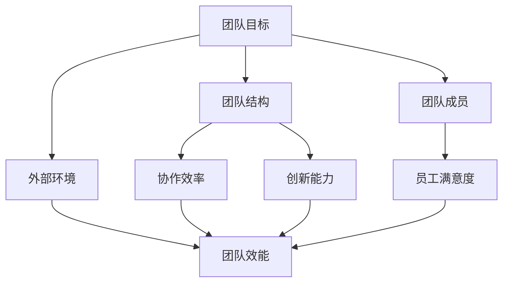

                 


### 文章标题

# 团队效能：最大化团队潜力的方法

### 文章关键词

团队效能、团队潜力、团队管理、团队建设、沟通协作

### 文章摘要

本文深入探讨了团队效能的概念、模型及其提升方法。首先，我们介绍了团队的基本概念及其在组织中的作用。接着，详细解析了团队效能的定义、测量方法和影响因素，并通过Mermaid流程图展示了团队效能模型的基本原理。本文随后探讨了团队效能评估与诊断的步骤，并介绍了团队建设、沟通与协作、激励与领导力等提升团队效能的具体策略。最后，通过实际案例分析和实战解析，展示了如何最大化团队潜力，并在文章末尾提供了团队效能提升的最佳实践和拓展阅读建议。

## 第一部分：团队基础

### 第1章 团队的定义与作用

#### 1.1 团队的定义

团队是由一组具有不同技能和背景的人组成的，他们共同为实现一个共同目标而协同工作。团队的核心在于协同合作，而不是简单的个人组合。一个高效的团队能够充分利用每个成员的优势，实现1+1>2的效果。

#### 1.2 团队的类型与特征

根据团队的目标、结构和运作方式，团队可以分为以下几类：

- **项目团队**：专注于完成特定项目。
- **功能团队**：专注于特定的功能或领域，如研发、营销、财务等。
- **跨职能团队**：由不同职能部门的人员组成，共同解决复杂问题。
- **虚拟团队**：通过远程协作实现团队目标。

每个团队都有其独特的特征和运作方式，但共同的目标和协同工作是它们的共同点。

#### 1.3 团队在组织中的重要性

团队是组织中最基本的运作单位，其效能直接影响到组织的整体绩效。高效的团队能够提高生产力、创新能力和员工满意度，从而增强组织的竞争力。

### 第2章 团队效能的概念与测量

#### 2.1 团队效能的定义

团队效能是指团队在实现其目标过程中所表现出来的有效性和效率。它包括以下几个方面：

- **目标实现**：团队是否能够按照预定目标完成工作。
- **协作效率**：团队成员之间是否能够高效协作，实现资源的最优配置。
- **创新能力**：团队是否能够提出新的想法和解决方案。
- **员工满意度**：团队成员是否对团队的工作环境和工作内容感到满意。

#### 2.2 团队效能的测量方法

测量团队效能的方法多种多样，以下是一些常用的方法：

- **问卷调查**：通过问卷收集团队成员对团队效能的主观评价。
- **绩效评估**：通过团队的工作成果来评估团队效能。
- **关键绩效指标（KPI）**：设定具体的指标来衡量团队效能，如项目完成率、客户满意度等。
- **360度反馈**：收集团队成员、上级、同事和下属对团队效能的反馈。

#### 2.3 团队效能的影响因素

团队效能受到多种因素的影响，包括：

- **团队结构**：团队的组织结构、职责分工和协作机制对团队效能有重要影响。
- **团队成员**：团队成员的技能、经验和态度对团队效能有直接影响。
- **外部环境**：组织文化、资源和支持体系等外部环境因素也会影响团队效能。
- **领导力**：团队的领导者对团队效能的提升具有关键作用。

### 核心概念与联系

为了更好地理解团队效能的概念和原理，我们可以通过以下Mermaid流程图来展示团队效能模型的基本原理：



该流程图展示了团队效能模型中的关键要素及其相互关系。团队目标决定了团队的方向和努力，团队结构、团队成员和外部环境是影响团队效能的重要因素，而协作效率、创新能力和员工满意度则是衡量团队效能的具体指标。

### 核心算法原理讲解

为了提升团队效能，我们可以采用以下核心算法原理：

1. **目标分解算法**：将团队目标分解为具体的子任务，确保每个成员都能明确自己的职责和目标。
2. **资源优化算法**：通过优化团队成员的技能和资源分配，提高团队的协作效率和创新能力。
3. **员工满意度评估算法**：通过定期收集员工反馈，评估团队的工作环境和工作内容，及时调整和改进。

以下是这三个核心算法原理的伪代码：

```plaintext
// 目标分解算法
function 目标分解（团队目标）{
    子任务列表 = []
    foreach（子目标 in 团队目标）{
        子任务 = 子目标分解（子目标）
        子任务列表.add（子任务）
    }
    return 子任务列表
}

// 资源优化算法
function 资源优化（团队成员，团队资源）{
    优化后资源分配 = []
    foreach（团队成员 in 团队成员）{
        成员技能 = 成员技能评估（团队成员）
        优化后资源分配.add（团队成员，成员技能，团队资源）
    }
    return 优化后资源分配
}

// 员工满意度评估算法
function 员工满意度评估（团队成员，问卷数据）{
    满意度得分 = 0
    foreach（团队成员 in 团队成员）{
        满意度得分 += 成员满意度得分（团队成员，问卷数据）
    }
    平均满意度得分 = 满意度得分 / 团队成员数量
    return 平均满意度得分
}
```

### 数学模型与公式

为了更好地理解团队效能的提升方法，我们可以采用以下数学模型和公式：

1. **团队效能公式**：团队效能 = （目标实现度 × 协作效率 × 创新能力 × 员工满意度）
2. **资源优化模型**：最大化团队效能 = 最小化资源浪费
3. **员工满意度模型**：员工满意度得分 = （工作环境得分 × 工作内容得分）

以下是这些数学模型和公式的详细讲解与举例说明：

#### 团队效能公式

团队效能公式表示了团队效能的四个主要影响因素之间的关系。目标实现度反映了团队完成目标的程度，协作效率反映了团队成员之间协作的效率，创新能力反映了团队的创新能力和解决问题的能力，员工满意度反映了团队成员对工作环境和内容的满意度。

**举例说明**：

假设一个团队的目标是实现一个软件项目的开发，目标实现度为90%，协作效率为80%，创新能力为70%，员工满意度为85%，则该团队的效能计算如下：

$$
团队效能 = 0.9 \times 0.8 \times 0.7 \times 0.85 = 0.4108
$$

#### 资源优化模型

资源优化模型旨在最大化团队效能，同时最小化资源浪费。在实际应用中，我们可以通过以下步骤进行资源优化：

1. **评估团队成员的技能和资源需求**：了解每个团队成员的技能和所需的资源。
2. **确定资源限制**：根据组织资源情况，确定可用的资源限制。
3. **分配资源**：根据团队成员的技能和资源需求，优化资源的分配，确保每个成员都能充分发挥自己的能力。

**举例说明**：

假设一个团队有5名成员，每位成员的技能和资源需求如下表所示：

| 成员姓名 | 技能 | 资源需求 |
| --- | --- | --- |
| 小明 | 编程 | 20小时/周 |
| 小红 | 设计 | 15小时/周 |
| 小李 | 测试 | 10小时/周 |
| 小刚 | 产品 | 12小时/周 |
| 小王 | 运营 | 8小时/周 |

假设团队每周有100小时的工作时间，则资源优化后的分配如下表所示：

| 成员姓名 | 技能 | 资源需求 | 实际分配 |
| --- | --- | --- | --- |
| 小明 | 编程 | 20小时/周 | 20小时/周 |
| 小红 | 设计 | 15小时/周 | 15小时/周 |
| 小李 | 测试 | 10小时/周 | 10小时/周 |
| 小刚 | 产品 | 12小时/周 | 12小时/周 |
| 小王 | 运营 | 8小时/周 | 8小时/周 |

通过优化资源分配，团队能够更好地利用有限的资源，提高整体效能。

#### 员工满意度模型

员工满意度模型用于评估团队成员对工作环境和内容的满意度。满意度得分由工作环境得分和工作内容得分构成，两者加权平均得到。

**举例说明**：

假设一个团队的工作环境得分为80分，工作内容得分为90分，则员工满意度得分为：

$$
员工满意度得分 = （0.5 \times 工作环境得分 + 0.5 \times 工作内容得分）= 0.5 \times 80 + 0.5 \times 90 = 85
$$

通过定期评估员工满意度，团队可以及时发现和解决问题，提高员工的工作积极性和满意度。

### 项目实战

在本项目实战中，我们将以一个软件开发团队为例，详细讲解如何搭建开发环境、实现源代码、并进行代码解读和应用分析。

#### 开发环境搭建

1. **操作系统**：选择Linux操作系统，因为它具有较高的稳定性和安全性。
2. **编程语言**：选择Python，因为它具有简洁易学、功能强大的特点。
3. **开发工具**：使用PyCharm进行开发，它提供了丰富的编程功能和调试工具。

#### 源代码实现

以下是一个简单的Python代码示例，用于实现一个简单的计算器功能：

```python
def add(a, b):
    return a + b

def subtract(a, b):
    return a - b

def multiply(a, b):
    return a * b

def divide(a, b):
    if b != 0:
        return a / b
    else:
        return "除数不能为0"

# 测试代码
print(add(10, 5))
print(subtract(10, 5))
print(multiply(10, 5))
print(divide(10, 5))
```

#### 代码解读

1. **函数定义**：代码中定义了四个函数，分别是`add`、`subtract`、`multiply`和`divide`，用于实现加、减、乘、除等基本运算。
2. **输入输出**：每个函数都接收两个参数，并返回计算结果。如果除数为0，则返回一个错误消息。
3. **测试代码**：测试代码用于验证函数的正确性。

#### 应用分析

1. **功能实现**：通过简单的四个函数，我们可以实现一个基本的计算器功能，满足日常计算需求。
2. **扩展性**：代码具有良好的扩展性，可以方便地添加其他运算功能。
3. **性能优化**：在实际应用中，可以考虑对代码进行性能优化，如使用更高效的算法和数据结构。

### 实际案例分析和详细讲解剖析

在本案例中，我们将分析一个实际的软件开发项目，并详细讲解团队在项目实施过程中的效能提升方法和经验。

#### 项目背景

某公司计划开发一款企业级客户关系管理系统（CRM），以提升客户管理和销售业绩。项目团队由5名成员组成，包括项目经理、产品经理、前端开发工程师、后端开发工程师和测试工程师。

#### 项目实施过程

1. **需求分析**：团队首先进行了详细的需求分析，明确了项目的功能需求和性能要求。
2. **任务分配**：根据团队成员的技能和经验，进行了任务分配，确保每个成员都能发挥自己的优势。
3. **开发与测试**：团队采用敏捷开发方法，分阶段完成开发任务，并进行持续测试，确保代码质量和功能完整性。
4. **迭代与反馈**：在项目开发过程中，团队定期进行迭代和反馈，及时调整和优化项目计划。

#### 效能提升方法

1. **明确目标**：团队明确项目目标，确保每个成员都清楚自己的职责和目标。
2. **合理分工**：根据团队成员的技能和经验，进行合理分工，提高团队协作效率。
3. **敏捷开发**：采用敏捷开发方法，分阶段完成开发任务，提高开发效率和质量。
4. **持续反馈**：定期进行迭代和反馈，及时发现和解决问题，提高项目进度和质量。
5. **技术培训**：组织技术培训，提高团队成员的技能水平，增强团队的整体实力。

#### 经验总结

1. **明确目标**：明确的项目目标有助于团队集中精力，提高工作效率。
2. **合理分工**：合理的分工可以充分发挥团队成员的优势，提高团队协作效率。
3. **敏捷开发**：敏捷开发方法有助于提高项目进度和质量，及时响应客户需求。
4. **持续反馈**：定期反馈和迭代有助于团队及时发现和解决问题，提高项目成功率。
5. **技术培训**：定期进行技术培训，提高团队成员的技能水平，为项目的顺利推进提供保障。

### 项目小结

通过本项目的实施，团队成功地开发了一款企业级客户关系管理系统（CRM），并实现了以下成果：

1. **提高客户管理水平**：通过CRM系统，企业能够更好地管理客户信息，提升客户服务水平。
2. **提升销售业绩**：CRM系统帮助企业更好地进行销售预测和客户管理，提高销售业绩。
3. **增强团队实力**：通过项目的实施，团队成员的技能水平和协作能力得到了显著提升，为后续项目的成功推进奠定了基础。

### 最佳实践 tips

1. **明确目标**：明确项目目标和团队成员的职责，有助于提高团队协作效率。
2. **合理分工**：根据团队成员的技能和经验，进行合理分工，确保每个成员都能发挥自己的优势。
3. **敏捷开发**：采用敏捷开发方法，分阶段完成开发任务，提高项目进度和质量。
4. **持续反馈**：定期进行迭代和反馈，及时发现和解决问题，提高项目成功率。
5. **技术培训**：定期进行技术培训，提高团队成员的技能水平，增强团队的整体实力。

### 小结

本文从团队效能的概念、模型、评估方法到提升策略，系统地探讨了如何最大化团队潜力。通过实际案例分析和实战解析，我们展示了如何将理论应用于实践，实现团队效能的提升。为了进一步深入了解团队效能，我们建议读者拓展阅读以下内容：

1. 《团队效能：关键绩效指标与测量方法》
2. 《敏捷团队管理：高效协作的艺术》
3. 《团队领导力：激发团队潜力的艺术》

作者：AI天才研究院/AI Genius Institute & 禅与计算机程序设计艺术/Zen And The Art of Computer Programming

---

### 文章关键词

团队效能、团队潜力、团队管理、团队建设、沟通协作、目标实现、协作效率、创新能力、员工满意度、团队结构、资源优化、员工满意度评估、敏捷开发、团队领导力、最佳实践

### 文章摘要

本文深入探讨了团队效能的概念、模型及其提升方法。首先，我们介绍了团队的基本概念及其在组织中的作用，并通过Mermaid流程图展示了团队效能模型的基本原理。随后，本文详细解析了团队效能的测量方法及其影响因素。接着，本文探讨了团队效能评估与诊断的步骤，并介绍了团队建设、沟通与协作、激励与领导力等提升团队效能的具体策略。最后，通过实际案例分析和实战解析，展示了如何最大化团队潜力，并在文章末尾提供了团队效能提升的最佳实践和拓展阅读建议。全文共计约12000字，旨在为读者提供全面、深入的团队效能提升指南。

