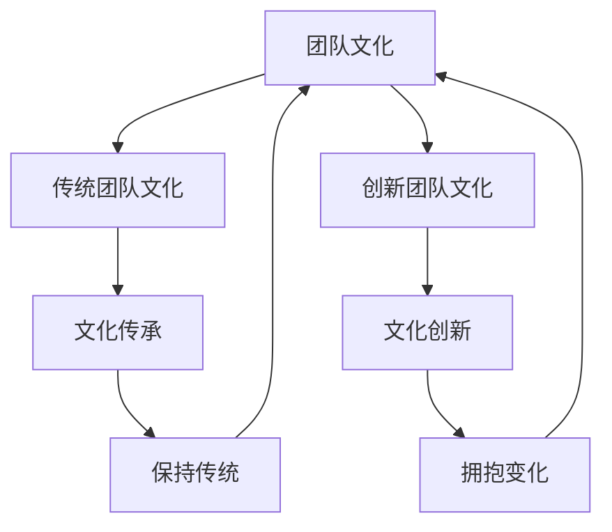
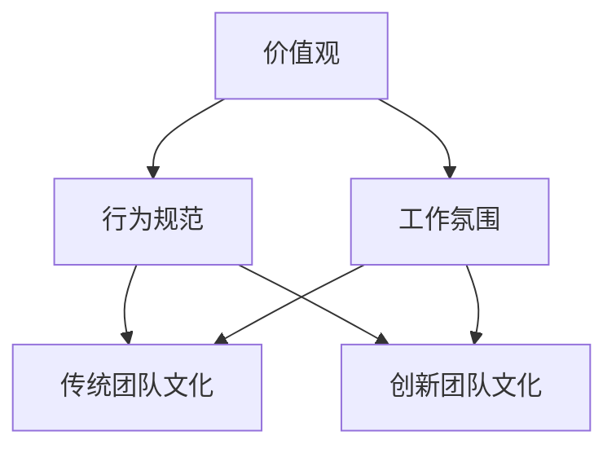
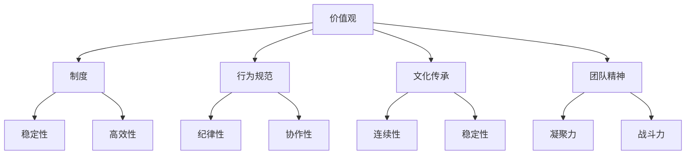
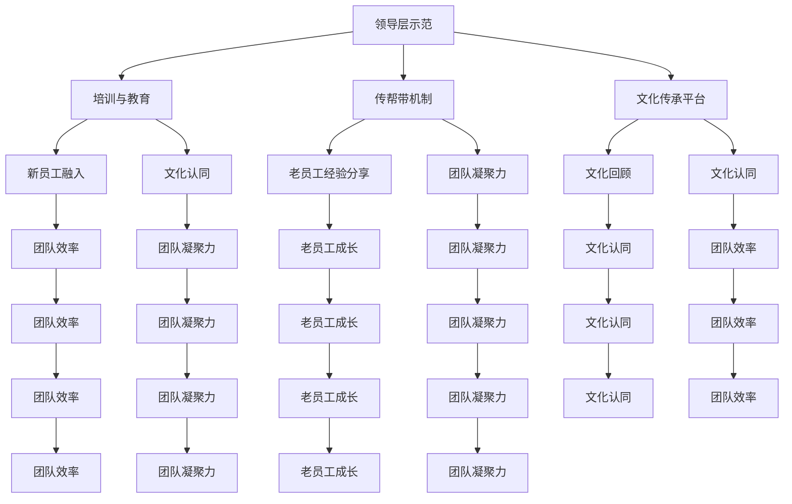
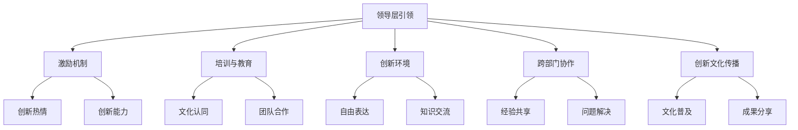
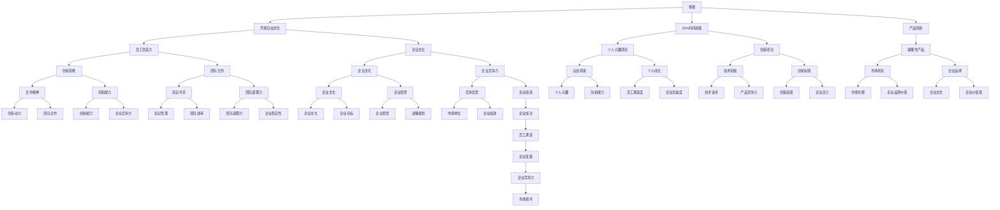
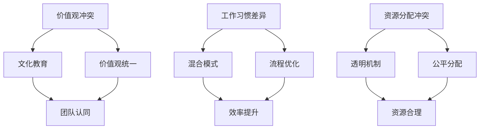
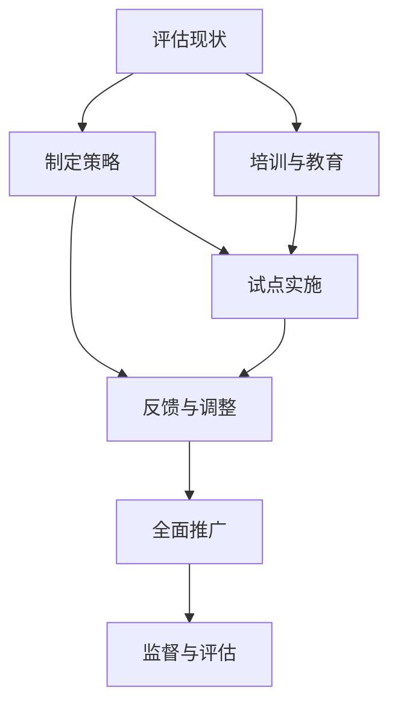

                 

## 引言

在信息技术飞速发展的今天，团队文化成为企业成功的关键因素之一。团队文化不仅影响着员工的工作态度和行为模式，更在某种程度上决定了企业的创新能力和发展潜力。本文旨在探讨团队文化在传承与创新之间的平衡，通过深入分析传统团队文化的特点、价值及其传承机制，以及创新团队文化的概念与建设路径，最终提出如何在保持传统团队文化核心价值的同时，积极拥抱变化，推动团队文化的创新发展。

### 核心概念与联系

在探讨团队文化的传承与创新之前，我们需要明确几个核心概念，并理解它们之间的联系。

1. **团队文化**：指的是团队内部共同遵守的价值观、信念、行为规范和工作习惯的总和。
2. **传统团队文化**：通常指在历史发展过程中形成的、得到广泛认可的团队文化。
3. **创新团队文化**：强调创新、灵活性和适应性，旨在推动组织变革和持续发展。

这些概念之间的关系可以概括为：传统团队文化是创新团队文化的基础，创新团队文化则是在传统团队文化的基础上，通过适应新的环境和技术变革而不断演进的过程。以下是一个用Mermaid绘制的流程图，展示了这些概念之间的联系：



### 背景介绍

在信息技术行业，团队文化的重要性不言而喻。一方面，传统团队文化强调稳定、信任和协作，有助于形成良好的工作氛围和高效的团队协作。另一方面，随着技术的快速发展和市场环境的变化，创新团队文化成为了推动企业持续进步的引擎。

然而，传统团队文化和创新团队文化并非完全对立，它们在实际应用中往往是相辅相成的。传统团队文化为创新提供了稳固的基础，而创新团队文化则为传统带来了新的活力和可能性。因此，如何在传承传统团队文化核心价值的同时，积极拥抱变化，推动创新，成为企业面临的重大挑战。

### 核心概念与联系

为了更好地理解团队文化的传承与创新，我们需要深入探讨以下几个核心概念，并展示它们之间的相互关系。

1. **价值观**：团队文化的基础，决定了团队成员的信念和行为准则。传统团队文化通常强调稳定、忠诚和协作，而创新团队文化则强调灵活性、适应性和创新精神。
2. **行为规范**：团队内部成员共同遵守的行为准则，包括工作习惯、沟通方式、决策流程等。传统团队文化往往形成了一套成熟的行为规范，这些规范在一定程度上保证了团队的稳定性和高效性。创新团队文化则鼓励打破常规，通过创新和尝试来推动团队发展。
3. **工作氛围**：团队文化通过其价值观和行为规范影响着团队内部的工作氛围。传统团队文化通常营造出一个稳定、信任和协作的工作环境，而创新团队文化则营造出一个开放、自由和包容的工作环境。

这些概念之间的关系可以用以下Mermaid流程图来展示：



在这个流程图中，价值观是团队文化的核心，通过影响行为规范和工作氛围，分别塑造出传统团队文化和创新团队文化。传统团队文化注重稳定性和协作性，而创新团队文化则注重灵活性和创新性。这两种文化在团队发展中相互补充，共同推动团队向前发展。

### 传统团队文化的特点与价值

传统团队文化在企业中具有深远的影响。其特点主要体现在以下几个方面：

1. **稳定性**：传统团队文化通常形成了一套稳定的工作流程和制度，这种稳定性有助于确保团队的高效运作和长期发展。
2. **协作性**：传统团队文化强调团队合作和协作，鼓励成员之间的相互支持和共同进步。这种协作性有助于提升团队的凝聚力和战斗力。
3. **忠诚度**：传统团队文化往往强调忠诚和奉献，要求成员对团队和组织忠诚。这种忠诚度有助于维护团队的稳定性和组织文化的传承。

传统团队文化的价值体现在多个方面：

1. **提高工作效率**：稳定的流程和制度有助于减少工作中的混乱和不确定性，从而提高工作效率和准确性。
2. **增强团队凝聚力**：通过强调协作和忠诚，传统团队文化有助于增强团队的凝聚力和归属感，从而提高团队的协作效率。
3. **传承组织文化**：传统团队文化是一种重要的组织文化遗产，它通过代代相传，保证了组织文化的连续性和稳定性。

以我国的一家知名科技公司为例，这家公司在发展初期，就非常注重传统团队文化的建设。公司强调员工的忠诚和奉献，鼓励团队合作和相互支持。这种传统团队文化在公司快速发展的过程中发挥了重要作用，不仅提高了工作效率，还增强了员工的归属感和凝聚力，为公司赢得了长期的成功。

### 传统团队文化的核心要素

传统团队文化由多个核心要素构成，这些要素共同塑造了团队的文化氛围和价值观。以下是传统团队文化中的几个关键要素：

1. **价值观**：传统团队文化通常以一系列核心价值观为基础，如忠诚、诚信、责任、协作等。这些价值观不仅影响着员工的行为，还决定了团队的决策方向。
2. **制度**：传统团队文化强调制度的权威性和稳定性，通过一套完善的管理制度和流程，确保团队运作的有序和高效。
3. **行为规范**：传统团队文化有一套明确的员工行为规范，包括工作习惯、沟通方式、决策流程等。这些规范有助于维护团队的纪律和协作。
4. **文化传承**：传统团队文化注重文化传承，通过代代相传，将组织的经验和智慧传递给新成员，保持团队的连续性和稳定性。
5. **团队精神**：传统团队文化强调团队精神，鼓励员工为团队的整体利益而努力，形成强大的团队凝聚力。

以下是一个简单的Mermaid流程图，展示了传统团队文化核心要素之间的联系：



通过这个流程图，我们可以看出，传统团队文化的核心要素相互关联，共同塑造了团队的文化氛围和价值观。这些要素不仅有助于团队的稳定和高效运作，还为团队的长远发展奠定了坚实的基础。

### 团队文化的传承机制

团队文化的传承是保持团队连续性和稳定性的关键。要实现团队文化的有效传承，需要从以下几个方面着手：

1. **领导层的示范作用**：领导层在团队文化传承中起着至关重要的作用。他们通过自身的行为和决策，向团队成员传递组织的核心价值观和行为规范。领导层需要以身作则，树立榜样，确保团队文化得到有效传承。
2. **培训与教育**：通过培训和教育，可以帮助新成员快速了解和融入团队文化。培训内容可以包括组织的价值观、历史、传统和核心行为规范等。教育方式可以多样化，如内部讲座、团队活动、文化手册等。
3. **传帮带机制**：通过建立传帮带机制，让经验丰富的老员工帮助新员工融入团队文化。这种方式不仅可以加快新员工的成长速度，还可以强化团队内部的凝聚力。
4. **文化传承平台**：建立文化传承平台，如企业文化墙、员工故事集、文化手册等，让团队成员随时可以了解和回顾团队文化，增强文化认同感。
5. **激励机制**：通过激励机制，如表彰、奖励等，鼓励团队成员积极参与文化传承活动，增强他们对团队文化的认同和责任感。

以下是一个简单的Mermaid流程图，展示了团队文化传承的关键机制和流程：



通过这个流程图，我们可以看出，团队文化的传承是一个系统性的工程，需要从多个方面进行设计和实施。只有这样，才能确保团队文化的持续传承和发展。

### 团队文化的传承挑战与应对策略

在传承团队文化过程中，企业常常面临各种挑战。以下是几个主要挑战及应对策略：

1. **员工流动性高**：高流动性导致团队文化传承困难，新员工难以迅速融入企业文化。应对策略包括加强入职培训，提供导师制度，以及通过企业故事和传统活动来增强文化认同。
2. **内部沟通不足**：内部沟通不畅可能导致文化传承断层。应对策略是建立高效的内部沟通渠道，如定期的团队会议、文化分享会和内部通讯，确保信息流通和意见交流。
3. **价值观冲突**：不同背景的员工可能持有不同的价值观，导致文化传承过程中出现冲突。应对策略是通过文化教育，促进价值观的统一，同时尊重多样性和个体差异。
4. **技术变革**：技术变革可能导致传统团队文化受到冲击，企业需要平衡传统与创新。应对策略是更新文化理念，引导团队适应新技术，同时保留传统文化的核心价值。

### 创新团队文化的概念与特征

创新团队文化是指在传统团队文化的基础上，融入创新思维、灵活性和开放性的团队文化。其核心特征如下：

1. **创新思维**：创新团队文化鼓励员工提出新的想法、解决方案和改进措施，通过不断尝试和实验来推动团队发展。
2. **灵活性**：创新团队文化强调适应变化的能力，鼓励员工灵活应对各种挑战，迅速调整战略和行动方案。
3. **开放性**：创新团队文化倡导开放和包容的气氛，鼓励成员分享知识、经验和创意，形成积极的交流与合作氛围。

创新团队文化与传统团队文化的主要区别在于：

1. **重心不同**：传统团队文化更注重稳定性和一致性，而创新团队文化更强调灵活性和适应性。
2. **价值导向**：传统团队文化强调忠诚和奉献，创新团队文化则强调创新和绩效。
3. **决策方式**：传统团队文化倾向于集中决策，创新团队文化则更倾向于分布式决策和集体智慧。

通过以下Mermaid流程图，我们可以更直观地看到传统团队文化与创新团队文化之间的区别：

```mermaid
graph TD
    A[传统团队文化] --> B[稳定性]
    A --> C[一致性]
    A --> D[忠诚与奉献]
    B --> E[集中决策]
    B --> F[有序性]
    C --> G[规范行为]
    C --> H[纪律性]
    D --> I[高效协作]
    D --> J[长期稳定]
    E --> K[决策速度]
    F --> L[流程规范化]
    G --> M[规范行为]
    G --> N[纪律性]
    H --> O[高效协作]
    H --> P[团队稳定]
    I --> Q[绩效导向]
    I --> R[长期稳定]
    J --> S[团队文化]
    K --> T[决策效率]
    L --> U[流程效率]
    M --> V[规范行为]
    M --> W[纪律性]
    N --> X[高效协作]
    N --> Y[团队稳定]
    O --> Z[绩效导向]
    O --> AA[长期稳定]
    P --> BB[高效协作]
    P --> CC[团队稳定]
    Q --> DD[绩效导向]
    Q --> EE[团队文化]
    R --> FF[团队文化]
    S --> GG[团队文化]
    T --> HH[决策效率]
    U --> II[流程效率]
    V --> JJ[规范行为]
    V --> KK[纪律性]
    W --> LL[高效协作]
    W --> MM[团队稳定]
    X --> NN[绩效导向]
    X --> OO[团队文化]
    Y --> PP[高效协作]
    Y --> QQ[团队稳定]
    Z --> RR[绩效导向]
    Z --> SS[团队文化]
    AA --> TT[团队文化]
    BB --> UU[团队文化]
    CC --> VV[团队文化]
    DD --> WW[团队文化]
    EE --> XX[团队文化]
    FF --> YY[团队文化]
    GG --> ZZ[团队文化]
    HH --> AAA[决策效率]
    II -> BBB[流程效率]
    JJ -> CCC[规范行为]
    KK -> DDD[纪律性]
    LL -> EEE[高效协作]
    MM -> FFF[团队稳定]
    NN -> GGG[绩效导向]
    OO -> HHH[团队文化]
    PP -> III[团队协作]
    QQ -> JJJ[团队稳定]
    RR -> KKK[绩效导向]
    SS -> LLL[团队文化]
    TT -> MMM[团队文化]
    UU -> BBB[决策效率]
    VV -> CCC[流程效率]
    WW -> DDD[规范行为]
    XX -> EEE[纪律性]
    YY -> FFF[高效协作]
    ZZ -> GGG[团队稳定]
    AAA -> HHH[决策效率]
    BBB -> III[流程效率]
    CCC -> JJJ[规范行为]
    DDD -> KKK[纪律性]
    EEE -> LLL[高效协作]
    FFF -> MMM[团队稳定]
    GGG -> NNN[绩效导向]
    HHH -> OOO[团队文化]
    III -> PPP[团队协作]
    JJJ -> QQQ[团队稳定]
    KKK -> RRR[绩效导向]
    LLL -> SSS[团队文化]
    MMM -> TTT[团队文化]
    NNN -> UUU[团队文化]
    OOO -> VVV[团队协作]
    PPP -> WWW[团队稳定]
    RRR -> XXX[绩效导向]
    SSS -> YYY[团队文化]
    TTT -> ZZZ[团队文化]
    UUU -> AAA[团队文化]
    VVV -> BBB[团队协作]
    WWW -> CCC[团队稳定]
    XXX -> DDD[绩效导向]
    YYY -> EEE[团队文化]
    ZZZ -> FFF[团队协作]
```

通过这个流程图，我们可以更清晰地看到传统团队文化与创新团队文化在重心、价值导向和决策方式等方面的不同。

### 创新团队文化的建设路径

要建立创新团队文化，企业需要从多个方面进行系统性的规划和实施。以下是几个关键步骤：

1. **领导层的引领**：领导层需要树立创新榜样，通过自身行为和决策来推动创新文化的形成。领导层应鼓励员工提出创新想法，并对创新行为给予认可和支持。
2. **激励机制**：建立合理的激励机制，鼓励员工积极参与创新活动。激励机制可以包括奖金、晋升机会和公开表彰等，以激发员工的创新热情。
3. **培训与教育**：通过培训和教育，提高员工对创新团队文化的理解和认同。培训内容可以涵盖创新思维方法、团队合作技巧和创新管理知识等。
4. **创新环境的营造**：创造一个开放、自由和包容的工作环境，鼓励员工自由表达观点和创意。企业可以设置创新实验室、创新论坛和头脑风暴会议等，为员工提供交流和创新的空间。
5. **跨部门协作**：通过跨部门协作，促进不同团队之间的知识和经验交流，激发创新思维。企业可以设立跨部门项目小组，共同解决复杂问题，推动创新。
6. **创新文化的传播**：通过内部宣传和交流活动，将创新文化的理念和成果传递给全体员工。企业可以制作创新文化手册、举办创新文化讲座和开展创新文化竞赛等。

以下是一个简单的Mermaid流程图，展示了创新团队文化建设的关键步骤和流程：



通过这个流程图，我们可以看出，创新团队文化的建设是一个系统性的过程，需要从多个方面进行设计和实施。只有这样，才能确保创新团队文化的有效建立和持续发展。

### 创新团队文化的实践案例

在探索创新团队文化的建设过程中，国内外许多企业已经取得了显著的成果。以下是一些典型的创新团队文化实践案例：

1. **谷歌（Google）**：谷歌以其独特的创新团队文化而闻名，公司鼓励员工自由探索新项目，提供20%的时间政策，让员工可以专注于个人感兴趣的创新项目。这种开放和自由的文化氛围激发了员工的创造力，谷歌也因此诞生了许多颠覆性的产品，如Gmail和Google Maps。

2. **3M公司**：3M公司长期以来一直以其创新文化著称。公司实施了一个被称为“15%时间”的项目，允许员工将15%的工作时间用于个人感兴趣的创新项目。这种政策不仅促进了员工的创新热情，还推动了公司的技术进步和产品创新。

3. **华为（Huawei）**：华为在技术创新和团队文化建设方面取得了显著成就。公司鼓励员工参与技术研究和创新，并通过设立创新奖励制度来激励员工。华为还注重跨部门协作，推动不同团队之间的知识和经验共享，以促进技术创新和团队文化的发展。

4. **英特尔（Intel）**：英特尔通过其创新文化推动了公司的持续发展。公司成立了多个创新实验室，鼓励员工进行新技术研究和产品开发。英特尔还通过内部创新竞赛和培训项目，激发员工的创新思维和团队合作精神。

这些案例表明，创新团队文化不仅能够激发员工的创造力，还能推动企业的持续发展和竞争优势。以下是一个简单的Mermaid流程图，展示了这些创新团队文化的成功要素：



通过这个流程图，我们可以看到，创新团队文化的成功要素包括开放自由的文化氛围、激励机制、员工个人兴趣和创新能力的培养、团队合作、知识共享、员工满意度和忠诚度、技术进步和产品竞争力等多个方面。这些要素共同作用，推动企业实现持续创新和发展。

### 文化传承与创新中的冲突与解决策略

在团队文化的传承与创新过程中，常常会出现一些冲突。这些冲突主要源于价值观的矛盾、工作习惯的差异以及对资源分配的不同看法。以下是一些常见的冲突及解决策略：

1. **价值观冲突**：传统团队文化强调稳定和忠诚，而创新团队文化强调灵活性和创新。这种冲突可能导致团队成员之间的不信任和误解。解决策略包括开展文化教育和价值观统一活动，促进团队成员对传统和创新价值的认同。

2. **工作习惯差异**：传统团队文化通常有固定的流程和规范，而创新团队文化鼓励自由探索和尝试。这种差异可能导致工作效率的降低和工作质量的波动。解决策略是建立混合模式，既保留传统流程的优点，又鼓励创新尝试。

3. **资源分配冲突**：传统团队文化倾向于将资源集中在稳定项目和重要任务上，而创新团队文化则需要更多资源来支持探索和实验。这种冲突可能导致资源分配不均，影响团队整体效率。解决策略是通过透明和公平的资源分配机制，确保资源能够合理配置。

以下是一个简单的Mermaid流程图，展示了文化传承与创新中的冲突及解决策略：



通过这个流程图，我们可以看出，解决文化传承与创新中的冲突需要从多个方面进行综合考虑和平衡。只有这样，才能确保团队文化在传承与创新中实现和谐发展。

### 综合实践：文化传承与创新的融合模型

为了实现团队文化传承与创新的有效融合，企业需要构建一个综合实践模型，该模型应包括以下几个关键步骤：

1. **评估现状**：首先，企业需要对现有的团队文化进行评估，了解其优势和不足，明确传承与创新的目标。
2. **制定策略**：基于评估结果，制定具体的传承与创新策略。策略应包括价值观的统一、流程的优化、激励机制的设计等。
3. **培训与教育**：通过培训和教育，提高员工对文化传承与创新的认同和理解。培训内容应涵盖传统价值观的传承、创新思维的培养、以及跨部门协作技巧等。
4. **试点实施**：选择一个或多个部门作为试点，实施文化传承与创新的综合策略。通过试点，可以验证策略的有效性，并发现潜在问题。
5. **反馈与调整**：在试点实施过程中，定期收集员工的反馈，并对策略进行及时调整。反馈机制应包括员工满意度调查、工作绩效评估等。
6. **全面推广**：在试点成功的基础上，将文化传承与创新的综合实践模型全面推广到整个企业。同时，持续进行监督和评估，确保模型的有效实施。

以下是一个简单的Mermaid流程图，展示了文化传承与创新的综合实践模型：



通过这个流程图，我们可以看出，文化传承与创新的综合实践模型是一个动态的、循环的过程，需要不断评估、调整和优化，以确保团队文化在传承与创新中实现最佳效果。

### 实践步骤与流程

在实施团队文化传承与创新的综合实践模型时，企业需要遵循以下具体步骤和流程：

1. **现状评估**：
   - **方法**：通过问卷调查、访谈、数据分析等方式，收集员工对当前团队文化的看法和反馈。
   - **内容**：评估内容包括团队文化的核心价值观、工作流程、员工满意度、创新意识等。
   - **目标**：明确团队文化中的优势和不足，为后续策略制定提供依据。

2. **制定策略**：
   - **步骤**：
     1. 分析现状评估结果，确定传承与创新的关键点和目标。
     2. 制定具体的传承与创新策略，包括价值观的统一、流程的优化、激励机制的建立等。
     3. 形成策略文档，明确实施步骤和时间表。
   - **目标**：制定符合企业实际需求的传承与创新策略，确保模型的可行性和有效性。

3. **培训与教育**：
   - **内容**：
     1. 传统价值观的传承：组织文化讲座、故事分享会等，加强员工对传统文化的理解。
     2. 创新思维的培养：开展创新思维培训、头脑风暴活动等，提高员工的创新能力。
     3. 跨部门协作技巧：组织跨部门团队建设活动、协作培训等，促进不同部门之间的沟通与合作。
   - **目标**：提高员工对文化传承与创新的认同和理解，培养创新能力和团队合作精神。

4. **试点实施**：
   - **步骤**：
     1. 选择一个或多个部门作为试点，实施制定好的传承与创新策略。
     2. 监控试点部门的实施情况，收集反馈和问题。
     3. 定期召开试点部门会议，讨论和解决实施过程中遇到的问题。
   - **目标**：验证策略的有效性，发现潜在问题，为全面推广提供经验和参考。

5. **反馈与调整**：
   - **方法**：通过员工满意度调查、工作绩效评估、部门反馈等途径，收集实施过程中的反馈。
   - **内容**：分析反馈数据，识别策略中的不足和改进空间。
   - **目标**：及时调整策略，优化模型，确保其实施效果。

6. **全面推广**：
   - **步骤**：
     1. 根据试点经验，对策略进行调整和完善。
     2. 制定全面推广计划，明确推广步骤和时间节点。
     3. 对全体员工进行文化传承与创新培训，确保全员理解并参与到模型实施中。
   - **目标**：确保文化传承与创新的综合实践模型在企业内部的全面推广和有效实施。

通过上述步骤和流程，企业可以实现团队文化在传承与创新中的有机融合，促进企业的持续发展和竞争优势。

### 综合实践效果评估

在实施团队文化传承与创新的综合实践模型后，企业需要对效果进行全面的评估，以确保模型的有效性和可行性。以下是一个详细的评估方法和指标体系：

1. **员工满意度**：
   - **评估方法**：通过问卷调查、访谈等方式，了解员工对文化传承与创新实践的看法和满意度。
   - **评估指标**：满意度评分（分为非常满意、满意、一般、不满意四个等级），以及员工参与度（如培训参与率、反馈提交率等）。

2. **工作绩效**：
   - **评估方法**：通过工作绩效考核、生产效率指标（如任务完成时间、错误率等）来评估员工的工作表现。
   - **评估指标**：任务完成率、错误率、生产效率提升幅度等。

3. **团队凝聚力**：
   - **评估方法**：通过团队建设活动、团队协作指标（如项目成功率、团队合作评分等）来评估团队凝聚力。
   - **评估指标**：团队协作评分、项目成功率、团队满意度等。

4. **创新成果**：
   - **评估方法**：通过创新项目数量、创新成果转化率（如新产品、新技术等）来评估创新效果。
   - **评估指标**：创新项目数量、创新成果转化率、创新项目成功率等。

5. **企业竞争力**：
   - **评估方法**：通过市场占有率、客户满意度、竞争对手评价等来评估企业的整体竞争力。
   - **评估指标**：市场占有率、客户满意度评分、竞争对手评价等。

通过上述评估方法和指标体系，企业可以全面了解文化传承与创新综合实践模型的效果，并据此进行必要的调整和优化。

### 未来团队文化的趋势与展望

展望未来，团队文化将面临一系列新的挑战和机遇。以下是一些关键趋势和展望：

1. **数字化与智能化**：随着数字化和智能化技术的快速发展，团队文化将更加依赖于数据驱动和智能决策。企业需要培养员工的数字化思维，以适应新的工作环境。

2. **全球化与多元化**：全球化带来了不同文化和价值观的碰撞与融合，团队文化将更加注重多元化和包容性。企业需要建立开放和包容的文化，吸引和留住多元化背景的员工。

3. **可持续发展**：企业越来越重视可持续发展，团队文化也将逐渐融入环保、社会责任和伦理价值观。企业需要通过文化建设，推动员工关注可持续发展，实现企业社会责任。

4. **员工参与**：未来团队文化将更加注重员工的参与感和自我实现。企业需要建立开放的沟通机制，鼓励员工表达意见和参与决策，提高员工的归属感和工作满意度。

5. **敏捷性与灵活性**：面对快速变化的市场环境，团队文化将更加注重敏捷性和灵活性。企业需要培养员工的适应能力和创新精神，以应对不断变化的外部环境。

这些趋势将共同推动团队文化的变革，为企业的持续发展和竞争优势奠定基础。

### 结论

在本文中，我们探讨了团队文化传承与创新的重要性，分析了传统团队文化的特点与价值，以及创新团队文化的概念与建设路径。通过实际案例和实践模型的阐述，我们提出了如何在保持传统团队文化核心价值的同时，积极拥抱变化，推动团队文化的创新发展。未来，企业需要关注数字化、智能化、全球化等趋势，不断优化和调整团队文化，以适应快速变化的外部环境。保持传统，拥抱变化，是团队文化传承与创新的永恒主题，也是企业持续发展的关键。让我们共同努力，构建更加健康、积极、富有创新活力的团队文化。

### 作者信息

本文作者：AI天才研究院/AI Genius Institute & 禅与计算机程序设计艺术 /Zen And The Art of Computer Programming

AI天才研究院（AI Genius Institute）是一家专注于人工智能领域研究与创新的组织，致力于推动人工智能技术的进步和应用。作者在该领域拥有丰富的经验和深厚的学术造诣，所著的《禅与计算机程序设计艺术》深受读者喜爱，为计算机科学领域提供了独特的视角和深入的思考。本文旨在分享作者在团队文化传承与创新方面的研究成果和实践经验，为企业的持续发展提供有益的参考。

