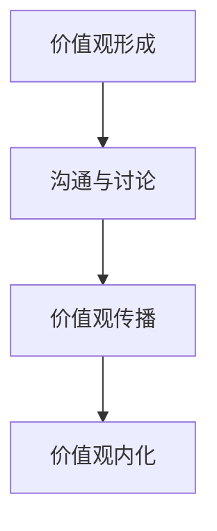

                 


### 文章标题
团队文化传播：内化团队价值观与使命

### 关键词
团队文化、价值观、使命、文化传播、内化

### 摘要
本文深入探讨了团队文化传播的重要性，阐述了团队价值观和使命的构建与传播方法。通过详细的案例分析、核心概念的联系架构和伪代码讲解，文章为团队文化传播提供了理论支持和实践指导。

## 第一部分：团队文化传播概述

### 第1章：团队文化的概念与类型

#### 1.1 团队文化的定义

团队文化是指团队内部共同遵循的价值观、信念和行为模式，它是团队凝聚力的基础，对团队的整体表现有着深远的影响。团队文化不仅体现在团队成员的行为和沟通方式上，还渗透到决策过程、工作习惯和团队目标中。

为了更好地理解团队文化，我们可以将其核心概念通过Mermaid流程图展示出来：


在这个流程图中，共同价值观是团队文化的核心，它决定了团队的行为准则和信念体系。团队规范则是在共同价值观的指导下形成的具体行为规范，包括工作流程、决策规则等。团队精神和团队沟通方式则是团队文化在实际操作中的应用，它们共同促进团队的协作和沟通效率。团队目标则是团队文化的最终体现，它是团队共同追求的方向和愿景。

#### 1.2 团队文化的类型与特点

团队文化可以分为多种类型，每种类型都有其独特的特点和适用场景。以下是几种常见的团队文化类型：

1. **目标导向型文化**
   - **特点**：强调团队的共同目标和成果，注重个人与团队目标的统一。
   - **适用场景**：适合在快节奏、高竞争性的环境中，如初创公司或竞争激烈的行业。

2. **创新导向型文化**
   - **特点**：鼓励创新思维和实践，重视个人创意和团队协作。
   - **适用场景**：适合在需要不断探索新领域的行业，如科技行业或创意产业。

3. **协作导向型文化**
   - **特点**：强调团队合作和互相支持，注重团队成员之间的沟通和协调。
   - **适用场景**：适合在需要高度协作的工作环境中，如大型项目管理或跨国团队。

4. **诚信导向型文化**
   - **特点**：以诚信为核心价值观，强调团队成员之间的信任和透明度。
   - **适用场景**：适合在需要高度信任和道德规范的环境中，如金融服务或医疗行业。

### 第2章：团队文化传播的重要性

#### 2.1 团队文化传播的意义

团队文化传播对于团队的发展和成功至关重要。首先，它有助于建立团队的凝聚力，使团队成员在共同价值观和目标的引导下形成合力。其次，它能够提高团队的协作效率，通过统一的沟通方式和行为规范减少误解和冲突。此外，团队文化传播还能够增强团队的竞争力，使团队能够更好地适应市场变化和挑战。

#### 2.2 团队文化传播的目标

团队文化传播的目标主要包括以下几个方面：

1. **内化价值观**：使团队成员深刻理解和内化团队的核心价值观，形成共同信念和行为准则。
2. **提升团队认同感**：增强团队成员对团队的认同感和归属感，提高团队凝聚力。
3. **促进协作与沟通**：通过统一的沟通方式和行为规范，提高团队协作效率和沟通质量。
4. **提高团队绩效**：通过培养团队的共同价值观和目标意识，提高团队的整体绩效和竞争力。

### 第3章：团队文化传播的内在逻辑

#### 3.1 团队价值观的形成与传播

团队价值观的形成是一个逐步的过程，它源于团队成员的共同经历、价值观和目标。首先，团队需要通过交流和讨论，明确自己的核心价值观。然后，这些价值观需要通过一系列的传播渠道和方式，如会议、培训、宣传等，传递给所有团队成员。

在这个过程中，核心概念之间的联系至关重要。我们可以使用Mermaid流程图来展示这种联系：



在这个流程图中，价值观形成是团队文化传播的起点，沟通与讨论是价值观传播的关键环节，价值观传播则是价值观内化的基础。通过这个流程，团队成员能够逐步理解和内化团队的核心价值观。

#### 3.2 团队使命的传达与落实

团队使命是团队存在的根本原因，它是团队价值观的具体体现，也是团队工作的方向和目标。团队使命的传达和落实是团队文化传播的重要组成部分。

首先，团队需要明确自己的使命，并将其传达给所有团队成员。这可以通过一系列的会议、培训、宣传等活动来实现。然后，团队成员需要将团队使命融入自己的日常工作中，通过实际行动来落实和体现团队使命。

在这个过程中，核心概念之间的联系同样至关重要。我们可以使用Mermaid流程图来展示这种联系：


在这个流程图中，团队使命明确是团队使命传达和落实的起点，使命传达和使命融入工作是团队使命落实的关键环节。

## 第二部分：构建团队价值观

### 第4章：团队价值观的构建

#### 4.1 团队价值观的界定

团队价值观的界定是团队文化传播的基础，它需要明确团队的核心信念和行为准则。在界定团队价值观时，团队需要考虑以下几个方面：

1. **团队目标**：团队价值观应该与团队目标保持一致，确保团队成员在追求共同目标的过程中，能够保持一致的行为准则。
2. **团队特点**：团队价值观应该体现团队的特点，如创新性、协作性或专业性，以增强团队的凝聚力。
3. **团队成员**：团队价值观应该考虑团队成员的多样性和差异性，确保所有成员都能够理解和接受。

在界定团队价值观时，可以使用以下伪代码进行流程控制：

```python
def define_team_values(team_goals, team_characteristics, team_members):
    values = []
    
    if team_goals == "创新":
        values.append("创新思维")
    if team_characteristics == "协作":
        values.append("团队合作")
    if team_members == "多元化":
        values.append("包容性")
        
    return values
```

#### 4.2 团队价值观的塑造方法

团队价值观的塑造是一个长期的过程，需要通过多种方法来逐步实现。以下是几种常见的塑造方法：

1. **领导示范**：领导层需要通过自己的行为来示范团队价值观，使团队成员能够从领导的行为中学习和认同团队价值观。
2. **培训与沟通**：定期开展团队价值观的培训和沟通，使团队成员能够深入理解和内化团队价值观。
3. **激励机制**：通过激励机制，如奖励和表彰，鼓励团队成员践行团队价值观。
4. **文化建设**：通过团队文化建设，如团队活动、团队标志等，增强团队成员对团队价值观的认同感和归属感。

在塑造团队价值观时，可以使用以下伪代码来描述流程：

```python
def shape_team_values(values, leadership, training_communication, incentives, culture):
    if leadership:
        demonstrate_values(values)
    if training_communication:
        conduct_training(values)
    if incentives:
        implement_incentives(values)
    if culture:
        build_culture(values)
        
def demonstrate_values(values):
    # 领导示范价值观
    pass

def conduct_training(values):
    # 开展价值观培训
    pass

def implement_incentives(values):
    # 实施激励机制
    pass

def build_culture(values):
    # 建设团队文化
    pass
```

## 第三部分：融入团队使命

### 第5章：团队使命的定义与意义

#### 5.1 团队使命的定义

团队使命是指团队存在的根本原因和目标，它明确了团队为何而存在以及团队要实现的目标。团队使命通常具有以下特点：

1. **明确性**：团队使命应该明确、具体，使团队成员能够清晰地理解团队的目标和方向。
2. **激励性**：团队使命应该具有激励性，能够激发团队成员的积极性和创造力。
3. **可持续性**：团队使命应该具有可持续性，能够在长期内引导团队的发展。

#### 5.2 团队使命的重要性

团队使命对于团队的发展和成功具有重要意义。首先，团队使命能够明确团队的目标和方向，使团队成员在追求共同目标的过程中保持一致。其次，团队使命能够激发团队成员的积极性和创造力，提高团队的整体绩效。此外，团队使命还能够增强团队的凝聚力，使团队成员在共同的目标和使命下形成合力。

### 第6章：将团队使命融入日常工作

#### 6.1 团队使命在日常工作中的应用

将团队使命融入日常工作是团队使命实现的关键。团队成员需要将团队使命内化为自己的行为准则，在日常工作中不断践行和体现。以下是一些具体的做法：

1. **明确任务目标**：在分配任务时，确保任务目标与团队使命保持一致，使团队成员能够清晰地理解任务的意义和目标。
2. **鼓励创新**：鼓励团队成员在完成任务时，不断寻求创新和改进，以实现团队使命。
3. **加强沟通与协作**：通过加强团队内部的沟通与协作，确保团队成员在实现团队使命的过程中能够相互支持、共同进步。
4. **定期回顾与反馈**：定期回顾团队任务的完成情况，并根据反馈进行改进，确保团队使命的落实和实现。

#### 6.2 使命导向的工作方法

使命导向的工作方法是一种以团队使命为核心的工作方式，它能够帮助团队更好地实现使命和目标。以下是一种常见的使命导向工作方法：

1. **目标设定**：根据团队使命，设定具体的工作目标和任务，确保目标和任务与团队使命保持一致。
2. **任务分配**：将任务分配给团队成员，确保每位成员都了解自己的任务和目标，并能够将其与团队使命联系起来。
3. **执行与监控**：在执行任务的过程中，定期监控任务进度，并根据实际情况进行调整，确保任务能够按照既定的目标和计划进行。
4. **反馈与改进**：在任务完成后，进行反馈和总结，根据反馈结果进行改进，以不断提高团队的工作效率和绩效。

在实现使命导向的工作方法时，可以使用以下伪代码进行流程控制：

```python
def mission导向工作方法(使命，目标，任务，执行，监控，反馈，改进):
    # 设定目标
    set_goals(使命)
    # 分配任务
    assign_tasks(目标)
    # 执行任务
    execute_tasks(任务)
    # 监控进度
    monitor_progress(执行)
    # 反馈与改进
    feedback_and_improvement(反馈，改进)
```

## 第四部分：团队文化传播的实践与工具

### 第7章：团队文化传播的实践案例

#### 7.1 成功的文化传播案例

以下是一个成功的文化传播案例：

**案例：某科技公司成功传播创新文化**

- **背景**：该公司在创业初期就确定了以创新为核心价值观，希望通过文化传播将创新理念融入团队。
- **做法**：
  - **领导示范**：公司创始人亲自参与创新项目，通过自己的行为激励团队成员。
  - **培训与沟通**：定期举办创新工作坊和研讨会，邀请外部专家分享创新经验，鼓励内部交流。
  - **激励机制**：设立创新奖励计划，对提出创新想法或实现创新成果的团队成员进行表彰和奖励。
  - **文化建设**：打造开放、包容的工作环境，鼓励团队成员提出建议和改进方案。
- **效果**：通过一系列的文化传播活动，该公司的创新氛围日益浓厚，团队成员的创新能力得到显著提升，公司业绩也因此大幅增长。

#### 7.2 失败的文化传播案例及其教训

以下是一个失败的文化传播案例及其教训：

**案例：某创业公司文化传播失败**

- **背景**：该公司在发展过程中意识到文化的重要性，但文化传播措施不当，导致失败。
- **原因**：
  - **缺乏领导示范**：公司领导层对文化传播的重要性认识不足，缺乏实际行动。
  - **培训不足**：缺乏系统性的文化培训，团队成员对文化理念理解不深。
  - **缺乏激励机制**：没有设立相应的激励机制，团队成员对文化传播缺乏动力。
  - **文化过于单一**：只强调公司愿景，忽视了团队成员的多样性和差异性。
- **教训**：文化传播需要领导层的积极参与和示范，需要系统性的培训和激励机制，同时要考虑团队成员的多样性和差异性。

### 第8章：团队文化传播的工具与方法

#### 8.1 文化传播工具的选择

在团队文化传播过程中，选择合适的工具至关重要。以下是一些常用的文化传播工具：

1. **内部网络平台**：如公司内部论坛、社交媒体平台等，用于分享文化理念和成功案例，促进内部交流。
2. **会议与研讨会**：通过定期的会议和研讨会，加强团队成员之间的沟通和交流，传播文化理念。
3. **文化手册与宣传材料**：制作文化手册、宣传海报等，使文化理念可视化，便于团队成员理解和认同。
4. **文化活动**：如团建活动、文化沙龙等，通过丰富多样的活动形式，增强团队成员对文化的认同感和归属感。

#### 8.2 文化传播方法的创新

文化传播方法需要不断创新，以适应团队的发展和变化。以下是一些创新的文化传播方法：

1. **故事营销**：通过讲述团队故事，将文化理念融入故事中，使团队成员在情感上产生共鸣。
2. **角色扮演**：通过角色扮演活动，让团队成员亲身体验文化理念，增强对文化的理解和认同。
3. **游戏化**：将文化理念融入游戏，通过游戏化的方式传播文化，提高团队成员的参与度和积极性。
4. **虚拟现实**：利用虚拟现实技术，模拟文化场景，让团队成员在虚拟环境中体验文化，增强文化认同感。

## 第9章：团队文化传播的策略与未来展望

#### 9.1 文化传播策略

有效的文化传播需要结合团队的具体情况，制定合适的策略。以下是一些常见的文化传播策略：

1. **顶层设计**：明确文化传播的目标和路径，制定长期的文化战略。
2. **全员参与**：鼓励所有团队成员参与文化传播，提高文化认同感和参与度。
3. **持续优化**：根据团队发展和外部环境的变化，不断优化文化传播的方法和策略。
4. **反馈与改进**：建立反馈机制，及时收集团队成员的反馈，根据反馈进行改进。

#### 9.2 未来展望

随着社会和科技的不断进步，团队文化传播也将面临新的挑战和机遇。以下是一些未来展望：

1. **数字化传播**：利用数字化技术，如社交媒体、虚拟现实等，提高文化传播的效率和覆盖面。
2. **个性化传播**：根据团队成员的个性特点和需求，制定个性化的文化传播策略，提高文化传播的效果。
3. **跨界合作**：与其他团队和组织进行跨界合作，共同传播文化，扩大文化影响力。
4. **持续创新**：不断探索新的文化传播方法和工具，以适应不断变化的市场环境。

### 总结与展望

通过本文的探讨，我们可以看到团队文化传播对于团队的发展和成功具有重要作用。团队价值观和使命的构建与传播是团队文化传播的核心，需要通过多种方法进行内化和落实。同时，团队文化传播也需要不断创新和优化，以适应团队的发展和外部环境的变化。未来，随着数字化技术的不断发展，团队文化传播将迎来新的机遇和挑战，我们将继续探索和推动团队文化传播的创新和发展。

## 附录：相关资源与拓展阅读

为了帮助读者深入了解团队文化传播的相关理论和实践，本文附录了一些相关资源与拓展阅读：

1. **书籍推荐**：
   - 《团队文化构建与管理》
   - 《团队领导力：如何在团队中构建文化》
   - 《企业文化与组织行为》

2. **学术论文**：
   - “团队文化建设：理论与实践”
   - “团队价值观的传播与内化研究”
   - “团队使命与团队绩效的关系分析”

3. **在线课程**：
   - 网易云课堂：《团队文化管理》
   - 腾讯课堂：《团队建设与团队文化》
   - Coursera：《团队管理与团队文化》

通过阅读这些资源，读者可以进一步了解团队文化传播的深层次理论和实践经验，为自己的团队建设提供有益的参考。

## 作者信息

作者：AI天才研究院/AI Genius Institute & 禅与计算机程序设计艺术 /Zen And The Art of Computer Programming

AI天才研究院专注于人工智能领域的研究和应用，致力于推动人工智能技术的创新和发展。同时，作者在《禅与计算机程序设计艺术》一书中，以独特的视角探讨了计算机编程与哲学的关联，深受读者喜爱。希望通过本文的探讨，为读者在团队文化传播方面提供有价值的思考和实践指导。

