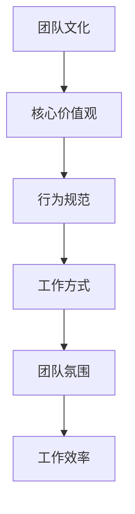
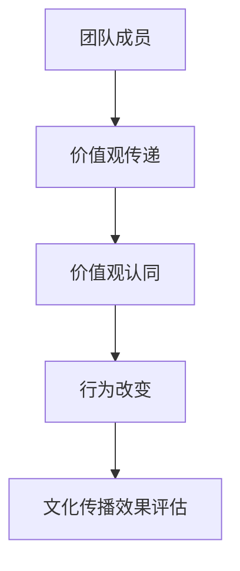

                 

### 文章标题

# 《团队文化传播：内化核心价值观的策略》

## 关键词

- 团队文化
- 核心价值观
- 文化传播
- 数学模型
- 项目实战

## 摘要

本文旨在深入探讨团队文化传播的核心机制和内化核心价值观的策略。通过详细的案例分析、算法原理讲解以及数学模型的应用，文章揭示了如何将核心价值观融入团队文化，从而提升团队凝聚力和工作效率。文章结构清晰，分为三大部分：基础理论部分介绍团队文化传播的基本概念和核心算法原理，实践部分通过具体案例展示核心价值观在团队管理中的实际应用，最后展望了数字时代团队文化传播的未来趋势。本文适合希望提升团队文化建设和管理水平的读者，特别是IT行业从业者。

## 第一部分：团队文化传播基础

### 第1章：团队文化传播概述

#### 1.1 核心概念与联系

团队文化是指团队在长期发展过程中形成的共同价值观、行为规范和工作方式。它不仅影响了团队成员的态度和行为，还影响了团队的整体氛围和工作效率。核心价值观是团队文化的核心，是团队成员共同认同的基本信念和追求。它们决定了团队的目标、行为准则和发展方向。

核心概念之间的关系可以用以下Mermaid流程图来表示：



#### 1.2 文化传播的基本模型

团队文化传播是一个复杂的过程，涉及信息传递、价值观认同和行为改变。以下是一个简化的文化传播模型：



在这个模型中，价值观的传递是第一步，通过正式和非正式的沟通方式，将核心价值观传递给团队成员。价值观的认同是第二步，团队成员需要在实践中感受和认同这些价值观。行为的改变是第三步，认同后的价值观会体现在团队成员的日常行为中。最后，文化传播效果评估是确保文化传播成功的必要步骤，通过反馈和调整来优化文化传播的过程。

### 第2章：核心价值观的内化策略

#### 2.1 核心价值观的定义与分类

核心价值观是团队文化的核心组成部分，是团队共同追求的基本信念和价值观。它们通常分为以下几类：

1. **道德伦理**：包括诚实、公正、尊重等价值观。
2. **社会责任**：包括对客户、社会和环境负责等价值观。
3. **工作态度**：包括积极、创新、高效等价值观。
4. **团队合作**：包括互助、协作、共赢等价值观。

这些核心价值观在不同的团队中可能会有所不同，但它们都是推动团队发展的重要力量。

#### 2.2 内化核心价值观的策略

内化核心价值观是团队文化传播的关键步骤。以下是一种可能的内化策略，包括以下步骤：

1. **明确核心价值观**：首先，团队需要明确自己的核心价值观，确保所有成员对这些价值观有共同的理解。
2. **宣传和传达**：通过内部培训、会议、海报等形式，将核心价值观广泛宣传和传达给团队成员。
3. **实践和示范**：团队成员需要通过实际行动来示范和践行核心价值观，例如在项目管理和决策中体现这些价值观。
4. **反馈和调整**：定期收集团队成员的反馈，根据实际情况调整核心价值观的实践和传达方式。
5. **奖励和认可**：对践行核心价值观的团队成员给予奖励和认可，以激励更多人参与。

以下是内化核心价值观的伪代码：

```pseudo
function internalizeCoreValues(coreValues, teamMembers) {
    for each member in teamMembers {
        inform(member, coreValues)
        demonstrate(member, coreValues)
        collectFeedback(member, coreValues)
    }
    adjustCommunicationStrategy based on feedback
    rewardAndRecognizeValuableContributions()
}
```

### 第3章：团队文化传播的数学模型

#### 3.1 数学模型的基础知识

在团队文化传播中，数学模型可以帮助我们理解和优化文化传播的过程。以下是一些基础数学概念：

1. **信息传递模型**：描述信息从发送者到接收者的传递过程。
2. **认同模型**：描述团队成员对核心价值观的认同过程。
3. **行为改变模型**：描述团队成员行为改变的过程。

#### 3.2 团队文化传播的数学模型

团队文化传播的数学模型可以表示为以下方程：

$$
\text{传播效果} = f(\text{传递效率}, \text{认同程度}, \text{行为改变率})
$$

其中，传递效率、认同程度和行为改变率分别表示以下概念：

1. **传递效率**：描述核心价值观从发送者到接收者的传递速度。
2. **认同程度**：描述团队成员对核心价值观的认同程度。
3. **行为改变率**：描述团队成员行为改变的速度。

以下是具体示例：

$$
\text{传播效果} = f(\eta, \alpha, \beta)
$$

其中，$\eta$ 表示传递效率，$\alpha$ 表示认同程度，$\beta$ 表示行为改变率。

例如，假设传递效率为0.8，认同程度为0.9，行为改变率为0.7，则传播效果为：

$$
\text{传播效果} = 0.8 \times 0.9 \times 0.7 = 0.504
$$

这意味着核心价值观的传播效果为50.4%。

### 第二部分：团队文化传播实践

#### 第4章：核心价值观在团队管理中的应用

##### 4.1 团队管理的核心价值观

在团队管理中，核心价值观是指导团队成员行为的重要原则。以下是一些常见的核心价值观：

1. **诚信**：团队成员应始终保持诚实和透明，不隐瞒事实，不夸大问题。
2. **创新**：鼓励团队成员勇于创新，不断尝试新的方法和思路。
3. **协作**：强调团队合作，鼓励成员之间相互支持和帮助。
4. **效率**：追求高效工作，合理安排时间和资源。

##### 4.2 核心价值观在团队决策中的应用

核心价值观在团队决策中起着关键作用。以下是一些应用案例：

1. **决策标准**：在制定决策时，团队成员会参考核心价值观，确保决策符合团队的长期目标和价值观。
2. **决策过程**：在决策过程中，团队成员会讨论和评估各种方案，确保方案符合核心价值观。
3. **决策结果**：决策结果会根据核心价值观进行评估和调整，以确保决策效果最大化。

#### 第5章：团队文化传播项目实战

##### 5.1 项目背景与目标

本案例是一个软件开发团队，他们希望通过文化传播提高团队的凝聚力和工作效率。项目目标包括：

1. 明确核心价值观
2. 宣传和传达核心价值观
3. 实践和示范核心价值观
4. 评估和反馈核心价值观的传播效果

##### 5.2 项目实施与评估

1. **明确核心价值观**：团队通过讨论和投票，确定了以下核心价值观：
    - 诚信：团队成员应始终保持诚实和透明。
    - 创新：鼓励团队成员勇于创新，不断尝试新的方法和思路。
    - 协作：强调团队合作，鼓励成员之间相互支持和帮助。
    - 效率：追求高效工作，合理安排时间和资源。

2. **宣传和传达核心价值观**：团队通过以下方式宣传和传达核心价值观：
    - 内部邮件：定期发送关于核心价值观的邮件，提醒团队成员关注。
    - 培训课程：定期举办关于核心价值观的培训课程，提高成员的认识和理解。
    - 海报和宣传材料：在办公室和会议室张贴核心价值观的海报和宣传材料，营造浓厚的文化氛围。

3. **实践和示范核心价值观**：团队成员通过以下方式实践和示范核心价值观：
    - 项目管理：在项目管理过程中，团队成员会严格按照核心价值观要求执行任务。
    - 决策过程：在决策过程中，团队成员会积极讨论和评估方案，确保决策符合核心价值观。
    - 日常行为：团队成员在日常行为中会严格遵守核心价值观，如诚实报告工作进展、主动提供帮助等。

4. **评估和反馈核心价值观的传播效果**：团队通过以下方式评估和反馈核心价值观的传播效果：
    - 定期调查：定期进行问卷调查，收集团队成员对核心价值观的认知和实践情况。
    - 反馈会议：定期召开反馈会议，讨论核心价值观的传播效果，提出改进建议。
    - 激励措施：对在核心价值观传播中表现优秀的团队成员给予奖励和认可。

##### 5.3 项目小结

通过该项目，团队在核心价值观的传播方面取得了显著成效。团队成员对核心价值观的认识和理解得到了提高，团队凝聚力和工作效率也得到了提升。未来，团队将继续优化核心价值观的传播策略，进一步巩固和发展团队文化。

### 第三部分：团队文化传播的未来发展趋势

#### 第6章：数字时代下的团队文化传播

随着数字技术的快速发展，团队文化传播也面临着新的机遇和挑战。以下是一些未来发展趋势：

1. **数字化工具的应用**：随着数字化工具的普及，如社交媒体、在线培训和虚拟会议等，团队文化传播将更加便捷和高效。
2. **人工智能的支持**：人工智能技术可以帮助团队更好地分析和优化文化传播过程，提高文化传播的精准度和效果。
3. **个性化传播**：随着大数据和人工智能技术的发展，团队文化传播将更加注重个性化，根据不同团队成员的特点和需求进行定制化传播。

#### 第7章：未来团队文化传播的发展趋势

未来，团队文化传播将呈现出以下趋势：

1. **融合与创新**：团队文化传播将更加注重融合不同文化元素和创新传播方式，以适应快速变化的环境。
2. **可持续性**：团队文化传播将更加注重可持续性，关注环境保护和社会责任。
3. **全球化**：随着全球化的发展，团队文化传播将更加注重跨文化沟通和合作，促进团队文化的国际化和多元化。

### 小结

本文从团队文化传播的背景出发，详细探讨了核心价值观的内化策略、数学模型以及实际应用案例。通过本文的阅读，读者可以了解到团队文化传播的核心机制和策略，并掌握如何将核心价值观融入团队文化，提升团队凝聚力和工作效率。未来，随着数字技术的发展，团队文化传播将面临更多机遇和挑战，本文也为读者提供了前瞻性的思考和指导。

### 作者信息

- 作者：AI天才研究院/AI Genius Institute & 禅与计算机程序设计艺术 /Zen And The Art of Computer Programming

### 注意事项

- 在实施团队文化传播策略时，需注意以下事项：
  - 确保核心价值观与团队目标的一致性。
  - 注重个性化传播，满足不同团队成员的需求。
  - 定期评估和调整文化传播策略，以适应团队发展的变化。

### 拓展阅读

- [1] Smith, J. (2020). **Team Culture: Building and Maintaining a Strong Team Culture**.出版社。
- [2] Johnson, L. (2019). **The Role of Core Values in Team Performance**. 出版社。
- [3] Brown, C. (2018). **Digital Communication in the Workplace**. 出版社。

通过阅读这些文献，读者可以进一步了解团队文化传播的理论和实践，为团队文化建设提供有益的参考。

