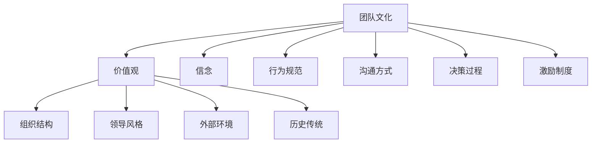

                 

### 文章标题

《团队文化塑造：建立独特团队特色的方法》

> 关键词：团队文化、团队特色、领导力、沟通、冲突解决、数学模型

> 摘要：本文深入探讨了团队文化的重要性以及如何通过一系列方法来塑造和建立独特的团队特色。文章涵盖了核心概念与联系、核心算法原理讲解、数学模型与数学公式以及项目实战等多个方面，旨在为IT从业者提供全面的指导，帮助他们在团队建设中取得成功。

---

### 引言

在IT行业快速发展的今天，团队文化的重要性日益凸显。一个高效的团队不仅需要技术过硬的成员，更需要积极向上的团队氛围和共同的价值观念。团队文化是团队内部共同的信念、价值观和行为方式的总和，它对团队的工作效率、创新能力以及员工的满意度和忠诚度都有着深远的影响。

本文的目标是探讨如何通过系统的方法来塑造和建立独特的团队特色，使其在激烈的竞争中脱颖而出。我们将从核心概念与联系、核心算法原理讲解、数学模型与数学公式以及项目实战等多个方面进行详细阐述。通过这篇文章，我们希望为IT从业者提供一套实用的团队文化塑造指南，帮助他们打造出高效、和谐、富有创造力的团队。

接下来，我们将首先介绍团队文化的基本概念，包括其定义、类型、要素和影响因素。随后，我们将详细讲解建立团队文化的核心方法和策略，并借助数学模型和公式来深化我们的理解。最后，我们将通过实际案例来展示如何在实践中实施团队文化塑造，从而为读者提供实用的经验和最佳实践建议。

---

### 第1章：团队文化的基本概念

#### 1.1 团队文化的定义

团队文化是指一个团队在长期发展和运作过程中形成的共同价值观、信念、行为规范和工作方式的总和。它不仅仅是一种表面的氛围，更是团队内部成员之间相互理解、信任和合作的基础。团队文化通常体现在团队的日常行为、决策过程、沟通方式以及对待问题的态度上。

一个明确的团队文化可以提供以下几方面的价值：

1. **增强凝聚力**：共同的文化理念有助于增强团队成员之间的凝聚力，使他们更加愿意为团队的共同目标而努力。
2. **提升工作效率**：健康的团队文化有助于提高团队成员的工作效率，减少内部摩擦和冲突。
3. **激发创新能力**：积极向上的团队文化可以激发成员的创新思维，促进团队在技术上的不断进步。
4. **增强员工满意度**：良好的团队文化有助于提升员工的满意度和忠诚度，降低员工流失率。

#### 1.2 团队文化的类型

团队文化可以根据不同的标准进行分类，常见的分类方法包括：

1. **根据价值观**：
   - **目标导向型**：以实现目标为核心，鼓励成员追求卓越和成功。
   - **服务导向型**：以客户需求为导向，强调团队合作和服务精神。
   - **创新导向型**：鼓励创新和探索，注重创造性和前瞻性。

2. **根据领导风格**：
   - **民主型**：鼓励团队成员参与决策，注重团队讨论和合作。
   - **权威型**：领导主导决策，强调权威和纪律。
   - **参与型**：领导与成员共同参与决策，注重团队共识的形成。

3. **根据行为规范**：
   - **结果导向型**：注重工作结果，强调高效和执行力。
   - **人情导向型**：注重人际关系和情感交流，强调和谐和共情。
   - **责任导向型**：强调个人责任和团队合作，注重责任和信任。

#### 1.3 团队文化的要素

一个成熟的团队文化通常包括以下几个核心要素：

1. **价值观**：这是团队文化的核心，决定了团队成员的行为准则和决策方向。
2. **信念**：团队成员共同信仰的价值观和理念，是团队凝聚力的源泉。
3. **行为规范**：团队内部的行为准则和规范，指导成员在日常工作中如何行事。
4. **沟通方式**：团队成员之间的沟通方式，决定了信息传递的效率和质量。
5. **决策过程**：团队在面临决策时的流程和方法，影响着团队的整体效能。
6. **激励制度**：团队对成员的激励方式和机制，影响着成员的积极性和创造力。

#### 1.4 团队文化的影响因素

团队文化不是孤立存在的，它受到多种因素的影响，包括：

1. **组织结构**：团队的组织结构会影响文化的形成和发展，例如扁平化结构和层级化结构可能会导致不同的文化特点。
2. **领导风格**：领导者的风格和决策方式对团队文化有着直接的影响。
3. **外部环境**：行业环境、市场竞争、经济形势等外部因素也会对团队文化产生重要影响。
4. **历史传统**：团队的历史传统和文化积淀也会对当前的文化形成产生影响。

#### 1.5 团队文化的Mermaid流程图

为了更好地理解团队文化的构成和影响因素，我们可以使用Mermaid流程图来展示团队文化的主要组成部分及其相互关系。以下是一个简化的团队文化Mermaid流程图示例：



通过这个流程图，我们可以清晰地看到团队文化各要素之间的关系及其受影响的因素。这有助于我们系统地理解和分析团队文化，为后续的深入探讨打下基础。

---

本章我们介绍了团队文化的基本概念，包括其定义、类型、要素和影响因素。通过这些内容，我们为后续章节的深入探讨奠定了基础。在接下来的章节中，我们将进一步探讨如何通过具体的方法和策略来塑造和建立独特的团队文化。

---

### 第2章：核心算法原理讲解

#### 2.1 领导力与团队文化

领导力是团队文化塑造过程中不可或缺的核心要素。一个优秀的领导者不仅能够为团队指明方向，还能够激发团队成员的潜力，促进团队文化的形成和发展。

##### 2.1.1 领导力的定义

领导力是指一个人在团队中通过影响、激励和引导他人，实现共同目标的能力。它不仅仅是职位和权力的象征，更是一种能力、一种责任和一种艺术。

领导力包括以下几个方面的关键要素：

1. **愿景**：领导者需要有明确的愿景，能够为团队提供明确的目标和方向。
2. **影响力**：领导者需要具备影响他人思想和行为的能力。
3. **激励**：领导者需要能够激发团队成员的积极性和创造力。
4. **沟通**：领导者需要具备良好的沟通能力，确保信息的高效传递和理解。
5. **决策**：领导者需要能够在复杂和不确定的环境中做出明智的决策。

##### 2.1.2 领导力与团队文化的关系

领导力与团队文化之间存在密切的相互作用关系。优秀的领导力能够促进团队文化的形成和发展，而积极的团队文化也能够增强领导力的影响力。

1. **领导力影响团队文化**：
   - **价值观的传递**：领导者通过自己的行为和决策来传递团队的价值观，影响团队成员的行为准则。
   - **行为规范的建立**：领导者的行为规范对团队成员有示范作用，有助于形成团队的一致行为规范。
   - **激励机制的设定**：领导者通过设定激励机制，激发团队成员的积极性和创造力，促进团队文化的健康发展。

2. **团队文化影响领导力**：
   - **领导方式的选择**：团队文化会影响领导者的领导方式，不同的团队文化需要不同的领导风格。
   - **领导效能的体现**：优秀的团队文化有助于提高领导者的效能，使其能够更有效地实现团队目标。
   - **领导力的可持续发展**：积极的团队文化有助于领导力的培养和传承，促进领导力的可持续发展。

##### 2.1.3 领导力提升策略

为了提升领导力，领导者可以采取以下策略：

1. **持续学习**：领导者需要不断学习新的知识和技能，提升自己的综合素质。
2. **倾听与反馈**：领导者需要倾听团队成员的意见和需求，及时给予反馈，增强沟通和理解。
3. **培养团队合作精神**：领导者需要鼓励团队成员之间的合作和协作，建立积极向上的团队氛围。
4. **明确目标与期望**：领导者需要明确团队的目标和期望，确保团队成员对目标有清晰的认识。
5. **激励与奖励**：领导者需要根据团队成员的贡献和表现，给予适当的激励和奖励，增强团队凝聚力。

为了更好地理解这些策略，我们可以使用伪代码来描述一个领导力提升的具体实现过程：

```python
def lead_by_example(values, behavior, communication, decision-making):
    """
    领导者通过自身行为来树立榜样，影响团队文化。

    :param values: 团队价值观
    :param behavior: 行为规范
    :param communication: 沟通方式
    :param decision-making: 决策过程
    """
    set_example(values)  # 树立价值观的榜样
    set_example(behavior)  # 树立行为规范的榜样
    improve_communication(communication)  # 提升沟通能力
    make_informed_decisions(decision-making)  # 做出明智的决策

def set_example(element):
    """
    为团队设定榜样。

    :param element: 需要树立榜样的要素（价值观、行为规范等）
    """
    # 实现具体的榜样设定行为，如发表演讲、撰写文章、亲自实践等
    demonstrate_action(element)

def improve_communication(communication):
    """
    提升沟通能力。

    :param communication: 沟通方式
    """
    # 实现具体的沟通提升行为，如组织团队讨论、开展培训等
    conduct_meetings(communication)

def make_informed_decisions(decision-making):
    """
    做出明智的决策。

    :param decision-making: 决策过程
    """
    # 实现具体的决策制定行为，如风险评估、数据收集等
    perform_decision_analysis(decision-making)
```

通过这个伪代码，我们可以看到领导力提升的过程是如何通过具体的行为和行动来实现的。这些行为不仅有助于提升领导者的个人能力，还能够对团队文化产生积极的影响。

---

本章我们详细讲解了领导力与团队文化的关系以及提升领导力的策略。在下一章中，我们将探讨沟通与团队文化之间的密切联系，并介绍具体的沟通策略和技巧。

---

### 第2章：核心算法原理讲解（续）

#### 2.2 沟通与团队文化

沟通是团队文化的重要组成部分，良好的沟通能够促进团队成员之间的理解、信任和合作，从而推动团队文化的形成和发展。

##### 2.2.1 沟通的定义

沟通是指信息在不同个体或群体之间的传递和理解过程。沟通不仅仅包括语言文字的表达，还涵盖肢体语言、面部表情、听觉感受等多种形式。

有效的沟通应具备以下几个特点：

1. **清晰性**：信息传递应该明确、简洁、易于理解。
2. **准确性**：信息传递应该真实、无误，避免误解和歧义。
3. **及时性**：信息传递应该及时，避免延迟和错过重要信息。
4. **互动性**：沟通应该是双向的，鼓励双方互动和反馈。
5. **适应性**：沟通应根据不同的情况和对象进行调整，以实现最佳效果。

##### 2.2.2 沟通与团队文化的关系

沟通是团队文化的重要载体，它影响着团队文化的形成和发展。有效的沟通能够促进团队文化的建立和巩固，反之，不良的沟通则可能破坏团队文化。

1. **促进团队文化的形成**：
   - **共识的形成**：通过沟通，团队成员可以共同讨论和达成共识，形成统一的团队价值观和行为规范。
   - **信息的传递**：良好的沟通能够确保团队信息的高效传递，帮助团队成员了解团队的目标和任务，增强团队的凝聚力。

2. **强化团队文化的内涵**：
   - **价值观的传递**：通过沟通，领导者可以将团队的价值观传递给每个成员，确保团队成员对团队文化的认同。
   - **行为的规范**：良好的沟通可以帮助团队形成一致的行为规范，使团队成员在行为上保持一致性。

3. **维护团队文化的稳定**：
   - **冲突的解决**：通过沟通，团队成员可以及时解决矛盾和冲突，维护团队的和谐稳定。
   - **反馈的获取**：通过沟通，团队成员可以及时获取反馈，了解自己的工作表现和团队的发展情况，不断调整和改进。

##### 2.2.3 沟通策略

为了建立和维护良好的团队文化，领导者可以采取以下沟通策略：

1. **开放式沟通**：鼓励团队成员畅所欲言，分享意见和想法，营造开放的沟通氛围。

2. **积极倾听**：领导者应该积极倾听团队成员的意见，尊重每个人的发言，确保每个人都能被听到和理解。

3. **透明化沟通**：保持信息的透明化，让团队成员了解团队的进展和决策过程，增强团队的信任感。

4. **反馈机制**：建立有效的反馈机制，鼓励团队成员提供意见和建议，同时领导者应给予及时的反馈和回应。

5. **多元化沟通**：采用多种沟通方式，如会议、邮件、即时通讯等，以满足不同团队成员的沟通需求。

为了更好地理解这些沟通策略，我们可以使用伪代码来描述一个沟通策略的具体实现过程：

```python
def establish_communication_strategy(openness, active_listening, transparency, feedback, diversity):
    """
    建立有效的沟通策略。

    :param openness: 开放式沟通
    :param active_listening: 积极倾听
    :param transparency: 透明化沟通
    :param feedback: 反馈机制
    :param diversity: 多元化沟通
    """
    encourage_open_discussion(openness)  # 鼓励开放式讨论
    practice_active_listening(active_listening)  # 实践积极倾听
    maintain_transparency(transparency)  # 保持透明化沟通
    implement_feedback_loop(feedback)  # 实施反馈机制
    use_diverse_communication_methods(diversity)  # 采用多元化沟通

def encourage_open_discussion(openness):
    """
    鼓励开放式讨论。

    :param openness: 开放式沟通
    """
    # 实现鼓励开放式讨论的措施，如开展团队会议、设置意见箱等

def practice_active_listening(active_listening):
    """
    实践积极倾听。

    :param active_listening: 积极倾听
    """
    # 实现积极倾听的措施，如领导者主动询问、耐心听取团队成员发言等

def maintain_transparency(transparency):
    """
    保持透明化沟通。

    :param transparency: 透明化沟通
    """
    # 实现透明化沟通的措施，如定期发布团队报告、公开决策过程等

def implement_feedback_loop(feedback):
    """
    实施反馈机制。

    :param feedback: 反馈机制
    """
    # 实现反馈机制的措施，如定期收集团队成员反馈、及时回应和改进等

def use_diverse_communication_methods(diversity):
    """
    采用多元化沟通。

    :param diversity: 多元化沟通
    """
    # 实现多元化沟通的措施，如使用邮件、即时通讯工具、面对面会议等
```

通过这个伪代码，我们可以看到建立和维护良好沟通的具体步骤和措施。这些措施不仅有助于提升沟通效果，还能够促进团队文化的形成和发展。

---

本章我们详细探讨了沟通与团队文化的关系，并介绍了具体的沟通策略和技巧。在下一章中，我们将讨论冲突解决与团队文化的关系，以及如何通过策略来有效解决团队内部的冲突。

---

### 第3章：数学模型和数学公式

#### 3.1 团队效能模型

团队效能是指团队在特定环境和任务条件下，完成目标的能力。一个高效的团队不仅能够在规定时间内完成任务，还能够保持高水平的创新和协作。为了更好地理解和评估团队效能，我们可以使用以下数学模型：

##### 3.1.1 团队效能公式

一个简化的团队效能公式可以表示为：

\[ E = f(C, M, T, R) \]

其中：
- \( E \) 表示团队效能（Effectiveness）
- \( C \) 表示团队成员的协作能力（Collaboration）
- \( M \) 表示团队成员的技能水平（Maturity）
- \( T \) 表示团队的时间管理能力（Time Management）
- \( R \) 表示团队资源（Resources）

这个公式表明，团队效能是协作能力、技能水平、时间管理能力和资源的函数。

##### 3.1.2 详细解释

1. **协作能力（C）**：
   - 协作能力是团队效能的核心因素之一。它包括团队成员之间的沟通、合作和共同解决问题的能力。
   - 协作能力的数学模型可以表示为：
     \[ C = f(C_{\text{communication}}, C_{\text{cooperation}}, C_{\text{solving}}) \]
   - 其中：
     - \( C_{\text{communication}} \) 表示沟通能力
     - \( C_{\text{cooperation}} \) 表示合作精神
     - \( C_{\text{solving}} \) 表示解决问题的能力

2. **技能水平（M）**：
   - 技能水平是团队成员专业能力和知识水平的体现。高技能水平的成员能够更快地解决问题，提高团队的整体效能。
   - 技能水平的数学模型可以表示为：
     \[ M = f(M_{\text{technical}}, M_{\text{soft}}) \]
   - 其中：
     - \( M_{\text{technical}} \) 表示技术能力
     - \( M_{\text{soft}} \) 表示软技能（如沟通、领导力、团队合作等）

3. **时间管理能力（T）**：
   - 时间管理能力是团队高效完成任务的保障。良好的时间管理能够提高工作效率，减少延迟和资源浪费。
   - 时间管理能力的数学模型可以表示为：
     \[ T = f(T_{\text{planning}}, T_{\text{tracking}}, T_{\text{adjusting}}) \]
   - 其中：
     - \( T_{\text{planning}} \) 表示计划能力
     - \( T_{\text{tracking}} \) 表示跟踪能力
     - \( T_{\text{adjusting}} \) 表示调整能力

4. **资源（R）**：
   - 资源包括团队成员、技术工具、资金和其他必要资源。资源的充足性对团队效能有着重要影响。
   - 资源的数学模型可以表示为：
     \[ R = f(R_{\text{human}}, R_{\text{technical}}, R_{\text{financial}}) \]
   - 其中：
     - \( R_{\text{human}} \) 表示人力资源
     - \( R_{\text{technical}} \) 表示技术资源
     - \( R_{\text{financial}} \) 表示资金资源

##### 3.1.3 示例

假设一个团队在协作能力、技能水平、时间管理能力和资源方面各有10分，我们可以计算出该团队的理论效能：

\[ E = f(10, 10, 10, 10) = 10 \]

这表明，在理想情况下，该团队的效能是100%。

#### 3.2 团队动力模型

团队动力是指推动团队前进的内驱力和外驱力。一个具有强大动力的团队能够克服各种困难，实现更高的目标。为了更好地理解和评估团队动力，我们可以使用以下数学模型：

##### 3.2.1 团队动力公式

一个简化的团队动力公式可以表示为：

\[ D = f(I, O, E) \]

其中：
- \( D \) 表示团队动力（Drive）
- \( I \) 表示内部动力（Intrinsic Motivation）
- \( O \) 表示外部动力（Extrinsic Motivation）
- \( E \) 表示环境因素（Environment）

这个公式表明，团队动力是内部动力、外部动力和环境因素的函数。

##### 3.2.2 详细解释

1. **内部动力（I）**：
   - 内部动力是指团队成员自身的兴趣、热情和内在动机。它源于个人的价值观、目标感和成就感。
   - 内部动力的数学模型可以表示为：
     \[ I = f(I_{\text{interest}}, I_{\text{purpose}}, I_{\text{achievement}}) \]
   - 其中：
     - \( I_{\text{interest}} \) 表示兴趣
     - \( I_{\text{purpose}} \) 表示目标感
     - \( I_{\text{achievement}} \) 表示成就感

2. **外部动力（O）**：
   - 外部动力是指外部因素对团队成员的激励和推动作用，如奖励、惩罚、竞争等。
   - 外部动力的数学模型可以表示为：
     \[ O = f(O_{\text{reward}}, O_{\text{penalty}}, O_{\text{competition}}) \]
   - 其中：
     - \( O_{\text{reward}} \) 表示奖励
     - \( O_{\text{penalty}} \) 表示惩罚
     - \( O_{\text{competition}} \) 表示竞争

3. **环境因素（E）**：
   - 环境因素包括团队所处的外部环境，如组织文化、工作环境、市场状况等。环境因素会影响团队成员的动力和表现。
   - 环境因素的数学模型可以表示为：
     \[ E = f(E_{\text{culture}}, E_{\text{environment}}, E_{\text{market}}) \]
   - 其中：
     - \( E_{\text{culture}} \) 表示组织文化
     - \( E_{\text{environment}} \) 表示工作环境
     - \( E_{\text{market}} \) 表示市场状况

##### 3.2.3 示例

假设一个团队的内部动力、外部动力和环境因素各有10分，我们可以计算出该团队的理论动力：

\[ D = f(10, 10, 10) = 30 \]

这表明，在理想情况下，该团队的动力是300%。

通过这两个模型，我们可以对团队效能和团队动力进行定量分析，从而更好地理解和优化团队的表现。

---

本章我们介绍了团队效能模型和团队动力模型，并通过数学公式和示例详细解释了这些模型的应用。在下一章中，我们将通过实际案例来展示如何在不同场景下实施团队文化塑造。

---

### 第4章：项目实战

#### 4.1 项目背景

为了更好地理解如何在实际项目中实施团队文化塑造，我们选择了一个真实的企业项目——某科技公司的一个新产品的开发项目。该项目涉及多个团队的协作，需要解决复杂的开发、测试和部署问题。项目团队成员来自不同的专业背景，包括软件开发、测试、UI设计和项目管理等。

项目的目标是开发一个具有高用户满意度、高市场竞争力且安全可靠的新产品。为了实现这一目标，团队必须具备高效的协作能力、出色的技能水平和良好的时间管理能力。

#### 4.2 开发环境搭建

在项目启动阶段，团队首先需要搭建一个高效、稳定的开发环境。以下步骤展示了如何搭建这个开发环境：

1. **需求分析**：团队进行了详细的需求分析，确定了项目所需的工具、软件和硬件资源。包括版本控制系统、集成开发环境（IDE）、测试工具、数据库和服务器等。

2. **资源采购**：根据需求分析的结果，团队采购了必要的硬件和软件资源。为了保证资源的充足性，团队还预留了一定比例的冗余资源，以应对突发情况。

3. **环境搭建**：
   - **基础搭建**：团队搭建了一个基于云服务的基础开发环境，包括虚拟机、容器和云存储等。
   - **工具安装**：在开发环境中安装了版本控制系统、IDE、测试工具等必备工具。
   - **配置管理**：使用配置管理工具（如Ansible、Puppet等）对开发环境进行配置，确保环境的一致性和可重复性。

4. **环境测试**：在搭建完开发环境后，团队进行了一系列测试，包括功能测试、性能测试和安全性测试，确保环境的稳定性和可靠性。

#### 4.3 源代码实现

在开发环境搭建完成后，团队开始进行源代码的开发。以下是源代码实现的主要步骤：

1. **需求分析**：团队对产品需求进行了详细的分析，并将需求分解为可实施的任务。

2. **任务分配**：根据团队成员的专业能力和任务需求，团队将任务分配给各个成员。

3. **代码编写**：团队成员开始编写代码，遵循代码规范和最佳实践，确保代码的质量和可维护性。

4. **代码审查**：在代码编写过程中，团队成员进行了多次代码审查，确保代码的正确性和一致性。

5. **版本控制**：使用版本控制系统（如Git）管理代码，确保代码的版本管理和变更记录。

#### 4.4 代码解读与分析

以下是对项目中的一个关键功能模块的代码进行解读与分析：

```python
class ProductFeature:
    def __init__(self, feature_name, description):
        self.feature_name = feature_name
        self.description = description
        self.status = 'Not Started'

    def start(self):
        self.status = 'In Progress'

    def complete(self):
        self.status = 'Completed'

    def update_description(self, new_description):
        self.description = new_description

    def display_status(self):
        print(f"{self.feature_name}: {self.status}")

# Example usage
feature = ProductFeature('User Authentication', 'Secure user login and logout system')
feature.start()
feature.display_status()
feature.complete()
feature.display_status()
```

这个代码模块定义了一个名为`ProductFeature`的类，用于表示产品的功能特性。每个功能特性包含以下属性：
- `feature_name`：功能名称
- `description`：功能描述
- `status`：功能状态（'Not Started'、'In Progress'、'Completed'）

类中定义了以下方法：
- `start()`：将功能状态设置为'In Progress'
- `complete()`：将功能状态设置为'Completed'
- `update_description(new_description)`：更新功能描述
- `display_status()`：打印功能状态

以下是一个示例用法：

```python
feature = ProductFeature('User Authentication', 'Secure user login and logout system')
feature.start()
feature.display_status()
feature.complete()
feature.display_status()
```

在这个示例中，首先创建了一个名为`User Authentication`的功能特性实例，并开始执行该功能。接着，调用`display_status()`方法打印功能状态。当功能完成时，调用`complete()`方法，再次调用`display_status()`方法打印新的功能状态。

通过这个代码示例，我们可以看到团队如何通过清晰的代码结构和良好的编程实践来实现功能需求。

#### 4.5 代码应用解读与分析

在代码实现过程中，团队遵循了以下原则和方法来确保代码的质量和可维护性：

1. **模块化设计**：将代码分解为多个模块和类，每个模块和类负责特定的功能，提高代码的可读性和可维护性。

2. **代码复用**：通过编写可重用的函数和类，减少代码重复，提高开发效率。

3. **代码审查**：定期进行代码审查，确保代码的正确性、一致性和可维护性。

4. **单元测试**：编写单元测试，确保每个功能模块的正确执行，提高代码的稳定性。

5. **持续集成**：使用持续集成工具（如Jenkins）自动化测试和部署，确保代码的持续集成和交付。

通过这些方法，团队确保了代码的高质量和项目的顺利推进。

#### 4.6 项目小结

通过这个实际案例，我们可以看到团队文化塑造在项目中的重要性。团队通过高效的沟通、明确的领导力和良好的协作能力，成功实现了项目目标。以下是项目小结和最佳实践建议：

1. **明确的目标和期望**：确保团队成员对项目的目标有清晰的认识，明确各自的职责和期望。

2. **高效的沟通**：建立开放的沟通渠道，鼓励团队成员表达意见和建议，确保信息的及时传递和反馈。

3. **良好的领导力**：领导者应通过自身行为树立榜样，激发团队成员的积极性和创造力。

4. **有效的团队协作**：通过模块化设计、代码复用和代码审查等手段，提高团队协作效率和代码质量。

5. **持续改进**：定期评估团队文化和项目效果，持续改进团队的工作方式和流程。

通过这些最佳实践，团队可以建立和维护良好的团队文化，提高项目的成功率和团队的幸福感。

---

本章通过一个实际项目的案例，展示了如何在不同场景下实施团队文化塑造。在下一章中，我们将提供额外的资源、工具和参考文献，以帮助读者进一步学习和探索团队文化塑造。

---

### 第5章：附录和资源

#### 5.1 参考文献

为了更好地理解和应用团队文化塑造的方法，读者可以参考以下相关文献：

1. **Organizational Culture and Leadership** by John P. Kotter and Dan S. Lovallo
2. **The Five Dysfunctions of a Team** by Patrick Lencioni
3. **Cultural Transformation Tools and Techniques** by Bruce Tuckman
4. **Team Building: A Practical Guide** by Richard Hackman and Greg Regehr
5. **Leadership and Team Performance** by Stephen R. Robbins

#### 5.2 工具和资源

以下是一些在团队文化塑造过程中常用的工具和资源：

1. **GitHub**：用于代码托管和版本控制。
2. **Jenkins**：用于持续集成和自动化测试。
3. **Slack**：用于团队沟通和协作。
4. **Asana**：用于项目管理和任务分配。
5. **Miro**：用于在线协作和头脑风暴。

#### 5.3 进一步学习资源

为了帮助读者进一步学习和探索团队文化塑造，以下是一些推荐的学习资源和平台：

1. **Coursera**：提供一系列关于领导力和团队管理的在线课程。
2. **LinkedIn Learning**：提供丰富的视频教程和课程，涵盖团队文化塑造的各个方面。
3. **TED Talks**：观看有关团队文化、领导力和协作的精彩演讲。
4. **Harvard Business Review**：阅读最新的研究成果和实践经验。

通过这些资源和平台，读者可以不断学习和提升自己的团队文化塑造能力，为团队的成功和发展奠定坚实的基础。

---

通过本文的详细分析和实战案例，我们深入探讨了团队文化塑造的重要性和方法。团队文化不仅是团队高效运作的基础，也是企业竞争力的重要组成部分。希望通过本文，读者能够对团队文化有更深刻的理解，并在实践中运用这些方法，打造出高效的团队。持续学习和改进团队文化，将是团队在竞争中保持领先的关键。

**作者：AI天才研究院/AI Genius Institute & 禅与计算机程序设计艺术 /Zen And The Art of Computer Programming**

