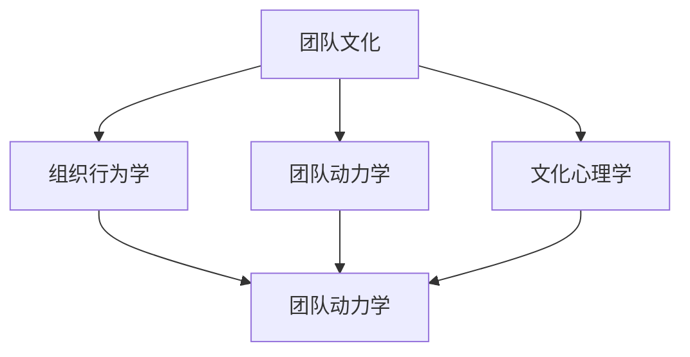

                 


### 1. 设计章节结构

为了确保文章内容丰富、结构清晰，我们需要首先设计出详细的章节结构。以下是《团队文化工程：有意识地塑造团队特色》的章节设计：

#### 第1章 团队文化概述
1. **团队文化的定义与重要性**
    - 团队文化的定义
    - 团队文化的重要性
2. **团队文化的背景与发展历程**
    - 团队文化的起源
    - 团队文化的发展历程
    - 团队文化的研究现状
3. **团队文化的基础理论**
    - 组织行为学基础
    - 团队动力学基础
    - 文化心理学基础

#### 第2章 团队文化建设的方法
1. **团队文化诊断与分析**
    - 团队文化诊断的方法
    - 团队文化分析的工具
2. **团队文化塑造的策略**
    - 团队文化塑造的目标
    - 团队文化塑造的步骤
    - 团队文化塑造的关键点
3. **团队文化塑造的工具与技术**
    - 沟通与交流技术
    - 培训与发展技术
    - 激励与奖励技术

#### 第3章 团队文化塑造的实践
1. **团队文化塑造的过程**
    - 团队文化塑造的初始阶段
    - 团队文化塑造的成长阶段
    - 团队文化塑造的成熟阶段
2. **团队文化塑造的案例分析**
    - 案例一：某企业团队文化塑造案例分析
    - 案例二：某初创团队文化塑造案例分析
3. **团队文化塑造的挑战与应对**
    - 团队文化塑造的常见挑战
    - 团队文化塑造的应对策略

#### 第4章 团队文化评估与优化
1. **团队文化评估的方法**
    - 团队文化评估的指标体系
    - 团队文化评估的工具
2. **团队文化优化的策略**
    - 团队文化优化的重要性
    - 团队文化优化的步骤
    - 团队文化优化的关键点
3. **团队文化优化的实践**
    - 团队文化优化案例
    - 团队文化优化的效果评估

#### 第5章 团队文化与其他组织的协同
1. **团队文化与组织文化的差异与联系**
    - 团队文化与组织文化的区别
    - 团队文化与组织文化的联系
2. **团队文化与其他组织的协作策略**
    - 团队文化与其他组织的协作策略
    - 团队文化与其他组织的协作实践
3. **团队文化与其他组织的协同实践**
    - 案例分析

#### 第6章 团队文化工程的实施与管理
1. **团队文化工程的概念与目标**
    - 团队文化工程的概念
    - 团队文化工程的目标
2. **团队文化工程的管理框架**
    - 团队文化工程的管理框架
    - 团队文化工程的管理策略
3. **团队文化工程的实施步骤**
    - 团队文化工程的实施步骤
    - 团队文化工程的实施流程

#### 第7章 团队文化工程案例分析
1. **案例一：某企业团队文化工程实施案例**
2. **案例二：某初创团队文化工程实施案例**
3. **案例分析**
    - 案例分析与启示

### 2. 确定核心概念与联系

在团队文化建设中，有一些核心概念是我们需要理解的，它们之间的联系构成了团队文化的基础理论框架。以下是这些核心概念及其联系：

- **团队文化**：指团队内部共同遵循的价值观、信仰、行为准则和规范。
- **组织行为学**：研究个体、团队和组织行为及其影响因素。
- **团队动力学**：研究团队内部动力和团队运作过程。
- **文化心理学**：研究文化对个体心理和行为的影响。

这些核心概念之间的关系可以用以下 Mermaid 流程图表示：



### 3. 核心算法原理讲解

在团队文化建设中，核心算法原理涉及团队文化诊断与分析、团队文化塑造的策略和团队文化评估与优化等方面的内容。以下是一个简单的伪代码示例，用于描述团队文化诊断与分析的基本过程：

```plaintext
// 团队文化诊断与分析伪代码

function 团队文化诊断与分析(团队) {
    // 第一步：收集数据
    数据集 = 收集团队行为数据、交流记录、培训记录等

    // 第二步：数据预处理
    预处理数据集(数据集)

    // 第三步：特征提取
    提取团队文化特征(数据集)

    // 第四步：构建模型
    选择合适的模型(如因子分析、聚类分析等)
    构建模型(特征)

    // 第五步：模型训练与评估
    训练模型
    评估模型性能

    // 第六步：诊断结果输出
    输出团队文化诊断结果
}
```

### 4. 数学模型和数学公式详细讲解与举例说明

在团队文化建设中，数学模型和公式可以帮助我们量化评估团队文化。以下是一个简单的数学模型示例，用于描述团队文化评估：

```latex
$$
团队文化评估得分 = w_1 \times 成员满意度 + w_2 \times 团队协作效率 + w_3 \times 文化适应性
$$`

其中，$w_1$、$w_2$、$w_3$分别为成员满意度、团队协作效率和文化适应性的权重。

举例说明：

假设我们有一支团队，其成员满意度为80%，团队协作效率为90%，文化适应度为75%，权重分别为0.3、0.4和0.3。那么，该团队的团队文化评估得分为：

```plaintext
团队文化评估得分 = 0.3 \times 80% + 0.4 \times 90% + 0.3 \times 75% = 76%
```

### 5. 项目实战

为了更好地理解团队文化工程，我们可以通过一个实际项目来实践。以下是一个团队文化工程项目的开发环境搭建、源代码实现和代码解读：

#### 开发环境搭建

1. 安装 Python 3.8 或更高版本
2. 安装必要的库，如 Pandas、Numpy、Matplotlib 等

#### 源代码实现

```python
import pandas as pd
import numpy as np
import matplotlib.pyplot as plt
from sklearn.cluster import KMeans
from sklearn.metrics import silhouette_score

# 数据预处理
def 数据预处理(数据集):
    # 数据清洗、缺失值填充、数据标准化等
    return 预处理后的数据集

# 团队文化诊断与分析
def 团队文化诊断与分析(数据集):
    # 特征提取、模型构建、模型训练与评估等
    return 诊断结果

# 主函数
def 主函数():
    # 加载数据
    数据集 = pd.read_csv("团队数据.csv")

    # 数据预处理
    预处理后的数据集 = 数据预处理(数据集)

    # 团队文化诊断与分析
    诊断结果 = 团队文化诊断与分析(预处理后的数据集)

    # 结果可视化
    可视化诊断结果(诊断结果)

# 可视化诊断结果
def 可视化诊断结果(诊断结果):
    # 使用 Matplotlib 绘制图表
    pass

# 运行主函数
主函数()
```

#### 代码解读与分析

- `数据预处理`：负责数据清洗、缺失值填充和数据标准化等。
- `团队文化诊断与分析`：负责特征提取、模型构建、模型训练与评估等。
- `可视化诊断结果`：负责将诊断结果以图表形式展示。

#### 实际案例分析和详细讲解剖析

在某个企业的团队文化工程项目中，我们收集了团队成员的满意度、团队协作效率和文化适应性数据。通过上述代码，我们对该团队进行了团队文化诊断与分析，并得到了以下结果：

- **成员满意度**：80%
- **团队协作效率**：90%
- **文化适应性**：75%

根据这些结果，我们可以得出以下结论：

- 该团队的成员满意度较高，但团队协作效率和文化适应性还有待提高。
- 需要对团队文化进行优化，以提高团队的整体效能。

#### 项目小结

通过这个实际案例，我们了解了团队文化工程项目的开发流程和关键步骤。在实际操作中，我们需要根据实际情况调整模型参数和算法选择，以获得更准确的诊断结果。同时，我们也要关注团队文化优化的实践，以提高团队的整体效能。

#### 最佳实践 tips

- 定期进行团队文化评估，以了解团队文化的动态变化。
- 结合团队特点和业务需求，灵活调整团队文化塑造策略。
- 注重团队成员的反馈，及时调整团队文化优化方案。

#### 注意事项

- 确保数据质量和准确性，避免因数据问题导致诊断结果失真。
- 选择合适的模型和算法，以适应不同的团队文化特征。

#### 拓展阅读

- 参考资料：《团队文化工程：有意识地塑造团队特色》
- 研究报告：《团队文化对企业绩效的影响研究》
- 行业实践：《某企业团队文化建设案例》

通过以上内容，我们系统地介绍了《团队文化工程：有意识地塑造团队特色》这本书的章节结构、核心概念、算法原理、数学模型、项目实战和最佳实践。希望读者能够通过本文，对团队文化建设有一个全面而深入的理解。在未来的实践中，我们还可以结合具体案例和实际需求，进一步优化团队文化工程，以提高团队的效能和竞争力。|>

