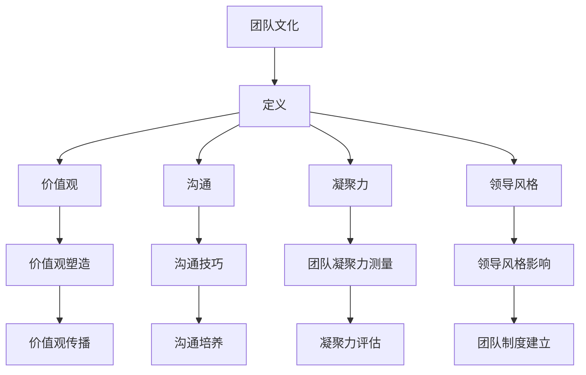

                 

### 1. 背景介绍

团队文化在现代社会中扮演着至关重要的角色。随着企业规模的扩大和全球化进程的加速，团队文化逐渐成为企业竞争力的重要组成部分。一个良好的团队文化能够促进团队成员之间的合作与沟通，提高团队的凝聚力和工作效率，从而在激烈的市场竞争中脱颖而出。

然而，团队文化建设并非易事。它涉及到团队价值观的塑造、领导风格的影响、团队沟通技巧的培养等多个方面。一个成功的团队文化需要经过长时间的实践和不断的调整优化。因此，研究和探讨团队文化建设的方法与策略具有重要意义。

本文旨在通过对团队文化的定义、类型、作用以及构建策略的深入剖析，帮助读者理解团队文化建设的重要性，并提供实用的方法和技巧。文章将从以下几个方面展开：

1. **团队文化的概念与基础**：介绍团队文化的定义、特点、类型及其作用。
2. **团队文化的构建策略**：探讨团队价值观的塑造、领导风格的影响、团队沟通技巧的培养以及团队制度的建立。
3. **团队凝聚力的测量与评估**：介绍团队凝聚力的概念、影响因素、测量方法和评估标准。
4. **团队文化建设中的挑战与解决方案**：分析团队文化建设中可能遇到的挑战，并提供相应的解决方案。
5. **团队文化建设的实践案例**：分享国内外成功的团队文化建设案例，进行分析和启示。
6. **团队文化建设的工具与方法**：介绍团队建设活动的设计与实施、团队文化建设评估工具以及团队文化建设方法比较。
7. **结论**：总结团队文化建设的重要性，展望未来发展趋势。

通过以上内容，本文希望能够为读者提供一份全面、系统、实用的团队文化建设指南，帮助企业和团队在激烈的市场竞争中打造具有强大凝聚力和竞争力的团队文化。

### 2. 核心概念与联系

在深入探讨团队文化建设之前，我们首先需要明确几个核心概念，并理解它们之间的内在联系。以下是本文将涉及的主要概念及其关系架构：

#### 2.1 团队文化的定义

团队文化是指团队在长期的运营过程中形成的共同价值观、行为准则和工作方式。它不仅包括团队的使命、愿景和目标，还涵盖了团队成员的共同信仰、行为规范和工作习惯。团队文化是团队内部的一种精神力量，能够引导和激励团队成员为实现团队目标而努力。

#### 2.2 团队凝聚力

团队凝聚力是指团队成员之间的紧密联系和相互依赖程度。高凝聚力的团队通常具有更强的合作意识和协作能力，能够在面对挑战时保持团结一致。团队凝聚力是团队文化的重要组成部分，也是衡量团队文化建设成效的重要指标之一。

#### 2.3 领导风格

领导风格是指领导者在团队管理中采用的方式和手段。不同的领导风格会对团队文化的形成和团队凝聚力产生不同的影响。例如，民主型领导风格能够增强团队成员的参与感和归属感，而权威型领导风格则可能导致团队成员的依赖性和被动性。

#### 2.4 团队沟通

团队沟通是指团队成员之间的信息传递和交流。良好的沟通是团队文化建设的基础，能够促进团队成员之间的理解与合作。沟通方式、沟通频率和沟通效果是影响团队凝聚力的重要因素。

#### 2.5 团队价值观

团队价值观是指团队成员共同认同和追求的基本信念和原则。团队价值观是团队文化的核心，它决定了团队成员的行为方式和团队的发展方向。一个统一的团队价值观能够增强团队的凝聚力和执行力。

#### 关系架构

通过Mermaid流程图，我们可以更直观地理解这些概念之间的关系：

在这个关系架构中，团队文化作为核心，通过价值观、沟通、凝聚力和领导风格等多个方面相互影响和作用。团队文化的建设过程就是不断优化和完善这些方面，以实现团队的长期稳定发展。

### 3. 团队文化的定义与类型

#### 3.1 团队文化的定义

团队文化是一个组织在长期运营过程中形成的共同价值观、行为准则和工作方式。它不仅体现在团队成员的日常行为中，还渗透到团队的组织结构、管理制度和员工关系等各个方面。团队文化是团队内部的一种精神力量，能够引导和激励团队成员为实现团队目标而努力。

具体来说，团队文化包括以下几个方面：

- **价值观**：团队成员共同认同和追求的基本信念和原则，是团队文化的核心。
- **行为准则**：团队成员在工作和生活中应当遵守的基本规范和标准。
- **工作方式**：团队成员在完成工作任务时采用的思维方式和工作流程。

团队文化的定义可以从以下几个方面来理解：

- **精神力量**：团队文化是一种无形的力量，能够在团队内部形成一种共同的价值观和行为准则，从而促进团队成员之间的协作和沟通。
- **长期形成**：团队文化不是一朝一夕形成的，而是经过长期的积累和沉淀，逐渐形成和完善的。
- **共同价值观**：团队文化强调团队成员之间的共同目标和信仰，是团队凝聚力的重要来源。

#### 3.2 团队文化的类型

团队文化可以根据不同的维度进行分类，常见的分类方法包括：

- **根据价值观的导向性**：可以分为结果导向型和过程导向型。
  - **结果导向型**：强调团队的最终目标和成果，注重效率和绩效。
  - **过程导向型**：注重团队成员之间的合作和沟通，强调团队成员的参与感和满意度。
  
- **根据领导风格**：可以分为权威型、民主型和放任型。
  - **权威型**：领导者拥有绝对的权力和决策权，团队成员服从领导者的指挥。
  - **民主型**：领导者鼓励团队成员参与决策，团队成员有更多的自主权。
  - **放任型**：领导者较少干预团队的工作，团队成员自主决策和执行。

- **根据团队成员的参与度**：可以分为参与型、命令型和依赖型。
  - **参与型**：团队成员积极参与决策和任务执行，具有高度的自主性和责任感。
  - **命令型**：团队成员主要按照领导的指示执行任务，自主权较低。
  - **依赖型**：团队成员依赖于其他成员的支持和帮助，独立性较低。

#### 3.3 团队文化的特点

团队文化具有以下几大特点：

- **共同性**：团队文化是团队成员共同认可和追求的价值观和行为准则，是团队的共同财富。
- **独特性**：每个团队都有其独特的文化特点，反映在团队成员的行为、沟通和工作方式上。
- **传承性**：团队文化在长期的运营过程中不断传承和演进，是团队历史的沉淀。
- **稳定性**：团队文化具有一定的稳定性，不容易受到外部环境的变化而改变。
- **感染力**：团队文化能够对团队成员产生强烈的感染力，引导和激励团队成员为实现团队目标而努力。

#### 3.4 团队文化的作用

团队文化在团队运作中发挥着重要的作用，主要包括以下几个方面：

- **提高凝聚力**：团队文化能够增强团队成员之间的联系和信任，提高团队的凝聚力。
- **提升工作效率**：团队文化能够促进团队成员之间的协作和沟通，提高工作效率。
- **塑造团队形象**：团队文化反映了一个团队的价值观和行为准则，能够塑造团队的形象和品牌。
- **引导员工行为**：团队文化能够引导和规范团队成员的行为，提高员工的职业素养。
- **增强企业竞争力**：拥有良好团队文化的企业能够在市场竞争中脱颖而出，具有更强的竞争力。

### 4. 团队文化的构建策略

团队文化的构建是一个长期而复杂的过程，需要从多个方面进行系统性规划和实施。以下是团队文化构建的几个关键策略：

#### 4.1 团队价值观的塑造

团队价值观是团队文化的核心，是团队成员共同遵循的基本信念和原则。团队价值观的塑造需要从以下几个方面入手：

- **明确价值观**：首先，团队领导者需要明确团队的核心价值观，并将其传达给所有团队成员。这可以通过召开团队会议、制定价值观宣言等方式实现。
- **价值观传播**：团队领导者需要通过多种途径将价值观传播给团队成员，如内部培训、团队活动、日常沟通等。确保每位成员都能够理解和认同团队价值观。
- **价值观实践**：价值观不仅仅是口号，更需要通过实际工作和行为来体现。团队领导者应该以身作则，带头践行团队价值观，并通过奖惩机制鼓励团队成员按照价值观行事。

#### 4.2 领导风格的影响

领导风格对团队文化的形成和发展具有重要影响。不同的领导风格会导致团队产生不同的文化氛围。以下是几种常见的领导风格及其对团队文化的影响：

- **权威型领导**：权威型领导风格强调领导者的权威和决策权，团队成员相对被动。这种风格可能导致团队缺乏创新和灵活性，但也能确保团队目标的快速达成。
- **民主型领导**：民主型领导风格鼓励团队成员参与决策，增强团队的凝聚力和归属感。这种风格有助于培养团队成员的自主性和责任感，但可能影响决策效率。
- **放任型领导**：放任型领导风格给予团队成员高度的自主权，鼓励创新和自由表达。这种风格有助于培养团队成员的创造力和独立性，但也可能导致团队目标不一致和资源浪费。

#### 4.3 团队沟通技巧的培养

良好的沟通是团队文化的重要组成部分，能够促进团队成员之间的理解与合作。以下是几个关键点：

- **沟通渠道的建立**：团队领导者需要建立多种沟通渠道，如定期会议、内部邮件、即时通讯工具等，确保团队成员能够及时、有效地进行沟通。
- **沟通方式的多样化**：团队领导者应该鼓励团队成员采用不同的沟通方式，如面对面沟通、书面沟通、线上沟通等，以满足不同成员的沟通需求。
- **沟通效果的提升**：团队领导者需要关注沟通效果，通过反馈机制和沟通培训等方式提升团队成员的沟通能力，减少误解和冲突。

#### 4.4 团队制度的建立

团队制度是团队文化的重要保障，能够规范团队成员的行为和团队运作。以下是几个关键点：

- **制度明确**：团队领导者需要制定明确的制度，包括工作流程、岗位职责、绩效评估等，确保团队成员了解并遵守。
- **制度执行**：团队领导者需要严格执行制度，确保团队成员按照制度行事，避免制度流于形式。
- **制度优化**：团队领导者需要根据实际情况不断优化制度，使其更加科学、合理，适应团队的发展需求。

通过以上策略，团队领导者可以逐步构建和优化团队文化，提升团队的凝聚力和工作效率，为团队的长期发展奠定坚实基础。

### 5. 团队凝聚力的测量与评估

#### 5.1 团队凝聚力的概念

团队凝聚力是指团队成员之间相互吸引、相互依赖的程度，以及团队成员对团队的忠诚度和归属感。高凝聚力的团队通常表现出较强的合作意识和协作能力，能够在面对外部压力和内部挑战时保持团结一致。团队凝聚力是团队文化的重要组成部分，也是衡量团队建设成效的重要指标。

团队凝聚力可以从以下几个方面进行理解：

- **相互吸引**：团队成员之间具有较强的吸引力，愿意在团队中共同工作。
- **相互依赖**：团队成员之间相互依赖，共享资源和信息，共同面对问题和挑战。
- **忠诚度和归属感**：团队成员对团队具有高度的忠诚度和归属感，愿意为团队的目标和利益而努力。

#### 5.2 团队凝聚力的影响因素

团队凝聚力受到多种因素的影响，以下是一些关键因素：

- **团队成员的共同目标**：共同的目标和愿景是团队凝聚力的重要基础。当团队成员明确共同的目标时，他们会更加愿意为团队的成功而努力。
- **团队成员的相似性**：团队成员在价值观、兴趣和背景等方面的相似性有助于增强团队的凝聚力。相似性可以减少冲突，提高团队的协作效率。
- **领导风格**：领导者的风格对团队凝聚力有重要影响。民主型领导风格能够鼓励团队成员参与决策，增强团队的凝聚力和归属感。
- **沟通与交流**：良好的沟通和交流能够促进团队成员之间的理解和信任，提高团队凝聚力。
- **团队绩效**：团队的绩效水平也会影响团队凝聚力。当团队取得成功时，团队成员会感到自豪和满足，进而增强凝聚力。
- **外部环境**：外部环境的变化，如市场竞争、政策调整等，也会对团队凝聚力产生影响。

#### 5.3 团队凝聚力的测量方法

测量团队凝聚力可以帮助团队领导者了解团队当前的状态，并制定相应的改进措施。以下是一些常用的团队凝聚力测量方法：

- **问卷调查**：通过设计问卷，收集团队成员对团队凝聚力的感知和评价。问卷可以包括开放性和封闭性题目，涉及团队协作、沟通、目标认同等方面。
- **访谈法**：通过与团队成员进行一对一或小组访谈，深入了解他们对团队凝聚力的看法和感受。访谈法能够获取更详细和深入的信息。
- **观察法**：通过观察团队成员在日常工作中的行为和互动，评估团队凝聚力。观察法适用于了解团队的实际运作情况。
- **行为指标**：通过分析团队的行为指标，如团队项目的完成情况、成员间的合作频率和合作质量等，评估团队凝聚力。

#### 5.4 团队凝聚力的评估标准

团队凝聚力的评估需要考虑多个维度，以下是一些常见的评估标准：

- **协作效率**：团队协作效率是评估团队凝聚力的重要指标。高凝聚力的团队通常能够高效地完成任务，团队成员之间的协作顺畅。
- **成员参与度**：团队成员的参与度是团队凝聚力的重要体现。高凝聚力的团队中，每位成员都积极参与决策和任务执行，具有高度的自主性和责任感。
- **团队氛围**：团队氛围是评估团队凝聚力的重要维度。高凝聚力的团队通常具有积极、开放、和谐的团队氛围，成员之间相互信任、尊重和支持。
- **团队绩效**：团队绩效水平是衡量团队凝聚力的重要标准。高凝聚力的团队通常能够取得较好的绩效，团队成员为团队的成功感到自豪。
- **成员满意度**：团队成员对团队的满意度是评估团队凝聚力的重要指标。高凝聚力的团队中，成员对团队的认同感和归属感较高，对团队的工作环境和氛围感到满意。

通过以上测量方法和评估标准，团队领导者可以全面了解团队凝聚力的现状，并制定相应的改进措施，提升团队的整体表现。

### 6. 团队文化建设中的挑战与解决方案

#### 6.1 文化冲突的处理

在团队文化建设过程中，文化冲突是一种常见且棘手的问题。文化冲突可能源于团队成员的不同背景、价值观、工作习惯和沟通方式等。如果不及时处理，文化冲突会削弱团队凝聚力，影响团队的正常运作。以下是几种常见的文化冲突类型及其处理策略：

- **价值观冲突**：团队成员持有不同的价值观，导致在工作中的理念和行为产生分歧。例如，一个团队成员可能认为时间效率最重要，而另一个团队成员可能认为团队合作和人际关系的维护更为重要。
  - **解决方案**：团队领导者需要通过开放沟通和民主决策来缓解价值观冲突。鼓励团队成员表达自己的观点，并在充分讨论后达成共识。同时，可以引入跨文化培训，帮助团队成员理解不同文化背景下的价值观差异。

- **工作习惯冲突**：不同背景的团队成员可能在工作习惯上存在差异，如时间管理、工作流程和方法等。
  - **解决方案**：团队领导者可以制定统一的工作流程和标准，并通过培训和指导帮助团队成员适应新的工作方式。同时，鼓励团队成员相互学习和借鉴，提高团队整体的效率。

- **沟通障碍**：文化差异可能导致团队成员在沟通时产生误解和隔阂，影响团队的协作效果。
  - **解决方案**：团队领导者可以建立有效的沟通机制，如定期会议、反馈环节和团队活动，促进团队成员之间的交流。同时，可以引入跨文化沟通培训，提高团队成员的沟通能力和跨文化敏感度。

#### 6.2 文化传承与创新

文化传承是团队文化建设的重要环节，有助于保持团队的稳定性和连续性。然而，在传承过程中，如何平衡传统和现代、保持文化的活力是一个挑战。以下是几种常见的文化传承与创新的方法：

- **传统价值观的保持**：团队领导者可以通过故事分享、仪式和传统活动等方式，传递团队的核心价值观和历史。
  - **解决方案**：团队可以通过内部刊物、员工大会和团队活动等形式，定期分享团队的故事和历史，增强团队成员对团队文化的认同感和归属感。

- **现代元素的融入**：团队文化需要与时俱进，吸收现代元素以适应外部环境的变化。
  - **解决方案**：团队可以通过定期更新团队价值观、引入新的工作方法和工具等方式，使团队文化保持活力。同时，鼓励团队成员提出创新建议，并给予支持和奖励。

- **持续改进机制**：建立文化传承与创新的持续改进机制，确保团队文化不断适应新的环境和挑战。
  - **解决方案**：团队可以设立文化传承与创新委员会，负责监督和指导文化传承与创新的工作。同时，定期评估团队文化的有效性和适应性，根据评估结果进行调整和优化。

#### 6.3 企业文化与个人价值观的融合

企业文化和个人价值观的融合是一个复杂且关键的问题。企业文化是企业发展的基石，而个人价值观是每个员工的个性体现。如何在两者之间找到平衡，确保团队的和谐与高效，是团队文化建设中的一个重要挑战。以下是几种处理方法：

- **尊重个人差异**：团队领导者需要尊重每个员工的个人价值观，并提供一个包容的环境。
  - **解决方案**：团队可以通过定期的个人价值观调查和反馈，了解员工的价值观和需求。同时，鼓励团队成员在团队中分享自己的价值观，增进相互理解和尊重。

- **建立共同目标**：通过设定共同的目标和愿景，使个人价值观与企业文化相结合。
  - **解决方案**：团队领导者可以引导团队成员共同制定团队目标和愿景，使个人价值观与团队目标相互融合。同时，通过团队活动和项目合作，增强团队成员对共同目标的认同感。

- **培训与沟通**：通过培训和文化活动，提高团队成员对企业文化的理解和认同。
  - **解决方案**：团队可以定期举办文化培训活动，如团队建设工作坊、文化沙龙等，帮助团队成员深入理解企业文化，并加强内部沟通，促进价值观的融合。

通过以上方法，团队领导者可以有效地处理文化冲突，实现文化传承与创新，以及企业文化与个人价值观的融合，从而构建一个具有强大凝聚力和竞争力的团队文化。

### 7. 团队文化建设的实践案例

#### 7.1 国内团队文化建设案例

**阿里巴巴：打造“六脉神剑”文化**

阿里巴巴作为中国最著名的互联网公司之一，其团队文化建设被誉为企业成功的秘密武器。阿里巴巴的创始人马云提出了“六脉神剑”文化，这六脉分别是“客户第一”、“团队合作”、“拥抱变化”、“诚信”、“激情”和“敬业”。这些价值观贯穿于阿里巴巴的整个运营过程中，成为团队成员共同遵循的行为准则。

**案例分析**：

- **价值观塑造**：阿里巴巴通过内部培训、会议和日常沟通等方式，不断强化“六脉神剑”文化，确保每一位员工都深刻理解和践行这些价值观。
- **文化传承与创新**：阿里巴巴不仅保持了传统价值观，还通过不断的创新，如设立“阿里味”餐厅、举办文化节等活动，使企业文化更具活力。
- **员工参与**：阿里巴巴鼓励员工参与企业文化的建设，通过员工委员会等形式，让员工在企业文化建设中发挥积极作用。

**启示**：

- 团队价值观的明确和持续传播是文化建设的关键。
- 文化传承与创新相结合，能够使企业文化保持活力。
- 员工的积极参与是文化建设的动力源泉。

#### 7.2 国际团队文化建设案例

**谷歌：打造“谷歌之道”文化**

谷歌以其独特的团队文化著称，这种文化被称为“谷歌之道”。谷歌强调“不作恶”的企业价值观，并在员工福利、创新环境和工作氛围等方面进行创新，使其成为全球最具吸引力的雇主之一。

**案例分析**：

- **员工福利**：谷歌为员工提供了极具竞争力的福利，如免费餐饮、健身房、按摩室等，以提升员工的工作满意度和幸福感。
- **创新环境**：谷歌鼓励员工大胆尝试新事物，提供大量的资源和支持，使创新成为企业文化的一部分。
- **开放沟通**：谷歌倡导开放的沟通文化，鼓励员工自由表达意见，并在公司内部建立多种沟通渠道，确保信息的畅通。

**启示**：

- 优秀的员工福利和良好的工作环境是团队文化建设的重要基础。
- 创新是团队文化的重要元素，能够激发团队成员的创造力和积极性。
- 开放和诚实的沟通是团队凝聚力的重要保障。

通过以上国内外团队文化建设案例的分析，我们可以看到，成功的团队文化不仅仅是口号，而是在日常运营中不断实践和优化的结果。这些案例为其他企业和团队提供了宝贵的经验和启示，帮助他们更好地理解和实施团队文化建设。

### 8. 团队文化建设的工具与方法

#### 8.1 团队建设活动的设计与实施

团队建设活动是强化团队凝聚力、提升团队合作能力的重要手段。以下是几种常见的团队建设活动及其设计和实施方法：

- **团队拓展训练**：通过户外拓展训练，如攀岩、定向越野、团队接力等，增强团队成员之间的信任和协作能力。
  - **设计方法**：根据团队的具体需求和目标，选择合适的拓展训练项目，并制定详细的训练计划。在活动过程中，注重团队沟通和协作的引导，确保活动效果。
  - **实施步骤**：确定活动目标、选择拓展训练项目、准备活动所需的设备和物资、开展活动并记录活动过程、总结活动成果。

- **团队协作游戏**：通过团队协作游戏，如“突围”、“解谜”、“拼图”等，提高团队成员的协作能力和解决问题的能力。
  - **设计方法**：设计具有挑战性和趣味性的游戏，确保游戏能够激发团队成员的参与热情。在游戏过程中，引导团队成员有效沟通和协作，解决团队协作中的问题。
  - **实施步骤**：确定游戏目标、准备游戏所需的材料和场地、组织团队成员参与游戏、记录游戏过程并总结团队表现。

- **团队建设工作坊**：通过团队建设工作坊，如“价值观工作坊”、“沟通技巧工作坊”、“团队目标设定工作坊”等，提升团队成员的价值观认同、沟通技巧和目标设定能力。
  - **设计方法**：根据团队的需求和目标，设计有针对性的工作坊内容。工作坊应包括理论讲解、实践操作和互动讨论等环节，确保团队成员能够深入理解和掌握相关知识和技能。
  - **实施步骤**：确定工作坊目标、准备工作坊所需的设备和材料、组织团队成员参与工作坊、记录工作坊过程并总结成果。

#### 8.2 团队文化建设评估工具

有效的团队文化建设评估工具可以帮助团队领导者了解文化建设的效果，为后续的优化提供数据支持。以下是一些常见的团队文化建设评估工具：

- **团队氛围调查问卷**：通过问卷调查，收集团队成员对团队氛围、工作满意度、沟通效果等方面的评价。
  - **使用方法**：设计针对性的问卷，涵盖团队氛围的多个维度。在问卷调查过程中，确保问卷的真实性和有效性，并通过统计分析结果，了解团队文化建设的效果。
  - **优缺点**：优点是能够收集大量数据，全面了解团队氛围；缺点是问卷结果可能受到主观因素的影响。

- **员工满意度调查**：通过员工满意度调查，评估员工对团队的满意度，包括对团队文化、领导风格、工作环境等方面的评价。
  - **使用方法**：设计满意度调查问卷，涵盖员工满意度的多个维度。在调查过程中，确保调查的匿名性和公正性，通过统计分析结果，了解员工对团队文化的认可程度。
  - **优缺点**：优点是能够直接了解员工的感受和需求；缺点是可能存在员工不愿意真实表达的情况。

- **团队绩效评估**：通过团队绩效评估，衡量团队在实现目标、完成任务等方面的表现，评估团队文化建设的效果。
  - **使用方法**：制定团队绩效评估指标，如任务完成情况、项目质量、团队协作效率等。通过定期的绩效评估，了解团队的整体表现，并为团队建设提供改进方向。
  - **优缺点**：优点是能够客观评估团队的绩效；缺点是可能忽视了团队成员的主观感受。

#### 8.3 团队文化建设方法比较

不同团队文化建设方法各有优缺点，选择合适的建设方法需要根据团队的具体情况和目标。以下是几种常见团队文化建设方法的比较：

- **传统培训法**：通过培训课程和讲座，向团队成员传授团队文化知识和技能。
  - **优点**：能够系统地传授团队文化知识，提高团队成员的文化素养。
  - **缺点**：培训效果可能受到学员参与度和实际应用的影响。

- **案例学习法**：通过分析成功或失败的团队建设案例，引导团队成员学习和反思。
  - **优点**：能够通过实际案例，帮助团队成员更好地理解和应用团队文化建设的方法。
  - **缺点**：案例学习可能缺乏针对性和实际操作性。

- **互动体验法**：通过团队活动、游戏和拓展训练，增强团队成员的团队意识和协作能力。
  - **优点**：能够通过实际操作和互动体验，提高团队成员的参与度和积极性。
  - **缺点**：活动效果可能受到时间和资源限制。

- **文化氛围营造法**：通过营造良好的文化氛围，如设立文化墙、举办文化活动等，使团队文化渗透到日常工作中。
  - **优点**：能够通过持续的日常影响，使团队文化深入人心。
  - **缺点**：文化氛围的营造需要长时间和大量的资源投入。

通过以上工具和方法的比较，团队领导者可以根据团队的具体需求和资源，选择合适的团队文化建设方法，实现团队文化的有效构建和持续优化。

### 9. 结论

团队文化建设在提升团队凝聚力和工作效率方面具有至关重要的作用。通过本文的深入剖析，我们了解到团队文化不仅包括价值观、沟通和领导风格等核心要素，还需要通过一系列策略和工具进行构建和优化。

首先，明确团队价值观是团队文化建设的基石，领导者需要通过多种途径传播和践行价值观，确保团队成员达成共识。其次，领导风格对团队文化的影响不可忽视，民主型领导风格能够促进团队成员的参与感和归属感。此外，良好的沟通和协作是团队文化的关键，通过建立有效的沟通机制和培养沟通技巧，可以增强团队的凝聚力和协作效率。

然而，团队文化建设过程中仍面临诸多挑战，如文化冲突、文化传承与创新以及企业文化与个人价值观的融合等。针对这些挑战，团队领导者需要采取相应的策略，如通过培训和文化活动增强团队成员的跨文化沟通能力，制定持续改进机制以保持文化的活力。

国内外成功团队文化建设的实践案例为我们提供了宝贵的经验和启示，强调了价值观的明确与传播、创新环境的营造以及员工积极参与的重要性。同时，团队文化建设的方法和工具也为我们提供了具体的操作指南。

总之，团队文化建设是一个长期而复杂的过程，需要团队领导者的持续关注和投入。通过有效的团队文化建设，企业能够打造一支具有强大凝聚力和执行力的团队，在激烈的市场竞争中脱颖而出。未来，团队文化建设将继续成为企业管理的重要课题，期待更多创新和实践为团队文化的构建提供新的思路和方法。

### 附录

#### 附录A 团队文化建设相关术语解释

- **团队文化**：团队在长期运营过程中形成的共同价值观、行为准则和工作方式。
- **团队凝聚力**：团队成员之间相互吸引、相互依赖的程度，以及团队成员对团队的忠诚度和归属感。
- **价值观**：团队成员共同认同和追求的基本信念和原则。
- **领导风格**：领导者在团队管理中采用的方式和手段。
- **沟通**：团队成员之间的信息传递和交流。
- **制度**：团队运行过程中制定的行为规范和标准。

#### 附录B 参考文献

1. 詹姆斯·M·库泽斯，巴里·Z·波斯纳. 《领导力：理论与实践》[M]. 上海：上海人民出版社，2017.
2. 汤姆·彼得斯，南希·奥斯汀. 《追求卓越》[M]. 北京：中信出版社，2011.
3. 戴维·巴赫金. 《文化的命运》[M]. 上海：上海人民出版社，2006.
4. 约翰·科特，詹姆斯·赫斯克特. 《企业文化与经营业绩》[M]. 北京：华夏出版社，2002.
5. 罗伯特·J·塞特恩，詹姆斯·M·汤普森. 《团队协作的艺术》[M]. 北京：机械工业出版社，2008.

#### 附录C 团队文化建设工具与方法简介

- **团队拓展训练**：通过户外拓展训练，如攀岩、定向越野、团队接力等，增强团队成员之间的信任和协作能力。
- **团队协作游戏**：通过团队协作游戏，如“突围”、“解谜”、“拼图”等，提高团队成员的协作能力和解决问题的能力。
- **团队建设工作坊**：通过团队建设工作坊，如“价值观工作坊”、“沟通技巧工作坊”、“团队目标设定工作坊”等，提升团队成员的价值观认同、沟通技巧和目标设定能力。
- **团队氛围调查问卷**：通过问卷调查，收集团队成员对团队氛围、工作满意度、沟通效果等方面的评价。
- **员工满意度调查**：通过员工满意度调查，评估员工对团队的满意度，包括对团队文化、领导风格、工作环境等方面的评价。
- **团队绩效评估**：通过团队绩效评估，衡量团队在实现目标、完成任务等方面的表现，评估团队文化建设的效果。

以上工具与方法为团队文化建设提供了具体的操作指南，企业可以根据自身实际情况选择合适的方法进行实施。通过有效的团队文化建设，企业能够打造一支具有强大凝聚力和执行力的团队，在激烈的市场竞争中脱颖而出。

### 最佳实践 tips、小结、注意事项、拓展阅读

#### 最佳实践 tips

1. **制定明确的团队价值观**：确保所有团队成员都清楚并认同团队的价值观，这有助于增强团队的凝聚力和一致性。
2. **加强团队沟通**：建立有效的沟通机制，鼓励团队成员开放交流，减少误解和冲突。
3. **鼓励员工参与**：让团队成员参与到团队文化建设中来，提高他们的参与感和归属感。
4. **定期评估团队文化**：通过定期的团队文化建设评估，了解文化建设的效果，及时进行调整和优化。

#### 小结

团队文化建设是一个持续的过程，需要领导者的持续关注和投入。通过明确团队价值观、加强团队沟通、鼓励员工参与和定期评估，企业可以构建一个具有强大凝聚力和执行力的团队文化，从而在激烈的市场竞争中脱颖而出。

#### 注意事项

1. **避免文化单一化**：团队文化应多样化，以适应不同成员的背景和需求。
2. **注意文化传承与创新**：在传承传统价值观的同时，不断吸收现代元素，保持文化的活力。
3. **尊重个人差异**：在文化建设过程中，尊重每位成员的个人差异，确保文化适应性和包容性。

#### 拓展阅读

1. 《团队协作的艺术》[M]. 罗伯特·J·塞特恩，詹姆斯·M·汤普森. 机械工业出版社，2008.
2. 《文化力》[M]. 张建国. 北京大学出版社，2015.
3. 《领导力与团队管理》[M]. 约翰·P·科特，詹姆斯·M·赫斯克特. 华夏出版社，2011.
4. 《文化塑造组织》[M]. 詹姆斯·C·麦格雷戈. 中信出版社，2013.

通过以上最佳实践 tips、小结、注意事项和拓展阅读，企业可以更好地实施团队文化建设，提升团队的整体绩效和竞争力。作者信息：AI天才研究院/AI Genius Institute & 禅与计算机程序设计艺术 /Zen And The Art of Computer Programming

