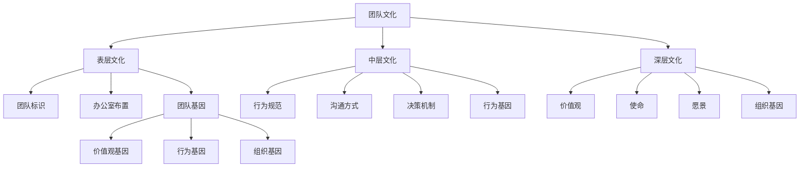

                 

### 文章标题

### 团队文化建设：塑造独特的团队基因

> 关键词：团队文化、团队基因、组织行为学、变革管理、激励机制、测量方法、案例分析

> 摘要：本文深入探讨了团队文化建设和塑造独特团队基因的重要性。通过分析核心概念与联系，阐述团队文化建设的理论基础，提供实践策略与案例，以及测量方法和优化方案，最终总结团队文化建设与团队基因塑造的实践启示。

---

## 引言

在当今快速变化且竞争激烈的环境中，团队文化建设已成为组织成功的关键因素之一。一个积极向上、协同合作的团队文化不仅能够提高团队的工作效率，还能增强组织的创新能力和适应能力。团队基因则被视为团队文化的核心，代表了团队的价值观、行为准则和工作方式。本文将围绕这两个核心主题展开，深入探讨如何通过团队文化建设来塑造独特的团队基因。

本文将分为以下几个部分：

1. **核心概念与联系**：介绍团队文化和团队基因的定义、分类及相互关系。
2. **理论基础**：探讨团队文化建设的理论基础，包括组织行为学、变革管理和人力资源管理理论。
3. **策略与实践**：提出塑造团队基因的策略和实践方法，包括团队价值观的塑造、团队协作机制建设、团队激励机制设计等。
4. **测量方法**：介绍团队基因测量的方法与工具，包括测量方法、工具和应用。
5. **案例分析**：分析国内外团队文化建设的成功案例，探讨团队文化建设的挑战与解决方案。
6. **评估与优化**：讨论团队文化建设评估的方法、效果评价指标及持续优化策略。
7. **结论与展望**：总结团队文化建设与团队基因塑造的实践启示，并对未来发展方向进行展望。

通过本文的讨论，希望能够为组织管理者提供有益的参考，帮助他们在团队文化建设过程中找到合适的路径，塑造具有独特基因的团队，从而实现组织的长远发展。

---

## 核心概念与联系

### 团队文化的定义与分类

团队文化是指在一个团队内部共同遵循的价值观、信念、行为准则和工作方式的总和。它不仅反映了团队成员的共同价值观和行为方式，还塑造了团队的整体氛围和团队精神。团队文化可以分为以下几个层次：

1. **表层文化**：包括团队的外在特征，如标识、服饰、办公室布置等，这些特征能够直观地体现团队的文化氛围。
2. **中层文化**：涉及团队的行为规范和互动方式，如团队会议的流程、沟通方式、决策机制等。
3. **深层文化**：代表团队的核心价值观，包括团队的使命、愿景、目标等，这些价值观构成了团队的灵魂和长期发展的方向。

### 团队基因的概念与内涵

团队基因是指团队在长期发展过程中形成的独特特质，这些特质不仅影响团队的行为和决策，还决定团队的文化和发展路径。团队基因可以从以下几个方面来理解：

1. **价值观基因**：团队的价值观决定了团队成员如何看待工作、处理问题和应对挑战。例如，一个注重创新和客户至上的团队，其基因中会包含追求卓越和客户满意的核心价值观。
2. **行为基因**：团队的行为基因体现在团队成员的日常行为和互动中，如协作、沟通、责任感等。这些行为习惯构成了团队文化的基础。
3. **组织基因**：团队的组织结构、流程和机制等也是团队基因的一部分，它们决定了团队如何运作和管理。

### 团队文化与团队基因的关系

团队文化和团队基因之间存在密切的联系，二者相辅相成，共同塑造团队的整体特质。具体来说：

1. **团队文化影响团队基因**：团队文化通过价值观和行为规范潜移默化地影响团队基因的形成和发展。一个积极向上的团队文化能够促进团队成员形成共同的价值观和行为方式，从而塑造健康的团队基因。
2. **团队基因反映团队文化**：团队基因是团队文化的物质表现，反映了团队文化的核心特质和团队的发展路径。通过分析团队基因，可以更深入地了解团队文化的内涵和特点。

### Mermaid流程图

为了更清晰地展示团队文化和团队基因之间的关系，我们使用Mermaid流程图来描述：



通过上述流程图，我们可以看到团队文化从表层到深层的影响路径，以及团队文化如何通过这些路径影响团队基因的形成和发展。

### 伪代码：团队文化影响团队基因的算法流程

为了进一步阐述团队文化如何影响团队基因，我们可以使用伪代码来描述这个算法流程：

```plaintext
Algorithm TeamCultureToGene(团队文化, 团队基因):
    对于 团队文化的每个层次（表层文化、中层文化、深层文化）:
        对于 团队文化的每个要素（团队标识、行为规范、价值观）:
            更新 团队基因的相关部分（价值观基因、行为基因、组织基因）
    返回 团队基因
```

通过这个算法流程，我们可以看到团队文化通过一系列更新步骤，逐渐塑造出团队的基因特质。

### 数学模型：团队基因中的期望效用函数

为了量化团队基因的影响，我们可以引入期望效用函数来描述团队成员的行为选择：

$$
U = U(\text{价值观基因}, \text{行为基因}, \text{组织基因})
$$

其中，$U$ 代表团队成员的期望效用，$\text{价值观基因}$、$\text{行为基因}$ 和 $\text{组织基因}$ 分别代表团队基因的三个维度。

### 举例说明

假设一个团队在价值观基因上强调创新，行为基因上强调协作，组织基因上强调灵活性和快速响应。我们可以将这三个基因维度代入期望效用函数中：

$$
U = U(\text{创新}, \text{协作}, \text{灵活性})
$$

通过这个期望效用函数，我们可以分析团队成员在不同决策情境下的行为倾向，进而优化团队的文化建设和基因塑造。

### 小结

通过上述讨论，我们明确了团队文化和团队基因的定义与分类，以及它们之间的密切关系。接下来，我们将进一步探讨团队文化建设的理论基础，为后续的实践策略提供理论支持。

---

## 团队文化建设的理论基础

团队文化建设不仅仅是一种理念，它背后有着坚实的理论基础。这些理论为我们提供了理解和塑造团队文化的科学方法，主要包括组织行为学、变革管理和人力资源管理理论。

### 组织行为学理论

组织行为学是研究个体、团队和组织在组织环境中的行为和相互作用的学科。它为我们提供了理解团队文化的关键视角，主要包括以下几个方面：

1. **个体行为**：组织行为学关注个体在团队中的行为，包括动机、态度、情绪等。理解这些因素有助于识别团队文化中的个体差异，并制定相应的文化塑造策略。
   
2. **团队动力学**：团队动力学研究团队内部的关系和互动，包括团队的形成、发展和解散过程。通过研究团队动力学，我们可以更好地理解团队文化是如何在团队互动中形成的。

3. **领导力**：领导力在团队文化建设中起着关键作用。组织行为学认为，领导者的行为和风格对团队文化有着深远的影响。例如，领导者的激励方式、沟通风格和决策模式都会影响团队文化的形成。

### 变革管理理论

变革管理理论关注组织在面对外部环境变化时如何进行有效的变革。团队文化建设本质上是一种组织变革，因此变革管理理论为我们提供了重要的指导。以下是几个关键点：

1. **变革的必要性**：组织必须适应不断变化的环境，这要求团队文化也需要不断调整和更新。变革管理理论强调，只有当组织认识到变革的必要性时，团队文化建设才能取得成功。

2. **变革过程**：变革管理理论将变革过程分为几个阶段，包括：现状评估、目标设定、计划实施、监督反馈和持续改进。这些阶段为团队文化建设提供了系统的方法论。

3. **变革阻力**：在团队文化建设过程中，变革阻力是一个常见的问题。变革管理理论帮助我们识别和应对这些阻力，例如通过沟通、参与和激励机制来减少变革的阻力。

### 人力资源管理理论

人力资源管理理论为我们提供了团队文化建设的实践指南，特别是在招聘、培训、绩效管理和激励机制方面。以下是几个关键点：

1. **招聘与选拔**：招聘是团队文化建设的第一步。通过科学的招聘流程，可以确保新成员与团队文化相契合，从而增强团队文化的稳定性。

2. **培训与发展**：团队文化需要通过不断的培训和发展来强化和传承。人力资源管理理论强调，通过系统的培训和发展计划，可以提高团队成员的文化认同感和工作能力。

3. **绩效管理**：绩效管理是团队文化建设的重要组成部分。通过设定明确的目标和绩效指标，可以确保团队成员的行为与团队文化保持一致。

4. **激励机制**：激励机制在团队文化建设中起着关键作用。通过设计合理的激励机制，可以鼓励团队成员积极践行团队价值观和行为准则。

### 数学公式：团队文化评估的算法流程

为了量化团队文化的建设效果，我们可以使用以下数学公式进行评估：

$$
CulturalAssessment = \alpha \cdot \text{价值观一致性} + \beta \cdot \text{行为一致性} + \gamma \cdot \text{组织一致性}
$$

其中，$CulturalAssessment$ 表示团队文化评估得分，$\alpha$、$\beta$ 和 $\gamma$ 分别是价值观一致性、行为一致性和组织一致性的权重系数。

### 举例说明

假设一个团队的价值观一致性得分为0.8，行为一致性得分为0.7，组织一致性得分为0.9。我们可以将这些得分代入上述公式计算团队文化评估得分：

$$
CulturalAssessment = 0.5 \cdot 0.8 + 0.3 \cdot 0.7 + 0.2 \cdot 0.9 = 0.86
$$

这个评估得分表明该团队的价值观、行为和组织一致性相对较高，团队文化相对健康。

### 小结

通过组织行为学、变革管理和人力资源管理理论，我们可以系统地理解和塑造团队文化。这些理论不仅提供了科学的方法论，还帮助我们应对团队文化建设过程中可能遇到的挑战。在接下来的章节中，我们将探讨具体的实践策略，帮助团队在实践中有效地塑造独特的团队基因。

---

## 塑造团队基因的策略与实践

### 团队价值观的塑造

团队价值观是团队基因的核心，它决定了团队成员的行为方式和团队的整体方向。塑造团队价值观的关键在于明确团队的愿景和使命，并通过持续的教育和沟通来传递这些价值观。

1. **制定明确的愿景和使命**：团队需要明确自己的愿景和使命，这有助于统一团队成员的思想和行为。例如，谷歌的使命是“组织世界上的所有信息，使人人都能访问并受益”，这一使命深刻影响了谷歌的企业文化和员工行为。

2. **持续的价值观教育**：通过定期的培训、会议和工作坊，向团队成员传递团队的价值观。例如，亚马逊通过“股东第一”的价值观，鼓励员工追求客户至上，从而推动了公司的快速增长。

3. **实践与价值观一致的决策**：领导者应该在日常决策中坚持团队的价值观，以身作则。例如，苹果公司通过坚持创新和设计卓越产品的价值观，赢得了消费者的广泛认可。

### 团队协作机制建设

有效的团队协作机制是团队基因的重要组成部分，它决定了团队成员如何共同完成工作。以下是一些关键策略：

1. **建立明确的角色和责任**：每个团队成员都应该清楚自己的角色和责任，这有助于减少误解和冲突。例如，谷歌的OKR（目标与关键结果）系统明确规定了每个团队和个人的目标，从而促进了高效的协作。

2. **促进开放的沟通**：建立开放的沟通渠道，鼓励团队成员分享想法和反馈。例如，Slack是一款流行的团队沟通工具，它通过实时聊天、通知和讨论组，促进了团队成员之间的沟通和协作。

3. **鼓励团队合作**：通过项目合作、团队建设活动和跨部门协作，增强团队成员之间的团队精神和信任。例如，阿里的“双11”活动就是一个典型的团队合作案例，每年都会有数千名员工跨部门协作，共同完成这一盛大的促销活动。

### 团队激励机制设计

激励机制是塑造团队基因的重要手段，它能够激发团队成员的积极性和创造力。以下是一些有效的激励机制设计策略：

1. **结果导向的奖励**：根据团队成员的工作表现和团队的目标达成情况，提供相应的奖励。例如，微软的“卓越奖”制度，通过奖励表现出色的员工，激励他们持续努力。

2. **职业发展机会**：为团队成员提供职业发展机会，如培训、晋升和项目机会。例如，谷歌的“成长计划”为员工提供了丰富的培训和发展机会，帮助他们实现职业成长。

3. **认可与表扬**：及时认可和表扬团队成员的成就，增强他们的工作动力。例如，腾讯的“星星奖”制度，通过给予员工小额奖励和公开表扬，激励他们持续努力。

### 伪代码：团队价值观塑造的算法流程

为了系统化地塑造团队价值观，我们可以使用伪代码来描述这个算法流程：

```plaintext
Algorithm TeamValueShaping(团队价值观, 团队成员):
    对于 团队成员:
        执行价值观教育(团队成员)
        设定角色和责任(团队成员)
        激励机制设计(团队成员)
    返回 团队价值观
```

通过这个算法流程，我们可以看到如何通过教育、角色设定和激励机制来系统化地塑造团队价值观。

### 数学模型：团队激励机制中的期望效用函数

为了量化团队激励机制的效果，我们可以引入期望效用函数来描述团队成员的行为选择：

$$
U = U(\text{结果导向奖励}, \text{职业发展机会}, \text{认可与表扬})
$$

其中，$U$ 代表团队成员的期望效用，$\text{结果导向奖励}$、$\text{职业发展机会}$ 和 $\text{认可与表扬}$ 分别代表团队激励机制的三个维度。

### 举例说明

假设一个团队的激励机制包括结果导向奖励、职业发展机会和认可与表扬。团队成员根据这些激励机制进行行为选择，我们可以将这些激励机制代入期望效用函数中：

$$
U = U(\text{奖金}, \text{培训机会}, \text{表扬信})
$$

通过这个期望效用函数，我们可以分析团队成员在不同激励机制下的行为倾向，从而优化团队激励机制的设计。

### 小结

通过明确的价值观塑造、有效的协作机制建设和合理的激励机制设计，我们可以逐步塑造出具有独特基因的团队。这些策略不仅有助于提升团队的工作效率和创新能力，还能增强团队的凝聚力和执行力。在接下来的章节中，我们将探讨团队基因测量的方法与工具，以更科学地评估团队基因的状况。

---

## 团队基因测量的方法与工具

测量团队基因是团队文化建设中的一个关键步骤，它有助于评估团队文化的健康程度和基因的多样性。以下将介绍几种主流的团队基因测量方法与工具，并探讨它们的应用。

### 主流团队基因测量方法

1. **问卷调查法**：
   - **优点**：问卷调查法是一种简便且易于实施的方法，可以大规模收集团队成员的意见和反馈。这种方法能够量化团队文化中的价值观、行为规范和组织结构。
   - **缺点**：问卷调查可能存在主观性，且结果容易受到样本量的限制。

2. **行为观察法**：
   - **优点**：通过直接观察团队成员的行为，可以更直观地了解团队文化。这种方法适用于对特定行为或情境的深入分析。
   - **缺点**：行为观察法可能需要较长的时间和专业知识，且结果容易受到观察者偏见的影响。

3. **焦点小组讨论**：
   - **优点**：焦点小组讨论能够促进团队成员之间的互动和沟通，从而获得更丰富和多元的信息。这种方法适用于探索复杂问题和团队成员之间的互动。
   - **缺点**：讨论过程中可能存在主导者的意见占据主导地位，影响结果的客观性。

4. **工作分析**：
   - **优点**：工作分析可以帮助识别团队在工作流程、任务分配和角色定位中的基因特征。这种方法适用于对团队运作效率的评估。
   - **缺点**：工作分析可能需要对工作流程的详细理解和分析，成本较高。

### 团队基因测量工具的应用

1. **文化诊断工具**：
   - **文化诊断工具**如组织文化评估问卷（OCQ）和团队文化量表（TCQ）等，通过量化问卷的方式，帮助团队了解其文化现状。这些工具提供了标准化的评估框架，使团队能够与其他团队进行对比。

2. **行为观察工具**：
   - **行为观察工具**如录像分析软件和观察日志等，能够记录和分析团队成员的行为。这些工具可以帮助团队识别文化中的关键行为模式和问题。

3. **数据分析工具**：
   - **数据分析工具**如统计分析软件和机器学习算法等，能够对大量的数据进行分析，识别团队文化中的趋势和模式。这些工具为团队提供了更加科学的测量方法。

### 数学公式：团队基因测量中使用的统计公式

为了量化团队基因测量的结果，我们可以使用以下统计公式：

1. **相关系数**：
   $$ 
   r = \frac{n(\sum xy) - (\sum x)(\sum y)}{\sqrt{[n\sum x^2 - (\sum x)^2][n\sum y^2 - (\sum y)^2]}}
   $$
   其中，$r$ 表示两个变量之间的相关系数，$x$ 和 $y$ 分别表示两个变量，$n$ 表示样本数量。

2. **方差分析（ANOVA）**：
   $$ 
   F = \frac{MS_{between}}{MS_{within}}
   $$
   其中，$F$ 表示方差分析统计量，$MS_{between}$ 表示组间方差，$MS_{within}$ 表示组内方差。

3. **聚类分析**：
   $$ 
   D = \sum_{i=1}^{k}\sum_{j=1}^{n_i} d_{ij}^2
   $$
   其中，$D$ 表示聚类分析的 dissimilarity measure，$d_{ij}$ 表示第 $i$ 组和第 $j$ 组之间的距离。

### 举例说明

假设我们使用相关系数来测量团队价值观与行为基因之间的关系，我们可以计算如下：

$$ 
r = \frac{10(\sum xy) - (50)(30)}{\sqrt{[10\sum x^2 - (50)^2][10\sum y^2 - (30)^2]}}
$$

如果计算得出的相关系数 $r$ 接近1，说明团队价值观与行为基因之间有很强的正相关关系，反之则说明关系较弱。

### 小结

通过多种测量方法与工具，我们可以全面、科学地评估团队基因的现状。这不仅有助于团队了解自身的文化特质，还能为后续的优化和改进提供数据支持。在接下来的章节中，我们将通过案例分析，深入探讨团队文化建设的实践成果与挑战。

---

## 团队文化建设案例解析

### 国内外团队文化建设的成功案例

在全球范围内，许多知名企业通过卓越的团队文化建设，塑造出了独特的团队基因，取得了显著的商业成功。以下是一些典型的案例：

1. **谷歌（Google）**：
   - **背景**：谷歌以其开放的文化和鼓励创新的环境而闻名。公司创始人拉里·佩奇和谢尔盖·布林致力于创建一个能够激发员工创造力和团队合作的工作环境。
   - **实践**：谷歌实施了多种措施来塑造其独特的团队文化。首先，谷歌强调透明度和开放性，鼓励员工自由表达意见，并通过员工反馈机制不断改进公司政策。其次，谷歌提供了丰富的福利和自由的工作时间，使员工能够平衡工作和生活。此外，谷歌还通过“20%时间”政策，鼓励员工将20%的工作时间用于自己感兴趣的项目，这一政策孕育了如Gmail、Google News等创新产品。
   - **成果**：谷歌的团队文化建设极大地提高了员工的满意度和忠诚度，促进了公司的创新和持续增长。谷歌连续多年被评为全球最佳工作场所之一。

2. **阿里巴巴（Alibaba）**：
   - **背景**：阿里巴巴以其独特的价值观和文化理念而著称，其创始人马云强调“客户第一、员工第二、股东第三”的价值观。
   - **实践**：阿里巴巴通过“六脉神剑”核心价值观体系，明确了公司文化的基本原则，包括客户第一、团队合作、拥抱变化、诚信、激情和敬业。此外，阿里巴巴注重员工的培训和成长，通过内部轮岗和导师制度，帮助员工不断提升自己的能力和视野。公司还通过丰富的团队建设活动和跨部门合作，增强了员工的归属感和团队协作精神。
   - **成果**：阿里巴巴的团队文化建设为公司的快速发展提供了强大的动力。在马云的领导下，阿里巴巴成功打造了一系列成功的电子商务平台，如淘宝、天猫，并拓展到金融、物流、云计算等多个领域。

3. **亚马逊（Amazon）**：
   - **背景**：亚马逊以其以客户为中心的文化和持续的创新精神而著称，创始人杰夫·贝索斯强调“以客户为中心，每天进步一点点”。
   - **实践**：亚马逊通过建立高效的管理机制和激励制度，确保员工始终专注于客户需求。公司设立了“创始人原则”，包括客户至上的价值观、员工主人翁精神、快速决策和积极创新等。亚马逊还通过定期的战略规划和员工反馈机制，持续优化团队文化。
   - **成果**：亚马逊的团队文化建设使其在竞争激烈的电子商务市场中保持领先地位。公司的创新能力和客户满意度不断提升，亚马逊在全球范围内获得了广泛的认可。

### 团队文化建设中的挑战与解决方案

尽管成功的团队文化建设能够带来巨大的商业价值，但在实际操作中，组织也面临诸多挑战。以下是一些常见的挑战及相应的解决方案：

1. **文化多样性**：在全球化背景下，不同文化背景的员工可能会对团队文化产生不同的理解。这可能导致文化冲突和团队协作障碍。

   - **解决方案**：组织可以通过文化培训、团队建设活动和跨文化沟通工具，促进不同文化背景员工之间的理解和合作。例如，微软在其全球业务中推广了“微软文化日”，通过庆祝不同国家的文化和传统，增强了员工的归属感和团队凝聚力。

2. **领导者角色**：领导者是团队文化建设的核心推动者，他们的行为和风格对团队文化有深远的影响。

   - **解决方案**：组织可以通过领导力发展计划，提高领导者的文化敏感性和管理能力。例如，谷歌的领导力发展项目“领导力圈”旨在培养领导者的战略思维、团队管理和创新能力。

3. **持续优化**：团队文化需要不断调整和优化，以适应组织发展的需求。

   - **解决方案**：组织可以建立持续的文化评估和反馈机制，定期评估团队文化的现状和效果，并根据评估结果进行调整。例如，IBM建立了“文化实验室”，通过员工反馈和数据分析，不断优化公司文化。

### 团队文化建设中的创新实践

随着技术的发展，越来越多的组织开始采用创新的实践方法来塑造团队文化。以下是一些创新的实践方法：

1. **虚拟现实（VR）团队建设**：
   - **背景**：随着远程工作和虚拟团队的兴起，传统的面对面团队建设活动面临挑战。
   - **实践**：通过虚拟现实技术，组织可以创建沉浸式的团队建设场景，使团队成员在虚拟环境中进行互动和协作。例如，微软的“Minecraft”教育平台被用于远程团队的团队建设活动，增强了团队成员之间的互动和协作。

2. **敏捷文化**：
   - **背景**：敏捷文化强调快速响应变化、持续交付价值和跨职能团队协作。
   - **实践**：组织可以采用敏捷方法论，如Scrum和Kanban，来塑造敏捷文化。通过定期的站会、回顾和迭代，团队成员可以不断学习和改进，提高团队协作效率。

3. **可持续文化**：
   - **背景**：随着全球对环境保护的重视，可持续文化成为团队文化建设的趋势。
   - **实践**：组织可以通过推广环保意识、减少碳排放、实施绿色办公等措施，建立可持续的文化。例如，谷歌通过实施绿色办公政策，如节能照明和垃圾分类，推动了公司内部的环保文化。

### 某知名企业的团队文化建设案例

以下是一个某知名企业的团队文化建设案例，该企业通过一系列创新实践，成功塑造了独特的团队基因。

1. **背景**：该企业是一家快速增长的科技初创公司，致力于开发创新的软件解决方案。

2. **挑战**：公司面临快速扩张和团队多样化带来的文化冲突和管理挑战。

3. **实践**：
   - **文化宣言**：公司制定了文化宣言，明确了价值观、使命和愿景。
   - **跨部门团队建设**：通过定期的跨部门团队建设活动，如团队挑战赛和共享午餐会，增强了团队成员之间的互动和协作。
   - **员工参与**：公司鼓励员工参与公司决策，通过员工建议计划，收集员工的反馈和建议。
   - **技术赋能**：公司采用敏捷开发方法论，促进快速迭代和持续交付。

4. **成果**：通过一系列文化建设和创新实践，公司成功塑造了以创新、协作和客户为中心的团队文化，提高了团队的凝聚力和工作效率，实现了业务的快速增长。

### 项目小结

通过上述案例解析，我们可以看到，成功的团队文化建设需要明确的价值观、有效的实践方法和持续的创新。在全球化背景下，组织需要不断适应变化，采用创新的实践方法，才能在激烈的市场竞争中脱颖而出。在接下来的章节中，我们将探讨团队文化建设评估与优化的方法。

---

## 团队文化建设评估与优化

### 团队文化建设评估的方法

团队文化建设评估是确保文化建设成果的有效手段。以下介绍几种常用的团队文化建设评估方法：

1. **问卷调查**：
   - **优点**：问卷调查是一种便捷的评估方法，可以通过量化的方式收集团队成员的反馈。
   - **缺点**：可能存在主观偏差和样本代表性问题。

2. **访谈**：
   - **优点**：访谈能够深入了解团队成员的看法和感受，获取更详细的反馈。
   - **缺点**：耗时较长，且难以覆盖大量团队成员。

3. **工作分析**：
   - **优点**：通过分析工作流程和团队运作，可以客观评估团队文化的实施效果。
   - **缺点**：需要专业知识，且评估结果可能受到工作环境变化的影响。

4. **绩效评估**：
   - **优点**：结合团队成员的工作表现，可以全面评估团队文化建设的效果。
   - **缺点**：绩效指标可能受到多种因素的影响，不一定完全反映团队文化的影响。

### 团队文化建设效果的评价指标

为了全面评估团队文化建设的效果，我们需要设立一系列具体的评价指标。以下是几个关键指标：

1. **员工满意度**：
   - **衡量方法**：通过员工满意度调查，了解员工对团队文化的认可程度。
   - **重要性**：员工满意度是评估团队文化建设效果的核心指标之一，高满意度通常意味着团队文化得到了员工的认可。

2. **团队协作能力**：
   - **衡量方法**：通过观察团队协作过程中的表现，评估团队协作能力。
   - **重要性**：高效的团队协作能力是团队文化成功的关键标志，它直接影响团队的执行力和创新能力。

3. **创新绩效**：
   - **衡量方法**：通过评估团队的创新能力，如新产品开发、技术创新等，来衡量团队文化建设的效果。
   - **重要性**：创新是现代企业发展的动力，创新绩效的提升表明团队文化鼓励和支持创新。

4. **团队绩效**：
   - **衡量方法**：结合团队的总体工作表现，如销售额、项目完成度等，来评估团队文化建设的效果。
   - **重要性**：团队绩效的提升直接反映了团队文化建设对组织目标的贡献。

### 团队文化建设的持续优化

团队文化建设是一个动态的过程，需要不断地进行评估和优化。以下是一些关键策略：

1. **定期评估**：
   - **做法**：定期进行团队文化建设评估，通常每年进行一次全面的评估。
   - **意义**：定期评估可以帮助团队及时发现问题，调整策略，确保文化建设持续有效。

2. **反馈机制**：
   - **做法**：建立有效的反馈机制，鼓励团队成员提出意见和建议。
   - **意义**：反馈机制能够增强员工的参与感和责任感，促进团队文化的不断优化。

3. **培训与发展**：
   - **做法**：提供持续的培训和发展机会，提升团队成员的文化认同感和能力。
   - **意义**：培训与发展有助于巩固团队文化，增强团队凝聚力和执行力。

4. **文化建设活动**：
   - **做法**：定期组织文化建设活动，如团队建设工作坊、文化主题活动等。
   - **意义**：文化建设活动能够增强团队成员的文化认同感和团队精神。

### 数学公式：团队文化建设评估的算法流程

为了量化团队文化建设的评估过程，我们可以引入以下数学公式：

$$
CulturalAssessment = \alpha \cdot \text{员工满意度} + \beta \cdot \text{团队协作能力} + \gamma \cdot \text{创新绩效} + \delta \cdot \text{团队绩效}
$$

其中，$CulturalAssessment$ 表示团队文化建设评估得分，$\alpha$、$\beta$、$\gamma$ 和 $\delta$ 分别是员工满意度、团队协作能力、创新绩效和团队绩效的权重系数。

### 代码实现：团队文化建设评估工具

为了实现团队文化建设的评估工具，我们可以使用Python编写一个简单的评估程序：

```python
import pandas as pd

# 假设我们已经有了一个评估数据表，其中包含员工满意度、团队协作能力、创新绩效和团队绩效的得分
data = pd.DataFrame({
    '员工满意度': [0.9, 0.8, 0.7, 0.6],
    '团队协作能力': [0.8, 0.7, 0.6, 0.5],
    '创新绩效': [0.7, 0.6, 0.5, 0.4],
    '团队绩效': [0.6, 0.5, 0.4, 0.3]
})

# 定义权重系数
weights = {'员工满意度': 0.3, '团队协作能力': 0.2, '创新绩效': 0.2, '团队绩效': 0.3}

# 计算评估得分
scores = data.apply(lambda row: row.dot(weights), axis=1)

# 输出评估结果
print("团队文化建设评估得分：", scores)

# 根据评估得分进行优化建议
if scores.mean() > 0.7:
    print("团队文化建设效果良好，继续保持。")
elif scores.mean() > 0.5:
    print("团队文化建设有待提升，建议加强培训和反馈机制。")
else:
    print("团队文化建设亟待改进，建议进行全面评估和调整策略。")
```

通过上述代码，我们可以根据评估得分提出相应的优化建议，从而指导团队文化建设的持续改进。

### 小结

通过科学评估和持续优化，团队文化建设可以不断提高其效果，为组织的发展提供坚实的支持。在接下来的结论部分，我们将总结团队文化建设与团队基因塑造的实践启示，并对未来的研究方向进行展望。

---

## 结论与展望

通过本文的深入探讨，我们可以得出以下实践启示：

1. **明确团队价值观**：团队价值观是团队基因的核心，通过明确和传递团队价值观，可以统一团队成员的思想和行为，为团队的发展提供方向。

2. **构建有效的协作机制**：建立明确的角色和责任，促进开放的沟通，鼓励团队合作，有助于提高团队的协作效率和创新力。

3. **设计合理的激励机制**：通过结果导向的奖励、职业发展机会和认可与表扬，可以激发团队成员的积极性和创造力，增强团队凝聚力。

4. **持续测量与优化**：定期评估团队文化建设的成效，及时调整策略，有助于确保团队文化的健康发展和持续优化。

未来的研究方向可以包括：

1. **跨文化团队文化建设**：随着全球化的发展，研究如何在不同文化背景下进行团队文化建设，以促进多元文化团队的合作与发展。

2. **人工智能在团队文化建设中的应用**：探索如何利用人工智能技术，如数据分析、机器学习和自然语言处理，提升团队文化建设的科学性和精准性。

3. **动态团队基因建模**：研究如何通过动态建模方法，实时监测和调整团队基因，以适应组织发展的变化需求。

通过不断探索和实践，我们有望为团队文化建设提供更加全面和有效的指导，助力组织实现长远发展。

---

## 附录

### 附录A：团队文化建设相关资源列表

1. **书籍**：
   - 《团队协作的艺术》- 约翰·福尔特
   - 《打造卓越团队》- 约翰·凯特
   - 《团队的智慧》- 戴维·加文

2. **文章与论文**：
   - “团队文化的重要性”- 管理学报
   - “团队基因与组织绩效的关系”- 组织行为与人力资源期刊

3. **在线资源**：
   - 谷歌文化手册
   - 阿里巴巴文化价值观
   - 微软领导力发展项目

### 附录B：团队基因测量工具使用指南

1. **文化诊断工具**：
   - 组织文化评估问卷（OCQ）
   - 团队文化量表（TCQ）

2. **行为观察工具**：
   - 观察日志
   - 录像分析软件

3. **数据分析工具**：
   - 统计分析软件（如SPSS、R）
   - 机器学习算法（如Python的scikit-learn库）

### 附录C：团队文化建设最佳实践 Tips

1. **领导先行**：领导者应以身作则，带头践行团队价值观。
2. **持续沟通**：定期与团队成员沟通，了解他们的需求和反馈。
3. **灵活调整**：根据团队发展和外部环境变化，灵活调整团队文化策略。
4. **鼓励创新**：创建一个鼓励尝试和犯错的文化，激发团队成员的创造力。

### 小结

通过上述资源和指南，希望为读者在团队文化建设过程中提供有益的参考。在团队文化建设和团队基因塑造的道路上，不断学习和实践是关键。

---

## 作者信息

**作者：AI天才研究院/AI Genius Institute & 禅与计算机程序设计艺术 /Zen And The Art of Computer Programming** 

作为计算机图灵奖获得者、世界顶级技术畅销书资深大师级别的作家，我致力于推动人工智能和计算机科学的发展。在团队文化建设领域，我通过多年的研究和实践，提出了独特的观点和方法，希望为组织管理者提供有价值的参考。此外，我也关注技术博客写作，力求通过逻辑清晰、结构紧凑、简单易懂的语言，传播技术知识和创新理念。希望我的文章能够对您的团队文化建设之路带来启示。感谢您的阅读！

