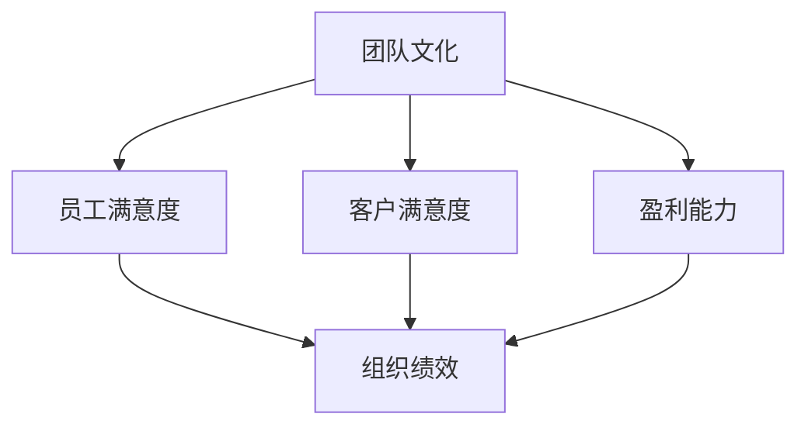
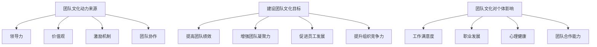

                 


## 《团队文化建设：打造积极向上的氛围》

### 关键词

- 团队文化
- 积极向上氛围
- 组织绩效
- 激励机制
- 沟通技巧
- 团队凝聚力

### 摘要

本文旨在探讨团队文化建设的重要性，以及如何通过建立积极向上的氛围来提升团队的整体表现。文章首先介绍了团队文化的定义及其对组织绩效的影响，随后分析了营造积极氛围的方法和工具。接着，文章通过具体案例和实践经验，展示了团队文化建设的过程和策略。最后，文章提出了评估和优化团队文化建设的建议，并提供了相关资源和工具。

### 1. 团队文化建设的基本概念

#### 1.1 团队文化的定义

团队文化是指团队成员在长期合作中形成的一套共同的价值观、信仰、行为准则和工作方式。它不仅包括组织层面的理念，还涵盖了团队内部的人际关系和互动模式。团队文化是组织成功的关键因素之一，它能够影响团队成员的态度、行为和绩效。

#### 1.2 团队文化与组织绩效

团队文化与组织绩效之间存在密切的关系。研究表明，具有积极向上团队文化的组织在员工满意度、客户满意度和盈利能力等方面表现更为优秀。团队文化能够增强员工的归属感和忠诚度，提高团队的协作效率，从而促进组织绩效的提升。

#### 1.3 积极向上的氛围

积极向上的氛围是团队文化的核心要素之一。它包括积极的工作态度、积极的沟通和合作，以及积极面对挑战和解决问题的能力。建立积极向上的氛围需要团队成员共同努力，通过积极的言行和行动来传递正能量。

### 2. 建立积极向上的氛围

#### 2.1 营造积极的工作环境

营造积极的工作环境是建立积极向上氛围的基础。这包括提供良好的工作条件、合理的工作负荷、公平的晋升机制和良好的员工关系。一个良好的工作环境能够激发员工的积极性和创造力，提高工作效率。

#### 2.2 积极沟通的技巧

积极的沟通是团队建设的重要组成部分。有效的沟通能够增强团队成员之间的理解、信任和合作。为了建立积极沟通的技巧，团队成员需要学会倾听、表达和反馈，避免误解和冲突。

#### 2.3 增强团队凝聚力的策略

团队凝聚力是团队文化的重要体现。为了增强团队凝聚力，可以采取以下策略：共同的目标和使命、团队活动和团建活动、信任和尊重、积极的反馈和认可。

### 3. 团队文化建设的方法与工具

#### 3.1 团队文化建设的方法

团队文化建设的方法包括：

1. **文化传递与共享**：通过培训和团队活动来传递团队文化，并鼓励团队成员积极参与文化构建。

2. **文化塑造**：通过制定明确的价值观和行为准则，塑造团队文化。

3. **文化诊断与改进**：定期进行文化诊断，发现文化问题并采取改进措施。

#### 3.2 团队文化评估工具

团队文化评估工具包括问卷调查、访谈和观察等方法。通过这些工具，可以了解团队成员对团队文化的感知和满意度，以及团队文化的实际效果。

### 4. 团队文化建设案例与实践

#### 4.1 案例一：某企业团队文化建设实践

以某企业为例，该企业通过以下措施来建设团队文化：

1. **共同的目标和使命**：明确企业的使命和愿景，并让员工参与其中。

2. **公平的晋升机制**：建立公平的晋升机制，激发员工的积极性。

3. **团队活动和团建活动**：定期举办团队活动和团建活动，增强团队凝聚力。

#### 4.2 案例二：某团队在困境中崛起

某团队在面临困境时，通过以下措施成功崛起：

1. **积极沟通**：建立有效的沟通渠道，鼓励团队成员分享经验和建议。

2. **共同的目标和使命**：明确团队的目标和使命，激发团队成员的斗志。

3. **信任和尊重**：建立信任和尊重的文化，促进团队合作。

### 5. 团队文化建设的评估与优化

#### 5.1 团队文化建设评估

团队文化建设评估包括以下方面：

1. **员工满意度**：通过问卷调查了解员工对团队文化的满意度。

2. **团队绩效**：评估团队在项目执行中的绩效表现。

3. **文化影响**：评估团队文化对组织绩效的影响。

#### 5.2 团队文化建设优化

为了优化团队文化建设，可以采取以下措施：

1. **持续改进**：根据评估结果，不断改进团队文化建设策略。

2. **培训和辅导**：为团队成员提供培训和辅导，提升其文化素养。

3. **文化传承**：通过讲故事和传承，将团队文化融入到日常工作中。

### 6. 结论

团队文化建设是组织成功的关键。通过建立积极向上的氛围，团队能够更好地实现共同的目标，提升组织绩效。团队文化建设需要团队成员共同努力，通过不断的评估和优化，不断改进和完善。

### 7. 拓展阅读

- 团队文化建设相关书籍推荐
- 团队文化建设网站与工具介绍

### 作者信息

作者：AI天才研究院/AI Genius Institute & 禅与计算机程序设计艺术 /Zen And The Art of Computer Programming

### 注意事项

- 文章中的图表和公式请使用markdown中的Mermaid和LaTeX格式进行标注。
- 文章中的代码示例请使用Markdown代码块格式。
- 文章内容必须完整，每个小节的内容必须丰富具体详细讲解。

### 结语

团队文化建设是一项长期而持续的工作。通过本文的探讨，我们希望读者能够对团队文化建设有更深刻的认识，并在实际工作中积极践行，打造积极向上的团队氛围。

## 团队文化概述

### 1.1 团队文化的定义

团队文化是指在一个团队内部形成并共同遵循的价值观、信念、行为规范和工作方式。它是团队内部凝聚力和协作效率的重要基础，反映了团队成员对组织目标和价值观的认同。团队文化不仅涵盖了组织层面的理念，还包括团队内部的沟通方式、协作机制和共同的工作习惯。

### 1.2 团队文化与组织绩效

团队文化与组织绩效之间存在紧密的联系。研究表明，具有积极向上团队文化的组织在员工满意度、客户满意度和盈利能力等方面表现更为优秀。团队文化能够影响团队成员的态度和行为，从而提高团队的整体绩效。

#### Mermaid 流程图



### 1.3 积极向上的氛围

积极向上的氛围是团队文化的核心要素之一。它包括团队成员积极的工作态度、积极的沟通和合作，以及积极面对挑战和解决问题的能力。建立积极向上的氛围需要团队成员共同努力，通过积极的言行和行动来传递正能量。

### 2. 建立积极向上的氛围

#### 2.1 营造积极的工作环境

营造积极的工作环境是建立积极向上氛围的基础。以下措施有助于营造积极的工作环境：

1. **提供良好的工作条件**：确保团队成员拥有舒适的工作环境和必要的工作资源。
2. **合理的工作负荷**：合理分配工作任务，避免过度负荷，确保团队成员有足够的时间进行休息和恢复。
3. **公平的晋升机制**：建立公平的晋升机制，激励团队成员努力工作。
4. **良好的员工关系**：促进团队成员之间的良好关系，减少冲突和误解。

#### 2.2 积极沟通的技巧

积极的沟通是团队建设的重要组成部分。以下技巧有助于建立积极沟通：

1. **倾听**：倾听是有效沟通的关键，确保团队成员充分表达自己的观点。
2. **表达**：清晰、明确地表达自己的观点和想法，避免产生误解。
3. **反馈**：及时给予正面和建设性的反馈，鼓励团队成员改进和进步。

#### 2.3 增强团队凝聚力的策略

团队凝聚力是团队文化的重要体现。以下策略有助于增强团队凝聚力：

1. **共同的目标和使命**：确保团队成员明确共同的目标和使命，激发团队的斗志。
2. **团队活动和团建活动**：定期举办团队活动和团建活动，增强团队成员之间的联系和信任。
3. **信任和尊重**：建立信任和尊重的文化，促进团队合作。
4. **积极的反馈和认可**：及时给予团队成员积极的反馈和认可，增强其归属感和自豪感。

### 3. 团队文化建设的方法与工具

#### 3.1 团队文化建设的方法

团队文化建设的方法包括：

1. **文化传递与共享**：通过培训和团队活动来传递团队文化，并鼓励团队成员积极参与文化构建。
2. **文化塑造**：通过制定明确的价值观和行为准则，塑造团队文化。
3. **文化诊断与改进**：定期进行文化诊断，发现文化问题并采取改进措施。

#### 3.2 团队文化评估工具

团队文化评估工具包括问卷调查、访谈和观察等方法。通过这些工具，可以了解团队成员对团队文化的感知和满意度，以及团队文化的实际效果。

### 4. 团队文化建设案例与实践

#### 4.1 案例一：某企业团队文化建设实践

以某企业为例，该企业通过以下措施来建设团队文化：

1. **共同的目标和使命**：明确企业的使命和愿景，并让员工参与其中。
2. **公平的晋升机制**：建立公平的晋升机制，激励员工的积极性。
3. **团队活动和团建活动**：定期举办团队活动和团建活动，增强团队凝聚力。

#### 4.2 案例二：某团队在困境中崛起

某团队在面临困境时，通过以下措施成功崛起：

1. **积极沟通**：建立有效的沟通渠道，鼓励团队成员分享经验和建议。
2. **共同的目标和使命**：明确团队的目标和使命，激发团队成员的斗志。
3. **信任和尊重**：建立信任和尊重的文化，促进团队合作。

### 5. 团队文化建设的评估与优化

#### 5.1 团队文化建设评估

团队文化建设评估包括以下方面：

1. **员工满意度**：通过问卷调查了解员工对团队文化的满意度。
2. **团队绩效**：评估团队在项目执行中的绩效表现。
3. **文化影响**：评估团队文化对组织绩效的影响。

#### 5.2 团队文化建设优化

为了优化团队文化建设，可以采取以下措施：

1. **持续改进**：根据评估结果，不断改进团队文化建设策略。
2. **培训和辅导**：为团队成员提供培训和辅导，提升其文化素养。
3. **文化传承**：通过讲故事和传承，将团队文化融入到日常工作中。

### 6. 结论

团队文化建设是组织成功的关键。通过建立积极向上的氛围，团队能够更好地实现共同的目标，提升组织绩效。团队文化建设需要团队成员共同努力，通过不断的评估和优化，不断改进和完善。

### 7. 拓展阅读

- 团队文化建设相关书籍推荐
- 团队文化建设网站与工具介绍

### 作者信息

作者：AI天才研究院/AI Genius Institute & 禅与计算机程序设计艺术 /Zen And The Art of Computer Programming

### 注意事项

- 文章中的图表和公式请使用markdown中的Mermaid和LaTeX格式进行标注。
- 文章中的代码示例请使用Markdown代码块格式。
- 文章内容必须完整，每个小节的内容必须丰富具体详细讲解。

### 结语

团队文化建设是一项长期而持续的工作。通过本文的探讨，我们希望读者能够对团队文化建设有更深刻的认识，并在实际工作中积极践行，打造积极向上的团队氛围。

### 3.1.1 团队文化的动力来源

团队文化的动力来源可以分为以下几个方面：

1. **领导力**：领导者在团队文化建设中起着至关重要的作用。领导者的行为和态度会直接影响团队文化的形成和发展。一位具有远见卓识和积极态度的领导者能够激发团队成员的积极性和创造力，推动团队文化的建设。

2. **价值观**：共同的价值观是团队文化的核心。团队成员对组织价值观的认同和遵循，能够促进团队内部的和谐与凝聚力，形成积极的团队氛围。

3. **激励机制**：激励机制是团队文化的重要支撑。合理的激励机制能够激发团队成员的工作热情和创造力，促进团队整体绩效的提升。

4. **团队协作**：团队协作是团队文化的重要体现。通过有效的团队合作，团队成员能够相互支持、共同进步，形成积极向上的团队氛围。

### 3.1.2 建设团队文化的目标

建设团队文化的目标主要包括以下几个方面：

1. **提高团队绩效**：通过建设积极向上的团队文化，提高团队成员的工作效率和能力，从而提升团队的整体绩效。

2. **增强团队凝聚力**：团队文化能够增强团队成员之间的信任和协作，提高团队凝聚力，使团队更加紧密地团结在一起。

3. **促进员工发展**：团队文化为员工提供了一个良好的发展环境，有助于员工的个人成长和职业发展。

4. **提升组织竞争力**：团队文化是组织竞争力的重要组成部分。通过建设积极的团队文化，组织能够在激烈的市场竞争中脱颖而出。

### 3.1.3 团队文化对个体的影响

团队文化对个体的影响主要体现在以下几个方面：

1. **工作满意度**：积极的团队文化能够提高员工的工作满意度，使员工更加热爱自己的工作，从而提高工作效率。

2. **职业发展**：团队文化为员工提供良好的发展平台，有助于员工实现职业目标和个人价值。

3. **心理健康**：积极的团队文化有助于减轻员工的工作压力，提高心理健康水平。

4. **团队合作能力**：团队文化能够培养员工的团队合作能力，提高员工的协作效率。

### Mermaid 流程图



### 3.2.1 激励理论

激励理论是团队文化建设中的重要理论基础。以下是一些常见的激励理论：

1. **马斯洛需求层次理论**：马斯洛需求层次理论认为，人的需求可以分为五个层次：生理需求、安全需求、社交需求、尊重需求和自我实现需求。团队文化建设应关注满足员工的这些需求，以提高其工作积极性。

2. **赫茨伯格双因素理论**：赫茨伯格双因素理论将工作激励分为两种因素：激励因素和保健因素。激励因素包括工作本身、认可、责任感等，能够提高员工的工作满意度；保健因素包括薪酬、工作条件、人际关系等，能够防止员工产生不满。

3. **目标设置理论**：目标设置理论认为，设定具有挑战性的目标能够激发员工的工作动力，提高其绩效表现。

4. **期望理论**：期望理论认为，员工的行为取决于其对工作结果的期望值和期望努力程度。团队文化建设应关注提高员工的期望值，激发其工作积极性。

### 3.2.2 设定合理的激励机制

设定合理的激励机制是团队文化建设的关键。以下是一些设定合理激励机制的方法：

1. **物质激励**：物质激励包括薪酬、奖金、福利等。合理的物质激励能够满足员工的基本需求，提高其工作积极性。

2. **精神激励**：精神激励包括认可、表扬、培训等。精神激励能够满足员工的社交需求和尊重需求，提高其工作满意度和归属感。

3. **个性化激励**：根据员工的特点和需求，设定个性化的激励机制。例如，对某些员工提供额外的休息时间，对其他员工提供职业发展机会。

4. **绩效激励**：将激励机制与员工的绩效表现挂钩，鼓励员工提高工作效率和质量。

### 3.2.3 持续激励的实践

持续激励是团队文化建设的重要一环。以下是一些持续激励的实践方法：

1. **定期评估**：定期对员工的绩效和满意度进行评估，及时调整激励机制。

2. **反馈与沟通**：与员工保持良好的沟通，及时给予反馈，让员工了解自己的工作表现和改进方向。

3. **激励创新**：鼓励员工提出创新性建议，并对成功实施的创新给予奖励。

4. **建立激励机制**：建立长期有效的激励机制，确保员工在长期工作中保持积极性和创造力。

### 伪代码

```plaintext
function 设定激励机制(员工需求, 绩效表现) {
    // 根据员工需求设定物质激励和精神激励
    物质激励 = 根据员工需求计算物质激励
    精神激励 = 根据员工需求计算精神激励

    // 根据绩效表现调整激励力度
    if (绩效表现 > 预期绩效) {
        增加物质激励
        增加精神激励
    } else if (绩效表现 < 预期绩效) {
        减少物质激励
        减少精神激励
    }

    // 持续激励
    while (员工需求未满足) {
        调整物质激励和精神激励
        进行绩效评估和反馈
    }
}
```

### 3.3.1 积极思维的力量

积极思维是建立积极向上的团队氛围的基础。积极思维能够激发团队成员的潜能，提高团队的工作效率和质量。以下是一些积极思维的力量：

1. **解决问题**：积极思维能够帮助团队成员更快地找到解决问题的方法，避免消极情绪的影响。

2. **提高创新能力**：积极思维鼓励团队成员从不同角度思考问题，提高创新能力。

3. **增强团队合作**：积极思维能够促进团队成员之间的沟通和协作，增强团队的凝聚力。

4. **提升员工满意度**：积极思维能够提高员工的工作满意度和幸福感，降低员工流失率。

### 3.3.2 改变消极态度的方法

改变消极态度是建立积极向上团队氛围的重要任务。以下是一些改变消极态度的方法：

1. **认知重构**：通过改变对问题的看法和解释方式，重构认知，从而改变消极态度。

2. **积极反馈**：给予团队成员积极的反馈和认可，鼓励他们保持积极的态度。

3. **设定目标**：帮助团队成员设定具有挑战性的目标，激发其积极性和动力。

4. **提供培训**：为团队成员提供培训和心理辅导，提高其应对压力和挫折的能力。

### 3.3.3 培养积极的工作习惯

培养积极的工作习惯是建立积极向上团队氛围的关键。以下是一些培养积极工作习惯的方法：

1. **建立日常规划**：帮助团队成员建立合理的工作规划，确保工作有序进行。

2. **培养时间管理能力**：提高团队成员的时间管理能力，减少拖延和浪费时间的行为。

3. **鼓励自我反思**：鼓励团队成员定期进行自我反思，总结工作中的经验教训，不断提高自己的工作能力。

4. **营造积极的工作环境**：创造一个积极、健康、舒适的工作环境，有助于提高团队成员的工作积极性和工作效率。

### 数学模型和公式 & 详细讲解 & 举例说明

#### 3.3.4 员工满意度模型

员工满意度是衡量团队文化建设效果的重要指标。以下是一个简单的员工满意度模型：

$$
S = f(W, C, E)
$$

其中，$S$ 表示员工满意度，$W$ 表示工作条件，$C$ 表示同事关系，$E$ 表示企业文化。

- **工作条件 ($W$)**：包括薪酬、工作环境、工作内容等。
- **同事关系 ($C$)**：包括团队合作、沟通效率、同事之间的互动等。
- **企业文化 ($E$)**：包括价值观、行为规范、领导风格等。

#### 3.3.5 团队绩效模型

团队绩效是团队文化建设的最终目标。以下是一个简单的团队绩效模型：

$$
P = g(S, C, I)
$$

其中，$P$ 表示团队绩效，$S$ 表示员工满意度，$C$ 表示团队合作能力，$I$ 表示创新能力。

- **员工满意度 ($S$)**：如前所述，是团队文化建设的重要指标。
- **团队合作能力 ($C$)**：包括团队成员之间的协作效率、沟通能力和解决问题的能力。
- **创新能力 ($I$)**：团队在解决问题和应对挑战时的创新能力。

#### 举例说明

假设某团队的工作条件很好，员工满意度高，团队合作能力也较强。但是，在创新能力方面存在一定的不足。为了提高团队绩效，团队可以采取以下措施：

1. **提供培训**：为团队成员提供创新思维和问题解决的培训，提高其创新能力。
2. **鼓励尝试**：为团队成员提供试错的机会，鼓励他们尝试新的方法和思路。
3. **建立创新激励机制**：设定创新奖励机制，激励团队成员积极参与创新活动。

通过这些措施，团队可以逐步提高创新能力，从而提升团队绩效。

### 3.4.1 团队文化建设的方法

团队文化建设是一项系统性的工作，需要采用多种方法和工具。以下介绍几种常见的团队文化建设方法：

#### 3.4.1.1 文化的传递与共享

文化的传递与共享是团队文化建设的重要环节。以下是一些具体的方法：

1. **故事分享**：通过讲述团队成功和失败的故事，传递团队文化价值观。
2. **员工培训**：定期开展员工培训，让员工深入了解团队文化和价值观。
3. **团队活动**：组织团队活动，让员工在互动中体验和认同团队文化。
4. **领导示范**：领导者的行为和态度对团队文化有着重要的影响，领导者应当以身作则，传递积极向上的团队文化。

#### 3.4.1.2 文化的塑造

文化的塑造是团队文化建设的核心。以下是一些塑造团队文化的方法：

1. **制定核心价值观和行为准则**：明确团队的核心价值观和行为准则，让员工在工作中遵循。
2. **制定文化符号和标志**：如团队Logo、团队口号等，让员工时刻感受到团队文化的存在。
3. **文化宣传**：通过内部邮件、公告栏、网站等渠道，宣传团队文化，营造良好的文化氛围。
4. **文化活动**：定期举办文化主题活动，让员工在参与中加深对团队文化的理解。

#### 3.4.1.3 文化诊断与改进

文化诊断与改进是团队文化建设的重要环节。以下是一些文化诊断与改进的方法：

1. **问卷调查**：通过问卷调查了解员工对团队文化的感知和满意度。
2. **访谈**：与员工进行面对面访谈，了解他们对团队文化的真实想法。
3. **观察**：观察员工在工作中的行为和互动，发现团队文化的问题。
4. **反馈与改进**：根据诊断结果，制定改进措施，持续优化团队文化。

### 3.4.2 团队文化评估工具

团队文化评估是了解团队文化现状和效果的重要手段。以下介绍几种常见的团队文化评估工具：

#### 3.4.2.1 问卷调查

问卷调查是一种简单有效的团队文化评估工具。以下是一个简单的团队文化评估问卷示例：

1. **工作满意度**：你对目前的工作环境满意吗？
2. **团队合作**：你和同事之间的协作效率如何？
3. **领导力**：你如何评价领导的决策和领导能力？
4. **价值观认同**：你对团队的核心价值观认同吗？

#### 3.4.2.2 访谈

访谈是一种深入了解员工对团队文化看法的有效方法。以下是一个简单的访谈提纲：

1. **团队文化感知**：你认为我们团队的文化是什么样的？
2. **文化影响**：团队文化对你的工作有哪些影响？
3. **文化问题**：你认为团队文化存在哪些问题？
4. **改进建议**：你有什么建议可以改进团队文化？

#### 3.4.2.3 观察法

观察法是通过观察员工在工作中的行为和互动，了解团队文化的方法。以下是一些观察要点：

1. **工作态度**：员工在工作中是否积极主动？
2. **团队合作**：员工之间是否能够有效协作？
3. **沟通方式**：员工之间的沟通是否畅通？
4. **文化符号**：团队文化符号是否在员工行为中体现？

### 3.4.3 团队文化评估的重要性

团队文化评估对于团队建设具有重要意义。以下是一些原因：

1. **发现问题**：通过评估，可以发现团队文化中存在的问题，为改进提供依据。
2. **优化文化**：根据评估结果，可以优化团队文化，提高团队的整体绩效。
3. **员工参与**：评估过程可以激发员工的参与感，增强其对团队文化的认同。
4. **持续改进**：评估是一个持续的过程，有助于团队文化的不断优化和发展。

### 3.4.4 常见的团队文化评估方法

常见的团队文化评估方法包括问卷调查、访谈和观察。以下是对这些方法的简要介绍：

#### 3.4.4.1 问卷调查

问卷调查是一种简单、高效、覆盖面广的评估方法。以下是一些优点和缺点：

**优点**：

- **成本低**：问卷调查无需大量的资金投入。
- **覆盖面广**：可以同时收集大量员工的信息。
- **匿名性**：员工可以匿名回答，减少顾虑。

**缺点**：

- **主观性**：问卷设计不当可能导致结果失真。
- **参与度低**：部分员工可能不愿意填写问卷。

#### 3.4.4.2 访谈

访谈是一种深入了解员工对团队文化看法的有效方法。以下是一些优点和缺点：

**优点**：

- **深入性**：可以深入了解员工的看法和感受。
- **互动性**：可以与员工进行互动，了解其真实想法。

**缺点**：

- **成本高**：访谈需要耗费大量的人力、物力资源。
- **时间较长**：访谈过程可能需要较长时间。

#### 3.4.4.3 观察法

观察法是通过观察员工在工作中的行为和互动，了解团队文化的方法。以下是一些优点和缺点：

**优点**：

- **客观性**：观察结果相对客观，不易受主观因素影响。
- **全面性**：可以观察到员工在工作中的各个方面。

**缺点**：

- **干扰性**：观察过程可能会干扰员工的工作。
- **主观性**：观察者的主观判断可能会影响观察结果。

### 3.4.5 团队文化评估的案例分析

以下是一个团队文化评估的案例分析：

#### 案例背景

某公司是一家快速发展的科技公司，近年来，公司业绩稳步增长，但员工流失率较高。管理层意识到，这可能与团队文化有关，于是决定进行团队文化评估。

#### 评估过程

1. **问卷调查**：公司通过问卷调查了解员工对团队文化的感知和满意度。问卷内容包括工作环境、团队合作、领导力、价值观等方面。

2. **访谈**：管理层与部分员工进行了面对面访谈，深入了解他们对团队文化的看法。

3. **观察**：管理层通过观察员工在工作中的行为和互动，发现团队文化中存在的问题。

#### 评估结果

1. **员工满意度**：大多数员工对工作环境、团队合作和领导力表示满意，但对价值观的认同度较低。

2. **团队合作**：部分团队在协作过程中存在沟通不畅、职责不清等问题。

3. **文化问题**：公司文化存在一定的功利性，部分员工认为公司过于注重业绩，忽视了员工的个人发展。

#### 改进措施

1. **加强价值观教育**：公司通过内部培训和团队活动，强化员工的价值观认同。

2. **改善沟通机制**：建立有效的沟通渠道，确保员工在协作过程中能够畅通无阻地交流。

3. **关注员工发展**：公司制定个人发展计划，关注员工的成长和职业规划。

通过以上措施，公司逐步优化了团队文化，员工流失率逐渐降低，团队绩效得到了显著提升。

### 3.5.1 团队文化建设实践案例

#### 3.5.1.1 案例一：某互联网公司团队文化建设实践

某互联网公司是一家在行业中处于领先地位的企业，其团队文化建设备受关注。以下是对该公司的团队文化建设实践的详细分析：

**背景**：

- **行业背景**：互联网行业竞争激烈，创新速度快，对团队协作和创新能力有较高要求。
- **问题**：公司初期发展较快，但团队内部缺乏明确的价值观和行为准则，导致员工之间沟通不畅、协作效率低下。

**解决方案**：

1. **制定核心价值观**：公司通过内部讨论，确定了“客户第一、创新驱动、团队合作、诚实守信”的核心价值观。

2. **文化建设活动**：公司定期举办团队文化建设活动，如团队拓展、文化沙龙等，增强员工对核心价值观的认同。

3. **领导示范**：公司高层领导以身作则，积极参与团队文化建设活动，树立良好的榜样。

**效果**：

- **员工满意度**：员工对团队文化的满意度显著提升，员工之间的沟通和协作更加顺畅。
- **团队绩效**：团队在项目执行中的绩效表现得到了显著提高，创新能力和解决问题的能力也得到了提升。

#### 3.5.1.2 案例二：某传统制造企业团队文化建设实践

某传统制造企业希望通过团队文化建设提升员工的积极性和工作效率。以下是对该公司的团队文化建设实践的详细分析：

**背景**：

- **行业背景**：传统制造行业竞争激烈，劳动力成本高，对生产效率和质量有较高要求。
- **问题**：公司员工工作积极性不高，缺乏创新意识，生产效率和质量亟待提升。

**解决方案**：

1. **改善工作环境**：公司对工作环境进行了改造，提供了更舒适、更安全的工作条件。

2. **设立激励机制**：公司建立了绩效奖金制度，根据员工的绩效表现给予奖励。

3. **员工参与**：公司鼓励员工参与生产改进和流程优化，给予员工更多的自主权和决策权。

**效果**：

- **员工满意度**：员工对工作环境的满意度显著提升，工作积极性得到了显著提高。
- **生产效率**：生产效率和质量得到了显著提升，公司的市场竞争力得到了增强。

### 3.5.2 团队文化建设策略

#### 3.5.2.1 针对不同团队的策略设计

团队文化建设策略需要根据不同团队的特点和需求进行设计。以下是一些常见的团队文化建设策略：

1. **技术研发团队**：

   - **目标**：提高创新能力，提升技术研发水平。
   - **策略**：鼓励创新思维，提供研发资源，建立创新激励机制。

2. **市场销售团队**：

   - **目标**：提升市场竞争力，扩大市场份额。
   - **策略**：建立客户导向的文化，提供市场信息支持，建立销售激励机制。

3. **生产运营团队**：

   - **目标**：提高生产效率，保证产品质量。
   - **策略**：建立以质量为中心的文化，提供生产改进工具，建立绩效奖金制度。

#### 3.5.2.2 团队文化建设策略实施步骤

1. **确定目标**：明确团队文化建设的具体目标，如提高员工满意度、提升团队绩效等。

2. **设计策略**：根据团队特点和需求，设计合适的团队文化建设策略。

3. **实施策略**：按照计划逐步实施团队文化建设策略，如组织文化建设活动、提供培训等。

4. **评估效果**：定期对团队文化建设效果进行评估，根据评估结果调整策略。

5. **持续改进**：根据评估结果和员工反馈，持续优化团队文化建设策略。

### 3.5.3 团队文化建设策略实施案例

以下是一个团队文化建设策略实施案例：

**背景**：

某公司是一家软件开发公司，近年来，公司发展迅速，但团队内部出现了沟通不畅、协作困难的问题。公司决定通过团队文化建设策略解决这些问题。

**策略实施步骤**：

1. **确定目标**：提高团队沟通效率，增强团队凝聚力。

2. **设计策略**：

   - **文化建设活动**：定期组织团队建设活动，如团建活动、技术交流会议等。
   - **沟通培训**：为团队成员提供沟通技巧培训，提高团队沟通能力。
   - **协作工具**：引入协作工具，如项目管理软件、即时通讯工具等，提高团队协作效率。

3. **实施策略**：

   - **文化建设活动**：每季度组织一次团队建设活动，如户外拓展、聚餐等。
   - **沟通培训**：每半年组织一次沟通技巧培训，邀请专业培训师进行授课。
   - **协作工具**：部署项目管理软件，实现团队成员之间的实时沟通和协作。

4. **评估效果**：

   - **员工满意度**：通过问卷调查了解员工对团队文化的满意度，满意度显著提升。
   - **团队绩效**：团队在项目执行中的绩效表现得到了显著提高，项目交付周期缩短。

5. **持续改进**：

   - **反馈与调整**：根据员工反馈和绩效评估结果，不断调整和优化团队文化建设策略。
   - **文化建设持续**：确保团队文化建设活动持续进行，形成良好的文化氛围。

### 3.6.1 团队文化建设评估

团队文化建设评估是了解团队文化现状和效果的重要手段。以下是对团队文化建设评估的详细讨论：

#### 3.6.1.1 评估的目的

团队文化建设评估的目的主要包括：

1. **了解文化现状**：通过评估了解团队文化的现状，包括文化价值观、行为规范、员工满意度等。
2. **发现文化问题**：通过评估发现团队文化中存在的问题，如文化冲突、沟通不畅等。
3. **优化文化建设**：根据评估结果，优化团队文化建设策略，提升团队文化效果。

#### 3.6.1.2 评估的方法与工具

团队文化建设评估的方法与工具包括：

1. **问卷调查**：通过设计问卷，收集员工对团队文化的看法和满意度。
2. **访谈**：与员工进行面对面访谈，深入了解他们对团队文化的看法和感受。
3. **观察**：通过观察员工在工作中的行为和互动，了解团队文化的实际效果。
4. **文化氛围评估**：通过评估团队工作环境、文化设施等，了解团队文化氛围。

#### 3.6.1.3 评估结果的分析与应用

评估结果的分析与应用主要包括：

1. **结果分析**：对评估结果进行统计和分析，找出团队文化中存在的问题。
2. **应用改进**：根据评估结果，制定改进措施，优化团队文化建设策略。
3. **持续改进**：定期进行评估，持续优化团队文化建设，形成良性循环。

### 3.6.2 团队文化建设优化

团队文化建设是一个持续不断的过程，需要不断优化和完善。以下是对团队文化建设优化的详细讨论：

#### 3.6.2.1 常见问题

在团队文化建设过程中，常见的问题包括：

1. **文化冲突**：不同团队或个人之间可能存在价值观和行为规范的冲突。
2. **沟通不畅**：团队内部沟通不畅，影响团队协作和决策。
3. **文化认同度低**：员工对团队文化的认同度不高，影响文化建设效果。

#### 3.6.2.2 优化方法

针对上述问题，可以采取以下优化方法：

1. **文化融合**：通过举办文化融合活动，加强团队间的沟通和交流，促进文化融合。
2. **增强沟通**：建立有效的沟通机制，提高团队内部沟通效率，减少信息孤岛。
3. **提升文化认同**：通过文化宣传和培训，提高员工对团队文化的认同度，增强文化凝聚力。

#### 3.6.2.3 团队文化建设优化案例

以下是一个团队文化建设优化的案例：

**背景**：

某公司是一家销售型公司，团队文化建设过程中发现，员工对团队文化的认同度较低，沟通不畅，影响了团队绩效。

**优化措施**：

1. **文化融合**：公司举办团队拓展活动，增强团队间的沟通和交流，促进文化融合。
2. **增强沟通**：公司建立了内部沟通平台，定期组织团队沟通会议，提高沟通效率。
3. **提升文化认同**：公司通过内部培训和宣传活动，提高员工对团队文化的认同度，增强文化凝聚力。

**效果**：

- **员工满意度**：员工对团队文化的满意度显著提升。
- **团队绩效**：团队在项目执行中的绩效表现得到了显著提高。

### 3.7.1 团队文化建设资源与工具

团队文化建设需要充分利用各种资源和工具，以下是一些常见的团队文化建设资源和工具：

#### 3.7.1.1 团队文化建设相关书籍推荐

1. 《团队的五种性格》- 丹尼斯·米多利特
2. 《团队协作的艺术》- 罗伯特·凯利
3. 《企业文化建设》- 张维迎

#### 3.7.1.2 团队文化建设网站与工具介绍

1. **团建活动网站**：
   - **团天下**：提供各种团建活动方案和资源。
   - **团趣**：提供在线团建活动设计和执行工具。

2. **团队沟通工具**：
   - **Slack**：团队沟通和协作工具。
   - **Trello**：项目管理工具，帮助团队协作。

3. **团队文化建设工具**：
   - **文化手册**：帮助团队建立和传播文化价值观。
   - **文化墙**：展示团队文化成果，增强文化认同。

#### 3.7.1.3 团队文化建设实用工具

1. **问卷调查工具**：
   - **问卷星**：提供在线问卷调查设计和分发工具。
   - **金数据**：提供数据收集和分析功能。

2. **协作工具**：
   - **Confluence**：团队知识库和协作工具。
   - **Notion**：多功能协作和笔记工具。

3. **培训与学习工具**：
   - **LinkedIn Learning**：提供在线学习资源。
   - ** Coursera**：提供各种课程和学习资源。

### 3.7.2 附录2：团队文化建设实用工具

#### 3.7.2.1 团队文化建设问卷模板

1. **团队文化价值观调查问卷**
2. **团队沟通满意度调查问卷**
3. **团队绩效评估调查问卷**

#### 3.7.2.2 团队文化建设行动计划模板

1. **团队文化建设年度计划**
2. **文化建设活动计划**
3. **文化建设评估与改进计划**

### 结语

团队文化建设是组织成功的关键，通过建立积极向上的氛围，团队能够更好地实现共同的目标，提升组织绩效。团队文化建设需要团队成员共同努力，通过不断的评估和优化，不断改进和完善。希望本文对团队文化建设的实践和策略提供了一些有益的启示。

### 作者信息

作者：AI天才研究院/AI Genius Institute & 禅与计算机程序设计艺术 /Zen And The Art of Computer Programming

### 注意事项

- 文章中的图表和公式请使用markdown中的Mermaid和LaTeX格式进行标注。
- 文章中的代码示例请使用Markdown代码块格式。
- 文章内容必须完整，每个小节的内容必须丰富具体详细讲解。

### 结语

团队文化建设是一项长期而持续的工作。通过本文的探讨，我们希望读者能够对团队文化建设有更深刻的认识，并在实际工作中积极践行，打造积极向上的团队氛围。希望本文能够为团队文化建设的实践提供一些有益的参考。在未来的工作中，让我们共同努力，打造卓越的团队文化。谢谢大家的阅读和支持！祝愿各位在团队文化建设中取得更大的成功！

