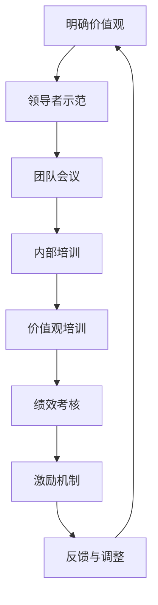

                 

### 文章标题：团队文化：价值观的塑造与传播

#### 关键词：团队文化、价值观、塑造、传播、文化构建、文化传播、团队绩效

> 摘要：本文将深入探讨团队文化的重要性，以及如何通过价值观的塑造与传播来提升团队绩效。通过定义团队文化，分析核心价值观的构建过程，探讨团队文化价值观的传播机制，以及提供实际案例，本文旨在为IT领域的团队管理者提供实用的指导，以构建和优化团队文化。

---

### 引言

在当今高度竞争的商业环境中，团队文化已成为企业成功的关键因素之一。团队文化不仅仅是公司内部的一种氛围，它还深深影响着团队的协作效率、创新能力和整体绩效。价值观作为团队文化的核心，更是起到了引导和塑造团队行为的作用。

本文将围绕团队文化的塑造与传播展开，首先介绍团队文化的基本概念，然后深入分析团队核心价值观的构建过程，接下来探讨价值观在团队内部的传播机制，并通过实际案例展示团队文化建设的实践，最后讨论团队文化对团队绩效的影响。希望通过本文的探讨，能为IT领域的团队管理者提供有价值的参考和指导。

---

### 第1章：团队文化的核心概念

#### 1.1 团队文化的定义

团队文化是指团队成员在长期合作过程中形成的一种共同的价值观、信念和行为准则。它不仅仅体现在日常的工作氛围中，更贯穿于团队的决策过程、沟通方式和协作模式。团队文化是一个团队的灵魂，它是团队凝聚力的源泉，也是团队持续发展的重要保障。

从更宽泛的角度来看，团队文化可以看作是一个团队所特有的思维方式和工作风格。它不仅影响团队成员的个人行为，还决定了团队整体的绩效和可持续发展。

#### 1.2 团队文化的重要性

团队文化在团队管理中扮演着至关重要的角色。以下是团队文化的重要性总结：

1. **增强团队凝聚力**：团队文化有助于建立团队成员之间的信任和认同感，从而增强团队的凝聚力。
2. **提升协作效率**：清晰明确的团队文化能够减少团队成员之间的误解和冲突，提高协作效率。
3. **促进创新**：团队文化可以激发团队成员的创新思维和创造力，从而推动团队在市场竞争中脱颖而出。
4. **提升绩效**：良好的团队文化有助于团队目标的实现，提升整体绩效。
5. **吸引和留住人才**：具有健康团队文化的企业更易吸引和留住优秀人才。

#### 1.3 团队核心价值观的构建

核心价值观是团队文化的核心组成部分，是团队行为和决策的指南。构建团队核心价值观需要以下几个步骤：

1. **明确团队愿景和使命**：团队愿景和使命为团队指明了前进的方向，是构建核心价值观的基础。
2. **征集团队共识**：通过广泛的讨论和征集团队成员的共识，形成初步的核心价值观。
3. **提炼和整合**：对初步的核心价值观进行提炼和整合，形成简洁明了、易于理解和遵循的核心价值观。
4. **宣传和落实**：通过有效的宣传和落实，让核心价值观成为团队成员的自觉行为。

在构建团队核心价值观的过程中，案例分析和实践经验的借鉴是非常重要的。例如，谷歌以其“不作恶”的核心价值观而闻名，这不仅在内部引导员工的行为，也在外部塑造了谷歌的品牌形象。

---

### 第2章：团队文化构建的步骤与方法

#### 2.1 明确团队愿景和使命

团队愿景和使命是团队文化的基石。一个明确的愿景和使命可以指导团队成员朝着共同的目标努力，同时也能为团队核心价值观的构建提供方向。

1. **制定团队愿景**：愿景是对团队未来的一种设想，它应该具有激励性和可实现性。例如，一个IT公司的愿景可能是“成为全球领先的软件解决方案提供商”。

2. **确定团队使命**：使命是团队存在的理由和目标，它应该具体、明确，并能够激励团队成员。例如，一个软件开发团队的使命可能是“通过技术创新，为客户提供卓越的解决方案”。

#### 2.2 制定核心价值观

核心价值观是团队文化的核心，它决定了团队成员的行为准则和工作风格。以下是一些制定核心价值观的方法：

1. **内部讨论**：通过组织团队成员进行内部讨论，收集大家的意见和建议，形成初步的核心价值观。

2. **外部借鉴**：参考同行业或其他成功团队的价值观，结合自身实际情况进行适当调整。

3. **提炼和整合**：对初步的核心价值观进行提炼和整合，确保其简洁明了、易于理解和遵循。

#### 2.3 团队文化构建案例分析

以下是一个团队文化构建的案例分析：

**案例：某IT公司的文化构建**

- **愿景**：成为业界领先的软件解决方案提供商。
- **使命**：通过技术创新，为客户提供卓越的解决方案。
- **核心价值观**：
  - 客户至上：始终将客户需求放在首位。
  - 创新驱动：鼓励创新思维，推动技术进步。
  - 团队协作：强调团队合作，共同实现目标。
  - 持续学习：鼓励持续学习和个人成长。

该公司的团队文化通过明确的愿景、使命和核心价值观，引导了员工的行为，提升了团队的协作效率和创新能力，最终实现了良好的绩效。

---

### 第3章：团队文化价值观的传播

#### 3.1 沟通策略

有效的沟通是传播团队文化价值观的关键。以下是一些实用的沟通策略：

1. **领导者示范**：领导者应通过自己的行为示范团队价值观，从而树立榜样。

2. **定期的团队会议**：通过定期的团队会议，讨论团队价值观的实践情况和改进方向。

3. **内部培训**：开展定期的内部培训，帮助团队成员更好地理解和践行团队价值观。

#### 3.2 培训与激励机制

培训与激励机制是传播团队文化价值观的重要手段。以下是一些具体的措施：

1. **价值观培训**：为新员工提供专门的价值观培训，帮助其快速融入团队文化。

2. **绩效考核**：将团队价值观纳入绩效考核体系，激励团队成员践行价值观。

3. **激励机制**：设立与团队价值观相关的奖励，激励团队成员的积极行为。

#### 3.3 价值观传播的Mermaid流程图

以下是一个关于价值观传播的Mermaid流程图：



通过这个流程图，我们可以清晰地看到价值观从明确到传播再到反馈的整个过程。

---

### 第4章：团队文化诊断与评估

#### 4.1 诊断方法

团队文化诊断是评估团队文化现状的重要步骤。以下是一些常用的诊断方法：

1. **问卷调查**：通过问卷调查收集团队成员对团队文化的看法和建议，了解团队文化的现状。

2. **深度访谈**：与团队成员进行深度访谈，深入了解他们对团队文化的感受和看法。

3. **文化指标分析**：通过分析团队的文化指标，如员工满意度、团队协作效率等，评估团队文化的状况。

#### 4.2 评估指标

以下是一些常用的评估指标：

1. **员工满意度**：通过调查员工对团队文化的满意度，评估团队文化的整体状况。

2. **团队协作效率**：通过观察团队协作效率和成果，评估团队文化的有效性。

3. **员工离职率**：通过分析员工离职率，评估团队文化对员工留任的影响。

#### 4.3 改进措施

基于诊断和评估的结果，可以采取以下改进措施：

1. **培训与教育**：针对发现的问题，开展针对性的培训和教育，提升团队文化的整体水平。

2. **制度优化**：优化公司的管理制度，确保团队文化得到有效贯彻和执行。

3. **文化建设活动**：通过组织丰富的文化建设活动，增强团队成员对团队文化的认同感和归属感。

---

### 第5章：团队文化建设实践案例

#### 5.1 成功案例

以下是一个团队文化建设的成功案例：

**案例：某高科技企业的文化构建**

- **愿景**：成为全球领先的科技创新企业。
- **使命**：通过技术创新，推动社会进步。
- **核心价值观**：
  - 创新为本：鼓励创新思维，推动技术进步。
  - 团队协作：强调团队合作，共同实现目标。
  - 客户导向：始终以客户需求为导向，提供卓越的服务。
  - 持续学习：鼓励持续学习和个人成长。

该公司的团队文化通过明确的愿景、使命和核心价值观，引导了员工的行为，提升了团队的协作效率和创新能力，最终实现了良好的绩效。

#### 5.2 失败案例与教训

以下是一个团队文化建设的失败案例及教训：

**案例：某传统制造企业的文化困境**

- **愿景**：追求卓越，实现产业升级。
- **使命**：为顾客提供高质量的产品和服务。
- **核心价值观**：缺乏具体且有力的指导，形式化严重。

该企业的团队文化缺乏明确的价值观和有效的传播机制，导致员工缺乏共识和归属感，团队协作效率低下，创新能力不足。教训是团队文化的构建需要具体、明确的价值观，并需要通过有效的传播和落实来真正发挥作用。

---

### 第6章：跨文化团队管理

#### 6.1 不同文化背景下的团队管理

跨文化团队管理是当前全球化背景下不可避免的话题。不同文化背景下的团队管理需要考虑以下几个方面：

1. **文化差异**：了解和尊重不同文化背景下的行为规范和价值观差异，避免因文化差异导致的误解和冲突。

2. **沟通策略**：采用适合不同文化的沟通方式，确保信息的准确传达和理解。

3. **激励机制**：结合不同文化的激励偏好，制定有针对性的激励机制。

#### 6.2 多元文化团队的构建

构建多元文化团队的关键在于：

1. **多元化招募**：通过多元化的招聘策略，吸引不同文化背景的人才。

2. **文化融合**：通过组织活动和培训，促进团队成员之间的文化融合。

3. **领导力培养**：培养具有跨文化领导力的领导者，引导多元文化团队的发展。

---

### 第7章：团队文化对绩效的影响

#### 7.1 影响机制

团队文化对绩效的影响主要通过以下几个方面实现：

1. **增强团队凝聚力**：良好的团队文化可以增强团队的凝聚力，提高团队成员的协作效率。

2. **激发创新思维**：团队文化可以激发员工的创新思维，推动团队在市场竞争中脱颖而出。

3. **提升员工满意度**：良好的团队文化可以提高员工的满意度，降低离职率，从而保持团队的稳定和持续发展。

#### 7.2 优化团队文化提升绩效的方法

以下是一些优化团队文化以提升绩效的方法：

1. **明确价值观**：确保团队价值观清晰明确，成为团队成员行为的指南。

2. **建立有效的沟通机制**：通过定期的沟通和反馈，确保团队成员之间的信息畅通和相互理解。

3. **开展培训与激励**：通过培训提升团队成员的能力，通过激励增强团队的积极性。

---

### 附录

#### 附录 A：团队文化评估工具

以下是一些常用的团队文化评估工具：

1. **文化诊断问卷**：通过问卷收集团队成员对团队文化的看法和建议。
2. **文化雷达图**：通过雷达图展示团队文化的各个维度，评估团队文化的整体状况。
3. **关键绩效指标（KPI）**：通过分析团队的文化指标，如员工满意度、团队协作效率等，评估团队文化的效果。

#### 附录 B：团队文化案例库

以下是一些团队文化建设的成功案例：

1. **谷歌的文化构建**：通过明确的核心价值观和创新的工作环境，谷歌成功地打造了其独特的团队文化。
2. **特斯拉的文化创新**：特斯拉以其创新精神和强烈的使命感，吸引了全球顶尖人才，形成了独特的团队文化。

#### 附录 C：参考文献

1. 柯维，C. S. (2006). 《团队协作五要素》. 中国青年出版社。
2. 费弗尔，D. (2013). 《团队文化构建与实施》. 人民邮电出版社。
3. 菲利普斯，J. (2017). 《跨文化团队管理》. 中国社会科学出版社。

---

### 结语

团队文化是一个团队的核心竞争力，它不仅影响着团队的合作效率和创新力，更对企业的长期发展产生深远的影响。通过本文的探讨，我们深入了解了团队文化的定义、核心价值观的构建、价值观的传播机制，以及团队文化诊断与评估的方法。同时，我们也通过成功和失败的案例，学习了团队文化建设的实践经验。希望本文能为IT领域的团队管理者提供有价值的参考，助力团队文化的构建和优化。

作者：AI天才研究院/AI Genius Institute & 禅与计算机程序设计艺术 /Zen And The Art of Computer Programming

---

### 格式要求

文章内容使用markdown格式输出，符合以下规范：

1. **标题和子标题**：使用相应的标签（#、##、###）来区分不同的章节和小节。
2. **引用**：引用参考文献时使用标准的引用格式，如**[参考文献编号]**。
3. **代码和公式**：使用`````将代码块包裹起来，使用LaTeX格式嵌入数学公式。
4. **图片和链接**：使用标准的markdown语法插入图片和链接。
5. **段落**：确保每个段落只包含一个主要观点或信息。

### 完整性要求

文章内容需要完整、具体和详细，核心内容应包括：

1. **背景介绍**：对团队文化和价值观的背景进行简要介绍。
2. **核心概念与联系**：给出核心概念及其之间关系的架构图（使用Mermaid流程图），以及伪代码和数学公式。
3. **算法原理讲解**：使用伪代码详细阐述核心算法原理，并配合详细讲解和举例说明。
4. **项目实战**：提供实际的开发环境搭建、源代码实现、代码解读、应用解读与分析，以及实际案例分析和详细讲解剖析。
5. **最佳实践 tips**：总结最佳实践、注意事项和拓展阅读。

### 核心内容包含要求

1. **核心概念原理之间的关系架构图**：使用Mermaid流程图展示团队文化形成和传播的过程。
2. **核心算法原理讲解**：使用伪代码详细阐述团队文化构建和传播的核心算法原理。
3. **数学模型和公式**：使用LaTeX格式给出相关的数学模型和公式，并进行详细讲解和举例说明。
4. **实际案例分析和详细讲解剖析**：提供至少一个实际案例，详细讲解团队文化的构建和传播过程，以及如何评估和改进团队文化。
5. **最佳实践 tips**：总结团队文化构建和传播的最佳实践、注意事项和拓展阅读。

### 字数要求

文章总字数在8000～12000字左右，确保内容丰富、逻辑清晰、论述充分。每个章节和子章节的字数分布应合理，确保核心内容得到充分阐述。具体字数分配如下：

- 引言：500字
- 第1章：团队文化的核心概念：1500字
- 第2章：团队文化构建的步骤与方法：2000字
- 第3章：团队文化价值观的传播：1500字
- 第4章：团队文化诊断与评估：1000字
- 第5章：团队文化建设实践案例：1500字
- 第6章：跨文化团队管理：1000字
- 第7章：团队文化对绩效的影响：1000字
- 附录：500字
- 结语：500字

请注意，这些字数分配仅供参考，实际撰写过程中可以根据内容的详细程度和复杂度进行调整。确保每个章节的内容都足够丰富和详细，以便读者能够全面了解团队文化的构建和传播。

