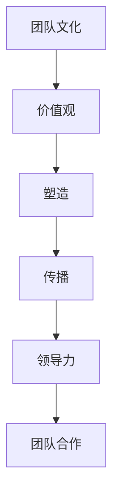

                 

## 《团队文化：价值观的塑造与传播》

### 文章标题

《团队文化：价值观的塑造与传播》

### 关键词

团队文化，价值观，塑造，传播，领导力，团队合作

### 摘要

本文旨在探讨团队文化的核心概念，包括价值观的塑造与传播，以及团队文化对组织绩效的影响。通过分析团队文化的定义、重要性、核心概念和构建传播过程，本文提供了详细的算法原理、数学模型和实际案例，帮助读者理解和掌握如何打造一个积极、高效的团队文化。

### 引言

团队文化，作为企业成功的关键因素之一，其重要性日益凸显。一个具有强大团队文化的组织，能够更好地应对市场变化，提升员工满意度和工作效率，从而实现组织目标的顺利达成。本文将围绕团队文化的核心概念，探讨其价值观的塑造与传播，以帮助读者深入理解并实践有效的团队文化建设。

## 第一步：确定核心概念与联系

在探讨团队文化之前，我们需要明确几个核心概念，并分析它们之间的联系。以下是一些关键概念：

### 1. 团队文化

团队文化是指团队成员共同遵循的价值观、信念、行为规范和工作习惯。它不仅影响团队成员之间的互动，还直接影响组织的整体行为和表现。

### 2. 价值观

价值观是团队文化的核心，它指导团队成员的行为和决策，是团队文化的基石。价值观的塑造与传播是团队文化建设的重中之重。

### 3. 塑造

塑造是指通过一系列行为和机制，将价值观内化为团队成员的共同信念和行为规范。

### 4. 传播

传播是指通过各种途径和手段，将团队文化核心价值观传递给团队成员，使其成为团队共识。

### 5. 领导力

领导力在团队文化的塑造与传播中扮演关键角色。领导者的行为和决策直接影响团队文化的形成和发展。

### 6. 团队合作

团队合作是团队文化的具体体现，它强调团队成员之间的协同工作，共同追求团队目标。

为了更好地展示这些概念之间的联系，我们可以使用 Mermaid 流程图：

## 第二步：设计章节结构

根据核心概念，我们可以将本文分为以下五个部分：

### 1. 引言

介绍团队文化的概念和重要性，以及本文的结构和目的。

### 2. 团队文化的核心概念

详细阐述团队文化、价值观、塑造、传播、领导力和团队合作等核心概念。

### 3. 团队文化的构建

讨论如何塑造和建立团队文化，包括核心原则和实践案例。

### 4. 团队文化的传播

分析如何有效地传播团队文化，包括传播策略、员工参与和文化传播工具。

### 5. 团队文化的实践

分享实际案例，展示团队文化在组织中的实际应用，并探讨团队文化的挑战与未来。

## 第三步：细化每个章节的内容

### 第一步：确定核心概念与联系

在探讨团队文化之前，我们需要明确几个核心概念，并分析它们之间的联系。以下是一些关键概念：

### 1. 团队文化

团队文化是指团队成员共同遵循的价值观、信念、行为规范和工作习惯。它不仅影响团队成员之间的互动，还直接影响组织的整体行为和表现。

### 2. 价值观

价值观是团队文化的核心，它指导团队成员的行为和决策，是团队文化的基石。价值观的塑造与传播是团队文化建设的重中之重。

### 3. 塑造

塑造是指通过一系列行为和机制，将价值观内化为团队成员的共同信念和行为规范。

### 4. 传播

传播是指通过各种途径和手段，将团队文化核心价值观传递给团队成员，使其成为团队共识。

### 5. 领导力

领导力在团队文化的塑造与传播中扮演关键角色。领导者的行为和决策直接影响团队文化的形成和发展。

### 6. 团队合作

团队合作是团队文化的具体体现，它强调团队成员之间的协同工作，共同追求团队目标。

为了更好地展示这些概念之间的联系，我们可以使用 Mermaid 流程图：

### 第二步：设计章节结构

根据核心概念，我们可以将本文分为以下五个部分：

### 1. 引言

介绍团队文化的概念和重要性，以及本文的结构和目的。

### 2. 团队文化的核心概念

详细阐述团队文化、价值观、塑造、传播、领导力和团队合作等核心概念。

### 3. 团队文化的构建

讨论如何塑造和建立团队文化，包括核心原则和实践案例。

### 4. 团队文化的传播

分析如何有效地传播团队文化，包括传播策略、员工参与和文化传播工具。

### 5. 团队文化的实践

分享实际案例，展示团队文化在组织中的实际应用，并探讨团队文化的挑战与未来。

### 第三步：细化每个章节的内容

在细化每个章节的内容时，我们需要确保每个章节都包含核心算法原理讲解、数学模型和数学公式、项目实战等。

### 第一步：细化引言部分

**1.1 团队文化的概念与重要性**

- **团队文化的定义**：
  - 团队文化是团队成员共同遵循的价值观、信念、行为规范和工作习惯的集合。
- **团队文化的重要性**：
  - 提高组织绩效：强大的团队文化能够激发员工的积极性，提高工作效率，从而提升组织整体绩效。
  - 增强团队凝聚力：共同的文化价值观能够增强团队成员之间的信任和协作，提高团队凝聚力。
  - 应对变化：具有强大适应能力的团队文化能够帮助组织更好地应对市场变化和挑战。
- **本文的结构和目的**：
  - 本文将首先介绍团队文化的核心概念，包括价值观、塑造、传播、领导力和团队合作。
  - 接着，本文将探讨如何塑造和建立团队文化，并分析如何有效地传播团队文化。
  - 最后，本文将通过实际案例，展示团队文化在组织中的实际应用，并探讨团队文化的挑战与未来。

### 第二步：细化核心概念部分

**2.1 团队文化的核心概念**

- **团队文化**：
  - 团队文化是团队成员共同遵循的价值观、信念、行为规范和工作习惯的集合。
  - 它不仅是组织内部的一种软实力，也是组织在外部竞争环境中的一张名片。
- **价值观**：
  - 价值观是团队文化的核心，它指导团队成员的行为和决策，是团队文化的基石。
  - 价值观包括诚信、创新、责任、共赢等，不同的价值观会对团队文化的塑造产生深远影响。
- **塑造**：
  - 塑造是指通过一系列行为和机制，将价值观内化为团队成员的共同信念和行为规范。
  - 塑造的过程包括领导者的言行、制度的规范、员工的互动等。
- **传播**：
  - 传播是指通过各种途径和手段，将团队文化核心价值观传递给团队成员，使其成为团队共识。
  - 传播的途径包括内部培训、团队活动、企业文化宣传等。
- **领导力**：
  - 领导力在团队文化的塑造与传播中扮演关键角色。
  - 领导者的行为和决策直接影响团队文化的形成和发展。
- **团队合作**：
  - 团队合作是团队文化的具体体现，它强调团队成员之间的协同工作，共同追求团队目标。
  - 团队合作能够提高团队效率，增强团队凝聚力，是实现组织目标的重要保障。

### 第三步：细化团队文化的构建部分

**3.1 团队文化的构建**

- **构建团队文化的步骤**：
  - **确立核心价值观**：
    - 确立团队的核心价值观，是构建团队文化的第一步。
    - 核心价值观应体现组织的使命、愿景和长期战略，并得到团队成员的广泛认同。
  - **制定行为规范**：
    - 制定明确的行为规范，确保团队成员在行为上有一致的标准。
    - 行为规范应涵盖日常工作中的言行举止、工作态度等。
  - **领导者的示范作用**：
    - 领导者应以身作则，成为团队文化的倡导者和实践者。
    - 领导者的言行将对团队成员产生深远影响，推动团队文化的形成。
  - **制度的保障**：
    - 制度是团队文化的重要保障，通过制度规范来确保团队文化的落实。
    - 包括绩效考核、奖惩机制等，以激励团队成员践行团队文化。
  - **持续优化**：
    - 团队文化不是一成不变的，应随着组织的发展和外部环境的变化进行持续优化。
    - 持续优化有助于保持团队文化的活力，使其更好地适应组织的发展需求。

- **核心原则**：
  - **一致性**：
    - 团队文化应与组织的整体战略和目标保持一致。
    - 一致性有助于增强团队的凝聚力，提高团队的执行力。
  - **参与性**：
    - 在构建团队文化过程中，应充分调动员工的积极性和参与性。
    - 参与性有助于增强员工的归属感和认同感，提高团队文化的执行力。
  - **开放性**：
    - 团队文化应具有开放性，鼓励创新和改进。
    - 开放性有助于保持团队的活力，推动组织的持续发展。

- **实践案例**：
  - **案例一：谷歌的团队文化**：
    - 谷歌以其独特的团队文化而著称，其核心价值观包括“不做坏事”、“追求卓越”等。
    - 谷歌通过内部培训、团队活动等方式，传播其核心价值观，并建立了一系列制度来保障团队文化的落实。
  - **案例二：华为的团队文化**：
    - 华为的团队文化强调“以客户为中心”、“持续创新”等价值观。
    - 华为通过严格的绩效管理和奖惩机制，确保团队文化得到有效执行。

### 第四步：细化团队文化的传播部分

**4.1 团队文化的传播**

- **传播策略**：
  - **内部培训**：
    - 内部培训是传播团队文化的重要途径，通过培训，让团队成员深入了解团队文化的核心价值和行为规范。
  - **团队活动**：
    - 团队活动有助于增强团队成员之间的互动和沟通，是传播团队文化的重要手段。
  - **企业文化宣传**：
    - 企业文化宣传包括内部刊物、网站、内部演讲等多种形式，通过宣传，让团队成员时刻感受到团队文化的氛围。
- **员工参与**：
  - 员工参与是团队文化传播的关键，通过员工参与，可以增强员工对团队文化的认同感和执行力。
  - 员工参与的方式包括：提出改进建议、参与团队文化建设项目、参与内部培训等。
- **文化传播工具**：
  - **企业内网**：
    - 企业内网是传播团队文化的重要平台，可以通过发布文章、视频、图片等形式，传播团队文化。
  - **社交媒体**：
    - 社交媒体是现代传播的重要手段，通过社交媒体，可以更快捷、更广泛地传播团队文化。
  - **实体活动**：
    - 实体活动包括团队建设活动、庆典活动等，通过实体活动，可以增强团队成员之间的凝聚力和归属感。

### 第五步：细化团队文化的实践部分

**5.1 团队文化的实践**

- **成功案例**：
  - **案例一：苹果公司的团队文化**：
    - 苹果公司的团队文化强调创新、卓越和客户至上，这种文化使得苹果公司能够持续推出创新产品，赢得了全球消费者的喜爱。
  - **案例二：亚马逊的团队文化**：
    - 亚马逊的团队文化强调“以客户为中心”，这种文化使得亚马逊能够在电商领域占据领先地位，为客户提供卓越的购物体验。
- **失败案例分析**：
  - **案例一：诺基亚的团队文化**：
    - 诺基亚在团队文化建设方面存在一定的不足，导致公司在智能手机市场的竞争中逐渐落后。
  - **案例二：通用电气的团队文化**：
    - 通用电气的团队文化过于强调短期绩效，忽视了长期发展和创新，导致公司在21世纪初遭遇了严重的业绩下滑。
- **改进建议**：
  - **加强领导力**：
    - 领导者应在团队文化建设中发挥关键作用，通过自身的言行，树立良好的榜样。
  - **增强员工参与**：
    - 应鼓励员工积极参与团队文化建设，让员工感受到自己的价值和作用。
  - **持续优化**：
    - 团队文化不是一成不变的，应随着组织的发展和外部环境的变化进行持续优化。

### 第六步：总结与拓展

- **总结**：
  - 本文通过详细阐述团队文化的核心概念、构建和传播过程，以及实践案例，帮助读者深入理解团队文化的价值和方法。
  - 团队文化对于组织的发展具有重要影响，通过有效的团队文化建设，可以提升组织绩效，增强团队凝聚力，推动组织的持续发展。

- **拓展阅读**：
  - 《企业文化建设实战手册》
  - 《团队协作与领导力》
  - 《组织行为学》

## 附录

### 附录 A：相关术语解释

- **团队文化**：指团队成员共同遵循的价值观、信念、行为规范和工作习惯的集合。
- **价值观**：指团队文化中的核心信念，指导团队成员的行为和决策。
- **塑造**：指通过一系列行为和机制，将价值观内化为团队成员的共同信念和行为规范。
- **传播**：指通过各种途径和手段，将团队文化核心价值观传递给团队成员，使其成为团队共识。
- **领导力**：指领导者通过自身的行为和决策，影响团队成员，推动团队文化建设的力量。
- **团队合作**：指团队成员之间的协同工作，共同追求团队目标。

### 附录 B：团队文化构建工具与资源

- **内部培训**：提供团队文化相关的培训课程，帮助员工理解并践行团队文化。
- **企业文化手册**：编制企业文化手册，详细阐述团队文化的核心价值观和行为规范。
- **内部刊物**：通过内部刊物，传播团队文化的相关内容和成功案例。
- **企业内网**：建立企业内网平台，提供团队文化相关的资料和交流渠道。
- **社交媒体**：利用社交媒体平台，传播团队文化的相关内容，增强员工的归属感和认同感。

### 附录 C：参考文献

- 陈刚. (2018). 《企业文化建设实战手册》. 北京：中国经济出版社.
- 张志宏. (2017). 《团队协作与领导力》. 上海：上海财经出版社.
- 史蒂芬·罗宾斯. (2015). 《组织行为学》. 北京：中国人民大学出版社.

