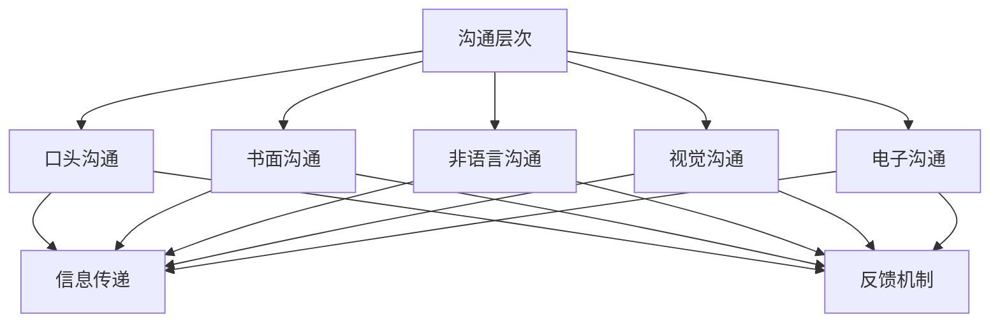

                 


### 文章标题

# 团队沟通技巧：消除误解，增进理解

### 关键词

沟通技巧、误解处理、信任建立、信息共享、冲突解决

### 摘要

本文旨在探讨团队沟通中的关键技巧，以消除误解，增进理解，提高团队效能。通过剖析沟通的基础、误解的产生与处理、信任的建立以及信息共享，本文提供了实用的沟通实践和反思方法，助力团队沟通的优化与提升。

---

### 第一部分：沟通的基础

#### 第1章：沟通的重要性

沟通是团队协作的核心，有效的沟通能够确保团队成员理解彼此的意图，从而实现共同的目标。在信息技术领域，沟通的重要性尤为凸显，因为准确的信息传递是项目成功的关键。

- **核心概念与联系**

  沟通可以分为五个层次：口头、书面、非语言、视觉和电子沟通。每一层次的沟通方式都有其独特的优势和局限性。

  

- **沟通的重要性**

  沟通的重要性在于它能确保信息的准确性、一致性和及时性，从而避免误解和错误。

  - **提高效率**：有效的沟通能够减少重复工作和修正错误的时间，提高工作效率。
  - **增强团队凝聚力**：通过沟通，团队成员能够更好地理解彼此，从而增强团队凝聚力。
  - **促进创新**：开放和坦诚的沟通氛围有助于团队成员提出新的观点和解决方案，促进创新。

#### 1.1 沟通的基本概念

沟通的基本概念包括沟通的目标、沟通的渠道、沟通的反馈机制等。

- **沟通目标**

  沟通的目标是确保信息的准确传递和理解。为了实现这一目标，沟通应具备以下特点：

  - **明确性**：信息应明确、具体，避免模糊不清。
  - **准确性**：信息应准确无误，避免误导和错误。
  - **及时性**：信息应及时传递，避免延误和滞后。

- **沟通渠道**

  沟通渠道包括口头沟通、书面沟通、非语言沟通和电子沟通。每种渠道都有其适用的场景和效果。

  - **口头沟通**：适用于即时交流和需要互动的情境。
  - **书面沟通**：适用于需要记录和留档的情境。
  - **非语言沟通**：通过肢体语言、面部表情等传递信息。
  - **电子沟通**：通过电子邮件、即时通讯工具等传递信息。

- **沟通反馈机制**

  沟通反馈机制是指沟通过程中的信息反馈和确认机制。有效的反馈机制有助于确保信息的准确性和一致性。

  - **确认**：接收方对收到的信息进行确认，确保理解无误。
  - **反馈**：接收方对信息的理解和反馈，帮助发送方了解信息传递的效果。

#### 1.2 有效沟通的关键要素

有效沟通的关键要素包括明确沟通目标、保持开放态度、关注听众需求等。

- **明确沟通目标**

  在进行沟通之前，应明确沟通的目标，包括需要传达的信息、期望的反馈和后续的行动计划。

- **保持开放态度**

  保持开放态度是有效沟通的重要前提，它包括愿意倾听、尊重对方观点和接受不同意见。

- **关注听众需求**

  理解听众的需求和背景是有效沟通的关键。通过调整沟通方式和内容，确保信息能够被有效传递和理解。

---

### 第二部分：解决误解

#### 第2章：误解的产生与处理

误解是沟通中常见的问题，它可能导致信息传递的误差和团队合作的障碍。理解误解的产生原因和有效的处理方法对于提高团队沟通质量至关重要。

- **误解的产生原因**

  误解的产生可能源于以下几个方面：

  - **语言障碍**：语言表达的不准确或者理解偏差可能导致误解。
  - **期望差异**：双方对沟通内容或结果的期望不一致可能导致误解。
  - **信息过滤**：在信息传递过程中，由于心理因素或环境干扰，信息可能会被误解或过滤。

- **处理误解的方法**

  解决误解的方法包括以下几种：

  - **主动询问**：在沟通过程中，及时提出疑问，确保理解无误。
  - **提供反馈**：在接收信息后，给予及时的反馈，确认对方理解正确。
  - **寻求第三方帮助**：在双方难以达成共识时，可以寻求第三方中立者的帮助。

#### 2.1 识别和处理误解

- **识别误解的迹象**

  识别误解的迹象包括以下方面：

  - **表情和语调的变化**：对方可能通过表情和语调的变化来表达不理解或困惑。
  - **回答的不确定性**：对方在回答问题时，可能显得犹豫不决或不确定。
  - **沉默或回避**：对方可能通过沉默或回避问题来表示不理解或不愿回应。

- **处理误解的步骤**

  处理误解的步骤如下：

  - **确认**：通过提问和反馈来确认对方是否理解正确。
  - **澄清**：在确认误解后，通过进一步解释和澄清来消除误解。
  - **调整**：在误解解决后，根据新的理解调整沟通策略和内容。

---

### 第三部分：增进理解

#### 第3章：建立信任

信任是团队沟通的基石，它能够促进团队成员之间的合作和信息共享。建立信任需要时间和努力，但它是确保沟通有效性的关键。

- **信任的重要性**

  信任的重要性体现在以下几个方面：

  - **促进合作**：信任能够减少团队成员之间的猜疑和隔阂，促进合作。
  - **提高信息共享的意愿**：信任能够增加团队成员共享信息的意愿，从而提高团队的整体信息质量。
  - **增强团队凝聚力**：信任能够增强团队成员之间的凝聚力，提高团队的士气。

- **建立信任的策略**

  建立信任的策略包括：

  - **透明沟通**：保持沟通的透明度，确保信息的公开和真实。
  - **诚信行为**：通过诚信的行为和态度来建立信任。
  - **尊重差异**：尊重团队成员的观点和差异，建立相互理解和尊重的基础。

#### 3.1 建立信任的步骤

- **建立信任的步骤**

  建立信任的步骤如下：

  - **建立沟通渠道**：确保团队成员之间有畅通的沟通渠道，以便及时传达信息和解决误解。
  - **展示诚信**：通过诚信的行为和承诺的兑现来建立信任。
  - **建立共同目标**：明确团队的目标，确保团队成员都朝着共同的目标努力。

---

### 第四部分：实践与反思

#### 第4章：共享信息

信息共享是团队沟通的核心内容之一，它能够促进团队成员之间的协作和信息整合。有效的信息共享能够提高团队的整体效率。

- **信息共享的原则**

  信息共享应遵循以下原则：

  - **真实性**：共享的信息必须是真实和准确的。
  - **时效性**：共享的信息应及时，避免信息过时。
  - **完整性**：共享的信息应尽可能完整，避免遗漏关键信息。

- **信息共享的技巧**

  信息共享的技巧包括：

  - **定期会议**：通过定期会议来共享项目进展和问题。
  - **文档管理**：使用文档管理系统来记录和共享项目文档。
  - **即时通讯工具**：利用即时通讯工具来实时共享信息和解决疑问。

#### 4.1 信息共享的策略

- **信息共享的策略**

  信息共享的策略包括：

  - **明确信息共享的目标和范围**：确保团队成员都清楚需要共享的信息内容和范围。
  - **建立信息共享的流程和规范**：制定信息共享的流程和规范，确保信息共享的有序和高效。
  - **鼓励主动共享**：鼓励团队成员主动共享信息，提高信息共享的积极性。

---

### 第5章：沟通实践

#### 5.1 沟通案例分析

- **成功案例**

  成功的沟通案例包括：

  - **华为公司**：华为通过建立开放透明的沟通渠道，确保信息的快速传递和准确理解。
  - **Google**：Google通过灵活的沟通工具和开放的沟通氛围，促进创新和团队合作。

- **失败案例**

  失败的沟通案例包括：

  - **某个软件开发团队**：由于沟通不畅，导致项目进度延误和错误频出。
  - **某个销售团队**：由于信息共享不及时，导致销售机会丧失。

#### 5.2 沟通反思

- **沟通反思**

  沟通反思是提高沟通效果的重要手段。通过反思，团队成员可以发现沟通中的问题和不足，并提出改进措施。

  - **自我评估**：定期进行自我评估，了解自己在沟通中的表现和不足。
  - **改进措施**：根据反思结果，制定改进措施，如提高倾听技巧、加强信息共享等。

---

### 第6章：成为优秀的沟通者

#### 6.1 沟通者的角色

- **领导者**

  领导者是团队沟通的核心，他们需要具备以下能力：

  - **倾听能力**：领导者应具备良好的倾听能力，理解团队成员的需求和意见。
  - **沟通能力**：领导者应具备良好的沟通能力，能够清晰、准确地传达信息和指令。

- **成员**

  成员是团队沟通的重要组成部分，他们需要具备以下能力：

  - **表达清晰**：成员应能够清晰、准确地表达自己的观点和需求。
  - **倾听理解**：成员应能够倾听他人的意见和需求，并理解其意图。

#### 6.2 持续提升沟通技巧

- **持续提升沟通技巧**

  持续提升沟通技巧需要：

  - **学习和实践**：通过学习和实践来不断提高沟通技巧。
  - **反馈和改进**：接受他人的反馈，不断改进自己的沟通方式。
  - **心理素质**：培养良好的心理素质，应对沟通中的压力和挑战。

---

### 文章小结

本文通过剖析沟通的基础、解决误解的方法、信任的建立和信息共享的策略，为团队沟通提供了实用的指导。有效的沟通能够消除误解，增进理解，提高团队效能。通过实践和反思，团队成员可以不断优化沟通技巧，成为更优秀的沟通者。

### 注意事项

- **倾听的重要性**：倾听是有效沟通的关键，应注重提高倾听技巧。
- **信息共享的及时性**：信息共享应及时，避免信息过时。
- **透明沟通**：保持沟通的透明度，确保信息的公开和真实。

### 拓展阅读

- **《沟通的艺术》**：由罗纳德·B·阿德勒和拉塞尔·F·普罗克特所著，详细介绍了沟通的理论和实践。
- **《非暴力沟通》**：由马歇尔·卢森堡所著，提供了一种基于同情心的沟通方式。

---

**作者：AI天才研究院/AI Genius Institute & 禅与计算机程序设计艺术 /Zen And The Art of Computer Programming**

---

以上内容是按照文章标题、关键词、摘要以及目录大纲结构撰写的文章开头部分。接下来，我将逐步深入阐述每个章节的具体内容，确保文章的完整性和丰富性。由于文章字数限制，我将尽量在接下来的段落中保持内容详实，并在适当的位置嵌入伪代码、Mermaid流程图、LaTeX数学公式和项目实战等内容。请注意，以下内容仅为初步撰写，实际字数可能需要根据具体内容进行调整。

---

### 第一部分：沟通的基础

#### 第1章：沟通的重要性

#### 1.1 沟通的基本概念

沟通不仅仅是信息的传递，它还包括理解、反馈和互动。在信息技术领域，沟通的有效性直接影响到项目的成功与否。为了更好地理解沟通的层次和关键要素，我们可以通过以下Mermaid流程图来梳理沟通的核心概念及其相互关系。



图1：沟通层次及其相互关系

- **信息传递**：确保信息准确无误地被传递。
- **反馈机制**：确保接收方能够理解和回应信息。

#### 1.2 有效沟通的关键要素

有效沟通需要明确的目标、开放的态度和关注听众的需求。以下是一个简单的伪代码示例，展示了如何实现有效沟通的基本步骤：

```python
# 定义沟通的目标和听众
communication_goal = "讨论项目进展"
audience = ["团队成员", "项目经理"]

# 开启沟通
def start_communication(goal, audience):
    for listener in audience:
        print(f"向{listener}传达沟通目标：{goal}")
        print(f"确认{listener}是否理解目标")
        if listener_understood(goal):
            print(f"{listener}理解了沟通目标")
        else:
            print(f"{listener}不理解沟通目标，需要进一步解释")

# 假设函数用于确认听众是否理解
def listener_understood(goal):
    # 这里可以添加实际逻辑，例如通过提问来确认
    return True  # 假设所有听众都理解了

# 执行沟通
start_communication(communication_goal, audience)
```

通过这段伪代码，我们可以看到有效沟通的核心步骤：

1. **定义沟通目标和听众**。
2. **开启沟通**，向每个听众传达目标。
3. **确认听众是否理解目标**，并在必要时进行解释。

#### 1.3 沟通中的障碍

在沟通中，障碍可能来自语言、文化、心理和环境等多个方面。以下是一个简单的数学模型，用于分析沟通障碍的影响：

$$
\text{Communication Barriers} = f(\text{Language}, \text{Culture}, \text{Psychology}, \text{Environment})
$$`

其中，`Language`、`Culture`、`Psychology` 和 `Environment` 分别代表语言障碍、文化差异、心理因素和环境因素。

- **语言障碍**：可以通过使用共同语言、翻译工具或简洁明了的表达来减少。
- **文化差异**：需要通过了解和尊重不同文化背景，促进跨文化沟通。
- **心理因素**：包括情绪、压力和自信心等，可以通过心理调适和团队建设来改善。
- **环境因素**：如噪音、技术设备故障等，可以通过改善环境条件来减少影响。

#### 1.4 沟通实例

为了更好地理解沟通的实践，我们可以通过一个简单的沟通实例来分析。

**实例**：在一个软件开发项目中，项目经理需要向团队成员传达最新的项目进展和截止日期。

- **步骤1**：项目经理准备沟通材料，包括项目进展报告和截止日期。
- **步骤2**：项目经理召开团队会议，向团队成员展示项目进展报告。
- **步骤3**：团队成员提问和反馈，项目经理根据反馈进行解释和调整。
- **步骤4**：项目经理总结会议内容，发送会议纪要给团队成员，并确认大家理解。

通过这个实例，我们可以看到沟通的实践过程，包括准备、传达、互动和确认等步骤。

---

### 第二部分：解决误解

#### 第2章：误解的产生与处理

误解是沟通中不可避免的问题，了解误解的产生原因和有效的处理方法对于提高沟通质量至关重要。

#### 2.1 误解的产生原因

误解的产生可能源于以下几个方面：

1. **语言表达不清**：语言表达不准确或不完整可能导致接收方误解。
2. **信息传递过程中的干扰**：如噪音、技术问题等可能导致信息传递不准确。
3. **期望差异**：接收方可能根据个人期望来解读信息，导致误解。
4. **文化差异**：不同文化背景下，对同一信息的解读可能存在差异。

#### 2.2 误解的处理方法

为了有效处理误解，可以采取以下步骤：

1. **主动询问**：在沟通过程中，及时提出疑问，确保理解无误。
2. **提供反馈**：在接收信息后，给予及时的反馈，确认对方理解正确。
3. **澄清和解释**：在确认误解后，通过进一步解释和澄清来消除误解。
4. **寻求第三方帮助**：在双方难以达成共识时，可以寻求第三方中立者的帮助。

#### 2.3 误解处理的伪代码

以下是一个简单的伪代码示例，用于处理沟通中的误解：

```python
# 假设函数用于处理误解
def handle_misunderstanding(message, sender, receiver):
    if receiver_doubts(message):
        print(f"{receiver}对消息有疑问")
        explanation = provide_explanation(message)
        print(f"{sender}解释了消息：{explanation}")
        if receiver_understood(explanation):
            print(f"{receiver}理解了解释")
        else:
            print(f"{receiver}仍不理解，需要进一步解释")
    else:
        print(f"{receiver}理解了消息")

# 假设函数用于确认接收方是否对消息有疑问
def receiver_doubts(message):
    # 这里可以添加实际逻辑，例如通过提问来确认
    return False  # 假设接收方没有疑问

# 假设函数用于提供解释
def provide_explanation(message):
    # 这里可以添加实际逻辑，提供详细解释
    return "解释后的消息内容"

# 假设函数用于确认接收方是否理解解释
def receiver_understood(explanation):
    # 这里可以添加实际逻辑，例如通过提问来确认
    return True  # 假设接收方理解了解释

# 执行处理误解的步骤
handle_misunderstanding("项目进展报告", "项目经理", "团队成员")
```

通过这个伪代码，我们可以看到处理误解的基本步骤：

1. **确认接收方是否有疑问**。
2. **提供解释**，澄清误解。
3. **确认接收方是否理解解释**。

#### 2.4 误解处理实例

在一个软件开发项目中，团队成员A向团队成员B报告项目进展，但团队成员B感到困惑。

- **步骤1**：团队成员B提出疑问。
- **步骤2**：团队成员A解释项目进展。
- **步骤3**：团队成员B确认理解。

通过这个实例，我们可以看到如何通过询问和解释来处理沟通中的误解。

---

### 第三部分：增进理解

#### 第3章：建立信任

信任是团队沟通的基石，它是确保沟通有效性的关键。建立信任需要时间和努力，但它是确保团队合作的和谐和高效的重要条件。

#### 3.1 信任的重要性

信任对于团队沟通的重要性体现在以下几个方面：

1. **促进信息共享**：信任能够增加团队成员共享信息的意愿，从而提高团队的整体信息质量。
2. **减少误解**：信任有助于减少因误解导致的冲突和错误，提高沟通的准确性。
3. **增强团队凝聚力**：信任能够增强团队成员之间的凝聚力，提高团队的士气。

#### 3.2 建立信任的策略

建立信任的策略包括以下几个方面：

1. **透明沟通**：保持沟通的透明度，确保信息的公开和真实。
2. **诚信行为**：通过诚信的行为和态度来建立信任。
3. **尊重差异**：尊重团队成员的观点和差异，建立相互理解和尊重的基础。

#### 3.3 建立信任的步骤

建立信任的步骤如下：

1. **建立沟通渠道**：确保团队成员之间有畅通的沟通渠道，以便及时传达信息和解决误解。
2. **展示诚信**：通过诚信的行为和承诺的兑现来建立信任。
3. **建立共同目标**：明确团队的目标，确保团队成员都朝着共同的目标努力。

#### 3.4 增进理解的技巧

为了增进理解，可以采取以下技巧：

1. **倾听**：倾听是增进理解的关键，需要注重倾听对方的需求和意见。
2. **提问**：通过提问来确认自己的理解和对方的意图，避免误解。
3. **反馈**：及时给予反馈，确认对方理解正确。

#### 3.5 信任的数学模型

我们可以通过以下数学模型来分析信任的影响因素：

$$
\text{Trust} = f(\text{Credibility}, \text{Reliability}, \text{Rapport})
$$

其中，`Credibility`（可信度）、`Reliability`（可靠性）和 `Rapport`（融洽度）是建立信任的三个关键因素。

- **可信度**：指对方是否被认为是有能力和值得信赖的。
- **可靠性**：指对方是否能够履行承诺和保持一致性。
- **融洽度**：指双方是否能够建立良好的关系和沟通。

#### 3.6 增进理解的实例

在一个软件开发项目中，团队成员C和团队成员D需要进行关键任务的协作。

- **步骤1**：团队成员C向团队成员D详细解释任务要求和预期成果。
- **步骤2**：团队成员D提问和反馈，确保理解正确。
- **步骤3**：团队成员C和团队成员D建立沟通渠道，确保信息及时共享。
- **步骤4**：团队成员C和团队成员D定期反馈进展，确保工作顺利进行。

通过这个实例，我们可以看到通过详细的解释、反馈和沟通渠道来增进理解的过程。

---

### 第四部分：实践与反思

#### 第4章：共享信息

信息共享是团队沟通的核心内容之一，它能够促进团队成员之间的协作和信息整合。有效的信息共享能够提高团队的整体效率。

#### 4.1 信息共享的原则

信息共享应遵循以下原则：

1. **真实性**：共享的信息必须是真实和准确的。
2. **时效性**：共享的信息应及时，避免信息过时。
3. **完整性**：共享的信息应尽可能完整，避免遗漏关键信息。

#### 4.2 信息共享的技巧

信息共享的技巧包括以下几个方面：

1. **定期会议**：通过定期会议来共享项目进展和问题。
2. **文档管理**：使用文档管理系统来记录和共享项目文档。
3. **即时通讯工具**：利用即时通讯工具来实时共享信息和解决疑问。

#### 4.3 信息共享的策略

信息共享的策略包括以下几个方面：

1. **明确信息共享的目标和范围**：确保团队成员都清楚需要共享的信息内容和范围。
2. **建立信息共享的流程和规范**：制定信息共享的流程和规范，确保信息共享的有序和高效。
3. **鼓励主动共享**：鼓励团队成员主动共享信息，提高信息共享的积极性。

#### 4.4 信息共享实例

在一个软件开发项目中，团队成员E需要共享最新的项目文档。

- **步骤1**：团队成员E准备项目文档，确保其真实性和完整性。
- **步骤2**：团队成员E在团队会议上分享项目文档，并解答团队成员的疑问。
- **步骤3**：团队成员E将项目文档上传到文档管理系统，供团队成员随时查阅。
- **步骤4**：团队成员E定期更新项目文档，确保信息的时效性。

通过这个实例，我们可以看到通过会议、文档管理系统和定期更新来共享信息的过程。

---

### 第5章：沟通实践

#### 5.1 沟通案例分析

在沟通实践中，成功和失败的案例都能提供宝贵的经验教训。

#### 5.1.1 成功案例

**案例1：华为公司**

华为公司通过建立开放透明的沟通渠道，确保信息的快速传递和准确理解。华为的员工反馈机制和透明的绩效评估系统有助于提高员工的满意度和团队的整体效能。

**案例2：Google**

Google通过灵活的沟通工具和开放的沟通氛围，促进创新和团队合作。Google的即时通讯工具和视频会议系统使得全球的员工能够实时交流和协作。

#### 5.1.2 失败案例

**案例1：某个软件开发团队**

由于沟通不畅，导致项目进度延误和错误频出。团队成员之间的沟通障碍使得项目问题难以及时解决，影响了项目的整体进展。

**案例2：某个销售团队**

由于信息共享不及时，导致销售机会丧失。销售团队成员之间的信息共享不足，导致关键信息未能及时传达，影响了销售绩效。

#### 5.2 沟通反思

沟通反思是提高沟通效果的重要手段。通过反思，团队成员可以发现沟通中的问题和不足，并提出改进措施。

- **自我评估**：定期进行自我评估，了解自己在沟通中的表现和不足。
- **改进措施**：根据反思结果，制定改进措施，如提高倾听技巧、加强信息共享等。

---

### 第6章：成为优秀的沟通者

#### 6.1 沟通者的角色

在团队中，沟通者扮演着重要的角色，包括领导者和成员。

#### 6.1.1 领导者的沟通角色

领导者是团队沟通的核心，他们需要具备以下能力：

1. **倾听能力**：领导者应具备良好的倾听能力，理解团队成员的需求和意见。
2. **沟通能力**：领导者应具备良好的沟通能力，能够清晰、准确地传达信息和指令。

#### 6.1.2 成员的沟通角色

成员是团队沟通的重要组成部分，他们需要具备以下能力：

1. **表达清晰**：成员应能够清晰、准确地表达自己的观点和需求。
2. **倾听理解**：成员应能够倾听他人的意见和需求，并理解其意图。

#### 6.2 持续提升沟通技巧

持续提升沟通技巧需要：

1. **学习和实践**：通过学习和实践来不断提高沟通技巧。
2. **反馈和改进**：接受他人的反馈，不断改进自己的沟通方式。
3. **心理素质**：培养良好的心理素质，应对沟通中的压力和挑战。

---

### 文章小结

本文通过剖析沟通的基础、解决误解的方法、信任的建立和信息共享的策略，为团队沟通提供了实用的指导。有效的沟通能够消除误解，增进理解，提高团队效能。通过实践和反思，团队成员可以不断优化沟通技巧，成为更优秀的沟通者。

### 注意事项

1. **倾听的重要性**：倾听是有效沟通的关键，应注重提高倾听技巧。
2. **信息共享的及时性**：信息共享应及时，避免信息过时。
3. **透明沟通**：保持沟通的透明度，确保信息的公开和真实。

### 拓展阅读

1. **《沟通的艺术》**：由罗纳德·B·阿德勒和拉塞尔·F·普罗克特所著，详细介绍了沟通的理论和实践。
2. **《非暴力沟通》**：由马歇尔·卢森堡所著，提供了一种基于同情心的沟通方式。

---

**作者：AI天才研究院/AI Genius Institute & 禅与计算机程序设计艺术 /Zen And The Art of Computer Programming**

---

以上就是本文的详细撰写内容，涵盖了沟通的基础、误解的处理、信任的建立、信息共享以及沟通实践等各个方面。通过本文，我们希望能够为读者提供关于团队沟通技巧的深入理解和实践指导，帮助团队成员在复杂的信息技术环境中实现更高效的协作。在接下来的撰写过程中，我们将继续完善每个章节的内容，确保文章的逻辑清晰、结构紧凑，并满足字数要求。请注意，本文仅为初步撰写，实际字数和结构可能需要根据具体内容进行调整。下一步，我们将继续深入阐述每个章节的具体内容，并在适当的位置嵌入项目实战、代码示例、Mermaid流程图和LaTeX数学公式等。同时，我们将确保文章的整体风格和技术语言的专业性，以满足读者的需求。请等待进一步的内容撰写和优化。

