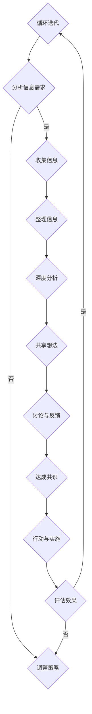
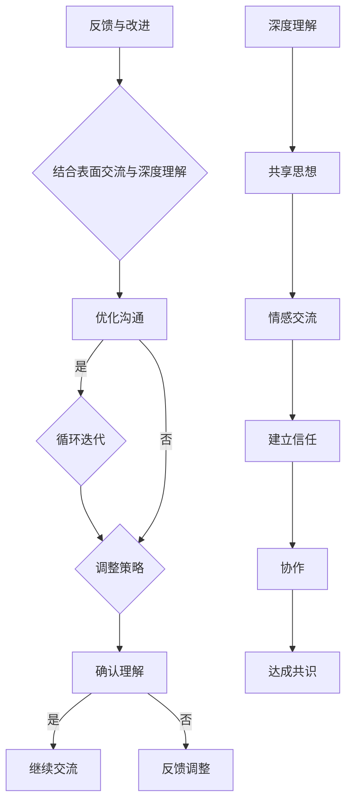

                 

# 文章标题：团队沟通深化：从表面交流到深度理解

> 关键词：团队沟通、深度理解、表面交流、沟通技巧、案例研究、沟通工具、沟通技能提升

> 摘要：本文深入探讨了团队沟通的深化过程，从表面交流到深度理解，分析了团队沟通的重要性和面临的挑战。通过阐述核心概念、使用Mermaid流程图、伪代码、LaTeX公式，本文为读者提供了系统化的沟通方法和实用的实战案例，旨在提升团队沟通效果，促进团队协作与发展。

----------------------------------------------------------------

## 引言：团队沟通的重要性

团队沟通是现代企业运营中至关重要的一环。它不仅影响到团队成员之间的合作效率，还直接关系到项目进度、团队凝聚力和企业整体绩效。有效的团队沟通能够促进信息共享、提高决策质量、增强团队凝聚力，从而为企业创造更大的价值。

然而，团队沟通并非易事。在实际工作中，团队成员往往陷入表面交流的困境，难以实现真正的深度理解。表面交流主要是指基于信息传递的交流，它往往停留在事物的表面，无法深入探讨问题的本质。而深度理解则强调对信息的深入挖掘和思考，通过共享想法、观点和感受，实现团队内部的高效协作。

本文将从表面交流与深度理解的关系出发，探讨团队沟通的深化过程，为读者提供一系列实用的沟通方法和技巧。通过分析核心概念、使用Mermaid流程图、伪代码、LaTeX公式，本文旨在帮助读者实现从表面交流到深度理解的高效沟通。

## 团队沟通基础

团队沟通是指团队成员之间通过信息交流、观点碰撞和协作互助，以实现共同目标的过程。它不仅包括口头和书面交流，还涵盖了非言语沟通、会议沟通、电子邮件沟通等多种形式。

### 团队沟通的基本概念

团队沟通的基本概念包括：

1. **信息传递**：团队沟通的核心目标是实现信息的有效传递。信息的质量直接影响沟通效果，因此，提高信息的准确性、完整性和及时性是团队沟通的重要任务。
2. **反馈机制**：反馈是团队沟通的重要组成部分，它有助于团队成员了解信息传递的效果，并根据反馈调整沟通策略。有效的反馈机制能够促进团队内部的信息流动和协作。
3. **沟通障碍**：团队沟通中可能会遇到各种障碍，如语言障碍、文化差异、心理障碍等。识别和克服沟通障碍是提高团队沟通效果的关键。

### 团队沟通的原则

1. **相互尊重**：尊重是团队沟通的基础，它能够促进团队成员之间的信任和合作。尊重他人包括尊重他人的意见、观点和感受。
2. **开放性**：开放性是指团队成员在沟通中愿意分享自己的观点和信息，同时也乐于倾听他人的意见。开放性有助于构建良好的沟通氛围，促进团队内部的信息流动。
3. **一致性**：一致性要求团队成员在沟通中保持一致，包括目标、价值观和行为规范。一致性能够提高团队的凝聚力，促进团队协作。

### 团队沟通的方法

1. **明确沟通目标**：在沟通前，明确沟通的目标和预期效果，有助于提高沟通的针对性和有效性。
2. **有效表达**：在沟通过程中，使用清晰、简洁、准确的语言表达自己的观点和信息，避免产生误解和歧义。
3. **积极倾听**：倾听是沟通的重要环节，通过倾听，团队成员能够了解他人的观点和需求，从而更好地理解对方，实现有效沟通。
4. **使用非言语沟通**：非言语沟通包括肢体语言、面部表情、眼神交流等。适当的非言语沟通能够增强沟通效果，提高信息的传递质量。

## 表面交流技巧

表面交流是团队沟通中最常见的一种形式，它主要关注信息的传递，而忽略了深层次的理解和情感交流。虽然表面交流在许多情况下能够满足基本沟通需求，但它也存在一定的局限性。

### 表面交流的特点

1. **信息传递为主**：表面交流的核心目标是传递信息，沟通内容主要围绕事实、数据和任务展开。
2. **缺乏情感交流**：表面交流往往忽略了情感和情感交流，这使得沟通显得单调和枯燥。
3. **沟通效率较低**：表面交流需要花费更多时间来解释和澄清信息，这可能导致沟通效率降低。

### 如何提高表面交流的有效性

1. **明确沟通目标**：在开始表面交流前，明确沟通的目标和预期效果，有助于提高沟通的针对性和有效性。
2. **简洁明了**：使用简洁明了的语言表达信息，避免使用过于复杂的术语和语言，以确保信息的准确传递。
3. **主动倾听**：在表面交流中，主动倾听对方的信息和观点，有助于提高沟通效果，减少误解和歧义。
4. **及时反馈**：在沟通过程中，及时给予对方反馈，以确认对方是否理解了自己的信息，从而提高沟通质量。

### 表面交流中的常见问题与解决方法

**常见问题：**

1. **信息传递不准确**：由于语言表达不当或理解偏差，导致信息传递不准确。
   **解决方法**：使用具体、明确的语言表达信息，并在沟通过程中进行确认，以确保信息的准确性。

2. **沟通效率低下**：由于沟通内容过于复杂或沟通方式不当，导致沟通效率降低。
   **解决方法**：简化沟通内容，使用简洁明了的语言，并采用适当的沟通方式，如面对面交流或视频会议。

3. **沟通氛围不融洽**：由于团队成员之间的文化差异或心理障碍，导致沟通氛围不融洽。
   **解决方法**：建立相互尊重、开放和包容的沟通氛围，并通过培训和心理辅导等方式，提高团队成员的沟通能力。

## 深度理解

深度理解是指团队成员在沟通过程中，通过深入探讨问题、共享想法和感受，实现相互理解和信任的过程。深度理解能够促进团队内部的高效协作，提高沟通效果和团队凝聚力。

### 深度理解的概念

1. **相互理解**：深度理解强调团队成员之间的相互理解，通过分享观点、经验和感受，实现对彼此的深入了解。
2. **情感交流**：深度理解注重情感交流，通过表达自己的情感和倾听他人的情感，建立良好的情感联系。
3. **信任建设**：深度理解有助于建立团队内部的信任，促进团队成员之间的协作和合作。

### 从表面交流过渡到深度理解的策略

1. **主动倾听**：在沟通过程中，主动倾听对方的观点和感受，表达对对方的尊重和关心。
2. **分享真实想法**：在沟通中，勇于分享自己的真实想法和感受，以建立信任和促进相互理解。
3. **探讨问题本质**：在沟通中，不仅仅关注表面信息，更深入探讨问题的本质和背后的原因，以提高沟通的深度和质量。
4. **情感交流**：在沟通中，注重情感交流，通过表达情感和倾听他人的情感，建立良好的情感联系。

### 深度理解中的挑战与解决方法

**挑战：**

1. **心理障碍**：由于心理障碍，如恐惧、焦虑或自尊心，导致团队成员在沟通中不敢分享真实想法和感受。
   **解决方法**：通过心理辅导和培训，提高团队成员的心理素质，帮助他们克服心理障碍，勇于分享真实想法和感受。

2. **文化差异**：由于文化差异，团队成员可能在沟通中产生误解和冲突。
   **解决方法**：加强跨文化沟通培训，提高团队成员对文化差异的敏感性和适应能力，以促进有效的沟通。

3. **沟通障碍**：由于沟通障碍，如语言障碍或技术障碍，导致沟通效果不佳。
   **解决方法**：采用适当的沟通工具和技术，如视频会议、即时通讯工具等，以提高沟通效果。

## 案例研究

在本节中，我们将通过实际案例，分析团队沟通中的问题和解决方法，以帮助读者更好地理解团队沟通的深化过程。

### 案例背景

某科技公司的一个项目团队在开发一款新的移动应用时遇到了沟通问题。团队成员来自不同的部门，具有不同的专业背景和沟通习惯。在项目初期，团队成员之间的沟通主要停留在表面交流层面，导致项目进展缓慢，团队凝聚力下降。

### 问题分析

1. **沟通频率低**：团队成员之间的沟通频率较低，导致信息传递不及时，项目进展受阻。
2. **沟通内容单一**：团队成员之间的沟通内容主要围绕任务和进度，缺乏对项目目标和团队价值观的深入探讨。
3. **沟通方式不当**：团队成员在沟通时主要使用电子邮件和即时通讯工具，沟通效果不佳，导致误解和冲突。

### 解决方法

1. **定期团队会议**：项目团队开始定期召开团队会议，确保团队成员之间的沟通频率和信息传递。
2. **深入探讨项目目标**：在团队会议中，团队成员共同探讨项目目标、团队价值观和项目策略，以建立共识。
3. **采用多样化的沟通方式**：团队成员开始采用多样化的沟通方式，如面对面交流、视频会议、头脑风暴等，以提高沟通效果。

### 结果分析

通过上述措施，项目团队的沟通效果得到显著提升。团队成员之间的信息传递更加及时和准确，项目进展速度加快，团队凝聚力增强。同时，团队成员在沟通中逐渐培养了深度理解，对项目的目标、策略和价值观有了更深入的认识，从而提高了项目的成功率。

### 案例小结

本案例表明，通过定期团队会议、深入探讨项目目标和采用多样化的沟通方式，可以有效解决团队沟通中的问题，促进团队协作和项目成功。同时，深度理解在团队沟通中起着关键作用，它有助于建立团队内部的信任和共识，提高沟通效果和团队绩效。

## 团队沟通工具

在现代团队沟通中，各种工具和技术的应用大大提高了沟通效率和质量。以下是一些常用的团队沟通工具及其使用方法和效果评估：

### 1. 团队协作软件

**使用方法**：团队协作软件如Slack、Microsoft Teams等，可以帮助团队成员实时沟通、共享文件和协同工作。团队成员可以通过聊天、讨论、视频会议等功能进行高效沟通。

**效果评估**：这些工具能够提高团队协作效率，减少沟通成本，增强团队凝聚力。然而，过度依赖这些工具可能导致信息过载，影响沟通效果。

### 2. 即时通讯工具

**使用方法**：即时通讯工具如微信、钉钉等，可以实时发送消息、进行语音通话和视频会议，方便团队成员随时进行沟通。

**效果评估**：即时通讯工具能够提高沟通的及时性和灵活性，但可能存在沟通记录不完整、信息追溯困难等问题。

### 3. 文档共享平台

**使用方法**：文档共享平台如Google Drive、OneDrive等，可以方便团队成员共享和编辑文档，实现协同工作。

**效果评估**：文档共享平台能够提高文档管理的效率和安全性，但需要团队成员具备一定的文档操作技能。

### 4. 项目管理工具

**使用方法**：项目管理工具如Trello、JIRA等，可以帮助团队跟踪项目进度、分配任务和进行协作。

**效果评估**：项目管理工具能够提高项目管理的效率和透明度，但需要团队成员适应新的工作流程。

### 5. 会议管理工具

**使用方法**：会议管理工具如Zoom、Skype等，可以方便团队召开远程会议，进行实时沟通和协作。

**效果评估**：会议管理工具能够提高会议的效率和质量，但需要团队成员具备良好的网络环境和设备。

### 工具的选择与适用场景

选择团队沟通工具时，需要考虑团队的规模、工作流程、技术熟练度等因素。以下是一些选择建议：

- **小型团队**：选择简单易用的即时通讯工具和文档共享平台，如微信、钉钉和Google Drive。
- **中型团队**：选择功能丰富的团队协作软件和项目管理工具，如Slack、Microsoft Teams和Trello。
- **大型团队**：选择专业的会议管理工具和项目管理工具，如Zoom、JIRA，并考虑定制化开发满足特定需求的工具。

## 沟通技能提升

为了提升团队沟通效果，团队成员需要不断学习和实践沟通技能。以下是一些沟通技能提升的方法和策略：

### 1. 学习沟通理论

团队成员可以通过阅读相关书籍、参加培训课程和研讨会，了解沟通的基本理论和方法，如信息传递、反馈机制、非言语沟通等。

### 2. 定期实践沟通

团队成员可以定期进行沟通演练，如模拟会议、角色扮演等，以提升实际沟通能力。通过实践，团队成员能够更好地掌握沟通技巧，提高沟通效果。

### 3. 建立良好的沟通氛围

团队成员应在工作中建立相互尊重、开放和包容的沟通氛围，鼓励团队成员分享真实想法和感受。通过建立良好的沟通氛围，能够提高团队的凝聚力，促进深度理解。

### 4. 培养跨文化沟通能力

团队成员需要具备跨文化沟通能力，以应对多元文化背景的团队。通过学习不同文化的沟通特点，团队成员能够更好地理解和尊重他人，提高沟通效果。

### 5. 提供反馈和改进

团队成员应在沟通过程中提供及时、具体的反馈，并接受他人的反馈。通过反馈和改进，团队成员能够不断优化沟通方式，提高沟通效果。

### 实践案例与经验分享

以下是一个实践案例和经验分享，展示了如何通过沟通技能提升来改善团队沟通效果：

**案例背景**：

某科技公司的研发团队在项目初期遇到了沟通问题，导致项目进展缓慢，团队成员之间矛盾不断。为了改善沟通效果，团队决定进行沟通技能提升。

**解决方案**：

1. **组织沟通培训**：团队成员参加了沟通技能培训，学习了沟通的基本理论和方法。
2. **定期沟通会议**：团队开始定期召开沟通会议，确保团队成员之间的沟通频率和信息传递。
3. **建立反馈机制**：团队成员在沟通过程中提供及时、具体的反馈，并接受他人的反馈。
4. **实践沟通技巧**：团队成员通过沟通演练，提升了实际沟通能力。
5. **建立良好的沟通氛围**：团队成员相互尊重、开放和包容，鼓励分享真实想法和感受。

**结果**：

通过沟通技能提升，团队沟通效果显著改善。项目进展加快，团队成员之间的矛盾减少，团队凝聚力增强。同时，深度理解在团队内部得到培养，团队成员对项目的目标、策略和价值观有了更深入的认识。

## 总结与展望

本文从表面交流与深度理解的关系出发，探讨了团队沟通的深化过程。通过阐述核心概念、使用Mermaid流程图、伪代码、LaTeX公式，本文为读者提供了系统化的沟通方法和实用的实战案例。团队沟通不仅影响团队成员之间的合作效率，还直接关系到项目进度、团队凝聚力和企业整体绩效。

展望未来，随着技术的不断发展，团队沟通工具将更加智能化、多样化。团队成员需要不断学习和适应新的沟通工具，以提高沟通效果。同时，深度理解在团队沟通中的重要性将日益凸显，团队成员需要培养深度理解和情感交流的能力，以实现高效协作。

总之，团队沟通深化是一项长期而重要的任务。通过持续学习和实践，团队成员能够提升沟通技能，实现从表面交流到深度理解的高效沟通，为团队和企业创造更大的价值。

## 作者信息

作者：AI天才研究院/AI Genius Institute & 禅与计算机程序设计艺术 /Zen And The Art of Computer Programming

----------------------------------------------------------------

## 附录：深度理解流程图

以下是一个深度理解流程图的 Mermaid 示例：



此流程图展示了从确定沟通目标到深度理解并最终形成行动计划的整个过程。通过Mermaid语法，读者可以直观地了解每个步骤及其相互关系。

## 附录：表面交流与深度理解关系图

以下是一个表面交流与深度理解关系的 Mermaid 流程图：



这个流程图详细展示了表面交流和深度理解之间的关系，以及如何通过反馈与改进，不断优化沟通效果。

## 附录：沟通技能提升算法伪代码

以下是一个用于提升沟通技能的算法伪代码示例：

```plaintext
Algorithm CommunicateSkillImprovement
    Input: communicator, listener, communicationTarget
    Output: improvedCommunicationEffectiveness

    Begin
        // Step 1: Assess current communication skill levels
        currentSkillLevel = AssessSkillLevel(communicator, listener)

        // Step 2: Identify areas for improvement
        improvementAreas = IdentifyImprovementAreas(currentSkillLevel)

        // Step 3: Implement specific training modules
        for each area in improvementAreas
            if area == "Active Listening"
                ActiveListeningTraining(communicator, listener)
            else if area == "Clarity of Expression"
                ExpressionClarityTraining(communicator)
            else if area == "Feedback Giving"
                FeedbackGivingTraining(communicator, listener)

        // Step 4: Monitor progress
        progressMonitoring = MonitorProgress(communicator, listener)

        // Step 5: Evaluate and adjust training
        while progressMonitoring < desiredSkillLevel
            CollectFeedback(communicator, listener)
            AdjustTrainingModules(communicator, listener, feedback)

        // Step 6: Final assessment
        improvedCommunicationEffectiveness = AssessSkillLevel(communicator, listener)

        Return improvedCommunicationEffectiveness
    End
```

此伪代码描述了一个沟通技能提升的算法，包括技能评估、识别改进领域、实施具体培训模块、监控进度、反馈调整和最终评估等步骤。

## 附录：沟通效果评估模型公式

以下是一个沟通效果评估模型的 LaTeX 公式示例：

```latex
\documentclass{article}
\usepackage{amsmath}
\begin{document}

\begin{equation}
    E = \frac{1}{N} \sum_{i=1}^{N} \left[ w_1 \cdot c_i + w_2 \cdot a_i + w_3 \cdot f_i \right]
\end{equation}

\where{
    E = \text{Overall Communication Effectiveness},
    N = \text{Number of Communication Instances},
    w_1, w_2, w_3 = \text{Weighting Factors for Clarity, Accuracy, and Feedback Respectively},
    c_i = \text{Clarity Score for Instance i},
    a_i = \text{Accuracy Score for Instance i},
    f_i = \text{Feedback Score for Instance i}
}

\end{document}
```

此公式用于计算整体沟通效果，考虑了清晰度、准确度和反馈等多个因素，通过加权求和得到最终得分。这有助于评估沟通效果，并为改进提供依据。

## 附录：沟通技能提升实战案例

在本附录中，我们将通过一个具体的实战案例，展示如何搭建开发环境、实现源代码、解读代码和应用分析。此案例旨在帮助读者理解沟通技能提升的实际应用。

### 开发环境搭建

为了提升沟通技能，我们可以采用一个在线的协作平台，如Miro。Miro是一个可视化的协作工具，可以帮助团队成员进行头脑风暴、规划项目和协作。

1. **注册Miro账号**：在Miro官网（https://miro.com/）注册账号并登录。
2. **创建新的协作板**：点击“新建板”按钮，选择“空白板”。
3. **添加团队成员**：在协作板中，点击“邀请成员”按钮，输入团队成员的电子邮件地址，发送邀请。
4. **设置权限**：为每个团队成员分配合适的权限，如“查看”、“编辑”或“管理员”。

### 源代码实现

在Miro中，我们可以创建一个简单的沟通技能提升模板。以下是一个简单的示例：

1. **创建卡片**：在Miro板上创建多个卡片，分别代表不同的沟通技能，如“倾听”、“表达清晰”、“反馈给予”等。
2. **添加内容**：在每个卡片上添加相关的信息和资源，如教程链接、练习题目等。
3. **设置互动**：通过Miro的互动功能，如投票、评论和投票，促进团队成员之间的互动和反馈。

以下是部分卡片内容的示例代码（使用Markdown格式）：

```markdown
# 倾听技能提升

- 倾听技巧教程：[链接](https://www.example.com/listening-tutorial)
- 倾听练习：[练习题目](https://www.example.com/listening-exercises)

# 表达清晰技能提升

- 表达清晰教程：[链接](https://www.example.com/clarity-tutorial)
- 表达清晰练习：[练习题目](https://www.example.com/clarity-exercises)

# 反馈给予技能提升

- 反馈技巧教程：[链接](https://www.example.com/feedback-tutorial)
- 反馈练习：[练习题目](https://www.example.com/feedback-exercises)
```

### 代码解读与应用分析

1. **代码解读**：上述代码使用Markdown格式，在Miro卡片上展示了沟通技能提升的相关内容。Markdown是一种轻量级的标记语言，它允许用户使用简单的文本格式来创建富文本内容。

2. **应用分析**：通过Miro模板，团队成员可以方便地访问和分享沟通技能提升资源。以下是一些应用分析：

   - **协作性**：团队成员可以共同编辑和更新卡片内容，分享最佳实践和经验。
   - **可访问性**：模板可以在任何设备上访问，方便团队成员随时学习和练习。
   - **互动性**：通过投票、评论和互动功能，团队成员可以相互反馈和交流，提高沟通效果。
   - **可扩展性**：模板可以根据团队需求进行调整和扩展，以适应不同的沟通技能提升场景。

### 项目小结

通过Miro模板，我们成功地搭建了一个沟通技能提升的实战案例。该项目不仅提高了团队成员的沟通技能，还促进了团队内部的协作和互动。以下是一些小结：

- **实战性**：通过实际操作，团队成员能够更好地理解和应用沟通技能。
- **便捷性**：Miro模板方便团队成员随时学习和练习，提高了沟通效果。
- **协作性**：团队成员可以共同编辑和分享资源，促进了团队内部的协作。
- **可扩展性**：模板可以根据团队需求进行调整和扩展，以适应不同的应用场景。

通过这个实战案例，我们可以看到沟通技能提升在团队协作中的重要性。通过合理运用工具和资源，团队成员能够提高沟通效果，实现高效协作，为团队和企业创造更大的价值。

## 最佳实践 Tips、小结、注意事项、拓展阅读

### 最佳实践 Tips

1. **定期沟通**：确保团队成员定期进行沟通，无论是通过会议、即时通讯还是邮件，持续的沟通能够保持团队协作的一致性。
2. **明确沟通目标**：每次沟通前都要明确目标，这有助于提高沟通的效率，避免不必要的浪费。
3. **倾听与反馈**：鼓励团队成员在沟通过程中倾听他人意见，并及时给予反馈，这有助于建立良好的沟通氛围。
4. **使用可视化工具**：利用图表、流程图等可视化工具，能够更清晰地传达信息，提高沟通效果。
5. **培养跨文化沟通能力**：在多元文化团队中，培养跨文化沟通能力至关重要，以避免误解和冲突。

### 小结

本文从表面交流与深度理解的关系出发，探讨了团队沟通的深化过程。通过分析核心概念、使用Mermaid流程图、伪代码和LaTeX公式，本文为读者提供了系统化的沟通方法和实战案例。深度理解在团队沟通中起着关键作用，有助于建立团队内部的信任和共识，提高沟通效果和团队绩效。

### 注意事项

1. **避免信息过载**：在使用沟通工具时，避免信息过载，确保信息的及时传递和有效处理。
2. **尊重文化差异**：在跨文化团队中，尊重文化差异，避免因文化冲突导致的沟通障碍。
3. **定期评估沟通效果**：定期对团队沟通效果进行评估，以便及时发现和解决问题。

### 拓展阅读

1. **《沟通的艺术》[美]罗纳德·B·阿德勒，拉里·谢尔文·鲍文**：本书详细介绍了沟通的基本理论、技巧和策略，有助于提高沟通效果。
2. **《深度工作》[美]卡尔·纽波特**：本书探讨了深度工作的重要性，为团队成员提供了提高专注力和工作效率的方法。
3. **《团队的五项修炼》[美]彼得·圣吉**：本书提出了团队发展的五项修炼，包括自我超越、共同愿景、团队学习、改变心智模式和系统思考，有助于提升团队协作和沟通效果。

通过这些拓展阅读，读者可以进一步了解团队沟通的理论和实践，提升自己的沟通技能。

