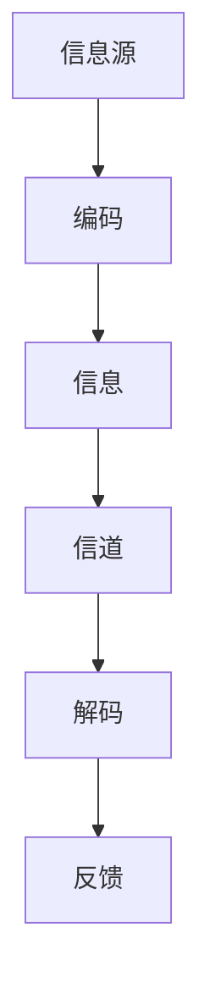

                 

### 沟通的基础理论

在探讨团队沟通的策略之前，我们需要首先理解沟通的基本概念与模型。沟通不仅仅是信息的传递，它涉及到多个环节的协调与配合。以下，我们将深入探讨沟通的定义、要素、模型及其理论，为后续的讨论打下坚实的基础。

#### 1.1.1 沟通的定义与要素

**沟通的定义：** 沟通是指信息在发送者与接收者之间进行传递和理解的过程。它涉及信息的生成、传递、接收和反馈。

**沟通的要素：** 沟通包括以下关键要素：

1. **信息源（Sender）：** 信息源是沟通的起点，它可以是任何发出信息的人或系统。
2. **编码（Encoding）：** 编码是将信息源的信息转换成可以传递的形式，如语言、文字、图像等。
3. **信息（Message）：** 信息是沟通的核心，它是传递给接收者的内容。
4. **信道（Channel）：** 信道是信息传递的路径，可以是面对面的交流、电话、电子邮件、社交媒体等。
5. **解码（Decoding）：** 解码是接收者将接收到的信息转换成有意义的形式。
6. **接收者（Receiver）：** 接收者是沟通过程的终点，他们接收并理解信息。
7. **反馈（Feedback）：** 反馈是接收者对信息的回应，它可以是口头或书面的形式。

**概念图：**



通过这个模型，我们可以清晰地看到沟通过程中的每个环节及其相互关系。每个环节都至关重要，任何一环的缺失或不完善都可能影响整个沟通过程的效率和效果。

#### 1.1.2 沟通的模型与理论

沟通模型有多种，以下介绍几种常见的模型：

1. **信息传递模型（Information Transmission Model）：** 该模型强调了信息的传递过程，认为信息通过编码、信道和解码被传递。这个模型假设接收者能够准确地解码信息，但忽视了反馈的重要性。

   ```mermaid
   graph TD
       A[信息源] --> B[编码]
       B --> C[信息]
       C --> D[信道]
       D --> E[解码]
   ```

2. **互动沟通模型（Interactive Communication Model）：** 该模型认为沟通是双方互动的过程，强调了信息的双向流动和反馈。互动沟通模型更加注重沟通过程中的动态性和复杂性。

   ```mermaid
   graph TD
       A[信息源] --> B[编码]
       B --> C[信息]
       C --> D[信道]
       D --> E[解码]
       E --> F[反馈]
   ```

3. **社会互动模型（Social Interaction Model）：** 该模型强调了沟通在社会互动中的作用，认为沟通是建立关系和传递社会信息的过程。社会互动模型认为沟通过程中的非语言因素（如姿态、表情等）同样重要。

   ```mermaid
   graph TD
       A[信息源] --> B[编码]
       B --> C[信息]
       C --> D[信道]
       D --> E[解码]
       E --> F[反馈]
   ```

这些模型从不同的角度揭示了沟通的复杂性，但都强调了信息传递、编码解码和反馈的重要性。通过这些模型，我们可以更好地理解和优化团队沟通的过程。

### 1.2 团队沟通的重要性与挑战

**团队沟通的重要性：**

团队沟通是团队协作的基础，它对团队的整体效率和成果有着重要影响。以下是团队沟通的重要性的具体体现：

1. **提高工作效率：** 通过有效的沟通，团队成员可以明确任务目标、分工合作，从而提高工作效率。
2. **促进知识共享：** 团队成员之间的沟通有助于知识共享和技能互补，促进团队整体能力的提升。
3. **增强团队凝聚力：** 开放和透明的沟通可以增强团队成员之间的信任和合作精神，提高团队的凝聚力。
4. **预防误解和冲突：** 通过及时的沟通和反馈，可以减少误解和冲突的发生，确保团队内部的和谐与稳定。

**团队沟通的挑战：**

尽管团队沟通的重要性显而易见，但在实际操作中，团队沟通面临许多挑战：

1. **文化差异：** 不同文化背景的团队成员可能在沟通方式、语言使用和表达习惯上有差异，这可能导致误解和沟通障碍。
2. **沟通障碍：** 语言障碍、技术问题、信息过载等因素都可能影响团队沟通的效果。
3. **时间压力：** 在快节奏的工作环境中，时间压力常常迫使团队成员快速决策和沟通，这可能导致沟通不充分和效率低下。

#### 1.2.1 团队沟通的重要性

沟通效率是衡量团队沟通效果的重要指标，它决定了信息传递的速度和噪声干扰的程度。以下是一个简单的数学公式，用于衡量沟通效率：

$$
沟通效率 = \frac{信息传递速度}{噪声干扰程度}
$$

这个公式表明，提高信息传递速度和降低噪声干扰程度都可以提高沟通效率。在实际工作中，团队可以通过以下措施来提高沟通效率：

1. **使用清晰简洁的语言：** 确保信息传递过程中语言准确、简洁，避免使用模糊或含糊的表述。
2. **建立有效的沟通渠道：** 选择合适的沟通工具和渠道，确保信息可以及时、准确地传递。
3. **提高团队成员的沟通技能：** 定期进行沟通培训，提高团队成员的沟通技巧和理解能力。

#### 1.2.2 团队沟通的挑战

团队沟通的挑战多种多样，以下列举几种常见的挑战：

1. **文化差异：** 不同文化背景的团队成员可能在沟通方式、语言使用和表达习惯上有差异，这可能导致误解和沟通障碍。例如，一些文化强调直接表达，而另一些文化则更倾向于间接表达。

2. **沟通障碍：** 语言障碍、技术问题、信息过载等因素都可能影响团队沟通的效果。例如，团队成员可能因为语言障碍而无法准确理解对方的意思，或者因为技术问题而无法及时传递信息。

3. **时间压力：** 在快节奏的工作环境中，时间压力常常迫使团队成员快速决策和沟通，这可能导致沟通不充分和效率低下。例如，在紧急项目中，团队成员可能需要在短时间内做出决策和协调工作，这可能导致沟通不够充分和细致。

为了应对这些挑战，团队可以采取以下措施：

1. **文化差异培训：** 定期进行文化差异培训，帮助团队成员了解不同文化的沟通习惯和表达方式，减少误解和沟通障碍。
2. **沟通障碍解决方案：** 确保团队成员具备基本的沟通技能，如有效的倾听、清晰的表达和及时的反馈。同时，使用适当的沟通工具和技术，如即时通讯软件、视频会议等，提高沟通效率。
3. **合理的时间管理：** 制定明确的工作计划和时间表，合理分配任务和会议时间，确保团队成员有足够的时间进行充分的沟通和协调。

通过这些措施，团队可以更好地应对沟通挑战，提高沟通效率，促进团队协作和项目成功。

### 小结

在本文的第一部分，我们探讨了沟通的基础理论，包括沟通的定义、要素和模型。通过介绍信息源、编码、信息、信道、解码、接收者和反馈等关键要素，我们构建了一个完整的沟通模型。接着，我们分析了团队沟通的重要性与挑战，包括提高工作效率、促进知识共享、增强团队凝聚力和预防误解和冲突等方面。我们还介绍了一些常用的沟通模型，如信息传递模型、互动沟通模型和社会互动模型，帮助读者更全面地理解沟通的复杂性。

在接下来的部分，我们将进一步探讨团队沟通的策略，包括开放式沟通和透明沟通的原则、技巧以及实际应用。我们将通过具体案例，展示如何在实际工作中应用这些策略，提高团队沟通的效率和质量。

## 第二部分：团队沟通策略

### 2.1 沟通策略概述

有效的团队沟通是团队成功的关键。在这一部分，我们将探讨一系列沟通策略，旨在帮助团队建立开放透明的交流环境。这些策略包括明确沟通目标、理解听众需求和使用清晰的语言等。

#### 2.1.1 有效沟通的策略

**明确沟通目标**

明确的沟通目标是有效沟通的基础。在开始任何沟通之前，团队应该明确沟通的目的，包括需要传达的信息、期望的反馈和沟通的时间限制。以下是一些关键步骤：

1. **定义沟通目标：** 确定沟通的具体目标，如传达项目进度、解决特定问题或规划团队活动。
2. **分配任务：** 根据沟通目标，分配任务和责任，确保每个团队成员都清楚自己的角色和职责。
3. **设定时间限制：** 确定沟通的时间框架，确保沟通在合理的时间内完成，避免拖延。

**理解听众需求**

理解听众需求是确保沟通有效性的关键。团队应该考虑听众的文化背景、沟通习惯和理解能力，从而调整沟通的内容和方式。以下是一些具体方法：

1. **收集反馈：** 定期收集团队成员的反馈，了解他们的沟通需求和偏好。
2. **个性化沟通：** 根据听众的需求和偏好，调整沟通的内容和方式，使其更加贴近听众。
3. **简洁明了：** 使用简单、易懂的语言，避免使用复杂的技术术语或行话，确保听众能够轻松理解。

**使用清晰的语言**

清晰的语言是有效沟通的核心。团队应该避免使用模糊、含糊的表述，确保信息的准确性和清晰度。以下是一些具体建议：

1. **明确表述：** 使用明确、具体的语言，避免使用模糊或含糊的表述，如“大概”、“似乎”等。
2. **避免行话：** 避免使用特定领域的行话或术语，除非确保听众理解。
3. **简洁明了：** 使用简洁、明了的语言，避免冗长的句子和复杂的结构。

**实践案例：**

在一个跨部门的项目中，项目经理需要与团队成员沟通项目的进展和计划。以下是应用上述策略的具体案例：

1. **明确沟通目标：** 项目经理明确沟通目标是更新项目进度和讨论下一步行动计划。
2. **理解听众需求：** 项目经理了解团队成员来自不同的部门，具有不同的专业背景和沟通习惯。他决定使用简单、具体的语言，并通过简短的会议和即时通讯工具进行沟通。
3. **使用清晰的语言：** 项目经理在会议中明确项目进度，使用具体的数字和数据来展示成果，并通过即时通讯工具发送详细的项目报告，确保团队成员能够轻松理解。

通过这些策略，团队可以有效提高沟通的效率和质量，确保信息的准确传递和团队的协作。

#### 2.2 开放式沟通

开放式沟通是一种鼓励团队成员表达观点、分享信息和提出问题的沟通方式。它有助于建立信任、促进创新和增强团队凝聚力。以下介绍开放式沟通的原则、技巧和实际应用。

**原则**

1. **倾听与尊重**：开放式沟通强调倾听和尊重，鼓励团队成员自由表达观点，无论这些观点是否与主流意见一致。
2. **开放心态**：团队成员应保持开放心态，接受不同的意见和反馈，避免预设偏见和刻板印象。
3. **真诚表达**：真诚表达是开放式沟通的核心，团队成员应坦诚地分享自己的想法和感受，避免虚假或做作的表现。

**技巧**

1. **积极倾听**：在沟通过程中，主动倾听对方的观点，避免打断或急于表达自己的看法。通过点头、眼神交流和适当的回应来表明自己在倾听。
2. **提问与确认**：通过提问来深入了解对方的观点和意图，确保自己正确理解对方的意见。同时，确认对方是否理解自己的观点，避免误解和沟通障碍。
3. **鼓励反馈**：鼓励团队成员提出问题和反馈，无论这些问题或反馈是建设性的还是批评性的。建立一个安全、开放的沟通环境，让团队成员感到他们的意见和反馈被重视。

**实际应用**

在一个团队会议中，团队成员需要讨论项目的下一步行动计划。以下是一个应用开放式沟通技巧的案例：

1. **倾听与尊重**：会议开始时，主持人明确表示欢迎所有成员自由发言，无论他们的观点是什么。他鼓励团队成员在发言时保持开放心态，倾听他人的观点。
2. **开放心态**：在讨论过程中，成员A提出了一个与团队当前计划不同的观点。主持人没有立即否定，而是鼓励其他成员表达他们的看法，并询问成员A的详细理由。
3. **真诚表达**：成员A详细解释了他的观点，并提出了一些合理的疑虑。其他成员在听到这些观点后，通过提问和确认来确保他们正确理解成员A的意见。同时，他们也分享了自己的观点和疑虑。

通过这种方式，团队会议不仅达成了共识，还促进了团队成员之间的沟通和理解。开放式沟通确保了每个成员的声音都被听到，并促进了团队的创新和协作。

#### 2.3 透明沟通

透明沟通是指团队在决策和执行过程中公开信息、分享进展和解决问题的一种沟通方式。它有助于增强团队成员之间的信任，提高工作效率，预防误解和冲突。以下介绍透明沟通的重要性、实现技巧和实际应用。

**重要性**

1. **增强信任**：透明沟通有助于建立团队成员之间的信任，通过公开信息，团队可以减少信息不对称，从而增强信任。
2. **提高工作效率**：透明沟通确保团队成员了解项目的进展和计划，从而可以更有效地协作和分配任务。
3. **预防误解和冲突**：通过透明沟通，团队成员可以及时了解项目的进展和问题，减少因信息不对称而产生的误解和冲突。

**实现技巧**

1. **定期更新项目进度**：团队应定期召开会议，更新项目进度，讨论存在的问题和解决方案。这些会议可以是每周的进度汇报，也可以是每月的全面总结。
2. **建立透明的信息渠道**：团队应建立一个透明的信息渠道，如共享文档、项目管理系统或即时通讯工具，确保信息可以实时更新和共享。
3. **鼓励团队成员提出问题**：团队应鼓励成员在遇到问题时主动提出，并提供一个安全、开放的沟通环境，让成员感到他们的意见和反馈被重视。

**实际应用**

在一个软件开发项目中，团队需要确保透明沟通，以下是一个应用透明沟通技巧的案例：

1. **定期更新项目进度**：项目经理每周召开项目进度会议，讨论本周的进展、遇到的问题和下周的计划。每次会议都会记录在共享文档中，供团队成员查阅。
2. **建立透明的信息渠道**：团队使用GitLab作为项目管理系统，所有代码提交、问题和任务都在GitLab上记录和跟踪。团队成员可以随时查看项目的状态和进展。
3. **鼓励团队成员提出问题**：团队成员在遇到问题时会主动在项目管理系统上创建问题，并邀请相关人员进行讨论和解决。这种做法确保了问题不会因为被忽视而积累，从而影响项目进度。

通过这种方式，团队实现了高效的沟通和协作，确保项目顺利进行。

在本文的第二部分，我们探讨了团队沟通的策略，包括开放式沟通和透明沟通的原则、技巧和实际应用。开放式沟通鼓励团队成员自由表达观点，通过倾听和尊重来建立信任和促进创新。透明沟通则强调在决策和执行过程中公开信息、分享进展和解决问题，从而增强信任、提高工作效率和预防误解和冲突。在实际应用中，这些策略可以帮助团队建立开放透明的交流环境，提高沟通的效率和质量。

在接下来的部分，我们将进一步探讨沟通工具与技术，介绍如何选择和使用这些工具，以及如何应用沟通技术，如演讲技巧和即兴沟通。

### 第三部分：沟通工具与技术

在现代社会，沟通工具和技术的发展极大地改变了团队沟通的方式。选择合适的沟通工具和技术，不仅能够提高沟通效率，还能增强团队协作和创新能力。在这一部分，我们将探讨沟通工具的选择、沟通技术的应用，以及如何在实际工作中有效利用这些工具和技术。

#### 3.1 沟通工具的选择

**线上沟通工具**

1. **企业微信**：企业微信是微信的官方企业应用，提供即时通讯、视频会议、文件传输等功能。它的优势在于与微信生态的整合，使用方便，支持大规模团队沟通。
   
2. **Slack**：Slack是一款专业的团队沟通工具，支持即时通讯、频道分类、文件共享和集成第三方应用。它的优势在于高度定制化和灵活的团队管理功能，适合大型团队。

3. **Microsoft Teams**：Microsoft Teams是微软的团队协作平台，提供即时通讯、视频会议、文档协作等功能。它的优势在于与微软其他办公软件的紧密集成，适合企业内部使用。

**线下沟通工具**

1. **团队会议**：团队会议是传统的沟通方式，通过面对面的交流，可以更深入地探讨问题、分享观点。它的优势在于可以即时反馈和互动，增强团队凝聚力。

2. **一对一面谈**：一对一面谈是一种私密性较高的沟通方式，适合讨论敏感问题或进行个人反馈。它的优势在于可以深入交流，提供个性化的建议和指导。

3. **团队活动**：团队活动如团建活动、聚会等，可以增强团队成员之间的互动和信任，促进团队合作。它的优势在于通过非正式的交流，建立更紧密的关系。

#### 3.2 沟通技术的应用

**演讲技巧**

1. **准备充分**：演讲前要充分准备，包括内容梳理、结构设计和演示材料制作。确保演讲内容逻辑清晰、重点突出。

2. **保持自信**：在演讲过程中，保持自信的态度，通过眼神交流、肢体语言和声音变化来增强演讲的感染力。

3. **使用故事化表达**：通过故事化表达，使演讲内容更加生动有趣，更容易吸引听众的注意力。

**即兴沟通**

1. **灵活应对**：在即兴沟通中，需要灵活应对突发情况和不确定性。通过快速思考和适应，找到合适的解决方案。

2. **保持专注**：在沟通过程中，保持专注，集中注意力在对方的话题和需求上，避免分心。

3. **借助辅助工具**：使用辅助工具如记事板、幻灯片等，可以帮助整理思路、提醒关键点和关键任务。

**实际应用案例**

**案例一：跨部门项目沟通**

在一个大型企业的跨部门项目中，团队需要频繁沟通以协调各项工作。以下是如何应用沟通工具和技术的案例：

1. **线上沟通工具**：团队使用企业微信进行日常沟通，通过创建项目专属的聊天群组，确保信息传递的及时性和准确性。同时，使用Slack进行跨部门协作，整合项目文档和任务管理，提高工作效率。

2. **演讲技巧**：项目经理在每周的项目进度会议上，通过使用故事化表达和幻灯片，清晰地传达项目进展和问题。这有助于团队了解项目的当前状态，并激发团队的积极性和参与度。

3. **即兴沟通**：在项目遇到突发问题时，团队成员通过即兴沟通快速解决问题。例如，在某个技术难题无法解决时，团队成员迅速召集相关人员，通过在线会议讨论解决方案，并记录在共享文档中，确保问题得到及时解决。

**案例二：团队团建活动**

在一个创业公司的团建活动中，团队通过一系列沟通工具和技术，增强团队成员之间的互动和信任：

1. **团队会议**：团队定期召开面对面的会议，讨论公司文化和团队合作的重要性。这种直接的交流有助于建立团队成员之间的信任和默契。

2. **一对一面谈**：公司领导与每位团队成员进行一对一的面谈，了解他们的需求和反馈。这种私密的沟通方式有助于建立更紧密的关系。

3. **团队活动**：公司组织团建活动，如户外拓展、聚餐等，通过非正式的交流，增强团队成员之间的互动和信任。

通过这些沟通工具和技术的应用，团队不仅在工作中提高了沟通效率，还在团建活动中增强了团队的凝聚力和创新能力。

### 小结

在本文的第三部分，我们探讨了沟通工具与技术的重要性以及如何在实际工作中应用这些工具和技术。选择合适的沟通工具，如企业微信、Slack、Microsoft Teams等，可以提高沟通效率。应用演讲技巧和即兴沟通，可以增强沟通的吸引力和灵活性。通过实际案例，我们展示了如何在不同场景中应用这些沟通工具和技术，提高团队协作和项目成功的可能性。

在接下来的部分，我们将通过具体案例深入分析团队沟通的困境与改进措施，提供实用的建议和解决方案，以帮助团队更好地应对沟通挑战。

### 案例一：企业内部的沟通困境与改进

在一个大型企业中，沟通问题常常成为影响项目进度和团队协作的瓶颈。以下是一个关于企业内部沟通困境与改进的案例，我们将详细分析其中存在的问题，并提出具体的改进措施。

#### 4.1.1 沟通困境分析

**沟通渠道不畅**

在企业内部，各部门之间的沟通渠道并不通畅。信息常常在传递过程中丢失或延迟，导致团队成员对项目的进展和计划不够了解。以下是一些具体表现：

1. **信息传递延误**：项目进度报告需要通过多级审批，导致信息传递延误。团队成员在需要及时决策时，往往无法获得最新的信息。

2. **沟通层级复杂**：企业组织结构复杂，沟通需要经过多个层级。这增加了信息传递的时间和成本，降低了沟通的效率。

3. **沟通工具不统一**：不同部门使用的沟通工具不统一，导致信息分散在不同的平台上，难以整合和管理。

**缺乏明确的沟通目标**

在项目初期，团队成员并未明确沟通目标，导致沟通内容模糊，目标不清晰。以下是一些具体表现：

1. **目标不明确**：项目启动时，团队成员不清楚项目的具体目标和期望成果，导致沟通内容偏离主题。

2. **任务分配不明确**：团队成员在分配任务时，对任务的具体要求和完成标准不清晰，导致工作重复或遗漏。

3. **反馈机制缺失**：项目进展过程中，缺乏有效的反馈机制，团队成员无法及时了解项目的问题和改进方向。

**文件管理混乱**

在企业内部，文件管理混乱也是沟通困境的一个重要方面。以下是一些具体表现：

1. **文件版本繁多**：不同团队成员使用的文件版本不一致，导致信息不一致和决策困难。

2. **文件存储分散**：文件存储在不同的文件夹和共享驱动器上，难以统一管理和查找。

3. **文件更新不及时**：团队成员在修改文件后，未及时更新版本，导致信息滞后和错误。

#### 4.1.2 改进措施

**引入线上沟通工具**

为了解决沟通渠道不畅的问题，企业可以引入线上沟通工具，如企业微信、Slack或Microsoft Teams。以下是一些具体措施：

1. **建立项目专属群组**：在每个项目团队中建立一个专属的沟通群组，确保信息传递的及时性和准确性。

2. **整合沟通工具**：选择一个统一的沟通平台，将项目文档、任务管理、即时通讯等功能整合在一个平台上，方便团队成员随时查阅和管理信息。

3. **明确信息传递路径**：设定明确的沟通路径和责任人，确保信息在传递过程中不丢失或延迟。

**明确沟通目标**

为了解决缺乏明确的沟通目标问题，企业可以采取以下措施：

1. **制定项目规划书**：在项目启动时，制定详细的项目规划书，明确项目的目标、任务和交付标准。

2. **明确任务分配**：在项目执行过程中，明确每个团队成员的任务和要求，确保工作方向一致。

3. **建立反馈机制**：定期收集团队成员的反馈，及时调整项目目标和计划，确保项目按照预期进行。

**优化文件管理**

为了解决文件管理混乱的问题，企业可以采取以下措施：

1. **统一文件版本**：制定统一的文件命名和版本控制规则，确保团队成员使用的是最新的文件版本。

2. **集中文件存储**：选择一个集中的文件存储平台，如云存储服务，方便团队成员随时访问和管理文件。

3. **定期更新文件**：要求团队成员在修改文件后，及时更新版本，确保文件信息的准确性。

通过以上改进措施，企业可以有效解决内部沟通的困境，提高团队协作效率，确保项目顺利进行。

### 案例二：跨国团队的有效沟通实践

在全球化背景下，跨国团队的沟通成为企业运营的一个重要环节。以下是一个跨国团队有效沟通的案例，我们将分析其中的背景、沟通策略和实践效果。

#### 4.2.1 案例背景

一个跨国企业需要在不同的国家和地区进行软件开发和测试。由于团队成员分布在不同的时区和文化背景下，沟通成为一大挑战。以下是一些具体背景信息：

1. **文化差异**：团队成员来自不同的国家，拥有不同的文化背景和沟通习惯，如直接与间接表达、尊重与竞争态度等。

2. **时区差异**：团队成员分布在不同的时区，导致沟通时间存在冲突，难以进行实时交流。

3. **语言障碍**：虽然团队中有英语作为工作语言，但部分成员的英语水平有限，影响沟通效果。

#### 4.2.2 沟通策略

为了克服上述挑战，团队采取了一系列沟通策略，确保信息传递的准确性和及时性：

1. **使用在线协作工具**：团队选择使用Slack作为主要的沟通平台，通过创建不同项目频道和小组频道，确保信息传递的实时性和便捷性。Slack支持文字、语音和视频通讯，方便团队成员在不同场景下进行交流。

2. **定期视频会议**：团队定期召开视频会议，以保持团队成员之间的紧密联系。通过视频会议，团队成员可以实时讨论项目进展、解决问题和分享经验。视频会议不仅提高了沟通的效率，还增强了团队的凝聚力和信任。

3. **建立跨文化培训**：团队定期进行跨文化培训，帮助团队成员了解不同文化背景的沟通习惯和价值观。通过培训，团队成员可以更好地理解彼此，减少误解和冲突。此外，团队还鼓励团队成员主动分享自己的文化背景和经历，增进相互了解。

4. **使用本地化语言支持**：团队提供本地化语言支持，确保每个成员都能使用自己熟悉的语言进行沟通。虽然英语是工作语言，但团队允许成员在必要时使用母语交流，以减轻语言障碍带来的压力。

5. **灵活安排工作时间**：团队根据时区差异，灵活安排工作时间和会议时间。通过时间调整和时区协调，确保团队成员能够在适当的时间进行交流和合作。

#### 4.2.3 实践效果

通过实施上述沟通策略，团队取得了显著的成效：

1. **沟通效率提高**：使用在线协作工具和视频会议，使团队成员可以随时交流，提高了沟通的效率。信息传递更加及时，团队成员能够快速响应和解决问题。

2. **文化冲突减少**：通过跨文化培训和本地化语言支持，团队成员对彼此的文化背景和沟通习惯有了更深入的了解，减少了文化冲突和误解。

3. **团队合作增强**：定期视频会议和跨文化培训，增强了团队成员之间的信任和合作精神。团队成员更加愿意分享自己的观点和经验，促进了团队的协作和创新。

4. **项目进展顺利**：通过有效的沟通，团队能够更好地协调工作和资源，确保项目按计划进行。项目进度报告显示，项目交付时间和质量均有所提升。

通过这个案例，我们可以看到，跨国团队在面对文化差异、时区差异和语言障碍时，可以通过使用在线协作工具、定期视频会议、跨文化培训和灵活安排工作时间等策略，实现有效沟通，提高团队合作效率，确保项目成功。

### 沟通评估指标

为了确保团队沟通的有效性，建立科学、系统的沟通评估机制至关重要。通过评估沟通效率、沟通满意度等指标，可以及时发现沟通中的问题，采取相应的改进措施。以下我们将探讨团队沟通评估的主要指标和方法。

#### 5.1.1 沟通效率指标

沟通效率是衡量团队沟通效果的重要指标，它反映了信息传递的速度和质量。以下是一些常见的沟通效率指标：

1. **信息传递速度**：信息从发送者到接收者的传递速度。可以通过计算信息传递所需的时间来衡量。例如，从项目经理发布项目更新到团队成员收到并阅读，所需的时间越短，说明信息传递速度越快。

2. **噪声干扰程度**：在沟通过程中，噪声（如技术问题、语言障碍、沟通工具故障等）对信息传递的干扰程度。噪声干扰程度越高，沟通效率越低。

3. **沟通渠道利用率**：沟通渠道（如即时通讯工具、邮件、会议等）的使用频率和效果。可以通过统计沟通渠道的活跃度、信息传递的成功率等指标来衡量。

**公式示例：**

$$
沟通效率 = \frac{信息传递速度}{噪声干扰程度}
$$

#### 5.1.2 沟通满意度指标

沟通满意度是团队成员对沟通效果的直观感受，它反映了沟通的体验和效果。以下是一些常见的沟通满意度指标：

1. **团队成员满意度**：通过问卷调查或面谈，收集团队成员对沟通渠道、沟通内容、沟通方式的满意度评分。满意度评分越高，说明沟通效果越好。

2. **项目进度报告准确性**：项目进度报告的准确性是评估沟通效果的重要方面。可以通过统计项目进度报告中错误信息的发生频率和修正时间来衡量。

3. **团队合作效率**：团队协作效率是沟通满意度的一个重要体现。通过分析团队完成任务的效率和项目交付质量来衡量团队合作效率。

**公式示例：**

$$
沟通满意度 = \frac{团队成员满意度 + 项目进度报告准确性 + 团队合作效率}{3}
$$

### 5.2 根据评估结果调整沟通策略

评估沟通效果后，团队需要根据评估结果调整沟通策略，以解决存在的问题，提高沟通效率。以下是一些调整策略的步骤：

1. **问题识别**：根据评估结果，识别沟通中的主要问题，如信息传递延误、噪声干扰严重、沟通满意度低等。

2. **原因分析**：对识别出的问题进行深入分析，找出问题的根本原因。例如，信息传递延误可能是由于沟通工具不统一或沟通渠道不畅通导致的。

3. **解决方案设计**：根据问题原因，设计相应的解决方案。例如，如果沟通工具不统一，可以引入一个统一的沟通平台；如果沟通渠道不畅通，可以增加沟通频率和渠道。

4. **实施与监控**：实施解决方案，并进行监控和评估。确保解决方案的有效性，并根据实际情况进行调整。

通过以上步骤，团队可以持续优化沟通策略，提高沟通效率和质量，为项目的成功奠定基础。

### 建立反馈机制

建立有效的反馈机制是团队沟通持续改进的关键。通过定期收集团队成员的反馈，分析沟通中的问题，并采取改进措施，团队可以不断优化沟通过程，提高沟通效果。

#### 5.3.1 定期收集团队成员的反馈

1. **制定反馈收集计划**：定期制定反馈收集计划，确定反馈的时间、方式和对象。例如，可以每周或每月进行一次反馈收集。

2. **选择反馈渠道**：选择合适的反馈渠道，如问卷调查、面谈、在线反馈表等。确保反馈渠道方便易用，鼓励团队成员积极参与。

3. **明确反馈内容**：明确反馈的内容，包括沟通效率、沟通满意度、沟通障碍等方面。提供具体的反馈问题选项，便于团队成员进行选择。

4. **隐私保护**：确保反馈的隐私性，鼓励团队成员真实、客观地反馈问题。对于反馈信息，采取保密措施，避免泄露个人隐私。

#### 5.3.2 分析反馈信息

1. **整理反馈数据**：将收集到的反馈数据整理成表格或报告，便于分析。

2. **分类分析**：根据反馈内容，将反馈信息分类，如技术问题、沟通方式、沟通频率等。对每个分类进行详细分析，找出问题的主要原因。

3. **统计分析**：使用统计分析方法，如平均值、中位数、标准差等，对反馈数据进行量化分析，找出普遍存在的问题。

4. **识别趋势**：分析反馈数据的变化趋势，了解团队成员对沟通效果的看法是否发生变化，从而调整沟通策略。

#### 5.3.3 采取改进措施

1. **问题解决**：针对反馈中提到的问题，制定具体的解决方案，并明确责任人和完成时间。

2. **沟通培训**：对团队成员进行沟通培训，提高他们的沟通技能，如倾听技巧、表达方式等。

3. **工具优化**：根据反馈，优化沟通工具的使用，如引入新的沟通平台、改进现有工具的功能等。

4. **制度完善**：完善沟通制度，如制定沟通规范、明确沟通流程等，确保沟通过程更加规范和有效。

#### 5.3.4 反馈结果公示

1. **公示反馈结果**：将反馈结果和采取的改进措施公示给团队成员，增加透明度，提高团队的信任和满意度。

2. **定期回顾**：定期回顾反馈结果和改进措施的实施情况，评估改进效果，确保沟通持续改进。

通过建立有效的反馈机制，团队可以持续优化沟通过程，提高沟通效率和质量，为项目的成功奠定基础。

### 小结

在本文的最后部分，我们探讨了团队沟通评估与改进的重要性。通过沟通评估，团队可以识别沟通中的问题和障碍，从而采取针对性的改进措施。沟通评估指标包括沟通效率指标和沟通满意度指标，通过这些指标，团队可以量化地衡量沟通效果。

在沟通评估的基础上，团队需要建立有效的反馈机制，定期收集和分析团队成员的反馈，采取改进措施，确保沟通的持续优化。通过这些措施，团队可以不断提高沟通效率和质量，为项目的成功奠定基础。

此外，本文还讨论了如何建立反馈机制，包括定期收集团队成员的反馈、分析反馈信息、采取改进措施和公示反馈结果。这些步骤有助于团队形成闭环沟通管理，实现持续改进。

通过本文的探讨，我们希望团队在沟通实践中能够更好地应对挑战，建立开放透明的交流环境，提高团队协作效率，实现项目目标。

### 最佳实践 Tips

为了确保团队沟通的顺利进行，以下是几条实用的最佳实践 Tips：

1. **明确沟通目标**：每次沟通前，明确沟通的目标和期望结果，有助于提高沟通的针对性和效率。

2. **选择合适的沟通工具**：根据沟通需求和团队特点，选择合适的沟通工具，如企业微信、Slack 或 Microsoft Teams 等。

3. **建立沟通规范**：制定沟通规范，明确沟通渠道、沟通方式和沟通频率，确保团队成员遵循统一的标准。

4. **鼓励双向沟通**：鼓励团队成员积极参与沟通，不仅要表达自己的观点，也要倾听他人的意见，实现双向互动。

5. **定期反馈与改进**：定期收集团队成员的反馈，分析沟通中的问题，并采取改进措施，持续优化沟通效果。

6. **培养沟通技能**：定期进行沟通培训，提高团队成员的沟通技能，如倾听技巧、表达方式和解决问题的能力。

7. **保持沟通透明**：确保沟通过程中的信息透明，避免信息不对称，增强团队成员之间的信任。

通过遵循这些最佳实践，团队可以建立高效、开放和透明的沟通环境，提高协作效率和项目成功几率。

### 项目小结

在本文中，我们详细探讨了团队沟通的理论基础、策略、工具与技术在项目中的应用，并通过对实际案例的分析，总结了沟通评估与改进的方法。以下是本文的主要结论和项目小结：

1. **沟通理论基础**：我们介绍了沟通的基本概念、要素和模型，包括信息源、编码、信息、信道、解码、接收者和反馈等。通过理解这些概念，我们可以更好地把握沟通过程中的关键环节。

2. **沟通策略**：我们提出了明确沟通目标、理解听众需求和使用清晰语言等有效沟通策略。这些策略有助于提高沟通效率，确保信息准确传递。

3. **沟通工具与技术**：我们讨论了线上沟通工具（如企业微信、Slack 和 Microsoft Teams）和线下沟通工具（如团队会议、一对一面谈和团队活动）的选择与应用。同时，我们介绍了演讲技巧和即兴沟通等沟通技术的应用。

4. **案例分析**：我们通过两个实际案例，展示了企业内部沟通困境与改进措施、跨国团队的有效沟通实践。这些案例为我们提供了具体的沟通实践经验和改进思路。

5. **沟通评估与改进**：我们探讨了沟通评估指标和方法，如沟通效率和沟通满意度，并提出了建立反馈机制的重要性。通过定期反馈与改进，团队可以持续优化沟通过程。

6. **最佳实践 Tips**：最后，我们提供了几条实用的沟通最佳实践 Tips，帮助团队在沟通中更加高效和有效。

通过本文的探讨，我们希望读者能够深入了解团队沟通的重要性和方法，建立开放透明的交流环境，提高团队协作效率，实现项目目标。

### 注意事项

在进行团队沟通时，以下几个注意事项至关重要，有助于避免常见的沟通问题，提高沟通效果：

1. **避免信息过载**：在沟通过程中，避免发送过多的信息，以免造成信息过载。保持沟通的简洁性和重点性，确保信息传递清晰、准确。

2. **明确沟通目标**：每次沟通前，明确沟通的目标和期望结果，有助于提高沟通的针对性和效率。明确的目标可以确保团队成员聚焦于关键信息，避免无关话题的干扰。

3. **倾听与回应**：在沟通中，不仅要表达自己的观点，还要认真倾听对方的意见，并给予适当的回应。通过倾听和回应，可以增强沟通的双向性和互动性，确保信息的准确理解。

4. **避免假设理解**：不要假设对方已经理解了你的信息，应在沟通过程中进行确认。通过提问和重复关键信息，确保双方对沟通内容的理解一致。

5. **及时反馈**：在沟通过程中，及时给予反馈，无论是积极的还是消极的。反馈有助于团队成员了解沟通效果，及时调整沟通策略，提高沟通效率。

6. **尊重文化差异**：在跨文化团队中，要尊重不同的沟通习惯和价值观。通过文化差异培训，提高团队成员的跨文化沟通能力，减少误解和冲突。

7. **合理使用沟通工具**：选择合适的沟通工具，根据团队需求和沟通场景，灵活使用即时通讯、视频会议、邮件等工具。避免过度依赖某一工具，确保沟通渠道多样化。

通过遵循这些注意事项，团队可以避免常见的沟通问题，提高沟通效率，实现更好的团队协作和项目成功。

### 拓展阅读

为了深入理解和实践团队沟通，以下推荐几本相关的书籍和文章，供读者参考：

1. **《沟通的艺术》**：作者：罗纳德·B·阿德勒和古利耶姆·J·鲍温。本书详细介绍了沟通的各个方面，包括口头沟通、书面沟通和数字沟通，提供了实用的沟通技巧和策略。

2. **《跨文化沟通》**：作者：亨利·W·贾米森。本书探讨了跨文化沟通的挑战和解决方案，包括不同文化背景下的沟通习惯、语言和非语言因素，以及如何建立有效的跨文化沟通策略。

3. **《团队协作的力量》**：作者：约翰·史密斯。本书通过案例分析，阐述了团队协作的重要性，以及如何建立高效、和谐的团队关系，提高团队整体效能。

4. **《有效的沟通策略》**：作者：罗伯特·海特。本书提供了多种有效的沟通策略，包括如何明确沟通目标、理解听众需求、使用清晰的语言等，适用于各种场景的沟通实践。

5. **《科技时代的沟通挑战》**：作者：斯蒂芬·D·罗宾斯。本文探讨了数字化时代下沟通的新挑战，如信息过载、技术依赖等，以及如何应对这些挑战，提高沟通效率。

通过阅读这些书籍和文章，读者可以进一步了解团队沟通的理论和实践，提高自身的沟通技能，为团队协作和项目成功奠定基础。

