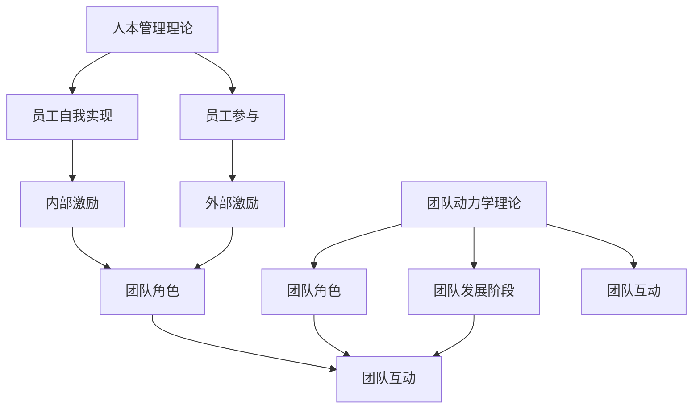

                 

### 引言：团队潜能开发的重要性

在现代企业中，团队效能的发挥对组织成功起到了至关重要的作用。然而，很多团队在实际运作中并未能充分挖掘其成员的潜能，导致资源浪费、效率低下。这种状况的发生，往往源于对团队潜能开发的重视程度不足，以及对团队潜能开发方法的不了解。

团队潜能开发的重要性体现在多个方面。首先，它能够提高团队成员的工作满意度和幸福感，从而增强团队的凝聚力。其次，通过潜能开发，团队成员能够充分发挥自身的能力，为团队贡献更多的价值，从而提升团队的整体绩效。此外，团队潜能开发还有助于激发团队成员的创新意识和创新能力，为组织带来更多的创新成果。

为什么团队潜能开发至关重要？首先，团队是现代企业运作的基本单元。每个团队成员都是团队的重要组成部分，他们的潜能如果得不到充分发挥，团队的效能自然无法达到最佳。其次，随着市场竞争的日益激烈，企业需要不断提高自身的竞争力。而团队潜能开发正是提升企业竞争力的关键之一。通过开发团队成员的潜能，企业可以更好地应对市场变化，实现持续发展。

然而，团队潜能开发并非易事，它面临着一系列挑战。首先，团队成员的个性、能力、兴趣各异，如何根据个体差异进行潜能开发是一个难题。其次，团队协作机制的缺失或不足，也会影响潜能开发的成效。此外，领导者的角色和领导风格对团队潜能开发的影响至关重要，领导者需要具备正确的观念和方法，才能真正发挥领导力。

尽管面临诸多挑战，团队潜能开发也充满了机遇。随着信息技术的发展，各类人才培训和管理工具的出现，为团队潜能开发提供了更多的手段和资源。同时，企业对人才管理和团队建设日益重视，也为团队潜能开发创造了有利的外部环境。

在接下来的章节中，我们将深入探讨团队潜能开发的理论基础、策略和实践方法，通过具体的案例分析和指导，帮助读者全面了解和掌握团队潜能开发的各个方面，从而提升团队的效能和成员的幸福感。通过一步步的分析和思考，我们希望读者能够对团队潜能开发有更深入的认识，并在实际工作中有效应用，实现团队和个人的双赢。

### 团队潜能开发的理论基础

团队潜能开发是一个复杂而多维度的过程，其理论基础涵盖了多个重要领域，包括人本管理理论、员工激励理论和团队动力学理论。这些理论不仅为团队潜能开发提供了理论指导，还帮助我们理解如何通过科学的方法和策略来激发和挖掘团队成员的潜能。

#### 人本管理理论

人本管理理论强调以人为中心的管理理念，认为员工是组织最重要的资源，管理的核心在于激发和提升员工的主观能动性和潜能。这一理论的核心观点包括：

1. **员工自我实现**：管理者的职责不仅是提供工作和报酬，更要帮助员工实现自我价值和发展。员工在实现个人目标的过程中，往往会更加投入和高效。

2. **员工参与**：通过赋予员工更多的参与和决策权，可以提高员工的责任感和归属感，从而激发他们的工作热情和创造力。

3. **人本管理工具**：包括员工满意度调查、职业发展规划、团队建设活动等，都是为了提升员工的主观幸福感和工作动力。

#### 员工激励理论

员工激励理论关注如何通过外部和内部激励手段来提升员工的工作动力和绩效。该理论的核心内容包括：

1. **外部激励**：包括薪资、奖金、福利等物质激励，这些激励可以短期内显著提高员工的工作积极性和生产力。

2. **内部激励**：包括成就认可、晋升机会、学习机会等非物质激励，这些激励可以提升员工的长期满意度和忠诚度。

3. **激励平衡**：在实际管理中，需要根据员工的个性和需求，平衡外部和内部激励，以达到最佳效果。

#### 团队动力学理论

团队动力学理论研究团队内部成员之间的互动关系及其对团队行为和绩效的影响。其核心观点包括：

1. **团队角色**：每个团队成员在团队中扮演着不同的角色，这些角色相互作用，共同影响团队的整体表现。

2. **团队发展阶段**：团队通常会经历形成期、冲突期、规范期和执行期等不同的发展阶段，每个阶段都有不同的挑战和需求。

3. **团队互动**：有效的团队互动可以增强团队成员之间的信任和协作，从而提高团队的整体效能。

#### 核心概念之间的联系与架构

上述三大理论共同构成了团队潜能开发的理论基础，它们之间存在着紧密的联系和相互作用。

- **人本管理理论**为团队潜能开发提供了以人为本的管理理念和方法，强调了员工的自我实现和参与，这是团队潜能开发的前提。

- **员工激励理论**提供了具体的激励手段和策略，通过外部和内部激励来激发和维持团队成员的潜能。

- **团队动力学理论**则从团队内部互动和关系角度出发，探讨了如何通过团队建设和管理来提升团队的整体效能。

为了更好地理解这些核心概念之间的关系，我们可以使用Mermaid流程图来直观展示：



通过Mermaid流程图，我们可以清晰地看到人本管理理论、员工激励理论和团队动力学理论之间的互动关系。这些理论相互补充，共同构成了团队潜能开发的理论框架。

#### 理论在团队潜能开发中的应用

在实际应用中，这些理论为我们提供了多种工具和方法，以帮助团队潜能开发：

- **人本管理理论**：通过职业发展规划和团队建设活动，帮助员工实现自我价值，提高工作满意度和归属感。

- **员工激励理论**：设计合理的薪酬体系、绩效评估机制和晋升政策，激发员工的外部和内部激励，提升工作动力和绩效。

- **团队动力学理论**：通过团队角色定位、发展阶段管理和互动协调，促进团队成员之间的信任和协作，提高团队整体效能。

通过结合这些理论，我们可以系统化地开展团队潜能开发工作，实现团队和个人的共同成长。在接下来的章节中，我们将深入探讨团队潜能挖掘的具体策略和实践方法，帮助读者在实际工作中有效应用这些理论，提升团队效能。

### 团队成员潜能挖掘策略

挖掘团队成员的潜能是一个复杂而精细的过程，需要结合多个策略和方法。以下，我们将详细探讨团队成员潜能挖掘的核心策略，包括个人潜力评估、团队协作机制和个人发展规划。

#### 个人潜力评估

个人潜力评估是挖掘团队成员潜能的第一步，它通过系统化的评估方法，帮助团队了解每位成员的能力、兴趣和动机，从而制定针对性的发展计划。

1. **能力分析**：
   - **技术能力评估**：通过技术面试、项目考核和实际操作，评估成员的专业技能和技术水平。
   - **软技能评估**：包括沟通能力、团队合作、领导力、问题解决能力等，通过行为观察、同事反馈和自我评价进行综合评估。

2. **兴趣与动机分析**：
   - **兴趣调查**：通过问卷调查、面谈等方式，了解成员的兴趣领域和未来职业发展方向。
   - **动机分析**：利用心理测试工具，如动机量表和职业兴趣量表，了解成员的内在动机和驱动因素。

3. **评估方法**：
   - **360度反馈**：通过团队成员、上级和同事的反馈，全面了解成员的表现和潜力。
   - **绩效评估**：结合定量和定性的绩效评估方法，对成员的工作表现进行系统评估。

#### 团队协作机制

团队协作机制是潜能挖掘的重要保障，通过有效的沟通与协调，确保团队成员能够在相互配合中发挥最大潜力。

1. **沟通机制**：
   - **定期会议**：定期召开团队会议，讨论项目进展、问题和解决方案，确保信息的及时传递和反馈。
   - **透明沟通**：建立开放的沟通渠道，鼓励成员分享意见和想法，增强团队凝聚力。

2. **协调机制**：
   - **任务分配**：根据成员的能力和兴趣，合理分配任务，确保每个成员都有发挥潜力的机会。
   - **资源调配**：确保团队成员能够获得必要的资源和支持，如培训、工具和技术支持。

3. **协作工具**：
   - **项目管理软件**：如Jira、Trello等，帮助团队管理任务、追踪进度和协作沟通。
   - **共享平台**：如Confluence、GitLab等，用于文档共享、代码协作和知识管理。

#### 个人发展规划

个人发展规划是挖掘和提升团队成员潜能的重要手段，通过明确的职业目标和成长路径，帮助成员实现自我提升和职业发展。

1. **目标设定**：
   - **短期目标**：设定具体、可衡量的短期目标，如提升某项技能、完成特定项目等。
   - **长期目标**：设定长期的职业发展方向，如晋升、职业转型等。

2. **成长路径**：
   - **技能提升**：通过培训、学习和实践，不断提升专业技能和软技能。
   - **经验积累**：鼓励成员参与多样化的项目和活动，积累丰富的实践经验。

3. **支持与反馈**：
   - **导师制度**：为成员配备导师，提供职业指导和发展建议。
   - **绩效反馈**：定期对成员的绩效进行评估和反馈，帮助成员了解自身的优势和改进方向。

#### 伪代码示例

为了更直观地展示个人潜力评估和团队协作机制，我们可以使用伪代码进行详细描述：

```pseudo
function evaluate_member_potential(member):
    technical_skill_score = assess_technical_skills(member)
    soft_skill_score = assess_soft_skills(member)
    interest_score = assess_interests(member)
    motivation_score = assess_motivations(member)
    total_score = technical_skill_score + soft_skill_score + interest_score + motivation_score
    return total_score

function allocate_tasks(team_members, project):
    for member in team_members:
        member_skill_level = evaluate_member_potential(member)
        member_interest_level = member['interest_level']
        task = find_best_fit_task(member_skill_level, member_interest_level, project)
        assign_task_to_member(member, task)

function communicate_and协调机制(team_members, project):
    schedule_meetings()
    ensure_open_communication_channels()
    use_project_management_tools()

function develop_member_plan(member):
    set_short_term_goals(member)
    set_long_term_goals(member)
    provide_training_and_resources(member)
    assign_mentor_to_member(member)
    conduct_performance_reviews(member)
```

通过上述伪代码，我们可以清晰地看到如何通过评估、任务分配、沟通协调和规划发展来挖掘和提升团队成员的潜能。

综上所述，团队成员潜能挖掘策略是一个系统化的过程，需要综合考虑个人潜力评估、团队协作机制和个人发展规划。通过科学的方法和策略，我们可以最大限度地激发团队成员的潜能，提升团队的整体效能和成员的幸福感。

### 培养高绩效团队

要培养高绩效团队，需要从团队绩效评估、团队文化建设和团队价值观与愿景三个方面入手。以下将详细探讨这三个方面的核心内容，帮助团队实现高效能和持续成长。

#### 团队绩效评估

团队绩效评估是衡量团队工作表现的重要手段，通过设定科学的绩效指标和建立有效的反馈机制，可以全面了解团队的工作成效，为改进和优化提供依据。

1. **绩效指标设定**：
   - **量化指标**：包括项目完成时间、任务完成率、代码质量、客户满意度等，这些指标可以直接反映团队的工作效率和质量。
   - **定性指标**：包括团队协作、沟通效果、创新能力、解决问题能力等，这些指标需要通过定性分析进行评估，但同样重要。
   - **平衡指标**：在设定绩效指标时，应兼顾短期和长期目标，既关注团队当前的工作表现，也关注团队的长远发展。

2. **绩效反馈机制**：
   - **定期反馈**：通过定期绩效评估会议，及时向团队成员反馈工作表现，提供改进建议和方向。
   - **即时反馈**：在项目执行过程中，通过即时沟通和反馈，及时解决问题，确保工作顺利进行。
   - **透明反馈**：确保绩效反馈过程的透明度，让团队成员了解评价标准和评价结果，增强反馈的有效性。

3. **改进措施**：
   - **针对弱项**：分析绩效评估结果，找出团队存在的不足，制定针对性的改进措施。
   - **持续优化**：通过持续监控和调整绩效指标和反馈机制，确保团队绩效不断提升。

#### 建立高效团队文化

团队文化是团队高效运作的重要基石，通过培养积极的团队文化，可以增强团队成员的归属感和凝聚力，提高团队的整体绩效。

1. **价值观与愿景**：
   - **共同价值观**：确立团队的核心价值观，如诚信、创新、责任、共赢等，让每位成员都认同并践行这些价值观。
   - **愿景**：制定团队的长期愿景，明确团队的目标和发展方向，激发团队成员的斗志和使命感。

2. **文化建设方法**：
   - **领导示范**：领导者应以身作则，践行团队价值观，通过言行树立榜样，影响团队成员。
   - **团队活动**：组织各类团队活动，如团队建设训练、文化活动、团建旅游等，增强团队成员之间的沟通和协作。
   - **表彰激励**：设立团队表彰机制，对表现优秀的团队成员进行表彰和奖励，激发团队成员的积极性和创造力。

3. **文化维护**：
   - **持续培养**：定期进行团队文化建设培训，让团队成员深刻理解和认同团队文化。
   - **文化评估**：定期评估团队文化现状，找出存在的问题和不足，及时调整和优化。

#### 团队价值观与愿景

团队价值观与愿景是团队文化的核心，它们不仅指引团队的行为和决策，还激励团队成员为实现团队目标而努力。

1. **价值观**：
   - **诚信**：坚持诚信原则，确保团队工作真实可靠。
   - **创新**：鼓励创新思维，推动团队不断进步。
   - **责任**：每位成员都要对工作负责，对团队负责。
   - **共赢**：追求团队与个人的共同发展，实现共赢。

2. **愿景**：
   - **成为行业领先团队**：通过不断提升团队绩效和创新能力，成为行业中的佼佼者。
   - **员工幸福感**：打造一个让员工有归属感、成就感的工作环境，提升员工幸福感。
   - **持续成长**：保持持续学习的态度，不断提升团队的综合实力。

通过上述措施，团队可以有效建立和维持积极的团队文化，为团队的高绩效提供坚实的保障。在接下来的章节中，我们将继续探讨如何提升团队的创新能力，以适应不断变化的市场环境。

### 提升团队创新能力

在当今快速变化的市场环境中，团队创新能力成为企业保持竞争力的重要因素。为了激发团队的创新能力，我们需要从创新思维训练和创新机制建设两方面进行系统性的提升。

#### 创新思维训练

创新思维训练是提高团队创新能力的首要步骤，通过一系列方法和技巧，可以培养团队成员的创新意识和创新能力。

1. **脑力激荡技巧**：
   - **头脑风暴**：通过集体讨论，鼓励团队成员自由发表意见，不分对错，激发创新灵感。
   - **思维导图**：利用思维导图工具，将团队成员的创新点子进行可视化整理，帮助团队理清思路，发现潜在的创新路径。
   - **交叉思维**：通过引入不同的观点和想法，促进团队成员进行横向和纵向思考，打破思维定势，激发新的创意。

2. **案例研究**：
   - **成功案例**：通过研究国内外知名企业的创新案例，了解他们的创新策略和方法，借鉴他们的成功经验。
   - **失败案例**：分析创新失败的案例，了解失败的原因，从中吸取教训，避免在团队创新中重复犯错。

#### 创新机制建设

创新机制建设是确保团队创新能力持续提升的重要保障，通过建立科学有效的创新流程和管理机制，可以为团队创新提供良好的环境和资源。

1. **创新激励政策**：
   - **奖励机制**：设立创新奖励制度，对在创新工作中表现突出的团队成员给予表彰和奖励，激发创新热情。
   - **晋升机制**：将创新成果纳入员工晋升考核，鼓励团队成员积极参与创新活动，提高创新积极性。

2. **创新流程管理**：
   - **需求分析**：明确团队创新的目标和需求，通过市场调研、用户反馈等方式，了解客户需求和市场趋势。
   - **方案设计**：鼓励团队成员提出创新方案，进行方案评估和筛选，确保创新方案的可行性和实用性。
   - **实施与推广**：对选定的创新方案进行实施，并进行效果评估和反馈，不断优化创新成果。

3. **资源支持**：
   - **技术支持**：为团队提供先进的技术工具和资源，如云计算平台、人工智能工具等，助力团队创新。
   - **资金支持**：为创新项目提供必要的资金支持，确保创新活动顺利进行。
   - **时间支持**：为团队成员提供充足的时间进行创新活动，减少日常工作对创新的干扰。

#### 伪代码示例

为了更直观地展示创新思维训练和创新机制建设，我们可以使用伪代码进行详细描述：

```pseudo
function brainstorm_ideas(topic):
    ideas = []
    for member in team_members:
        idea = member.generate_idea(topic)
        ideas.append(idea)
    return ideas

function create_mind_map(ideas):
    mind_map = MindMap()
    for idea in ideas:
        mind_map.add_node(idea)
    return mind_map

function evaluate_innovation_schemes(schemes):
    for scheme in schemes:
        feasibility = assess_feasibility(scheme)
        practicality = assess_practicality(scheme)
        if feasibility and practicality:
            selected_scheme = scheme
    return selected_scheme

function implement_innovation(scheme):
    success_rate = implement_scheme(scheme)
    feedback = collect_feedback(success_rate)
    if success_rate > threshold:
        scheme perfected = true
    return perfected_scheme

function reward_innovation(member, innovation):
    reward = calculate_reward(innovation)
    member['performance'] += reward
    promote_member_if_eligible(member)
```

通过上述伪代码，我们可以清晰地看到如何通过脑力激荡、思维导图、方案评估和实施创新，以及如何建立奖励机制来提升团队创新能力。

综上所述，提升团队创新能力需要从思维训练和机制建设两方面入手，通过系统的训练和方法，可以激发团队成员的创新潜力，建立科学有效的创新流程和管理机制，为团队带来持续的创新成果。在接下来的章节中，我们将探讨领导力在团队潜能开发中的作用，帮助领导者更好地支持和激发团队创新。

### 领导力与团队潜能开发

领导力在团队潜能开发中起着至关重要的作用。一个优秀的领导者不仅能够激发团队成员的潜力，还能营造一个积极向上的工作环境，促进团队的持续成长。本文将深入探讨领导风格与团队潜能开发的关系，以及领导者如何通过角色转变支持团队成长。

#### 领导风格与团队潜能开发

领导风格对团队潜能开发有着深远的影响。不同的领导风格会对团队成员的行为、态度和表现产生不同的效果。

1. **权威型领导风格**：
   - **优点**：权威型领导者能够迅速作出决策，确保团队目标的实现。
   - **缺点**：这种风格可能导致团队成员缺乏自主性和创新能力，长期依赖领导者的决策，不利于团队潜能的开发。

2. **民主型领导风格**：
   - **优点**：民主型领导者鼓励团队成员参与决策，增强团队成员的参与感和归属感，有助于激发团队成员的积极性和创造力。
   - **缺点**：决策过程可能较为缓慢，有时难以迅速应对紧急情况。

3. **变革型领导风格**：
   - **优点**：变革型领导者通过激励和启发团队成员，激发他们的内在动机，推动团队不断进步和创新。
   - **缺点**：这种风格需要领导者具备较强的沟通能力和影响力，否则可能导致团队士气低落。

#### 领导行为与团队潜能开发

领导者的行为对团队潜能开发有着直接的影响。以下是一些有效的领导行为，有助于提升团队潜能：

1. **明确目标**：领导者需要清晰地设定团队目标，并将目标传达给每个成员，确保团队成员了解自己的职责和期望。

2. **激励员工**：领导者通过认可和奖励，激励团队成员发挥最佳水平。同时，领导者应关注团队成员的内在动机，通过提供成长机会和挑战性任务来激发他们的潜能。

3. **沟通与反馈**：领导者应保持开放的沟通渠道，鼓励团队成员提出建议和反馈，及时解决团队中的问题和矛盾。定期进行绩效反馈，帮助团队成员了解自己的表现和改进方向。

4. **支持与指导**：领导者应提供必要的支持和资源，帮助团队成员克服工作中的困难，同时给予指导和建议，促进团队成员的技能提升和职业发展。

#### 领导者角色转变

领导者需要根据团队发展阶段和成员需求进行角色转变，以支持团队成长。

1. **从管理者到领导者的转变**：
   - **管理者关注任务**：管理者主要关注任务的完成和目标的实现。
   - **领导者关注人**：领导者则更关注团队成员的需求和成长，通过激励和支持帮助团队成员发挥潜能。

2. **领导者支持团队成长的方法**：
   - **培养接班人**：领导者应培养具有潜力的团队成员，为未来的领导层储备人才。
   - **推动职业发展**：为团队成员提供职业发展规划和培训机会，帮助他们不断提升专业技能和管理能力。
   - **营造积极氛围**：领导者应营造一个积极向上、鼓励创新的工作环境，激发团队成员的创造力和积极性。

#### 案例研究

以下是一个企业领导者通过角色转变支持团队成长的案例：

- **案例背景**：某企业是一家科技创新型企业，由于市场竞争激烈，企业需要不断进行技术创新以保持竞争力。然而，团队在技术创新方面存在一定的瓶颈，成员的潜力未能得到充分发挥。

- **领导者的角色转变**：
  - **从管理者到领导者的转变**：企业领导者意识到，单纯的管理者角色已不足以推动团队发展，决定转变为领导者，更加关注团队成员的需求和成长。
  - **支持团队成长**：领导者通过以下措施支持团队成长：
    - **培养接班人**：为团队成员提供职业发展规划，培养具有潜力的成员担任关键岗位，为未来领导层储备人才。
    - **推动职业发展**：定期为团队成员提供技能培训和职业发展指导，帮助他们提升专业技能和管理能力。
    - **营造积极氛围**：鼓励团队成员提出创新想法，建立开放的创新机制，营造一个积极向上、鼓励创新的工作环境。

- **成效**：
  - **技术创新提升**：通过领导者的支持，团队成员的积极性和创新能力得到了显著提升，企业成功推出了多项创新产品，市场份额得到扩大。
  - **团队凝聚力增强**：团队成员感受到领导者的关心和支持，团队的凝聚力和归属感得到了增强，整体绩效显著提升。

通过这个案例，我们可以看到领导者通过角色转变和有效支持，如何激发团队的潜能，实现团队和个人的共同成长。在接下来的章节中，我们将通过具体案例和实践经验，进一步探讨团队潜能开发的实际应用。

### 团队潜能开发实践案例

#### 成功案例解析

**案例一：某企业的团队潜能开发实践**

1. **背景介绍**：某企业是一家全球领先的科技公司，专注于研发和销售高性能计算机硬件。随着市场竞争的加剧，公司面临巨大的压力，需要通过提升团队效能来保持竞争力。

2. **团队潜能开发策略**：
   - **个人潜力评估**：公司通过360度反馈和绩效评估，对每位员工的能力、兴趣和动机进行详细评估，制定个性化的职业发展计划。
   - **团队协作机制**：公司引入敏捷开发方法，建立跨职能团队，加强内部沟通和协作，确保项目顺利进行。
   - **个人发展规划**：为每位员工提供定期的职业发展培训和晋升机会，鼓励员工参与多样化项目和挑战，不断提升自身能力。

3. **实践成效**：
   - **绩效提升**：通过系统化的潜能开发，团队成员的工作效率和质量显著提升，项目完成时间缩短，客户满意度提高。
   - **创新能力增强**：团队成员的创新能力得到激发，成功推出多款创新产品，市场份额持续扩大。

**案例二：另一个成功团队的成长历程**

1. **背景介绍**：某互联网初创公司，专注于开发智能健康管理系统。公司初创阶段，团队规模较小，但需要迅速扩展业务。

2. **团队潜能开发策略**：
   - **明确目标**：公司通过制定清晰的愿景和目标，确保每位成员了解自己的职责和公司的战略方向。
   - **文化建设**：公司注重团队文化建设，通过团队活动、培训和文化传播，增强团队成员的归属感和凝聚力。
   - **创新机制**：公司建立创新激励机制，鼓励员工提出创新建议，通过内部竞赛和项目资助，支持员工的创新实践。

3. **实践成效**：
   - **团队凝聚力提升**：通过积极的文化建设和创新机制，团队成员之间的信任和合作显著增强，团队凝聚力得到提升。
   - **业务拓展**：团队成员在创新和协作的基础上，成功开发出多款市场竞争力强的产品，公司业务迅速扩展，市场份额不断扩大。

#### 失败案例分析

**案例一：团队潜能开发的陷阱**

1. **背景介绍**：某企业是一家快速发展的消费品公司，希望通过团队潜能开发提升业绩。

2. **失败原因**：
   - **缺乏明确策略**：公司在团队潜能开发方面缺乏明确的策略和规划，导致开发工作流于形式，未能达到预期效果。
   - **忽视个体差异**：公司对团队成员的个性和需求缺乏深入了解，未能根据个体差异进行有针对性的潜能开发。

3. **改进措施**：
   - **制定明确策略**：公司应制定详细的团队潜能开发计划，明确目标、方法和步骤，确保开发工作有据可依。
   - **关注个体差异**：通过深入了解每位成员的个性和需求，制定个性化的潜能开发方案，确保每位成员都能得到有效的支持和发展。

**案例二：如何避免团队潜能开发的误区**

1. **背景介绍**：某中型制造企业，希望通过团队潜能开发提升生产效率。

2. **失败原因**：
   - **激励政策不当**：公司采取了单一的激励政策，未能充分考虑员工的个体差异和需求，导致员工参与度不高。
   - **反馈机制不足**：公司在潜能开发过程中缺乏有效的反馈机制，未能及时了解员工的感受和需求，导致开发工作效果不佳。

3. **改进措施**：
   - **个性化激励**：根据员工的个性和需求，设计多样化的激励政策，提高员工的参与度和积极性。
   - **建立反馈机制**：定期收集员工的反馈和建议，建立有效的反馈机制，及时调整和优化潜能开发策略。

通过以上成功和失败案例的解析，我们可以看到，团队潜能开发需要系统化、个性化的策略和执行，只有充分了解和满足团队成员的需求，才能实现真正的潜能开发，提升团队的整体效能。

### 总结与展望

团队潜能开发是一个复杂而多维度的过程，涉及个人潜力评估、团队协作机制、领导力培养等多个方面。本文从多个角度详细探讨了团队潜能开发的理论基础和实践策略，旨在帮助读者全面了解和掌握这一重要领域。

首先，团队潜能开发的重要性在于它能提高团队成员的工作满意度和幸福感，从而增强团队的凝聚力。通过科学的方法和策略，团队可以充分发挥每位成员的潜能，实现团队和个人的双赢。本文详细介绍了人本管理理论、员工激励理论和团队动力学理论，这些理论为团队潜能开发提供了坚实的理论基础。

在具体策略方面，本文提出了个人潜力评估、团队协作机制和个人发展规划三大核心策略。通过系统化的个人潜力评估，团队可以深入了解每位成员的能力、兴趣和动机，从而制定有针对性的发展计划。团队协作机制的建设，通过有效的沟通和协调，确保团队成员在相互配合中发挥最大潜力。个人发展规划则通过明确的职业目标和成长路径，帮助成员实现自我提升和职业发展。

此外，本文还探讨了培养高绩效团队的方法，包括团队绩效评估、团队文化建设、团队价值观与愿景的设定等。创新能力的提升也是团队潜能开发的重要一环，通过创新思维训练和创新机制建设，团队可以不断推动创新，保持竞争力。

尽管团队潜能开发面临诸多挑战，如团队成员个性差异、团队协作机制的不足等，但也充满机遇。随着信息技术的发展，各类人才培训和管理工具的出现，为团队潜能开发提供了更多的手段和资源。未来，团队潜能开发将更加注重个性化和智能化，利用大数据和人工智能技术，实现精准的人才管理和团队建设。

### 未来团队潜能开发的趋势

未来团队潜能开发将呈现以下几个趋势：

1. **个性化发展**：随着个性化和定制化服务的兴起，团队潜能开发也将更加注重个体差异，通过精准评估和个性化激励，满足不同成员的发展需求。

2. **智能化管理**：人工智能和大数据技术的应用，将使得团队潜能开发更加智能化。通过数据分析和预测，可以更科学地评估和开发团队成员的潜能。

3. **跨界融合**：随着各个领域的融合，团队将更加多元化，跨界合作将成为常态。团队潜能开发也将更加注重跨界思维和创新能力的培养。

4. **持续学习**：终身学习和持续学习将成为团队成员的必备能力。团队潜能开发将更加注重为成员提供学习和发展机会，以适应快速变化的市场环境。

总之，团队潜能开发是一个持续不断的过程，需要企业和管理者持续关注和投入。通过科学的方法和策略，团队可以不断挖掘和提升成员的潜能，实现团队和个人的共同成长，为企业的持续发展提供强大动力。

### 附录

在本书的附录部分，我们将提供相关的参考文献以及团队潜能开发工具与方法指南，帮助读者进一步深入了解和掌握团队潜能开发的各个方面。

#### 参考文献

1. **Dessler, G. (2017).** *Human Resource Management*. 15th Edition. South-Western Cengage Learning.
2. **Herzberg, F., Mausner, B., & Snyderman, B. B. (1993).** *The Motivation to Work*. Meridian.
3. **Tannenbaum, S. I., & Schmidt, W. H. (1973).** *How to Choose a Leadership Pattern*. *Administrative Science Quarterly*, 18(2), 247-263.
4. **Bass, B. M. (1998).** *Leadership and Performance Beyond Expectations*. **Free Press**.
5. **Hackman, J. R., & Oldham, G. R. (1976).** *Work Redesign*. **Pergamon Press**.
6. **Katzenbach, J. R., & Smith, D. K. (1993).** *The Wisdom of Teams*. **Harvard Business Review**, 71(2), 133-143.
7. **Liden, R. C., & Maslach, C. (1988).** *The Effects of Leadership Style and Leader Behavior on Subordinate Trust and Sales Performance*. *Journal of Marketing Research*, 25(1), 29-39.

#### 团队潜能开发工具与方法指南

1. **工具**：
   - **360度反馈工具**：用于全面收集团队成员的反馈，帮助进行个人潜力评估。
   - **绩效管理软件**：如Jira、Asana，用于团队协作和任务管理。
   - **职业发展评估工具**：如Myers-Briggs Type Indicator (MBTI)、Strong Interest Inventory，用于个性分析和职业规划。

2. **方法指南**：
   - **个人潜力评估方法**：通过行为观察、同事反馈和自我评价，进行全面评估。
   - **团队协作机制建设方法**：通过定期会议、沟通工具和协作软件，建立高效的团队协作机制。
   - **个人发展规划方法**：通过设定短期和长期目标，提供培训和发展机会，制定职业规划。

通过这些工具和方法，读者可以更加系统地开展团队潜能开发工作，提高团队效能和成员的幸福感。希望本附录能够为读者提供实用的指导和支持。

