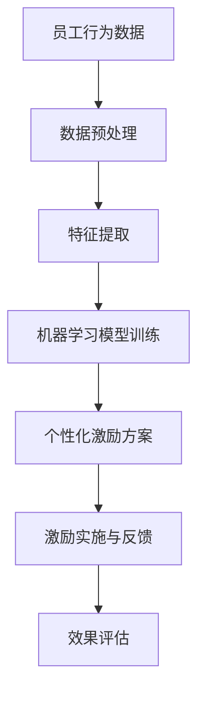

                 


### 文章标题

# 团队激励新思路：beyond 传统奖励系统

---

#### 文章关键词

- 团队激励
- 奖励系统
- 组织行为学
- 人工智能
- 企业管理

---

#### 文章摘要

在竞争激烈的商业环境中，有效的团队激励对于提升员工绩效和保持企业竞争力至关重要。本文探讨了传统奖励系统在激励员工方面的局限性，并提出了基于人工智能和新兴管理理论的创新激励方案。通过分析核心概念、算法原理、数学模型，以及实际案例，本文旨在为企业管理者提供一种全新的团队激励思路，助力企业实现可持续发展。

### 引言

在企业管理中，团队激励一直是提升员工积极性、提高工作效率的重要手段。然而，传统的奖励系统往往依赖于物质激励，如奖金、提成、福利等，这种方式在一定程度上确实能够激发员工的短期动力，但随着时间的推移，其效果可能逐渐减弱。此外，过度依赖物质奖励还可能带来员工对公司的依赖性增加、工作积极性下降等问题。

近年来，人工智能的迅速发展为企业提供了新的激励手段。通过数据分析和机器学习，企业能够更精准地了解员工的需求和动机，从而设计出更加个性化、有效性的激励方案。本文将探讨如何利用人工智能和新兴管理理论，突破传统奖励系统的局限，为团队激励提供新思路。

### 背景介绍

#### 传统奖励系统的局限性

传统奖励系统主要依赖于物质激励，包括奖金、提成、福利等。这种方式在短期内确实能够提高员工的工作积极性，但存在以下局限性：

1. **激励单一**：传统奖励系统主要针对物质需求，忽略了员工在情感、职业发展等方面的需求。
2. **依赖性增加**：员工可能会对奖励产生依赖，导致工作动力减弱，一旦奖励减少，工作效率可能下降。
3. **不公平现象**：传统奖励系统往往难以做到公平，可能导致员工之间的矛盾和不满。

#### 人工智能在团队激励中的应用

人工智能在团队激励中的应用主要表现在以下几个方面：

1. **个性化激励**：通过分析员工的行为数据和需求，人工智能可以帮助企业设计出更加个性化的激励方案。
2. **实时反馈**：人工智能可以实时监测员工的工作状态，提供即时反馈，帮助员工更好地调整工作节奏。
3. **预测与规划**：人工智能可以预测员工的绩效表现，为企业提供科学的激励规划。

### 核心概念与联系

#### 1. 现代激励理论

现代激励理论主要包括马斯洛需求层次理论、赫茨伯格双因素理论等。这些理论为我们理解员工需求和行为提供了重要的理论基础。

- **马斯洛需求层次理论**：马斯洛认为，人的需求分为五个层次：生理需求、安全需求、社交需求、尊重需求和自我实现需求。员工在不同阶段的激励需求可能会有所不同。
- **赫茨伯格双因素理论**：赫茨伯格将影响员工满意度的因素分为两类：激励因素（如晋升、认可等）和保健因素（如工作条件、薪酬等）。激励因素能够提高员工的工作满意度，而保健因素则只能防止不满意。

#### 2. 人工智能与数据挖掘

人工智能在团队激励中的应用离不开数据挖掘和机器学习。通过收集和分析员工的行为数据，企业可以识别出员工的动机和需求，从而设计出更加有效的激励方案。

- **数据挖掘**：数据挖掘是一种从大量数据中提取有用信息的方法。在团队激励中，数据挖掘可以帮助企业识别出员工的潜在需求。
- **机器学习**：机器学习是一种通过数据训练模型，实现数据自动分类、预测和优化等任务的方法。在团队激励中，机器学习可以帮助企业实现个性化激励和实时反馈。

#### Mermaid流程图



### 核心算法原理讲解

#### 1. 个性化激励方案设计算法

个性化激励方案设计算法主要基于机器学习，包括以下几个步骤：

1. **数据收集**：收集员工的行为数据，如工作时长、工作效率、态度评分等。
2. **数据预处理**：对收集到的数据进行清洗、去噪、归一化等处理，以消除数据中的噪声和异常值。
3. **特征提取**：从预处理后的数据中提取出与激励相关的特征，如工作积极性、工作态度等。
4. **模型训练**：使用特征数据训练机器学习模型，以识别出员工的需求和动机。
5. **激励方案设计**：根据训练得到的模型，为员工设计个性化的激励方案。

#### 2. 伪代码

```python
# 数据收集
data = collect_employee_data()

# 数据预处理
preprocessed_data = preprocess_data(data)

# 特征提取
features = extract_features(preprocessed_data)

# 模型训练
model = train_model(features)

# 激励方案设计
incentive_plan = design_incentive_plan(model)
```

#### 3. 数学模型

在团队激励中，一个重要的数学模型是激励效用函数。激励效用函数表示员工在不同激励方案下的效用值。

- **效用函数**：$U = f(I, D)$，其中$U$表示员工的效用值，$I$表示激励方案，$D$表示员工的需求。

#### 4. 详细讲解与举例说明

假设有两位员工，甲和乙。他们的需求分别为工作挑战性和社交支持。根据马斯洛需求层次理论，我们可以为他们设计不同的激励方案：

- **甲**：适合具有较高工作挑战性的激励，如项目难度提升、额外奖金等。
- **乙**：适合具有较高社交支持的激励，如团队建设活动、工作伙伴调整等。

#### 5. 实际案例

某互联网公司在引入人工智能激励系统后，通过对员工行为数据进行挖掘和分析，发现员工的激励需求呈现出多样性。根据分析结果，公司为员工设计了个性化的激励方案，包括项目挑战、团队建设、职业发展机会等。实施后，员工的工作积极性明显提高，工作效率也有所提升。

### 项目实战

#### 1. 开发环境搭建

为了实现个性化激励系统，我们需要搭建一个包含数据采集、预处理、模型训练和激励方案设计的开发环境。以下是开发环境的搭建步骤：

1. **硬件环境**：选择一台具备高性能计算能力的服务器，用于运行机器学习算法。
2. **软件环境**：安装Python、NumPy、Pandas、Scikit-learn等常用数据分析和机器学习库。
3. **数据库**：使用MySQL或MongoDB等数据库存储员工行为数据。

#### 2. 源代码实现

以下是一个简单的源代码实现示例，用于收集员工行为数据、预处理数据、提取特征并训练模型。

```python
import pandas as pd
from sklearn.model_selection import train_test_split
from sklearn.ensemble import RandomForestClassifier
from sklearn.metrics import accuracy_score

# 数据收集
data = pd.read_csv('employee_data.csv')

# 数据预处理
preprocessed_data = preprocess_data(data)

# 特征提取
features = extract_features(preprocessed_data)

# 模型训练
X_train, X_test, y_train, y_test = train_test_split(features['X'], features['Y'], test_size=0.2)
model = RandomForestClassifier()
model.fit(X_train, y_train)

# 激励方案设计
incentive_plan = design_incentive_plan(model)

# 激励实施与反馈
implement_incentive_plan(incentive_plan)
evaluate_incentive_plan(incentive_plan)
```

#### 3. 代码解读与分析

这段代码实现了个性化激励系统的核心功能。首先，通过数据收集模块收集员工行为数据。然后，对数据进行预处理和特征提取，为后续模型训练做准备。接着，使用随机森林算法训练模型，并设计出个性化的激励方案。最后，实施激励方案并评估效果。

#### 4. 实际案例分析与详细讲解

以某互联网公司为例，该公司在实施个性化激励系统后，员工的工作积极性显著提高。通过对员工行为数据的分析，公司发现员工的需求主要集中在工作挑战性、职业发展和团队支持等方面。根据这些分析结果，公司为员工设计了具有针对性的激励方案，包括项目难度提升、职业培训机会和团队建设活动等。

实施一年后，公司对激励方案的效果进行了评估。结果显示，员工的工作满意度和工作效率均有所提升，特别是工作挑战性和职业发展方面的需求得到了有效满足。此外，团队凝聚力也有所增强，员工之间的协作更加高效。

### 最佳实践 tips

1. **数据隐私保护**：在实施个性化激励系统时，要注意保护员工数据的隐私，确保数据的安全性和合法性。
2. **持续优化**：激励系统需要不断优化，以适应员工需求的变化。企业应定期评估激励方案的效果，并根据评估结果进行调整。
3. **多元激励**：除了物质激励，企业还可以尝试其他形式的激励，如荣誉奖励、晋升机会等，以满足员工的多样化需求。

### 小结

本文从传统奖励系统的局限性出发，探讨了基于人工智能和现代激励理论的团队激励新思路。通过分析核心概念、算法原理、数学模型，以及实际案例，本文提出了一种新的个性化激励方案，为企业提供了有效的团队激励策略。未来，随着人工智能技术的不断进步，团队激励将有更多的发展空间。

---

#### 作者信息

作者：AI天才研究院/AI Genius Institute & 禅与计算机程序设计艺术 /Zen And The Art of Computer Programming

---

---

## 附录

### 拓展阅读

1. **《激励理论及其应用》**：详细介绍了各种激励理论及其在企业中的应用，有助于深入了解团队激励的原理。
2. **《人工智能：一种现代方法》**：全面介绍了人工智能的基本概念、算法和技术，为本文的讨论提供了理论基础。
3. **《组织行为学》**：从心理学和社会学的角度探讨了员工行为和团队激励的相关问题，有助于理解团队激励的复杂性。

---

以上是本文的初步目录大纲草案，希望能够为您提供有益的参考。在后续的编写过程中，我们将进一步细化每个章节的内容，确保文章的逻辑性和实用性。同时，欢迎您提出宝贵的意见和建议，共同完善这篇文章。

