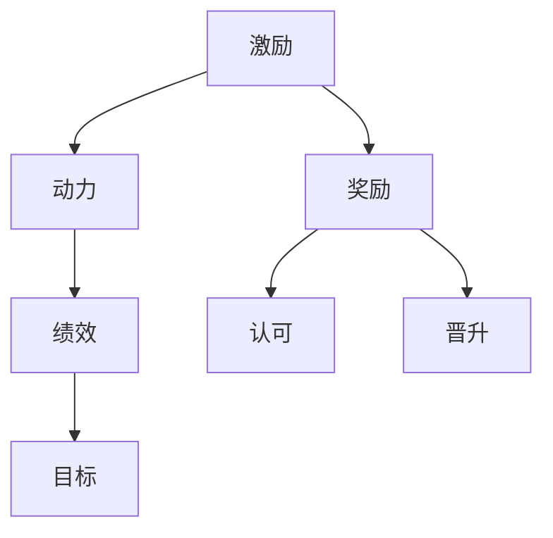

                 


### 第1章：团队激励的基本概念

#### 1.1 团队激励的定义

团队激励，顾名思义，是指通过一系列的措施和方法，激发团队成员的工作积极性、主动性和创造力，从而提高团队整体绩效和达成组织目标的过程。在当今竞争激烈的市场环境中，团队激励已成为企业成功的关键因素之一。

**核心概念与联系：**

团队激励涉及多个核心概念，包括激励、动力、绩效和目标等。这些概念之间的关系可以用以下Mermaid流程图表示：



在这个流程图中，激励是起点，通过激发团队成员的内在动力，进而提升团队绩效，实现组织目标。同时，激励可以通过外部奖励（如奖励、认可、晋升）来实现。

#### 1.2 团队激励的类型

团队激励的类型可以分为内在激励和外在激励两种。内在激励主要来源于团队成员自身的内在动力，如对工作的热爱、成就感、自我实现等。外在激励则是通过外部奖励来激发团队成员的工作积极性，如奖金、晋升、荣誉等。

**伪代码：**

```python
def incentive_types():
    inner_incentives = ["内在成就感", "自我实现", "工作热情"]
    outer_incentives = ["奖金", "晋升机会", "荣誉表彰"]
    return inner_incentives, outer_incentives
```

内在激励和外在激励各有优缺点，企业需要根据实际情况和团队特点，灵活运用不同的激励方式。

#### 1.3 团队激励的作用与意义

团队激励在企业管理中具有重要作用，主要体现在以下几个方面：

1. 提高员工满意度：通过有效的团队激励，可以增强员工的工作积极性，提高员工的满意度和忠诚度。

2. 提升团队绩效：团队激励可以激发团队成员的潜力，提高团队的整体绩效，实现组织目标。

3. 促进员工成长：团队激励可以鼓励员工不断学习和进步，促进员工的个人成长和职业发展。

4. 增强团队凝聚力：通过团队激励，可以增强团队成员之间的信任和协作，提高团队凝聚力。

#### 1.4 团队激励的现状与挑战

尽管团队激励在企业管理中具有重要作用，但当前仍存在一些挑战和问题，如：

1. 激励方式单一：许多企业仍然采用传统的激励方式，如奖金和晋升，忽视了内在激励的重要性。

2. 激励不公平：部分企业存在激励不公平的问题，导致员工士气低落，影响团队绩效。

3. 激励效果不佳：部分企业的激励措施未能达到预期效果，甚至产生负面效应。

4. 激励与组织文化不匹配：部分企业的激励措施与组织文化相悖，导致激励效果不佳。

为了应对这些挑战，企业需要不断探索和创新团队激励方法，结合内在动力与外部奖励，提高团队激励的有效性。

### 摘要

本文旨在探讨团队激励的基本概念、类型、作用以及面临的挑战。通过分析内在动力与外部奖励的结合，本文提出了基于内在动力的激励策略和基于外部奖励的激励策略，并分析了团队激励在企业管理中的现状与挑战。文章最后提出了相应的解决方案，以期为企业管理者提供有益的参考。

# 团队激励新方法：结合内在动力与外部奖励

关键词：团队激励、内在动力、外部奖励、激励策略、企业管理

摘要：本文深入探讨了团队激励的基本概念、类型和作用，分析了内在动力与外部奖励的结合，并提出了基于内在动力的激励策略和基于外部奖励的激励策略。通过案例研究和实践分析，本文揭示了团队激励在企业管理中的现状与挑战，并提出了相应的解决方案。

## 目录

### 第一部分：团队激励理论基础

#### 第1章：团队激励的基本概念

1.1. 团队激励的定义

1.2. 团队激励的类型

1.3. 团队激励的作用与意义

1.4. 团队激励的现状与挑战

#### 第2章：内在动力与外部奖励

2.1. 内在动力的概念与作用

2.2. 外部奖励的形式与效果

2.3. 内在动力与外部奖励的结合

#### 第3章：激励理论概述

3.1. 期望理论

3.2. 成就激励理论

3.3. 公平理论

3.4. 双因素理论

### 第二部分：团队激励策略与实践

#### 第4章：基于内在动力的激励策略

4.1. 提高工作意义的激励策略

4.2. 赋予更多自主权的激励策略

4.3. 提升工作挑战性的激励策略

4.4. 增强团队归属感的激励策略

#### 第5章：基于外部奖励的激励策略

5.1. 绩效奖金的激励策略

5.2. 员工福利的激励策略

5.3. 员工晋升的激励策略

5.4. 荣誉与认可的激励策略

#### 第6章：团队激励策略的组合与应用

6.1. 制定团队激励计划的原则

6.2. 团队激励策略的评估与调整

6.3. 团队激励策略在不同场景的应用

#### 第7章：团队激励案例研究

7.1. 成功的团队激励案例解析

7.2. 失败的团队激励案例分析

7.3. 团队激励案例的启示与借鉴

### 第三部分：团队激励的挑战与解决方案

#### 第8章：团队激励的挑战与问题

8.1. 激励不足的问题

8.2. 激励过度的问题

8.3. 激励不公平的问题

#### 第9章：团队激励的解决方案

9.1. 提高员工满意度的解决方案

9.2. 增强团队凝聚力的解决方案

9.3. 实现激励公平的解决方案

#### 第10章：团队激励的未来发展趋势

10.1. 新型激励方式的发展

10.2. 激励与员工发展相结合的趋势

10.3. 激励与组织文化融合的趋势

## 第1章：团队激励的基本概念

### 1.1 团队激励的定义

团队激励，简而言之，是指通过一系列的策略和措施，激发团队成员的工作积极性、主动性和创造力，从而提高团队的整体绩效，实现组织目标的过程。在现代企业管理中，团队激励已经成为提升企业竞争力、实现持续发展的关键因素。

**核心概念与联系：**

团队激励涉及多个核心概念，包括激励、动力、绩效和目标等。这些概念之间的关系可以用以下Mermaid流程图表示：


在这个流程图中，激励是起点，通过激发团队成员的内在动力，进而提升团队绩效，实现组织目标。同时，激励可以通过外部奖励（如奖励、认可、晋升）来实现。

#### 1.2 团队激励的类型

团队激励的类型可以分为内在激励和外在激励两种。内在激励主要来源于团队成员自身的内在动力，如对工作的热爱、成就感、自我实现等。外在激励则是通过外部奖励来激发团队成员的工作积极性，如奖金、晋升、荣誉等。

**伪代码：**

```python
def incentive_types():
    inner_incentives = ["内在成就感", "自我实现", "工作热情"]
    outer_incentives = ["奖金", "晋升机会", "荣誉表彰"]
    return inner_incentives, outer_incentives
```

内在激励和外在激励各有优缺点，企业需要根据实际情况和团队特点，灵活运用不同的激励方式。

#### 1.3 团队激励的作用与意义

团队激励在企业管理中具有重要作用，主要体现在以下几个方面：

1. 提高员工满意度：通过有效的团队激励，可以增强员工的工作积极性，提高员工的满意度和忠诚度。

2. 提升团队绩效：团队激励可以激发团队成员的潜力，提高团队的整体绩效，实现组织目标。

3. 促进员工成长：团队激励可以鼓励员工不断学习和进步，促进员工的个人成长和职业发展。

4. 增强团队凝聚力：通过团队激励，可以增强团队成员之间的信任和协作，提高团队凝聚力。

#### 1.4 团队激励的现状与挑战

尽管团队激励在企业管理中具有重要作用，但当前仍存在一些挑战和问题，如：

1. 激励方式单一：许多企业仍然采用传统的激励方式，如奖金和晋升，忽视了内在激励的重要性。

2. 激励不公平：部分企业存在激励不公平的问题，导致员工士气低落，影响团队绩效。

3. 激励效果不佳：部分企业的激励措施未能达到预期效果，甚至产生负面效应。

4. 激励与组织文化不匹配：部分企业的激励措施与组织文化相悖，导致激励效果不佳。

为了应对这些挑战，企业需要不断探索和创新团队激励方法，结合内在动力与外部奖励，提高团队激励的有效性。

### 第2章：内在动力与外部奖励

#### 2.1 内在动力的概念与作用

内在动力，又称内在激励，是指个体基于自身兴趣、热情和价值观等因素，主动参与工作并追求成就的一种心理状态。内在动力与外部奖励不同，它不依赖于外部刺激，而是源于个体内心深处的驱动力。

**伪代码：**

```python
def intrinsic_motivation():
    actions = ["完成任务", "追求创新", "享受工作"]
    return actions
```

内在动力在团队激励中起着至关重要的作用。首先，它可以激发团队成员的主动性和创造性，提高工作效率和质量。其次，内在动力可以增强员工的归属感和满意度，降低离职率。最后，内在动力有助于培养员工的长期职业发展，提高组织的核心竞争力。

#### 2.2 外部奖励的形式与效果

外部奖励，又称外在激励，是指企业通过物质或非物质的形式，对员工的工作表现给予认可和奖励。外部奖励的形式多样，包括奖金、晋升、荣誉、培训等。

**数学公式：**

$$
\text{奖励效果} = \text{奖励金额} \times \text{激励系数}
$$

外部奖励的效果取决于奖励金额和激励系数。奖励金额越高，激励效果越强；激励系数越大，激励效果越明显。然而，外部奖励也存在一定的局限性，如过度依赖可能导致员工产生依赖心理，忽视内在动力。

#### 2.3 内在动力与外部奖励的结合

内在动力和外部奖励在团队激励中相辅相成，共同发挥作用。企业可以通过以下方式结合内在动力与外部奖励：

1. 确定合理的奖励标准：根据员工的绩效和贡献，制定合理的奖励标准，使外部奖励具有公平性和激励性。

2. 激发内在动力：通过赋予员工更多自主权、提高工作挑战性、增强团队归属感等方式，激发员工的内在动力。

3. 强化外部奖励与内在动力的联系：通过奖励与员工期望和价值观的匹配，使外部奖励成为内在动力的强化因素。

4. 定期评估和调整：定期评估团队激励策略的效果，根据评估结果调整奖励标准和激励方式，以实现最佳激励效果。

### 第3章：激励理论概述

#### 3.1 期望理论

期望理论是激励理论的一种，由维克多·弗鲁姆（Victor H. Vroom）提出。期望理论认为，个体在面临决策时，会根据三个因素来判断是否采取行动：期望值、工具性和价值。

**伪代码：**

```python
def expectation_theory(action, outcome, utility):
    probability_of_outcome = calculate_probability(action, outcome)
    expected_utility = probability_of_outcome * utility
    return expected_utility
```

期望理论的核心公式为：

$$
\text{激励力} = \text{期望值} \times \text{工具性} \times \text{价值}
$$

在团队激励中，期望理论可以帮助管理者了解员工对激励措施的期望，从而制定更具针对性的激励策略。

#### 3.2 成就激励理论

成就激励理论是由大卫·麦克利兰（David McClelland）提出的。成就激励理论认为，个体的成就需求是激励其行为的重要驱动力。成就需求强烈的个体倾向于追求挑战性的任务，并从中获得满足感。

**伪代码：**

```python
def achievement_motivation(challenge_level, satisfaction_level):
    if challenge_level > satisfaction_level:
        motivation = "high"
    else:
        motivation = "low"
    return motivation
```

成就激励理论强调，管理者应根据员工的成就需求，设置合适的挑战性任务，以激发其工作积极性。

#### 3.3 公平理论

公平理论是由亚当斯（John Stacy Adams）提出的。公平理论认为，个体在比较自己的努力、贡献与回报时，会判断自己是否受到公平对待。公平理论的公式为：

$$
\text{公平感} = \frac{\text{个人回报}}{\text{个人投入}} / \frac{\text{参照者回报}}{\text{参照者投入}}
$$

在团队激励中，公平理论提醒管理者要关注员工之间的公平感，避免因不公平待遇导致员工流失和团队冲突。

#### 3.4 双因素理论

双因素理论是由赫茨伯格（Frederick Herzberg）提出的。双因素理论将工作激励分为两种类型：激励因素和保健因素。激励因素能够直接满足员工的需求，激发其工作积极性；保健因素则能够预防和消除员工的负面情绪。

**伪代码：**

```python
def dual_factor_theory(motivators, hygiene_factors):
    if motivators > hygiene_factors:
        motivation = "high"
    else:
        motivation = "low"
    return motivation
```

在团队激励中，管理者应关注激励因素，提高员工的工作满意度；同时，也要关注保健因素，确保员工的基本需求得到满足。

### 第4章：基于内在动力的激励策略

#### 4.1 提高工作意义的激励策略

提高工作意义是激发团队成员内在动力的重要策略。管理者可以通过以下方法提高工作意义：

1. 明确工作目标：确保团队成员了解工作目标，明确自己的工作对组织和社会的价值。

2. 增强工作挑战性：设置具有挑战性的任务，激发员工的兴趣和好奇心。

3. 赋予更多自主权：让员工参与决策，赋予其更多的自主权，提高工作的趣味性和成就感。

4. 强调工作价值：向员工传达工作的价值，让他们意识到自己的工作对团队和社会的贡献。

**案例研究：**

- **案例1**：谷歌的“20%时间”政策，允许员工将20%的工作时间用于自己感兴趣的项目，提高了员工的工作热情和创新能力。

#### 4.2 赋予更多自主权的激励策略

赋予员工更多自主权是激发内在动力的重要策略。管理者可以通过以下方法赋予员工更多自主权：

1. 自主设定目标：允许员工自主设定工作目标，提高工作的自主性和成就感。

2. 自主选择任务：让员工自主选择感兴趣的任务，提高工作的积极性和创造性。

3. 自主安排工作时间：允许员工自主安排工作时间，提高工作效率和工作质量。

4. 自主评估绩效：让员工参与绩效评估，提高工作的公平性和透明度。

**案例研究：**

- **案例2**：微软的“内部创新竞赛”，鼓励员工自主提出创新项目，并提供资源和支持，提高了员工的自主权和创新能力。

#### 4.3 提升工作挑战性的激励策略

提升工作挑战性是激发内在动力的重要策略。管理者可以通过以下方法提升工作挑战性：

1. 设置具有挑战性的目标：为员工设定具有挑战性的目标，激发他们的斗志和竞争力。

2. 提供培训和发展机会：为员工提供培训和发展机会，提高他们的工作技能和综合素质。

3. 分享成功案例：分享成功的案例和经验，激发员工的工作热情和信心。

4. 鼓励创新思维：鼓励员工发挥创新思维，解决工作中的难题，提高工作效率和质量。

**案例研究：**

- **案例3**：苹果公司的“创新实验室”，为员工提供一个开放、自由的环境，鼓励他们进行创新和实验，取得了许多突破性的成果。

#### 4.4 增强团队归属感的激励策略

增强团队归属感是激发内在动力的重要策略。管理者可以通过以下方法增强团队归属感：

1. 建立良好的团队文化：培养积极向上的团队文化，增强团队成员之间的信任和协作。

2. 组织团队活动：定期组织团队活动，加强团队成员之间的沟通和交流。

3. 重视员工福利：关注员工的福利需求，提高员工的工作满意度和幸福感。

4. 鼓励员工参与决策：让员工参与团队决策，提高他们的参与感和归属感。

**案例研究：**

- **案例4**：华为的“员工满意度调查”，通过定期调查员工的需求和建议，及时调整团队政策，提高员工的归属感和满意度。

### 第5章：基于外部奖励的激励策略

#### 5.1 绩效奖金的激励策略

绩效奖金是一种常见的外部奖励方式，通过给予员工额外的奖金来激励其工作表现。管理者可以通过以下方法制定绩效奖金策略：

1. 明确绩效指标：制定明确的绩效指标，确保奖金分配的公平性和激励性。

2. 定期评估绩效：定期对员工进行绩效评估，确保奖金分配的准确性和及时性。

3. 设定合理的奖金比例：根据员工的绩效水平和企业承受能力，设定合理的奖金比例。

4. 奖金发放的透明化：确保奖金发放过程的透明化，提高员工的公平感和满意度。

**案例研究：**

- **案例5**：阿里巴巴的“绩效奖金制度”，根据员工的绩效表现和团队目标，发放不同的绩效奖金，激发了员工的工作积极性。

#### 5.2 员工福利的激励策略

员工福利是企业为员工提供的除工资之外的福利待遇，如医疗保险、住房补贴、带薪休假等。管理者可以通过以下方法制定员工福利策略：

1. 丰富员工福利内容：根据员工的实际需求，丰富员工福利内容，提高员工的工作满意度和忠诚度。

2. 灵活调整福利标准：根据企业的发展情况和员工反馈，灵活调整福利标准，确保福利的公平性和竞争力。

3. 加强福利宣传：加强员工福利的宣传力度，提高员工对福利的知晓度和满意度。

4. 增强福利的个性化：针对不同员工的个性化需求，提供个性化的福利方案，提高福利的针对性和有效性。

**案例研究：**

- **案例6**：腾讯的“员工福利制度”，为员工提供全面的福利待遇，包括医疗保险、住房补贴、带薪休假等，提高了员工的工作满意度和忠诚度。

#### 5.3 员工晋升的激励策略

员工晋升是企业为员工提供的发展机会，通过晋升来激励员工的工作积极性和职业发展。管理者可以通过以下方法制定员工晋升策略：

1. 设定明确的晋升路径：为员工设定明确的晋升路径，确保员工有明确的职业发展目标。

2. 优化晋升评价体系：建立科学的晋升评价体系，确保晋升过程的公平性和透明度。

3. 提供晋升培训：为晋升中的员工提供培训，提高他们的综合素质和职业能力。

4. 激励员工积极进取：通过激励措施，鼓励员工积极进取，争取晋升机会。

**案例研究：**

- **案例7**：阿里巴巴的“晋升机制”，通过科学的晋升评价体系和丰富的晋升培训，激发了员工的工作积极性和职业发展动力。

#### 5.4 荣誉与认可的激励策略

荣誉与认可是一种重要且有效的外部奖励方式，通过给予员工荣誉和认可来激励其工作表现。管理者可以通过以下方法制定荣誉与认可策略：

1. 设定明确的荣誉标准：根据企业目标和价值观，设定明确的荣誉标准，确保荣誉的公正性和权威性。

2. 定期举办表彰活动：定期举办表彰活动，对表现优秀的员工进行表彰和奖励。

3. 强化荣誉的仪式感：通过仪式感，增强荣誉的庄严感和神圣感，提高员工的荣誉感和成就感。

4. 鼓励员工积极参与：鼓励员工积极参与荣誉评选和表彰活动，提高他们的参与感和荣誉感。

**案例研究：**

- **案例8**：华为的“年度优秀员工评选”，通过严格的评选标准和隆重的表彰活动，激发了员工的工作热情和荣誉感。

### 第6章：团队激励策略的组合与应用

#### 6.1 制定团队激励计划的原则

为了提高团队激励的有效性，管理者在制定团队激励计划时应遵循以下原则：

1. 公平性原则：确保激励计划的公平性，使每位员工都有公平的竞争机会和奖励机会。

2. 激励性原则：激励计划应具有激励性，能够激发员工的工作热情和积极性。

3. 可行性原则：激励计划应具备可行性，能够在实际工作中得到有效执行。

4. 可持续性原则：激励计划应具备可持续性，能够长期激励员工，促进团队的发展。

#### 6.2 团队激励策略的评估与调整

为了确保团队激励策略的有效性，管理者需要定期评估激励策略的实施效果，并根据评估结果进行调整。评估和调整的具体步骤如下：

1. 确定评估指标：根据团队目标和企业价值观，确定评估激励策略的指标。

2. 收集数据：收集与激励策略相关的数据，如员工满意度、团队绩效、离职率等。

3. 分析数据：对收集到的数据进行详细分析，判断激励策略的效果。

4. 调整策略：根据分析结果，对激励策略进行优化和调整，以提高其有效性。

#### 6.3 团队激励策略在不同场景的应用

团队激励策略的应用场景多种多样，管理者需要根据不同的场景选择合适的激励策略。以下列举了几个常见场景及其适用的激励策略：

1. 项目型团队：对于项目型团队，可以采用绩效奖金、项目奖励等激励策略，以激发团队成员的积极性和创造力。

2. 创新型团队：对于创新型团队，可以采用自主权激励、挑战性任务激励等策略，以激发团队成员的创新思维和创造力。

3. 稳定型团队：对于稳定型团队，可以采用晋升激励、荣誉表彰等策略，以激发团队成员的职业发展动力和荣誉感。

4. 多元化团队：对于多元化团队，可以采用文化融合激励、团队活动激励等策略，以增强团队凝聚力和协作性。

### 第7章：团队激励案例研究

#### 7.1 成功的团队激励案例解析

在企业管理中，成功的团队激励案例具有重要的借鉴意义。以下列举了几个成功的团队激励案例，并进行了详细解析：

1. **案例1：谷歌的‘20%时间’政策**

   谷歌的‘20%时间’政策允许员工将20%的工作时间用于自己感兴趣的项目。这一政策激发了员工的工作热情和创造力，促进了公司创新和成长。

   **解析**：

   - **成功原因**：谷歌的‘20%时间’政策赋予了员工更多的自主权和创新空间，满足了员工对自主性和成就感的内在需求。
   - **启示**：企业可以借鉴谷歌的做法，赋予员工更多的自主权和创新空间，以提高员工的工作积极性和创新能力。

2. **案例2：阿里巴巴的‘合伙人制度’**

   阿里巴巴的‘合伙人制度’通过将员工纳入公司合伙人，给予他们股权激励和职业发展机会。这一制度激发了员工的工作热情和忠诚度，推动了公司的快速发展。

   **解析**：

   - **成功原因**：阿里巴巴的‘合伙人制度’将员工与企业利益紧密结合，满足了员工对职业发展和财富增值的内在需求。
   - **启示**：企业可以借鉴阿里巴巴的做法，建立合伙人制度，以激发员工的工作热情和忠诚度。

3. **案例3：华为的‘奋斗者文化’**

   华为的‘奋斗者文化’强调员工要具备拼搏精神和工作热情。通过设立‘奋斗者’评选机制，华为激励员工为公司发展贡献力量。

   **解析**：

   - **成功原因**：华为的‘奋斗者文化’营造了积极向上的工作氛围，激发了员工的工作热情和奋斗精神。
   - **启示**：企业可以借鉴华为的做法，培养奋斗者文化，以激发员工的工作热情和奋斗精神。

#### 7.2 失败的团队激励案例分析

在团队激励中，失败的案例也具有重要的借鉴意义。以下列举了几个失败的团队激励案例，并进行了详细分析：

1. **案例1：某企业的‘绩效考核制度’**

   某企业实行的‘绩效考核制度’过于强调绩效指标，导致员工过度追求短期绩效，忽视了长期发展和团队合作。

   **解析**：

   - **失败原因**：该企业的‘绩效考核制度’过于注重绩效指标，忽视了员工的内在需求和团队合作，导致员工产生抵触情绪。
   - **启示**：企业应平衡绩效指标和员工需求，避免过度强调绩效，导致员工产生消极情绪。

2. **案例2：某企业的‘奖励制度’**

   某企业实行的‘奖励制度’过于单一，只关注绩效奖金，忽视了员工的内在需求和个性化激励。

   **解析**：

   - **失败原因**：该企业的‘奖励制度’过于单一，无法满足员工的多样化需求，导致激励效果不佳。
   - **启示**：企业应多样化激励方式，结合内在动力和外在奖励，提高激励效果。

3. **案例3：某企业的‘团队活动’**

   某企业组织的‘团队活动’过于形式化，缺乏实际意义，导致员工参与度低，团队凝聚力不足。

   **解析**：

   - **失败原因**：该企业的‘团队活动’缺乏实际意义和互动性，无法激发员工的参与热情和团队凝聚力。
   - **启示**：企业应注重团队活动的实际意义和互动性，提高员工的参与度和团队凝聚力。

#### 7.3 团队激励案例的启示与借鉴

成功的团队激励案例和失败的团队激励案例都为企业提供了宝贵的经验和教训。以下总结了团队激励案例的启示与借鉴：

1. **关注员工需求**：企业应关注员工的内在需求，结合外在奖励，提高激励效果。

2. **多样化激励方式**：企业应多样化激励方式，结合内在动力和外在奖励，满足员工的多样化需求。

3. **平衡绩效与团队**：企业应平衡绩效指标和团队合作，避免过度强调绩效，导致团队分裂。

4. **注重实际效果**：企业应注重激励策略的实际效果，定期评估和调整激励策略，提高激励的针对性和有效性。

### 第8章：团队激励的挑战与解决方案

#### 8.1 激励不足的问题

激励不足是团队激励中常见的问题，可能导致员工工作积极性不高、团队绩效低下。以下分析了激励不足的原因和解决方案：

1. **原因**：

   - **激励政策不合理**：企业制定的激励政策可能过于苛刻或过于宽松，无法满足员工的期望。

   - **激励方式单一**：企业过于依赖某种激励方式，如绩效奖金，忽视了其他激励手段。

   - **激励不公平**：企业存在激励不公平现象，导致员工产生不满情绪。

2. **解决方案**：

   - **完善激励政策**：企业应完善激励政策，确保激励政策合理、公正、透明。

   - **多样化激励方式**：企业应多样化激励方式，结合内在动力和外在奖励，满足员工的多样化需求。

   - **建立公平的激励制度**：企业应建立公平的激励制度，确保激励政策对每位员工都公平对待。

#### 8.2 激励过度的问题

激励过度可能导致员工产生依赖心理，降低工作的自主性和创造性。以下分析了激励过度的原因和解决方案：

1. **原因**：

   - **激励频率过高**：企业过于频繁地给予激励，导致员工对激励产生依赖。

   - **激励金额过大**：企业给予的激励金额过大，导致员工产生过度追求奖励的心态。

   - **激励与实际贡献不匹配**：企业给予的激励与员工的实际贡献不匹配，导致员工产生不公平感。

2. **解决方案**：

   - **合理控制激励频率**：企业应合理控制激励频率，避免过度激励。

   - **设定合理的激励金额**：企业应设定合理的激励金额，避免过大的激励金额导致员工依赖。

   - **完善绩效评价体系**：企业应完善绩效评价体系，确保激励与员工的实际贡献相匹配。

#### 8.3 激励不公平的问题

激励不公平可能导致员工士气低落、团队凝聚力下降。以下分析了激励不公平的原因和解决方案：

1. **原因**：

   - **评估标准不透明**：企业评估标准不透明，导致员工对激励分配产生质疑。

   - **激励分配不合理**：企业激励分配不合理，导致员工产生不公平感。

   - **员工期望与实际不符**：员工对激励期望与实际分配不符，导致不满情绪。

2. **解决方案**：

   - **透明化评估标准**：企业应透明化评估标准，确保激励分配的公正性和透明性。

   - **建立公平的激励分配机制**：企业应建立公平的激励分配机制，确保每位员工都有公平的竞争机会。

   - **沟通与反馈**：企业应与员工进行有效沟通，了解员工的期望和反馈，及时调整激励策略。

### 第9章：团队激励的解决方案

#### 9.1 提高员工满意度的解决方案

提高员工满意度是团队激励的重要目标，以下提出了一些提高员工满意度的解决方案：

1. **改善工作环境**：企业应提供舒适、安全、宽敞的工作环境，提升员工的工作体验。

2. **关注员工需求**：企业应关注员工的个性化需求，如职业发展、家庭关怀等，提供个性化的解决方案。

3. **加强员工培训**：企业应加强员工培训，提高员工的技能和综合素质，增强员工的职业发展信心。

4. **建立良好的沟通机制**：企业应建立良好的沟通机制，确保员工与管理层之间的信息畅通，提升员工的参与感和满意度。

#### 9.2 增强团队凝聚力的解决方案

增强团队凝聚力有助于提高团队绩效和员工满意度，以下提出了一些增强团队凝聚力的解决方案：

1. **建立团队文化**：企业应建立积极向上的团队文化，培养员工的归属感和认同感。

2. **组织团队活动**：企业应定期组织团队活动，加强团队成员之间的沟通和交流，增强团队凝聚力。

3. **设置共同目标**：企业应设置共同的目标，让团队成员明确自己的责任和使命，增强团队的协作精神。

4. **建立信任机制**：企业应建立信任机制，促进团队成员之间的信任和合作，提高团队凝聚力。

#### 9.3 实现激励公平的解决方案

实现激励公平是团队激励的关键，以下提出了一些实现激励公平的解决方案：

1. **完善绩效评价体系**：企业应完善绩效评价体系，确保评价标准公正、客观，评价结果准确、透明。

2. **建立公平的激励分配机制**：企业应建立公平的激励分配机制，确保每位员工都有公平的竞争机会和奖励机会。

3. **加强监督和审计**：企业应加强监督和审计，确保激励分配的公正性和透明性，防止不公平现象的发生。

4. **加强员工沟通**：企业应加强员工沟通，了解员工的期望和反馈，及时调整激励策略，确保激励的公平性。

### 第10章：团队激励的未来发展趋势

#### 10.1 新型激励方式的发展

随着时代的发展和技术的进步，新型激励方式不断涌现。以下是一些未来可能发展的新型激励方式：

1. **个性化激励**：企业应根据员工的个性、兴趣和需求，制定个性化的激励方案，提高激励的针对性和有效性。

2. **虚拟激励**：企业可以利用虚拟现实、增强现实等技术，创造一个全新的工作环境，激发员工的创造力和创新精神。

3. **绿色激励**：企业可以倡导绿色环保理念，鼓励员工参与环保活动，实现工作与环保的平衡。

4. **跨界激励**：企业可以与外部合作伙伴合作，开展跨界项目，激发员工的跨界思维和创新能力。

#### 10.2 激励与员工发展相结合的趋势

随着员工对职业发展的需求不断提升，激励与员工发展相结合的趋势愈发明显。以下是一些未来可能的发展方向：

1. **职业发展激励**：企业可以提供多样化的职业发展路径，激发员工的职业发展动力。

2. **成长激励**：企业可以鼓励员工不断学习和成长，提供成长激励，如培训、晋升等。

3. **荣誉激励**：企业可以设立荣誉激励，对在职业生涯中取得显著成绩的员工进行表彰和奖励。

4. **生活激励**：企业可以关注员工的生活需求，提供生活激励，如住房补贴、家庭关怀等。

#### 10.3 激励与组织文化融合的趋势

激励与组织文化融合是未来团队激励的发展方向。以下是一些可能的发展方向：

1. **文化导向激励**：企业可以根据组织文化，制定与之相匹配的激励方案，激发员工的认同感和归属感。

2. **价值观激励**：企业可以倡导和传播组织价值观，将价值观融入激励制度，提高员工的价值观认同。

3. **文化传承激励**：企业可以通过文化传承活动，激励员工传承和发扬组织文化。

4. **文化创新激励**：企业可以鼓励员工创新组织文化，为组织文化注入新的活力。

### 作者信息

作者：AI天才研究院/AI Genius Institute & 禅与计算机程序设计艺术 /Zen And The Art of Computer Programming

本文由AI天才研究院与禅与计算机程序设计艺术共同撰写，旨在探讨团队激励的新方法，结合内在动力与外部奖励，为企业提供实用的团队激励策略。

