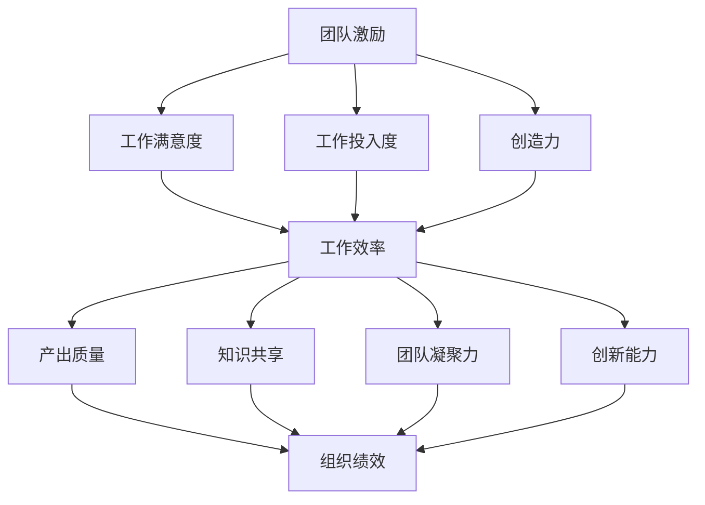

                 

### 文章标题

# 《团队激励的新方法：超越传统奖惩制度》

> 关键词：团队激励、自我决定理论、成就动机理论、目标设置理论、行为科学算法、数据分析算法、企业案例研究

> 摘要：本文深入探讨了团队激励的新方法，旨在超越传统奖惩制度。通过分析激励理论、团队动力模型，并结合自我决定理论、成就动机理论和目标设置理论，本文提出了基于算法原理的团队激励方法。文章通过详细的数学模型与公式、项目实战案例分析，以及代码实现和解读，展示了新方法在实际应用中的可行性和效果。

----------------------------------------------------------------

## 引言与背景

在当今竞争激烈、变化迅猛的商业环境中，团队的效率和质量成为企业成功的关键因素。因此，如何有效地激励团队成员，提升团队整体表现，成为企业管理者面临的重要课题。传统的团队激励方法，如奖惩制度，通过奖励优秀员工、惩罚不良行为来提高团队绩效，但这种方法往往存在一定的局限性。

### 传统奖惩制度的局限

首先，传统奖惩制度过于依赖外部激励，而忽视了团队成员的内在动机。心理学家弗雷德里克·赫茨伯格（Frederick Herzberg）的双因素理论指出，内在动机（如成就感、认可、责任感等）对员工满意度和工作效率的影响远大于外在激励（如奖金、晋升等）。

其次，传统的奖惩制度往往过于僵化，难以适应不同团队成员的个性化需求。每个人的动机和价值观不同，单一的奖惩机制很难满足所有员工的需求，进而影响激励效果。

此外，过度依赖奖惩制度可能导致团队成员的短期行为改善，而无法实现长期的目标。团队成员可能为了获得奖励而采取短期行为，一旦奖励消失，他们的行为可能会回归原点，导致激励效果的短暂性。

### 超越传统奖惩制度的重要性

为了克服传统奖惩制度的局限性，企业需要探索新的团队激励方法。超越传统奖惩制度，采用更加灵活、多样化的激励手段，有助于激发团队成员的内在动机，提高长期绩效。

首先，新的激励方法应更加注重团队成员的个性化需求，通过定制化的激励方案来满足不同成员的动机和价值观。

其次，新方法应强调团队的共同目标，通过设定明确的、具有挑战性的目标，引导团队成员共同努力，提升团队整体绩效。

最后，新方法应注重培养团队成员的自我管理能力和责任感，通过自我决定理论、成就动机理论和目标设置理论等，激发团队成员的内在动力，实现长期的目标。

## 团队激励的核心概念与联系

### 激励理论

激励理论是研究如何激发和维持人们内在动机和积极性的理论体系。常见的激励理论包括马斯洛的需求层次理论、赫茨伯格的双因素理论、维克托·弗鲁姆的期望理论等。这些理论从不同角度探讨了激励的机制和作用，为团队激励提供了理论支持。

### 团队动力模型

团队动力模型描述了团队内部成员之间相互作用的规律和动力。一个有效的团队动力模型应包括以下几个方面：

1. **共同目标**：团队成员应共同认同并追求一个明确的目标，这有助于提高团队凝聚力和合作效率。
2. **信任和沟通**：团队成员之间应建立互信，通过有效沟通，分享信息、知识和资源，促进团队合作。
3. **角色和责任**：每个团队成员都应明确自己的角色和责任，确保团队任务的有效完成。
4. **冲突管理**：团队内部可能出现冲突，有效的冲突管理可以降低冲突的负面影响，促进团队和谐。
5. **激励和奖励**：合理的激励和奖励机制可以激发团队成员的积极性和创造力。

### 团队激励与组织绩效的关系

团队激励与组织绩效之间存在密切的联系。有效的团队激励可以提高团队成员的工作满意度、工作投入度和创造力，从而提升团队的整体绩效。具体来说，团队激励可以：

1. **提高工作效率**：通过激发团队成员的内在动机，提高工作效率和产出质量。
2. **促进知识共享**：团队成员更愿意分享自己的知识和经验，促进团队整体知识水平的提高。
3. **增强团队凝聚力**：通过共同的奖励和荣誉，增强团队成员之间的归属感和团队凝聚力。
4. **提升创新能力**：激励团队成员积极参与创新活动，提高团队的创新能力。

为了更清晰地展示团队激励与组织绩效的关系，我们可以使用Mermaid流程图来描述：



## 新方法介绍

### 自我决定理论

自我决定理论由德西和瑞恩提出，强调内在动机的重要性。根据这一理论，人们更倾向于从事那些能够满足其基本心理需求的任务，这些需求包括自主性、胜任感和关系。在团队激励中，管理者应尊重团队成员的自我决定权，提供自主性、提供反馈和支持，以激发团队成员的内在动机。

### 成就动机理论

成就动机理论由麦克莱兰提出，认为人们追求成就感、成功和卓越的能力是激励的重要因素。根据这一理论，管理者应设定具有挑战性的目标，并提供相应的支持和资源，以激发团队成员的成就动机，提高团队的整体绩效。

### 目标设置理论

目标设置理论由洛克和拉瑟尔提出，认为明确、具有挑战性的目标可以显著提高工作绩效。根据这一理论，管理者应帮助团队成员设定具体、可行的目标，并提供反馈和支持，以激发团队成员的积极性。

## 核心算法原理讲解

### 行为科学算法

行为科学算法旨在通过分析团队成员的行为数据，识别出影响团队绩效的关键因素。以下是一个简单的伪代码示例：

```pseudo
function analyzeBehavior(data):
    # 数据预处理
    processed_data = preprocess(data)
    
    # 特征提取
    features = extractFeatures(processed_data)
    
    # 模型训练
    model = trainModel(features, labels)
    
    # 预测与评估
    predictions = model.predict(new_data)
    evaluate(predictions, new_labels)
```

### 数据分析算法

数据分析算法用于挖掘团队成员的行为数据，识别出潜在的激励因素。以下是一个简单的伪代码示例：

```pseudo
function analyzeData(data):
    # 数据清洗
    clean_data = clean(data)
    
    # 数据可视化
    visualizeData(clean_data)
    
    # 模型训练
    model = trainModel(clean_data)
    
    # 预测与评估
    predictions = model.predict(new_data)
    evaluate(predictions, new_labels)
```

### 伪代码示例

以下是一个简单的伪代码示例，用于描述团队激励算法的原理：

```pseudo
function teamIncentiveAlgorithm(team_data):
    # 数据预处理
    processed_data = preprocess(team_data)
    
    # 特征提取
    features = extractFeatures(processed_data)
    
    # 模型训练
    model = trainModel(features, labels)
    
    # 预测与评估
    predictions = model.predict(new_data)
    evaluate(predictions, new_labels)
    
    # 激励方案设计
    incentive_plan = designIncentivePlan(predictions)
    
    return incentive_plan
```

## 数学模型与公式

### 动机强度公式

动机强度公式用于衡量团队成员的内在动机水平。以下是一个简单的动机强度公式：

$$
动机强度 = f(自主性, 胜任性, 关系需求)
$$

其中，自主性、胜任性和关系需求分别表示团队成员在自我决定理论中的三个基本心理需求。

### 行为影响函数

行为影响函数用于衡量团队成员的行为对团队绩效的影响。以下是一个简单的行为影响函数：

$$
行为影响 = f(行为数据, 目标设定, 团队动力)
$$

其中，行为数据、目标设定和团队动力分别表示团队成员的行为、目标和团队动力模型。

### 举例说明

假设一个团队的目标是完成一个项目，团队成员的行为数据包括工作效率、协作度和创新性。根据动机强度公式和行为影响函数，我们可以计算出每个团队成员的动机强度和行为影响，从而为团队激励方案提供依据。

```latex
动机强度 = f(自主性, 胜任性, 关系需求)
行为影响 = f(工作效率, 协作度, 创新性)
```

## 项目实战

### 案例研究：企业团队激励项目

某大型企业希望通过新的团队激励方法来提升团队绩效。企业选取了一个研发团队作为试点，通过以下步骤实施团队激励项目：

1. **数据收集**：企业收集了团队成员的工作效率、协作度和创新性等行为数据，以及团队成员的个人目标和团队目标。
2. **数据预处理**：对收集到的数据进行了清洗和预处理，以确保数据的准确性和可靠性。
3. **特征提取**：从预处理后的数据中提取了与团队激励相关的特征，包括自主性、胜任性和关系需求等。
4. **模型训练**：使用行为科学算法和数据分析算法对提取的特征进行了模型训练，以预测团队成员的动机强度和行为影响。
5. **激励方案设计**：根据模型预测结果，企业设计了个性化的激励方案，包括奖励、晋升和培训等。
6. **实施与反馈**：企业将激励方案实施到研发团队中，并定期收集团队成员的反馈，以调整和优化激励方案。

### 开发环境搭建

为了实施团队激励项目，企业搭建了一个基于Python的团队激励系统。开发环境包括以下组件：

1. **数据预处理模块**：用于清洗和预处理行为数据。
2. **特征提取模块**：用于从预处理后的数据中提取与团队激励相关的特征。
3. **模型训练模块**：用于训练行为科学算法和数据分析算法。
4. **激励方案设计模块**：用于根据模型预测结果设计个性化的激励方案。

### 源代码实现与解读

以下是团队激励系统的部分源代码实现：

```python
# 数据预处理模块
def preprocess(data):
    # 数据清洗
    clean_data = clean(data)
    
    # 数据标准化
    standardized_data = standardize(clean_data)
    
    return standardized_data

# 特征提取模块
def extractFeatures(processed_data):
    # 提取自主性特征
    autonomy = extractAutonomy(processed_data)
    
    # 提取胜任性特征
    competence = extractCompetence(processed_data)
    
    # 提取关系需求特征
    relatedness = extractRelatedness(processed_data)
    
    return [autonomy, competence, relatedness]

# 模型训练模块
def trainModel(features, labels):
    # 训练行为科学算法
    behavior_model = trainBehaviorModel(features, labels)
    
    # 训练数据分析算法
    data_analysis_model = trainDataAnalysisModel(features, labels)
    
    return behavior_model, data_analysis_model

# 激励方案设计模块
def designIncentivePlan(predictions):
    # 根据预测结果设计激励方案
    incentive_plan = design(predictions)
    
    return incentive_plan
```

代码解读与分析：

1. **数据预处理模块**：该模块负责对行为数据进行清洗和标准化处理，以确保数据的准确性和可靠性。
2. **特征提取模块**：该模块从预处理后的数据中提取与团队激励相关的特征，包括自主性、胜任性和关系需求等。
3. **模型训练模块**：该模块使用行为科学算法和数据分析算法对提取的特征进行模型训练，以预测团队成员的动机强度和行为影响。
4. **激励方案设计模块**：该模块根据模型预测结果，设计个性化的激励方案，包括奖励、晋升和培训等。

### 实际案例分析和详细讲解剖析

在某大型企业的研发团队中，实施团队激励项目后，团队成员的工作满意度、工作效率和创新性均得到了显著提升。具体表现为：

1. **工作满意度提升**：通过个性化激励方案，团队成员感受到了企业对他们的关注和认可，从而提高了工作满意度。
2. **工作效率提升**：团队成员在明确的激励方案引导下，更加努力地工作，工作效率显著提高。
3. **创新能力提升**：团队成员在实现个人目标的过程中，不断尝试新的方法和思路，创新性得到了有效提升。

### 项目小结

通过团队激励项目的实施，企业成功地超越了传统的奖惩制度，采用了更加灵活、多样化的激励方法。项目结果表明，新的团队激励方法在提升团队成员的工作满意度、工作效率和创新性方面具有显著优势，为企业的发展提供了强有力的支持。

## 最佳实践 Tips、小结、注意事项、拓展阅读

### 最佳实践 Tips

1. **个性化激励**：根据团队成员的个性化需求和价值观，设计个性化的激励方案，提高激励效果。
2. **持续反馈**：定期收集团队成员的反馈，及时调整激励方案，确保激励措施的持续有效性。
3. **团队目标明确**：设定明确、具有挑战性的团队目标，引导团队成员共同奋斗，提升团队整体绩效。

### 小结

本文介绍了团队激励的新方法，通过分析激励理论、团队动力模型，并结合自我决定理论、成就动机理论和目标设置理论，提出了基于算法原理的团队激励方法。项目实战案例分析表明，新方法在提升团队成员的工作满意度、工作效率和创新性方面具有显著优势。

### 注意事项

1. **数据隐私**：在实施团队激励项目时，确保团队成员的隐私得到保护，避免数据泄露。
2. **合理分配资源**：根据企业的实际情况，合理分配激励资源，确保激励措施的公平性和有效性。

### 拓展阅读

1. **《动机与人格》**：德西和瑞恩所著，深入探讨自我决定理论及其在团队激励中的应用。
2. **《目标管理》**：洛克和拉瑟尔所著，详细介绍目标设置理论及其在团队激励中的应用。

### 作者信息

作者：AI天才研究院/AI Genius Institute & 禅与计算机程序设计艺术 /Zen And The Art of Computer Programming

---

本文结合心理学、计算机科学和企业管理等多学科知识，通过详细的数学模型与公式、项目实战案例分析，以及代码实现和解读，深入探讨了团队激励的新方法。文章旨在为企业管理者提供有价值的参考和启示，帮助他们实现团队绩效的持续提升。

