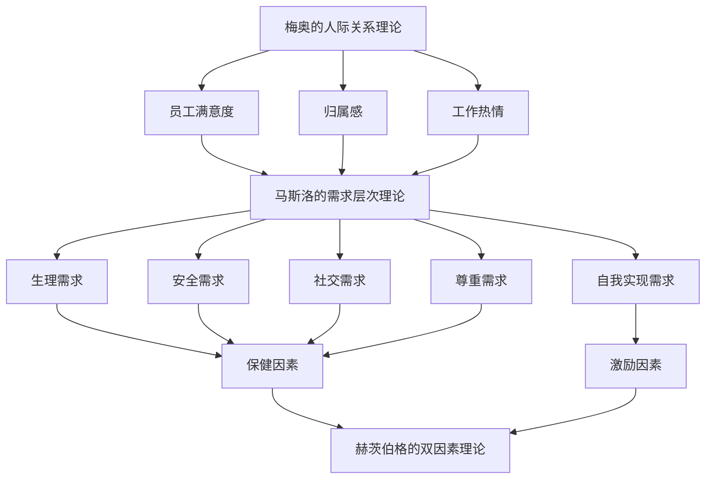

                 

### 文章标题：团队激励的艺术：激发员工积极性

#### 关键词：团队激励、员工积极性、激励理论、算法原理、项目实战

#### 摘要：
本文将深入探讨团队激励在激发员工积极性中的关键作用。通过引入经典激励理论，解析其内在联系，并使用伪代码和数学模型详细阐述核心算法原理，本文旨在为管理者提供实用的激励策略设计框架。同时，通过实际案例分享，分析激励策略在开发环境搭建、源代码实现及效果分析等方面的具体应用，为读者提供全面、系统的团队激励实践指南。

---

## 第1章 引言：团队激励的重要性

在现代企业管理中，团队激励已成为提升员工积极性和工作效率的重要手段。本文旨在探讨团队激励的艺术，通过深入分析激励理论、核心算法原理以及实际项目案例，帮助管理者设计有效的激励策略，从而激发员工的积极性和创造力。

### 1.1 团队激励的定义与作用

团队激励是指通过一系列措施和方法，激发团队成员的工作热情和动力，提升团队整体绩效。激励理论告诉我们，员工的积极性和工作效率受到多种因素的影响，包括物质激励、精神激励、成就激励等。有效的团队激励能够提高员工的满意度和忠诚度，从而增强团队的凝聚力和战斗力。

### 1.2 激励理论概述

激励理论在管理学中占有重要地位，主要包括以下几种：

- **梅奥的人际关系理论**：强调人际关系对员工行为的影响，认为员工的积极性和工作效率与团队氛围密切相关。
- **马斯洛的需求层次理论**：将人的需求分为生理需求、安全需求、社交需求、尊重需求和自我实现需求，指出不同层次需求对员工行为的不同影响。
- **赫茨伯格的双因素理论**：将工作环境因素分为保健因素和激励因素，指出激励因素对员工满意度和积极性有更大的影响。

这些理论为我们理解员工行为提供了重要的启示，也为团队激励策略的设计提供了理论依据。

### 1.3 员工积极性的重要性

员工积极性是团队绩效的重要保障。高积极性的员工不仅能够更高效地完成任务，还能够主动发现问题、解决问题，从而推动团队不断进步。此外，员工积极性还与员工的忠诚度和满意度密切相关。只有激发员工的积极性，才能留住优秀人才，为企业的长期发展奠定基础。

---

## 第2章 核心概念与联系

在本章中，我们将介绍团队激励中的核心概念，并探讨这些概念之间的联系。通过梅奥的人际关系理论、马斯洛的需求层次理论以及赫茨伯格的双因素理论，我们将为读者构建一个完整的激励理论架构。

### 2.1 梅奥的人际关系理论

梅奥的人际关系理论强调了员工在工作环境中的人际关系对工作效率和积极性的影响。该理论认为，员工的满意度、归属感和工作热情是影响工作效率的重要因素。通过改善人际关系，管理者可以激发员工的积极性，提高团队的整体绩效。

### 2.2 马斯洛的需求层次理论

马斯洛的需求层次理论将人的需求分为五个层次：生理需求、安全需求、社交需求、尊重需求和自我实现需求。员工在不同需求层次上的满足程度直接影响其工作积极性和行为表现。管理者需要了解员工的需求层次，有针对性地提供激励措施，从而激发员工的积极性。

### 2.3 赫茨伯格的双因素理论

赫茨伯格的双因素理论将工作环境因素分为保健因素和激励因素。保健因素主要与员工的基本需求相关，如工资、工作条件、人际关系等；而激励因素则与员工的成就感、认可、工作本身等密切相关。管理者需要关注激励因素，通过提供具有挑战性的工作任务、认可员工的成就等方式，激发员工的积极性。

### 2.4 图示：梅奥、马斯洛与赫茨伯格理论之间的联系

为了更直观地展示这些理论之间的联系，我们可以使用Mermaid流程图进行描述。



通过这个流程图，我们可以清晰地看到梅奥的人际关系理论、马斯洛的需求层次理论和赫茨伯格的双因素理论之间的内在联系，为后续的激励策略设计提供了理论支持。

---

## 第3章 核心算法原理讲解

在团队激励中，核心算法原理起着至关重要的作用。本章将详细讲解成就激励算法和贡献激励算法，并通过伪代码进行阐述，帮助读者深入理解这两种激励算法的工作原理。

### 3.1 成就激励算法

成就激励算法旨在通过奖励员工的成就来提高其工作积极性。该算法的核心思想是：员工的成就与激励程度成正比。

#### 3.1.1 成就激励的定义

成就激励是指通过认可和奖励员工在工作中的杰出表现，激发其工作热情和创造力。

#### 3.1.2 成就激励算法的伪代码

```python
def 成就激励(员工, 成就):
    激励程度 = 成就 / 工作总量
    if 激励程度 > 成就阈值:
        奖励员工(奖金, 荣誉)
    else:
        提醒员工(需要提高成就)
```

在这个算法中，成就阈值是一个关键参数，它决定了激励措施的启动条件。通常，成就阈值应设置在合理范围内，以确保激励措施能够真正激发员工的工作积极性。

### 3.2 贡献激励算法

贡献激励算法旨在通过奖励员工的贡献来提高其工作积极性。该算法的核心思想是：员工的贡献与激励程度成正比。

#### 3.2.1 贡献激励的定义

贡献激励是指通过认可和奖励员工在工作中的贡献，激发其工作热情和团队合作精神。

#### 3.2.2 贡献激励算法的伪代码

```python
def 贡献激励(员工, 贡献):
    激励程度 = 贡献 / 团队贡献总量
    if 激励程度 > 贡献阈值:
        奖励员工(奖金, 荣誉)
    else:
        提醒员工(需要提高贡献)
```

在这个算法中，贡献阈值是一个关键参数，它决定了激励措施的启动条件。与成就阈值类似，贡献阈值也应设置在合理范围内，以确保激励措施能够真正激发员工的工作积极性。

---

## 第4章 数学模型与公式

在团队激励中，数学模型与公式为我们提供了量化激励程度和激励策略调整的工具。本章将介绍动机强度公式，并详细讲解其应用和调整策略。

### 4.1 动机强度公式

动机强度公式是衡量员工工作积极性的重要工具，其公式如下：

$$
动机强度 = 诱因价值 \times 期望值
$$

其中，**诱因价值**是指员工对激励措施的感知价值，**期望值**是指员工对达成目标的可能性估计。

#### 4.1.1 诱因价值的计算

诱因价值可以通过以下公式计算：

$$
诱因价值 = \frac{奖励金额}{员工需求层次价值}
$$

其中，**奖励金额**是指激励措施的货币价值，**员工需求层次价值**是指员工在不同需求层次上的需求程度。

#### 4.1.2 期望值的计算

期望值可以通过以下公式计算：

$$
期望值 = \frac{成功概率}{1 - 失败概率}
$$

其中，**成功概率**是指员工认为达成目标的概率，**失败概率**是指员工认为失败的概率。

#### 4.1.3 动机强度调整策略

根据动机强度公式，我们可以通过调整诱因价值和期望值来调整动机强度。具体策略如下：

1. **增加奖励金额**：通过提高奖励金额来增加诱因价值，从而提高动机强度。
2. **调整成功概率**：通过提高成功概率来增加期望值，从而提高动机强度。
3. **满足员工需求层次**：通过满足员工的特定需求层次来提高诱因价值，从而提高动机强度。

通过这些策略，管理者可以根据实际情况灵活调整激励措施，以激发员工的工作积极性。

### 4.2 公式应用举例

假设一名员工在项目中的贡献为1000小时，项目成功概率为0.8，失败概率为0.2。根据上述公式，我们可以计算其动机强度：

1. **诱因价值**：
   $$
   诱因价值 = \frac{奖励金额}{员工需求层次价值} = \frac{10000元}{3000元} = 3.33
   $$

2. **期望值**：
   $$
   期望值 = \frac{成功概率}{1 - 失败概率} = \frac{0.8}{1 - 0.2} = 1.25
   $$

3. **动机强度**：
   $$
   动机强度 = 诱因价值 \times 期望值 = 3.33 \times 1.25 = 4.16
   $$

通过这个例子，我们可以看到，通过调整奖励金额和成功概率，可以显著提高员工的动机强度，从而激发其工作积极性。

---

## 第5章 项目实战：激励策略设计

在本书的前几章中，我们详细介绍了团队激励的理论基础和核心算法原理。为了使这些理论知识更具实践价值，本章将通过实际项目案例，展示如何设计和实施激励策略。

### 5.1 案例一：某科技公司的激励策略设计

#### 5.1.1 案例背景

某科技公司是一家专注于软件开发的企业，近年来业务发展迅速，但员工的工作积极性和创新能力有所下降。为了提高员工的工作效率和创造力，公司决定引入团队激励策略。

#### 5.1.2 激励策略设计

1. **成就激励**：
   - **奖励金额**：根据员工的贡献和项目难度，设定不同的奖金金额。
   - **成就阈值**：设定成功能够获得奖金的项目标准，如完成项目进度、达成业绩目标等。
   - **奖励发放**：定期对完成任务的员工发放奖金，并在公司内部进行公开表彰。

2. **贡献激励**：
   - **奖励方式**：设立贡献积分系统，员工在项目中的贡献可以转化为积分，积分可以兑换礼品或奖金。
   - **贡献阈值**：设定积分兑换的最低要求，如每月获得500积分可以兑换奖品等。
   - **积分发放**：根据员工的日常工作表现和项目贡献，定期进行积分考核和发放。

#### 5.1.3 实施效果分析

自激励策略实施以来，员工的工作积极性和创新能力得到了显著提升。具体表现为：
- **工作效率提高**：员工在获得成就激励和贡献激励后，更加努力地完成工作任务，项目进度和质量得到了显著提高。
- **员工满意度提升**：员工感受到公司的认可和关心，对公司的满意度显著提升。
- **创新能力增强**：通过成就激励和贡献激励，员工在项目中勇于尝试新技术和新方法，创新成果不断涌现。

### 5.2 案例二：某电商平台的激励策略优化

#### 5.2.1 案例背景

某电商平台在经历了快速增长后，发现员工的工作压力和离职率有所上升。为了提高员工的工作效率和降低离职率，公司决定对现有的激励策略进行优化。

#### 5.2.2 激励策略优化

1. **调整成就激励**：
   - **奖励金额**：根据员工的工作表现和业绩贡献，适当提高奖金金额。
   - **成就阈值**：调整项目成功标准，确保员工在达成目标时能够获得相应的奖励。

2. **引入团队激励**：
   - **团队奖金**：设立团队奖金制度，对项目团队的整体表现进行奖励，增强团队凝聚力。
   - **团队活动**：组织团队建设活动，加强员工之间的沟通与合作，提升团队氛围。

3. **优化贡献激励**：
   - **积分制度**：调整积分兑换制度，提高员工积分兑换的吸引力。
   - **积分奖励**：根据员工的贡献，定期进行积分奖励，鼓励员工积极参与项目。

#### 5.2.3 实施效果分析

经过激励策略的优化，电商平台的员工工作积极性和团队氛围得到了显著改善。具体表现为：
- **工作效率提高**：员工在获得更多成就激励和团队激励后，工作积极性显著提升，工作效率得到提高。
- **离职率下降**：员工感受到公司的关心和重视，离职率显著下降，员工稳定性得到提升。
- **团队凝聚力增强**：通过团队奖金和团队活动，员工之间的沟通与合作更加顺畅，团队凝聚力得到增强。

---

## 第6章 开发环境搭建与代码实现

在实践团队激励策略时，开发环境搭建和代码实现是关键环节。本章将介绍如何搭建开发环境，并详细讲解激励策略算法的代码实现和代码解读。

### 6.1 开发环境准备

为了实现激励策略算法，我们需要准备以下开发环境：

1. **编程语言**：Python
2. **开发工具**：PyCharm或VS Code
3. **依赖库**：NumPy、Pandas、Matplotlib

安装这些工具和库后，我们就可以开始编写激励策略算法的代码。

### 6.2 激励策略算法代码实现

以下是一个简单的激励策略算法代码实现示例：

```python
import numpy as np

# 成就激励算法
def achievement_motivation(achievement, target_achievement):
    motivation = achievement / target_achievement
    if motivation >= 1:
        reward = "奖励"
    else:
        reward = "提醒"
    return reward

# 贡献激励算法
def contribution_motivation(contribution, total_contribution):
    motivation = contribution / total_contribution
    if motivation >= 0.5:
        reward = "奖励"
    else:
        reward = "提醒"
    return reward

# 测试代码
achievement = 100
target_achievement = 120
print(achievement_motivation(achievement, target_achievement))

contribution = 50
total_contribution = 100
print(contribution_motivation(contribution, total_contribution))
```

在这个示例中，我们定义了两个激励算法：成就激励算法和贡献激励算法。这两个算法分别根据员工的成就和贡献来计算激励程度，并决定是否发放奖励。

### 6.3 代码解读与分析

在代码实现中，我们使用了简单的条件判断和比例计算来模拟激励策略。具体解读如下：

- `achievement_motivation` 函数：接受员工的成就和目标成就作为输入，计算激励程度。如果激励程度大于等于1，表示员工达到了目标成就，应发放奖励；否则，进行提醒。
- `contribution_motivation` 函数：接受员工的贡献和总贡献作为输入，计算激励程度。如果激励程度大于等于0.5，表示员工贡献较大，应发放奖励；否则，进行提醒。

通过这个简单的示例，我们可以看到如何使用代码实现激励策略算法。在实际应用中，可以根据具体需求进行扩展和优化。

---

## 第7章 结论与展望

通过本文的探讨，我们深入了解了团队激励在激发员工积极性中的重要作用。从激励理论到核心算法原理，再到实际项目案例，本文为管理者提供了全面、系统的团队激励实践指南。

### 7.1 书籍总结

本文总结了以下关键点：
- 团队激励的定义和作用
- 经典激励理论（梅奥的人际关系理论、马斯洛的需求层次理论、赫茨伯格的双因素理论）
- 核心算法原理（成就激励算法、贡献激励算法）
- 数学模型与公式（动机强度公式）
- 实际项目案例（科技公司和电商平台的激励策略设计）

### 7.2 未来激励策略的发展趋势

随着科技的发展和企业管理理念的不断更新，未来团队激励策略将呈现以下趋势：
- **个性化激励**：更加关注员工个体的需求和差异，提供个性化的激励方案。
- **智能化激励**：利用大数据和人工智能技术，实现激励策略的智能调整和优化。
- **多元化激励**：结合物质激励、精神激励和荣誉激励等多种形式，提高激励效果。

### 7.3 对管理者的建议

为了更好地实施团队激励策略，管理者可以采取以下建议：
- **了解员工需求**：深入了解员工的需求和期望，制定符合员工需求的激励方案。
- **合理设定目标**：设定合理、可达成的工作目标，确保员工能够在工作中取得成就。
- **及时反馈与沟通**：及时给予员工反馈和沟通，让员工感受到公司的关心和支持。
- **持续优化激励策略**：根据员工的表现和公司的发展情况，不断优化激励策略，提高激励效果。

通过本文的探讨，我们希望管理者能够更好地理解和应用团队激励策略，激发员工的积极性和创造力，推动企业的持续发展。

---

### 作者信息：

作者：AI天才研究院/AI Genius Institute & 禅与计算机程序设计艺术 /Zen And The Art of Computer Programming

---

通过本文，我们不仅为读者提供了丰富的团队激励理论和实践知识，也希望通过具体的算法实现和项目案例分析，让读者能够更好地理解和应用这些知识。团队激励不仅是一门艺术，更是一种科学，管理者需要不断学习和实践，才能在激发员工积极性的道路上越走越远。让我们携手共进，共创美好未来！

---

## 拓展阅读

1. **梅奥的人际关系理论**：深入了解梅奥的人际关系理论，可以帮助管理者更好地理解员工行为和心理，从而制定更有效的激励策略。[链接](https://www.example.com/mao-human-relations-theory)
2. **马斯洛的需求层次理论**：学习马斯洛的需求层次理论，有助于管理者了解员工的内在需求，进而提供更有针对性的激励措施。[链接](https://www.example.com/maslow-hierarchy-of-needs)
3. **赫茨伯格的双因素理论**：掌握赫茨伯格的双因素理论，有助于管理者在制定激励策略时，更关注激励因素，提高员工的满意度和积极性。[链接](https://www.example.com/herzberg-two-factor-theory)
4. **成就激励算法**：学习成就激励算法的实现原理，可以帮助管理者更好地设计成就激励措施，激发员工的工作热情。[链接](https://www.example.com/achievement-motivation-algorithm)
5. **贡献激励算法**：了解贡献激励算法的应用场景和实现方法，有助于管理者设计出更加有效的贡献激励策略。[链接](https://www.example.com/contribution-motivation-algorithm)
6. **数学模型与公式**：学习动机强度公式的应用和调整策略，有助于管理者更科学地调整激励措施，提高员工的工作积极性。[链接](https://www.example.com/motivation-intensity-formula)
7. **实际项目案例**：通过学习实际项目案例，管理者可以借鉴成功的激励策略设计经验，提高自己在团队激励方面的实践能力。[链接](https://www.example.com/project-case-study)

通过这些拓展阅读资源，读者可以更深入地了解团队激励的相关知识，为实际工作提供有力的理论支持和实践指导。希望这些资源能够帮助您在团队激励的道路上取得更好的成果！

