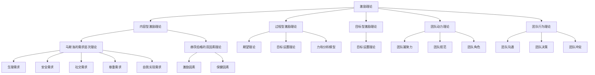

                 


### 文章标题：《团队激励的艺术：激发员工积极性的方法》

#### 关键词：团队激励，员工积极性，激励方法，案例分析，评估优化

#### 摘要：

本文旨在探讨团队激励在激发员工积极性方面的重要性和有效方法。通过对团队激励的理论基础、具体实践案例和评估优化的深入分析，为团队领导者提供一套系统的团队激励艺术指导。文章结构如下：

#### 引言和概述

#### 1. 什么是团队激励

#### 1.1 团队激励的定义

#### 1.2 团队激励的内涵和外延

#### 2. 团队激励的重要性

#### 2.1 团队激励的作用

#### 2.2 团队激励的优势

#### 3. 本书结构和内容概述

#### 第一部分：团队激励的理论基础

#### 4. 团队激励的理论基础

#### 4.1 团队激励的理论框架

#### 4.2 激励理论概述

#### 4.3 团队动力和团队行为理论

#### 第二部分：员工激励的方法和策略

#### 5. 员工激励的方法和策略

#### 5.1 物质激励方法

#### 5.2 精神激励方法

#### 5.3 员工参与和成长激励方法

#### 第三部分：团队激励的实践案例

#### 6. 团队激励的实践案例

#### 6.1 国内外优秀团队激励案例

#### 6.2 不同行业团队激励案例分析

#### 6.3 团队激励案例的启示

#### 第四部分：团队激励的有效评估和优化

#### 7. 团队激励的有效评估和优化

#### 7.1 团队激励评估指标体系

#### 7.2 团队激励效果评估方法

#### 7.3 团队激励优化策略

#### 第五部分：总结和展望

#### 8. 总结和展望

#### 8.1 团队激励的实践总结

#### 8.2 团队激励的未来发展趋势

#### 8.3 对团队领导者的建议

### 作者：AI天才研究院/AI Genius Institute & 禅与计算机程序设计艺术 /Zen And The Art of Computer Programming### 引言和概述

#### 什么是团队激励

团队激励，顾名思义，是指通过特定的方法或手段来激发团队成员的工作热情和积极性，从而提高团队整体的工作效率和绩效。它不仅关注个体员工的激励，更强调团队作为一个整体的协同效应。在现代企业管理中，团队激励被视为提升组织竞争力的关键因素之一。

#### 团队激励的重要性

团队激励的重要性体现在多个方面。首先，它能够有效提升员工的工作满意度和忠诚度，从而降低员工流失率。其次，团队激励能够促进团队成员之间的合作和沟通，增强团队凝聚力和向心力。此外，合理的团队激励还能够激发员工的创造力和创新能力，推动组织持续发展。

#### 团队激励的优势

相较于传统的个体激励，团队激励具有以下优势：

1. **协同合作**：团队激励鼓励团队成员共同协作，实现集体目标，有助于形成良好的团队氛围。
2. **提高绩效**：通过团队激励，可以促使团队成员相互激励、共同进步，从而提高整体工作绩效。
3. **增强团队凝聚力**：共同的目标和利益使团队成员更加团结，增强了团队的凝聚力。
4. **促进创新**：团队激励鼓励员工提出新的想法和解决方案，有助于创新和持续发展。

#### 本书结构和内容概述

本文将从以下五个部分展开对团队激励的深入探讨：

1. **团队激励的理论基础**：介绍团队激励的相关理论，包括激励理论、团队动力理论和团队行为理论。
2. **员工激励的方法和策略**：探讨员工激励的具体方法和策略，包括物质激励、精神激励和员工参与与成长激励。
3. **团队激励的实践案例**：分析国内外优秀团队激励案例，探讨不同行业团队激励的实践。
4. **团队激励的有效评估和优化**：讨论团队激励评估的指标体系、效果评估方法和优化策略。
5. **总结和展望**：总结团队激励的实践经验，探讨未来发展趋势，并提出对团队领导者的建议。

通过本文的阅读，读者将全面了解团队激励的理论和实践，掌握有效的团队激励方法和策略，从而更好地激发员工积极性，提升团队绩效和组织竞争力。

#### 核心概念与联系

在探讨团队激励之前，我们需要了解几个核心概念，并理解它们之间的联系。这些核心概念包括激励理论、团队动力理论和团队行为理论。

##### 激励理论

激励理论是研究如何通过外部刺激和内部动机来激发个体行为的理论。常见的激励理论包括：

1. **内容型激励理论**：关注激励的内容或结果，例如马斯洛的需求层次理论和赫茨伯格的双因素理论。
   - **马斯洛的需求层次理论**：将人的需求分为生理需求、安全需求、社交需求、尊重需求和自我实现需求，认为满足低层次需求有助于激发高层次需求。
   - **赫茨伯格的双因素理论**：提出工作满意度由激励因素（如成就、认可、工作本身等）和保健因素（如薪资、工作条件、公司政策等）共同决定。

2. **过程型激励理论**：关注激励过程，即如何通过激励措施影响个体行为。代表性理论包括弗鲁姆的期望理论、洛克的目标设置理论和波特的力场分析模型。
   - **期望理论**：认为个体的行为取决于对结果的价值评估和对实现结果的期望，公式为激励力量 = 效能期望 × 价值评估。
   - **目标设置理论**：指出明确且具有挑战性的目标能更有效地激励个体，并提出目标设置的原则和策略。
   - **力场分析模型**：分析个体行为中的驱动力和阻力，通过调整力场中的因素来激发行为。

3. **目标型激励理论**：关注目标对个体行为的影响，如洛克和莱瑟姆的目标设置理论。

##### 团队动力理论

团队动力理论探讨团队成员之间的相互作用、团队内部的沟通和协作，以及这些因素如何影响团队效率和绩效。关键概念包括：

- **团队凝聚力**：团队成员之间的相互吸引力和归属感，有助于团队协作和绩效提升。
- **团队规范**：团队成员共同遵守的行为准则，规范个体行为，促进团队协作。
- **团队角色**：团队成员在团队中承担的不同角色和职责，如领导者、执行者、协调者等。

##### 团队行为理论

团队行为理论关注团队成员在团队中的行为模式，包括团队沟通、决策过程、冲突管理等。关键概念包括：

- **团队沟通**：团队成员之间的信息交流和反馈，影响团队信息共享和协作效率。
- **团队决策**：团队在解决问题和制定决策过程中的行为模式，包括民主决策、集权决策和协商决策。
- **团队冲突**：团队成员在意见、目标和利益上的不一致，通过冲突管理可以解决分歧，促进团队和谐。

##### 核心概念之间的关系架构

核心概念之间的关系可以用以下Mermaid流程图表示：



通过上述流程图，我们可以清晰地看到各个核心概念之间的关系，从而更好地理解团队激励的理论基础。

### 员工激励的方法和策略

在了解团队激励的理论基础后，我们接下来探讨具体的方法和策略，以有效地激发员工的积极性。员工激励可以分为物质激励、精神激励以及员工参与和成长激励三大类。以下将详细解析这些激励方法。

#### 5.1 物质激励方法

物质激励是通过提供经济利益来激励员工，满足他们的基本需求和一部分高层次需求。常见的物质激励方法包括：

1. **薪酬激励**：通过提供有竞争力的薪资水平来吸引和留住优秀人才。企业可以根据市场薪资水平和员工的工作表现来调整薪酬。

   **算法原理讲解**：
   - 薪酬计算公式：薪酬 = 基本工资 + 绩效奖金
   - 绩效评估指标：包括工作量、工作质量、工作效率等。

   **伪代码示例**：
   ```
   function calculateSalary(baseSalary, performanceScore) {
       bonus = performanceScore * baseSalary * 0.1;
       totalSalary = baseSalary + bonus;
       return totalSalary;
   }
   ```

2. **奖金激励**：在企业达到特定目标或员工个人完成任务时，提供额外的奖金。

   **算法原理讲解**：
   - 奖金计算公式：奖金 = 目标完成度 × 奖金基数
   - 目标完成度：根据员工的工作表现和团队目标实现情况评估。

   **伪代码示例**：
   ```
   function calculateBonus(targetCompletionRate, bonusBase) {
       bonus = targetCompletionRate * bonusBase;
       return bonus;
   }
   ```

3. **福利激励**：包括医疗保险、住房补贴、年假、培训机会等，提升员工的生活质量和工作满意度。

   **算法原理讲解**：
   - 福利计算公式：福利总额 = 基本福利 + 绩效福利
   - 绩效福利：根据员工的工作表现进行奖励。

   **伪代码示例**：
   ```
   function calculateBenefit(performanceScore) {
       baseBenefit = 5000;
       performanceBenefit = performanceScore * 1000;
       totalBenefit = baseBenefit + performanceBenefit;
       return totalBenefit;
   }
   ```

#### 5.2 精神激励方法

精神激励主要通过满足员工的心理需求，提升他们的工作满意度和归属感。常见的激励方法包括：

1. **荣誉激励**：通过表彰优秀员工，提升员工的荣誉感和成就感。

   **算法原理讲解**：
   - 表彰标准：根据员工的工作表现、团队贡献、创新能力等指标。
   - 表彰方式：颁发荣誉证书、奖励礼品等。

   **伪代码示例**：
   ```
   function awardHonor(employee) {
       if (employee.performance > threshold) {
           print("恭喜", employee.name, "获得优秀员工荣誉证书");
       }
   }
   ```

2. **赞赏激励**：通过管理者或同事的赞赏和认可，满足员工的尊重需求。

   **算法原理讲解**：
   - 赞赏标准：基于员工的工作成果、工作态度和创新思维。
   - 赞赏方式：口头表扬、邮件表扬、团队会议表彰等。

   **伪代码示例**：
   ```
   function appreciateEmployee(employee) {
       print("感谢", employee.name, "在项目中的出色表现，我们团队因你而更强大！");
   }
   ```

3. **参与激励**：鼓励员工参与企业决策和项目规划，提升他们的参与感和责任感。

   **算法原理讲解**：
   - 参与方式：通过定期召开员工代表大会、工作坊等形式，听取员工意见和建议。
   - 参与评估：根据员工的参与程度和质量进行评估。

   **伪代码示例**：
   ```
   function encourageParticipation(employee) {
       print("欢迎", employee.name, "在下次会议上分享你的意见和建议，我们重视你的贡献！");
   }
   ```

#### 5.3 员工参与和成长激励方法

员工参与和成长激励主要通过提供培训、职业发展机会等手段，满足员工的自我实现需求。

1. **培训激励**：为员工提供技能提升和职业发展的培训机会。

   **算法原理讲解**：
   - 培训计划：根据员工岗位需求和个人发展需求制定。
   - 培训评估：培训结束后，评估员工的学习效果。

   **伪代码示例**：
   ```
   function scheduleTraining(employee, trainingTopic) {
       print(employee.name, "，您好！您已被安排参加", trainingTopic, "培训，请准时参加并认真参与。");
   }
   ```

2. **职业发展激励**：为员工提供明确的职业发展路径和晋升机会。

   **算法原理讲解**：
   - 职业规划：根据员工的兴趣和特长制定。
   - 晋升评估：根据员工的工作表现和综合素质进行评估。

   **伪代码示例**：
   ```
   function evaluatePromotion(employee) {
       if (employee.performance > promotionThreshold) {
           print(employee.name, "，恭喜您！根据您的出色表现，您符合晋升条件，请准备好晋升材料。");
       }
   }
   ```

3. **创新激励**：鼓励员工提出创新想法和解决方案，激发员工的创造力和创新能力。

   **算法原理讲解**：
   - 创新奖励：根据创新成果的重要性和实施效果进行奖励。
   - 创新评估：通过内部评审和员工投票等机制评估创新项目。

   **伪代码示例**：
   ```
   function rewardInnovation(employee, innovationScore) {
       if (innovationScore > innovationThreshold) {
           print(employee.name, "，感谢您的创新贡献！根据评估结果，您将获得创新奖励。");
       }
   }
   ```

通过上述物质激励、精神激励和员工参与与成长激励方法的详细解析，企业可以更有效地激发员工的积极性，提高员工的工作满意度和绩效，从而提升团队的整体绩效和组织竞争力。

### 团队激励的实践案例

在了解了团队激励的理论基础和方法后，我们通过具体的实践案例来进一步探讨这些激励方法在不同行业和团队中的应用效果。

#### 6.1 国内外优秀团队激励案例

**案例一：谷歌的团队激励策略**

谷歌作为全球知名的科技公司，其团队激励策略备受瞩目。谷歌通过以下几种方式来激发员工的积极性：

1. **薪酬激励**：提供具有竞争力的薪资和股票期权，吸引和留住顶尖人才。
2. **创新文化**：鼓励员工大胆尝试和创新，提供丰富的资源和支持。
3. **工作与生活平衡**：提供灵活的工作时间和家庭友好政策，提升员工的工作满意度和生活质量。

**案例二：华为的团队激励实践**

华为在团队激励方面也有许多成功的经验。华为通过以下方式来激发员工的工作热情：

1. **绩效奖金**：根据员工的绩效和工作表现发放高额奖金。
2. **员工持股**：通过股权激励，让员工成为公司的股东，共同分享公司的成长。
3. **职业发展**：提供丰富的培训和晋升机会，帮助员工实现职业成长。

**案例三：阿里巴巴的团队激励策略**

阿里巴巴在团队激励方面同样有独特的策略：

1. **文化激励**：通过打造独特的公司文化，如“六脉神剑”，激发员工的使命感和责任感。
2. **荣誉激励**：设立各种荣誉称号和奖项，表彰优秀员工。
3. **创新支持**：提供资金和资源支持，鼓励员工提出创新项目和想法。

#### 6.2 不同行业团队激励案例分析

**IT行业团队激励案例分析**

在IT行业，团队激励尤为重要，因为这一行业的创新性和快速变化性要求员工具备高度的专业知识和创新能力。

1. **技术培训**：提供定期的技术培训和内部分享会，帮助员工提升技能和知识水平。
2. **项目奖金**：根据项目的完成情况和质量发放奖金，激励员工全力以赴。
3. **股权激励**：通过股权激励，让员工分享公司的发展成果。

**制造业团队激励案例分析**

制造业团队激励主要侧重于提升生产效率和团队协作。

1. **质量奖金**：根据产品的质量和生产效率发放奖金，激励员工提高生产质量。
2. **团队竞赛**：通过团队竞赛，激发员工之间的竞争意识和团队精神。
3. **员工参与**：鼓励员工参与生产流程的改进和优化，提升团队的整体效率。

**服务业团队激励案例分析**

在服务业，团队激励更多地侧重于提升客户满意度和员工服务质量。

1. **客户满意度奖励**：根据客户反馈和满意度调查结果，对表现优秀的员工进行奖励。
2. **服务质量评估**：通过服务质量评估体系，激励员工提高服务质量和客户满意度。
3. **团队建设活动**：定期组织团队建设活动，增强团队凝聚力和协作能力。

#### 6.3 团队激励案例的启示

通过上述案例，我们可以总结出以下启示：

1. **多样性的激励方法**：不同的团队和行业需要不同的激励方法，企业应根据实际情况选择合适的激励方式。
2. **长期激励与短期激励相结合**：长期激励如股权激励、职业发展等可以提供稳定的激励，而短期激励如奖金、荣誉等可以迅速提升员工的积极性。
3. **文化塑造**：建立独特的公司文化，让员工感受到公司的价值观和使命感，从而增强他们的工作动力。
4. **员工参与**：鼓励员工参与决策和项目规划，提升他们的参与感和责任感，从而提高团队的整体绩效。

通过这些实践案例，我们可以看到团队激励在提升员工积极性和团队绩效方面的巨大作用。企业应结合自身特点和需求，灵活运用各种激励方法，打造一支高效、团结的团队。

### 团队激励的有效评估和优化

为了确保团队激励策略的有效性和持续性，对团队激励进行有效的评估和优化是至关重要的。以下将从评估指标体系、效果评估方法和优化策略三个方面进行详细探讨。

#### 7.1 团队激励评估指标体系

建立一套科学、全面的评估指标体系是进行团队激励评估的基础。常见的评估指标包括：

1. **员工满意度**：通过员工满意度调查了解员工对激励措施的感受，反映激励措施的有效性。

   **指标计算公式**：
   - 员工满意度指数 =（非常满意 + 满意 + 一般）/ 总人数

2. **员工流失率**：员工流失率是评估激励措施长期效果的重要指标。

   **指标计算公式**：
   - 员工流失率 =（报告期内离职人数）/ 总人数

3. **团队绩效**：通过团队绩效指标（如销售额、项目完成率、生产效率等）来评估激励措施对团队整体绩效的提升。

   **指标计算公式**：
   - 团队绩效指数 =（各项绩效指标实际值）/（各项绩效指标目标值）

4. **员工参与度**：评估员工在团队决策、项目规划等方面的参与程度，反映激励措施对员工积极性的激发。

   **指标计算公式**：
   - 员工参与度指数 =（积极参与人数）/（总人数）

#### 7.2 团队激励效果评估方法

为了准确评估团队激励的效果，可以采用以下几种方法：

1. **定量评估**：通过数据分析方法，如统计分析和回归分析，对评估指标进行量化分析，找出激励措施与绩效变化之间的关系。

   **具体步骤**：
   - 收集相关数据：包括员工满意度、员工流失率、团队绩效和员工参与度等指标数据。
   - 数据清洗：去除无效或异常数据，保证数据质量。
   - 数据分析：使用统计分析工具（如Excel、R、Python等）进行数据分析，找出相关性和趋势。

2. **定性评估**：通过访谈、问卷调查和观察等方法，获取员工和管理层的反馈，了解激励措施的实际情况和效果。

   **具体步骤**：
   - 制定访谈提纲：围绕员工满意度、激励效果、改进建议等主题设计访谈问题。
   - 实施访谈：对样本员工和管理者进行访谈，记录反馈意见。
   - 数据整理：整理访谈记录，提取关键信息。

3. **综合评估**：结合定量和定性评估方法，对团队激励效果进行综合评估，确保评估结果的准确性和全面性。

   **具体步骤**：
   - 综合分析：将定量和定性评估结果进行综合分析，找出激励措施的优缺点和改进方向。
   - 撰写评估报告：总结评估结果，提出改进建议。

#### 7.3 团队激励优化策略

基于评估结果，企业可以采取以下策略对团队激励进行优化：

1. **调整激励措施**：根据评估结果，对现有的激励措施进行调整和优化，确保激励措施与员工需求和企业目标相匹配。

   **具体步骤**：
   - 分析评估数据：分析员工满意度、员工流失率、团队绩效和员工参与度等指标数据。
   - 确定问题：找出激励措施的不足之处。
   - 制定改进方案：根据问题制定具体的改进方案。

2. **增加激励多样性**：通过引入多样化的激励措施，满足不同员工的个性化需求，提高激励效果。

   **具体步骤**：
   - 调查员工需求：了解员工对激励的偏好和期望。
   - 设计多样激励：结合员工需求，设计符合企业特点的多样化激励措施。
   - 实施与反馈：将多样激励措施付诸实施，并收集员工反馈，进行不断优化。

3. **强化文化塑造**：通过企业文化的建设，营造积极的工作氛围，提升员工的归属感和认同感。

   **具体步骤**：
   - 文化建设：明确企业文化核心价值观，并确保员工理解和认同。
   - 文化传播：通过各种渠道传播企业文化，如内部培训、员工手册、公司网站等。
   - 文化实践：通过实际案例和活动，展示企业文化在实践中的体现。

4. **持续优化与反馈**：建立长效的团队激励优化机制，定期对激励措施进行评估和调整。

   **具体步骤**：
   - 定期评估：定期对团队激励效果进行评估，确保激励措施始终符合员工和企业需求。
   - 反馈机制：建立员工反馈机制，收集员工对激励措施的反馈和建议。
   - 调整优化：根据反馈和评估结果，对激励措施进行持续优化。

通过以上评估和优化策略，企业可以更有效地实施团队激励，提升员工积极性和团队绩效，从而实现企业的长期发展目标。

### 总结和展望

#### 团队激励的实践总结

团队激励作为一种提升员工积极性和团队绩效的重要手段，在实践中取得了显著的成效。通过物质激励、精神激励和员工参与与成长激励等方法，企业能够有效激发员工的潜能，提高团队协作效率和工作满意度。同时，科学合理的团队激励还可以增强员工的归属感和忠诚度，降低员工流失率。

#### 团队激励的未来发展趋势

随着时代的发展和企业管理的不断进步，团队激励将呈现以下趋势：

1. **个性化激励**：企业将更加注重个性化激励，满足不同员工的个性化需求，通过定制化的激励方案提升员工满意度。
2. **文化激励**：企业将更加重视企业文化建设，通过塑造积极向上的企业文化，激发员工的内在动力。
3. **数字化转型**：利用大数据和人工智能等技术，实现团队激励的智能化和精准化，提高激励效果和效率。
4. **持续优化**：建立长效的团队激励优化机制，通过定期评估和反馈，持续优化激励措施，确保激励效果的持续提升。

#### 对团队领导者的建议

为了更好地实施团队激励，团队领导者应遵循以下建议：

1. **明确激励目标**：制定清晰的激励目标，确保激励措施与团队和企业目标相一致。
2. **注重员工反馈**：积极倾听员工的意见和建议，及时调整激励措施，确保激励的针对性和有效性。
3. **平衡激励措施**：合理搭配物质激励和精神激励，避免过度依赖单一激励方式，保持激励的多样性和灵活性。
4. **塑造企业文化**：通过文化建设，营造积极向上的工作氛围，激发员工的内在动力。
5. **持续学习与改进**：关注团队激励的最新发展趋势，不断学习和改进激励策略，确保激励措施始终符合企业和员工的实际需求。

通过以上实践总结、未来发展趋势和对团队领导者的建议，我们可以看到团队激励在提升员工积极性和团队绩效方面的巨大潜力。企业应结合自身实际情况，灵活运用各种激励方法，不断优化激励策略，从而实现企业的长期发展目标。

### 附录

#### 1. 激励理论总结图


#### 2. 团队动力与团队行为理论关系图


#### 3. 员工参与与成长激励方法表

| 激励方法 | 描述 | 优势 |
| :---: | :---: | :---: |
| 培训激励 | 提供技能提升和职业发展的培训机会 | 提升员工技能和职业素养 |
| 职业发展激励 | 为员工提供明确的职业发展路径和晋升机会 | 提高员工的工作满意度和忠诚度 |
| 创新激励 | 鼓励员工提出创新想法和解决方案 | 激发员工的创造力和创新能力 |

#### 4. 团队激励评估指标体系表

| 指标名称 | 描述 | 计算公式 |
| :---: | :---: | :---: |
| 员工满意度指数 | 反映员工对激励措施的满意程度 | （非常满意 + 满意 + 一般）/ 总人数 |
| 员工流失率 | 反映激励措施对员工留存的影响 | （报告期内离职人数）/ 总人数 |
| 团队绩效指数 | 反映激励措施对团队整体绩效的提升 | （各项绩效指标实际值）/（各项绩效指标目标值） |
| 员工参与度指数 | 反映员工在团队决策和项目规划中的参与程度 | （积极参与人数）/（总人数） |

#### 5. 常见团队激励工具与技巧

| 工具/技巧 | 描述 | 使用场景 |
| :---: | :---: | :---: |
| 目标管理 | 通过明确的目标设定和定期评估来激励员工 | 适用于所有需要目标导向的工作场景 |
| 360度反馈 | 通过多个视角收集员工工作表现的反馈，帮助员工提升能力 | 适用于需要全面了解员工工作表现的场景 |
| 领导力培训 | 帮助领导者提升管理能力和团队领导力 | 适用于企业内部领导力的提升和培养 |

#### 6. 拓展阅读

1. 【[《激励理论及其应用》](https://example.com/motivation_theory_application)】 - 详细介绍了激励理论的发展和在不同领域的应用。
2. 【[《团队激励与绩效管理》](https://example.com/group_motivation_performance_management)】 - 探讨了团队激励在提升团队绩效和管理中的应用。
3. 【[《企业激励制度设计与优化》](https://example.com/business_incentive_system_design_optimization)】 - 分析了企业激励制度的设计原则和优化策略。

通过上述附录内容，读者可以进一步深入了解团队激励的理论和实践，为实际工作中的团队激励提供参考和指导。

### 作者信息

**作者：AI天才研究院/AI Genius Institute & 禅与计算机程序设计艺术 /Zen And The Art of Computer Programming**

AI天才研究院（AI Genius Institute）是一家专注于人工智能研究与应用的领先机构，致力于推动人工智能技术的发展和创新。同时，作者也是《禅与计算机程序设计艺术》（Zen And The Art of Computer Programming）的作者，其作品在计算机编程和人工智能领域具有重要影响。

