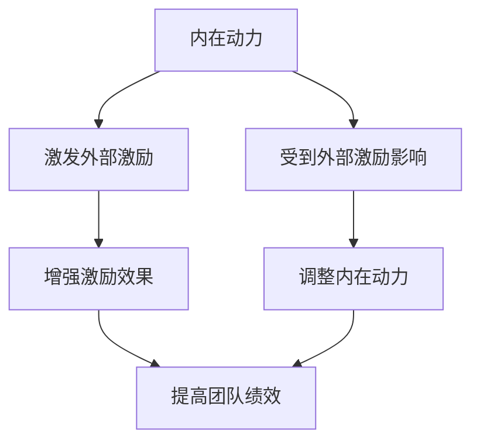

                 

### 文章标题

# 团队激励系统设计：结合内在动力与外部激励

> 关键词：团队激励系统、内在动力、外部激励、系统设计、员工满意度

## 摘要

本文旨在深入探讨团队激励系统的设计与实现，重点关注如何结合内在动力与外部激励来提高团队效率和员工满意度。我们将首先介绍团队激励系统的基本概念，随后详细分析内在动力与外部激励的理论基础及其相互关系。接着，本文将提供一套完整的团队激励系统设计流程，涵盖从需求分析到系统实施与评估的各个环节。最后，通过实际项目案例分析，展示如何将理论与实际相结合，以构建高效的团队激励系统。本文旨在为企业和组织提供实用的指导，帮助他们在复杂多变的工作环境中实现持续的发展和进步。

### 背景介绍

在现代企业的运作中，团队激励系统扮演着至关重要的角色。随着全球化和技术进步的加速，企业面临的市场竞争日益激烈，如何在复杂多变的环境中保持团队的活力与创造力，成为管理者们关注的焦点。传统的激励方式往往侧重于物质奖励，如奖金、晋升和福利，这些外部激励手段在一定程度上能够提升员工的短期绩效，但长期来看，其效果并不显著。越来越多的研究表明，内在动力在员工激励中同样至关重要，它能激发员工的自主性、创造力和工作热情，从而推动团队整体绩效的提升。

内在动力与外部激励之间的关系复杂且相互影响。内在动力主要源自员工的个人价值观、兴趣和自我实现的需求，如对工作的热爱、成就感以及对个人成长的追求。而外部激励则来自于工作环境、组织文化和领导行为等方面的因素，如奖励制度、认可和培训机会。二者并非孤立存在，内在动力可以增强外部激励的效果，而外部激励则可以塑造和引导内在动力的发展。因此，一个有效的团队激励系统需要平衡内在动力与外部激励，使其相互促进，共同作用于团队的整体表现。

### 核心概念与联系

团队激励系统的核心概念包括内在动力和外部激励，二者相互联系、共同作用，对团队的整体表现产生深远影响。内在动力是指员工在没有任何外部压力的情况下，自发地投入到工作中，追求个人成长和自我实现的过程。它主要受到个人价值观、兴趣和成就需求的影响。而外部激励则是指通过外部手段来激发员工的积极性和工作热情，包括物质奖励（如奖金、晋升和福利）和非物质奖励（如认可、培训和发展机会）。

内在动力与外部激励之间的联系主要体现在以下几个方面：

1. **相互促进**：内在动力可以增强外部激励的效果，使员工对奖励和认可更加敏感。例如，一个对工作充满热情的员工，可能会因为获得一笔奖金而感到更加满足和自豪。同时，外部激励也可以激发员工的内在动力，使其更加投入到工作中。例如，一个良好的工作环境、清晰的职业发展路径和认可机制，可以激发员工对个人成长和职业发展的渴望。

2. **相互制约**：内在动力和外部激励也可能相互制约。如果外部激励过于频繁或过度，可能会导致员工对内在动力的忽视，使工作变成单纯的“为了奖励而工作”。反之，如果缺乏外部激励，即使员工有很强的内在动力，也可能因为缺乏足够的激励而感到疲惫和缺乏动力。

3. **动态平衡**：有效的团队激励系统需要在内在动力和外部激励之间找到一个动态平衡点。这个平衡点取决于员工的个人需求、组织文化和市场环境。例如，在一个注重创新和自我实现的企业文化中，内在激励可能更为重要；而在一个竞争激烈、绩效导向的市场中，外部激励可能更有效。

为了更好地理解内在动力与外部激励之间的关系，我们可以使用Mermaid流程图来表示它们之间的相互作用：



在这个流程图中，内在动力与外部激励相互影响，共同作用于团队绩效的提升。通过这种动态平衡，企业可以构建一个高效、充满活力的团队激励系统。

### 内在动力设计

内在动力是指员工在没有任何外部压力的情况下，自发地投入到工作中，追求个人成长和自我实现的过程。它是团队激励系统的重要组成部分，能够持久地激发员工的工作热情和创造力。内在动力的设计需要从员工的个人需求、工作环境和组织文化等多个方面进行综合考虑。

#### 提升内在动力的策略

1. **明确个人目标**：帮助员工明确个人目标，使其与组织目标相结合。通过设定具体、可衡量、可实现、相关性强和时限性的目标（SMART目标），员工可以清晰地了解自己的工作方向和成果，从而激发内在动力。

   ```mermaid
   graph TD
       A[设定目标] --> B[明确个人与组织目标]
       B --> C[制定SMART目标]
       C --> D[追踪进度]
   ```

2. **提供成长机会**：为员工提供多样化的成长机会，包括培训、晋升和跨部门交流等。这不仅可以提升员工的技能和知识，还可以满足其对个人发展的需求，从而增强内在动力。

   ```mermaid
   graph TD
       A[成长机会] --> B[内部培训]
       B --> C[职业晋升]
       C --> D[跨部门交流]
   ```

3. **鼓励自主性**：赋予员工一定的自主权，使其能够在工作中发挥创造力和主动性。通过设立项目小组、自主决策和工作流程优化等方式，员工可以更加自由地发挥个人才能，从而增强内在动力。

   ```mermaid
   graph TD
       A[自主性] --> B[项目小组]
       B --> C[自主决策]
       C --> D[工作流程优化]
   ```

4. **认可与奖励**：及时认可和奖励员工的努力和成就，使员工感受到自己的价值。这可以包括公开表扬、颁发荣誉证书和提供额外的福利等。通过这种方式，员工会感到更加满足和自豪，从而激发内在动力。

   ```mermaid
   graph TD
       A[认可与奖励] --> B[公开表扬]
       B --> C[荣誉证书]
       C --> D[额外福利]
   ```

5. **构建积极工作环境**：营造一个积极、开放、支持的工作环境，使员工感到舒适和被尊重。这包括建立良好的沟通机制、提供良好的工作条件和完善的企业文化等。一个良好的工作环境可以增强员工的归属感和内在动力。

   ```mermaid
   graph TD
       A[工作环境] --> B[良好沟通]
       B --> C[工作条件]
       C --> D[企业文化]
   ```

#### 内在动力与外部激励的结合

内在动力和外部激励并非完全独立，它们可以相互结合，发挥更大的作用。例如，在一个强调自主性的团队中，外部激励（如奖金和晋升机会）可以作为一种补充，鼓励员工在自主工作的同时追求更高的目标。此外，外部激励也可以用于认可和奖励那些在内在动力驱动下取得显著成绩的员工。

为了更好地结合内在动力与外部激励，企业可以采取以下策略：

1. **设置明确的目标和奖励机制**：确保员工明确了解工作目标以及相应的奖励机制，使其能够在内在动力和外部激励的双重驱动下工作。

   ```mermaid
   graph TD
       A[明确目标] --> B[设置奖励机制]
       B --> C[激励效果评估]
   ```

2. **平衡物质激励与非物质激励**：在激励方案中，合理搭配物质激励和非物质激励，以满足不同员工的需求。例如，对于追求职业发展的员工，可以提供晋升机会和培训资源；对于注重工作环境舒适的员工，可以改善办公条件和提供灵活的工作安排。

   ```mermaid
   graph TD
       A[物质激励] --> B[非物质激励]
       B --> C[个性化激励]
   ```

3. **建立反馈与改进机制**：通过定期的反馈和改进，及时了解员工的内在动力状态和外部激励效果，调整激励策略，以实现最佳激励效果。

   ```mermaid
   graph TD
       A[反馈机制] --> B[改进策略]
       B --> C[持续优化]
   ```

通过这些策略，企业可以在提升员工内在动力的同时，有效地结合外部激励，构建一个具有强大激励效应的团队激励系统。这不仅有助于提高员工的满意度和工作效率，还能促进团队的长期发展。

### 外部激励设计

外部激励是指通过外部手段激发员工的工作热情和积极性的各种方式。与内在动力不同，外部激励通常来自于工作环境、组织文化和领导行为等方面。有效的外部激励不仅能够提升员工的短期绩效，还能在长期内对团队的整体表现产生积极影响。

#### 物质激励设计

物质激励是外部激励中最为直接和明显的一种形式，包括奖金、晋升、福利和股票期权等。这些激励手段通常能够在短期内激发员工的工作动力，使员工更加关注绩效和成果。

1. **奖金制度**：通过设立奖金制度，对在特定时间内达到或超越目标任务的员工进行奖励。奖金可以分为固定奖金和浮动奖金，前者通常用于激励员工的常规工作表现，而后者则用于奖励那些在关键时刻做出突出贡献的员工。

   ```mermaid
   graph TD
       A[设定奖金制度] --> B[固定奖金]
       B --> C[浮动奖金]
       C --> D[绩效评估]
   ```

2. **晋升机制**：为员工提供清晰的晋升路径和职业发展机会。通过设立晋升标准，确保员工的晋升与其工作表现和贡献相匹配，从而激励员工不断提升自己的能力和绩效。

   ```mermaid
   graph TD
       A[设立晋升机制] --> B[晋升标准]
       B --> C[晋升评估]
       C --> D[职业发展]
   ```

3. **福利待遇**：提供丰富的福利待遇，如健康保险、退休金计划、带薪休假和员工福利等。这些福利不仅可以提高员工的生活质量，还能增强其对组织的归属感和忠诚度。

   ```mermaid
   graph TD
       A[提供福利待遇] --> B[健康保险]
       B --> C[退休金计划]
       C --> D[员工福利]
   ```

4. **股票期权**：为员工提供公司股票期权，使其能够分享公司的成长和成功。股票期权通常用于激励关键岗位的员工，如高层管理人员和核心技术人才。

   ```mermaid
   graph TD
       A[股票期权制度] --> B[股权激励]
       B --> C[分享公司成长]
   ```

#### 非物质激励设计

非物质激励是通过认可、荣誉、培训和发展机会等方式来激发员工的工作动力。与物质激励相比，非物质激励更注重员工的个人成长和职业发展，通常能够在长期内对员工产生深远影响。

1. **认可与表彰**：通过公开表扬、颁发荣誉证书和表彰活动等方式，对员工的优秀表现和贡献进行认可和表彰。这种形式的激励不仅能够提高员工的自我价值感，还能增强团队的凝聚力和向心力。

   ```mermaid
   graph TD
       A[认可与表彰] --> B[公开表扬]
       B --> C[荣誉证书]
       C --> D[表彰活动]
   ```

2. **培训与发展**：为员工提供多样化的培训和发展机会，包括内部培训和外部进修等。通过这些培训，员工可以提升自己的专业技能和知识水平，从而在职业发展中获得更多机会。

   ```mermaid
   graph TD
       A[培训与发展] --> B[内部培训]
       B --> C[外部进修]
       C --> D[职业发展]
   ```

3. **工作环境**：营造一个舒适、友好和富有挑战性的工作环境，使员工能够在一个良好的氛围中工作。例如，提供灵活的工作时间、完善的工作条件和团队合作的机会等。

   ```mermaid
   graph TD
       A[工作环境] --> B[灵活工作时间]
       B --> C[完善工作条件]
       C --> D[团队合作机会]
   ```

#### 外部激励的有效性评估

评估外部激励的有效性是确保激励方案能够达到预期效果的重要环节。以下是一些常用的评估方法和指标：

1. **员工满意度调查**：通过定期的员工满意度调查，了解员工对激励方案的态度和反馈。员工满意度是评估外部激励效果的重要指标之一。

   ```mermaid
   graph TD
       A[满意度调查] --> B[反馈收集]
       B --> C[方案调整]
   ```

2. **绩效评估**：通过绩效评估系统，衡量员工在工作中的表现和成果。绩效提升是外部激励效果的重要体现。

   ```mermaid
   graph TD
       A[绩效评估] --> B[绩效提升]
       B --> C[激励效果]
   ```

3. **员工流失率**：员工流失率是衡量激励方案对员工稳定性的影响。低流失率通常表明外部激励方案较为有效。

   ```mermaid
   graph TD
       A[员工流失率] --> B[稳定性分析]
       B --> C[激励效果]
   ```

通过这些评估方法和指标，企业可以及时了解外部激励的效果，并根据实际情况进行调整和优化，以实现最佳激励效果。

### 团队激励系统的实施流程

设计并实施一个高效的团队激励系统是一项系统性工程，涉及多个关键步骤和环节。以下是一个详细的团队激励系统实施流程，从需求分析、系统设计、系统实施到系统评估，每一步都至关重要。

#### 需求分析

需求分析是团队激励系统设计的第一步，旨在明确组织的激励需求和目标。以下是一些关键步骤：

1. **确定激励目标**：首先，需要明确激励的目标，这包括提升员工满意度、提高团队绩效、增强员工忠诚度和降低员工流失率等。

2. **员工需求调研**：通过问卷调查、访谈和焦点小组等方式，了解员工对现有激励制度的态度和期望。员工的需求是设计激励系统的关键依据。

3. **组织目标与个人目标结合**：确保激励目标与组织目标和员工个人目标相结合，使员工在追求个人发展的同时，为组织目标做出贡献。

4. **制定需求分析报告**：汇总调研结果，形成需求分析报告，为后续的系统设计提供依据。

#### 系统设计

系统设计阶段是团队激励系统的核心，涉及激励策略、方案和具体实施步骤的设计。以下是一些关键步骤：

1. **制定激励策略**：根据需求分析结果，制定具体的激励策略。这包括内在动力激励策略和外部激励策略，确保二者相互补充、协同作用。

2. **设计激励机制**：根据激励策略，设计具体的激励机制，如奖金制度、晋升机制、福利待遇和培训计划等。确保激励机制具有可操作性和可持续性。

3. **制定实施方案**：明确激励系统的实施步骤和流程，包括激励方案的发布、实施和评估等。确保实施方案具有可执行性和灵活性。

4. **制定评估指标**：设计一套评估指标，用于衡量激励系统的效果。这些指标应涵盖员工满意度、绩效提升、员工流失率等多个维度。

5. **系统设计文档**：整理系统设计阶段的成果，形成系统设计文档，为后续的系统实施提供参考。

#### 系统实施

系统实施阶段是将设计方案转化为实际操作的过程，涉及多个环节的协调和执行。以下是一些关键步骤：

1. **激励方案发布**：将制定的激励方案通过内部会议、公告栏和内部邮件等方式向全体员工发布，确保员工了解激励政策。

2. **培训与宣传**：对管理人员和员工进行激励方案的培训，解释激励政策的具体内容和实施细节。同时，通过宣传材料、海报和讲座等形式，提高员工的知晓度和参与度。

3. **实施跟踪与反馈**：在激励系统实施过程中，定期跟踪实施情况，收集员工反馈，及时解决实施中的问题和挑战。

4. **调整与优化**：根据实施过程中的反馈和评估结果，对激励系统进行调整和优化，确保其能够持续有效地发挥作用。

#### 系统评估

系统评估是团队激励系统实施后的重要环节，旨在衡量激励系统的效果，并为其改进提供依据。以下是一些关键步骤：

1. **数据收集**：通过员工满意度调查、绩效评估和员工流失率等数据，收集激励系统实施后的具体数据。

2. **评估指标分析**：对收集的数据进行深入分析，评估激励系统的效果。分析应涵盖员工满意度、绩效提升、员工流失率等多个维度。

3. **问题识别**：根据评估结果，识别激励系统存在的问题和不足，如激励政策不够灵活、激励效果不明显等。

4. **改进与优化**：针对识别出的问题，制定改进和优化方案，并对激励系统进行调整和优化，以提升其效果。

5. **评估报告**：整理评估结果和改进建议，形成评估报告，为组织管理层提供决策依据。

通过以上步骤，企业可以有效地实施团队激励系统，提高员工的满意度和工作效率，促进团队的长期发展。

### 团队激励系统的评估与优化

团队激励系统的评估与优化是确保其持续有效性的关键环节。有效的评估不仅能够衡量系统实施的效果，还能帮助企业识别存在的问题和不足，进而进行针对性的优化。以下是一个详细的团队激励系统评估与优化流程：

#### 评估方法与指标

1. **员工满意度调查**：通过问卷调查、面谈和在线反馈等形式，收集员工对激励系统的满意度和建议。员工满意度是评估激励效果的重要指标。

2. **绩效评估**：通过绩效评估系统，衡量激励系统对员工工作表现和成果的影响。绩效提升情况是评估激励效果的核心指标。

3. **员工流失率**：员工流失率是评估激励系统对员工稳定性的影响。低流失率表明激励系统较为有效。

4. **工作氛围调查**：通过员工调查和访谈，了解工作氛围的变化，如团队合作、沟通效率和员工积极性等。良好的工作氛围是激励效果的重要体现。

#### 评估步骤

1. **数据收集**：收集员工满意度、绩效评估、员工流失率和工作氛围等数据，确保评估数据的全面性和准确性。

2. **数据分析**：对收集的数据进行深入分析，评估激励系统的效果。分析应涵盖多个维度，如员工满意度、绩效提升、员工流失率和工作氛围等。

3. **问题识别**：根据数据分析结果，识别激励系统存在的问题和不足。如激励政策不够灵活、激励效果不明显、员工积极性不足等。

4. **改进建议**：针对识别出的问题，提出具体的改进建议。这可以包括调整激励政策、优化工作流程、加强员工培训和改善工作环境等。

#### 优化策略

1. **调整激励政策**：根据员工需求和评估结果，调整激励政策。例如，增加非物质激励、优化奖金制度、提高晋升机会等。

2. **优化工作流程**：通过流程优化，提高工作效率和员工满意度。例如，简化审批流程、提供灵活的工作安排等。

3. **加强员工培训**：提供多样化的培训和发展机会，提升员工的技能和知识水平，从而增强其内在动力。

4. **改善工作环境**：营造一个积极、开放和支持的工作环境，增强员工的归属感和满意度。例如，改善办公条件、加强团队合作等。

#### 持续优化

团队激励系统的优化是一个持续的过程，需要根据实际情况进行动态调整。以下是一些持续优化策略：

1. **定期评估**：定期对激励系统进行评估，确保其持续有效。评估应涵盖员工满意度、绩效提升、员工流失率和工作氛围等多个维度。

2. **员工反馈**：建立反馈机制，及时了解员工的意见和建议。员工反馈是优化激励系统的重要参考。

3. **动态调整**：根据评估结果和员工反馈，动态调整激励政策和措施，确保其能够持续满足员工需求。

4. **组织文化建设**：加强组织文化建设，培育积极、开放和包容的企业文化，为激励系统提供坚实的文化基础。

通过以上策略，企业可以持续优化团队激励系统，提高员工的满意度和工作效率，促进团队的长期发展。

### 附录

#### 附录A：团队激励系统设计工具与资源

1. **工具介绍**

   - **KPI指标库**：用于设定和评估员工绩效的关键绩效指标（KPI）。
   - **激励模型生成器**：帮助设计个性化的激励模型，结合内在动力和外部激励。
   - **员工反馈系统**：用于收集和分析员工对激励系统的反馈，为优化提供数据支持。

2. **资源链接与推荐**

   - **《员工激励手册》**：提供详细的员工激励策略和案例，有助于理解和应用激励系统设计。
   - **《团队激励系统设计实践》**：一本系统化的团队激励设计指南，适合企业和组织管理层阅读。
   - **在线课程与培训**：如Coursera和Udemy上的相关课程，提供专业的激励系统设计知识和技能。

通过这些工具和资源，企业和组织可以更有效地设计和实施团队激励系统，提高员工的满意度和工作效率。

### 作者信息

作者：AI天才研究院/AI Genius Institute & 禅与计算机程序设计艺术 /Zen And The Art of Computer Programming

本文由AI天才研究院（AI Genius Institute）和《禅与计算机程序设计艺术》（Zen And The Art of Computer Programming）的作者共同撰写，旨在为企业和组织提供实用的团队激励系统设计指导。希望通过本文，读者能够深入理解团队激励系统的核心概念和设计原则，从而在实际工作中有效应用，提升团队绩效和员工满意度。

