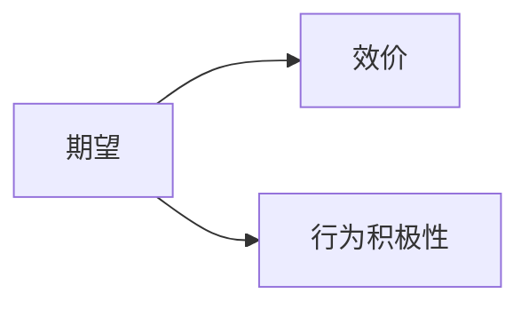
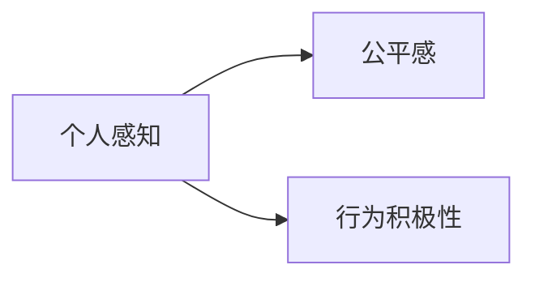
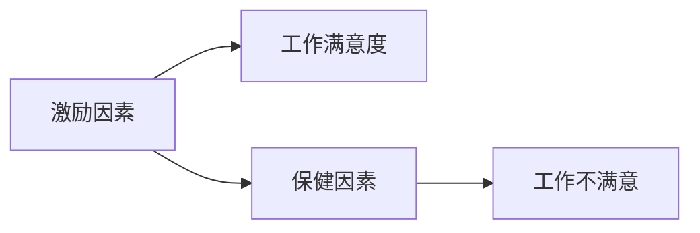

                 

### 引言：团队激励的重要性与挑战

#### 1.1 团队激励的定义与目的

团队激励是指在团队管理过程中，通过一系列策略和手段来激发团队成员的积极性和创造力，从而提高团队的整体工作表现。其核心目的是提升团队的工作效率、增强团队凝聚力和实现团队目标。

团队激励不同于个人激励，它强调的是团队整体而非个体。个人激励通常关注于个体的奖励和认可，而团队激励则关注于整个团队的绩效和合作。团队激励的目的主要包括以下几点：

1. **提高工作效率**：通过有效的激励机制，鼓励团队成员充分发挥潜力，提升工作效率和质量。
2. **增强团队凝聚力**：通过共同的目标和奖励，促进团队成员之间的沟通和协作，增强团队凝聚力。
3. **实现团队目标**：通过激励，引导团队成员朝着共同的目标努力，确保团队整体目标的实现。
4. **激发创新思维**：创造一个积极向上的工作氛围，鼓励团队成员提出创新的想法和解决方案。

#### 1.2 团队激励的重要性

团队激励在团队管理中具有至关重要的地位。以下是一些关键原因：

1. **提升工作表现**：有效的激励可以激发团队成员的积极性和创造力，从而提高团队的整体工作表现。
2. **降低员工流失率**：通过合理的激励措施，可以提高员工的工作满意度和忠诚度，降低员工流失率。
3. **促进团队发展**：团队激励可以帮助团队更好地适应外部环境的变化，推动团队持续发展。
4. **提升企业竞争力**：优秀的团队是企业发展的重要基石。通过团队激励，可以提升企业的整体竞争力。

#### 1.3 团队激励面临的挑战

尽管团队激励的重要性不言而喻，但在实际操作中，团队激励也面临着诸多挑战：

1. **个体差异**：每个团队成员的需求和动机不同，如何制定适合所有成员的激励措施是一个难题。
2. **成本问题**：激励措施的实施往往需要一定的成本投入，对于企业来说，如何在有限的资源下实现最大的激励效果是一个挑战。
3. **文化适应性**：不同的企业文化背景会对激励措施产生不同的影响，如何确保激励措施的适应性是一个关键问题。
4. **绩效评估**：如何公正、准确地评估团队成员的绩效，确保激励的公平性，是团队激励面临的另一个挑战。

在接下来的章节中，我们将深入探讨团队激励的理论基础，以及具体的激励策略和案例分析，帮助读者更好地理解和应用团队激励的艺术。### 基础理论

#### 2.1 马斯洛需求层次理论

马斯洛需求层次理论是由美国心理学家亚伯拉罕·马斯洛提出的，该理论将人类的需求分为五个层次，从低到高分别是：生理需求、安全需求、社交需求、尊重需求和自我实现需求。这一理论在团队激励中有着广泛的应用，可以帮助管理者了解团队成员的需求，从而制定更有效的激励措施。

**图 1：马斯洛需求层次理论**

**2.1.1 马斯洛需求层次理论的介绍**

- **生理需求**：包括食物、水、空气、睡眠等基本生存需求。
- **安全需求**：包括工作保障、健康保险、家庭安全等。
- **社交需求**：包括友谊、爱情、归属感等。
- **尊重需求**：包括自尊、自信、尊重他人等。
- **自我实现需求**：包括实现个人潜力、追求自我价值等。

**2.1.2 在团队激励中的应用**

在团队激励中，管理者可以根据马斯洛需求层次理论，识别团队成员的不同需求层次，并制定相应的激励措施：

1. **基本生理和安全需求**：通过提供良好的工作环境和福利待遇，满足团队成员的基本需求。
2. **社交需求**：通过团队建设活动、团队合作任务，增强团队成员之间的交流和合作。
3. **尊重需求**：通过表扬和认可，提高团队成员的自我价值和自信心。
4. **自我实现需求**：通过提供职业发展机会和创新空间，激发团队成员的潜力。

#### 2.2 期望理论

期望理论是由维克托·弗鲁姆提出的，该理论认为个体在工作中的积极性受到期望值和效价的影响。期望理论在团队激励中的应用，可以帮助管理者了解团队成员的行为动机，从而制定更具有针对性的激励措施。

**图 2：期望理论**

**2.2.1 期望理论的介绍**

- **期望**：个体对于某一行为导致某一结果的信念强度。
- **效价**：个体对于某一结果的重视程度。

期望理论公式为：行为积极性 = 期望 × 效价

**2.2.2 在团队激励中的应用**

在团队激励中，管理者可以根据期望理论，制定以下策略：

1. **提高期望**：通过明确目标和提供必要的资源，提高团队成员对实现目标的信心。
2. **提高效价**：通过设定具有挑战性的目标和提供有吸引力的奖励，提高团队成员对目标的重视程度。
3. **平衡期望和效价**：确保团队成员对目标和奖励的期望与实际情况相符，避免过高或过低的期望导致行为积极性下降。

#### 2.3 公平理论

公平理论是由亚当斯提出的，该理论认为个体在工作中的积极性受到对自己和他人付出与回报的感知平衡的影响。公平理论在团队激励中的应用，可以帮助管理者了解团队成员的公平感，从而调整激励措施，提升团队士气。

**图 3：公平理论**

**2.3.1 公平理论的介绍**

- **个人感知**：个体对自身和他人付出与回报的比较。
- **公平感**：个体对于自身和他人付出与回报是否公平的感受。

公平理论公式为：公平感 = （个人回报/个人投入）÷（他人回报/他人投入）

**2.3.2 在团队激励中的应用**

在团队激励中，管理者可以根据公平理论，采取以下策略：

1. **确保公平**：确保团队成员对自身的回报与投入感到公平，避免因不公平感而降低积极性。
2. **透明度**：提高团队工作的透明度，让团队成员了解其他人的工作状况和回报情况，减少不公平感的产生。
3. **个性化激励**：根据团队成员的不同需求和背景，制定个性化的激励措施，确保每个人都能感受到公平。

#### 2.4 双因素理论

双因素理论是由赫茨伯格提出的，该理论将工作满意度因素分为两类：一类是导致工作满意度的因素，称为“激励因素”；另一类是导致工作不满意的因素，称为“保健因素”。双因素理论在团队激励中的应用，可以帮助管理者了解如何提高团队的整体满意度。

**图 4：双因素理论**

**2.4.1 双因素理论的介绍**

- **激励因素**：与工作内容相关，如成就、认可、成长机会等。
- **保健因素**：与工作环境相关，如薪酬、工作条件、管理方式等。

**2.4.2 在团队激励中的应用**

在团队激励中，管理者可以通过以下策略来应用双因素理论：

1. **关注激励因素**：通过提供挑战性的任务、认可和成长机会，激发团队成员的工作热情。
2. **改善保健因素**：通过提供良好的薪酬、工作环境和良好的管理方式，确保团队成员的基本工作满意度。

通过以上对基础理论的介绍，我们可以了解到团队激励不仅仅是简单的奖励和惩罚，而是一个复杂的系统，需要综合考虑个体的需求、期望、公平感和满意度。在接下来的章节中，我们将探讨具体的团队激励策略，帮助管理者在实践中应用这些理论，提升团队的整体表现。### 实践策略

#### 3.1 目标设定激励

目标设定激励是团队激励中最常用的策略之一，通过明确的目标和清晰的实现路径，激发团队成员的积极性和动力。以下内容将详细介绍目标设定的原则和方法。

**3.1.1 目标设定的原则**

- **具体性（Specific）**：目标应该明确、具体，能够量化，以便团队成员了解需要达成的具体结果。
- **可行性（Achievable）**：目标应该是可以实现的，考虑团队成员的能力和资源限制。
- **相关性（Relevant）**：目标应该与团队的整体目标和成员的个人职业发展相一致。
- **时限性（Time-bound）**：目标应该设定明确的完成时间，以推动团队成员的行动。

**3.1.2 目标设定的方法**

1. **SMART方法**：SMART方法是一种常用的目标设定方法，它将目标设定原则具体化为：具体（Specific）、可衡量（Measurable）、可实现（Achievable）、相关（Relevant）和时限性（Time-bound）。

   **示例**：SMART方法的实际应用如下：

   - **具体**：“提升产品销售量”→“提升产品X的销售量至每月1000件”
   - **可衡量**：“提升销售量”→“提升产品X的销售量至每月1000件”
   - **可实现**：“提升销售量”→“在现有销售团队和资源的基础上，通过增加市场推广和销售策略实现”
   - **相关**：“提升销售量”→“与公司年度销售目标相关”
   - **时限性**：“提升销售量”→“在2023年6月30日前实现”

2. **GROW模型**：GROW模型是一种帮助团队设定目标的方法，它包括以下四个步骤：

   - **G（Goal）：明确目标**：与团队成员共同确定清晰的目标，明确目标的具体内容。
   - **R（Reality）：分析现状**：分析当前团队所处的环境、资源和能力，确定实现目标的可行性。
   - **O（Options）：探索选项**：列出所有可能的实现目标的途径，考虑不同的策略和方案。
   - **W（Way forward）：制定计划**：选择最佳的实现路径，并制定详细的行动计划。

   **示例**：使用GROW模型设定目标的过程如下：

   - **G（Goal）：明确目标**：提升产品X的市场份额。
   - **R（Reality）：分析现状**：当前市场份额为15%，目标市场份额为20%，现有市场推广资源有限。
   - **O（Options）：探索选项**：增加市场推广活动、开发新市场、优化产品功能等。
   - **W（Way forward）：制定计划**：决定增加市场推广活动，并制定具体的推广计划和预算。

通过以上原则和方法的详细介绍，我们可以看到，目标设定激励是一种系统化、结构化的激励策略，能够有效地引导团队成员朝着共同的目标努力。在接下来的章节中，我们将继续探讨其他激励策略，帮助管理者全面提升团队的工作表现。### 绩效奖励激励

#### 3.2 绩效奖励激励

绩效奖励激励是团队激励中的一种重要手段，通过给予团队成员在绩效表现上的奖励，激励其提高工作效率和质量。以下内容将详细探讨绩效奖励的类型及其制定方法。

**3.2.1 绩效奖励的类型**

1. **薪酬激励**：薪酬激励是最直接的绩效奖励方式，包括基本工资、绩效奖金、年终奖等。通过设定与绩效挂钩的薪酬制度，鼓励团队成员提高工作绩效。

2. **职位晋升**：职位晋升是另一种重要的绩效奖励方式。通过给予在绩效上表现突出的团队成员晋升机会，激励其不断追求更高的职业发展。

3. **荣誉和认可**：荣誉和认可是通过表彰和奖励在绩效上表现突出的团队成员，提升其工作满意度和自我价值感。例如，颁发优秀员工奖、最佳团队奖等。

4. **培训和学习机会**：为表现优秀的团队成员提供额外的培训和学习机会，帮助其提升专业技能和职业素养，从而为团队的发展做出更大贡献。

5. **弹性工作时间**：通过提供弹性工作时间等福利，减轻团队成员的工作压力，提高其工作效率和工作质量。

**3.2.2 绩效奖励的制定方法**

1. **明确绩效指标**：制定具体的绩效指标是绩效奖励激励的基础。绩效指标应具有可衡量性、可达成性和公平性，确保团队成员能够明确自己的工作目标和期望。

2. **设定绩效标准**：根据绩效指标，设定明确的绩效标准，确保团队成员了解如何达到优秀的绩效表现。

3. **定期绩效评估**：定期对团队成员的绩效进行评估，确保奖励的公正性和准确性。评估应采用多种评估方法，如360度评估、自评和他评等。

4. **制定奖励方案**：根据绩效评估结果，制定相应的奖励方案。奖励方案应具有吸引力，能够激发团队成员的工作积极性。

5. **公示奖励结果**：公示奖励结果，让团队成员了解奖励的分配情况和原因，提高奖励的透明度和公正性。

6. **持续优化奖励制度**：定期审视和优化奖励制度，确保其能够适应团队和市场的变化，保持激励效果。

通过以上详细的介绍，我们可以看到，绩效奖励激励是一种科学、有效的团队激励策略。在实施过程中，管理者需要根据团队的具体情况和成员的需求，灵活运用各种绩效奖励类型，确保奖励制度的公平性和激励效果。在接下来的章节中，我们将继续探讨其他激励策略，帮助管理者全面提升团队的工作表现。### 职业发展激励

#### 3.3 职业发展激励

职业发展激励是团队激励中的重要组成部分，通过提供职业发展机会和支持，帮助团队成员实现个人成长和职业目标，从而增强团队凝聚力和整体绩效。以下内容将详细探讨职业发展路径及其支持措施。

**3.3.1 职业发展的路径**

1. **内部晋升路径**：为团队成员提供内部晋升机会，使其在现有岗位上获得更多责任和挑战，促进其职业成长。内部晋升路径包括晋升至更高职位、转岗至不同部门等。

2. **外部发展路径**：为团队成员提供外部发展机会，如参加行业会议、培训课程、学习新技能等，帮助其拓宽视野，提升专业技能和职业素养。

3. **专业认证**：鼓励团队成员参加专业认证考试，如PMP、Scrum Master等，提升其专业水平和行业竞争力。

4. **跨部门交流**：通过跨部门交流项目，让团队成员在不同部门工作，获取不同领域的经验和知识，促进职业发展。

**3.3.2 职业发展的支持措施**

1. **培训计划**：为团队成员提供定期的培训计划，包括内部培训和外部培训。培训内容应涵盖专业技能、管理技能、行业趋势等。

2. **导师制度**：为团队成员配备经验丰富的导师，帮助其在职业发展中遇到的问题提供指导和建议。

3. **职业规划指导**：定期为团队成员提供职业规划指导，帮助其制定个人职业发展计划，确保职业目标的实现。

4. **激励机制**：通过奖励机制激励团队成员积极提升自己的职业能力，如提供晋升机会、发放职业发展奖金等。

5. **工作环境优化**：为团队成员创造良好的工作环境，包括提供舒适的工作空间、合理的加班补贴、灵活的工作时间等，确保团队成员能够专注于职业发展。

通过以上职业发展路径和支持措施的详细描述，我们可以看到，职业发展激励是一种长期的、可持续的激励策略，能够帮助团队成员实现个人和团队的双赢。在实施过程中，管理者需要关注团队成员的职业需求和发展意愿，制定个性化的职业发展计划，并提供必要的支持和资源。在接下来的章节中，我们将继续探讨其他激励策略，帮助管理者全面提升团队的工作表现。### 文化激励

#### 3.4 文化激励

文化激励是通过营造积极向上的团队文化，激发团队成员的内在动力，提高团队整体工作表现的一种激励策略。以下内容将详细探讨团队文化的建设策略和文化激励的方法。

**3.4.1 团队文化的建设**

1. **价值观共识**：团队文化建设的核心是价值观共识。管理者需要明确团队的价值观，并确保团队成员对此达成共识。价值观应体现团队的使命、愿景和核心价值观。

2. **领导示范**：领导者是团队文化的关键推动者，其言行举止直接影响团队文化。领导者应通过自身的行为，为团队成员树立榜样，传递积极向上的价值观和行为准则。

3. **沟通与交流**：建立开放的沟通渠道，鼓励团队成员之间进行有效的沟通和交流。通过定期的团队会议、团队活动等，增强团队成员之间的互动和理解。

4. **团队活动**：组织多样化的团队活动，如团队建设活动、体育比赛、文化庆典等，增强团队成员之间的凝聚力和归属感。

5. **奖励与认可**：将团队文化融入奖励与认可机制中，对符合团队价值观的行为进行奖励和认可，强化团队文化的影响力。

**3.4.2 文化激励的策略**

1. **激励导向的价值观传播**：通过内部培训、宣讲、案例分享等方式，向团队成员传递积极向上的价值观，使其在日常生活中践行这些价值观。

2. **团队愿景和目标激励**：明确团队的愿景和目标，让团队成员明确自己的工作意义和使命，激发其内在动力。

3. **文化符号与仪式**：通过团队符号和仪式，如团队徽标、团队口号、生日庆祝等，强化团队成员对团队文化的认同感。

4. **员工参与机制**：鼓励员工参与团队决策和活动策划，增强其对团队文化的参与感和归属感。

5. **文化冲突处理**：在团队文化建设过程中，难免会出现文化冲突。管理者需要及时识别和处理这些冲突，确保团队文化的稳定和持续发展。

通过以上团队文化建设策略和文化激励方法的详细介绍，我们可以看到，文化激励是一种深层次、长期的激励策略，能够从内心激发团队成员的积极性和创造力。在实施过程中，管理者需要注重团队价值观的共识、领导示范、沟通与交流、团队活动、激励导向的价值观传播、团队愿景和目标激励、文化符号与仪式、员工参与机制和文化冲突处理等方面，确保文化激励的有效性。在接下来的章节中，我们将继续探讨负面激励，帮助管理者在团队激励中实现平衡和优化。### 负面激励

#### 3.5 负面激励

负面激励，又称为惩罚激励，是通过给予不良行为或绩效表现的负面后果，促使团队成员纠正错误、改进行为的一种激励策略。虽然负面激励不应该是团队激励的主要手段，但在某些情况下，合理的负面激励有助于维护团队的纪律和效率。以下内容将详细探讨负面激励的定义、适用情况及其注意事项。

**3.5.1 负面激励的定义**

负面激励是指通过采取惩罚措施，如扣减奖金、降职、调离岗位等，来纠正团队成员的不良行为或低绩效表现。负面激励旨在通过施加压力和不适，促使团队成员认识到问题的严重性，从而激发其改正错误、提高工作表现的意愿。

**3.5.2 负面激励的适用情况**

1. **严重违规行为**：如违反公司规章制度、泄露公司机密等，这些行为可能对公司的利益和形象造成重大损害，需要采取负面激励措施进行纠正。

2. **持续低绩效表现**：对于在长时间内无法达到绩效目标的团队成员，负面激励可以作为促进其改进绩效的一种手段。

3. **行为不当**：如工作态度消极、不遵守团队规范等，这些行为可能影响团队的凝聚力和工作效率，需要通过负面激励来纠正。

4. **违反职业道德**：如利用公司资源谋取私利、损害公司利益等，这些行为严重违背职业道德，需要采取负面激励措施。

**3.5.3 负面激励的注意事项**

1. **公正性和透明性**：负面激励措施必须公正、透明，确保团队成员了解处罚的原因和标准，避免主观臆断和不公平待遇。

2. **合理性和适度性**：负面激励措施应合理适度，避免过度惩罚，以免对团队成员造成心理压力和负面影响。

3. **沟通与解释**：在实施负面激励前，应与团队成员进行充分沟通，解释处罚的原因和目的，确保其理解并接受处罚。

4. **改进和辅导**：在实施负面激励的同时，应提供改进和辅导机会，帮助团队成员克服困难，提高工作表现。

5. **反馈和调整**：在负面激励实施后，应关注团队成员的改进情况，根据实际情况及时调整激励措施，确保激励效果。

通过以上对负面激励的详细探讨，我们可以看到，负面激励在团队激励中虽然是一个较为敏感和复杂的主题，但合理的负面激励可以起到维护团队纪律和提高工作效率的作用。在实施过程中，管理者需要谨慎对待，确保负面激励的公正性、合理性和有效性。在接下来的章节中，我们将通过案例解析，进一步探讨团队激励策略的成功与失败，帮助读者更好地理解团队激励的实际应用。### 案例分析

#### 4.1 成功案例

**4.1.1 案例一：谷歌的激励策略**

谷歌以其独特的激励文化而闻名，其激励策略在全球范围内被广泛研究。谷歌的激励策略成功的原因主要包括以下几个方面：

1. **明确的职业发展路径**：谷歌为员工提供了清晰的职业发展路径，从技术专家到管理岗位，每个阶段都有明确的职责和目标。通过这些路径，员工可以清晰地看到自己的职业发展前景，从而更加有动力去追求卓越。

2. **灵活的工作环境**：谷歌的工作环境非常灵活，员工可以根据个人需求调整工作时间，甚至可以在家工作。这种灵活的工作方式提高了员工的工作满意度和生产力。

3. **丰富的福利和奖励**：谷歌为员工提供了丰富的福利，如免费的食品、饮料、健身中心、心理健康支持等。此外，谷歌还设有高额的股票期权奖励，激励员工为公司长期发展贡献力量。

4. **鼓励创新**：谷歌鼓励员工提出新的创意和解决方案，通过内部竞赛和奖金等方式，激发员工的创新潜力。这种开放的创新文化促进了团队的活力和创造力。

**4.1.2 案例二：苹果的创新文化**

苹果公司以其独特的企业文化而闻名，其成功的一个重要因素是其强烈的创新文化。苹果的创新文化主要表现在以下几个方面：

1. **领导者的影响力**：苹果的创始人史蒂夫·乔布斯以其远见卓识和独特的管理风格，激励着整个团队追求卓越。乔布斯的领导风格强调了创新和卓越，使团队成员始终保持着高昂的斗志。

2. **扁平化的组织结构**：苹果公司采用了扁平化的组织结构，减少了管理层级，使信息流通更加顺畅，提高了决策效率。这种结构使团队成员能够更自由地表达自己的想法，促进了创新思维的发展。

3. **持续的培训和学习**：苹果公司为员工提供了大量的培训和学习机会，鼓励员工不断学习新技能和知识。这种持续的学习氛围激发了员工的潜力，提高了整体团队的创新能力。

4. **奖励机制**：苹果公司设有丰富的奖励机制，如创新奖金、晋升机会等，激励员工不断追求卓越。这种奖励机制不仅提高了员工的工作积极性，也增强了团队的凝聚力。

通过以上两个成功案例的分析，我们可以看到，谷歌和苹果的成功主要归功于其独特的激励策略和文化。这些策略不仅关注员工的职业发展和福利，更重要的是鼓励员工的创新和卓越，为团队注入了强大的动力和活力。这些成功经验对于其他组织在实施团队激励时具有重要的借鉴意义。

#### 4.2 失败案例

**4.2.1 案例一：公司的奖励机制失效**

某大型公司曾实施了一项奖励机制，旨在激励员工提高工作效率。然而，在实际执行过程中，这一机制却出现了诸多问题，导致激励效果不佳，反而降低了员工的工作积极性。

1. **奖励标准不明确**：该公司的奖励机制没有明确具体的奖励标准和评估方法，导致员工对奖励的期望值过高或过低，无法激发其工作热情。

2. **奖励不公平**：由于评估标准不透明，部分员工认为奖励分配存在不公平现象，导致员工之间的矛盾和不满情绪加剧。

3. **缺乏反馈和改进**：公司在实施奖励机制后，没有及时对奖励效果进行反馈和改进，使得奖励机制逐渐失去了激励作用。

4. **过度依赖物质奖励**：公司过度依赖物质奖励，忽视了员工的情感需求和职业发展，导致员工对奖励的依赖性增加，忽视了工作本身的价值。

**4.2.2 案例二：团队文化建设的失败**

某科技公司曾在内部开展了团队文化建设活动，旨在提高团队凝聚力和工作效率。然而，由于文化建设过程中存在诸多问题，导致文化建设失败，反而影响了团队的整体表现。

1. **文化内涵不明**：该公司的团队文化建设缺乏明确的文化内涵和核心价值观，导致团队成员对文化建设的重要性认识不足。

2. **领导不重视**：公司领导对团队文化建设的重要性认识不足，缺乏对文化建设的支持和投入，导致文化建设流于形式。

3. **缺乏互动和参与**：团队文化建设过程中，缺乏员工的参与和互动，导致文化建设缺乏实际效果。

4. **缺乏持续性和长期规划**：团队文化建设没有形成持续性的机制和长期规划，导致文化建设效果昙花一现，难以产生深远的影响。

通过以上两个失败案例的分析，我们可以看到，奖励机制失效和团队文化建设失败的原因主要包括奖励标准不明确、奖励不公平、缺乏反馈和改进、过度依赖物质奖励、文化内涵不明、领导不重视、缺乏互动和参与以及缺乏持续性和长期规划等。这些教训对于其他组织在实施团队激励和文化建设时具有重要的启示意义，提醒我们在制定激励策略和开展文化建设时，必须重视细节、公平性和持续性的问题，确保激励策略和文化的有效实施。

### 结论

#### 5.1 团队激励的总结

团队激励是提高团队工作效率、增强团队凝聚力和实现团队目标的重要手段。通过有效的团队激励，可以激发团队成员的积极性和创造力，提升团队的整体表现。本文从基础理论、实践策略和案例分析三个方面，系统地探讨了团队激励的相关内容。

首先，介绍了马斯洛需求层次理论、期望理论、公平理论和双因素理论等基础理论，帮助管理者了解团队激励的理论依据。接着，详细阐述了目标设定激励、绩效奖励激励、职业发展激励、文化激励和负面激励等实践策略，提供了具体实施的方法和注意事项。最后，通过成功和失败案例的分析，总结了团队激励的最佳实践和教训。

#### 5.2 未来团队激励的展望

随着社会和科技的不断发展，团队激励面临着新的挑战和机遇。未来团队激励的发展趋势包括以下几个方面：

1. **个性化和定制化**：随着员工个性化需求的增加，未来团队激励将更加注重个体差异，提供个性化的激励方案。

2. **技术创新**：人工智能、大数据等技术的应用，将为团队激励提供更科学、精准的数据支持，提高激励效果。

3. **情感化激励**：关注员工的情感需求，通过情感化激励手段，提升员工的工作满意度和忠诚度。

4. **可持续性激励**：注重团队的长期发展和员工职业生涯的规划，提供可持续性的激励方案，确保团队激励的长期效果。

#### 5.3 提升团队激励效果的策略

为了提升团队激励效果，管理者可以从以下几个方面入手：

1. **明确目标**：设定具体、可衡量、可实现的目标，确保团队成员了解自己的工作职责和期望。

2. **公正透明**：确保激励措施公正透明，提高员工对激励制度的信任感和满意度。

3. **多样化激励**：结合物质激励和精神激励，提供多样化的激励手段，满足不同员工的需求。

4. **持续改进**：定期评估激励效果，根据团队和员工的反馈，不断调整和优化激励措施。

5. **文化建设**：营造积极向上的团队文化，通过团队文化建设增强员工的归属感和凝聚力。

通过以上策略的实施，管理者可以全面提升团队激励效果，激发团队成员的潜力，推动团队持续发展。

### 附录

#### 6.1 团队激励工具与资源

- **在线培训平台**：如LinkedIn Learning、Coursera等，提供丰富的团队激励培训资源。
- **团队管理工具**：如Trello、Asana等，帮助管理者高效规划团队目标和任务。
- **心理学书籍**：如《激励心理学》、《团队心理学》等，提供关于团队激励的理论和实践指导。

#### 6.2 进一步阅读推荐

- 《团队激励艺术：激发最佳表现》
- 《动机与人格》——亚伯拉罕·马斯洛
- 《激励原理与团队管理》
- 《领导者的激励艺术》

通过以上推荐，读者可以进一步深入了解团队激励的理论和实践，为实际工作提供参考和指导。

### 作者信息

- **作者：AI天才研究院/AI Genius Institute & 禅与计算机程序设计艺术 /Zen And The Art of Computer Programming** 

# 《团队激励艺术：激发最佳表现》

## 关键词：团队激励、目标设定、绩效奖励、职业发展、文化激励、负面激励

> 摘要：本文深入探讨了团队激励的重要性与挑战，详细介绍了马斯洛需求层次理论、期望理论、公平理论和双因素理论等基础理论，并阐述了目标设定激励、绩效奖励激励、职业发展激励、文化激励和负面激励等实践策略。通过成功和失败案例的分析，本文总结了团队激励的最佳实践和教训，为管理者提供了实用的指导。

## 引言：团队激励的重要性与挑战

### 1.1 团队激励的定义与目的

团队激励是指在团队管理过程中，通过一系列策略和手段来激发团队成员的积极性和创造力，从而提高团队的整体工作表现。其核心目的是提升团队的工作效率、增强团队凝聚力和实现团队目标。

### 1.2 团队激励的重要性

团队激励在团队管理中具有至关重要的地位。以下是一些关键原因：

1. **提升工作表现**：通过有效的激励机制，鼓励团队成员充分发挥潜力，提升工作效率和质量。
2. **降低员工流失率**：通过合理的激励措施，可以提高员工的工作满意度和忠诚度，降低员工流失率。
3. **促进团队发展**：团队激励可以帮助团队更好地适应外部环境的变化，推动团队持续发展。
4. **提升企业竞争力**：优秀的团队是企业发展的重要基石。通过团队激励，可以提升企业的整体竞争力。

### 1.3 团队激励面临的挑战

尽管团队激励的重要性不言而喻，但在实际操作中，团队激励也面临着诸多挑战：

1. **个体差异**：每个团队成员的需求和动机不同，如何制定适合所有成员的激励措施是一个难题。
2. **成本问题**：激励措施的实施往往需要一定的成本投入，对于企业来说，如何在有限的资源下实现最大的激励效果是一个挑战。
3. **文化适应性**：不同的企业文化背景会对激励措施产生不同的影响，如何确保激励措施的适应性是一个关键问题。
4. **绩效评估**：如何公正、准确地评估团队成员的绩效，确保激励的公平性，是团队激励面临的另一个挑战。

## 基础理论

### 2.1 马斯洛需求层次理论

马斯洛需求层次理论是由美国心理学家亚伯拉罕·马斯洛提出的，该理论将人类的需求分为五个层次，从低到高分别是：生理需求、安全需求、社交需求、尊重需求和自我实现需求。这一理论在团队激励中有着广泛的应用，可以帮助管理者了解团队成员的需求，从而制定更有效的激励措施。

#### 2.1.1 马斯洛需求层次理论的介绍

- **生理需求**：包括食物、水、空气、睡眠等基本生存需求。
- **安全需求**：包括工作保障、健康保险、家庭安全等。
- **社交需求**：包括友谊、爱情、归属感等。
- **尊重需求**：包括自尊、自信、尊重他人等。
- **自我实现需求**：包括实现个人潜力、追求自我价值等。

#### 2.1.2 在团队激励中的应用

在团队激励中，管理者可以根据马斯洛需求层次理论，识别团队成员的不同需求层次，并制定相应的激励措施：

1. **基本生理和安全需求**：通过提供良好的工作环境和福利待遇，满足团队成员的基本需求。
2. **社交需求**：通过团队建设活动、团队合作任务，增强团队成员之间的交流和合作。
3. **尊重需求**：通过表扬和认可，提高团队成员的自我价值和自信心。
4. **自我实现需求**：通过提供职业发展机会和创新空间，激发团队成员的潜力。

### 2.2 期望理论

期望理论是由维克托·弗鲁姆提出的，该理论认为个体在工作中的积极性受到期望值和效价的影响。期望理论在团队激励中的应用，可以帮助管理者了解团队成员的行为动机，从而制定更具有针对性的激励措施。

#### 2.2.1 期望理论的介绍

- **期望**：个体对于某一行为导致某一结果的信念强度。
- **效价**：个体对于某一结果的重视程度。

期望理论公式为：行为积极性 = 期望 × 效价

#### 2.2.2 在团队激励中的应用

在团队激励中，管理者可以根据期望理论，制定以下策略：

1. **提高期望**：通过明确目标和提供必要的资源，提高团队成员对实现目标的信心。
2. **提高效价**：通过设定具有挑战性的目标和提供有吸引力的奖励，提高团队成员对目标的重视程度。
3. **平衡期望和效价**：确保团队成员对目标和奖励的期望与实际情况相符，避免过高或过低的期望导致行为积极性下降。

### 2.3 公平理论

公平理论是由亚当斯提出的，该理论认为个体在工作中的积极性受到对自己和他人付出与回报的感知平衡的影响。公平理论在团队激励中的应用，可以帮助管理者了解团队成员的公平感，从而调整激励措施，提升团队士气。

#### 2.3.1 公平理论的介绍

- **个人感知**：个体对自身和他人付出与回报的比较。
- **公平感**：个体对于自身和他人付出与回报是否公平的感受。

公平理论公式为：公平感 = （个人回报/个人投入）÷（他人回报/他人投入）

#### 2.3.2 在团队激励中的应用

在团队激励中，管理者可以根据公平理论，采取以下策略：

1. **确保公平**：确保团队成员对自身的回报与投入感到公平，避免因不公平感而降低积极性。
2. **透明度**：提高团队工作的透明度，让团队成员了解其他人的工作状况和回报情况，减少不公平感的产生。
3. **个性化激励**：根据团队成员的不同需求和背景，制定个性化的激励措施，确保每个人都能感受到公平。

### 2.4 双因素理论

双因素理论是由赫茨伯格提出的，该理论将工作满意度因素分为两类：一类是导致工作满意度的因素，称为“激励因素”；另一类是导致工作不满意的因素，称为“保健因素”。双因素理论在团队激励中的应用，可以帮助管理者了解如何提高团队的整体满意度。

#### 2.4.1 双因素理论的介绍

- **激励因素**：与工作内容相关，如成就、认可、成长机会等。
- **保健因素**：与工作环境相关，如薪酬、工作条件、管理方式等。

#### 2.4.2 在团队激励中的应用

在团队激励中，管理者可以通过以下策略来应用双因素理论：

1. **关注激励因素**：通过提供挑战性的任务、认可和成长机会，激发团队成员的工作热情。
2. **改善保健因素**：通过提供良好的薪酬、工作环境和良好的管理方式，确保团队成员的基本工作满意度。

## 实践策略

### 3.1 目标设定激励

目标设定激励是团队激励中最常用的策略之一，通过明确的目标和清晰的实现路径，激发团队成员的积极性和动力。以下内容将详细介绍目标设定的原则和方法。

#### 3.1.1 目标设定的原则

- **具体性（Specific）**：目标应该明确、具体，能够量化，以便团队成员了解需要达成的具体结果。
- **可行性（Achievable）**：目标应该是可以实现的，考虑团队成员的能力和资源限制。
- **相关性（Relevant）**：目标应该与团队的整体目标和成员的个人职业发展相一致。
- **时限性（Time-bound）**：目标应该设定明确的完成时间，以推动团队成员的行动。

#### 3.1.2 目标设定的方法

1. **SMART方法**：SMART方法是一种常用的目标设定方法，它将目标设定原则具体化为：具体（Specific）、可衡量（Measurable）、可实现（Achievable）、相关（Relevant）和时限性（Time-bound）。

   **示例**：SMART方法的实际应用如下：

   - **具体**：“提升产品销售量”→“提升产品X的销售量至每月1000件”
   - **可衡量**：“提升销售量”→“提升产品X的销售量至每月1000件”
   - **可实现**：“提升销售量”→“在现有销售团队和资源的基础上，通过增加市场推广和销售策略实现”
   - **相关**：“提升销售量”→“与公司年度销售目标相关”
   - **时限性**：“提升销售量”→“在2023年6月30日前实现”

2. **GROW模型**：GROW模型是一种帮助团队设定目标的方法，它包括以下四个步骤：

   - **G（Goal）：明确目标**：与团队成员共同确定清晰的目标，明确目标的具体内容。
   - **R（Reality）：分析现状**：分析当前团队所处的环境、资源和能力，确定实现目标的可行性。
   - **O（Options）：探索选项**：列出所有可能的实现目标的途径，考虑不同的策略和方案。
   - **W（Way forward）：制定计划**：选择最佳的实现路径，并制定详细的行动计划。

   **示例**：使用GROW模型设定目标的过程如下：

   - **G（Goal）：明确目标**：提升产品X的市场份额。
   - **R（Reality）：分析现状**：当前市场份额为15%，目标市场份额为20%，现有市场推广资源有限。
   - **O（Options）：探索选项**：增加市场推广活动、开发新市场、优化产品功能等。
   - **W（Way forward）：制定计划**：决定增加市场推广活动，并制定具体的推广计划和预算。

通过以上原则和方法的详细介绍，我们可以看到，目标设定激励是一种系统化、结构化的激励策略，能够有效地引导团队成员朝着共同的目标努力。在接下来的章节中，我们将继续探讨其他激励策略，帮助管理者全面提升团队的工作表现。

### 3.2 绩效奖励激励

绩效奖励激励是团队激励中的一种重要手段，通过给予团队成员在绩效表现上的奖励，激励其提高工作效率和质量。以下内容将详细探讨绩效奖励的类型及其制定方法。

#### 3.2.1 绩效奖励的类型

1. **薪酬激励**：薪酬激励是最直接的绩效奖励方式，包括基本工资、绩效奖金、年终奖等。通过设定与绩效挂钩的薪酬制度，鼓励团队成员提高工作绩效。

2. **职位晋升**：职位晋升是另一种重要的绩效奖励方式。通过给予在绩效上表现突出的团队成员晋升机会，激励其不断追求更高的职业发展。

3. **荣誉和认可**：荣誉和认可是通过表彰和奖励在绩效上表现突出的团队成员，提升其工作满意度和自我价值感。例如，颁发优秀员工奖、最佳团队奖等。

4. **培训和学习机会**：为表现优秀的团队成员提供额外的培训和学习机会，帮助其提升专业技能和职业素养，从而为团队的发展做出更大贡献。

5. **弹性工作时间**：通过提供弹性工作时间等福利，减轻团队成员的工作压力，提高其工作效率和工作质量。

#### 3.2.2 绩效奖励的制定方法

1. **明确绩效指标**：制定具体的绩效指标是绩效奖励激励的基础。绩效指标应具有可衡量性、可达成性和公平性，确保团队成员能够明确自己的工作目标和期望。

2. **设定绩效标准**：根据绩效指标，设定明确的绩效标准，确保团队成员了解如何达到优秀的绩效表现。

3. **定期绩效评估**：定期对团队成员的绩效进行评估，确保奖励的公正性和准确性。评估应采用多种评估方法，如360度评估、自评和他评等。

4. **制定奖励方案**：根据绩效评估结果，制定相应的奖励方案。奖励方案应具有吸引力，能够激发团队成员的工作积极性。

5. **公示奖励结果**：公示奖励结果，让团队成员了解奖励的分配情况和原因，提高奖励的透明度和公正性。

6. **持续优化奖励制度**：定期审视和优化奖励制度，确保其能够适应团队和市场的变化，保持激励效果。

通过以上详细的介绍，我们可以看到，绩效奖励激励是一种科学、有效的团队激励策略。在实施过程中，管理者需要根据团队的具体情况和成员的需求，灵活运用各种绩效奖励类型，确保奖励制度的公平性和激励效果。在接下来的章节中，我们将继续探讨其他激励策略，帮助管理者全面提升团队的工作表现。

### 3.3 职业发展激励

职业发展激励是团队激励中的重要组成部分，通过提供职业发展机会和支持，帮助团队成员实现个人成长和职业目标，从而增强团队凝聚力和整体绩效。以下内容将详细探讨职业发展路径及其支持措施。

#### 3.3.1 职业发展的路径

1. **内部晋升路径**：为团队成员提供内部晋升机会，使其在现有岗位上获得更多责任和挑战，促进其职业成长。内部晋升路径包括晋升至更高职位、转岗至不同部门等。

2. **外部发展路径**：为团队成员提供外部发展机会，如参加行业会议、培训课程、学习新技能等，帮助其拓宽视野，提升专业技能和职业素养。

3. **专业认证**：鼓励团队成员参加专业认证考试，如PMP、Scrum Master等，提升其专业水平和行业竞争力。

4. **跨部门交流**：通过跨部门交流项目，让团队成员在不同部门工作，获取不同领域的经验和知识，促进职业发展。

#### 3.3.2 职业发展的支持措施

1. **培训计划**：为团队成员提供定期的培训计划，包括内部培训和外部培训。培训内容应涵盖专业技能、管理技能、行业趋势等。

2. **导师制度**：为团队成员配备经验丰富的导师，帮助其在职业发展中遇到的问题提供指导和建议。

3. **职业规划指导**：定期为团队成员提供职业规划指导，帮助其制定个人职业发展计划，确保职业目标的实现。

4. **激励机制**：通过奖励机制激励团队成员积极提升自己的职业能力，如提供晋升机会、发放职业发展奖金等。

5. **工作环境优化**：为团队成员创造良好的工作环境，包括提供舒适的工作空间、合理的加班补贴、灵活的工作时间等，确保团队成员能够专注于职业发展。

通过以上职业发展路径和支持措施的详细描述，我们可以看到，职业发展激励是一种长期的、可持续的激励策略，能够帮助团队成员实现个人和团队的双赢。在实施过程中，管理者需要关注团队成员的职业需求和发展意愿，制定个性化的职业发展计划，并提供必要的支持和资源。在接下来的章节中，我们将继续探讨其他激励策略，帮助管理者全面提升团队的工作表现。

### 3.4 文化激励

文化激励是通过营造积极向上的团队文化，激发团队成员的内在动力，提高团队整体工作表现的一种激励策略。以下内容将详细探讨团队文化的建设策略和文化激励的方法。

#### 3.4.1 团队文化的建设

1. **价值观共识**：团队文化建设的核心是价值观共识。管理者需要明确团队的价值观，并确保团队成员对此达成共识。价值观应体现团队的使命、愿景和核心价值观。

2. **领导示范**：领导者是团队文化的关键推动者，其言行举止直接影响团队文化。领导者应通过自身的行为，为团队成员树立榜样，传递积极向上的价值观和行为准则。

3. **沟通与交流**：建立开放的沟通渠道，鼓励团队成员之间进行有效的沟通和交流。通过定期的团队会议、团队活动等，增强团队成员之间的互动和理解。

4. **团队活动**：组织多样化的团队活动，如团队建设活动、体育比赛、文化庆典等，增强团队成员之间的凝聚力和归属感。

5. **奖励与认可**：将团队文化融入奖励与认可机制中，对符合团队价值观的行为进行奖励和认可，强化团队文化的影响力。

#### 3.4.2 文化激励的策略

1. **激励导向的价值观传播**：通过内部培训、宣讲、案例分享等方式，向团队成员传递积极向上的价值观，使其在日常生活中践行这些价值观。

2. **团队愿景和目标激励**：明确团队的愿景和目标，让团队成员明确自己的工作意义和使命，激发其内在动力。

3. **文化符号与仪式**：通过团队符号和仪式，如团队徽标、团队口号、生日庆祝等，强化团队成员对团队文化的认同感。

4. **员工参与机制**：鼓励员工参与团队决策和活动策划，增强其对团队文化的参与感和归属感。

5. **文化冲突处理**：在团队文化建设过程中，难免会出现文化冲突。管理者需要及时识别和处理这些冲突，确保团队文化的稳定和持续发展。

通过以上团队文化建设策略和文化激励方法的详细介绍，我们可以看到，文化激励是一种深层次、长期的激励策略，能够从内心激发团队成员的积极性和创造力。在实施过程中，管理者需要注重团队价值观的共识、领导示范、沟通与交流、团队活动、激励导向的价值观传播、团队愿景和目标激励、文化符号与仪式、员工参与机制和文化冲突处理等方面，确保文化激励的有效性。在接下来的章节中，我们将继续探讨负面激励，帮助管理者在团队激励中实现平衡和优化。

### 3.5 负面激励

负面激励，又称为惩罚激励，是通过给予不良行为或绩效表现的负面后果，促使团队成员纠正错误、改进行为的一种激励策略。以下内容将详细探讨负面激励的定义、适用情况及其注意事项。

#### 3.5.1 负面激励的定义

负面激励是指通过采取惩罚措施，如扣减奖金、降职、调离岗位等，来纠正团队成员的不良行为或低绩效表现。负面激励旨在通过施加压力和不适，促使团队成员认识到问题的严重性，从而激发其改正错误、提高工作表现的意愿。

#### 3.5.2 负面激励的适用情况

1. **严重违规行为**：如违反公司规章制度、泄露公司机密等，这些行为可能对公司的利益和形象造成重大损害，需要采取负面激励措施进行纠正。

2. **持续低绩效表现**：对于在长时间内无法达到绩效目标的团队成员，负面激励可以作为促进其改进绩效的一种手段。

3. **行为不当**：如工作态度消极、不遵守团队规范等，这些行为可能影响团队的凝聚力和工作效率，需要通过负面激励来纠正。

4. **违反职业道德**：如利用公司资源谋取私利、损害公司利益等，这些行为严重违背职业道德，需要采取负面激励措施。

#### 3.5.3 负面激励的注意事项

1. **公正性和透明性**：负面激励措施必须公正、透明，确保团队成员了解处罚的原因和标准，避免主观臆断和不公平待遇。

2. **合理性和适度性**：负面激励措施应合理适度，避免过度惩罚，以免对团队成员造成心理压力和负面影响。

3. **沟通与解释**：在实施负面激励前，应与团队成员进行充分沟通，解释处罚的原因和目的，确保其理解并接受处罚。

4. **改进和辅导**：在实施负面激励的同时，应提供改进和辅导机会，帮助团队成员克服困难，提高工作表现。

5. **反馈和调整**：在负面激励实施后，应关注团队成员的改进情况，根据实际情况及时调整激励措施，确保激励效果。

通过以上对负面激励的详细探讨，我们可以看到，负面激励在团队激励中虽然是一个较为敏感和复杂的主题，但合理的负面激励可以起到维护团队纪律和提高工作效率的作用。在实施过程中，管理者需要谨慎对待，确保负面激励的公正性、合理性和有效性。在接下来的章节中，我们将通过案例解析，进一步探讨团队激励策略的成功与失败，帮助读者更好地理解团队激励的实际应用。

### 案例分析

#### 4.1 成功案例

**4.1.1 案例一：谷歌的激励策略**

谷歌以其独特的激励文化而闻名，其激励策略在全球范围内被广泛研究。谷歌的激励策略成功的原因主要包括以下几个方面：

1. **明确的职业发展路径**：谷歌为员工提供了清晰的职业发展路径，从技术专家到管理岗位，每个阶段都有明确的职责和目标。通过这些路径，员工可以清晰地看到自己的职业发展前景，从而更加有动力去追求卓越。

2. **灵活的工作环境**：谷歌的工作环境非常灵活，员工可以根据个人需求调整工作时间，甚至可以在家工作。这种灵活的工作方式提高了员工的工作满意度和生产力。

3. **丰富的福利和奖励**：谷歌为员工提供了丰富的福利，如免费的食品、饮料、健身中心、心理健康支持等。此外，谷歌还设有高额的股票期权奖励，激励员工为公司长期发展贡献力量。

4. **鼓励创新**：谷歌鼓励员工提出新的创意和解决方案，通过内部竞赛和奖金等方式，激发员工的创新潜力。这种开放的创新文化促进了团队的活力和创造力。

**4.1.2 案例二：苹果的创新文化**

苹果公司以其独特的企业文化而闻名，其成功的一个重要因素是其强烈的创新文化。苹果的创新文化主要表现在以下几个方面：

1. **领导者的影响力**：苹果的创始人史蒂夫·乔布斯以其远见卓识和独特的管理风格，激励着整个团队追求卓越。乔布斯的领导风格强调了创新和卓越，使团队成员始终保持着高昂的斗志。

2. **扁平化的组织结构**：苹果公司采用了扁平化的组织结构，减少了管理层级，使信息流通更加顺畅，提高了决策效率。这种结构使团队成员能够更自由地表达自己的想法，促进了创新思维的发展。

3. **持续的培训和学习**：苹果公司为员工提供了大量的培训和学习机会，鼓励员工不断学习新技能和知识。这种持续的学习氛围激发了员工的潜力，提高了整体团队的创新能力。

4. **奖励机制**：苹果公司设有丰富的奖励机制，如创新奖金、晋升机会等，激励员工不断追求卓越。这种奖励机制不仅提高了员工的工作积极性，也增强了团队的凝聚力。

通过以上两个成功案例的分析，我们可以看到，谷歌和苹果的成功主要归功于其独特的激励策略和文化。这些策略不仅关注员工的职业发展和福利，更重要的是鼓励员工的创新和卓越，为团队注入了强大的动力和活力。这些成功经验对于其他组织在实施团队激励时具有重要的借鉴意义。

#### 4.2 失败案例

**4.2.1 案例一：公司的奖励机制失效**

某大型公司曾实施了一项奖励机制，旨在激励员工提高工作效率。然而，在实际执行过程中，这一机制却出现了诸多问题，导致激励效果不佳，反而降低了员工的工作积极性。

1. **奖励标准不明确**：该公司的奖励机制没有明确具体的奖励标准和评估方法，导致员工对奖励的期望值过高或过低，无法激发其工作热情。

2. **奖励不公平**：由于评估标准不透明，部分员工认为奖励分配存在不公平现象，导致员工之间的矛盾和不满情绪加剧。

3. **缺乏反馈和改进**：公司在实施奖励机制后，没有及时对奖励效果进行反馈和改进，使得奖励机制逐渐失去了激励作用。

4. **过度依赖物质奖励**：公司过度依赖物质奖励，忽视了员工的情感需求和职业发展，导致员工对奖励的依赖性增加，忽视了工作本身的价值。

**4.2.2 案例二：团队文化建设的失败**

某科技公司曾在内部开展了团队文化建设活动，旨在提高团队凝聚力和工作效率。然而，由于文化建设过程中存在诸多问题，导致文化建设失败，反而影响了团队的整体表现。

1. **文化内涵不明**：该公司的团队文化建设缺乏明确的文化内涵和核心价值观，导致团队成员对文化建设的重要性认识不足。

2. **领导不重视**：公司领导对团队文化建设的重要性认识不足，缺乏对文化建设的支持和投入，导致文化建设流于形式。

3. **缺乏互动和参与**：团队文化建设过程中，缺乏员工的参与和互动，导致文化建设缺乏实际效果。

4. **缺乏持续性和长期规划**：团队文化建设没有形成持续性的机制和长期规划，导致文化建设效果昙花一现，难以产生深远的影响。

通过以上两个失败案例的分析，我们可以看到，奖励机制失效和团队文化建设失败的原因主要包括奖励标准不明确、奖励不公平、缺乏反馈和改进、过度依赖物质奖励、文化内涵不明、领导不重视、缺乏互动和参与以及缺乏持续性和长期规划等。这些教训对于其他组织在实施团队激励和文化建设时具有重要的启示意义，提醒我们在制定激励策略和开展文化建设时，必须重视细节、公平性和持续性的问题，确保激励策略和文化的有效实施。

### 结论

#### 5.1 团队激励的总结

团队激励是提高团队工作效率、增强团队凝聚力和实现团队目标的重要手段。通过有效的团队激励，可以激发团队成员的积极性和创造力，提升团队的整体表现。本文从基础理论、实践策略和案例分析三个方面，系统地探讨了团队激励的相关内容。

首先，介绍了马斯洛需求层次理论、期望理论、公平理论和双因素理论等基础理论，帮助管理者了解团队激励的理论依据。接着，详细阐述了目标设定激励、绩效奖励激励、职业发展激励、文化激励和负面激励等实践策略，提供了具体实施的方法和注意事项。最后，通过成功和失败案例的分析，总结了团队激励的最佳实践和教训，为管理者提供了实用的指导。

#### 5.2 未来团队激励的展望

随着社会和科技的不断发展，团队激励面临着新的挑战和机遇。未来团队激励的发展趋势包括以下几个方面：

1. **个性化和定制化**：随着员工个性化需求的增加，未来团队激励将更加注重个体差异，提供个性化的激励方案。

2. **技术创新**：人工智能、大数据等技术的应用，将为团队激励提供更科学、精准的数据支持，提高激励效果。

3. **情感化激励**：关注员工的情感需求，通过情感化激励手段，提升员工的工作满意度和忠诚度。

4. **可持续性激励**：注重团队的长期发展和员工职业生涯的规划，提供可持续性的激励方案，确保团队激励的长期效果。

#### 5.3 提升团队激励效果的策略

为了提升团队激励效果，管理者可以从以下几个方面入手：

1. **明确目标**：设定具体、可衡量、可实现的目标，确保团队成员了解自己的工作职责和期望。

2. **公正透明**：确保激励措施公正透明，提高员工对激励制度的信任感和满意度。

3. **多样化激励**：结合物质激励和精神激励，提供多样化的激励手段，满足不同员工的需求。

4. **持续改进**：定期评估激励效果，根据团队和员工的反馈，不断调整和优化激励措施。

5. **文化建设**：营造积极向上的团队文化，通过团队文化建设增强员工的归属感和凝聚力。

通过以上策略的实施，管理者可以全面提升团队激励效果，激发团队成员的潜力，推动团队持续发展。

### 附录

#### 6.1 团队激励工具与资源

- **在线培训平台**：如LinkedIn Learning、Coursera等，提供丰富的团队激励培训资源。
- **团队管理工具**：如Trello、Asana等，帮助管理者高效规划团队目标和任务。
- **心理学书籍**：如《激励心理学》、《团队心理学》等，提供关于团队激励的理论和实践指导。

#### 6.2 进一步阅读推荐

- 《团队激励艺术：激发最佳表现》
- 《动机与人格》——亚伯拉罕·马斯洛
- 《激励原理与团队管理》
- 《领导者的激励艺术》

通过以上推荐，读者可以进一步深入了解团队激励的理论和实践，为实际工作提供参考和指导。

### 作者信息

- **作者：AI天才研究院/AI Genius Institute & 禅与计算机程序设计艺术 /Zen And The Art of Computer Programming**

