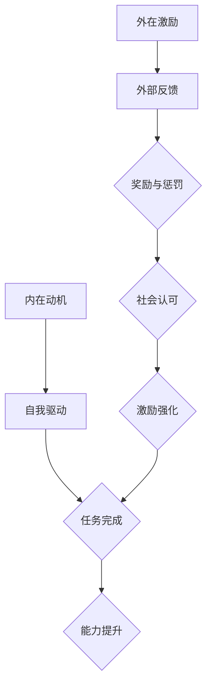

                 

## 文章标题：团队激励：内在动机与外在激励的结合

### 关键词：团队激励、内在动机、外在激励、结合策略、案例分析

### 摘要：本文深入探讨了团队激励的内在动机与外在激励的结合策略。通过定义内在动机和外在激励，分析了它们在团队激励中的重要性。文章提出了一个系统的团队激励模型，并通过实际案例分析，展示了内在动机与外在激励结合策略在实践中的应用效果。本文旨在为管理者提供一种科学的团队激励方法，以提升团队绩效和员工满意度。

---

### 引言

在现代企业中，团队激励是一个至关重要的管理环节。有效的团队激励不仅能够提升员工的积极性和创造力，还能增强团队凝聚力和整体绩效。然而，团队激励并不是一蹴而就的过程，需要深入理解员工的需求和动机，结合不同的激励策略，以达到最佳效果。

本文以《团队激励：内在动机与外在激励的结合》为出发点，旨在探讨如何将内在动机与外在激励有效结合，从而实现团队激励的最大化效果。内在动机和外在激励是两种不同类型的激励方式，它们在团队激励中各有优势，同时也存在一定的局限性。本文将通过对这两种激励方式的深入分析，提出一个综合性的团队激励模型，并运用实际案例来验证这一模型的有效性。

### 核心概念与联系

#### 1. 内在动机

内在动机是指个体出于自身兴趣、热情和好奇心等因素而主动参与某项活动或任务的动力。内在动机的核心在于个体自我驱动，而非外部奖励。心理学家爱德华·德西（Edward L. Deci）和理查德·理斯利（Richard M. Ryan）提出，内在动机可以分为以下几种类型：

- **能力感**：个体通过完成任务或克服挑战，感受到自己的能力和成长。
- **兴趣感**：个体对某项活动或任务具有浓厚的兴趣，愿意投入时间和精力。
- **自主感**：个体在参与活动或任务时，感受到自由和选择的权力。

#### 2. 外在激励

外在激励是指个体因外部因素而参与某项活动或任务的动力。这些外部因素通常包括奖励、惩罚、社会认可等。外在激励的特点在于它依赖于外部评价和反馈。以下是外在激励的几种类型：

- **奖励**：包括物质奖励（如奖金、提成）和精神奖励（如表扬、荣誉）。
- **惩罚**：通过减少某种福利或权益来抑制不良行为。
- **社会认可**：包括来自同事、上级和社会的肯定和赞誉。

#### 3. 内在动机与外在激励的联系

内在动机和外在激励虽然不同，但并非相互排斥，它们可以相互促进。在实际应用中，将内在动机与外在激励结合起来，可以更有效地激发员工的积极性。以下是内在动机与外在激励结合的几个关键点：

- **平衡使用**：合理分配内在动机和外在激励的比例，避免过度依赖某一种激励方式。
- **激励匹配**：根据员工的特点和任务要求，选择合适的激励方式。
- **持续反馈**：通过及时的外在反馈，强化员工的内在动机。

#### 4. Mermaid流程图

为了更好地展示内在动机与外在激励的联系，我们使用Mermaid流程图来描述它们之间的互动关系：

通过这个流程图，我们可以看到内在动机和外在激励如何相互影响，共同推动团队激励的达成。

### 内在动机理论分析

内在动机是驱动员工主动参与工作的重要因素。心理学家德西和理斯利提出了自我决定理论（Self-Determination Theory），该理论认为，内在动机来源于个体在行动中的自主性、能力和相关性的感知。以下是内在动机的几个关键特点：

- **自主性**：个体在行动中感受到自由和选择的权力。
- **能力感**：个体通过完成任务或挑战，感受到自己的能力和成长。
- **相关性**：个体感受到自己的行动对他人或团队有积极的影响。

#### 1. 内在动机的分类

内在动机可以分为以下几种类型：

- **兴趣型**：个体因对某项活动或任务感兴趣而参与。
- **成就型**：个体希望通过完成任务或达到目标来证明自己的能力。
- **帮助型**：个体愿意帮助他人，感到对团队或社会有所贡献。

#### 2. 内在动机的激发方法

为了激发员工的内在动机，管理者可以采取以下几种方法：

- **提供挑战性任务**：通过设置具有挑战性的任务，让员工感受到自己的成长和能力提升。
- **鼓励自主性**：给予员工更多的自主权，让他们在任务选择和执行过程中有更多的自由。
- **建立支持性环境**：为员工提供必要的资源和支持，让他们在遇到困难时能够得到帮助。

#### 3. 内在动机与外在激励的协同效应

内在动机与外在激励并非对立的关系，它们可以相互促进。在实际应用中，可以通过以下方式实现它们的协同效应：

- **奖励机制**：通过适当的物质和精神奖励，强化员工的内在动机。
- **目标设定**：将外在目标与员工的内在动机相结合，使员工在追求外在目标的过程中，也能够实现自我价值的提升。
- **反馈与认可**：及时给予员工反馈和认可，增强他们的成就感和归属感。

### 外在激励理论分析

外在激励在短期内往往能够迅速提升员工的积极性，但长期依赖可能会导致员工产生依赖性。因此，管理者需要合理运用外在激励，以达到最佳效果。以下是外在激励的几个关键特点：

- **即时性**：外在激励通常能够迅速给予员工奖励或惩罚。
- **可见性**：外在激励的效果往往能够被其他员工看到，从而产生示范效应。
- **可控性**：管理者可以通过调整外在激励的条件和标准来控制员工的行为。

#### 1. 外在激励的分类

外在激励可以分为以下几种类型：

- **物质激励**：包括奖金、提成、股票期权等。
- **精神激励**：包括表扬、荣誉、培训机会等。
- **惩罚**：通过减少福利或权益来抑制不良行为。

#### 2. 外在激励的运用策略

为了有效运用外在激励，管理者需要考虑以下策略：

- **公平性**：确保激励的公平性，避免引起员工的嫉妒或不满。
- **针对性**：根据员工的个人需求和团队目标，选择合适的激励方式。
- **持续性**：保持激励的持续性和稳定性，避免员工产生短期行为。

#### 3. 内在动机与外在激励的协同效应

外在激励与内在动机并非完全对立，它们可以相互补充。在实际应用中，可以通过以下方式实现它们的协同效应：

- **结合目标设定**：将外在目标和内在动机相结合，使员工在追求外在目标的过程中，也能够实现自我价值的提升。
- **奖励与认可**：通过适当的物质和精神奖励，强化员工的内在动机。
- **反馈与沟通**：及时给予员工反馈和认可，增强他们的成就感和归属感。

### 团队激励模型构建

为了实现有效的团队激励，我们需要构建一个综合性的团队激励模型。这个模型应当包括核心概念、理论基础、策略设计和实施步骤。以下是团队激励模型的主要组成部分：

#### 1. 团队激励模型概述

团队激励模型可以分为以下四个层次：

- **目标层**：明确团队的目标和愿景，为激励提供方向。
- **激励层**：设计内在动机和外在激励的具体策略。
- **评估层**：对激励效果进行评估和反馈，以不断优化激励策略。
- **执行层**：实施激励策略，确保员工能够切实感受到激励。

#### 2. 团队激励模型的结构

团队激励模型的结构包括以下几个部分：

- **激励因素**：内在动机和外在激励的具体因素，如自主性、能力感、奖励机制等。
- **激励机制**：激励策略的实施机制，如目标设定、奖励制度、反馈机制等。
- **激励环境**：激励策略的实施环境，如企业文化、管理风格、团队氛围等。
- **激励效果**：激励策略的实施效果，如员工满意度、团队绩效等。

#### 3. 团队激励模型的功能

团队激励模型的主要功能包括：

- **提高员工积极性**：通过激励策略，激发员工的内在动机和外在动力。
- **提升团队绩效**：通过有效的激励，增强团队凝聚力和整体绩效。
- **优化管理方法**：为管理者提供科学的管理工具，以提升管理水平。

### 团队激励策略设计

团队激励策略的设计是确保激励模型有效实施的关键。以下是一些设计团队激励策略的原则和方法：

#### 1. 团队激励策略的制定原则

- **个性化**：根据员工的个人需求和特点，设计个性化的激励策略。
- **针对性**：根据团队目标和任务要求，选择合适的激励策略。
- **可持续性**：确保激励策略的长期有效性，避免短期行为。
- **公平性**：确保激励的公平性，避免引起员工的嫉妒或不满。

#### 2. 团队激励策略的实施方法

- **目标设定**：明确团队和个人的目标，为激励提供明确的方向。
- **奖励制度**：设计合理的奖励制度，激发员工的积极性。
- **反馈与认可**：及时给予员工反馈和认可，增强他们的成就感和归属感。
- **沟通与培训**：通过沟通和培训，提高员工的内在动机和外在动力。

### 内在动机与外在激励的结合策略

在实际应用中，将内在动机与外在激励结合起来，可以更有效地激发员工的积极性。以下是一些具体的结合策略：

#### 1. 内在动机与外在激励的匹配原则

- **目标一致性**：确保内在动机和外在激励的目标一致，避免冲突。
- **激励平衡**：根据不同情境，合理分配内在动机和外在激励的比例。
- **持续激励**：通过持续的外在激励，强化员工的内在动机。

#### 2. 内在动机与外在激励的优化策略

- **激励组合**：结合不同的激励方式，形成多元化的激励组合。
- **反馈与调整**：根据员工的行为和绩效，及时给予反馈和调整激励策略。
- **文化塑造**：通过企业文化，强化内在动机，使其成为团队的核心动力。

### 案例分析

为了更好地理解内在动机与外在激励的结合策略，我们通过两个实际案例来进行详细分析。

#### 案例一：科技公司团队激励实践

在一个科技公司中，管理者采用了以下策略来激发员工的内在动机和外在动力：

- **内在动机激发**：通过设置具有挑战性的项目，鼓励员工发挥创意和自主性。
- **外在激励结合**：为优秀员工提供奖金、股票期权和晋升机会。

通过这种结合策略，公司不仅提高了员工的满意度，还显著提升了团队绩效。

#### 案例二：制造业企业团队激励实践

在一个制造业企业中，管理者采用了以下策略来平衡内在动机和外在激励：

- **内在动机激发**：通过团队建设活动和培训，提高员工的团队协作能力。
- **外在激励结合**：通过绩效奖金和表彰大会，激励员工追求卓越。

这种结合策略有效提升了员工的工作积极性，促进了企业的稳定发展。

### 实战应用

在实际应用中，结合内在动机与外在激励的团队激励策略，需要根据不同的情境进行调整。以下是一些具体的实战应用方法：

#### 1. 内在动机激发策略实战

- **实战背景**：一个初创公司希望通过激发员工的内在动机，提高团队创新能力。
- **实战策略**：
  - 设定具有挑战性的项目，鼓励员工发挥创意和自主性。
  - 定期组织团队建设活动，增强员工之间的沟通与合作。

#### 2. 外在激励策略实战

- **实战背景**：一家企业希望通过奖励机制，提高员工的工作积极性。
- **实战策略**：
  - 设立绩效奖金制度，根据员工的工作绩效进行奖励。
  - 定期举行表彰大会，对优秀员工进行公开表彰。

#### 3. 内在动机与外在激励结合策略实战

- **实战背景**：一家企业希望结合内在动机和外在激励，全面提升员工的工作积极性。
- **实战策略**：
  - 设定明确的目标，将内在动机与外在激励相结合。
  - 通过奖励机制和反馈机制，持续激发员工的内在动机。

### 总结与展望

通过本文的探讨，我们可以看到内在动机与外在激励在团队激励中的重要性。在实际应用中，合理结合内在动机与外在激励，可以更有效地激发员工的积极性，提升团队绩效。未来，随着科技的发展和企业管理理念的更新，团队激励策略也将不断优化和发展。管理者需要不断学习和实践，以应对不断变化的管理挑战。

### 附录

#### 附录A：参考资料

- Deci, E. L., & Ryan, R. M. (2000). *The" What" and" Why" of Goal Pursuits: Human Needs and the Self-Determination of Behavior*. Psychological Inquiry, 11(4), 227-268.
- Locke, E. A., & Latham, G. P. (2002). *Building a Practical Theory of Goal Setting and Task Motivation: A 35-Year Odyssey*. American Psychologist, 57(9), 705-717.
- Hinsz, V. B., Hogg, M. A., & Houkamane-Delanois, C. (2015). *Group size and group performance: A meta-analysis*. Small Group Research, 46(2), 199-228.

#### 附录B：团队激励策略工具与资源

- **内在动机激发工具**：
  - **目标管理工具**：使用SMART原则（具体、可衡量、可实现、相关、时限性）设定目标。
  - **反馈工具**：使用定期的绩效反馈会议，及时给予员工反馈。

- **外在激励工具**：
  - **奖励制度设计工具**：使用平衡计分卡（Balanced Scorecard）来设计绩效奖励制度。
  - **培训与发展工具**：提供员工培训和发展机会，提高员工的技能和知识。

- **团队激励策略制定与评估工具**：
  - **问卷调查工具**：使用问卷调查来评估员工对激励策略的满意度。
  - **数据分析工具**：使用数据分析工具（如Excel、SPSS）来分析激励策略的效果。

#### 作者信息

作者：AI天才研究院/AI Genius Institute & 禅与计算机程序设计艺术 /Zen And The Art of Computer Programming

---

通过本文的详细探讨，我们希望能够为读者提供一种全面而深入的团队激励策略。在实施团队激励时，管理者需要结合具体情况，灵活运用内在动机与外在激励，以实现最佳效果。同时，不断学习和实践是提升团队管理水平的必由之路。希望本文能为您的团队激励实践提供有益的启示。

