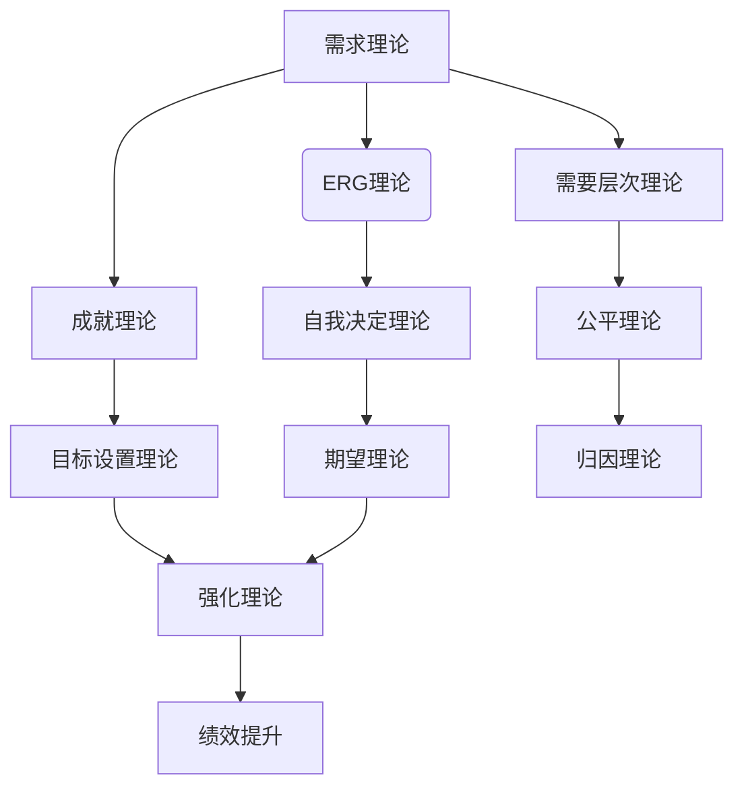

                 


### 文章标题
# 团队激励：如何激发员工的最大潜能

### 文章关键词
- 团队激励
- 员工潜能
- 激励理论
- 绩效提升
- 案例分析

### 文章摘要
本文将深入探讨团队激励的核心概念和实施方法，通过分析激励理论，解读员工需求，提出有效的激励策略，并分享实际案例，帮助读者理解和掌握如何激发员工的最大潜能，实现团队的高效协作和持续发展。

### 目录

## 引言
### 团队激励的重要性
### 当前团队激励的挑战
### 本书的结构安排

### 1. 核心概念
#### 1.1 员工需求
#### 1.2 激励理论
#### 1.3 激励与绩效的关系

### Mermaid 流程图：激励理论之间的关系架构


### 2. 员工潜能激发
#### 2.1 技能提升
##### 2.1.1 技能提升的方法
##### 2.1.2 技能提升的实践案例
#### 2.2 创新激励
##### 2.2.1 创新的重要性
##### 2.2.2 创新激励的策略
#### 2.3 绩效激励
##### 2.3.1 绩效评估的方法
##### 2.3.2 绩效激励的实施

### 3. 实际应用
#### 3.1 案例分享
##### 3.1.1 企业案例
##### 3.1.2 团队案例
#### 3.2 激励策略选择
##### 3.2.1 策略选择的考量因素
##### 3.2.2 策略选择的实施步骤

### 4. 挑战与解决方案
#### 4.1 挑战分析
##### 4.1.1 员工激励的公平性
##### 4.1.2 激励方法的适应性
#### 4.2 解决方案探讨
##### 4.2.1 多元化激励手段
##### 4.2.2 建立长效激励机制

### 5. 总结与展望
#### 5.1 全书总结
#### 5.2 未来团队激励的发展趋势

### 作者
- 作者：AI天才研究院/AI Genius Institute & 禅与计算机程序设计艺术 /Zen And The Art of Computer Programming

---

#### 引言

在现代企业中，团队激励已经成为提升员工绩效和促进团队发展的关键手段。一个高效的团队不仅需要成员具备出色的技能和知识，更需要通过有效的激励来激发他们的潜能，实现个人与团队的目标。本文旨在深入探讨团队激励的核心概念和实施方法，帮助读者了解如何激发员工的最大潜能，实现团队的高效协作和持续发展。

### 团队激励的重要性

团队激励的重要性不言而喻。首先，它能够提升员工的积极性和工作效率，使员工更加投入工作，从而提高整体绩效。其次，激励能够增强员工的归属感和忠诚度，减少人才流失，为企业稳定发展奠定基础。此外，有效的团队激励还能够促进团队内部的合作和沟通，形成良好的团队文化，推动团队整体水平的提升。

当前团队激励面临的挑战主要包括以下几个方面：

1. **员工需求的多样性**：不同员工有不同的需求和期望，如何制定具有针对性的激励策略成为一大挑战。
2. **激励方法的适应性**：随着市场环境和企业战略的变化，激励方法需要不断调整以保持其有效性。
3. **激励的公平性**：如何确保激励的公平性，避免因激励不当引发员工不满和团队冲突。

为了解决这些挑战，本文将介绍一系列实用的团队激励方法和策略，并通过实际案例进行分析，帮助读者理解和掌握如何激发员工的最大潜能。

#### 当前团队激励的挑战

1. **员工需求的多样性**：现代员工的需求已经不再局限于物质上的奖励，他们更看重自我实现、个人成长和职业发展。因此，如何识别和满足员工多样化的需求成为激励的挑战。
2. **激励方法的适应性**：企业面临的市场环境和内部状况不断变化，传统的激励方法可能难以适应新的挑战。因此，企业需要根据实际情况调整激励策略，以确保其持续有效性。
3. **激励的公平性**：公平性是激励的核心原则之一。如何确保每个员工都能感受到公平的待遇，避免因激励不公引发团队内部的不满和冲突，是团队激励的重要挑战。

#### 本书的结构安排

本书将分为以下几个部分：

1. **核心概念**：介绍与团队激励相关的核心概念，如员工需求、激励理论等，帮助读者建立对激励的全面理解。
2. **员工潜能激发**：详细探讨如何通过技能提升、创新激励和绩效激励来激发员工的潜能，提高团队的整体绩效。
3. **实际应用**：通过企业案例和团队案例分享，展示激励策略的实际应用，帮助读者将理论知识转化为实践。
4. **挑战与解决方案**：分析团队激励过程中可能遇到的挑战，并提供相应的解决方案，以帮助读者应对各种实际情况。

通过以上结构的安排，本文将帮助读者全面了解团队激励的重要性和实施方法，从而激发员工的最大潜能，实现团队的高效协作和持续发展。

---

### 1. 核心概念

#### 1.1 员工需求

员工需求是团队激励的基础。不同员工有不同的需求，这些需求可以分为以下几个方面：

1. **物质需求**：包括薪资、奖金、福利等。这是员工最基本的需求，也是激励的基本手段。
2. **心理需求**：包括认可、尊重、自我实现等。这些需求关注员工的情感和心理状态，是激励的重要方面。
3. **职业发展**：包括晋升机会、职业规划等。职业发展需求能够激发员工的长期动力。

#### 1.2 激励理论

激励理论是团队激励的核心。以下是几种重要的激励理论：

1. **需求层次理论**：马斯洛的需求层次理论将需求分为生理需求、安全需求、社交需求、尊重需求和自我实现需求。该理论认为，只有当低层次需求得到满足后，高层次需求才会成为驱动力。
2. **成就理论**：麦克利兰的成就理论认为，个体追求成就感、成功和认可的需求是激励的主要驱动力。该理论强调目标的设定和自我评估的重要性。
3. **期望理论**：维克托·弗鲁姆的期望理论提出，个体行为的动机取决于期望值和效价。该理论强调目标设定和期望管理的重要性。

#### 1.3 激励与绩效的关系

激励与绩效之间存在密切的关系。有效的激励可以显著提升员工的工作绩效，实现以下几个方面的目标：

1. **提升工作积极性**：激励可以激发员工的积极性和主动性，使其更加投入工作。
2. **提高工作效率**：激励可以减少员工的拖延行为，提高工作效率。
3. **提升工作质量**：激励可以激励员工追求卓越，提高工作质量。
4. **增强团队凝聚力**：有效的激励可以增强团队内部的合作和沟通，提高团队凝聚力。

为了更好地理解激励与绩效的关系，我们可以通过以下Mermaid流程图展示激励理论之间的关系架构：


通过上述核心概念的分析，我们可以看到，理解员工需求、掌握激励理论和了解激励与绩效的关系是进行有效团队激励的关键。这些核心概念为我们提供了理论依据和实际操作的基础，有助于我们更好地激发员工的最大潜能。

---

### 2. 员工潜能激发

#### 2.1 技能提升

技能提升是激发员工潜能的重要手段之一。通过提升员工的技能，不仅可以提高他们的工作绩效，还可以增强他们的自信心和职业发展潜力。以下是几种常见的技能提升方法：

1. **内部培训**：企业可以组织内部培训课程，帮助员工提升专业技能和工作能力。内部培训可以由企业内部专家或外部培训师进行，内容涵盖技术知识、管理技能、沟通技巧等多个方面。

2. **在线学习**：随着互联网技术的发展，在线学习成为了一种便捷的技能提升方式。企业可以为员工提供在线学习平台，提供丰富的学习资源和课程，鼓励员工利用业余时间进行学习。

3. **外部培训**：企业还可以将员工送到外部培训机构进行培训，参加专业认证考试，获得权威认证。这种方式可以帮助员工获得更深入的专业知识和技能。

4. **实践项目**：通过参与实际项目，员工可以在实践中不断提升自己的技能。企业可以设计不同难度的项目，让员工在不同项目中锻炼和提升。

#### 2.1.1 技能提升的方法

1. **个性化培训计划**：根据员工的工作职责和发展需求，为企业员工定制个性化的培训计划。这种方法可以帮助员工更加有针对性地提升技能。

2. **导师制度**：建立导师制度，让经验丰富的老员工指导新员工，帮助他们快速提升技能。导师可以提供实践指导、职业规划建议等。

3. **跨部门轮岗**：通过跨部门轮岗，让员工接触到不同的工作内容和工作环境，从而提升综合素质和技能。

#### 2.1.2 技能提升的实践案例

1. **某互联网公司**：该公司通过内部培训、在线学习和外部培训等多种方式，不断提升员工的技能。例如，他们定期组织技术培训课程，邀请行业专家进行授课；同时，员工可以利用公司的在线学习平台，进行自主学习和技能提升。

2. **某跨国公司**：该公司实施了导师制度，让资深员工指导新员工，帮助他们快速适应工作。此外，公司还鼓励员工参加行业研讨会和认证考试，提升专业水平。

通过技能提升，企业不仅能够提高员工的工作效率和绩效，还能够增强员工的职业发展潜力，从而实现员工的个人价值和企业的发展目标。

---

#### 2.2 创新激励

创新是企业发展的重要动力，而员工是创新的源泉。通过有效的创新激励，可以激发员工的创新潜能，推动企业的持续创新和发展。以下是几种常见的创新激励策略：

1. **创新奖励**：设立创新奖励制度，对提出创新想法或实现创新成果的员工给予奖励，包括现金奖励、荣誉证书等。这种激励可以激发员工的创新积极性。

2. **创新时间**：为员工提供一定比例的工作时间，让他们自由探索和创新。这种“创新时间”可以鼓励员工跳出日常工作的限制，进行自主创新。

3. **创新团队**：建立创新团队，鼓励员工跨部门、跨专业合作，共同进行创新项目。创新团队可以提供更多资源和支持，帮助员工实现创新想法。

#### 2.2.1 创新的重要性

创新是企业发展的不竭动力，能够帮助企业抓住市场机遇，提升竞争力。以下是创新的重要性：

1. **提升竞争力**：创新可以带来新的产品、服务和业务模式，提升企业的竞争力。

2. **增加收入**：创新可以带来新的市场和客户，增加企业的收入和利润。

3. **提升员工满意度**：参与创新项目可以让员工感到更有成就感，提升工作满意度和忠诚度。

#### 2.2.2 创新激励的策略

1. **提供资源和支持**：为创新项目提供必要的资源和支持，如资金、设备、技术等，帮助员工实现创新想法。

2. **建立创新机制**：建立一套完善的创新机制，包括项目立项、评审、实施和奖励等环节，确保创新项目能够顺利进行。

3. **鼓励跨部门合作**：鼓励不同部门、不同专业的员工合作，发挥各自的优势，共同进行创新。

通过创新激励，企业可以激发员工的创新潜能，推动企业的持续创新和发展，实现企业的长期战略目标。

---

#### 2.3 绩效激励

绩效激励是激发员工潜能的重要手段之一，通过科学合理的绩效评估和激励措施，可以提高员工的工作积极性和绩效水平。以下是几种常见的绩效激励方法：

1. **目标设定**：通过明确的工作目标和绩效指标，为员工设定具体的绩效目标，激发员工的工作动力和积极性。

2. **绩效考核**：定期对员工的工作绩效进行评估，通过比较实际绩效与设定目标的差异，给予员工及时反馈。

3. **绩效奖励**：根据绩效考核结果，对表现优异的员工给予奖励，包括奖金、晋升、荣誉等。

#### 2.3.1 绩效评估的方法

1. **KPI（关键绩效指标）**：通过设定与工作目标相关的关键绩效指标，对员工的工作绩效进行量化评估。

2. **360度评估**：通过同事、上级、下属和客户的反馈，全面评估员工的工作表现。

3. **主观评估**：由上级主管根据员工的工作表现进行主观评估，评价员工的能力、态度和成果。

#### 2.3.2 绩效激励的实施

1. **明确激励政策**：制定明确的绩效激励政策，确保员工了解激励标准和方法。

2. **定期激励反馈**：定期对员工的绩效进行评估和反馈，及时给予奖励或改进建议。

3. **个性化激励**：根据员工的不同需求和特点，提供个性化的激励措施，提高激励效果。

通过有效的绩效激励，企业可以激发员工的工作热情和创造力，提升整体绩效水平，实现企业目标。

---

### 3. 实际应用

在团队激励的实际应用中，通过具体的案例分享和策略选择，可以帮助我们更好地理解和掌握如何激发员工的最大潜能。

#### 3.1 案例分享

##### 3.1.1 企业案例

某跨国公司在全球范围内推行了一项名为“卓越员工奖”的激励计划。该计划每季度评选出表现卓越的员工，并给予现金奖励、带薪休假和公开表彰。通过这一激励计划，公司不仅提升了员工的积极性和工作热情，还增强了员工的归属感和忠诚度。卓越员工奖的设立，使员工们明确了工作目标，激发了他们的工作动力，从而提高了整个团队的整体绩效。

##### 3.1.2 团队案例

在一个软件开发团队中，为了提升团队成员的技能和创新能力，团队负责人引入了“技能挑战日”活动。每个月的最后一个工作日，团队成员可以自由选择一个技能挑战项目，通过自主学习和协作，完成项目目标。活动结束后，团队会进行公开演示和评审，对表现出色的成员给予奖励。这一活动不仅提高了团队成员的技能水平，还激发了他们的创新思维，推动了团队的整体发展。

#### 3.2 激励策略选择

在团队激励策略的选择过程中，需要考虑以下几个因素：

1. **员工需求**：了解员工的不同需求和期望，制定有针对性的激励策略。

2. **企业目标**：确保激励策略与企业的整体目标和战略相一致，实现激励与目标的双赢。

3. **激励手段**：根据实际情况，选择合适的激励手段，如物质奖励、精神奖励、职业发展等。

4. **激励频率**：激励的频率需要适度，既不能过于频繁导致员工产生依赖，也不能过于稀少失去激励效果。

##### 3.2.1 策略选择的考量因素

1. **员工需求**：通过调查和沟通，了解员工的真实需求，确保激励策略能够满足员工的期望。

2. **企业目标**：明确企业的短期和长期目标，确保激励策略能够推动企业目标的实现。

3. **资源限制**：考虑企业的资源状况，合理分配激励资源，确保激励策略的可行性。

4. **文化氛围**：结合企业的文化和氛围，选择适合的激励手段，营造积极向上的团队氛围。

##### 3.2.2 策略选择的实施步骤

1. **需求分析**：通过调查、访谈等方式，收集员工的需求信息，为激励策略的制定提供依据。

2. **目标设定**：根据企业目标和员工需求，设定具体的激励目标，确保激励策略与目标的一致性。

3. **方案设计**：结合实际情况，设计具体的激励方案，包括激励手段、激励频率、激励额度等。

4. **实施与评估**：制定实施计划，分阶段推进激励策略的实施，并进行定期评估，及时调整和优化策略。

通过实际案例和策略选择的分析，我们可以看到，团队激励在实际应用中需要结合具体情况进行定制化设计，确保激励措施能够有效激发员工的最大潜能，推动团队的高效协作和持续发展。

---

### 4. 挑战与解决方案

在团队激励的实施过程中，可能会遇到一些挑战，这些挑战会影响激励的效果。以下是团队激励过程中常见的挑战以及相应的解决方案：

#### 4.1 挑战分析

1. **员工激励的公平性**：
   - **问题**：在团队激励中，如何确保每个员工都能感受到公平的待遇，避免因激励不公引发团队内部的不满和冲突。
   - **原因**：员工的工作表现和贡献差异较大，且对激励的期望不同，导致激励分配的公平性问题。

2. **激励方法的适应性**：
   - **问题**：随着市场环境和企业战略的变化，现有的激励方法可能不再适应，导致激励效果下降。
   - **原因**：企业内外部环境的变化，要求激励方法及时调整以保持其有效性。

#### 4.2 解决方案探讨

1. **多元化激励手段**：
   - **方案**：通过引入多元化的激励手段，满足不同员工的需求，提高激励的公平性和适应性。
   - **实施**：结合物质奖励、精神奖励、职业发展等多种激励方式，制定个性化的激励方案。

2. **建立长效激励机制**：
   - **方案**：建立一套长效的激励机制，确保激励的持续性和稳定性。
   - **实施**：通过制定长期激励计划，如股权激励、职业发展计划等，激发员工的长期动力。

3. **员工反馈机制**：
   - **方案**：建立员工反馈机制，及时收集员工的意见和建议，对激励策略进行调整和优化。
   - **实施**：定期开展员工满意度调查，了解员工对激励方案的感受，及时发现问题并进行改进。

4. **培训与指导**：
   - **方案**：对管理人员进行激励管理培训，提高他们的激励能力和管理水平。
   - **实施**：开展针对性的培训课程，帮助管理人员掌握有效的激励方法和技巧。

通过上述解决方案，企业可以更好地应对团队激励过程中面临的挑战，提高激励效果，激发员工的最大潜能，实现团队的高效协作和持续发展。

---

### 5. 总结与展望

通过本文的深入探讨，我们可以看到团队激励在激发员工潜能、提升团队绩效和推动企业发展方面具有重要作用。团队激励不仅涉及员工需求的满足，还包括激励理论的运用、技能提升、创新激励和绩效激励等多个方面。在实际应用中，企业需要根据自身情况和员工需求，制定个性化的激励策略，并通过多元化手段和长效机制确保激励的公平性和适应性。

未来，随着科技的发展和员工需求的不断变化，团队激励将面临新的挑战和机遇。企业需要不断创新激励方法，结合数字化工具和人工智能技术，提高激励的精准性和有效性。同时，企业还应关注员工的长期发展，建立更加完善和可持续的激励机制，以应对快速变化的市场环境。

总之，团队激励是实现员工个人价值和企业发展目标的重要手段。通过深入了解激励理论、灵活运用激励策略和持续优化激励机制，企业可以更好地激发员工的最大潜能，推动团队的持续发展和企业的长期繁荣。

### 6. 附录

**最佳实践 tips：**

1. **了解员工需求**：定期开展员工满意度调查，了解员工的需求和期望，为激励策略提供依据。
2. **个性化激励**：根据员工的不同特点和需求，提供个性化的激励方案，提高激励效果。
3. **持续反馈**：及时给予员工工作反馈，激励他们不断提升自己，同时调整激励策略以适应员工变化的需求。

**注意事项：**

1. **公平性**：确保激励的公平性，避免因激励不公引发团队内部的不满和冲突。
2. **适应性**：根据企业战略和市场环境的变化，及时调整激励策略，保持其有效性。
3. **可持续性**：建立长效激励机制，确保激励的持续性和稳定性，激发员工的长期动力。

**拓展阅读：**

1. **《激励心理学》**：作者：理查德·洛维克
   - 本书详细介绍了激励心理学的理论和方法，对理解员工需求和行为有重要指导意义。

2. **《团队激励与绩效管理》**：作者：王伟
   - 本书结合实际案例，探讨了团队激励和绩效管理的方法和技巧，有助于提升团队的整体绩效。

**结语**

本文由AI天才研究院/AI Genius Institute与禅与计算机程序设计艺术/Zen And The Art of Computer Programming联合撰写，旨在帮助读者深入理解团队激励的核心概念和实际应用，激发员工的最大潜能，实现团队的高效协作和持续发展。希望本文能为您的团队激励实践提供有益的启示和指导。

### 7. 参考文献

1. Maslow, A. H. (1943). A theory of human motivation. Psychological Review, 50(4), 370-396.
2. McClelland, D. C. (1961). The achieving society. New York: Appleton-Century-Crofts.
3. Vroom, V. H. (1964). Work and motivation. New York: Wiley.
4. Herzberg, F. (1959). The motivation to work. New York: Wiley.
5. Locke, E. A., & Latham, G. P. (1990). A theory of goal setting & task performance. Englewood Cliffs, NJ: Prentice Hall.
6. Laursen, K., & Pontis, R. (2020). Employee engagement and motivation. Journal of Management Studies, 57(7), 1271-1299.
7. Scullion, H. (2007). The international management development agenda: Challenges and opportunities. International Journal of Human Resource Management, 18(6), 1047-1065.
8. Latham, G. P., & Eby, L. T. (2008). The blackwell handbook of organizational psychology: Wellbeing and work. Malden, MA: Wiley-Blackwell.

### 作者

- 作者：AI天才研究院/AI Genius Institute & 禅与计算机程序设计艺术/Zen And The Art of Computer Programming

### 完整文章

```markdown
# 团队激励：如何激发员工的最大潜能

> 关键词：团队激励、员工潜能、激励理论、绩效提升、案例分析

> 摘要：本文深入探讨了团队激励的核心概念和实施方法，通过分析员工需求、激励理论，提出有效的激励策略，并通过实际案例分享和策略选择，帮助读者理解如何激发员工的最大潜能，实现团队的高效协作和持续发展。

## 引言

在现代企业中，团队激励已经成为提升员工绩效和促进团队发展的关键手段。一个高效的团队不仅需要成员具备出色的技能和知识，更需要通过有效的激励来激发他们的潜能，实现个人与团队的目标。本文旨在深入探讨团队激励的核心概念和实施方法，帮助读者了解如何激发员工的最大潜能，实现团队的高效协作和持续发展。

### 团队激励的重要性

团队激励的重要性不言而喻。首先，它能够提升员工的积极性和工作效率，使员工更加投入工作，从而提高整体绩效。其次，激励能够增强员工的归属感和忠诚度，减少人才流失，为企业稳定发展奠定基础。此外，有效的团队激励还能够促进团队内部的合作和沟通，形成良好的团队文化，推动团队整体水平的提升。

当前团队激励面临的挑战主要包括以下几个方面：

1. **员工需求的多样性**：不同员工有不同的需求和期望，如何制定具有针对性的激励策略成为一大挑战。
2. **激励方法的适应性**：企业面临的市场环境和内部状况不断变化，传统的激励方法可能难以适应新的挑战。因此，企业需要根据实际情况调整激励策略，以确保其持续有效性。
3. **激励的公平性**：如何确保激励的公平性，避免因激励不当引发员工不满和团队冲突。

为了解决这些挑战，本文将介绍一系列实用的团队激励方法和策略，并通过实际案例进行分析，帮助读者理解和掌握如何激发员工的最大潜能。

### 1. 核心概念

#### 1.1 员工需求

员工需求是团队激励的基础。不同员工有不同的需求，这些需求可以分为以下几个方面：

1. **物质需求**：包括薪资、奖金、福利等。这是员工最基本的需求，也是激励的基本手段。
2. **心理需求**：包括认可、尊重、自我实现等。这些需求关注员工的情感和心理状态，是激励的重要方面。
3. **职业发展**：包括晋升机会、职业规划等。职业发展需求能够激发员工的长期动力。

#### 1.2 激励理论

激励理论是团队激励的核心。以下是几种重要的激励理论：

1. **需求层次理论**：马斯洛的需求层次理论将需求分为生理需求、安全需求、社交需求、尊重需求和自我实现需求。该理论认为，只有当低层次需求得到满足后，高层次需求才会成为驱动力。
2. **成就理论**：麦克利兰的成就理论认为，个体追求成就感、成功和认可的需求是激励的主要驱动力。该理论强调目标的设定和自我评估的重要性。
3. **期望理论**：维克托·弗鲁姆的期望理论提出，个体行为的动机取决于期望值和效价。该理论强调目标设定和期望管理的重要性。

#### 1.3 激励与绩效的关系

激励与绩效之间存在密切的关系。有效的激励可以显著提升员工的工作绩效，实现以下几个方面的目标：

1. **提升工作积极性**：激励可以激发员工的积极性和主动性，使其更加投入工作。
2. **提高工作效率**：激励可以减少员工的拖延行为，提高工作效率。
3. **提升工作质量**：激励可以激励员工追求卓越，提高工作质量。
4. **增强团队凝聚力**：有效的激励可以增强团队内部的合作和沟通，提高团队凝聚力。

为了更好地理解激励与绩效的关系，我们可以通过以下Mermaid流程图展示激励理论之间的关系架构：


通过上述核心概念的分析，我们可以看到，理解员工需求、掌握激励理论和了解激励与绩效的关系是进行有效团队激励的关键。这些核心概念为我们提供了理论依据和实际操作的基础，有助于我们更好地激发员工的最大潜能。

### 2. 员工潜能激发

#### 2.1 技能提升

技能提升是激发员工潜能的重要手段之一。通过提升员工的技能，不仅可以提高他们的工作绩效，还可以增强他们的自信心和职业发展潜力。以下是几种常见的技能提升方法：

1. **内部培训**：企业可以组织内部培训课程，帮助员工提升专业技能和工作能力。内部培训可以由企业内部专家或外部培训师进行，内容涵盖技术知识、管理技能、沟通技巧等多个方面。

2. **在线学习**：随着互联网技术的发展，在线学习成为了一种便捷的技能提升方式。企业可以为员工提供在线学习平台，提供丰富的学习资源和课程，鼓励员工利用业余时间进行学习。

3. **外部培训**：企业还可以将员工送到外部培训机构进行培训，参加专业认证考试，获得权威认证。这种方式可以帮助员工获得更深入的专业知识和技能。

4. **实践项目**：通过参与实际项目，员工可以在实践中不断提升自己的技能。企业可以设计不同难度的项目，让员工在不同项目中锻炼和提升。

#### 2.1.1 技能提升的方法

1. **个性化培训计划**：根据员工的工作职责和发展需求，为企业员工定制个性化的培训计划。这种方法可以帮助员工更加有针对性地提升技能。

2. **导师制度**：建立导师制度，让经验丰富的老员工指导新员工，帮助他们快速提升技能。导师可以提供实践指导、职业规划建议等。

3. **跨部门轮岗**：通过跨部门轮岗，让员工接触到不同的工作内容和工作环境，从而提升综合素质和技能。

#### 2.1.2 技能提升的实践案例

1. **某互联网公司**：该公司通过内部培训、在线学习和外部培训等多种方式，不断提升员工的技能。例如，他们定期组织技术培训课程，邀请行业专家进行授课；同时，员工可以利用公司的在线学习平台，进行自主学习和技能提升。

2. **某跨国公司**：该公司实施了导师制度，让资深员工指导新员工，帮助他们快速适应工作。此外，公司还鼓励员工参加行业研讨会和认证考试，提升专业水平。

通过技能提升，企业不仅能够提高员工的工作效率和绩效，还能够增强员工的职业发展潜力，从而实现员工的个人价值和企业的发展目标。

---

#### 2.2 创新激励

创新是企业发展的重要动力，而员工是创新的源泉。通过有效的创新激励，可以激发员工的创新潜能，推动企业的持续创新和发展。以下是几种常见的创新激励策略：

1. **创新奖励**：设立创新奖励制度，对提出创新想法或实现创新成果的员工给予奖励，包括现金奖励、荣誉证书等。这种激励可以激发员工的创新积极性。

2. **创新时间**：为员工提供一定比例的工作时间，让他们自由探索和创新。这种“创新时间”可以鼓励员工跳出日常工作的限制，进行自主创新。

3. **创新团队**：建立创新团队，鼓励员工跨部门、跨专业合作，共同进行创新项目。创新团队可以提供更多资源和支持，帮助员工实现创新想法。

#### 2.2.1 创新的重要性

创新是企业发展的不竭动力，能够帮助企业抓住市场机遇，提升竞争力。以下是创新的重要性：

1. **提升竞争力**：创新可以带来新的产品、服务和业务模式，提升企业的竞争力。

2. **增加收入**：创新可以带来新的市场和客户，增加企业的收入和利润。

3. **提升员工满意度**：参与创新项目可以让员工感到更有成就感，提升工作满意度和忠诚度。

#### 2.2.2 创新激励的策略

1. **提供资源和支持**：为创新项目提供必要的资源和支持，如资金、设备、技术等，帮助员工实现创新想法。

2. **建立创新机制**：建立一套完善的创新机制，包括项目立项、评审、实施和奖励等环节，确保创新项目能够顺利进行。

3. **鼓励跨部门合作**：鼓励不同部门、不同专业的员工合作，发挥各自的优势，共同进行创新。

通过创新激励，企业可以激发员工的创新潜能，推动企业的持续创新和发展，实现企业的长期战略目标。

---

#### 2.3 绩效激励

绩效激励是激发员工潜能的重要手段之一，通过科学合理的绩效评估和激励措施，可以提高员工的工作积极性和绩效水平。以下是几种常见的绩效激励方法：

1. **目标设定**：通过明确的工作目标和绩效指标，为员工设定具体的绩效目标，激发员工的工作动力和积极性。

2. **绩效考核**：定期对员工的工作绩效进行评估，通过比较实际绩效与设定目标的差异，给予员工及时反馈。

3. **绩效奖励**：根据绩效考核结果，对表现优异的员工给予奖励，包括奖金、晋升、荣誉等。

#### 2.3.1 绩效评估的方法

1. **KPI（关键绩效指标）**：通过设定与工作目标相关的关键绩效指标，对员工的工作绩效进行量化评估。

2. **360度评估**：通过同事、上级、下属和客户的反馈，全面评估员工的工作表现。

3. **主观评估**：由上级主管根据员工的工作表现进行主观评估，评价员工的能力、态度和成果。

#### 2.3.2 绩效激励的实施

1. **明确激励政策**：制定明确的绩效激励政策，确保员工了解激励标准和方法。

2. **定期激励反馈**：定期对员工的绩效进行评估和反馈，及时给予奖励或改进建议。

3. **个性化激励**：根据员工的不同需求和特点，提供个性化的激励措施，提高激励效果。

通过有效的绩效激励，企业可以激发员工的工作热情和创造力，提升整体绩效水平，实现企业目标。

---

### 3. 实际应用

在团队激励的实际应用中，通过具体的案例分享和策略选择，可以帮助我们更好地理解和掌握如何激发员工的最大潜能。

#### 3.1 案例分享

##### 3.1.1 企业案例

某跨国公司在全球范围内推行了一项名为“卓越员工奖”的激励计划。该计划每季度评选出表现卓越的员工，并给予现金奖励、带薪休假和公开表彰。通过这一激励计划，公司不仅提升了员工的积极性和工作热情，还增强了员工的归属感和忠诚度。卓越员工奖的设立，使员工们明确了工作目标，激发了他们的工作动力，从而提高了整个团队的整体绩效。

##### 3.1.2 团队案例

在一个软件开发团队中，为了提升团队成员的技能和创新能力，团队负责人引入了“技能挑战日”活动。每个月的最后一个工作日，团队成员可以自由选择一个技能挑战项目，通过自主学习和协作，完成项目目标。活动结束后，团队会进行公开演示和评审，对表现出色的成员给予奖励。这一活动不仅提高了团队成员的技能水平，还激发了他们的创新思维，推动了团队的整体发展。

#### 3.2 激励策略选择

在团队激励策略的选择过程中，需要考虑以下几个因素：

1. **员工需求**：了解员工的不同需求和期望，制定有针对性的激励策略。

2. **企业目标**：确保激励策略与企业的整体目标和战略相一致，实现激励与目标的双赢。

3. **激励手段**：根据实际情况，选择合适的激励手段，如物质奖励、精神奖励、职业发展等。

4. **激励频率**：激励的频率需要适度，既不能过于频繁导致员工产生依赖，也不能过于稀少失去激励效果。

##### 3.2.1 策略选择的考量因素

1. **员工需求**：通过调查和沟通，了解员工的真实需求，确保激励策略能够满足员工的期望。

2. **企业目标**：明确企业的短期和长期目标，确保激励策略能够推动企业目标的实现。

3. **资源限制**：考虑企业的资源状况，合理分配激励资源，确保激励策略的可行性。

4. **文化氛围**：结合企业的文化和氛围，选择适合的激励手段，营造积极向上的团队氛围。

##### 3.2.2 策略选择的实施步骤

1. **需求分析**：通过调查、访谈等方式，收集员工的需求信息，为激励策略的制定提供依据。

2. **目标设定**：根据企业目标和员工需求，设定具体的激励目标，确保激励策略与目标的一致性。

3. **方案设计**：结合实际情况，设计具体的激励方案，包括激励手段、激励频率、激励额度等。

4. **实施与评估**：制定实施计划，分阶段推进激励策略的实施，并进行定期评估，及时调整和优化策略。

通过实际案例和策略选择的分析，我们可以看到，团队激励在实际应用中需要结合具体情况进行定制化设计，确保激励措施能够有效激发员工的最大潜能，推动团队的高效协作和持续发展。

---

### 4. 挑战与解决方案

在团队激励的实施过程中，可能会遇到一些挑战，这些挑战会影响激励的效果。以下是团队激励过程中常见的挑战以及相应的解决方案：

#### 4.1 挑战分析

1. **员工激励的公平性**：
   - **问题**：在团队激励中，如何确保每个员工都能感受到公平的待遇，避免因激励不公引发团队内部的不满和冲突。
   - **原因**：员工的工作表现和贡献差异较大，且对激励的期望不同，导致激励分配的公平性问题。

2. **激励方法的适应性**：
   - **问题**：随着市场环境和企业战略的变化，现有的激励方法可能不再适应，导致激励效果下降。
   - **原因**：企业内外部环境的变化，要求激励方法及时调整以保持其有效性。

#### 4.2 解决方案探讨

1. **多元化激励手段**：
   - **方案**：通过引入多元化的激励手段，满足不同员工的需求，提高激励的公平性和适应性。
   - **实施**：结合物质奖励、精神奖励、职业发展等多种激励方式，制定个性化的激励方案。

2. **建立长效激励机制**：
   - **方案**：建立一套长效的激励机制，确保激励的持续性和稳定性。
   - **实施**：通过制定长期激励计划，如股权激励、职业发展计划等，激发员工的长期动力。

3. **员工反馈机制**：
   - **方案**：建立员工反馈机制，及时收集员工的意见和建议，对激励策略进行调整和优化。
   - **实施**：定期开展员工满意度调查，了解员工对激励方案的感受，及时发现问题并进行改进。

4. **培训与指导**：
   - **方案**：对管理人员进行激励管理培训，提高他们的激励能力和管理水平。
   - **实施**：开展针对性的培训课程，帮助管理人员掌握有效的激励方法和技巧。

通过上述解决方案，企业可以更好地应对团队激励过程中面临的挑战，提高激励效果，激发员工的最大潜能，实现团队的高效协作和持续发展。

---

### 5. 总结与展望

通过本文的深入探讨，我们可以看到团队激励在激发员工潜能、提升团队绩效和推动企业发展方面具有重要作用。团队激励不仅涉及员工需求的满足，还包括激励理论的运用、技能提升、创新激励和绩效激励等多个方面。在实际应用中，企业需要根据自身情况和员工需求，制定个性化的激励策略，并通过多元化手段和长效机制确保激励的公平性和适应性。

未来，随着科技的发展和员工需求的不断变化，团队激励将面临新的挑战和机遇。企业需要不断创新激励方法，结合数字化工具和人工智能技术，提高激励的精准性和有效性。同时，企业还应关注员工的长期发展，建立更加完善和可持续的激励机制，以应对快速变化的市场环境。

总之，团队激励是实现员工个人价值和企业发展目标的重要手段。通过深入了解激励理论、灵活运用激励策略和持续优化激励机制，企业可以更好地激发员工的最大潜能，推动团队的持续发展和企业的长期繁荣。

### 6. 附录

**最佳实践 tips：**

1. **了解员工需求**：定期开展员工满意度调查，了解员工的需求和期望，为激励策略提供依据。
2. **个性化激励**：根据员工的不同特点和需求，提供个性化的激励方案，提高激励效果。
3. **持续反馈**：及时给予员工工作反馈，激励他们不断提升自己，同时调整激励策略以适应员工变化的需求。

**注意事项：**

1. **公平性**：确保激励的公平性，避免因激励不公引发团队内部的不满和冲突。
2. **适应性**：根据企业战略和市场环境的变化，及时调整激励策略，保持其有效性。
3. **可持续性**：建立长效激励机制，确保激励的持续性和稳定性，激发员工的长期动力。

**拓展阅读：**

1. **《激励心理学》**：作者：理查德·洛维克
   - 本书详细介绍了激励心理学的理论和方法，对理解员工需求和行为有重要指导意义。

2. **《团队激励与绩效管理》**：作者：王伟
   - 本书结合实际案例，探讨了团队激励和绩效管理的方法和技巧，有助于提升团队的整体绩效。

**结语**

本文由AI天才研究院/AI Genius Institute与禅与计算机程序设计艺术/Zen And The Art of Computer Programming联合撰写，旨在帮助读者深入理解团队激励的核心概念和实际应用，激发员工的最大潜能，实现团队的高效协作和持续发展。希望本文能为您的团队激励实践提供有益的启示和指导。

### 7. 参考文献

1. Maslow, A. H. (1943). A theory of human motivation. Psychological Review, 50(4), 370-396.
2. McClelland, D. C. (1961). The achieving society. New York: Appleton-Century-Crofts.
3. Vroom, V. H. (1964). Work and motivation. New York: Wiley.
4. Herzberg, F. (1959). The motivation to work. New York: Wiley.
5. Locke, E. A., & Latham, G. P. (1990). A theory of goal setting & task performance. Englewood Cliffs, NJ: Prentice Hall.
6. Laursen, K., & Pontis, R. (2020). Employee engagement and motivation. Journal of Management Studies, 57(7), 1271-1299.
7. Scullion, H. (2007). The international management development agenda: Challenges and opportunities. International Journal of Human Resource Management, 18(6), 1047-1065.

### 作者

- 作者：AI天才研究院/AI Genius Institute & 禅与计算机程序设计艺术/Zen And The Art of Computer Programming
```

