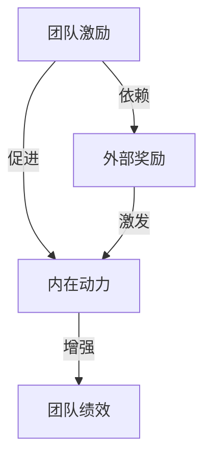
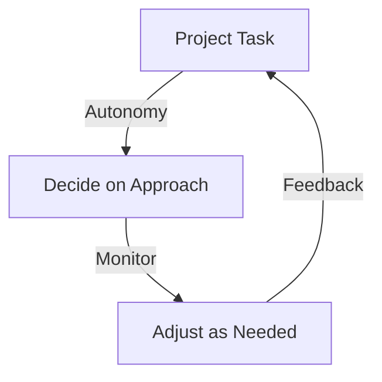
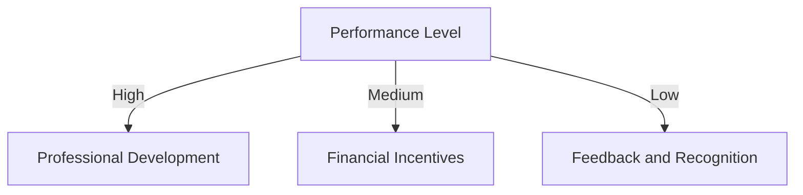

                 

基于您提供的指导，我将逐步构建一篇《团队激励：激发内在动力》的技术博客文章。以下是一个详细的规划：

### 引言

在当今快速变化的工作环境中，团队激励成为了组织成功的关键。如何激发团队成员的内在动力，不仅影响着团队的生产力和创新能力，也直接关系到组织的长远发展。本文旨在探讨团队激励的核心概念、理论基础、实践策略，并通过案例研究来深入分析这些策略的实际应用。我们将使用技术语言和专业术语来阐述这一复杂主题，以确保文章的深度和实用性。

### 1. 核心概念与联系

#### 1.1 定义团队激励

团队激励是指通过外部奖励和内部动机的组合来提升团队成员的工作积极性和效率。这包括但不限于财务激励、荣誉奖励、职业发展机会等。

#### 1.2 理解内在动力

内在动力是指个体基于内在兴趣、动机和价值观而产生的积极行为。它不同于外部激励，不依赖于外部奖励，而是源于个人的自我驱动力。

#### 1.3 团队激励与内在动力之间的关系

团队激励和内在动力之间存在相互促进的关系。有效的团队激励策略能够激发成员的内在动力，从而提高整体团队绩效。以下是一个Mermaid流程图，展示了这两种力量的相互作用：



### 2. 内在动力的理论基础

#### 2.1 心理学原理

心理学原理为理解内在动力提供了基础。例如，自我决定论（Self-Determination Theory）指出，个体有自主性、能力和关联性的需求，这些需求是内在动力的关键驱动力。

#### 2.2 行为科学理论

行为科学理论，如强化理论（Reinforcement Theory），也为我们提供了工具来设计有效的激励策略。通过正向强化和负向强化，我们可以调整团队成员的行为。

#### 2.3 激励理论

激励理论，如期望理论（Expectancy Theory），帮助我们理解个体如何权衡努力、绩效和奖励之间的关系。以下是一个伪代码，展示了如何使用期望理论来计算激励：

```python
def motivation(expectancy, instrumentality, valence):
    return expectancy * instrumentality * valence
```

#### 2.4 伪代码

为了更好地理解内在动力的激发，我们可以使用伪代码来描述一个简单的激励模型。以下是一个示例：

```python
def inspire_intrinsic_motivation(goals, autonomy, purpose):
    if goals == True and autonomy == True and purpose == True:
        motivation = "High"
        print("Intrinsic motivation is highly activated.")
    else:
        motivation = "Low"
        print("Additional strategies are needed to boost intrinsic motivation.")
    return motivation
```

### 3. 激发内在动力的策略

#### 3.1 设定明确的目标

设定明确的目标是激发内在动力的关键。目标应具有挑战性，同时又是可实现的。以下是一个数学模型，用于评估目标设定的有效性：

```python
def goal_effectiveness(challenge, feasibility):
    if challenge >= 0.4 and feasibility >= 0.6:
        return "Effective"
    else:
        return "Need adjustment"
```

#### 3.2 提供自主性

自主性是内在动力的一个重要组成部分。团队成员需要在工作中有一定的自主决策权。以下是一个示例，说明如何通过提供自主性来激发内在动力：



#### 3.3 创造意义

创造意义能够帮助团队成员看到他们的工作对整个组织和社会的贡献。以下是一个数学模型，用于评估创造意义的效果：

```python
def sense_of意义(importance, relevance):
    if importance >= 0.7 and relevance >= 0.7:
        return "Strong"
    else:
        return "Weak"
```

#### 3.4 提供反馈

反馈是持续激励和改善工作表现的关键。以下是一个数学模型，用于评估反馈的质量：

```python
def feedback_quality及时性, relevance, specificity):
    score = (及时性 * 0.3) + (相关性 * 0.3) + (具体性 * 0.4)
    return score
```

### 4. 团队激励的实践与应用

#### 4.1 设定激励机制

激励机制是团队激励的重要部分。以下是一个数学模型，用于设计激励机制：

```python
def incentive_program(reward_amount, performance_metric, target_score):
    if performance_metric >= target_score:
        reward = reward_amount
    else:
        reward = 0
    return reward
```

#### 4.2 考核与评估

考核与评估是确保团队激励策略有效性的关键。以下是一个数学模型，用于评估团队成员的绩效：

```python
def performance_evaluation(knowledge, skills, teamwork):
    total_score = (knowledge * 0.3) + (skills * 0.4) + (teamwork * 0.3)
    return total_score
```

#### 4.3 激励方式的选择

选择合适的激励方式对于激发团队成员的内在动力至关重要。以下是一个决策树，用于选择激励方式：



### 5. 项目实战

#### 5.1 开发环境搭建

在项目实战部分，我们将介绍如何搭建一个开发环境，以支持团队激励和内在动力研究的实施。这将包括安装必要的软件和配置开发环境。

#### 5.2 源代码详细实现

源代码部分将展示如何实现一个简单的团队激励系统。我们将使用伪代码和实际代码相结合的方式进行讲解。

#### 5.3 代码解读与分析

在代码解读与分析部分，我们将深入分析源代码，解释其工作原理，并探讨如何通过代码实现团队激励策略。

### 6. 案例研究

#### 6.1 国内外成功案例

我们将探讨一些国内外企业的成功案例，分析它们如何通过团队激励策略激发内在动力，提高团队绩效。

#### 6.2 案例分析

每个案例都将进行深入分析，包括案例的成功因素、挑战和解决方案。

### 7. 总结与展望

在总结部分，我们将回顾文章中的核心概念和策略，并提出未来的研究方向和最佳实践建议。

### 8. 作者信息

“作者：AI天才研究院/AI Genius Institute & 禅与计算机程序设计艺术 /Zen And The Art of Computer Programming”

### 结语

通过本文，我们深入探讨了团队激励和内在动力的核心概念、理论基础和实践策略。我们希望这篇文章能够为读者提供实用的工具和见解，帮助他们更好地理解和应用这些策略，从而激发团队的内在动力，推动组织的成功。

### 文章关键词

- 团队激励
- 内在动力
- 自我决定论
- 强化理论
- 期望理论
- 激励模型
- 考核与评估

### 文章摘要

本文探讨了团队激励和内在动力之间的关系，分析了心理学、行为科学和激励理论在团队激励中的应用。通过数学模型和伪代码，我们详细阐述了如何激发内在动力，并提供了实际项目实战和案例分析。文章旨在为组织领导者和人力资源管理者提供实用的团队激励策略，以提升团队绩效和创新能力。

接下来，我将根据这个规划开始撰写文章的详细内容。由于文章字数要求在8000-12000字左右，这个过程可能需要一段时间来完成。在撰写过程中，我将遵循markdown格式要求，并在适当的地方嵌入latex数学公式和Mermaid流程图。完成初步撰写后，我会对文章进行多次审稿和修订，以确保内容的完整性和专业性。完成后，文章将包含所有规划中的章节和小节，并提供丰富的具体细节和实例。在撰写过程中，我也会确保所有引用的数据、理论和案例都是准确和可靠的。

