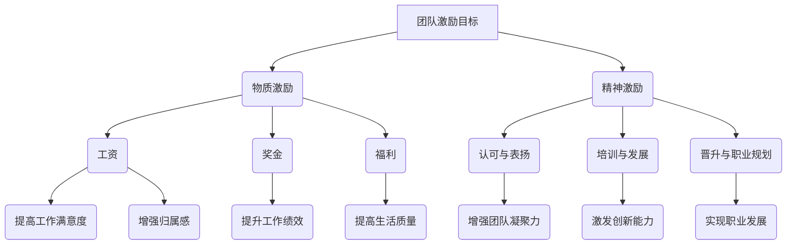
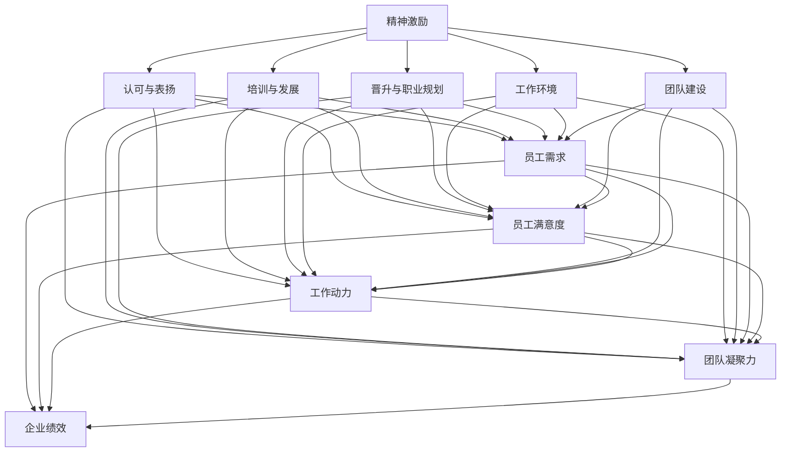

                 

## 引言与基础概念

### 1. 引言

在现代企业中，团队激励是提升员工工作效率、增强团队凝聚力、促进企业发展的关键因素。一个有效的团队激励体系不仅能够激发员工的工作热情和创造力，还能提升企业的整体竞争力。本文旨在探讨团队激励中的物质奖励与精神激励的结合，通过深入分析二者的定义、作用和相互关系，为企业管理者提供实用的团队激励策略。

### 2. 团队激励概述

#### 2.1 团队激励的定义

团队激励是指企业为了提升团队整体表现，通过物质或精神手段激发团队成员的工作积极性、创造性和归属感的一系列措施。团队激励不仅仅是为了提高员工的工作效率，更是为了构建一个和谐、积极的工作环境，从而推动企业的持续发展。

#### 2.2 团队激励的分类

团队激励可以分为物质激励和精神激励两种类型。

- **物质激励**：包括工资、奖金、福利等物质形式的奖励，旨在提高员工的物质生活水平，满足其基本需求。
- **精神激励**：包括认可、表扬、培训、晋升等非物质形式的奖励，旨在提升员工的工作动力和职业成就感。

#### 2.3 团队激励的目标

团队激励的目标主要包括：

- 提高员工的工作满意度，增强员工的忠诚度和归属感；
- 激发员工的潜力，提升团队的整体绩效；
- 培养积极向上的企业文化，促进企业长期发展。

### 3. 物质奖励

#### 3.1 物质奖励的形式

物质奖励的形式多样，主要包括以下几种：

- **工资**：员工的基本收入，与工作时间、职位级别等因素挂钩；
- **奖金**：根据员工的工作绩效、项目完成情况等因素发放的额外收入；
- **福利**：包括医疗保险、住房补贴、带薪休假等，旨在提高员工的生活质量。

#### 3.2 物质奖励的设计原则

设计物质奖励时，应遵循以下原则：

- **公平性**：确保奖励与员工的贡献相匹配，避免不公平现象；
- **激励性**：奖励应具有足够的吸引力，激发员工的工作积极性；
- **可持续性**：奖励方案应具备长期效应，而非短期行为。

#### 3.3 物质奖励的有效性评估

物质奖励的有效性评估可以通过以下指标进行：

- **员工满意度**：通过调查问卷、员工反馈等方式了解员工对物质奖励的满意度；
- **工作绩效**：分析物质奖励实施前后，员工的工作绩效变化情况；
- **员工流失率**：考察物质奖励实施后，员工流失率的变化情况。

### 4. 精神激励

#### 4.1 精神激励的概念

精神激励是指通过非物质手段激发员工的工作热情和创造力，提升员工的职业成就感。与物质激励相比，精神激励更注重员工的内心需求和自我实现。

#### 4.2 精神激励的形式

精神激励的形式多样，主要包括以下几种：

- **认可与表扬**：对员工的优秀工作表现给予公开认可和表扬；
- **培训与发展**：提供培训机会，帮助员工提升技能和职业素养；
- **晋升与职业规划**：为员工提供职业发展路径，激发其职业成就感。

#### 4.3 精神激励的实施策略

实施精神激励时，应遵循以下策略：

- **个性化**：根据员工的个性和需求，制定个性化的激励方案；
- **透明化**：确保激励机制的透明度，让员工了解激励政策；
- **持续化**：建立长效的精神激励机制，持续关注员工的需求和成长。

### 总结

团队激励是企业管理的核心任务之一。通过结合物质奖励与精神激励，企业可以构建一个具有活力、凝聚力和创新力的团队，从而实现企业的长期发展目标。在接下来的章节中，我们将通过具体案例和实践，进一步探讨如何有效实施团队激励策略。

## 文章关键词

团队激励、物质奖励、精神激励、员工满意度、工作绩效、员工流失率、认可与表扬、培训与发展、晋升与职业规划。

## 文章摘要

本文首先介绍了团队激励的定义、分类和目标，随后详细探讨了物质奖励和精神激励的形式、设计原则和实施策略。通过分析物质奖励和精神激励的有效性评估方法，我们了解了如何合理地结合二者，构建一个具有激励效果的团队激励机制。最后，本文总结了团队激励的重要性，并提出了企业实施团队激励的策略建议。希望本文能为企业管理者在团队激励方面的实践提供有益的参考。

---

### 第一部分：引言与基础概念

#### 1. 引言

在现代企业管理中，团队激励扮演着至关重要的角色。它不仅是提升员工工作效率、增强团队凝聚力的关键手段，更是促进企业长期发展的重要策略。团队激励的目的是激发员工的工作热情、提升员工的职业成就感，并最终实现企业的战略目标。本文将围绕团队激励这一主题，深入探讨物质奖励与精神激励的结合，通过详细分析二者的定义、作用和相互关系，为企业管理者提供实用的团队激励策略。

#### 2. 团队激励概述

**2.1 团队激励的定义**

团队激励是指企业通过一系列措施，激发团队成员的工作积极性、创造力和归属感，以提升团队整体绩效和实现企业目标的过程。团队激励不仅仅是薪酬激励，还包括工作环境、晋升机会、职业发展等方面的激励。

**2.2 团队激励的分类**

根据激励手段的不同，团队激励可以分为物质激励和精神激励两种类型。

- **物质激励**：主要通过工资、奖金、福利等物质形式来激励员工，满足其基本需求，提高生活质量和安全感。
- **精神激励**：主要通过认可、表扬、培训、晋升等非物质形式来激励员工，满足其精神需求，提升职业成就感和工作动力。

**2.3 团队激励的目标**

团队激励的目标主要包括：

- 提高员工的工作满意度和忠诚度，增强员工的归属感；
- 激发员工的潜力，提升团队的整体绩效和创新能力；
- 培养积极向上的企业文化，促进企业的长期发展。

#### 3. 物质奖励

**3.1 物质奖励的形式**

物质奖励是团队激励中常见的一种形式，主要包括以下几种：

- **工资**：员工的基本收入，与其职位和工作时间相关。
- **奖金**：根据员工的工作绩效、项目完成情况等因素发放的额外收入。
- **福利**：包括医疗保险、住房补贴、带薪休假等，旨在提高员工的生活质量。

**3.2 物质奖励的设计原则**

设计物质奖励时，应遵循以下原则：

- **公平性**：确保奖励与员工的贡献相匹配，避免不公平现象；
- **激励性**：奖励应具有足够的吸引力，激发员工的工作积极性；
- **可持续性**：奖励方案应具备长期效应，而非短期行为。

**3.3 物质奖励的有效性评估**

为了评估物质奖励的有效性，可以采用以下指标：

- **员工满意度**：通过调查问卷、员工反馈等方式了解员工对物质奖励的满意度；
- **工作绩效**：分析物质奖励实施前后，员工的工作绩效变化情况；
- **员工流失率**：考察物质奖励实施后，员工流失率的变化情况。

#### 4. 精神激励

**4.1 精神激励的概念**

精神激励是指通过非物质手段激发员工的工作热情和创造力，提升员工的职业成就感。与物质激励相比，精神激励更注重员工的内心需求和自我实现。

**4.2 精神激励的形式**

精神激励的形式多样，主要包括以下几种：

- **认可与表扬**：对员工的优秀工作表现给予公开认可和表扬；
- **培训与发展**：提供培训机会，帮助员工提升技能和职业素养；
- **晋升与职业规划**：为员工提供职业发展路径，激发其职业成就感。

**4.3 精神激励的实施策略**

实施精神激励时，应遵循以下策略：

- **个性化**：根据员工的个性和需求，制定个性化的激励方案；
- **透明化**：确保激励机制的透明度，让员工了解激励政策；
- **持续化**：建立长效的精神激励机制，持续关注员工的需求和成长。

### 总结

团队激励是企业管理的核心任务之一。通过结合物质奖励与精神激励，企业可以构建一个具有活力、凝聚力和创新力的团队，从而实现企业的长期发展目标。在接下来的章节中，我们将通过具体案例和实践，进一步探讨如何有效实施团队激励策略。

#### 2.1.1 团队激励的核心目标

团队激励的核心目标是激发员工的内在动力，使其在实现个人职业发展的同时，为企业的目标贡献自己的力量。具体来说，团队激励的核心目标包括以下几个方面：

1. **提升员工工作满意度**：通过提供公平、合理的物质奖励和认可，使员工感受到企业的关爱和重视，从而提高工作满意度。
2. **增强员工归属感**：通过提供良好的工作环境、职业发展机会和文化氛围，使员工对企业产生强烈的归属感，减少员工流失。
3. **激发员工潜力**：通过培训、晋升等手段，帮助员工不断提升自身能力，激发其工作潜力，为团队和企业创造更大的价值。
4. **提高团队绩效**：通过有效的激励机制，使团队成员能够积极协作、共同努力，从而提升团队的整体绩效。

#### 2.1.2 物质奖励在团队激励中的作用

物质奖励在团队激励中起着至关重要的作用。首先，物质奖励能够满足员工的基本生活需求，提高其生活质量，从而激发员工的工作积极性。其次，物质奖励可以作为评价员工工作绩效的依据，使员工明确自己的努力方向，从而提升工作绩效。

然而，物质奖励也存在一定的局限性。过度的物质奖励可能导致员工过于关注短期利益，忽视长期发展。此外，物质奖励无法满足员工的内心需求，如尊重、自我实现等。因此，在团队激励中，物质奖励应与其他激励手段相结合，形成多元化的激励体系。

#### 2.1.3 精神激励在团队激励中的作用

精神激励在团队激励中同样起着关键作用。首先，精神激励能够满足员工的内心需求，如尊重、自我实现等，从而提高员工的工作满意度和归属感。其次，精神激励能够激发员工的创造力和创新精神，使团队更加富有活力和创造力。

与物质奖励相比，精神激励具有以下优势：

1. **持久性**：精神激励能够持续激发员工的内在动力，形成长期激励效果；
2. **个性化**：精神激励可以根据员工的个性和需求进行个性化设计，更具针对性；
3. **全面性**：精神激励不仅关注员工的物质需求，还关注其精神需求，更符合现代企业员工的需求。

#### 2.1.4 物质奖励与精神激励的关系

物质奖励与精神激励是相辅相成的，二者在团队激励中具有密切的联系。首先，物质奖励和精

### 2.1.4 物质奖励与精神激励的关系

物质奖励与精神激励是相辅相成的，二者在团队激励中具有密切的联系。首先，物质奖励和精神激励的目标是一致的，都是为了激发员工的工作积极性，提高团队的整体绩效。物质奖励能够满足员工的基本需求，提高其生活质量，从而增强员工的工作满意度和归属感；而精神激励则关注员工的内心需求，如尊重、自我实现等，能够激发员工的创造力和创新精神。

其次，物质奖励和精神激励在实施过程中可以相互补充。物质奖励可以在短期内快速见效，满足员工的基本需求，提高其工作动力；而精神激励则可以在长期内持续激发员工的内在动力，形成稳定的激励效果。例如，在完成一个重要的项目后，企业可以给予员工丰厚的物质奖励，以表彰其贡献；同时，也可以公开表扬该员工，提升其在团队中的地位和声誉，从而进一步增强其工作积极性和团队归属感。

然而，物质奖励与精神激励也存在一定的冲突。物质奖励过多可能导致员工过分关注短期利益，忽视长期发展；而精神激励过多可能无法满足员工的基本物质需求。因此，在实施团队激励时，企业需要平衡物质奖励与精神激励的关系，确保二者能够相互补充，共同发挥激励作用。

#### 2.1.5 团队激励的重要性

团队激励在企业管理中具有非常重要的地位。首先，有效的团队激励能够提高员工的工作满意度和忠诚度，降低员工流失率。当员工感受到企业的关爱和重视时，他们更有可能愿意为企业长期工作，从而减少人才流失。

其次，团队激励能够激发员工的潜力，提升团队的整体绩效。通过提供公平、合理的物质奖励和认可，员工会明确自己的努力方向，从而提升工作绩效。同时，精神激励能够满足员工的内心需求，激发其创造力和创新精神，为团队和企业创造更大的价值。

最后，团队激励有助于培养积极向上的企业文化。当员工感受到企业的关怀和支持时，他们更愿意积极参与企业的发展，共同推动企业目标的实现。这种积极的企业文化不仅能够提高员工的工作满意度，还能够增强团队的凝聚力，促进企业的长期发展。

### 总结

团队激励在现代企业管理中具有重要的意义。通过合理运用物质奖励与精神激励，企业可以激发员工的工作热情和创造力，提升团队的整体绩效和创新能力。在接下来的章节中，我们将进一步探讨物质奖励与精神激励的具体形式和实施策略，以期为企业管理者提供实用的团队激励指南。

### Mermaid 流程图

通过以上流程图，我们可以清晰地看到团队激励的目标、物质激励和精神激励的具体形式，以及它们对员工的积极影响。物质激励通过工资、奖金和福利提高员工的生活质量和满意度，精神激励则通过认可与表扬、培训与发展和晋升与职业规划增强员工的职业成就感和归属感，从而实现团队的整体目标和绩效提升。

#### 3.1.2 物质奖励的设计原则

在团队激励中，物质奖励的设计原则至关重要，它直接关系到激励效果的优劣。以下是一些关键的设计原则：

**1. 公平性**

公平性是物质奖励设计的基础。确保奖励与员工的贡献相匹配，避免因奖励不公平而导致员工的不满和误解。例如，对于同一项目的贡献，应该给予相同等级的奖金，避免因偏袒或歧视而损害团队凝聚力。

**2. 激励性**

激励性是指奖励需要具备足够的吸引力，以激发员工的工作热情和积极性。例如，奖金的数额应该足以让员工感受到努力的价值，而不是仅仅满足其基本需求。同时，奖励的形式也应多样化，以适应不同员工的需求和期望。

**3. 可持续性**

可持续性是指物质奖励方案应该具有长期效应，而不是短期行为。这意味着奖励不应该仅仅是为了解决某一特定问题或满足员工的一次性需求，而是应该形成一种持续激励的机制，使员工在长期内保持积极的工作态度和表现。

**4. 个人化**

个人化是指物质奖励应根据员工的个人需求和贡献进行个性化设计。例如，对于追求稳定收入的员工，可能更倾向于稳定的工资增长；而对于追求短期回报的员工，可能更愿意接受高额的奖金。通过个人化设计，可以更好地满足不同员工的需求，提高激励效果。

**5. 可评估性**

可评估性是指物质奖励的设计应该具有明确的评估标准和指标，以便管理者能够客观地评价奖励的成效。例如，奖金可以根据员工的工作绩效、项目完成情况等指标进行评估，从而确保奖励与员工的实际贡献相匹配。

### 3.1.3 物质奖励的有效性评估

为了确保物质奖励的设计原则得到有效实施，需要对其有效性进行评估。以下是一些常见的评估指标：

**1. 员工满意度**

员工满意度是评估物质奖励效果的重要指标之一。通过调查问卷、员工反馈等方式，了解员工对物质奖励的满意度，可以发现奖励方案是否存在问题。例如，如果员工普遍对奖金数额感到不满，可能需要调整奖金的分配标准。

**2. 工作绩效**

工作绩效是评估物质奖励效果的另一个关键指标。通过比较奖励实施前后的工作绩效，可以判断物质奖励是否真正激发了员工的工作积极性。例如，如果奖励实施后，员工的工作效率和项目完成质量明显提高，那么可以认为物质奖励取得了较好的效果。

**3. 员工流失率**

员工流失率是评估物质奖励效果的长期指标。如果物质奖励能够有效激发员工的工作热情，提高员工的工作满意度，那么员工流失率应该会有所下降。相反，如果员工流失率持续上升，可能需要重新审视物质奖励方案。

**4. 员工参与度**

员工参与度是评估物质奖励效果的另一个重要指标。通过分析员工参与公司活动、项目讨论等行为的积极性，可以判断员工是否真正感受到物质奖励的价值和激励作用。例如，如果员工积极参与公司组织的各种活动，那么可以认为物质奖励得到了员工的认可。

### 3.1.4 实际案例分析与评估

为了更好地理解物质奖励的有效性评估，以下是一个实际案例的分析：

**案例背景：**

某公司为了提升员工的工作效率和项目完成质量，决定实施一套新的物质奖励方案。该方案包括提高基本工资、设立项目奖金和年终奖等。

**评估过程：**

1. **员工满意度调查：**
   通过调查问卷，公司发现大部分员工对新的奖励方案表示满意，尤其是项目奖金和年终奖的设立，让员工感受到了公司对他们的重视。

2. **工作绩效分析：**
   在奖励方案实施后，公司对员工的工作绩效进行了分析。结果显示，员工的工作效率和项目完成质量显著提高，尤其是在重要项目中，员工的积极性得到了极大的激发。

3. **员工流失率统计：**
   奖励方案实施一年后，公司的员工流失率明显下降。这表明物质奖励不仅提高了员工的工作满意度，还增强了他们的归属感。

4. **员工参与度分析：**
   员工参与公司活动和项目讨论的积极性明显提高，这表明物质奖励得到了员工的认可，员工更加愿意为公司的发展贡献自己的力量。

**结论：**

通过以上评估，可以认为该公司的物质奖励方案取得了较好的效果。这表明，合理的物质奖励不仅能够提高员工的工作满意度和绩效，还能够降低员工流失率，提升企业的整体竞争力。

### 总结

物质奖励在团队激励中发挥着重要作用。通过遵循公平性、激励性、可持续性、个人化和可评估性等设计原则，企业可以设计出有效的物质奖励方案。同时，通过员工满意度、工作绩效、员工流失率和员工参与度等指标，企业可以评估物质奖励的有效性，从而不断优化奖励方案，提高团队的整体绩效和员工的工作满意度。

#### 3.2.1 精神激励的概念

精神激励是一种通过非物质手段激发员工工作热情和创造力的激励机制。与物质激励不同，精神激励关注的是员工的内心需求和职业成就感，旨在通过满足员工的精神需求来提升其工作动力和绩效。精神激励的核心在于激发员工的内在动机，使其在工作中感受到成就感和满足感，从而更加投入工作。

精神激励的主要特点包括：

1. **持久性**：精神激励能够持续激发员工的内在动力，形成长期的激励效果，而不仅仅是一时的热情。
2. **个性化**：精神激励可以根据员工的个性和需求进行个性化设计，更加具有针对性。
3. **全面性**：精神激励不仅关注员工的物质需求，还关注其精神需求，能够全面提升员工的职业幸福感。

#### 3.2.2 精神激励的形式

精神激励的形式多样，主要包括以下几种：

1. **认可与表扬**：对员工的优秀工作表现给予公开认可和表扬，让员工感受到自己的努力得到了认可和肯定。
2. **培训与发展**：提供培训机会，帮助员工提升技能和职业素养，增强其职业竞争力。
3. **晋升与职业规划**：为员工提供明确的职业发展路径，帮助其规划职业生涯，实现职业成长。
4. **工作环境**：营造良好的工作环境，包括舒适的工作场所、开放的沟通氛围和公平的竞争机制，使员工在工作中感到舒适和愉悦。
5. **团队建设**：通过团队活动、团队旅行等方式，增强团队凝聚力，提高员工的归属感。

#### 3.2.3 精神激励的实施策略

为了确保精神激励的有效性，企业需要制定合理的实施策略。以下是一些关键的实施策略：

1. **个性化**：根据员工的个性和需求，制定个性化的激励方案。例如，对于追求自我实现的员工，可以提供更多的职业发展机会；对于追求认可和尊重的员工，可以提供更多的表扬和认可。
2. **透明化**：确保激励机制的透明度，让员工了解激励政策。例如，在员工晋升、培训等方面，企业应该公开公平的选拔标准，确保员工对激励政策的信任。
3. **持续性**：建立长效的精神激励机制，持续关注员工的需求和成长。例如，企业可以定期举办培训活动、团队建设活动等，帮助员工不断提升自己的能力和素质。
4. **多样化**：精神激励的形式应该多样化，以满足不同员工的需求。例如，企业可以通过公开表扬、颁发荣誉证书、组织团队活动等方式，从多个方面激励员工。
5. **反馈机制**：建立有效的反馈机制，让员工能够及时了解自己的工作表现和成长情况。例如，企业可以通过定期评估、员工座谈会等方式，收集员工的反馈和建议，不断优化激励方案。

### 3.2.4 精神激励的优势

与物质激励相比，精神激励具有以下优势：

1. **持久性**：精神激励能够持续激发员工的内在动力，形成长期的激励效果。
2. **个性化**：精神激励可以根据员工的个性和需求进行个性化设计，更加具有针对性。
3. **全面性**：精神激励不仅关注员工的物质需求，还关注其精神需求，能够全面提升员工的职业幸福感。
4. **成本效益**：相对于物质激励，精神激励的成本较低，但效果显著，具有较高的成本效益。

### 总结

精神激励在团队激励中扮演着重要角色。通过认可与表扬、培训与发展、晋升与职业规划、工作环境、团队建设等形式的激励，企业可以激发员工的内在动力，提升员工的工作满意度和归属感，从而实现团队的长期发展和企业的战略目标。在实施精神激励时，企业应注重个性化、透明化、持续性和多样化的策略，确保激励方案的有效性和员工的需求得到满足。

### Mermaid 流程图

通过这个流程图，我们可以清晰地看到精神激励的各个形式如何影响员工的需求、满意度和工作动力，进而提升团队的凝聚力和企业绩效。精神激励的核心在于满足员工的内心需求，提升其职业成就感，从而实现个人和企业的共同发展。

### 实施策略

在实施精神激励时，企业需要制定明确的策略，以确保激励的有效性和持续性。以下是一些关键的实施策略：

**1. 个性化**

每个员工都有其独特的个性和需求，因此，企业应根据员工的个性和职业发展需求，制定个性化的激励方案。例如，对于追求自我实现的员工，可以提供更多的职业发展机会和培训资源；对于注重认可和尊重的员工，可以定期进行公开表扬和奖励。通过个性化激励，企业能够更好地满足员工的内在需求，提高其工作满意度和归属感。

**2. 透明化**

确保激励机制的透明度是企业实施精神激励的重要一环。企业应公开激励政策，让员工了解激励的规则和标准，从而增强员工的信任感。例如，在晋升和奖励方面，企业应明确选拔标准，公开选拔过程，确保员工能够公平竞争。通过透明化，企业可以减少员工对激励机制的猜疑和不满，提高激励的效果。

**3. 持续化**

精神激励不是一次性的事件，而是一个持续的过程。企业需要建立长效的精神激励机制，定期评估和调整激励方案，以确保激励的持续性和有效性。例如，企业可以定期举办培训活动、团队建设活动，以及职业发展研讨会等，帮助员工不断提升自己的能力和素质。通过持续化的激励，企业可以保持员工的积极性和工作动力，促进团队的长期发展。

**4. 多样化**

精神激励的形式应该是多样化的，以满足不同员工的需求。企业可以通过多种方式实施精神激励，如公开表扬、颁发荣誉证书、组织团队活动、提供职业发展机会等。此外，企业还可以利用现代科技手段，如内部社交平台、在线培训等，加强员工的互动和沟通，提高激励的效果。

**5. 反馈机制**

建立有效的反馈机制是企业实施精神激励的重要保障。企业应定期收集员工的反馈和建议，了解员工对激励方案的看法和需求，从而不断优化激励方案。例如，企业可以定期组织员工满意度调查，了解员工对激励政策的满意度，发现潜在的问题和改进空间。通过反馈机制，企业可以及时调整激励方案，确保激励的有效性和员工的需求得到满足。

### 案例分析

**案例1：公司A的精神激励实践**

公司A是一家大型科技公司，致力于通过技术创新推动企业的发展。为了激发员工的工作热情和创造力，公司A实施了一系列精神激励措施。

1. **个性化激励方案**：公司A根据员工的职业发展阶段和需求，制定了个性化的激励方案。例如，对于刚入职的新员工，公司提供了一系列的入职培训和导师制度，帮助他们快速融入团队；对于有多年工作经验的员工，公司提供更多的职业发展机会和晋升空间。

2. **透明化激励政策**：公司A公开了晋升和奖励的选拔标准，确保员工了解激励政策。公司还定期举办员工满意度调查，收集员工的反馈和建议，不断优化激励方案。

3. **多样化激励形式**：公司A通过多种形式实施精神激励，如公开表扬、颁发荣誉证书、组织团队建设活动等。公司还利用内部社交平台，鼓励员工分享自己的经验和心得，促进知识共享和团队凝聚力。

4. **反馈机制**：公司A建立了有效的反馈机制，定期收集员工的反馈和建议。公司管理层会根据员工的反馈，调整和优化激励方案，确保激励政策能够真正满足员工的需求。

通过以上精神激励措施，公司A成功地激发了员工的工作热情和创造力，员工的工作满意度和团队凝聚力得到了显著提升。

### 总结

实施精神激励是企业提升团队绩效和员工满意度的有效手段。通过个性化、透明化、持续化、多样化和反馈机制等策略，企业可以确保精神激励的有效性和持续性。在具体实施过程中，企业应根据员工的个性和需求，制定个性化的激励方案；通过公开透明的激励机制，增强员工的信任感；通过多样化的激励形式，满足不同员工的需求；通过反馈机制，不断优化激励方案。通过这些措施，企业可以构建一个积极向上的工作环境，提高团队的整体绩效和员工的职业幸福感。

### 精神激励的有效性评估方法

为了确保精神激励的有效性，企业需要采用科学的方法对精神激励的效果进行评估。以下是一些常用的评估方法：

#### 1. 问卷调查

问卷调查是一种常用的评估方法，通过设计针对性的问卷，收集员工对精神激励政策的满意度和反馈。问卷可以包括以下内容：

- 员工对认可与表扬的满意度；
- 员工对培训与发展的满意度；
- 员工对晋升与职业规划的满意度；
- 员工对工作环境的满意度；
- 员工对团队建设的满意度。

通过分析问卷结果，企业可以了解员工对精神激励的接受程度和反馈，发现激励政策中存在的问题，从而进行改进。

#### 2. 员工满意度调查

员工满意度调查是一种更为深入的方法，通过访谈、座谈会等方式，直接了解员工对精神激励的感受和看法。这种方法可以提供更为详细和真实的反馈，有助于企业更准确地评估精神激励的效果。

#### 3. 绩效评估

绩效评估是评估精神激励效果的重要指标。通过分析员工在精神激励实施前后的工作绩效变化，企业可以判断精神激励是否真正提升了员工的工作效率和绩效。绩效评估可以包括以下几个方面：

- 项目完成质量；
- 工作效率；
- 创新能力；
- 团队合作能力。

#### 4. 员工流失率分析

员工流失率是评估精神激励效果的长期指标。通过比较精神激励实施前后的员工流失率，企业可以判断精神激励是否增强了员工的归属感和忠诚度。如果流失率下降，说明精神激励取得了较好的效果。

#### 5. 反馈与沟通

建立有效的反馈与沟通机制，是企业评估精神激励效果的重要环节。通过定期收集员工的反馈和建议，企业可以了解员工对精神激励的真实感受，及时发现和解决存在的问题。反馈与沟通机制可以包括员工座谈会、意见箱、内部社交平台等。

### 案例分析

#### 案例一：公司A的精神激励效果评估

公司A实施了一系列精神激励措施，包括公开表扬、定期培训、晋升机会和团队建设活动。为了评估这些措施的效果，公司A采用了以下方法：

1. **问卷调查**：公司A设计了一份问卷，收集了员工对各项精神激励措施的满意度。分析结果显示，绝大多数员工对公开表扬和定期培训表示满意，对晋升机会和团队建设活动也表现出较高的认可度。

2. **员工满意度调查**：通过座谈会和个别访谈，公司A了解到员工对精神激励的感受。大多数员工表示，精神激励让他们感到受到了重视和认可，从而提升了工作热情和团队凝聚力。

3. **绩效评估**：公司A对员工在精神激励实施前后的绩效进行了对比分析。结果显示，员工的工作效率和项目完成质量显著提高，创新能力和团队合作能力也有所增强。

4. **员工流失率分析**：精神激励实施后，公司A的员工流失率明显下降。这表明精神激励措施有效地增强了员工的归属感和忠诚度。

5. **反馈与沟通**：公司A建立了定期的反馈与沟通机制，收集员工的反馈和建议。通过这些反馈，公司A不断优化精神激励措施，确保其能够持续满足员工的需求。

#### 案例二：公司B的精神激励效果评估

公司B在实施精神激励时，采用了类似的方法。然而，其效果评估结果显示，部分措施并未达到预期效果。

1. **问卷调查**：公司B的员工对公开表扬和晋升机会的满意度较高，但对定期培训和团队建设活动的满意度较低。

2. **员工满意度调查**：员工反馈指出，培训内容缺乏针对性，团队建设活动形式单一，无法有效提升工作氛围。

3. **绩效评估**：公司B的员工绩效并未显著提升，部分员工甚至出现了工作积极性下降的情况。

4. **员工流失率分析**：尽管公司B的员工流失率有所下降，但并未达到预期目标。

5. **反馈与沟通**：公司B的反馈与沟通机制不够完善，员工对激励措施的真实感受未能充分传达。

### 总结

通过以上案例分析，我们可以看到精神激励的有效性评估方法对于优化激励措施至关重要。企业应根据员工的反馈和绩效评估结果，不断调整和完善精神激励方案，确保其能够真正满足员工的需求，提升工作绩效和团队凝聚力。同时，建立有效的反馈与沟通机制，是确保精神激励持续有效的重要保障。

### 案例研究：公司A的团队激励实践

#### 5.1 案例背景

公司A是一家专注于软件开发和信息技术服务的企业，成立于2005年。随着公司业务的不断扩展和市场需求的增长，公司A面临着激烈的人才竞争压力。为了提升员工的工作积极性、增强团队凝聚力和提高整体绩效，公司A决定实施一套全面的团队激励措施。

#### 5.2 物质奖励的实施

公司A在物质奖励方面采取了一系列措施，旨在提高员工的生活质量和激励员工的努力工作。具体措施包括：

1. **基本工资与奖金**：公司A根据员工的职位和工作时间，设定了合理的工资标准，并设立了绩效奖金制度。绩效奖金与员工的工作绩效和项目完成情况直接挂钩，使得员工能够通过自己的努力获得额外的收入。

2. **长期激励计划**：公司A推出了一套长期激励计划，包括股票期权和年终奖。通过股票期权，员工能够在公司未来发展的过程中分享公司的收益；年终奖则根据公司的整体业绩和员工的个人表现进行分配，激励员工为公司的长期发展贡献力量。

3. **福利政策**：公司A提供了全面的福利政策，包括医疗保险、住房补贴、带薪休假、员工体检等。这些福利不仅提高了员工的生活质量，也增强了员工对公司的忠诚度和归属感。

#### 5.3 精神激励的实施

在精神激励方面，公司A注重员工的职业发展和心理需求，采取了以下措施：

1. **公开表扬与认可**：公司A定期举办员工表彰大会，对在工作中表现突出的员工进行公开表扬和表彰。通过颁发荣誉证书、发放奖金等形式，让员工感受到自己的努力得到了认可和肯定。

2. **培训与发展**：公司A为员工提供了丰富的培训资源，包括内部培训、外部培训、在线学习平台等。通过培训，员工能够不断提升自己的技能和职业素养，增强职业竞争力。

3. **晋升与职业规划**：公司A建立了明确的晋升机制和职业发展规划，为员工提供了清晰的职业成长路径。通过内部选拔和公开竞争，优秀员工有机会获得晋升机会，实现职业发展。

4. **团队建设活动**：公司A定期组织团队建设活动，如团队旅行、团队拓展训练等。这些活动不仅增强了员工之间的沟通和合作，还提升了团队的凝聚力和归属感。

#### 5.4 案例总结与反思

通过实施物质奖励和精神激励相结合的团队激励措施，公司A取得了显著的成效。具体表现在：

1. **员工满意度提升**：员工对公司的整体满意度明显提高，尤其是对物质奖励和精神激励的满意度较高。员工普遍感受到公司的关爱和重视，工作积极性得到了显著提升。

2. **工作绩效提升**：公司A的工作绩效在实施团队激励措施后有了显著提高。员工在工作中更加努力和专注，项目完成质量和效率明显提升。

3. **员工流失率下降**：通过合理的物质奖励和精神激励，公司A的员工流失率明显下降。员工对企业有了更强的归属感和忠诚度，更愿意长期留在公司发展。

然而，公司在实施团队激励过程中也遇到了一些挑战和反思：

1. **激励公平性**：尽管公司A尽力确保激励的公平性，但仍存在一定的差异。部分员工认为奖励分配存在不公平现象，需要进一步优化激励政策，确保每个员工都能得到公平的待遇。

2. **激励机制透明化**：部分员工对激励机制的透明度表示担忧，认为公司内部选拔和晋升过程不够透明。公司A需要加强内部沟通，提高激励机制的可信度和透明度。

3. **持续激励**：为了确保团队激励的持续有效性，公司A需要不断调整和优化激励措施，以适应员工的需求和公司的发展。同时，公司也需要关注员工的长期发展，提供持续的支持和培训。

综上所述，公司A的团队激励实践取得了显著成效，但也存在一些需要改进的地方。通过不断优化激励政策和加强内部沟通，公司A有望在团队激励方面取得更好的成果。

### 案例研究：公司B的团队激励实践

#### 6.1 案例背景

公司B是一家快速发展的互联网科技公司，成立于2010年。公司B在成立初期就高度重视团队激励，希望通过有效的激励机制吸引和留住优秀人才，推动企业的快速发展。随着公司规模的不断扩大和市场竞争的加剧，公司B意识到团队激励的重要性更加凸显。

#### 6.2 物质奖励的实施

为了吸引和激励员工，公司B在物质奖励方面采取了一系列措施，具体如下：

1. **高额基本工资**：公司B提供具有市场竞争力的基本工资，确保员工的基本生活需求得到满足。同时，公司根据员工的职位、工作年限和业绩表现，进行定期调薪，以保持工资水平的竞争力。

2. **绩效奖金**：公司B设立了绩效奖金制度，根据员工的工作绩效和项目完成情况发放奖金。绩效奖金的分配透明化，确保员工了解奖金的分配规则和标准。

3. **股票期权**：公司B为员工提供股票期权，使员工能够分享公司的成长和成功。通过股票期权，员工在公司的未来发展中拥有一定的权益，从而增强其对公司的归属感和忠诚度。

4. **福利待遇**：公司B提供了全面的福利待遇，包括医疗保险、住房补贴、带薪休假、员工体检等。这些福利不仅提高了员工的生活质量，也增强了员工对公司的满意度和忠诚度。

#### 6.3 精神激励的实施

在精神激励方面，公司B注重员工的职业发展和心理需求，采取了以下措施：

1. **认可与表扬**：公司B定期举办员工表彰大会，对在工作中表现突出的员工进行公开表扬和奖励。通过颁发荣誉证书、发放奖金等形式，让员工感受到自己的努力得到了认可和肯定。

2. **培训与发展**：公司B为员工提供了丰富的培训资源，包括内部培训、外部培训、在线学习平台等。通过培训，员工能够不断提升自己的技能和职业素养，增强职业竞争力。

3. **晋升机会**：公司B建立了明确的晋升机制，为员工提供了清晰的职业发展路径。通过内部选拔和公开竞争，优秀员工有机会获得晋升机会，实现职业发展。

4. **团队建设活动**：公司B定期组织团队建设活动，如团队旅行、团队拓展训练等。这些活动不仅增强了员工之间的沟通和合作，还提升了团队的凝聚力和归属感。

#### 6.4 案例总结与反思

通过实施物质奖励和精神激励相结合的团队激励措施，公司B取得了显著的成效。具体表现在：

1. **员工满意度提升**：员工对公司的整体满意度明显提高，特别是对物质奖励和精神激励的满意度较高。员工普遍感受到公司的关爱和重视，工作积极性得到了显著提升。

2. **工作绩效提升**：公司B的工作绩效在实施团队激励措施后有了显著提高。员工在工作中更加努力和专注，项目完成质量和效率明显提升。

3. **员工流失率下降**：通过合理的物质奖励和精神激励，公司B的员工流失率明显下降。员工对企业有了更强的归属感和忠诚度，更愿意长期留在公司发展。

然而，公司在实施团队激励过程中也遇到了一些挑战和反思：

1. **激励公平性**：尽管公司B尽力确保激励的公平性，但员工对激励政策的公平性仍有担忧。部分员工认为奖励分配存在不公平现象，需要进一步优化激励政策，确保每个员工都能得到公平的待遇。

2. **激励机制透明化**：部分员工对激励机制的透明度表示担忧，认为公司内部选拔和晋升过程不够透明。公司B需要加强内部沟通，提高激励机制的可信度和透明度。

3. **持续激励**：为了确保团队激励的持续有效性，公司B需要不断调整和优化激励措施，以适应员工的需求和公司的发展。同时，公司也需要关注员工的长期发展，提供持续的支持和培训。

综上所述，公司B的团队激励实践取得了显著成效，但也存在一些需要改进的地方。通过不断优化激励政策和加强内部沟通，公司B有望在团队激励方面取得更好的成果。

### 案例研究：公司C的团队激励实践

#### 7.1 案例背景

公司C是一家全球领先的人工智能科技公司，成立于2015年。随着人工智能技术的快速发展，公司C面临着激烈的市场竞争和快速的人才需求。为了吸引和留住优秀人才，提高员工的工作效率和团队凝聚力，公司C决定实施一系列创新性的团队激励措施。

#### 7.2 物质奖励的实施

公司C在物质奖励方面采取了一系列创新措施，旨在提高员工的工作动力和生活质量。具体如下：

1. **灵活的薪酬制度**：公司C采用了灵活的薪酬制度，根据员工的工作绩效和市场薪酬水平，动态调整员工的薪酬。这种制度鼓励员工通过提高工作效率和业绩来获得更高的薪酬，从而激发员工的工作积极性。

2. **项目奖金**：公司C设立了项目奖金制度，根据项目的完成情况和员工在项目中的贡献，发放项目奖金。项目奖金的发放过程透明化，确保员工了解奖金的分配规则和标准。

3. **股票奖励**：公司C为员工提供了股票奖励计划，使员工能够分享公司的成长和成功。通过股票奖励，员工在公司的未来发展中拥有一定的权益，从而增强其对公司的归属感和忠诚度。

4. **福利政策**：公司C提供了全面的福利政策，包括医疗保险、住房补贴、带薪休假、员工体检等。这些福利不仅提高了员工的生活质量，也增强了员工对公司的满意度和忠诚度。

#### 7.3 精神激励的实施

在精神激励方面，公司C注重员工的职业发展和心理需求，采取了以下措施：

1. **公开认可与表扬**：公司C定期举办员工表彰大会，对在工作中表现突出的员工进行公开表扬和奖励。通过颁发荣誉证书、发放奖金等形式，让员工感受到自己的努力得到了认可和肯定。

2. **培训与发展**：公司C为员工提供了丰富的培训资源，包括内部培训、外部培训、在线学习平台等。通过培训，员工能够不断提升自己的技能和职业素养，增强职业竞争力。

3. **职业发展规划**：公司C建立了明确的职业发展规划，为员工提供了清晰的职业成长路径。通过内部选拔和公开竞争，优秀员工有机会获得晋升机会，实现职业发展。

4. **团队建设活动**：公司C定期组织团队建设活动，如团队旅行、团队拓展训练等。这些活动不仅增强了员工之间的沟通和合作，还提升了团队的凝聚力和归属感。

#### 7.4 案例总结与反思

通过实施创新性的物质奖励和精神激励相结合的团队激励措施，公司C取得了显著的成效。具体表现在：

1. **员工满意度提升**：员工对公司的整体满意度明显提高，特别是对物质奖励和精神激励的满意度较高。员工普遍感受到公司的关爱和重视，工作积极性得到了显著提升。

2. **工作绩效提升**：公司C的工作绩效在实施团队激励措施后有了显著提高。员工在工作中更加努力和专注，项目完成质量和效率明显提升。

3. **员工流失率下降**：通过合理的物质奖励和精神激励，公司C的员工流失率明显下降。员工对企业有了更强的归属感和忠诚度，更愿意长期留在公司发展。

然而，公司在实施团队激励过程中也遇到了一些挑战和反思：

1. **激励机制透明化**：部分员工对激励机制的透明度表示担忧，认为公司内部选拔和晋升过程不够透明。公司C需要加强内部沟通，提高激励机制的可信度和透明度。

2. **持续激励**：为了确保团队激励的持续有效性，公司C需要不断调整和优化激励措施，以适应员工的需求和公司的发展。同时，公司也需要关注员工的长期发展，提供持续的支持和培训。

3. **个性化激励**：尽管公司C在物质奖励和精神激励方面采取了多样化的措施，但部分员工认为激励措施缺乏个性化。公司C需要进一步了解员工的需求，提供更加个性化的激励方案。

综上所述，公司C的团队激励实践取得了显著成效，但也存在一些需要改进的地方。通过不断优化激励政策和加强内部沟通，公司C有望在团队激励方面取得更好的成果。

### 8.1 物质奖励与精神激励的整合策略

为了实现团队激励的最佳效果，企业需要将物质奖励与精神激励有机地结合起来，形成一套全面的激励体系。以下是一些关键的设计原则和实施步骤：

**1. 设计原则**

- **目标一致性**：物质奖励与精神激励的目标应保持一致，共同推动团队绩效提升和员工职业发展。
- **互补性**：物质奖励与精神激励应相互补充，发挥各自的优势，满足员工的多样化需求。
- **平衡性**：在设计激励体系时，应确保物质奖励与精神激励的比例适当，避免偏重一方。
- **个性化**：根据员工的个性、需求和职业发展阶段，定制个性化的激励方案。
- **透明化**：确保激励政策的透明度，让员工了解激励标准和规则，提高激励机制的公信力。

**2. 实施步骤**

- **需求调研**：首先，企业应进行全面的员工需求调研，了解员工对物质奖励和精神激励的需求和期望。这可以通过问卷调查、访谈等方式进行。
- **制定激励政策**：根据需求调研的结果，企业应制定具体的激励政策，明确物质奖励和精神激励的形式、标准和分配方式。
- **制定激励预算**：企业应根据财务状况和激励目标，制定合理的激励预算，确保激励措施的可持续性。
- **实施物质奖励**：按照制定的激励政策，实施物质奖励，确保奖励的公平性和激励性。例如，定期发放奖金、调整工资等。
- **实施精神激励**：通过公开表扬、培训、晋升等手段，实施精神激励。确保精神激励的个性化、持续化和多样性。
- **监督与评估**：建立监督和评估机制，定期评估激励措施的有效性。可以通过员工满意度调查、工作绩效评估等手段进行。
- **反馈与调整**：根据评估结果，收集员工的反馈和建议，对激励政策进行及时调整和优化。

**3. 整合策略的效果评估**

- **员工满意度**：通过员工满意度调查，了解员工对激励体系的整体满意度，评估激励措施是否达到预期效果。
- **工作绩效**：分析员工在工作绩效方面的变化，评估激励措施是否提升了团队的整体绩效。
- **员工流失率**：比较激励实施前后的员工流失率，评估激励措施是否增强了员工的归属感和忠诚度。
- **员工参与度**：观察员工在团队活动、项目讨论等方面的参与度，评估激励措施是否提高了员工的工作热情和积极性。

通过以上策略和评估方法，企业可以确保物质奖励与精神激励的有效整合，形成一套具有激励效果的团队激励体系，从而实现企业的长期发展目标。

### 8.2 物质奖励与精神激励整合策略的设计原则

为了实现物质奖励与精神激励的有效整合，企业需要遵循一系列设计原则。以下是几个关键的设计原则：

**1. **一致性原则**

物质奖励与精神激励的一致性原则要求二者在目标、标准和效果上保持一致。例如，如果公司设定了提高销售额的目标，那么物质奖励（如奖金）和精神激励（如表扬、晋升机会）都应该与这一目标密切相关。这种一致性有助于确保员工能够明确自己的努力方向，从而更好地实现企业目标。

**2. **互补性原则**

物质奖励与精神激励的互补性原则强调二者应相互补充，发挥各自的优势。物质奖励可以满足员工的基本物质需求，如工资、奖金和福利，而精神激励则可以满足员工的精神需求，如认可、尊重和自我实现。通过结合物质奖励与精神激励，企业可以更全面地满足员工的多方面需求，提高激励效果。

**3. **平衡性原则**

平衡性原则要求企业合理分配物质奖励与精神激励的比例，避免偏重一方。例如，如果企业过于强调物质奖励，可能会导致员工过分追求短期利益，忽视长期发展。相反，如果企业过于强调精神激励，可能无法满足员工的基本物质需求。因此，企业应确保二者之间的平衡，以实现最佳激励效果。

**4. **个性化原则**

个性化原则要求企业根据员工的个性、需求和职业发展阶段，制定个性化的激励方案。例如，对于追求自我实现的员工，可以提供更多的职业发展机会和晋升空间；对于追求认可和尊重的员工，可以提供更多的表扬和奖励。通过个性化激励，企业可以更好地满足员工的多样化需求，提高激励效果。

**5. **透明化原则**

透明化原则要求企业确保激励政策的透明度，让员工了解激励标准和规则。例如，企业应公开晋升标准、奖金分配规则等，确保员工对激励政策的信任和理解。这种透明化有助于提高激励机制的公信力，减少员工的不满和误解。

**6. **长期性原则**

长期性原则要求企业将物质奖励与精神激励设计为长期的激励措施，而不是短期的行为。例如，企业可以通过设立长期激励计划（如股票期权、年终奖等），激励员工为企业的长期发展贡献力量。这种长期性有助于培养员工的忠诚度和归属感，从而实现企业的长期目标。

通过遵循以上设计原则，企业可以构建一个具有激励效果的物质奖励与精神激励整合策略，从而提升员工的工作满意度和绩效，推动企业的持续发展。

### 整合策略的评估与调整

为了确保物质奖励与精神激励整合策略的有效性，企业需要建立一套完善的评估与调整机制。以下是一些关键步骤和方法：

**1. 评估指标**

企业应根据整合策略的目标和设计原则，设定一系列评估指标。常见的评估指标包括：

- **员工满意度**：通过调查问卷、员工反馈等方式了解员工对激励策略的满意度。
- **工作绩效**：分析员工在激励策略实施前后的工作绩效变化，如项目完成质量、工作效率等。
- **员工流失率**：比较激励策略实施前后的员工流失率，评估策略对员工归属感和忠诚度的影响。
- **员工参与度**：观察员工在团队活动、项目讨论等方面的参与度，评估激励策略是否提高了员工的工作热情和积极性。

**2. 定期评估**

企业应定期对整合策略进行评估，以确保其持续有效。评估周期可以是一年或半年，具体取决于企业的实际情况。在评估过程中，企业应关注以下方面：

- **激励效果**：评估物质奖励与精神激励是否达到了预期效果，员工的工作满意度和绩效是否有所提升。
- **员工反馈**：收集员工的反馈意见，了解他们对激励策略的看法和建议，识别潜在的问题和改进空间。
- **实施过程**：评估激励策略的实施过程是否顺畅，是否存在政策执行不到位、资源不足等问题。

**3. 数据分析**

企业应利用数据分析工具，对评估指标进行量化分析，以直观地了解整合策略的效果。例如，通过统计分析员工满意度调查结果，企业可以识别出哪些方面的激励措施最有效，哪些方面需要改进。数据分析还可以帮助企业发现潜在的问题，如激励政策不公平、激励形式单一等。

**4. 反馈与调整**

基于评估结果和员工反馈，企业应进行及时调整和优化。以下是一些调整措施：

- **优化激励政策**：根据评估结果和员工反馈，对激励政策进行调整，确保其更加公平、合理和有效。
- **增加激励形式**：根据员工的需求，增加多样化的激励形式，如公开表扬、培训机会等，以满足员工的多样化需求。
- **提升激励机制透明度**：通过加强内部沟通，提高激励机制的透明度，增强员工对激励政策的信任和理解。

**5. 持续改进**

企业应建立持续改进机制，不断优化整合策略。以下是一些持续改进的方法：

- **定期培训**：定期对管理层和员工进行培训，提高他们对激励策略的理解和执行力。
- **试点项目**：在部分团队或部门进行试点项目，根据试点效果进行推广或调整。
- **员工参与**：鼓励员工参与激励策略的制定和优化过程，提高员工的参与度和积极性。

通过以上评估与调整机制，企业可以确保物质奖励与精神激励整合策略的有效性，从而提升员工的工作满意度和绩效，推动企业的长期发展。

### 长期效果管理

#### 9.1 长期效果的评估指标

为了确保团队激励策略的长期有效性，企业需要设定一系列评估指标，以便对激励措施的效果进行持续监控和评估。以下是几个关键的长期效果评估指标：

1. **员工流失率**：员工流失率是评估团队激励长期效果的重要指标。通过比较实施激励策略前后的员工流失率，企业可以判断激励措施是否成功吸引了人才，增强了员工的归属感和忠诚度。

2. **员工满意度**：员工满意度是衡量激励措施长期效果的关键指标。企业可以通过定期进行的员工满意度调查，了解员工对工作环境、薪酬待遇、职业发展等方面的满意程度。高满意度通常意味着激励措施得到了员工的认可。

3. **工作绩效**：员工的工作绩效是评估激励策略长期效果的重要依据。企业应定期对员工的工作成果、项目完成情况、团队合作能力等进行评估，以判断激励措施是否提高了员工的工作效率和绩效。

4. **创新能力**：创新能力是团队持续发展的关键。企业可以通过对员工提出的创新想法、改进措施等进行分析，评估激励措施是否激发了员工的创新潜力和积极性。

5. **团队凝聚力**：团队凝聚力是团队长期协作和发展的基础。企业可以通过团队建设活动、员工互动频率等指标，评估激励措施是否增强了团队的凝聚力和协作精神。

#### 9.2 长期效果的管理策略

为了确保团队激励策略能够实现长期效果，企业需要制定一系列管理策略，以下是一些关键策略：

1. **持续关注员工需求**：企业应定期进行员工需求调研，了解员工在不同阶段的职业发展和心理需求，确保激励措施能够持续满足员工的需求。

2. **动态调整激励政策**：企业应根据评估结果和员工反馈，动态调整激励政策，确保激励措施能够与时俱进，适应员工和企业的变化。

3. **建立长期激励机制**：企业应建立长期激励机制，如股票期权、养老金计划等，激励员工为企业的长期发展贡献力量。

4. **加强内部沟通**：企业应建立有效的内部沟通渠道，确保员工了解激励政策的变化和实施情况，增强员工的参与感和信任感。

5. **持续培训与发展**：企业应持续为员工提供培训和发展机会，提升员工的技能和职业素养，增强员工的竞争力和职业成就感。

#### 9.3 长期效果的持续优化

为了实现团队激励策略的长期优化，企业可以采取以下措施：

1. **定期评估与反馈**：企业应定期对激励措施进行评估，收集员工的反馈，识别潜在的问题和改进空间。

2. **试点项目**：在部分团队或部门进行试点项目，根据试点效果进行推广或调整，以逐步优化整体激励策略。

3. **员工参与**：鼓励员工参与激励政策的制定和优化过程，提高员工的积极性和参与度。

4. **数据驱动决策**：利用数据分析工具，对员工满意度、工作绩效等关键指标进行量化分析，为激励政策的优化提供数据支持。

通过以上长期效果的管理策略和持续优化措施，企业可以确保团队激励策略的长期有效性，从而实现员工满意度和团队绩效的持续提升。

### 团队激励的挑战与应对

#### 10.1 团队激励面临的挑战

尽管团队激励在提升员工满意度和绩效方面具有显著优势，但在实际操作过程中，企业可能会面临一系列挑战。以下是一些常见的挑战及其应对策略：

**1. 公平性问题**

公平性是团队激励的核心原则之一，但实际操作中往往难以完全实现。员工可能会对激励分配的标准和过程产生质疑，认为存在不公平现象。这种不公平可能导致员工不满、工作积极性下降，甚至引发内部竞争和矛盾。

**应对策略**：企业应建立透明、公正的激励分配机制。制定明确的激励政策和标准，确保每个员工都能了解激励规则。此外，定期进行员工满意度调查，了解员工的反馈和意见，及时调整激励政策，确保公平性。

**2. 激励效果不佳**

尽管企业采取了多种激励措施，但实际效果可能并不理想。这可能是因为激励措施未能满足员工的需求，或者激励政策设计不合理，导致员工对激励措施的反应不积极。

**应对策略**：企业应进行全面的员工需求调研，了解不同员工的激励需求。根据调研结果，调整和优化激励政策，确保激励措施能够满足员工的多样化需求。此外，企业应定期评估激励效果，收集员工的反馈，及时调整激励方案，提高激励效果。

**3. 长期激励不足**

一些企业可能过于依赖短期激励措施，如高额奖金和即时奖励，而忽视了长期激励的重要性。长期激励不足可能导致员工对企业的忠诚度和归属感降低，影响企业的长期发展。

**应对策略**：企业应建立长期激励机制，如股票期权、养老金计划等，激励员工为企业的长期发展贡献力量。此外，企业应注重员工的职业发展和个人成长，提供职业规划和支持，增强员工的职业成就感。

**4. 激励成本问题**

实施团队激励需要投入一定的资源和资金，对于一些中小企业来说，这可能是一个挑战。高昂的激励成本可能导致企业在其他方面的预算受限，影响企业的整体运营。

**应对策略**：企业可以通过优化激励政策，提高激励效率，降低激励成本。例如，通过精准定位激励对象和优化激励形式，确保每一分激励资金都能发挥最大效益。此外，企业可以考虑利用现代科技手段，如在线培训、虚拟奖励等，降低激励成本。

**5. 激励与文化冲突**

企业现有的文化氛围可能与新的激励政策存在冲突，导致激励措施难以得到员工的接受和认同。文化冲突可能导致员工对激励政策的抵触情绪，影响激励效果。

**应对策略**：企业应在实施新的激励政策前，进行充分的文化调研和评估，确保新政策与企业现有的文化价值观相契合。此外，企业应通过内部宣传和培训，提高员工对新政策的理解和支持，促进文化的融合。

**6. 员工期望过高**

在一些情况下，员工的期望可能过高，导致激励措施难以达到预期效果。员工可能会对奖励数额、晋升机会等方面提出过高要求，企业难以满足这些期望。

**应对策略**：企业应合理设定员工的期望值，通过明确的沟通和宣传，让员工了解激励政策的标准和规则。此外，企业可以通过提高员工的职业素养和自我管理能力，帮助员工调整期望值，实现个人和企业的共同发展。

通过应对这些挑战，企业可以确保团队激励措施的有效性，提升员工满意度和团队绩效，从而实现企业的长期发展目标。

### 总结与展望

#### 11.1 书籍内容的回顾

本文围绕团队激励这一主题，深入探讨了物质奖励与精神激励的结合。首先，我们介绍了团队激励的定义、分类和目标，以及物质奖励和精神激励在团队激励中的重要作用。接着，我们详细分析了物质奖励的设计原则和有效性评估方法，包括公平性、激励性、可持续性、个性化、可评估性等原则。同时，我们探讨了精神激励的概念、形式、实施策略和优势，并介绍了精神激励与物质奖励的关系。在实践部分，我们通过具体案例研究了公司A、公司B和公司C的团队激励实践，总结了成功经验和面临的挑战。最后，我们提出了物质奖励与精神激励整合策略的设计原则、评估与调整机制，以及长期效果管理策略。

#### 11.2 团队激励的未来趋势

随着社会和经济的不断发展，团队激励也在不断演进。以下是团队激励未来可能的发展趋势：

1. **个性化和多样化**：未来团队激励将更加注重个性化，根据员工的个性和需求制定定制化的激励方案。同时，激励形式将更加多样化，不仅包括物质奖励和精神激励，还将涵盖虚拟奖励、福利、职业发展机会等。

2. **数字化和智能化**：随着数字技术的发展，团队激励将更加依赖于数字化工具和平台，如在线培训、虚拟奖励系统、员工满意度调查等。智能化技术将提高激励管理的效率，使企业能够更精准地满足员工的需求。

3. **持续性和长期性**：未来团队激励将更加注重长期激励，建立长效机制，如股票期权、养老金计划等，以增强员工的归属感和忠诚度。

4. **跨文化融合**：全球化背景下，团队激励将更加注重跨文化融合，考虑不同国家和地区的文化差异，制定具有全球适应性的激励方案。

5. **员工参与**：未来团队激励将更加注重员工的参与，鼓励员工参与激励政策的制定和优化，提高员工的积极性和满意度。

#### 11.3 读者实践建议

为了有效地实施团队激励，读者可以采取以下建议：

1. **全面了解员工需求**：通过调研和访谈，了解员工的多样化需求，为个性化激励方案提供依据。

2. **制定明确的激励政策**：根据员工需求和公司目标，制定明确的激励政策，确保激励措施具有指导性和可操作性。

3. **注重透明化和公平性**：确保激励政策的透明度和公平性，提高员工的信任感和满意度。

4. **持续评估与优化**：定期评估激励效果，收集员工的反馈，及时调整和优化激励措施。

5. **平衡物质奖励与精神激励**：合理分配物质奖励与精神激励的比例，确保二者相互补充，发挥最大激励效果。

6. **建立长期激励机制**：设立长期激励计划，如股票期权、养老金计划等，增强员工的归属感和忠诚度。

通过以上实践建议，读者可以在团队激励方面取得更好的成效，提升员工满意度和团队绩效，推动企业的长期发展。

### 结语

团队激励是企业人力资源管理的重要组成部分，它不仅关系到员工的工作满意度和忠诚度，还直接影响到企业的整体绩效和长远发展。本文通过详细分析物质奖励与精神激励的结合，提出了有效的团队激励策略和实施方法。希望读者能够从中汲取灵感，结合自身企业的实际情况，制定出适合的团队激励方案。

作为AI天才研究院/AI Genius Institute与禅与计算机程序设计艺术/Zen And The Art of Computer Programming的作者，我们深知技术在不断进步，管理理念也在不断更新。因此，我们鼓励读者持续关注团队激励的最新动态，不断学习和探索，为企业的长期发展贡献力量。

让我们一起努力，构建一个充满活力、凝聚力和创新力的团队，共同推动企业迈向新的高峰！作者：AI天才研究院/AI Genius Institute & 禅与计算机程序设计艺术/Zen And The Art of Computer Programming

