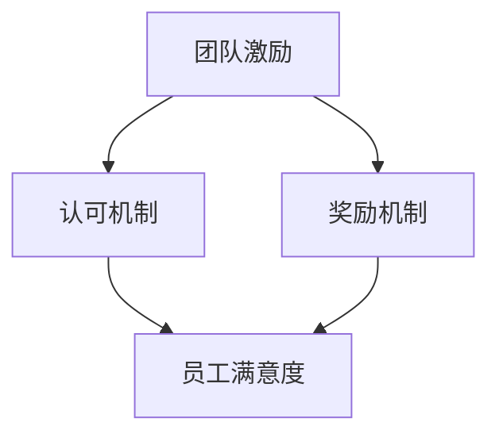
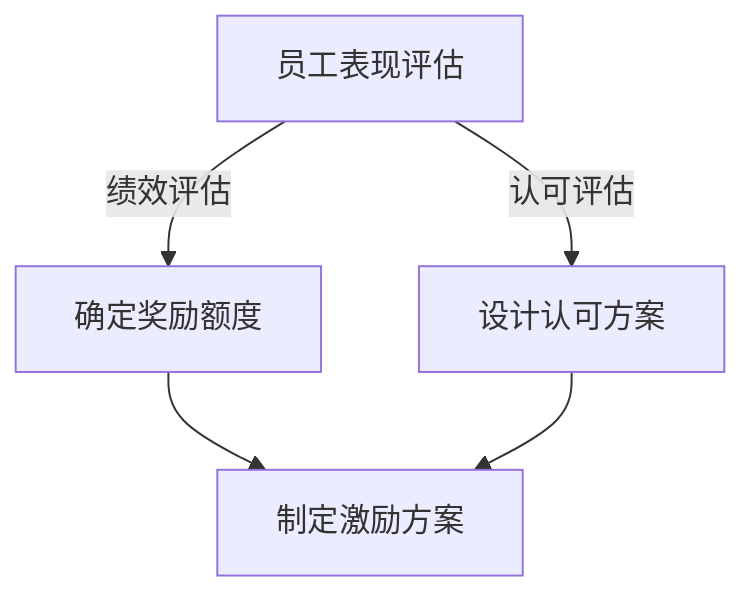

                 


## 引言

### 为什么要写这本书

在当今快速变化和竞争激烈的技术环境中，团队激励的重要性日益凸显。有效的团队激励不仅可以提升员工的工作满意度，还能显著提高团队的整体绩效和创新能力。然而，在实践中，如何平衡认可与奖励机制，以激发团队成员的最大潜能，仍然是一个具有挑战性的课题。

本书旨在深入探讨团队激励的本质，特别是认可与奖励的平衡艺术。通过系统地分析认可机制、奖励机制以及二者之间的相互作用，本书希望能够为读者提供一套实用的框架和策略，帮助他们在实际工作中设计和实施有效的激励措施。

### 目标读者

本书的目标读者包括但不限于：

- 企业管理层：他们需要了解如何通过激励机制提升团队效率。
- 人力资源专业人士：他们需要掌握设计和执行激励计划的技巧。
- 项目经理：他们需要了解如何在团队项目中运用激励机制。
- 团队领导者：他们需要理解激励原理，以便更好地领导团队。
- 技术专家：他们希望了解如何通过激励措施促进技术进步和创新。

本书结构紧凑，内容详实，旨在为不同背景的读者提供有价值的见解和实用的指导。

## 第1章：团队激励概述

### 团队激励的概念

团队激励是指通过一系列措施和手段，激发团队成员的积极性和创造力，从而提高团队整体绩效的过程。团队激励不仅包括物质奖励，如薪酬和奖金，还涵盖了精神层面的认可和荣誉。

### 激励的重要性

1. **提高工作效率**：有效的激励措施能够显著提升员工的工作效率，从而推动团队目标的实现。
2. **促进团队合作**：激励可以增强团队成员之间的合作精神，提高团队凝聚力和协作效率。
3. **激发创新能力**：激励能够激发员工的创新意识，推动技术进步和业务发展。
4. **留住人才**：良好的激励机制有助于留住优秀人才，降低员工流失率。

### 认可与奖励的关系

认可和奖励是团队激励的重要组成部分，二者相互关联且互为补充：

- **认可**：通过公开表扬、表彰等形式，给予团队成员肯定和荣誉，增强其自信心和归属感。
- **奖励**：通过提供物质或非物质的回报，如薪酬调整、奖金、休假等，激励团队成员追求更高的业绩。

### Mermaid流程图：团队激励的构成要素

以下是一个简单的Mermaid流程图，展示了团队激励的构成要素：



在这个流程图中，团队激励通过认可机制和奖励机制共同作用于员工满意度，进而影响团队的整体表现。

## 第2章：认可机制

### 认可的定义

认可是指通过表彰、表扬、荣誉等形式，对团队成员的贡献和成就进行公开肯定的过程。认可是精神层面的激励，旨在增强员工的自信心、自尊心和归属感。

### 认可的作用

1. **增强员工归属感**：通过认可，员工感受到自己的工作得到了公司的重视和认可，从而增强对公司的忠诚度和归属感。
2. **激励员工积极性**：认可能够激发员工的积极性，促使他们更加努力地工作，追求更高的业绩。
3. **提升团队凝聚力**：认可可以加强团队成员之间的联系，提高团队凝聚力和协作效率。

### 认可机制的种类

1. **公开表扬**：通过在团队会议、公司内部邮件或社交媒体上公开表扬员工的优秀表现。
2. **荣誉证书**：颁发给表现突出的员工，以表彰其贡献。
3. **员工表彰大会**：定期举办表彰大会，颁发奖项和奖金，对优秀员工进行公开表彰。
4. **团队建设活动**：通过团队建设活动，增强团队成员之间的交流和互动，提升团队的凝聚力。

### 伪代码：设计认可机制的基本流程

以下是一个简化的伪代码，用于设计认可机制的基本流程：

```python
def design_recognition_program():
    select_employees_based_on_performance()
    prepare_recognition_contents()
    schedule_recognition_events()
    communicate_recognition_to_employees()
    monitor_employee_satisfaction()
```

### 案例研究：成功的企业认可实践

1. **谷歌的员工认可计划**：谷歌通过“Googley Eyes”奖项，表彰员工在工作中展现的创新和贡献。这个奖项不仅提高了员工的荣誉感，还激发了团队的活力。
2. **阿里巴巴的六脉神剑**：阿里巴巴将六项核心价值观（即“六脉神剑”）融入到员工的日常工作中，通过表彰在践行这些价值观方面表现突出的员工，强化了公司的文化认同。

## 第3章：奖励机制

### 奖励的定义

奖励是指通过提供物质或非物质的回报，对员工的优秀表现和贡献进行肯定和激励的过程。奖励包括但不限于薪酬、奖金、股票期权、休假等。

### 奖励的作用

1. **提高工作动力**：奖励能够激发员工的工作积极性，促使他们为实现团队目标而努力。
2. **激励创新**：合理的奖励机制可以鼓励员工进行创新，推动技术进步和业务发展。
3. **提升员工满意度**：通过提供具有吸引力的奖励，企业可以提高员工的工作满意度和忠诚度。

### 奖励的种类

1. **薪酬**：包括基本工资、加班费、补贴等，是员工最基本的奖励形式。
2. **奖金**：根据员工的绩效和业绩，提供的额外收入，如季度奖金、年度奖金等。
3. **股票期权**：给予员工公司股票的购买权，鼓励员工长期为公司发展贡献力量。
4. **休假**：包括带薪休假、年假、病假等，提高员工的生活质量和身心健康。
5. **培训与发展机会**：提供专业培训、进修课程等，帮助员工提升技能和职业发展。

### 奖励机制的设定原则

1. **公平性**：奖励机制应确保对所有员工公平，避免因性别、种族、年龄等因素造成的不公平待遇。
2. **透明性**：奖励标准应明确，员工应清楚了解如何通过努力获得奖励。
3. **激励性**：奖励应具有足够的吸引力，能够激发员工的积极性和创造性。
4. **可持续性**：奖励机制应能够长期激励员工，避免短期效应。

### 数学模型：奖励分配的优化方法

奖励分配的优化可以通过以下数学模型来实现：

$$
\text{Reward} = f(\text{Performance}, \text{Position}, \text{Experience})
$$

其中，Performance代表员工的绩效表现，Position代表员工职位的重要性，Experience代表员工的工作经验。通过调整函数f的参数，可以实现对奖励的优化分配。

### 案例研究：有效的奖励机制设计

1. **微软的绩效奖金制度**：微软通过科学的绩效评估体系，结合员工的工作表现和公司整体业绩，提供具有竞争力的绩效奖金。这一制度不仅激励了员工，还提升了公司的整体绩效。
2. **亚马逊的股票奖励计划**：亚马逊通过向员工提供股票期权，激励他们长期为公司的发展贡献力量。这一计划不仅提高了员工的忠诚度，还促进了公司的稳定增长。

## 第4章：认可与奖励的平衡

### 平衡的重要性

在团队激励中，认可与奖励的平衡至关重要。如果只注重奖励，而忽视认可，员工可能会感到自己的努力没有得到应有的尊重；反之，如果只注重认可，而缺乏实质性的奖励，员工的积极性和动力可能会受到打击。

### 如何找到平衡点

1. **了解员工的期望**：通过调查和反馈，了解员工对认可和奖励的期望，从而制定更加个性化的激励方案。
2. **明确目标和标准**：确保认可和奖励的标准清晰明确，员工知道如何通过努力获得奖励和认可。
3. **灵活调整**：根据团队和公司的实际情况，灵活调整认可和奖励的比例和形式，以实现最佳激励效果。

### 平衡的挑战与解决方案

#### 挑战

1. **资源有限**：公司在资源有限的情况下，如何合理分配认可和奖励资源。
2. **员工差异化**：不同员工对认可和奖励的需求存在差异，如何兼顾不同员工的需求。

#### 解决方案

1. **资源优化**：通过科学的管理和分配，确保资源得到充分利用，同时确保关键岗位和关键员工的激励。
2. **个性化激励**：根据员工的个性化需求，提供定制化的认可和奖励方案，以提高激励效果。

### Mermaid流程图：认可与奖励的平衡策略

以下是一个简单的Mermaid流程图，展示了认可与奖励的平衡策略：



在这个流程图中，员工的绩效评估结果用于确定奖励额度，同时结合认可评估结果，共同制定出符合员工需求的激励方案。

## 第5章：实际应用案例

### 案例一：技术团队的项目激励

#### 案例背景

某技术公司的一个开发团队负责一个重要项目的实施，项目周期紧、任务重。为了提高团队的积极性和项目成功率，公司决定采用项目激励措施。

#### 激励方案设计

1. **绩效评估**：根据团队成员的工作表现，设定绩效评估指标，如代码质量、任务完成度、团队协作等。
2. **奖励形式**：设定项目奖金，根据团队成员的绩效得分，分配不同的奖金金额。
3. **认可机制**：设立项目表彰大会，对表现突出的成员进行公开表彰。

#### 实施过程

1. **项目启动**：明确项目目标和绩效评估标准，与团队成员沟通激励方案。
2. **绩效监控**：定期检查团队成员的工作进度和质量，及时提供反馈。
3. **奖励发放**：项目完成后，根据绩效评估结果，发放奖金。
4. **表彰大会**：举行项目表彰大会，对优秀成员进行公开表彰。

#### 结果分析

通过项目激励措施，团队成员的工作积极性和效率显著提高，项目成功完成，并获得了客户的高度评价。

### 案例二：销售团队的业绩激励

#### 案例背景

某销售团队在新的市场环境中面临激烈的竞争，公司希望通过激励措施提高团队的销售业绩。

#### 激励方案设计

1. **绩效评估**：根据团队成员的销售额、客户满意度、市场拓展情况等指标进行评估。
2. **奖励形式**：设立销售奖金，根据销售业绩的排名进行奖励。
3. **认可机制**：通过销售排行榜、月度销售大会等形式进行公开表彰。

#### 实施过程

1. **销售目标设定**：明确团队的销售目标，并与团队成员沟通激励方案。
2. **销售数据分析**：定期分析销售数据，提供反馈和指导。
3. **奖励发放**：根据销售业绩排名，发放奖金。
4. **表彰大会**：举行销售表彰大会，对优秀成员进行公开表彰。

#### 结果分析

通过业绩激励措施，销售团队的士气显著提升，销售业绩稳步增长，市场占有率有所提高。

### 案例三：客户服务团队的认可与奖励

#### 案例背景

某公司的客户服务团队承担着客户沟通和问题解决的重要任务，公司希望通过激励措施提升客户服务质量和团队凝聚力。

#### 激励方案设计

1. **绩效评估**：根据团队成员的客户满意度、问题解决效率、客户反馈等指标进行评估。
2. **奖励形式**：设立服务质量奖金，对表现突出的成员进行奖励。
3. **认可机制**：通过客户满意度调查、服务质量表彰等形式进行公开表彰。

#### 实施过程

1. **服务质量评估**：定期进行客户满意度调查，收集客户反馈。
2. **绩效监控**：定期检查团队成员的工作表现，提供反馈和指导。
3. **奖励发放**：根据服务质量评估结果，发放奖金。
4. **表彰大会**：举行服务质量表彰大会，对优秀成员进行公开表彰。

#### 结果分析

通过认可与奖励措施，客户服务团队的工作积极性和服务质量显著提升，客户满意度得到提高，公司声誉得到进一步巩固。

### 代码示例：激励计划的实施与监控

以下是一个简化的Python代码示例，用于实施和监控激励计划：

```python
import pandas as pd

# 员工绩效数据
performance_data = pd.DataFrame({
    '员工ID': [1, 2, 3, 4, 5],
    '销售额': [1000, 1500, 2000, 1200, 900],
    '客户满意度': [0.9, 0.85, 0.95, 0.8, 0.75]
})

# 奖励系数
reward_coefficients = {'销售额': 0.5, '客户满意度': 0.5}

# 计算绩效得分
performance_data['绩效得分'] = performance_data['销售额'] * reward_coefficients['销售额'] + performance_data['客户满意度'] * reward_coefficients['客户满意度']

# 排序
sorted_performance = performance_data.sort_values(by='绩效得分', ascending=False)

# 奖励分配
reward_amounts = [1000, 800, 600, 500, 400]

# 奖励发放
sorted_performance['奖励金额'] = sorted_performance['绩效得分'].apply(lambda x: reward_amounts[int(x)])

# 打印奖励结果
print(sorted_performance[['员工ID', '奖励金额']])
```

在这个示例中，我们首先导入员工绩效数据，然后根据销售额和客户满意度的权重计算绩效得分，最后按照绩效得分排序并发放奖励。

## 第6章：案例分析

### 成功案例分析

#### 案例一：谷歌的员工激励计划

谷歌以其成功的员工激励计划而闻名，该计划结合了认可和奖励，取得了显著的效果。谷歌通过“Googley Eyes”奖项、团队建设活动和公开表彰等多种形式，对员工的创新和贡献进行认可。同时，提供具有竞争力的薪酬和股票期权，激励员工长期为公司发展贡献力量。这一系列措施不仅提高了员工的工作满意度和忠诚度，还推动了谷歌在技术领域的持续创新。

#### 案例二：阿里巴巴的六脉神剑

阿里巴巴将六项核心价值观（即“六脉神剑”）融入到员工的日常工作中，通过定期表彰在践行这些价值观方面表现突出的员工，强化了公司的文化认同。同时，阿里巴巴提供具有吸引力的薪酬和股票奖励，激励员工为实现公司目标而努力。这一系列措施帮助阿里巴巴建立了强大的企业文化，提升了团队凝聚力和创新能力。

### 失败案例分析

#### 案例一：某公司的单一奖励机制

某公司在实施激励计划时，过于依赖奖金，忽视了认可的作用。由于奖金的分配不透明，员工对奖励机制感到不满，工作积极性下降。同时，由于缺乏认可，员工之间的协作精神受到打击，团队凝聚力减弱。最终，公司的绩效和员工满意度均未达到预期。

#### 案例二：某公司的过度认可

某公司在实施认可机制时，过于频繁地进行公开表扬，导致员工感到压力过大，产生了“表演”心理。此外，由于认可过于形式化，员工并未感受到真诚的肯定，认可的效果大打折扣。最终，公司的认可机制失去了原有的激励作用，员工的工作积极性并未得到显著提升。

### 案例分析总结

成功案例表明，有效的团队激励需要平衡认可和奖励，同时确保奖励机制的公平性和透明性。失败案例则提醒我们，单一的奖励或过度的认可都可能导致激励效果的下降。通过深入分析成功和失败的案例，我们可以更好地理解团队激励的本质，为实际工作提供有益的参考。

## 第7章：未来趋势与挑战

### 未来团队激励的发展趋势

1. **数字化管理**：随着数字化技术的发展，团队激励将更加依赖于数据分析和智能管理，实现更加精准的激励方案。
2. **个性化激励**：未来团队激励将更加注重个性化，根据员工的个性、需求和职业发展路径，提供定制化的认可和奖励。
3. **持续激励**：未来的团队激励将不再局限于短期奖励，而是通过持续的培养和激励，提升员工的长期价值。

### 面临的挑战与应对策略

1. **公平性问题**：如何确保激励机制的公平性，避免因性别、种族、年龄等因素造成的不公平待遇，是一个重要挑战。应对策略包括建立透明、公正的评估体系，加强员工参与和反馈机制。
2. **员工期望管理**：如何满足员工对认可和奖励的期望，同时避免过度期望导致的激励失效，是另一个挑战。应对策略包括定期调查员工期望，灵活调整激励措施，确保激励方案与员工期望相匹配。
3. **持续改进**：如何根据团队和公司的实际情况，持续改进激励措施，以适应不断变化的环境，是未来的关键挑战。应对策略包括建立持续的反馈和改进机制，定期评估激励效果，及时调整方案。

### 持续改进的路径

1. **数据驱动**：通过数据分析和反馈，不断优化激励方案，实现数据驱动的激励管理。
2. **员工参与**：鼓励员工参与激励方案的设计和实施，提高员工的满意度和参与度。
3. **文化建设**：通过文化建设，培养员工对公司的认同感和归属感，实现内在激励。

### 总结

团队激励是提升团队绩效和员工满意度的重要手段。通过平衡认可和奖励，结合数字化管理和个性化激励，我们可以设计出更加有效的激励方案，激发团队成员的潜力，推动团队和公司的持续发展。

### 拓展阅读

1. **《激励心理学》**：研究激励行为背后的心理学原理，提供实用的激励策略。
2. **《团队协作的智慧》**：探讨团队协作中的激励与沟通技巧，提升团队绩效。
3. **《绩效管理》**：深入了解绩效评估和激励管理的方法和技巧。

作者：AI天才研究院/AI Genius Institute & 禅与计算机程序设计艺术 /Zen And The Art of Computer Programming

本文以《团队激励：认可与奖励的平衡》为标题，系统地分析了团队激励的概念、认可机制、奖励机制以及认可与奖励的平衡策略。通过实际应用案例和案例分析，读者可以了解如何设计和实施有效的团队激励方案。同时，文章还探讨了未来团队激励的发展趋势和面临的挑战，为读者提供了实用的指导和启示。希望本文能够为读者在团队激励领域提供有价值的参考。

