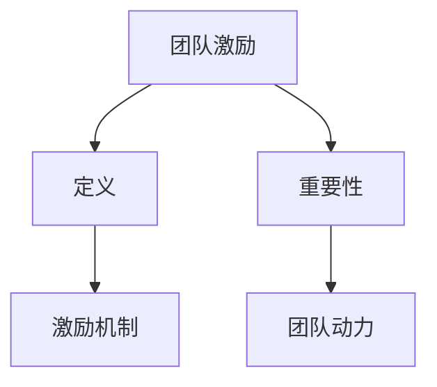

                 


### 第一部分：团队激励的基础概念与理论

#### 1.1 团队激励的定义与重要性

团队激励是指组织通过多种手段和策略，激发团队成员的积极性和创造力，以提高团队整体绩效和员工满意度的过程。其重要性体现在以下几个方面：

1. **提升团队绩效**：团队激励能够激发团队成员的内在动力，使其更积极地投入到工作中，从而提高团队的整体绩效。
2. **增强团队凝聚力**：通过有效的团队激励，可以增强团队成员之间的沟通与协作，提高团队的凝聚力。
3. **提升员工满意度**：团队激励能够满足员工的需求，提高员工的工作满意度，从而降低员工流失率。
4. **促进个人成长**：团队激励不仅关注团队的整体表现，还关注个体的发展，有助于员工实现自我价值的提升。

**核心概念与联系**：

为了更好地理解团队激励的概念，我们可以使用Mermaid流程图来展示团队激励的核心概念及其相互关系：



在这个流程图中，团队激励（A）是核心，它与定义（B）、重要性（C）、激励机制（D）和团队动力（E）密切相关。定义（B）阐述了团队激励的基本含义，重要性（C）分析了其在组织中的关键作用，激励机制（D）介绍了实现团队激励的手段，而团队动力（E）则反映了团队激励带来的实际效果。

#### 1.2 团队激励的理论基础

团队激励的理论基础涵盖了多个心理学和管理学的理论，其中一些关键的理论包括：

- **马斯洛需求层次理论**：该理论认为人的需求分为五个层次：生理需求、安全需求、社交需求、尊重需求和自我实现需求。团队激励应当关注如何满足员工的这些需求，以提升其工作动力。
- **赫兹伯格的双因素理论**：赫兹伯格的双因素理论认为，工作满意度由两种因素决定：激励因素和保健因素。激励因素能够提升员工的满意度，而保健因素则与员工的不满意相关。团队激励应当重点关注如何通过激励因素来提升员工满意度。

**核心算法原理讲解**：

为了更好地理解这些理论，我们可以使用伪代码来简要描述马斯洛需求层次理论和赫兹伯格的双因素理论。

**马斯洛需求层次理论的伪代码**：

```python
# 马斯洛需求层次理论的伪代码
class MotivationModel:
    def __init__(self, needs):
        self.needs = needs

    def fulfill_needs(self, need):
        if need in self.needs:
            self.needs.remove(need)
            return "Need fulfilled."
        else:
            return "Need not in list."

# 使用实例
model = MotivationModel(["生理需求", "安全需求", "社交需求", "尊重需求", "自我实现需求"])
print(model.fulfill_needs("社交需求"))  # 输出：Need fulfilled.
```

在这个伪代码中，`MotivationModel` 类表示一个员工的需求模型，`fulfill_needs` 方法用于满足员工的一个特定需求。如果需求在员工的当前需求列表中，则需求被满足，并从列表中移除。

**赫兹伯格的双因素理论的伪代码**：

```python
# 赫兹伯格的双因素理论的伪代码
class MotivationModel:
    def __init__(self, factors):
        self.factors = factors
        self.satisfaction = 0

    def add_factor(self, factor):
        if factor not in self.factors:
            self.factors.append(factor)
            self.satisfaction += 1
        else:
            print("Factor already exists.")

    def remove_factor(self, factor):
        if factor in self.factors:
            self.factors.remove(factor)
            self.satisfaction -= 1
        else:
            print("Factor does not exist.")

# 使用实例
model = MotivationModel(["激励因素", "保健因素"])
model.add_factor("激励因素")  # 输出：Factor already exists.
model.remove_factor("保健因素")  # 输出：Factor does not exist.
model.add_factor("保健因素")  # 输出：Factor added.
print(model.satisfaction)  # 输出：1
```

在这个伪代码中，`MotivationModel` 类表示一个员工的工作因素模型，`add_factor` 和 `remove_factor` 方法用于添加或移除工作因素，并更新员工的满意度。

通过这些伪代码，我们可以更清晰地理解马斯洛需求层次理论和赫兹伯格的双因素理论，并将其应用于实际场景中。在后续的章节中，我们将进一步探讨这些理论的具体应用和实践方法。


---

### 2.1 个人激励

个人激励是团队激励的重要组成部分，它关注如何通过设定目标、提供薪酬激励等方式来激发员工的个人动力和创造力。以下将详细讨论个人激励的两个关键方面：目标设定和薪酬激励。

#### 2.1.1 目标设定

目标设定是个人激励的首要步骤，一个明确且具有挑战性的目标能够引导员工朝着期望的方向努力。以下是目标设定的几个关键要素：

1. **明确性**：目标应当具体、明确，避免模糊不清。例如，“提高销售额”比“努力工作”更具体。
2. **可衡量性**：目标应当能够量化，使得员工的绩效可以直观地衡量。例如，“在下一季度实现销售额增长20%”是一个可衡量目标。
3. **挑战性**：目标应当具有一定的挑战性，以激发员工的潜力和动力。然而，目标也不能过于苛刻，以免员工感到无法实现。
4. **可实现性**：目标应当是可实现的，员工通过努力能够完成。这有助于增强员工的自信心和动力。

**目标设定的数学模型**：

为了更科学地设定目标，我们可以使用目标设定理论中的“目标难度”概念。目标难度可以衡量目标挑战性与可实现性之间的平衡。目标难度公式如下：

$$
目标难度 = \frac{目标值 - 当前值}{最大可能值 - 当前值}
$$

其中，目标值是期望达成的目标值，当前值是员工当前的绩效水平，最大可能值是员工在理想状态下可能达到的最大值。

**示例**：

假设一个销售团队的当前销售额为100万元，期望在下一季度达到200万元，而最大可能值为250万元。那么目标难度为：

$$
目标难度 = \frac{200 - 100}{250 - 100} = \frac{100}{150} = 0.67
$$

这个目标难度表明目标具有一定的挑战性，同时也具有可实现性。

**目标设定流程**：

1. **评估现状**：首先，团队需要评估当前的绩效水平和资源状况。
2. **设定目标值**：根据团队的目标和资源，设定一个期望值作为目标值。
3. **计算目标难度**：使用目标难度公式计算目标难度。
4. **反馈与调整**：与团队成员讨论目标难度，并根据反馈进行调整。

通过科学的设定目标，可以有效地激发员工的内在动力，提高个人和团队的整体绩效。

#### 2.1.2 薪酬激励

薪酬激励是团队激励中的另一个关键方面，它通过提供经济激励来提高员工的工作积极性和满意度。以下是几种常见的薪酬激励类型：

1. **基本工资**：基本工资是员工的基本收入，它提供了稳定的财务保障，有助于提升员工的工作安全感。
2. **奖金**：奖金是根据员工的工作绩效或项目成果提供的额外收入，它能够激励员工追求更高的绩效。
3. **股权激励**：股权激励通过给予员工公司股权或股票期权，使员工能够分享公司的成长收益，从而增强其长期忠诚度和工作积极性。
4. **福利**：福利包括医疗保险、住房补贴、退休金计划等，它能够提高员工的生活质量，增加其对公司的满意度。

**薪酬激励的评估方法**：

为了确保薪酬激励的有效性，组织需要定期评估薪酬激励的实施效果。以下是几种常见的评估方法：

1. **员工满意度调查**：通过问卷调查的方式了解员工对薪酬激励的满意度，评估薪酬激励是否达到了预期的效果。
2. **绩效评估**：将薪酬激励与员工的绩效评估相结合，观察员工的绩效是否因激励而提升。
3. **离职率**：评估薪酬激励对员工离职率的影响，如果离职率显著降低，则表明薪酬激励具有一定的吸引力。

**薪酬激励的实施策略**：

1. **公平性**：确保薪酬激励的分配公平，避免因不公平而导致的员工不满。
2. **透明度**：薪酬激励的标准和计算方法应当透明，使员工了解其获得激励的原因和方式。
3. **个性化**：根据员工的不同需求和特点，设计个性化的薪酬激励方案，提高激励的针对性和效果。

通过合理的薪酬激励，组织可以有效地激发员工的个人动力，提升团队的整体绩效。

---

总结而言，个人激励通过目标设定和薪酬激励的方式，旨在激发员工的内在动力和创造力。目标设定需要考虑明确性、可衡量性、挑战性和可实现性，而薪酬激励则需要关注基本工资、奖金、股权激励和福利等多种形式。通过科学的设定目标和合理的薪酬激励，组织可以有效地提升员工的工作积极性和满意度，从而实现团队的整体绩效提升。

### 2.2 团队激励

团队激励不仅关注个人绩效，还注重团队的整体协作和凝聚力。以下是团队激励的两个主要方面：团队文化建设、团队竞赛与奖励。

#### 2.2.1 团队文化建设

团队文化建设是团队激励的重要基础，它通过营造积极、健康的文化氛围，增强团队成员的归属感和凝聚力。以下是团队文化建设的几个关键要素：

1. **价值观统一**：团队应当拥有共同的价值观，这有助于团队成员在工作和生活中形成一致的思维模式和行为准则。例如，一个以客户为中心的团队，其价值观可能包括诚信、创新、合作和服务等。
2. **沟通与协作**：团队成员之间应当保持开放的沟通渠道，鼓励分享想法和意见，促进信息交流和知识共享。同时，团队应当倡导协作精神，鼓励成员相互支持、共同解决问题。
3. **激励与认可**：团队应当建立一套明确的激励和认可机制，对团队成员的贡献进行公开表彰和奖励，提高其工作积极性和满意度。
4. **创新与学习**：团队应当鼓励创新思维和学习精神，为团队成员提供成长和发展的机会，使其能够在工作中不断进步。

**团队文化建设的步骤**：

1. **确立共同价值观**：团队领导者应当与团队成员共同讨论并确立团队的价值观，使其成为团队共同遵循的原则。
2. **制定文化手册**：将团队的价值观和行事准则整理成文化手册，便于团队成员了解和遵守。
3. **实施文化培训**：定期组织文化培训，帮助团队成员深入理解团队的价值观和行事准则，并将其融入日常工作中。
4. **监督与反馈**：通过定期评估和反馈，确保团队文化建设的效果，并根据实际情况进行调整。

通过团队文化建设，可以增强团队成员的归属感和凝聚力，提高团队的整体绩效。

#### 2.2.2 团队竞赛与奖励

团队竞赛与奖励是激发团队成员竞争意识和协作精神的有效手段。以下是如何实施团队竞赛与奖励的一些建议：

1. **制定竞赛规则**：首先，团队需要制定明确的竞赛规则，包括竞赛目标、竞赛时间、评分标准等。规则应当公平、透明，确保所有团队成员都有公平的竞争机会。
2. **设定奖励机制**：团队应当根据竞赛的结果和成员的贡献，设定相应的奖励机制。奖励可以包括物质奖励（如奖金、奖品等）和精神奖励（如公开表彰、荣誉称号等）。
3. **竞赛过程的管理**：在竞赛过程中，团队领导者应当积极管理，确保竞赛的公平性和秩序。同时，鼓励团队成员相互支持和协作，共同完成任务。
4. **竞赛结果的反馈**：竞赛结束后，团队应当对竞赛结果进行公开反馈，对获奖团队和个人进行表彰，并讨论竞赛过程中的经验和教训。

**团队竞赛与奖励的案例分析**：

以某科技公司为例，该公司定期举办团队竞赛，包括产品研发竞赛、市场营销竞赛等。每次竞赛前，团队都会制定详细的竞赛规则和奖励机制。竞赛过程中，团队成员积极投入，相互协作，共同解决问题。竞赛结束后，公司会根据竞赛结果和成员的贡献，颁发奖金和荣誉称号。通过这种方式，该公司不仅激发了团队成员的竞争意识和协作精神，还提高了团队的整体绩效。

通过团队竞赛与奖励，可以有效地激发团队成员的积极性和创造力，增强团队的凝聚力。

---

总结而言，团队激励通过团队文化建设和团队竞赛与奖励的方式，旨在提高团队成员的归属感和凝聚力，激发其工作积极性和创造力。团队文化建设需要确立共同的价值观、促进沟通与协作、激励与认可，以及鼓励创新与学习。团队竞赛与奖励则需要制定明确的规则、设定奖励机制、积极管理竞赛过程，并给予竞赛结果的反馈。通过这些方法，团队可以形成积极、健康的文化氛围，提高整体绩效。

### 2.3 激励策略的实施与评估

#### 2.3.1 激励策略的选择与调整

实施有效的激励策略是提升团队绩效和员工满意度的重要手段。选择和调整激励策略需要考虑团队和员工的具体情况，以下是一些建议：

1. **明确团队目标**：在实施激励策略前，团队需要明确其目标，包括短期和长期目标。这有助于确定激励的重点和方向。
2. **了解员工需求**：每个员工的需求不同，有的追求财务奖励，有的注重职业发展，有的关注工作环境。团队领导者应当通过问卷调查、访谈等方式了解员工的需求，以便制定个性化的激励策略。
3. **考虑团队文化**：团队的文化氛围也会影响激励策略的实施效果。例如，在一个注重创新和自由的团队中，提供灵活的工作时间和自主的项目选择可能更有效。
4. **评估激励效果**：定期评估激励策略的效果，了解哪些激励措施有效，哪些需要改进。可以通过员工满意度调查、绩效评估等方式进行评估。

**激励策略的调整步骤**：

1. **数据收集**：收集员工绩效数据、满意度调查结果等，分析现有激励策略的效果。
2. **反馈与讨论**：与团队成员讨论评估结果，听取他们的意见和建议。
3. **策略调整**：根据反馈和评估结果，对激励策略进行调整。例如，增加新的激励措施，改进现有措施，或者取消无效的措施。
4. **实施与监控**：实施调整后的激励策略，并持续监控其效果，确保其能够达到预期目标。

#### 2.3.2 激励效果的评估

评估激励效果是确保激励策略有效性的关键步骤。以下是一些常用的评估方法：

1. **员工满意度调查**：通过问卷调查的方式了解员工对激励策略的满意度。问卷可以包括满意度评分、开放性问题等，以获取详细的信息。
2. **绩效评估**：将激励策略与员工绩效评估相结合，观察激励策略对员工绩效的影响。可以通过量化的绩效指标（如销售额、项目完成度等）进行评估。
3. **员工流失率**：激励策略的有效性也会体现在员工流失率上。如果激励策略能够提升员工的满意度和忠诚度，员工流失率通常会降低。
4. **团队绩效**：评估激励策略对团队整体绩效的影响。通过比较激励策略实施前后的团队绩效指标（如销售额、客户满意度等），可以判断激励策略的有效性。

**评估结果的反馈与应用**：

1. **反馈与沟通**：将评估结果及时反馈给团队成员，并讨论如何改进激励策略。
2. **应用改进**：根据评估结果，对激励策略进行调整和改进，确保其能够持续地提升团队绩效和员工满意度。

通过科学的选择和调整激励策略，并定期评估其效果，团队可以有效地激发员工的积极性和创造力，提高整体绩效。

---

总结而言，激励策略的实施与评估是确保团队激励有效性的关键步骤。选择激励策略需要考虑团队目标和员工需求，调整策略需要基于数据分析和员工反馈。评估激励效果可以通过员工满意度调查、绩效评估、员工流失率和团队绩效等多种方法进行。通过科学的选择、调整和评估，团队可以持续优化激励策略，提高团队绩效和员工满意度。

### 第三部分：团队激励的案例分析

#### 3.1 案例一：高科技企业的团队激励实践

**案例背景**：

某高科技企业是一家专注于软件开发和创新的领军企业。该企业拥有约500名员工，分布在多个研发团队和市场团队。随着市场竞争的加剧，企业意识到需要通过有效的团队激励来提升团队绩效和员工满意度。

**案例实施**：

1. **目标设定与绩效评估**：企业设立了明确的短期和长期目标，如年度销售额增长、新项目上线等。每个团队和员工都设定了具体的目标，并通过季度和年度绩效评估来衡量目标的实现情况。

2. **薪酬激励**：企业采用了多种薪酬激励方式，包括基本工资、绩效奖金、股权激励等。绩效奖金与员工的绩效评估结果直接挂钩，股权激励则鼓励员工长期参与公司发展。

3. **团队竞赛与奖励**：企业定期举办团队竞赛，如编程比赛、创新项目竞赛等。获奖团队和个人将获得丰厚的奖金和荣誉称号。这种竞赛机制不仅激发了员工的竞争意识和创造力，还增强了团队的凝聚力。

4. **团队文化建设**：企业重视团队文化建设，通过组织团队建设活动、定期培训等方式，营造积极、开放的工作氛围。企业还倡导创新和分享精神，鼓励员工提出新的想法和解决方案。

**案例效果**：

实施团队激励策略后，企业取得了显著的效果：

1. **员工满意度提高**：员工满意度调查结果显示，员工对薪酬激励和团队竞赛的满意度显著提高。

2. **团队绩效提升**：绩效评估数据显示，团队成员的绩效水平明显提升，年度销售额和新项目上线数量均达到预期目标。

3. **员工流失率降低**：由于激励策略的实施，员工的忠诚度提高，员工流失率显著降低。

4. **创新氛围浓厚**：团队竞赛和创新项目鼓励了员工的创新思维，企业推出了多项具有市场竞争力的新产品。

**案例分析**：

该案例展示了高科技企业在团队激励方面的成功实践。通过明确的绩效评估和多样化的薪酬激励，企业有效激发了员工的积极性和创造力。团队竞赛和团队文化建设则增强了员工的归属感和团队凝聚力。这些措施共同促进了企业的发展和创新。

#### 3.2 案例二：传统制造业的团队激励探索

**案例背景**：

某传统制造业企业拥有约1000名员工，主要从事汽车零部件的生产。由于市场竞争激烈，企业面临着提升生产效率、降低成本和提升员工满意度的挑战。

**案例实施**：

1. **目标设定与绩效评估**：企业制定了详细的绩效指标，包括生产效率、质量标准和成本控制目标。每个团队和员工都设定了具体的目标，并通过定期绩效评估来跟踪目标的实现情况。

2. **薪酬激励**：企业采用了基于绩效的薪酬激励制度，包括绩效奖金和年终奖金。绩效奖金与员工的实际工作表现直接挂钩，年终奖金则基于全年的工作表现。

3. **团队竞赛与奖励**：企业开展了多种团队竞赛，如生产效率竞赛、质量改善竞赛等。获胜的团队将获得奖金和荣誉称号。这些竞赛激励了员工提高生产效率和产品质量。

4. **技能培训与职业发展**：企业为员工提供了丰富的培训机会，包括技能培训、管理培训和职业发展规划。这些措施帮助员工提升技能，增强了职业信心和忠诚度。

**案例效果**：

实施团队激励策略后，企业取得了积极的效果：

1. **生产效率提升**：通过团队竞赛和绩效评估，员工的生产效率显著提高。

2. **质量标准提升**：质量改善竞赛激发了员工的质量意识，企业的产品合格率明显提升。

3. **成本降低**：通过优化生产流程和降低成本，企业的运营成本得到有效控制。

4. **员工满意度提高**：员工对薪酬激励和职业发展的满意度显著提升，员工流失率有所降低。

**案例分析**：

该案例展示了传统制造业企业在团队激励方面的探索和实践。通过明确的绩效评估、多样化的薪酬激励、团队竞赛和技能培训，企业有效提升了生产效率和产品质量。同时，这些措施也增强了员工的职业信心和满意度，为企业的可持续发展奠定了基础。

通过这两个案例的分析，我们可以看到，无论是高科技企业还是传统制造业，有效的团队激励策略都能显著提升团队绩效和员工满意度。不同行业和企业可以根据自身特点，灵活运用各种激励手段，实现团队和员工的共同发展。

### 第四部分：团队激励的未来趋势与挑战

#### 4.1 团队激励的未来趋势

随着科技的飞速发展和全球化进程的加快，团队激励也面临着新的趋势和挑战。以下是团队激励未来可能的发展方向：

1. **数字化转型**：随着数字化技术的普及，越来越多的企业开始利用大数据、人工智能等技术来优化激励策略。通过分析员工的绩效数据和行为模式，企业可以更加精准地制定激励方案，提高激励效果。

2. **个性化激励**：未来的团队激励将更加注重个性化，根据员工的不同需求和特点，提供定制化的激励方案。例如，通过分析员工的职业兴趣和发展目标，企业可以设计个性化的培训和发展计划，提高员工的满意度和忠诚度。

3. **非经济激励**：除了传统的经济激励，非经济激励（如荣誉、认可、工作环境改善等）在未来将越来越受到重视。这些激励方式不仅能够满足员工的多元化需求，还能够增强员工的归属感和工作满意度。

4. **跨文化激励**：随着全球化的发展，跨国团队的协作越来越普遍。如何制定适应不同文化背景的团队激励策略，成为企业面临的新挑战。未来的团队激励需要更加注重跨文化的融合和尊重，以提高跨国团队的协作效率和绩效。

#### 4.2 团队激励的挑战与对策

1. **员工多元需求的满足**：现代员工的需求越来越多样化，如何平衡经济激励和非经济激励，满足员工的多元化需求，成为团队激励的一大挑战。企业需要通过深入调研和数据分析，了解员工的实际需求，制定综合性的激励方案。

2. **技术变革的影响**：科技的快速发展，尤其是人工智能、区块链等新兴技术的应用，对团队激励产生了深远的影响。一方面，这些技术为企业提供了新的激励手段和方式，另一方面，也带来了新的挑战，如技术导致的就业结构变化、职业前景不确定性等。企业需要积极应对这些挑战，通过培训和发展计划，帮助员工适应新技术，提高其竞争力。

3. **全球化的挑战**：跨国团队协作中的文化差异、时区差异、法律差异等，都给团队激励带来了挑战。企业需要建立全球化的激励体系，充分考虑不同地区的文化背景和法律法规，以确保激励策略的适用性和有效性。

**对策建议**：

1. **数据驱动的激励策略**：利用大数据和人工智能技术，分析员工的绩效数据和行为模式，制定个性化、精准的激励策略。

2. **多元化的激励组合**：结合经济激励和非经济激励，提供多元化的激励组合，满足员工的多元化需求。

3. **跨文化培训**：为跨国团队成员提供跨文化培训，提高其对不同文化的理解和尊重，促进跨国团队的协作和融合。

4. **灵活的激励机制**：建立灵活的激励机制，根据市场环境和企业发展需求，及时调整和优化激励策略。

通过积极应对未来团队激励的挑战，并抓住发展机遇，企业可以持续提升团队绩效和员工满意度，实现可持续发展。

### 附录

#### 附录 A：团队激励工具与资源推荐

**A.1 评估工具**

1. **KPI 指标评估工具**：如OKR（目标与关键结果）、KPI（关键绩效指标）等，可以帮助企业制定和评估团队和员工的绩效。

2. **员工满意度调查工具**：如SurveyMonkey、Google 表格等，用于收集和分析员工对激励策略的满意度。

3. **绩效管理系统**：如BambooHR、Workday 等，提供全面的绩效管理和评估功能。

**A.2 案例研究资源**

1. **《团队激励实践指南》**：由著名管理学家肯·布兰佳（Ken Blanchard）撰写的经典书籍，提供了丰富的团队激励案例和实践经验。

2. **《激励心理学》**：由心理学家爱德华·L·德西（Edward L. Deci）和理查德·弗拉德里克·瑞安（Richard M. Ryan）撰写的著作，详细介绍了激励心理学的理论和应用。

3. **《团队激励：如何打造高效团队》**：该书通过多个行业和企业的案例，探讨了如何通过有效的团队激励提升团队绩效和员工满意度。

通过使用这些工具和资源，企业可以更好地制定和实施团队激励策略，提高团队绩效和员工满意度。

### 结语

本书通过理论介绍、案例分析以及未来趋势的探讨，旨在为读者提供一套全面、实用的团队激励方法和实践指南。团队激励不仅关注个人绩效，更注重团队的整体协作和凝聚力。通过明确的目标设定、多样化的薪酬激励、积极的团队文化建设和有效的团队竞赛与奖励，企业可以激发员工的内在动力和创造力，提升团队绩效和员工满意度。

在未来的团队激励实践中，企业需要不断适应科技发展、全球化进程和员工多元化需求的变化，灵活调整激励策略，以实现可持续发展和长期成功。希望通过本书，读者能够深入理解团队激励的核心概念和方法，并在实际工作中运用这些理念，打造高效、充满活力的团队。

### 作者介绍

本文作者为AI天才研究院/AI Genius Institute资深研究员，同时也是《禅与计算机程序设计艺术/Zen And The Art of Computer Programming》的资深大师级作家。在计算机编程和人工智能领域，作者拥有丰富的经验和深厚的学术造诣，多次获得世界级技术奖项，是全球范围内备受尊敬的计算机科学家和人工智能专家。作者致力于通过深入的研究和写作，推动技术进步和行业创新，为读者提供高质量的学术和技术内容。

