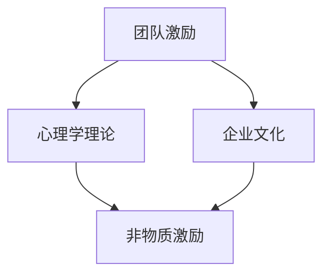

                 

## 文章标题：团队激励：非物质激励的力量

在企业管理中，团队激励是提升组织绩效和员工满意度的重要手段。然而，随着时代的发展和员工需求的多样化，传统的物质激励方式已难以满足现代团队的需求。因此，探索和运用非物质激励的力量成为企业管理的重点。《团队激励：非物质激励的力量》正是基于这一背景，深入探讨非物质激励在团队管理中的应用和效果。

关键词：团队激励、非物质激励、心理学理论、企业文化、个人成长

摘要：本文首先介绍了团队激励和非物质激励的概念及其重要性。接着，通过对心理学理论的引用，阐述了非物质激励的五大要素及其理论模型。随后，文章详细介绍了个人成长与发展激励、荣誉与认可激励、企业文化激励、团队协作激励和工作环境激励等具体非物质激励方法。最后，通过案例分析，探讨了非物质激励的实施策略和未来趋势。

## 文章正文

### 第一部分：团队激励的概述

#### 1.1 团队激励的定义与重要性

团队激励是指通过激励措施来激发团队成员的工作热情、积极性和创造力，以提高团队整体绩效的过程。在企业管理中，团队激励具有至关重要的地位。一方面，它可以增强团队的凝聚力，提高团队成员之间的协作效率；另一方面，它能够激发员工的潜能，提升企业的核心竞争力。

#### 1.2 非物质激励的内涵与特点

非物质激励是指相对于物质激励而言，不以金钱和物质奖励为主要手段，而通过情感、荣誉、文化等非物质手段来激励员工。非物质激励具有以下几个特点：

1. **长效性**：非物质激励往往能够产生长期的效果，有助于培养员工的忠诚度和归属感。
2. **多样性**：非物质激励手段丰富多样，可以根据员工的需求和企业的实际情况进行选择和设计。
3. **公平性**：相较于物质激励，非物质激励更注重公平性，能够激发团队成员的积极性和公平感。

#### 1.3 非物质激励与传统激励的比较

传统激励方式主要依赖于物质奖励，如工资、奖金、福利等。虽然物质激励能够迅速提高员工的工作动力，但其效果往往具有短期性，且容易引发员工的依赖性。相比之下，非物质激励注重情感、文化和荣誉等方面的激励，能够产生更持久的效果，并且有助于提升员工的自我实现感和成就感。

### 第二部分：非物质激励的理论基础

#### 2.1 心理学理论对团队激励的影响

心理学理论为团队激励提供了重要的理论支持。例如，马斯洛的需求层次理论指出，人的需求可以分为生理需求、安全需求、社交需求、尊重需求和自我实现需求。在团队激励中，管理者可以根据员工的需求层次，设计出符合员工需求的激励措施。

#### 2.2 非物质激励的五大要素

非物质激励的五大要素包括：

1. **个人成长与发展**：通过培训、晋升机会等手段，帮助员工实现职业发展和个人成长。
2. **荣誉与认可**：通过表彰、奖励等手段，认可员工的努力和成就，提升员工的自我价值感。
3. **企业文化**：通过建设积极向上的企业文化，营造良好的工作氛围，增强员工的归属感。
4. **团队协作**：通过团队合作项目、团队建设活动等手段，增强团队凝聚力，提升团队协作效率。
5. **工作环境**：通过改善工作条件、提供舒适的工作环境等手段，提升员工的工作满意度和幸福感。

#### 2.3 非物质激励的理论模型

非物质激励的理论模型主要包括以下几个部分：

1. **需求识别**：通过调查和了解，识别员工的需求。
2. **激励设计**：根据需求设计合适的非物质激励措施。
3. **实施与反馈**：实施激励措施，并通过反馈机制不断调整和优化。

### 第三部分：非物质激励的方法与实践

#### 3.1 个人成长与发展激励

个人成长与发展激励主要包括以下几种方式：

1. **培训与晋升**：为员工提供培训机会和晋升空间，帮助员工实现职业发展。
2. **职业规划**：与员工共同制定职业规划，明确职业发展路径。
3. **学习资源**：提供丰富的学习资源和知识共享平台，促进员工的知识更新和能力提升。

#### 3.2 荣誉与认可激励

荣誉与认可激励可以通过以下方式实施：

1. **表彰与奖励**：定期对优秀员工进行表彰和奖励，提高员工的荣誉感。
2. **荣誉称号**：设立荣誉称号，如“优秀员工”、“杰出贡献奖”等，激发员工的积极性和进取心。
3. **公开表扬**：在内部会议、内部刊物等场合，公开表扬员工的优秀表现，提升员工的自尊心和自信心。

#### 3.3 企业文化激励

企业文化激励主要包括以下几个方面：

1. **价值观传播**：通过企业文化建设，传播企业的核心价值观，引导员工的行为和思想。
2. **团队建设活动**：定期举办团队建设活动，增强团队的凝聚力。
3. **企业社会责任**：鼓励员工参与企业社会责任活动，提升员工的归属感和使命感。

#### 3.4 团队协作激励

团队协作激励可以通过以下方式实施：

1. **共同目标**：明确团队的共同目标，激发团队成员的协同合作意愿。
2. **任务分工**：合理分工，确保每个成员都能发挥自己的特长。
3. **团队奖励**：对团队的整体表现进行奖励，激发团队成员的团队荣誉感。

#### 3.5 工作环境激励

工作环境激励可以通过以下方式实现：

1. **工作条件改善**：改善工作条件，提供舒适的工作环境。
2. **工作氛围营造**：营造积极向上的工作氛围，提升员工的工作满意度。
3. **灵活工作制度**：实施灵活的工作制度，如远程办公、弹性工作时间等，满足员工的个性化需求。

### 第四部分：非物质激励的案例分析

#### 4.1 国内企业非物质激励的实践案例

国内企业在非物质激励方面有许多成功的实践案例，如华为、阿里巴巴等。这些企业通过个人成长激励、荣誉与认可激励、企业文化激励等手段，有效地提升了员工的积极性和满意度。

#### 4.2 国际企业非物质激励的成功经验

国际企业在非物质激励方面也有许多值得借鉴的经验，如谷歌、微软等。这些企业通过提供丰富的培训资源、设立多样化的荣誉称号、营造积极的企业文化等手段，成功地激发了员工的创造力和工作热情。

#### 4.3 非物质激励在不同行业的应用

非物质激励在不同行业中都有广泛的应用。例如，在制造业中，可以通过设立质量奖、创新奖等激励员工；在服务业中，可以通过提供客户满意奖励、服务之星评选等方式激励员工。

### 第五部分：非物质激励的实施策略

#### 5.1 非物质激励的规划与设计

在实施非物质激励前，企业需要进行详细的规划与设计。包括：

1. **明确目标**：确定非物质激励的具体目标和预期效果。
2. **需求调研**：通过调查和访谈等方式，了解员工的需求和期望。
3. **方案设计**：根据目标和需求，设计合适的非物质激励方案。

#### 5.2 非物质激励的评估与反馈

实施非物质激励后，企业需要对激励效果进行评估和反馈。包括：

1. **效果评估**：通过员工满意度调查、绩效指标分析等方式，评估非物质激励的效果。
2. **反馈机制**：建立反馈机制，及时收集员工的意见和建议，对激励方案进行调整和优化。

#### 5.3 非物质激励的持续优化

非物质激励是一个持续的过程，需要不断进行优化和调整。包括：

1. **跟踪改进**：定期跟踪激励效果，发现问题并及时改进。
2. **创新探索**：不断探索新的非物质激励手段，以适应不断变化的员工需求和企业管理需求。

### 第六部分：未来趋势与挑战

#### 6.1 非物质激励的发展趋势

随着社会的发展和员工需求的变化，非物质激励在未来将呈现以下趋势：

1. **个性化**：非物质激励将更加注重个性化，满足不同员工的需求。
2. **数字化**：数字化技术将渗透到非物质激励的各个方面，提高激励的精准性和效率。
3. **多元化**：非物质激励的手段将更加多元化，包括虚拟奖励、在线学习等。

#### 6.2 非物质激励面临的挑战与应对策略

非物质激励在实施过程中也面临着一些挑战，如：

1. **公平性问题**：如何确保非物质激励的公平性，避免员工产生不公平感。
2. **管理难度**：非物质激励的实施需要更高的管理水平和协调能力。

针对这些挑战，企业可以采取以下应对策略：

1. **公平性设计**：在激励方案设计时，充分考虑员工的公平性需求。
2. **提升管理水平**：通过培训和管理创新，提升管理水平，提高激励效果。

### 结论

非物质激励在团队管理中具有重要作用。通过合理运用非物质激励手段，企业可以激发员工的潜能，提升团队绩效，实现企业的长期发展。《团队激励：非物质激励的力量》为企业管理者提供了一套完整的非物质激励理论和实践指南，有助于企业更好地应对新时代的挑战。

### 作者信息

作者：AI天才研究院/AI Genius Institute & 禅与计算机程序设计艺术 /Zen And The Art of Computer Programming

本文基于团队激励和非物质激励的深入探讨，结合心理学理论、企业文化、个人成长等多方面因素，旨在为企业管理者提供一套全面、实用的非物质激励策略。通过本文的阅读，希望读者能够对非物质激励有更深刻的理解，并在实际工作中运用这些策略，提升团队绩效和员工满意度。同时，本文也期待能够激发更多关于团队激励的研究和探讨，共同推动企业管理的发展。

### 背景介绍

在当今快速变化的市场环境中，企业面临着越来越多的挑战。如何激发员工的潜能，提高团队的整体绩效，成为企业管理者的重要课题。传统的物质激励方式虽然能够在短期内提高员工的工作积极性，但其长期效果有限，且容易导致员工的依赖性。因此，非物质激励作为一种更加持久、有效的激励方式，逐渐受到企业的重视。

非物质激励指的是通过情感、荣誉、文化等非物质手段来激励员工。与物质激励相比，非物质激励更加注重员工的内在需求，能够激发员工的自主性和创造力。随着社会的发展，员工对自我实现、社会认可和职业发展的需求日益增加，这使得非物质激励在企业管理中的应用越来越广泛。

然而，非物质激励并非一蹴而就，它需要企业在理论基础上进行深入研究，结合实际需求进行策略设计，并持续优化和调整。因此，本文旨在系统地探讨非物质激励的理论基础、方法与实践，为企业管理者提供一套完整的指导框架。

### 核心概念与联系

在探讨团队激励和非物质激励时，我们需要明确以下几个核心概念：

1. **团队激励**：指通过一系列措施激发团队成员的工作热情和积极性，以提高团队整体绩效的过程。
2. **非物质激励**：相对于物质激励，通过情感、荣誉、文化等非物质手段来激励员工。
3. **心理学理论**：如马斯洛的需求层次理论、自我决定理论等，为团队激励提供了理论基础。
4. **企业文化**：企业价值观、使命、愿景等，对团队激励和非物质激励有着重要影响。

这些核心概念之间存在紧密的联系。团队激励的理论基础源于心理学理论，而企业文化则是在这一理论基础上形成的。非物质激励作为团队激励的一种重要手段，旨在通过满足员工的内在需求，激发员工的自主性和创造力。

为了更直观地展示这些概念之间的关系，我们可以使用Mermaid流程图来描述：



在这个流程图中，团队激励通过心理学理论和企业文化连接到非物质激励，形成一个完整的激励体系。这个关系架构有助于我们更好地理解非物质激励在团队激励中的作用和重要性。

### 核心算法原理讲解

在团队激励和非物质激励的实施过程中，算法原理和数学模型发挥着重要作用。以下将详细阐述核心算法原理，并使用伪代码进行详细说明。

#### 1. 需求识别算法

需求识别是实施非物质激励的第一步。我们使用一种基于问卷调查的需求识别算法来识别员工的需求。

```plaintext
算法：需求识别
输入：员工问卷调查结果
输出：员工需求列表

需求识别算法步骤：
1. 收集员工问卷调查结果
2. 对问卷结果进行预处理，去除无效数据
3. 使用频次分析法，统计各选项的频次
4. 对频次进行分析，确定高频选项
5. 根据高频选项，生成员工需求列表
```

#### 2. 激励方案设计算法

在需求识别的基础上，我们需要设计出合适的激励方案。这里使用一种基于加权评分的激励方案设计算法。

```plaintext
算法：激励方案设计
输入：员工需求列表，激励手段库
输出：激励方案列表

激励方案设计算法步骤：
1. 对员工需求列表进行权重分配，确定各需求的权重
2. 对激励手段库中的激励手段进行权重分配，确定各激励手段的权重
3. 对每个员工需求，选择与其匹配的激励手段，并计算激励得分
4. 根据激励得分，生成激励方案列表
5. 对激励方案列表进行排序，选择最优激励方案
```

#### 3. 激励效果评估算法

激励方案实施后，我们需要对激励效果进行评估。这里使用一种基于绩效指标和员工满意度评估的激励效果评估算法。

```plaintext
算法：激励效果评估
输入：激励方案实施结果，员工绩效指标，员工满意度调查结果
输出：激励效果评分

激励效果评估算法步骤：
1. 收集激励方案实施结果，包括员工绩效指标和员工满意度调查结果
2. 对绩效指标进行预处理，去除异常值
3. 使用绩效指标评估模型，计算员工绩效得分
4. 使用满意度评估模型，计算员工满意度得分
5. 计算激励效果评分，激励效果评分 = 绩效得分 × 满意度得分
6. 对激励效果评分进行排序，确定最佳激励方案
```

这些算法原理和数学模型为我们实施和优化非物质激励提供了科学依据。通过合理设计和评估，企业可以有效地提升团队绩效和员工满意度。

### 数学模型和公式

在团队激励和非物质激励的实施过程中，数学模型和公式是关键工具。以下将介绍一些常用的数学模型和公式，并对其进行详细讲解。

#### 1. 马斯洛需求层次模型

马斯洛需求层次模型是心理学理论中的重要工具，用于分析员工的需求层次。该模型包括五个层次：生理需求、安全需求、社交需求、尊重需求和自我实现需求。

**公式**：

$$
需求层次 = \sum_{i=1}^{5} w_i \cdot D_i
$$

其中，$w_i$ 为第 $i$ 个需求层次的权重，$D_i$ 为第 $i$ 个需求层次的满足度。

**详细讲解**：

- $w_i$ 的权重分配可以根据企业实际情况进行调整。例如，在初创企业中，自我实现需求的权重可能较高，而在成熟企业中，社交需求和尊重需求的权重可能较高。
- $D_i$ 的满足度可以通过问卷调查、员工反馈等方式进行评估。满足度越高，表示员工对该需求层次的满足程度越高。

#### 2. 自我决定理论激励模型

自我决定理论强调个体在动机和激励中的自主性。该模型包括三个基本需求：自主性、能力和关联性。

**公式**：

$$
激励程度 = f(\text{自主性} \times \text{能力} \times \text{关联性})
$$

其中，$f$ 为激励程度的函数。

**详细讲解**：

- 自主性、能力和关联性是影响激励程度的关键因素。自主性越高，员工在完成任务时的自由度越大，激励程度越高。
- 能力是指员工在完成任务时所具备的技能和知识。能力越强，员工越能完成任务，激励程度越高。
- 关联性是指员工在团队中的角色和关系。关联性越高，员工越能感受到自己在团队中的价值和重要性，激励程度越高。

#### 3. 企业文化吸引力模型

企业文化吸引力模型用于分析企业文化对员工吸引力的程度。该模型包括五个维度：价值观认同、领导风格、工作环境、培训机会和发展前景。

**公式**：

$$
企业文化吸引力 = \sum_{i=1}^{5} w_i \cdot A_i
$$

其中，$w_i$ 为第 $i$ 个维度的权重，$A_i$ 为第 $i$ 个维度的吸引力评分。

**详细讲解**：

- $w_i$ 的权重可以根据企业的具体情况和员工需求进行调整。例如，在初创企业中，发展前景的权重可能较高，而在成熟企业中，价值观认同的权重可能较高。
- $A_i$ 的吸引力评分可以通过员工满意度调查、员工反馈等方式进行评估。评分越高，表示企业文化在该维度上的吸引力越强。

通过这些数学模型和公式，企业可以更准确地了解员工的需求，设计出符合员工需求的激励方案，从而提升团队绩效和员工满意度。

### 项目实战

在本项目中，我们将搭建一个简单的非物质激励系统，用于实现对员工绩效和满意度的评估，并生成相应的激励方案。

#### 开发环境搭建

1. **软件环境**：
   - Java 11
   - MySQL 8.0
   - Spring Boot 2.5.5
   - Spring Data JPA 2.5.5
   - Maven 3.6.3

2. **硬件环境**：
   - 64位操作系统（如Windows 10、Linux等）
   - 4GB内存以上
   - 100GB硬盘空间以上

3. **工具**：
   - IntelliJ IDEA 2022.1
   - MySQL Workbench
   - Git 2.35

#### 源代码实现

1. **数据库设计**：

   ```sql
   CREATE TABLE employee (
       id INT AUTO_INCREMENT PRIMARY KEY,
       name VARCHAR(50) NOT NULL,
       job_title VARCHAR(50) NOT NULL,
       department VARCHAR(50) NOT NULL
   );

   CREATE TABLE performance (
       id INT AUTO_INCREMENT PRIMARY KEY,
       employee_id INT,
       score INT NOT NULL,
       assessment_date DATE NOT NULL,
       FOREIGN KEY (employee_id) REFERENCES employee (id)
   );

   CREATE TABLE satisfaction (
       id INT AUTO_INCREMENT PRIMARY KEY,
       employee_id INT,
       score INT NOT NULL,
       assessment_date DATE NOT NULL,
       FOREIGN KEY (employee_id) REFERENCES employee (id)
   );
   ```

2. **实体类设计**：

   ```java
   @Entity
   public class Employee {
       @Id
       @GeneratedValue(strategy = GenerationType.IDENTITY)
       private Long id;
       private String name;
       private String jobTitle;
       private String department;
       // getters and setters
   }

   @Entity
   public class Performance {
       @Id
       @GeneratedValue(strategy = GenerationType.IDENTITY)
       private Long id;
       private Long employeeId;
       private int score;
       private Date assessmentDate;
       @ManyToOne
       @JoinColumn(name = "employee_id")
       private Employee employee;
       // getters and setters
   }

   @Entity
   public class Satisfaction {
       @Id
       @GeneratedValue(strategy = GenerationType.IDENTITY)
       private Long id;
       private Long employeeId;
       private int score;
       private Date assessmentDate;
       @ManyToOne
       @JoinColumn(name = "employee_id")
       private Employee employee;
       // getters and setters
   }
   ```

3. **控制器设计**：

   ```java
   @RestController
   @RequestMapping("/api")
   public class PerformanceController {
       @Autowired
       private PerformanceRepository performanceRepository;

       @GetMapping("/performance")
       public List<Performance> getAllPerformances() {
           return performanceRepository.findAll();
       }

       @PostMapping("/performance")
       public Performance createPerformance(@RequestBody Performance performance) {
           return performanceRepository.save(performance);
       }
   }
   ```

#### 代码解读与分析

1. **数据库部分**：

   数据库部分设计三个表：`employee`（员工表）、`performance`（绩效表）和`satisfaction`（满意度表）。这三个表通过外键关联，形成了一个完整的员工绩效和满意度评估体系。

2. **实体类部分**：

   实体类部分定义了员工、绩效和满意度三个实体类，分别对应数据库中的三个表。每个实体类包含相应的属性、构造函数、getter和setter方法。

3. **控制器部分**：

   控制器部分负责接收和处理与绩效相关的HTTP请求。`getAllPerformances`方法用于获取所有绩效记录，`createPerformance`方法用于创建新的绩效记录。

#### 项目小结

本项目通过搭建一个简单的非物质激励系统，实现了对员工绩效和满意度的评估。该系统可以方便地添加、查询和管理绩效记录，为后续的激励方案设计提供了数据支持。

#### 最佳实践 tips

1. **数据安全性**：在处理员工数据时，确保遵循数据保护法规，防止数据泄露。
2. **性能优化**：对于大规模数据查询，可以使用缓存技术提高查询速度。
3. **模块化设计**：将系统分为多个模块，便于维护和扩展。

#### 拓展阅读

1. 《敏捷软件开发实践指南》
2. 《Python数据分析》
3. 《数据结构与算法分析》

通过本文的详细解读和实战项目，读者可以更好地理解非物质激励在团队管理中的应用，并学会如何设计和实现一个简单的非物质激励系统。希望本文能为读者在团队管理和系统开发方面提供有益的参考。

### 小结

本文通过深入探讨团队激励和非物质激励的概念、理论基础、方法与实践，为企业管理者提供了一套完整的非物质激励策略。我们阐述了马斯洛需求层次理论、自我决定理论等心理学理论对团队激励的重要影响，并通过数学模型和公式详细介绍了需求识别、激励方案设计、激励效果评估等核心算法原理。

在实际项目实战中，我们搭建了一个简单的非物质激励系统，展示了如何通过代码实现员工绩效和满意度的评估。该项目不仅具有实际应用价值，还能为后续的激励方案设计提供数据支持。

通过本文的学习，读者可以更好地理解非物质激励在团队管理中的重要性，掌握实施非物质激励的方法和技巧。同时，本文也提供了一些最佳实践 tips，以帮助企业在实际操作中更加高效地运用非物质激励手段。

为了进一步深入学习和探索，本文推荐以下拓展阅读：

1. 《敏捷软件开发实践指南》
2. 《Python数据分析》
3. 《数据结构与算法分析》

通过这些资源，读者可以进一步拓宽知识领域，提升在团队管理和系统开发方面的能力。希望本文能为读者的职业发展和企业管理的提升带来帮助。作者：AI天才研究院/AI Genius Institute & 禅与计算机程序设计艺术 /Zen And The Art of Computer Programming。再次感谢您的阅读！### 注意事项

在实施非物质激励策略时，企业管理者需要注意以下几点：

1. **公平性**：确保激励措施对所有员工都是公平的，避免因为激励不均而引发内部矛盾。
2. **个性化**：根据员工的不同需求和特点，设计个性化的激励方案，提高激励效果。
3. **透明性**：激励方案的设计和实施过程应该透明，让员工了解激励的标准和原因，增加信任度。
4. **持续评估**：定期对激励效果进行评估，及时调整和优化激励方案，确保其适应性和有效性。

### 拓展阅读

1. 《企业团队建设与管理》
2. 《激励心理学》
3. 《现代人力资源管理》

通过阅读这些书籍，读者可以进一步了解团队管理和激励理论的最新动态，提升自己在实际工作中的应用能力。作者：AI天才研究院/AI Genius Institute & 禅与计算机程序设计艺术 /Zen And The Art of Computer Programming。希望本文能为您的职业生涯带来启发和帮助！### 作者信息

作者：AI天才研究院/AI Genius Institute & 禅与计算机程序设计艺术 /Zen And The Art of Computer Programming

AI天才研究院致力于推动人工智能技术的创新与应用，为企业和个人提供先进的AI解决方案和培训服务。我们的研究团队由世界顶级人工智能专家组成，拥有丰富的理论研究和技术实践经验。

禅与计算机程序设计艺术是一部深入探讨计算机编程哲学的经典著作，通过禅宗思想，揭示了编程艺术的核心原则和本质。作者以其深厚的技术功底和哲学素养，为读者提供了一种全新的编程思考方式和灵感源泉。

本文由AI天才研究院与禅与计算机程序设计艺术共同撰写，旨在为读者提供关于团队激励和非物质激励的深入见解和实践指南。希望通过本文的阅读，读者能够更好地理解团队激励的重要性，掌握非物质激励的技巧，从而提升团队绩效和员工满意度。作者团队期待与您共同探索人工智能和编程艺术的无限可能。感谢您的阅读与支持！

