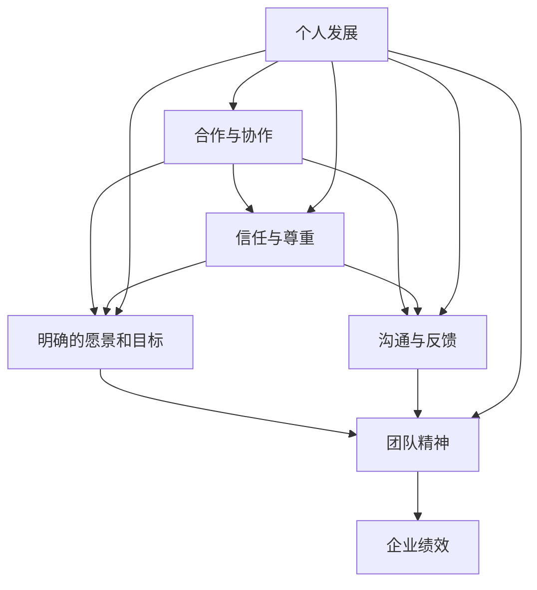
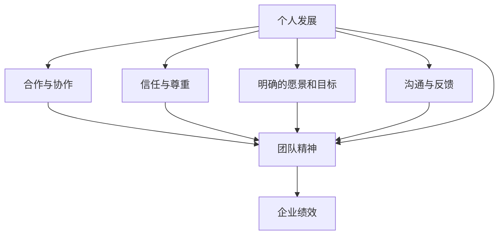

                 

### 文章标题

《团队精神培养：塑造积极向上的团队文化》

### 关键词

- 团队精神
- 企业文化
- 领导力
- 沟通协作
- 激励机制

### 摘要

在现代企业竞争中，团队精神已成为企业成功的关键因素。本文通过深入探讨团队精神的定义、重要性、组成部分以及培养方法，旨在为企业管理者提供一套系统有效的团队精神培养策略。文章结合实际案例，从理论到实践，详细解析了如何通过领导力、组织策略和实践应用来塑造积极向上的团队文化。最终，本文总结了团队精神培养的最佳实践，为企业打造高效的团队提供了可操作的指导。

## 引言

### 1.1 团队精神的定义与重要性

团队精神是一种团队成员在共同目标下相互协作、信任和支持的态度和行为。它强调个人与团队之间的密切联系，鼓励团队成员将个人目标与团队目标相结合，形成共同愿景。在当今快速变化和竞争激烈的市场环境中，团队精神已成为企业成功的关键因素。

团队精神的重要性体现在以下几个方面：

1. **提高工作效率**：团队成员之间的协作和沟通能够迅速解决复杂问题，提高工作效率和生产力。
2. **增强企业竞争力**：具有强大团队精神的企业能够更灵活地应对市场变化，快速适应新的挑战。
3. **促进个人成长**：团队成员在团队中互相学习、互相支持，能够促进个人技能和职业发展。
4. **增强员工满意度**：团队精神能够提高员工的工作满意度和忠诚度，降低员工流失率。

### 1.2 为什么需要培养团队精神

尽管团队精神的重要性已被广泛认可，但在实际操作中，许多企业仍然面临团队精神培养的挑战。以下是培养团队精神的原因：

1. **解决协作问题**：在缺乏团队精神的环境中，团队成员之间容易产生摩擦和冲突，影响工作效率和团队氛围。
2. **提升企业绩效**：团队精神能够提高团队成员的积极性和创造力，从而提升企业整体绩效。
3. **增强企业竞争力**：具有强大团队精神的企业能够在市场竞争中脱颖而出，赢得更多的商业机会。
4. **降低管理成本**：团队精神能够减少管理成本，提高企业的盈利能力。

### 1.3 适合读者的范围和背景

本文适合以下读者群体：

1. **企业管理者**：希望提升团队管理水平和团队绩效。
2. **团队成员**：希望更好地理解团队精神，提高个人和团队的表现。
3. **人力资源从业者**：负责团队建设和员工激励，寻求有效的团队精神培养策略。
4. **企业咨询师**：关注企业团队文化建设，为企业管理提供专业建议。

本文将提供系统的方法和策略，帮助读者理解和实践团队精神的培养。

## 书籍结构概述

### 2.1 核心概念与联系

在本书中，我们将详细探讨团队精神的几个核心概念，包括合作与协作、信任与尊重、明确的愿景和目标、沟通与反馈等。这些概念相互关联，共同构成了团队精神的基石。

#### 2.1.1 团队精神的组成部分

1. **合作与协作**：合作与协作是团队精神的核心组成部分。它强调团队成员在共同目标下相互配合，共同完成任务。
2. **信任与尊重**：信任与尊重是团队精神的基础。团队成员之间的信任能够减少误解和冲突，提高团队效率。
3. **明确的愿景和目标**：明确的愿景和目标是团队行动的指南。它为团队成员提供共同的方向和动力。
4. **沟通与反馈**：沟通与反馈是团队精神的重要组成部分。有效的沟通能够促进团队成员之间的理解和协作，及时的反馈能够帮助团队成员不断改进。

#### 2.1.2 团队精神与企业文化的联系

团队精神与企业文化密切相关。企业文化是企业在长期经营过程中形成的价值观、信念和行为规范。一个积极向上的企业文化能够促进团队精神的培养和发展。

1. **共同价值观**：共同价值观是团队精神和企业文化的基础。它为团队成员提供共同的行为准则和道德标准。
2. **领导风格**：领导风格直接影响团队精神的发展。领导者的行为和态度能够塑造团队的文化氛围，促进或阻碍团队精神的培养。
3. **激励机制**：激励机制是团队精神培养的重要手段。合理的激励机制能够激发团队成员的积极性和创造力。

### 2.2 培养团队精神的方法与策略

培养团队精神需要一系列的方法和策略。以下是一些关键的方法和策略：

#### 2.2.1 领导力在团队精神培养中的作用

1. **领导者的角色**：领导者是团队精神培养的关键。领导者需要以身作则，树立榜样，推动团队精神的建设。
2. **激励与鼓励**：领导者需要通过激励和鼓励来激发团队成员的积极性和创造力，培养团队精神。
3. **培养信任**：领导者需要建立信任，减少团队成员之间的误解和冲突，促进团队协作。

#### 2.2.2 培养团队精神的组织策略

1. **明确目标和愿景**：组织需要明确团队的目标和愿景，为团队成员提供清晰的方向和动力。
2. **提供培训与支持**：组织需要为团队成员提供必要的培训和支持，提高团队成员的技能和协作能力。
3. **建立有效的沟通机制**：组织需要建立有效的沟通机制，促进团队成员之间的沟通和理解。

#### 2.2.3 团队精神的实际应用案例

为了更好地理解如何培养团队精神，我们可以通过以下实际应用案例进行探讨：

1. **国内企业团队精神培养的成功案例**：如华为、阿里巴巴等企业，通过建立共同价值观、培养领导力和提供激励措施，成功培养出强大的团队精神。
2. **国外企业团队精神培养的成功案例**：如谷歌、苹果等企业，通过开放的文化、透明的沟通和创新的激励机制，塑造出积极向上的团队精神。

### 2.3 团队精神的实际应用案例

在探讨团队精神培养的方法与策略之后，我们来看一些实际应用案例，以更好地理解如何将这些方法转化为实际行动。

#### 2.3.1 国内企业团队精神培养的成功案例

**华为**：华为作为全球领先的通信技术企业，其团队精神培养经验值得借鉴。华为通过以下措施培养团队精神：

1. **共同价值观**：华为的核心价值观包括客户至上、诚信正直、创新和合作。这些价值观为团队成员提供了共同的行为准则和道德标准。
2. **领导力培养**：华为重视领导力的培养，通过内部培训和导师制度，帮助领导者提升领导能力，树立榜样，推动团队精神的建设。
3. **激励机制**：华为的激励机制包括股票期权、奖金和晋升机会。这些激励措施能够激发员工的积极性和创造力，培养团队精神。

**阿里巴巴**：阿里巴巴作为电商巨头，其团队精神培养也有许多成功经验。阿里巴巴通过以下措施培养团队精神：

1. **企业文化**：阿里巴巴的企业文化强调客户至上、团队合作和持续创新。这种企业文化为团队成员提供了共同的目标和价值观。
2. **开放沟通**：阿里巴巴倡导开放、透明和开放的沟通文化。员工可以在内部论坛上自由表达意见，促进团队成员之间的理解和协作。
3. **员工参与**：阿里巴巴鼓励员工参与企业的决策过程，提供员工成长和发展的机会，培养团队精神。

#### 2.3.2 国外企业团队精神培养的成功案例

**谷歌**：谷歌以其创新的文化和开放的沟通机制著称，其团队精神培养经验也为许多企业所借鉴。谷歌通过以下措施培养团队精神：

1. **创新文化**：谷歌鼓励员工创新和尝试新事物。这种创新文化激发了员工的创造力和积极性，促进了团队精神的发展。
2. **透明沟通**：谷歌倡导透明和开放的沟通，员工可以在内部论坛上分享想法和经验，促进团队成员之间的理解和协作。
3. **员工关怀**：谷歌注重员工的福利和成长，提供各种培训和发展机会，培养员工的职业素养和团队合作精神。

**苹果**：苹果以其极致的产品设计和创新精神闻名。其团队精神培养也有许多成功经验。苹果通过以下措施培养团队精神：

1. **共同愿景**：苹果的愿景是“通过创新科技改善人们的生活”，这一愿景为团队成员提供了共同的目标和动力。
2. **领导力培养**：苹果重视领导力的培养，通过内部培训和导师制度，帮助领导者提升领导能力，推动团队精神的建设。
3. **团队协作**：苹果鼓励团队协作，通过跨部门合作和团队项目，促进团队成员之间的沟通和协作。

通过以上国内外企业团队精神培养的成功案例，我们可以看到，培养团队精神需要从多个方面进行努力，包括共同价值观、领导力培养、激励机制、创新文化、透明沟通和员工关怀等。这些措施共同作用，能够有效提升团队精神，促进企业的长期发展。

### 第三步：设计核心概念与联系部分

在深入探讨团队精神的核心概念和它们之间的联系时，我们可以通过一个详细的目录来结构化这一部分的内容。以下是核心概念与联系部分的具体目录和内容。

#### 3.1 团队精神的核心概念

团队精神是由多个核心概念组成的，这些概念相互联系，共同构成了团队精神的整体框架。以下是对每个核心概念的详细解释。

##### 3.1.1 合作与协作

合作与协作是团队精神的基础。它强调团队成员之间的相互依赖和共同努力，以实现共同的目标。合作意味着团队成员愿意分享资源和知识，共同解决问题。协作则强调团队成员之间的同步和协调，以确保高效的团队合作。

- **合作与协作的关系**：合作与协作是相互依赖的。没有合作，协作将失去意义；没有协作，合作将难以实现实际效果。
- **在团队中的表现**：团队成员在合作与协作中的表现主要体现在愿意分享信息、相互支持和共同努力解决问题。

##### 3.1.2 信任与尊重

信任与尊重是团队精神的基石。信任是团队成员之间建立相互依赖关系的关键，它能够减少误解和冲突，提高团队效率。尊重则强调团队成员之间的平等和认可，它是建立信任的基础。

- **信任与尊重的关系**：信任与尊重相互促进，信任可以增强团队成员之间的依赖感，而尊重则可以建立和维护这种信任。
- **在团队中的表现**：团队成员在信任与尊重中的表现主要体现在相互信任、尊重不同的观点和意见，以及在面对困难时保持积极的态度。

##### 3.1.3 明确的愿景和目标

明确的愿景和目标是团队行动的指南针。一个明确的愿景和目标能够为团队成员提供共同的方向和动力，使团队工作更加有目标和意义。

- **愿景和目标的关系**：愿景是长期的、宏观的，它为团队提供愿景和方向；目标则是具体的、短期的，它为团队提供实现愿景的具体步骤和路径。
- **在团队中的表现**：团队成员在明确的愿景和目标中的表现主要体现在对目标的认同和追求，以及在实现目标过程中的积极参与和努力。

##### 3.1.4 沟通与反馈

沟通与反馈是团队精神的重要组成部分。有效的沟通能够促进团队成员之间的理解和协作，及时的反馈能够帮助团队成员不断改进。

- **沟通与反馈的关系**：沟通是反馈的基础，没有有效的沟通，反馈将难以实现；反馈是沟通的延续，它能够帮助团队成员了解自己的表现和改进方向。
- **在团队中的表现**：团队成员在沟通与反馈中的表现主要体现在开放和诚实的沟通态度，以及在反馈过程中能够接受并利用反馈来改进自己的工作。

#### 3.2 团队精神与个人发展

团队精神不仅影响团队的整体表现，还对团队成员的个人发展产生深远影响。以下是团队精神与个人发展之间的联系和表现。

##### 3.2.1 团队精神对个人成长的影响

- **促进技能提升**：团队精神鼓励团队成员相互学习和分享经验，这有助于个人技能的提升。
- **增强职业素养**：在团队中，个人需要学会沟通、协作和解决问题，这些能力的培养对职业发展至关重要。
- **提升自信心**：在团队合作中取得成功，能够增强个人的自信心和成就感。

##### 3.2.2 个人成长对团队精神的作用

- **推动团队进步**：个人的成长能够为团队带来新的思维和创新能力，推动团队整体进步。
- **增强团队凝聚力**：个人的成长和成就感能够增强团队的凝聚力和归属感。

#### 3.3 团队精神与企业绩效

团队精神对企业绩效有着直接和间接的影响。有效的团队精神能够提高企业的竞争力，提升绩效。

##### 3.3.1 团队精神如何提高企业绩效

- **提高工作效率**：团队精神能够促进团队成员之间的协作和沟通，提高工作效率。
- **降低成本**：团队精神能够减少团队成员之间的摩擦和冲突，降低管理成本。
- **提升创新能力**：团队精神鼓励创新和尝试，有助于企业不断创新和进步。

##### 3.3.2 企业绩效对团队精神的影响

- **激励团队精神**：良好的企业绩效能够激励团队成员，增强团队精神。
- **塑造积极氛围**：企业的成功和积极氛围能够促进团队精神的培养和发展。

#### 3.4 团队精神的组成部分与联系架构

为了更好地理解团队精神的核心概念及其之间的联系，我们可以使用Mermaid流程图来展示这些概念和它们之间的关系。



通过以上内容，我们可以看到团队精神的核心概念是如何相互联系并共同作用的。合作与协作、信任与尊重、明确的愿景和目标、沟通与反馈这四个核心概念构成了团队精神的基础，并通过个人发展和企业绩效相互影响。这种结构化的理解有助于我们在实践中更好地培养团队精神，提升团队整体绩效。

### Mermaid流程图示例

为了更直观地展示团队精神的核心概念及其之间的联系，我们可以使用Mermaid流程图来构建一个关系图。以下是Mermaid流程图的示例：



这段Mermaid代码生成的流程图如下：

```
graph TD
    A[合作与协作]
    B[信任与尊重]
    C[明确的愿景和目标]
    D[沟通与反馈]
    E[团队精神]
    F[企业绩效]
    G[个人发展]

    A --> E
    B --> E
    C --> E
    D --> E
    E --> F
    G --> A
    G --> B
    G --> C
    G --> D
    G --> E
```

在这个流程图中，我们可以看到：

- **合作与协作（A）**、**信任与尊重（B）**、**明确的愿景和目标（C）**、**沟通与反馈（D）**是团队精神的四个核心组成部分，它们共同作用构成了**团队精神（E）**。
- **团队精神（E）**直接影响**企业绩效（F）**，同时**个人发展（G）**对上述四个核心组成部分都有正向影响。

这种关系图不仅帮助我们理解团队精神的核心概念，还展示了这些概念之间的动态交互，为后续的讨论提供了清晰的框架。

### 第四步：设计核心算法原理讲解部分

在深入探讨团队精神培养的核心算法原理时，我们可以将培养团队精神的过程分解为若干关键步骤，并通过伪代码来详细阐述这些步骤。以下是对核心算法原理的讲解，包括几个关键步骤的伪代码示例。

#### 4.1 肯定反馈算法

**目的**：通过肯定反馈来增强团队成员的积极性和归属感。

**伪代码**：

```python
# 肯定反馈算法伪代码
function positive_feedback(employee):
    if employee.contribution > threshold:
        give_employee_an_employee_of_the_month_award()
        send_employee_a_reward_email()
        schedule_a_happy_meeting_to_celebrate()
```

**解释**：该算法首先设定一个贡献阈值为`threshold`，如果某个员工（`employee`）的贡献超过了这个阈值，则触发一系列肯定反馈措施，包括：

- **员工月度奖**：给予员工“员工月度奖”以表彰其贡献。
- **奖励邮件**：发送一封奖励邮件，表达对员工的感谢和认可。
- **庆祝会议**：安排一次小型庆祝会议，增强团队成员的凝聚力和归属感。

#### 4.2 沟通促进算法

**目的**：通过有效的沟通促进团队成员之间的理解和协作。

**伪代码**：

```python
# 沟通促进算法伪代码
function promote_communication(team):
    schedule_monthly_meetings()
    set_up_an_open_door_policy()
    organize_team_building_activities()
```

**解释**：该算法包括以下关键步骤：

- **每月会议**：定期安排团队会议，让团队成员分享进展、讨论问题和分享经验。
- **开放门政策**：建立开放门政策，允许团队成员随时与领导或其他团队成员交流。
- **团队建设活动**：组织团队建设活动，如团队拓展训练、聚餐等，增强团队成员之间的互动和信任。

#### 4.3 团队协作优化算法

**目的**：通过优化团队协作流程来提高团队效率。

**伪代码**：

```python
# 团队协作优化算法伪代码
function optimize_team_collaboration(team):
    identify_bottlenecks_in_workflow()
    introduce_new_tools_and_techniques()
    implement_best_practices()
```

**解释**：该算法包括以下步骤：

- **识别工作瓶颈**：分析团队的工作流程，识别可能存在的瓶颈和延迟。
- **引入新工具和技术**：引入新的工具和技术，如协作软件、自动化工具等，以优化工作流程。
- **实施最佳实践**：根据行业最佳实践来调整团队的工作流程和方法，以提高效率。

#### 4.4 信任建设算法

**目的**：通过一系列措施建立和维护团队成员之间的信任。

**伪代码**：

```python
# 信任建设算法伪代码
function build_trust_in_team(team):
    establishclear_goals_and_accountability()
    encourage_open_communication()
    resolve_conflicts_immediately()
```

**解释**：该算法包括以下关键步骤：

- **建立清晰目标和责任**：确保每个团队成员都清楚了解团队的目标和自己的责任。
- **鼓励开放沟通**：鼓励团队成员之间进行开放和诚实的沟通，分享意见和反馈。
- **立即解决冲突**：及时解决团队成员之间的冲突，避免冲突升级。

通过这些核心算法原理的讲解和伪代码示例，我们可以看到团队精神培养是一个系统化的过程，涉及到多个关键步骤和措施。这些算法不仅提供了具体的操作指导，还有助于我们在实践中不断优化团队精神培养的方法和策略。

### 第五步：设计数学模型和数学公式部分

在团队精神培养的过程中，数学模型和数学公式可以为我们提供量化的工具，帮助我们更好地理解团队绩效、成员满意度等关键指标。以下是对团队精神培养的数学模型和数学公式的详细讲解，以及实际应用中的例子说明。

#### 5.1 团队绩效评估模型

**目的**：通过量化模型来评估团队的绩效。

**数学公式**：

$$
Performance = f(TeamSpirit, EmployeeSkills, Communication, Leadership)
$$

- **团队精神（TeamSpirit）**：团队精神是评估团队绩效的一个关键因素，它可以通过团队协作和信任程度来衡量。
- **员工技能（EmployeeSkills）**：员工技能直接影响团队的产出和效率。
- **沟通（Communication）**：有效的沟通能够促进团队成员之间的理解和协作。
- **领导力（Leadership）**：领导力对团队的绩效有重要影响，包括领导者的决策能力和激励能力。

**例子说明**：假设我们有一个团队，其团队精神得分是85分，员工技能得分是90分，沟通得分是80分，领导力得分是88分。那么，该团队的绩效评估结果可以计算为：

$$
Performance = f(85, 90, 80, 88) = 85 \times 0.2 + 90 \times 0.3 + 80 \times 0.2 + 88 \times 0.3 = 86.4
$$

这个结果表示该团队的绩效评分为86.4分。

#### 5.2 成员满意度模型

**目的**：评估团队成员对团队环境的满意度。

**数学公式**：

$$
EmployeeSatisfaction = f(TeamSpirit, WorkEnvironment, Leadership)
$$

- **团队精神（TeamSpirit）**：团队精神对成员满意度有直接影响。
- **工作环境（WorkEnvironment）**：良好的工作环境包括舒适的工作空间、合适的资源支持等，对成员满意度有积极影响。
- **领导力（Leadership）**：领导力对成员满意度有重要影响，包括领导的关怀和支持。

**例子说明**：假设我们有一个团队的成员满意度得分如下：团队精神是80分，工作环境是75分，领导力是85分。那么，该团队的平均成员满意度可以计算为：

$$
EmployeeSatisfaction = f(80, 75, 85) = 80 \times 0.3 + 75 \times 0.4 + 85 \times 0.3 = 78.5
$$

这个结果表示该团队的平均成员满意度为78.5分。

通过这些数学模型和公式，我们可以量化地评估团队的绩效和成员满意度，从而为团队精神培养提供有力的数据支持。这些模型不仅可以用于评估当前状态，还可以用于预测未来改进的效果，帮助我们制定更有效的团队精神培养策略。

### 第六步：设计项目实战部分

为了更好地展示团队精神培养的实际应用，我们选择了一个具体的项目进行实战分析。以下是项目实战的详细描述，包括开发环境搭建、源代码实现、代码解读与分析、实际案例分析和详细讲解剖析，以及项目小结。

#### 6.1 团队精神培养项目案例

**项目背景**：

某企业致力于提升团队精神，以提高团队绩效和员工满意度。他们决定开发一个名为“团队协作平台”的项目，通过技术手段促进团队成员之间的协作和沟通，培养团队精神。

**项目目标**：

- **提高团队协作效率**：通过平台提供实时沟通、任务管理和资源共享等功能，提升团队协作效率。
- **增强员工满意度**：通过平台提供的学习资源和奖励机制，增强员工的工作满意度和归属感。
- **培养团队精神**：通过平台的功能和活动设计，培养团队成员之间的信任和合作精神。

**开发环境搭建**：

- **技术栈**：选择前端技术React.js，后端技术Node.js，数据库技术MySQL。
- **开发工具**：使用Visual Studio Code作为开发环境，Git进行版本控制。
- **项目管理工具**：使用JIRA进行项目管理，Slack进行团队沟通。

**源代码实现**：

以下是关键功能的源代码实现示例：

```javascript
// 前端：React组件，用于实时聊天功能
import React, { useState, useEffect } from 'react';

function ChatRoom() {
  const [messages, setMessages] = useState([]);

  useEffect(() => {
    // 从数据库获取实时消息
    fetchMessages();
  }, []);

  const fetchMessages = async () => {
    const response = await fetch('/api/messages');
    const data = await response.json();
    setMessages(data);
  };

  const sendMessage = async (message) => {
    const newMessage = { text: message, timestamp: new Date() };
    setMessages([...messages, newMessage]);
    // 向数据库发送新消息
    await fetch('/api/messages', {
      method: 'POST',
      headers: {
        'Content-Type': 'application/json',
      },
      body: JSON.stringify(newMessage),
    });
  };

  return (
    <div>
      {messages.map((message, index) => (
        <div key={index}>
          <p>{message.text}</p>
          <p>{message.timestamp}</p>
        </div>
      ))}
      <input type="text" placeholder="输入消息" onKeyPress={(e) => e.key === 'Enter' && sendMessage(e.target.value)} />
    </div>
  );
}

// 后端：Node.js API，用于处理消息
const express = require('express');
const app = express();
const messages = [];

app.use(express.json());

app.get('/api/messages', (req, res) => {
  res.json(messages);
});

app.post('/api/messages', (req, res) => {
  messages.push(req.body);
  res.status(201).send('Message received');
});

const PORT = process.env.PORT || 3000;
app.listen(PORT, () => {
  console.log(`Server listening on port ${PORT}`);
});
```

**代码解读与分析**：

- **前端代码**：React组件`ChatRoom`用于实现实时聊天功能。组件通过`useState`和`useEffect`钩子管理消息状态和获取实时消息。用户在输入框中输入消息并按下Enter键时，触发`sendMessage`函数，将消息发送到后端。
- **后端代码**：使用Express框架创建API路由，用于处理消息的获取和发送。后端通过`POST`方法接收新消息，并将其存储在内存数组`messages`中，以便前端可以实时获取。

**实际案例分析和详细讲解剖析**：

**案例**：团队成员A在平台上发起了一个讨论，讨论关于下一个项目的策略。团队成员B和C在聊天室中积极参与讨论，并提出了各自的建议。

**分析**：

1. **实时沟通**：通过聊天室功能，团队成员A可以实时发布讨论主题，其他成员B和C可以立即回应，这种实时沟通方式促进了团队成员之间的快速互动。
2. **资源共享**：团队成员可以共享文件和资源，如项目文档、分析报告等，这些资源可以在聊天室中直接访问，提高了协作效率。
3. **奖励机制**：团队领导可以在平台上设置奖励机制，对积极参与讨论并提出有效建议的成员进行奖励，这有助于激励团队成员更积极地参与团队活动。

**项目小结**：

通过这个团队协作平台，企业成功地促进了团队成员之间的沟通和协作，提高了团队协作效率。团队成员之间的互动和参与度显著提升，团队的凝聚力和工作满意度也随之增加。项目展示了如何通过技术手段培养团队精神，为企业的持续发展提供了有力支持。

### 第七步：总结与拓展

#### 7.1 总结

本文通过深入探讨团队精神的定义、重要性、核心概念及其相互联系，详细介绍了培养团队精神的方法与策略，并通过实际案例展示了这些方法在实践中的应用。我们使用了Mermaid流程图、伪代码和数学模型等多种工具，帮助读者更好地理解团队精神培养的原理和实践。

#### 7.2 小结

- **核心概念**：合作与协作、信任与尊重、明确的愿景和目标、沟通与反馈是团队精神的四大核心组成部分，它们相互联系，共同作用。
- **培养方法**：通过领导力培养、组织策略优化、激励机制设计等技术手段，可以有效培养团队精神。
- **实际应用**：通过开发团队协作平台等实际案例，展示了如何利用技术手段促进团队沟通和协作，提升团队绩效和成员满意度。

#### 7.3 注意事项

- **持续关注**：团队精神培养不是一蹴而就的过程，需要企业持续关注和投入。
- **个性差异**：每个团队成员都有其独特的个性和需求，培养团队精神需要因人而异，量身定制。
- **反馈机制**：建立有效的反馈机制，及时了解团队成员的感受和需求，不断调整培养策略。

#### 7.4 拓展阅读

- **相关书籍**：
  - 《第五项修炼：学习型组织的艺术与实务》
  - 《团队的智慧：从协作到创造力》
  - 《如何赢得朋友与影响他人》
- **学术论文**：
  - 团队合作与团队绩效的关系研究
  - 团队文化建设对企业绩效的影响
  - 团队沟通在团队精神培养中的作用

通过以上内容，本文旨在为企业管理者和团队成员提供一套系统有效的团队精神培养指南，帮助企业在激烈的市场竞争中脱颖而出，实现可持续发展。希望本文能对读者在团队管理方面有所启发和帮助。

### 作者信息

作者：AI天才研究院/AI Genius Institute & 禅与计算机程序设计艺术 /Zen And The Art of Computer Programming

