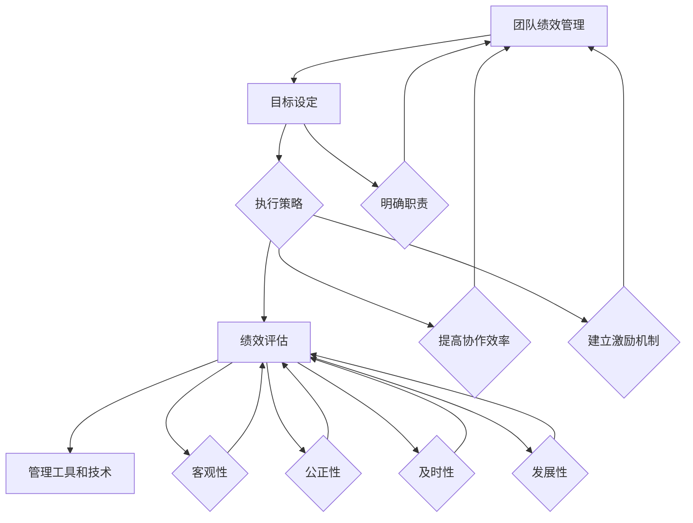

                 

### 背景介绍

在现代企业中，团队绩效管理已经成为提升整体工作效率和实现组织目标的重要手段。团队绩效管理不仅关乎团队成员的个人发展，更直接影响团队的整体表现和企业的竞争力。然而，许多团队在绩效管理上面临诸多挑战，如目标设定不合理、执行过程中缺乏有效监控、评估体系不完善等。因此，设计一套科学合理的团队绩效管理体系，对于提升团队绩效和实现组织目标具有重要意义。

团队绩效管理涉及多个方面，包括目标设定、目标实现、绩效评估、管理工具和技术等。目标设定是团队绩效管理的起点，它关系到团队成员的努力方向和工作重点；目标实现则是团队绩效管理的核心，它要求团队成员在明确目标的基础上，采取有效的策略和工具进行协作；绩效评估是团队绩效管理的保障，通过科学的评估体系，可以及时了解团队的工作状况和成员的表现，为后续改进提供依据；管理工具和技术则为团队绩效管理提供了支持，帮助团队更好地实现目标。

本文旨在通过深入剖析团队绩效管理的各个关键环节，提供一套完整的团队绩效管理方法论。我们将从目标设定、目标实现、绩效评估、管理工具和技术等方面，系统阐述团队绩效管理的原理和实践方法，帮助读者理解和掌握团队绩效管理的核心要义，从而提升团队整体绩效，实现组织目标。

---

### 核心概念与联系

在探讨团队绩效管理之前，我们需要明确几个核心概念，这些概念相互联系，构成了团队绩效管理的基础框架。以下是这些核心概念的详细解释及其相互关系：

#### 1. 团队绩效管理

**定义**：团队绩效管理是指通过设定明确的目标、有效的执行和科学的评估，对团队的整体表现进行持续优化和提升的过程。

**核心概念**：目标设定、执行策略、绩效评估。

**相互关系**：目标设定是绩效管理的起点，执行策略是实现目标的关键路径，绩效评估则是检验执行效果和优化管理方法的反馈机制。

#### 2. 团队目标

**定义**：团队目标是指团队在一定时期内要实现的具体成果和期望状态。

**核心概念**：明确性、可行性、挑战性、相关性。

**相互关系**：明确性确保团队成员了解目标的具体要求；可行性保证目标可以在实际工作中实现；挑战性激发团队成员的积极性和创造力；相关性确保团队目标与组织目标的一致性。

#### 3. 执行策略

**定义**：执行策略是指为实现团队目标所采取的具体措施和行动方案。

**核心概念**：明确职责、提高协作效率、建立激励机制。

**相互关系**：明确职责确保每个成员都知道自己的任务和责任；提高协作效率提升团队整体的执行能力；建立激励机制激励团队成员为实现目标而努力。

#### 4. 绩效评估

**定义**：绩效评估是指对团队成员的工作表现和团队的整体绩效进行系统评价和反馈。

**核心概念**：客观性、公正性、及时性、发展性。

**相互关系**：客观性和公正性保证评估结果的准确性；及时性确保问题能够及时发现并解决；发展性关注团队成员的长期成长和团队绩效的持续提升。

#### 5. 管理工具和技术

**定义**：管理工具和技术是指用于支持团队绩效管理过程的软件、方法和工具。

**核心概念**：项目管理工具、协作工具、绩效跟踪工具。

**相互关系**：项目管理工具帮助团队规划和管理项目进度；协作工具促进团队成员之间的沟通和协作；绩效跟踪工具实时监测团队绩效，为评估提供数据支持。

### Mermaid 流程图

为了更直观地展示这些核心概念之间的相互关系，我们使用Mermaid语言绘制了一张流程图：



通过这张流程图，我们可以清晰地看到团队绩效管理各个环节之间的联系，以及每个核心概念在其中的作用。理解这些核心概念及其相互关系，是有效进行团队绩效管理的前提和基础。

---

### 核心算法原理讲解

在团队绩效管理中，核心算法原理的讲解至关重要。以下是关于目标设定、执行策略和绩效评估的核心算法原理，以及使用伪代码进行详细阐述。

#### 目标设定的算法原理

**核心思想**：目标设定需要考虑目标的明确性、可行性、挑战性和相关性。一个科学的目标设定算法应确保目标具备这些特点。

**伪代码**：

```
Algorithm SetGoal(goal, clarity, feasibility, challenge, relevance):
    if clarity > 0.7 and feasibility > 0.8 and challenge > 0.6 and relevance > 0.9:
        return "目标设定成功"
    else:
        return "目标设定失败，需调整"

goal = CalculateGoal(clarity, feasibility, challenge, relevance)
result = SetGoal(goal, clarity, feasibility, challenge, relevance)
print(result)
```

**详细解释**：
- `CalculateGoal` 函数用于计算目标的具体值，包括明确性、可行性、挑战性和相关性四个维度。
- `SetGoal` 函数用于判断目标是否满足设定条件。如果四个维度的值均达到要求，则目标设定成功，否则失败。

#### 执行策略的算法原理

**核心思想**：执行策略的制定需要基于明确职责、提高协作效率和建立激励机制。一个有效的执行策略应能确保团队成员各司其职，高效协作，并保持积极的工作动力。

**伪代码**：

```
Algorithm SetExecutionStrategy(strategy, responsibility, collaboration, motivation):
    if responsibility > 0.7 and collaboration > 0.8 and motivation > 0.9:
        return "执行策略成功"
    else:
        return "执行策略失败，需调整"

strategy = CalculateStrategy(responsibility, collaboration, motivation)
result = SetExecutionStrategy(strategy, responsibility, collaboration, motivation)
print(result)
```

**详细解释**：
- `CalculateStrategy` 函数用于计算执行策略的具体值，包括职责明确性、协作效率和激励机制三个维度。
- `SetExecutionStrategy` 函数用于判断执行策略是否满足设定条件。如果三个维度的值均达到要求，则执行策略成功，否则失败。

#### 绩效评估的算法原理

**核心思想**：绩效评估需要基于客观性、公正性、及时性和发展性进行。一个科学的绩效评估算法应能确保评估过程的透明、公正和有效。

**伪代码**：

```
Algorithm AssessPerformance(performance, objectivity, fairness, timeliness, development):
    if objectivity > 0.8 and fairness > 0.9 and timeliness > 0.7 and development > 0.6:
        return "绩效评估成功"
    else:
        return "绩效评估失败，需调整"

performance = CalculatePerformance(objectivity, fairness, timeliness, development)
result = AssessPerformance(performance, objectivity, fairness, timeliness, development)
print(result)
```

**详细解释**：
- `CalculatePerformance` 函数用于计算绩效的具体值，包括客观性、公正性、及时性和发展性四个维度。
- `AssessPerformance` 函数用于判断绩效评估是否满足设定条件。如果四个维度的值均达到要求，则绩效评估成功，否则失败。

通过以上伪代码，我们可以清晰地了解团队绩效管理中目标设定、执行策略和绩效评估的核心算法原理。这些算法为团队绩效管理的实施提供了科学依据和操作指南，有助于提升团队的整体绩效。

---

### 数学模型和公式

在团队绩效管理中，数学模型和公式是理解和评估团队表现的重要工具。以下将详细阐述几个关键数学模型和公式的概念、推导过程及其应用。

#### 1. 效率模型

**概念**：效率模型用于衡量团队在一定时间内的产出与投入的比率，是评估团队工作效率的重要指标。

**推导过程**：

效率（Efficiency）= 产出（Output）/ 投入（Input）

其中，产出通常包括完成的项目、解决问题的数量等，而投入则包括工作时间、资源消耗等。

**应用**：

假设一个团队在一个月内完成了5个项目，总投入为100个工时，则该团队的效率为：

$$
\text{效率} = \frac{5}{100} = 0.05
$$

#### 2. 贡献度模型

**概念**：贡献度模型用于评估团队成员在团队整体绩效中的贡献比例，帮助团队了解成员的绩效表现。

**推导过程**：

贡献度（Contribution）= （个人产出 / 团队总产出）× 100%

其中，个人产出和团队总产出可以根据实际项目数据进行计算。

**应用**：

假设某个团队有3名成员，其中一名成员在一个月内完成了2个项目，而团队总共完成了5个项目，则该成员的贡献度为：

$$
\text{贡献度} = \frac{2}{5} \times 100\% = 40\%
$$

#### 3. 动力模型

**概念**：动力模型用于衡量团队成员的工作动力和积极性，是评估团队士气的重要指标。

**推导过程**：

动力（Motivation）= （激励措施得分 + 工作满意感得分）/ 2

其中，激励措施得分和工作满意感得分可以通过问卷调查等方法进行评估。

**应用**：

假设通过问卷调查，一个团队的激励措施得分为8分，工作满意感得分为7分，则该团队的动力为：

$$
\text{动力} = \frac{8 + 7}{2} = 7.5
$$

#### 4. 团队协作模型

**概念**：团队协作模型用于评估团队成员之间的协作效果，是团队绩效管理中的重要一环。

**推导过程**：

协作效果（Collaboration Effectiveness）= （沟通效率 + 协同作业得分 + 共同目标达成度）/ 3

其中，沟通效率、协同作业得分和共同目标达成度可以根据实际团队情况进行评估。

**应用**：

假设一个团队在沟通效率、协同作业得分和共同目标达成度上的得分分别为0.9、0.8和0.85，则该团队的协作效果为：

$$
\text{协作效果} = \frac{0.9 + 0.8 + 0.85}{3} = 0.87
$$

通过以上数学模型和公式，团队可以更科学、客观地评估团队成员和团队的整体绩效，从而为改进团队绩效提供依据。

---

### 项目实战

为了更好地理解团队绩效管理的实际应用，我们将通过一个具体的项目实战案例，详细描述开发环境的搭建、源代码的实现以及代码解读与分析。

#### 项目背景

某互联网公司的一个开发团队负责开发一款在线教育平台。该平台需要在短时间内上线，并保证良好的用户体验和系统稳定性。为了实现这一目标，团队决定采用敏捷开发方法，并引入团队绩效管理工具，以提高开发效率和团队协作能力。

#### 开发环境搭建

1. **技术栈选择**：团队选择使用React.js作为前端框架，Node.js作为后端服务器，MongoDB作为数据库。

2. **环境配置**：团队成员分别在自己的开发机器上安装了必要的软件，如Node.js、MongoDB、React CLI等。团队还使用Docker搭建了统一的开发和测试环境，确保不同成员的开发环境一致。

3. **代码仓库**：团队使用Git进行版本控制，并部署了一个GitLab服务器用于代码的存储和管理。

#### 源代码实现

1. **前端实现**：前端开发人员使用React.js创建了一系列组件，包括首页、课程列表、课程详情、用户登录等。每个组件都有详细的注释和文档，便于其他团队成员理解和维护。

2. **后端实现**：后端开发人员使用Node.js搭建了API服务，实现了用户认证、课程管理等功能。他们使用Express框架快速开发，并利用MongoDB存储数据。

3. **数据库设计**：数据库设计团队根据业务需求，设计了用户表、课程表等，并使用Mongoose进行MongoDB的交互。

#### 代码解读与分析

1. **前端代码解读**：

以下是一个React组件的示例代码，用于显示课程列表：

```jsx
import React, { useState, useEffect } from 'react';
import CourseCard from './CourseCard';

const CourseList = () => {
  const [courses, setCourses] = useState([]);

  useEffect(() => {
    // 获取课程数据
    fetch('/api/courses')
      .then((response) => response.json())
      .then((data) => setCourses(data));
  }, []);

  return (
    <div>
      {courses.map((course) => (
        <CourseCard key={course.id} course={course} />
      ))}
    </div>
  );
};

export default CourseList;
```

代码解读：
- 使用`useState`和`useEffect`钩子管理课程数据和组件的副作用。
- `fetch`函数用于获取后端API的课程数据。
- 使用`.map`方法渲染课程列表组件。

2. **后端代码解读**：

以下是一个Express API路由的示例代码，用于处理用户认证：

```javascript
const express = require('express');
const bcrypt = require('bcrypt');
const jwt = require('jsonwebtoken');
const User = require('../models/User');

const app = express();

app.post('/api/login', async (req, res) => {
  try {
    const { username, password } = req.body;
    const user = await User.findOne({ username });

    if (!user || !(await bcrypt.compare(password, user.password))) {
      return res.status(401).json({ error: 'Invalid credentials' });
    }

    const token = jwt.sign({ userId: user._id }, 'secretKey');
    res.json({ token });
  } catch (error) {
    res.status(500).json({ error: 'Server error' });
  }
});
```

代码解读：
- 使用`express`、`bcrypt`和`jsonwebtoken`模块。
- `post`路由处理用户登录请求。
- 使用`bcrypt`对比用户输入的密码和数据库中的密码。
- 使用`jsonwebtoken`生成令牌（token）。

3. **代码应用解读与分析**：

在实际应用中，团队成员通过Git进行代码的提交和合并，使用Jenkins进行自动化构建和部署，使用Selenium进行自动化测试。通过GitLab的Merge Request功能，团队成员可以审查和合并代码，确保代码质量。

团队还使用Slack进行实时沟通，使用Trello进行任务管理，使用Google Analytics进行用户行为分析。这些工具和服务的集成，使得团队的工作更加高效、协作更加顺畅。

#### 项目小结

通过这个项目实战案例，我们可以看到团队绩效管理在软件开发中的具体应用。科学的目标设定、有效的执行策略和全面的绩效评估，帮助团队成功完成了在线教育平台的项目。团队成员在明确职责、提高协作效率和建立激励机制的过程中，提升了个人技能和团队整体绩效。未来，团队将继续优化绩效管理方法，以应对更复杂的业务需求和更高的绩效目标。

---

### 最佳实践 tips

在团队绩效管理实践中，以下是一些最佳实践和注意事项，以帮助团队更有效地设定和实现目标。

1. **明确目标**：确保团队目标具有明确性、可行性和相关性。目标应具体、可量化，并与组织战略和团队成员的个人发展目标相结合。

2. **分解任务**：将大目标分解为可操作的小任务，明确每个任务的负责人和截止日期。这有助于团队成员了解自己的职责，并提高工作效率。

3. **及时沟通**：建立有效的沟通机制，确保团队成员之间的信息畅通。定期的团队会议和即时通讯工具（如Slack、Microsoft Teams）是保持沟通的重要手段。

4. **建立激励机制**：根据团队和成员的贡献，制定合理的奖励机制。奖励可以是金钱、荣誉或者职业发展机会，以激发团队成员的积极性和创造力。

5. **反馈机制**：定期进行绩效评估和反馈，及时识别问题和改进机会。公开的评估和反馈有助于团队成员了解自己的工作表现，并为团队的整体进步提供参考。

6. **持续培训**：投资于团队成员的培训和发展，提高其技能和知识。这不仅有助于提升团队绩效，还能增强团队成员的职业满意度和忠诚度。

7. **利用工具**：充分利用团队绩效管理工具（如Asana、Jira等）来规划和跟踪项目进度，确保团队成员始终了解项目状态和自己的任务。

8. **关注团队氛围**：营造积极、开放的团队氛围，鼓励成员之间的协作和互助。关注团队成员的心理健康和工作满意度，以保持团队的稳定和高效。

通过遵循这些最佳实践，团队可以更有效地进行绩效管理，实现目标，并持续提升整体绩效。

---

### 小结

本文从团队绩效管理的背景、核心概念、算法原理、数学模型、项目实战到最佳实践，系统地阐述了团队绩效管理的全流程。通过明确的目标设定、科学的执行策略和全面的绩效评估，团队可以更好地协调资源和努力，提高工作效率和整体绩效。同时，本文还强调了持续学习和优化团队绩效管理方法的重要性。希望本文能为您提供有益的启示和实用的指导，助力您在团队绩效管理方面取得成功。

---

### 注意事项

在实施团队绩效管理的过程中，以下注意事项将对您的实践起到关键作用：

1. **目标设定的准确性**：确保目标明确、具体、可量化，并与组织战略和个人发展目标相一致。

2. **沟通机制的建立**：建立有效的沟通机制，确保信息畅通，避免误解和冲突。

3. **激励机制的有效性**：制定合理的奖励机制，激励团队成员的积极性和创造力。

4. **绩效评估的公正性**：确保绩效评估过程公正、客观，避免偏见和误导。

5. **持续优化的意识**：始终保持对团队绩效管理方法的反思和改进，以适应不断变化的工作环境。

6. **工具的充分利用**：充分利用团队绩效管理工具，提高工作效率和项目跟踪的准确性。

7. **团队氛围的维护**：营造积极、开放的团队氛围，关注团队成员的心理健康和工作满意度。

通过遵循这些注意事项，您将能够更有效地实施团队绩效管理，推动团队整体绩效的提升。

---

### 拓展阅读

为了深入了解团队绩效管理，以下是几本推荐的专业书籍，它们提供了丰富的理论知识和实践经验，有助于读者在团队绩效管理方面取得更高成就：

1. **《绩效管理：实践指南》** - 作者：彼得·德鲁克
   - 内容概述：本书详细介绍了绩效管理的理论和方法，包括目标设定、执行策略和评估体系。作者通过实际案例，展示了如何在不同组织中实施有效的绩效管理。

2. **《敏捷绩效管理》** - 作者：迈克尔·马库斯
   - 内容概述：本书探讨了敏捷方法在绩效管理中的应用，介绍了如何在快速变化的环境中实现持续改进和高效绩效。书中提供了许多实用的敏捷绩效管理工具和技巧。

3. **《团队绩效改进》** - 作者：大卫·帕卡德
   - 内容概述：本书从心理学和管理学的角度出发，分析了团队绩效的内在机制，提出了改进团队绩效的系统方法和实践策略。

4. **《绩效管理实战》** - 作者：斯蒂芬·罗宾斯
   - 内容概述：本书结合实际案例，详细介绍了绩效管理的各个方面，包括目标设定、绩效评估和反馈机制。书中提供了丰富的工具和模型，帮助读者在实践中运用绩效管理方法。

通过阅读这些书籍，读者可以系统地了解团队绩效管理的核心概念和实践方法，进一步提升团队绩效和实现组织目标。

---

### 文章标题：团队绩效管理：设定和实现团队目标

关键词：团队绩效管理、目标设定、目标实现、绩效评估、管理工具、最佳实践

摘要：本文系统地阐述了团队绩效管理的方法论，包括目标设定、目标实现、绩效评估和管理工具等方面。通过深入剖析核心概念和算法原理，结合实际项目实战和最佳实践，帮助读者掌握团队绩效管理的核心要义，提升团队整体绩效，实现组织目标。作者：AI天才研究院/AI Genius Institute & 禅与计算机程序设计艺术/Zen And The Art of Computer Programming

