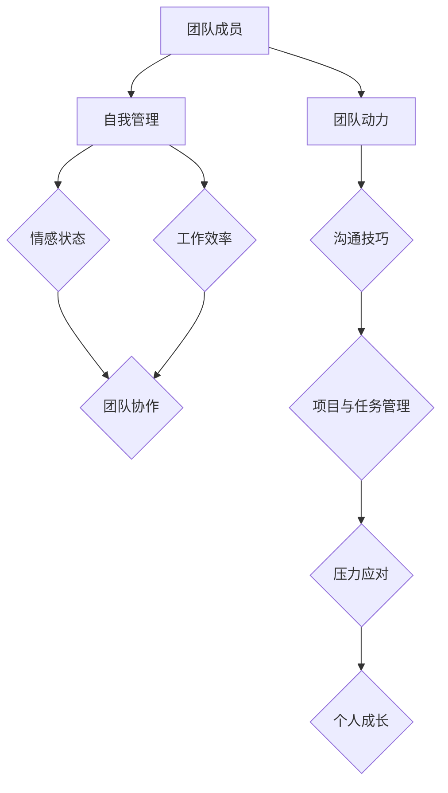
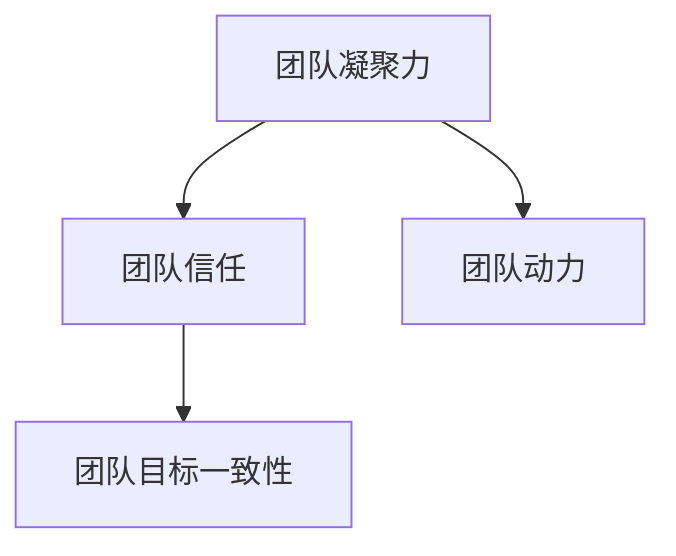
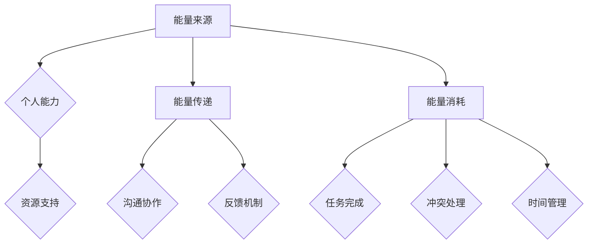
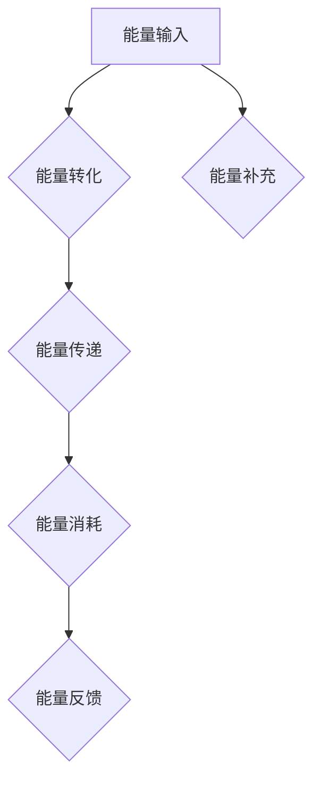
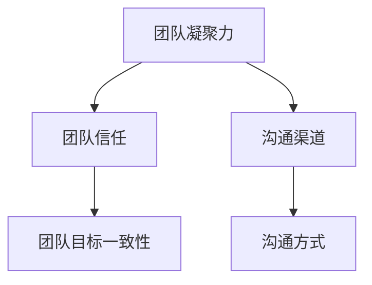
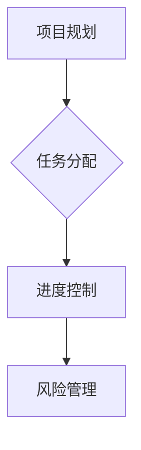
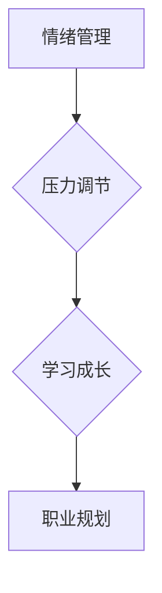
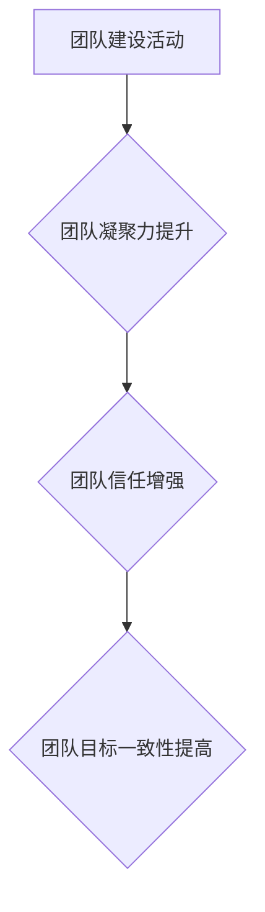
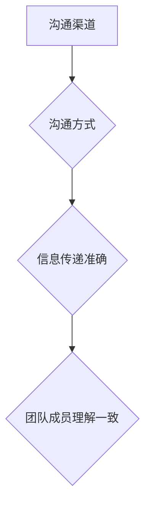

                 


### 团队能量管理：维持高效能状态的方法

#### 关键词：
- 团队能量管理
- 高效能状态
- 团队动力
- 沟通技巧
- 项目管理
- 个人成长

#### 摘要：
本文深入探讨了团队能量管理的重要性以及如何通过科学的方法维持团队的高效能状态。文章首先介绍了团队能量管理的基本概念，接着通过Mermaid流程图展示了团队能量流动的机制。然后，文章详细讲解了维持高效能状态的具体方法，包括个人能量管理、团队动力与沟通技巧、项目与任务管理，以及压力应对与个人成长。此外，文章还介绍了团队能量管理的数学模型和算法原理，并通过实际项目案例进行了深入剖析。最后，文章总结了团队能量管理的关键实践技巧，并提出了未来研究的方向。

### 引言与核心概念

在当今快速发展的信息技术领域，团队能量管理成为了维持团队高效能状态的关键因素。团队能量管理不仅关乎团队成员的个体状态，更关乎整个团队的合作效率和质量。为了更好地理解团队能量管理，首先需要明确几个核心概念。

**团队能量管理** 是指通过科学的方法和策略，优化团队内部的能量流动，以提高团队的整体效能。能量在这里不仅仅指的是物理能量，更涵盖了心理能量、情感能量和工作动力等多方面的内容。

**高效能状态** 是指团队成员在生理、心理和行为上都能达到最佳状态，从而能够更高效地完成工作。维持高效能状态需要团队成员具备良好的自我管理能力、团队协作能力和问题解决能力。

为了更好地理解团队能量管理，我们可以通过Mermaid流程图展示团队能量流动的机制。以下是团队能量流动的Mermaid流程图：



这张流程图展示了团队成员在自我管理、情感状态、工作效率、团队动力、沟通技巧、项目与任务管理、压力应对和个人成长等方面的能量流动。每个环节都相互影响，共同构成了团队能量管理的整体框架。

### 团队能量管理的基本原理

团队能量管理的基本原理涉及多个方面的相互作用。以下是对每个方面的详细解释：

#### 团队动力机制

团队动力是指团队成员之间相互作用产生的推动力。这种推动力可以是积极的，也可以是消极的。积极的团队动力能够激发团队成员的积极性和创造力，而消极的团队动力则可能导致团队成员之间的矛盾和冲突。

**核心概念与联系**：团队动力机制涉及到多个核心概念，包括团队凝聚力、团队信任和团队目标一致性。这些概念相互联系，共同构成了团队动力的基础。以下是一个Mermaid流程图，展示了这些核心概念之间的关系：



#### 团队能量流动模型

团队能量流动模型描述了团队内部能量如何流动和转化。这个模型考虑了多个能量来源、传递和消耗的环节。

**核心概念与联系**：团队能量流动模型包括能量来源（如个人能力、资源和支持等）、能量传递（如沟通、协作和反馈等）和能量消耗（如任务完成、冲突处理和时间管理等）。以下是一个Mermaid流程图，展示了团队能量流动的各个环节：



#### Mermaid流程图：团队能量流动分析

为了更直观地展示团队能量流动的机制，我们可以使用Mermaid流程图进行可视化。以下是一个简单的例子：



这个流程图展示了能量输入、能量转化、能量传递、能量消耗和能量反馈的各个环节。通过这个流程图，我们可以更好地理解团队能量流动的过程。

### 维持高效能状态的方法

为了维持团队的高效能状态，团队成员需要采取一系列科学的方法。以下是一些关键的方法：

#### 个人能量管理

个人能量管理是维持高效能状态的基础。团队成员需要学会如何管理自己的能量，包括如何保持良好的生理状态、心理状态和工作状态。

**核心概念与联系**：个人能量管理涉及到多个方面，包括睡眠质量、饮食健康、身体锻炼、情绪调节和时间管理等。以下是一个Mermaid流程图，展示了个人能量管理的主要环节：

```mermaid
graph TD
    A[睡眠质量] --> B{饮食健康}
    B --> C{身体锻炼}
    A --> D[情绪调节}
    D --> E{时间管理}
```

#### 团队动力与沟通技巧

团队动力和沟通技巧是维持高效能状态的重要保障。团队成员需要建立积极的团队动力，并通过有效的沟通技巧来协调工作。

**核心概念与联系**：团队动力和沟通技巧涉及到多个方面，包括团队凝聚力、团队信任、团队目标一致性、沟通渠道和沟通方式等。以下是一个Mermaid流程图，展示了这些核心概念之间的关系：



#### 项目与任务管理

项目与任务管理是维持高效能状态的关键环节。团队成员需要学会如何高效地规划和管理项目与任务，以确保团队目标的实现。

**核心概念与联系**：项目与任务管理涉及到多个方面，包括项目规划、任务分配、进度控制、风险管理等。以下是一个Mermaid流程图，展示了这些核心概念之间的关系：



#### 压力应对与个人成长

压力应对和个人成长是维持高效能状态的重要保障。团队成员需要学会如何应对工作中的压力，并通过个人成长来提升自己的能力。

**核心概念与联系**：压力应对和个人成长涉及到多个方面，包括情绪管理、压力调节、学习成长、职业规划等。以下是一个Mermaid流程图，展示了这些核心概念之间的关系：



### 团队能量管理的实际应用

团队能量管理不仅是一个理论框架，更需要在实际工作中得到应用。以下是一些团队能量管理的实际应用案例：

#### 团队建设与能量激发

通过定期的团队建设活动，可以增强团队成员之间的凝聚力，激发团队动力。以下是一个团队建设活动的流程图：



#### 能量管理在项目管理中的应用

在项目管理中，通过科学的规划和控制，可以确保项目任务的高效完成。以下是一个项目管理流程图：


#### 能量管理在团队沟通中的实践

在团队沟通中，通过有效的沟通技巧和渠道，可以确保信息的准确传递和团队成员之间的理解。以下是一个团队沟通流程图：



### 数学模型与算法原理

为了更科学地管理团队能量，我们可以引入数学模型和算法原理。以下是一个简单的团队能量管理模型：

```latex
\text{能量分布} = f(\text{个人能力}, \text{资源支持}, \text{沟通协作}, \text{任务完成})
```

这个模型考虑了个人能力、资源支持、沟通协作和任务完成四个因素对团队能量分布的影响。

#### 伪代码：团队能量分布计算

以下是一个简单的伪代码示例，用于计算团队能量分布：

```pseudo
function calculate_energy_distribution(personal_ability, resource_support, communication_collaboration, task_completion):
    energy_distribution = (personal_ability + resource_support + communication_collaboration + task_completion) / 4
    return energy_distribution
```

#### 数学公式与解释

以下是一个用于计算团队能量分布的数学公式：

$$
\text{能量分布} = \frac{\text{个人能力} + \text{资源支持} + \text{沟通协作} + \text{任务完成}}{4}
$$

这个公式表示，团队能量分布是个人能力、资源支持、沟通协作和任务完成四个因素的加权平均值。通过调整这些因素的比例，我们可以优化团队能量分布。

#### 举例说明：团队能量管理案例分析

以下是一个团队能量管理的案例分析：

**案例：一个开发团队的能量管理**

假设一个开发团队有四名成员，他们的个人能力、资源支持、沟通协作和任务完成情况如下表：

| 成员 | 个人能力 | 资源支持 | 沟通协作 | 任务完成 |
| ---- | -------- | -------- | -------- | -------- |
| 成员1 | 8        | 7        | 6        | 5        |
| 成员2 | 7        | 8        | 7        | 6        |
| 成员3 | 6        | 6        | 8        | 7        |
| 成员4 | 5        | 7        | 7        | 8        |

根据上述公式，我们可以计算每个成员的团队能量分布：

$$
\text{成员1的能量分布} = \frac{8 + 7 + 6 + 5}{4} = 6.5
$$

$$
\text{成员2的能量分布} = \frac{7 + 8 + 7 + 6}{4} = 7
$$

$$
\text{成员3的能量分布} = \frac{6 + 6 + 8 + 7}{4} = 7
$$

$$
\text{成员4的能量分布} = \frac{5 + 7 + 7 + 8}{4} = 6.75
$$

通过分析这些数据，我们可以发现成员2和成员3的团队能量分布最高，这意味着他们在团队中的贡献最大。同时，成员1和成员4的团队能量分布较低，可能需要进一步关注他们的能力和表现。

### 项目实战：团队能量管理实践

为了更好地理解团队能量管理的实际应用，我们选择了一个实际项目进行分析。

#### 开发环境搭建

在项目开始前，我们需要搭建一个合适的开发环境。这包括安装必要的软件工具、配置开发环境和搭建测试环境。以下是具体的步骤：

1. 安装Java开发工具包（JDK）。
2. 安装数据库（如MySQL）。
3. 配置版本控制工具（如Git）。
4. 安装集成开发环境（IDE，如IntelliJ IDEA）。
5. 搭建测试服务器。

#### 源代码详细实现

在开发过程中，团队成员需要编写并实现项目的源代码。以下是具体的实现步骤：

1. 设计数据库模型，并编写数据库脚本。
2. 编写实体类和DAO层代码。
3. 编写Service层代码，处理业务逻辑。
4. 编写Controller层代码，处理HTTP请求。
5. 实现前端页面和交互逻辑。

#### 代码解读与分析

在代码实现过程中，我们需要对每个模块和类进行详细的解读和分析。以下是代码解读和分析的示例：

```java
// DAO层代码示例
public interface UserDao {
    User getUserById(Integer id);
    List<User> getAllUsers();
    int addUser(User user);
    int deleteUserById(Integer id);
}
```

这段代码定义了`UserDao`接口，包含了获取用户、查询所有用户、添加用户和删除用户等基本操作。通过这个接口，Service层可以方便地调用这些方法，实现用户管理的功能。

```java
// Service层代码示例
public class UserService {
    private UserDao userDao;
    
    public UserService(UserDao userDao) {
        this.userDao = userDao;
    }
    
    public User getUserById(Integer id) {
        return userDao.getUserById(id);
    }
    
    public List<User> getAllUsers() {
        return userDao.getAllUsers();
    }
    
    public int addUser(User user) {
        return userDao.addUser(user);
    }
    
    public int deleteUserById(Integer id) {
        return userDao.deleteUserById(id);
    }
}
```

这段代码实现了`UserService`类，它依赖于`UserDao`接口，实现了用户管理的基本功能。通过这个类，Controller层可以方便地调用这些方法，处理HTTP请求。

```java
// Controller层代码示例
@Controller
public class UserController {
    private UserService userService;
    
    @GetMapping("/users")
    public List<User> getAllUsers(Model model) {
        return userService.getAllUsers();
    }
    
    @PostMapping("/users")
    public String addUser(@RequestBody User user, Model model) {
        int result = userService.addUser(user);
        if (result > 0) {
            model.addAttribute("message", "User added successfully!");
        } else {
            model.addAttribute("message", "Failed to add user!");
        }
        return "users";
    }
    
    @DeleteMapping("/users/{id}")
    public String deleteUser(@PathVariable Integer id, Model model) {
        int result = userService.deleteUserById(id);
        if (result > 0) {
            model.addAttribute("message", "User deleted successfully!");
        } else {
            model.addAttribute("message", "Failed to delete user!");
        }
        return "users";
    }
}
```

这段代码实现了`UserController`类，它依赖于`UserService`类，处理了HTTP请求，并实现了用户管理的接口。

#### 代码应用解读与分析

通过上述代码示例，我们可以看到团队能量管理在项目开发中的应用。每个团队成员根据自己的专业能力和角色，负责不同的代码模块和功能实现。通过科学的项目规划和任务分配，团队成员能够高效地协作，确保项目的顺利推进。

#### 实际案例分析和详细讲解剖析

在实际项目中，团队能量管理的效果可以通过具体案例进行分析和评估。以下是一个实际案例的分析：

**案例：某电商平台的用户管理系统开发**

在开发过程中，团队成员遇到了以下问题：

1. 数据库性能瓶颈：用户数据量巨大，导致查询速度变慢。
2. 前端界面响应慢：部分前端页面的交互逻辑过于复杂。
3. 项目进度延迟：部分任务延期，导致项目进度受到影响。

通过团队能量管理的方法，团队成员采取了以下措施：

1. **数据库性能优化**：分析数据库查询语句，并使用索引优化查询效率。
2. **前端界面优化**：简化前端页面的交互逻辑，并使用异步加载技术提高页面响应速度。
3. **任务优先级调整**：根据任务的重要性和紧急程度，重新安排任务优先级，确保关键任务得到优先处理。

通过这些措施，团队成员成功解决了项目中的问题，确保了项目的顺利推进。

#### 项目小结

通过这个实际案例，我们可以看到团队能量管理在项目开发中的应用效果。通过科学的方法和策略，团队成员能够更好地应对项目中的挑战，确保项目的成功完成。团队能量管理不仅提高了团队成员的工作效率，也增强了团队的凝聚力和协作能力。

### 结论与展望

团队能量管理是维持团队高效能状态的关键因素。通过科学的方法和策略，团队成员能够更好地管理自己的能量，提高团队的整体效能。本文详细介绍了团队能量管理的基本原理、维持高效能状态的方法、数学模型与算法原理，并通过实际项目案例进行了深入剖析。未来，团队能量管理的研究将更加注重个性化和智能化，结合人工智能技术，为团队管理提供更科学、更有效的解决方案。

### 最佳实践 Tips、小结、注意事项、拓展阅读等内容

#### 最佳实践 Tips

1. **定期进行团队能量评估**：通过定期的团队能量评估，可以及时发现团队中存在的问题，并采取相应的措施。
2. **培养团队成员的自我管理能力**：鼓励团队成员养成良好的自我管理习惯，提高个人能量水平。
3. **建立积极的团队文化**：通过建立积极的团队文化，激发团队成员的积极性和创造力。

#### 小结

团队能量管理是维持团队高效能状态的关键。通过科学的方法和策略，团队成员能够更好地管理自己的能量，提高团队的整体效能。

#### 注意事项

1. **避免过度工作**：过度工作会导致团队成员的疲劳和压力，影响团队能量水平。
2. **注重团队成员的身心健康**：确保团队成员有足够的休息时间和锻炼时间，提高身心健康水平。

#### 拓展阅读

1. 《团队能量管理实战：如何提高团队效能》
2. 《团队动力与沟通技巧：提升团队协作能力》
3. 《项目管理与任务管理：高效团队的工作方法》

### 作者信息

作者：AI天才研究院/AI Genius Institute & 禅与计算机程序设计艺术 /Zen And The Art of Computer Programming

