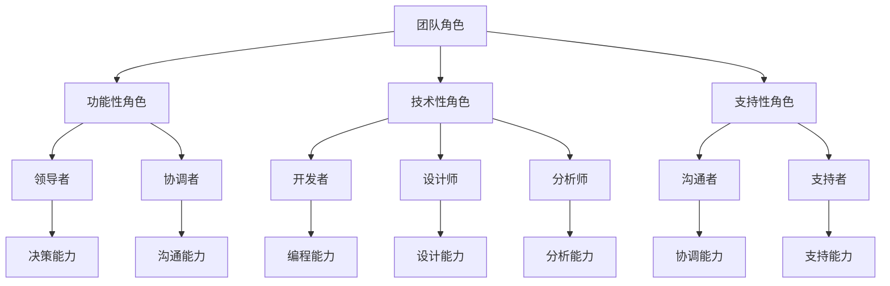

                 

### 文章标题

# 团队角色优化：maximizing个人长处的策略

---

关键词：团队角色优化、个人长处、团队效能、组织管理

摘要：本文深入探讨了团队角色优化的重要性，以及如何通过识别和最大化个人长处来提升团队效能。通过理论阐述、实践指南和案例分析，本文为管理者提供了一套全面的策略和方法，旨在实现团队角色与个人能力的最佳匹配。

---

## 引言

在当今快速变化和高度竞争的商业环境中，团队角色优化已经成为提高组织效能的关键因素。团队角色优化不仅关乎个体的职业发展，更直接影响整个团队的协作效率和项目成功。优化团队角色意味着更好地发挥每个成员的长处，弥补短板，实现团队资源的最佳配置。

### 团队角色优化的定义

团队角色优化是指在组织管理中，通过科学的方法识别和定位团队成员的长处，将其安排在最适合其能力的岗位上，以实现团队效能的最大化。这一过程涉及对个人能力的评估、团队结构的调整以及团队文化的建设。

### 团队角色优化的好处

- **提升团队协作效率**：通过优化团队角色，可以确保每个成员都能在其最擅长的工作领域发挥最大的价值，从而提高整个团队的协作效率。
- **促进个人成长**：团队成员在适合自己的角色中更容易获得成就感，有助于提高工作满意度和职业发展。
- **增强团队凝聚力**：当团队成员意识到自己的长处得到重视和利用时，团队的凝聚力和信任感会显著增强。
- **提高项目成功率**：团队角色的优化能够确保项目资源得到最有效的利用，从而提高项目的成功率。

### 研究背景与目的

在现代企业中，团队角色优化的重要性日益凸显。传统的团队管理方法往往侧重于任务分配，而忽视了团队成员的个人能力和偏好。随着团队成员多样性和专业化程度的提高，如何科学地优化团队角色成为了一个亟待解决的问题。

本文旨在通过系统的研究，提出一套实用的团队角色优化策略，帮助管理者更好地识别和利用团队成员的长处，提升团队整体效能。本文将从理论、实践和案例分析三个方面展开，旨在为团队角色优化提供全面、深入的指导。

---

### 团队角色理论

团队角色理论是团队角色优化的重要理论基础。它涉及对团队角色的概念、分类、特点及其与个人发展的关系进行深入探讨。

#### 团队角色的概念

团队角色是指在团队中，根据成员的能力、技能和职责而划分的特定角色。每个角色都有其特定的职责和功能，共同构成团队的完整结构。

#### 团队角色的分类

团队角色可以根据职责和功能的不同进行分类。常见的分类方法包括：

- **功能性角色**：如领导者、协调者、执行者、监督者等。
- **技术性角色**：如开发者、设计师、分析师、测试员等。
- **支持性角色**：如沟通者、协调者、支持者等。

#### 团队角色的特点

- **多样性**：团队成员具备不同的技能和知识，形成多样性的团队结构。
- **适应性**：团队角色可以根据项目需求和团队状况进行灵活调整。
- **互补性**：不同角色的成员可以相互补充，形成完整的团队功能。

#### 团队角色与个人发展

团队角色不仅影响团队效能，还对个人发展产生重要影响。通过团队角色，成员可以：

- **发现和发展个人长处**：在特定角色中，成员能够更好地发现自己的长处，并通过持续学习和实践不断提升。
- **提升职业素养**：在团队角色中，成员需要不断提升沟通、协作和解决问题的能力，有助于提升职业素养。
- **实现职业晋升**：通过在团队角色中的出色表现，成员可以获得更多的发展机会，实现职业晋升。

### 团队角色的核心概念与联系

为了更好地理解团队角色，我们可以通过Mermaid流程图来展示其核心概念和联系：



### 团队角色优化的核心算法原理讲解

团队角色优化涉及多个核心算法原理，包括个人能力评估、团队角色匹配和优化策略等。以下使用伪代码详细阐述这些算法原理：

```plaintext
// 个人能力评估算法
function evaluateCapabilities(employee):
    capabilities = {}
    capabilities['communication'] = employee.communicationScore()
    capabilities['technical'] = employee.technicalScore()
    capabilities['leadership'] = employee.leadershipScore()
    return capabilities

// 团队角色匹配算法
function matchRoles(capabilities, teamRoles):
    matchedRoles = {}
    for role in teamRoles:
        bestFit = findBestFit(capabilities, role)
        matchedRoles[role] = bestFit
    return matchedRoles

// 优化策略算法
function optimizeTeamRoles(teamMembers, teamRoles):
    evaluatedCapabilities = []
    for member in teamMembers:
        capabilities = evaluateCapabilities(member)
        evaluatedCapabilities.append(capabilities)
    matchedRoles = matchRoles(evaluatedCapabilities, teamRoles)
    return matchedRoles
```

### 数学模型和公式

在团队角色优化中，我们经常使用以下数学模型和公式：

1. **个人能力评分模型**：

   $$ score = \frac{communication + technical + leadership}{3} $$

   其中，$communication$、$technical$、$leadership$分别代表沟通能力、技术能力和领导能力得分。

2. **团队角色匹配度模型**：

   $$ matchScore = \frac{sum(score * weight)}{totalWeight} $$

   其中，$score$为个人能力得分，$weight$为团队角色权重，$totalWeight$为总权重。

### 举例说明

假设一个团队有3名成员，其沟通能力、技术能力和领导能力得分分别为：

- 成员A：$communication = 8, technical = 9, leadership = 7$
- 成员B：$communication = 7, technical = 8, leadership = 8$
- 成员C：$communication = 9, technical = 7, leadership = 9$

团队的三个角色：领导者、技术开发者和沟通者，权重分别为：$weight_{leader} = 0.3, weight_{developer} = 0.4, weight_{communicator} = 0.3$。

1. **个人能力评分**：

   成员A的得分：$$ score_A = \frac{8 + 9 + 7}{3} = 8 $$

   成员B的得分：$$ score_B = \frac{7 + 8 + 8}{3} = 7.67 $$

   成员C的得分：$$ score_C = \frac{9 + 7 + 9}{3} = 8.67 $$

2. **团队角色匹配度计算**：

   成员A匹配领导者的得分：$$ matchScore_A = \frac{8 \times 0.3}{0.3} = 8 $$

   成员B匹配技术开发者的得分：$$ matchScore_B = \frac{7.67 \times 0.4}{0.4} = 7.67 $$

   成员C匹配沟通者的得分：$$ matchScore_C = \frac{8.67 \times 0.3}{0.3} = 8.67 $$

根据得分，可以将成员A分配到领导者角色，成员B分配到技术开发者角色，成员C分配到沟通者角色。

---

### 个人长处识别与评估

个人长处的识别与评估是团队角色优化的关键步骤，它直接影响到团队角色的匹配度和整体效能。以下将详细阐述如何识别和评估个人长处。

#### 个人长处的概念

个人长处是指一个人在特定领域内具备的突出能力和优势。这些长处可以是技术技能、管理能力、沟通技巧或任何其他能够为团队带来价值的特质。

#### 个人长处的类型

个人长处可以分为以下几类：

- **技术技能**：如编程能力、数据分析、软件开发等。
- **管理能力**：如团队领导、项目管理、决策制定等。
- **沟通技巧**：如口头表达、书面沟通、跨文化沟通等。
- **创新思维**：如解决问题的能力、创造新的想法和解决方案等。

#### 个人长处的识别方法

1. **自我评估**

   自我评估是一种简单的识别个人长处的方法。通过自我反思，个人可以识别自己在哪些领域具备优势。以下是一些自我评估的工具和技巧：

   - **技能清单**：列出自己的技能和经验，包括专业知识和实践能力。
   - **成就记录**：记录自己在工作中的成就和成功案例，分析其背后的能力和优势。
   - **职业兴趣测试**：通过职业兴趣测试，了解自己在哪些领域更感兴趣，从而发现潜在的长处。

2. **360度反馈**

   360度反馈是一种通过收集团队成员、上级、下属和同级的反馈来识别个人长处的方法。这种方法可以提供更全面的视角，帮助个人识别自己在不同方面的表现和优势。

   - **反馈收集**：通过问卷调查、访谈等方式收集来自不同角度的反馈。
   - **反馈分析**：对收集到的反馈进行整理和分析，识别出共同点和突出的优势。

3. **心理测试**

   心理测试是一种科学的识别个人长处的方法，可以通过分析个人的性格、能力、兴趣等方面来发现长处。

   - **MBTI**：Myers-Briggs Type Indicator（MBTI）是一种常用的性格测试，可以帮助个人了解自己的性格类型，从而识别长处。
   - **能力测试**：如心理测量学的能力测试，可以评估个人的多种能力，如逻辑思维、空间感知、语言表达等。

#### 个人长处的评估工具

1. **能力评估量表**

   能力评估量表是一种基于具体指标和标准对个人能力进行评估的工具。量表通常包括多个维度，如技术能力、管理能力、沟通能力等。

   - **评估维度**：根据团队角色的需求，确定评估的具体维度。
   - **评估标准**：为每个维度设定评估标准，如优秀、良好、一般等。
   - **评估结果**：根据评估标准和实际情况，对个人能力进行评分。

2. **行为事件访谈**

   行为事件访谈是一种通过深入访谈来了解个人在工作中的具体表现和能力的评估方法。

   - **访谈对象**：选择与被评估者有密切工作关系的人，如上级、同事、下属等。
   - **访谈内容**：通过提问，了解被评估者在不同工作情境中的行为和表现。
   - **访谈分析**：对访谈内容进行整理和分析，识别出个人的优势和长处。

#### 个人长处的识别与评估流程

1. **准备阶段**：确定评估目的、评估维度和评估工具。
2. **实施阶段**：通过自我评估、360度反馈、心理测试等方式收集评估数据。
3. **分析阶段**：对收集到的数据进行整理和分析，识别出个人长处。
4. **反馈阶段**：将评估结果反馈给个人，帮助其了解自己的优势和长处。

通过以上步骤，可以有效地识别和评估个人长处，为团队角色优化提供科学依据。

---

### 团队角色优化实践

团队角色优化不仅是理论上的探讨，更需要在实际工作中得到有效应用。以下将详细阐述团队角色优化的具体步骤和策略。

#### 团队角色优化的步骤

1. **分析现有团队角色**

   首先，需要对现有团队角色进行详细分析，了解每个角色的职责、职责范围和团队成员的分布情况。这一步骤可以通过以下方式进行：

   - **角色描述**：明确每个角色的职责和期望成果。
   - **角色分析**：评估每个角色的价值和重要性，识别出可能的优化机会。
   - **团队结构分析**：分析团队的整体结构，包括团队成员的数量、分布和角色重叠情况。

2. **识别优化机会**

   在对现有团队角色进行分析后，需要识别出优化团队角色的机会。以下是一些常见的优化机会：

   - **角色重叠**：如果发现某些角色职责重叠，可以考虑合并或调整。
   - **能力不足**：如果某些角色在能力和技能上存在不足，可以考虑增加相关资源或调整角色分配。
   - **职责缺失**：如果团队中存在某些职责缺失，可以考虑增加相应角色或调整现有角色。

3. **制定优化计划**

   根据识别出的优化机会，制定具体的优化计划。优化计划应包括以下内容：

   - **目标**：明确优化团队角色的目标，如提高团队协作效率、提升项目成功率等。
   - **策略**：制定具体的优化策略，如角色调整、人员配置优化、培训计划等。
   - **实施步骤**：详细列出实现优化计划的具体步骤和时间表。
   - **评估指标**：设定评估优化效果的指标，如角色匹配度、团队成员满意度、项目完成情况等。

4. **实施优化计划**

   根据优化计划，逐步实施团队角色优化。实施过程中应注意以下几点：

   - **沟通与协调**：确保团队成员了解优化计划的内容和目标，减少误解和冲突。
   - **逐步推进**：优化计划应逐步推进，避免一次性调整过多，导致团队不稳定。
   - **反馈与调整**：在实施过程中，及时收集团队成员的反馈，根据实际情况进行调整。

5. **评估优化效果**

   在优化计划实施后，需要评估优化效果，判断是否达到预期目标。以下是一些常见的评估方法：

   - **角色匹配度评估**：通过调查问卷、访谈等方式，评估团队成员对角色匹配度的满意度。
   - **项目成功率评估**：分析团队在优化后的项目完成情况和成功率。
   - **团队效能评估**：通过团队绩效、团队成员满意度等指标，评估团队整体效能的提升情况。

6. **持续优化**

   团队角色优化是一个持续的过程，需要定期评估和调整。以下是一些持续优化建议：

   - **定期评估**：定期对团队角色进行评估，识别出新的优化机会。
   - **团队建设**：通过团队建设活动，增强团队成员之间的信任和合作，提高团队整体效能。
   - **人员发展**：为团队成员提供培训和发展机会，提升其能力和技能，为团队角色优化提供支持。

#### 团队角色优化的策略

1. **角色多样化**

   角色多样化是指通过引入不同类型的人才和技能，提高团队的多样性和创新能力。以下是一些策略：

   - **多样化招聘**：在招聘过程中，注重引进具有不同背景、技能和经验的人才。
   - **跨职能团队**：组建跨职能团队，使团队成员具备多样化的技能和知识，提高团队的整体能力。

2. **角色适应**

   角色适应是指根据团队和项目需求，灵活调整团队成员的角色和职责。以下是一些策略：

   - **角色轮换**：定期进行角色轮换，使团队成员有机会尝试不同角色，提升其能力和适应性。
   - **角色扩展**：根据团队成员的兴趣和潜力，为其提供扩展角色的机会，发挥其最大潜力。

3. **角色培养**

   角色培养是指通过培训和发展计划，提升团队成员在特定角色上的能力和技能。以下是一些策略：

   - **专业培训**：为团队成员提供专业培训和认证，提升其在特定领域的专业能力。
   - **导师制度**：建立导师制度，使经验丰富的成员指导新成员，帮助他们快速融入团队和角色。

#### 实际案例

以下是一个实际案例，展示如何进行团队角色优化：

**案例背景**：某科技公司开发部门存在以下问题：

- 团队成员角色重叠，导致资源浪费。
- 项目进展缓慢，部分团队成员工作量过大。
- 团队成员技能单一，创新能力不足。

**优化步骤**：

1. **分析现有团队角色**：发现团队中存在多个开发角色，但部分角色职责重叠，且部分成员工作量大。

2. **识别优化机会**：决定进行角色调整，优化团队结构，提高工作效率。

3. **制定优化计划**：

   - 目标：提高团队协作效率，减少资源浪费，提升项目成功率。
   - 策略：进行角色调整，增加跨职能团队成员，提高团队多样性。
   - 实施步骤：制定具体角色调整方案，逐步实施。

4. **实施优化计划**：

   - 沟通与协调：召开团队会议，明确角色调整方案和目标。
   - 角色轮换：定期进行角色轮换，使团队成员有机会尝试不同角色。
   - 跨职能团队建设：引入具有不同背景和技能的团队成员，组建跨职能团队。

5. **评估优化效果**：

   - 角色匹配度评估：通过调查问卷和访谈，评估团队成员对角色调整的满意度。
   - 项目成功率评估：分析项目进展和成功率，与调整前进行对比。
   - 团队效能评估：通过团队成员绩效和满意度，评估团队整体效能的提升情况。

**优化效果**：

- 角色重叠现象减少，资源利用更加合理。
- 项目进展加快，工作效率提高。
- 团队成员技能多样化，创新能力增强。

#### 团队角色优化的挑战与未来

1. **挑战分析**

   在团队角色优化过程中，可能会面临以下挑战：

   - **文化适应**：团队角色优化需要团队成员适应新的角色和职责，可能引起文化冲突。
   - **角色冲突**：团队成员在角色转换过程中，可能会出现角色冲突，影响工作效率和团队和谐。
   - **技术变革**：随着技术的不断变革，团队角色和技能需求也在不断变化，需要持续优化。

2. **未来发展趋势**

   团队角色优化在未来可能会呈现以下发展趋势：

   - **智能化**：利用人工智能和大数据分析，实现更科学的团队角色匹配和优化。
   - **个性化**：根据团队成员的个性、兴趣和潜力，提供个性化的角色培养和发展计划。
   - **持续优化**：建立持续优化的机制，定期评估和调整团队角色，以适应不断变化的环境。

---

### 案例分析

在本章节中，我们将深入分析两个实际案例，详细探讨如何进行团队角色优化以及优化后的效果。

#### 案例一：科技公司团队角色优化

**背景介绍**

某知名科技公司开发部门在过去的一年中，面临着项目进展缓慢、团队成员工作量过大以及角色重叠等问题。为了提高团队效率和项目成功率，公司决定进行团队角色优化。

**优化过程**

1. **分析现有团队角色**：首先，公司对现有团队角色进行了详细分析，发现角色重叠现象严重，部分角色职责不明确，导致资源浪费和效率低下。

2. **识别优化机会**：通过分析，公司识别出以下几个优化机会：

   - 角色合并：将部分职责重叠的角色进行合并，减少角色数量。
   - 角色调整：根据团队成员的能力和兴趣，重新分配角色，使其更专注于自己的强项。
   - 角色扩展：为部分团队成员提供扩展角色的机会，提升其综合能力。

3. **制定优化计划**：公司制定了详细的优化计划，包括目标、策略、实施步骤和评估指标。

4. **实施优化计划**：

   - **角色合并**：将开发角色和测试角色合并为“开发测试”角色，减少角色数量。
   - **角色调整**：根据团队成员的能力和兴趣，调整角色分配，使其更专注于自己的强项。
   - **角色扩展**：为部分团队成员提供扩展角色的机会，提升其综合能力。

5. **评估优化效果**：通过定期评估，公司发现项目进展加快，工作效率提高，团队成员满意度提升。

**效果评估**

- **项目进展**：优化后的团队，项目进展速度明显加快，项目周期缩短。
- **工作效率**：团队成员的工作量分配更加合理，工作效率提高。
- **团队凝聚力**：团队成员之间的沟通和协作增强，团队凝聚力提升。
- **成员满意度**：团队成员对自己的角色和职责满意度提高，工作积极性增强。

**案例总结**

通过团队角色优化，该公司成功地解决了角色重叠、工作量过大等问题，提高了团队效率和项目成功率。这一案例表明，团队角色优化是提升团队效能的重要手段，有助于实现团队资源的最佳配置。

#### 案例二：非营利组织团队角色优化

**背景介绍**

某非营利组织在过去的一年中，面临着团队成员流失率高、工作压力过大以及角色不明确等问题。为了提高组织效率和成员满意度，组织决定进行团队角色优化。

**优化过程**

1. **分析现有团队角色**：首先，组织对现有团队角色进行了详细分析，发现角色职责不明确，成员之间的工作分工不清晰，导致工作效率低下和成员满意度下降。

2. **识别优化机会**：通过分析，组织识别出以下几个优化机会：

   - 角色划分：明确每个角色的职责和期望成果，确保角色分工清晰。
   - 角色调整：根据成员的能力和兴趣，重新分配角色，使其更专注于自己的强项。
   - 角色扩展：为部分成员提供扩展角色的机会，提升其综合能力。

3. **制定优化计划**：组织制定了详细的优化计划，包括目标、策略、实施步骤和评估指标。

4. **实施优化计划**：

   - **角色划分**：明确每个角色的职责和期望成果，确保角色分工清晰。
   - **角色调整**：根据成员的能力和兴趣，调整角色分配，使其更专注于自己的强项。
   - **角色扩展**：为部分成员提供扩展角色的机会，提升其综合能力。

5. **评估优化效果**：通过定期评估，组织发现成员流失率下降，工作效率提高，组织凝聚力提升。

**效果评估**

- **成员流失率**：优化后的团队，成员流失率明显下降，组织稳定性增强。
- **工作效率**：团队成员的工作效率提高，项目完成速度加快。
- **团队凝聚力**：团队成员之间的沟通和协作增强，组织凝聚力提升。
- **成员满意度**：团队成员对自己的角色和职责满意度提高，工作积极性增强。

**案例总结**

通过团队角色优化，该非营利组织成功地解决了角色不明确、工作压力过大等问题，提高了组织效率和成员满意度。这一案例表明，团队角色优化不仅适用于商业组织，也适用于非营利组织，有助于提升组织的整体效能。

---

### 策略与工具

在团队角色优化的过程中，有效的策略和工具至关重要。以下将详细介绍优化团队角色的策略和工具，以帮助管理者实现团队效能的最大化。

#### 优化团队角色的策略

1. **角色设计与规划**

   角色设计与规划是团队角色优化的第一步。管理者需要根据团队目标和项目需求，设计合理的角色结构。以下是一些策略：

   - **明确角色职责**：为每个角色设定明确的职责和期望成果，确保角色分工清晰。
   - **平衡角色分布**：确保团队中不同角色的数量和分布合理，避免角色过多或过少。
   - **灵活性**：设计具有灵活性的角色，以适应项目变化和团队成员的变动。

2. **人员配置与调整**

   人员配置与调整是实现团队角色优化的关键。管理者需要根据团队成员的能力和兴趣，合理配置和调整人员。以下是一些策略：

   - **能力匹配**：将团队成员安排在与其能力相匹配的角色中，确保其能够充分发挥自己的优势。
   - **兴趣引导**：鼓励团队成员根据兴趣选择角色，提高工作积极性和满意度。
   - **灵活调整**：根据项目进展和团队需求，及时调整人员配置，确保团队始终保持高效运作。

3. **文化建设**

   团队文化是团队角色优化的重要支撑。管理者需要通过文化建设，营造积极、合作和包容的团队氛围。以下是一些策略：

   - **团队意识**：加强团队意识，使团队成员认识到自己在团队中的价值和作用。
   - **沟通与协作**：鼓励团队成员之间的沟通与协作，提高团队整体效能。
   - **认可与激励**：通过认可和激励，增强团队成员的归属感和成就感。

#### 优化团队角色的工具

1. **绩效管理系统**

   绩效管理系统是团队角色优化的重要工具，可以帮助管理者评估团队成员的表现和贡献。以下是一些常用的绩效管理系统：

   - **KPI考核**：通过设定关键绩效指标（KPI），对团队成员的工作进行量化评估。
   - **360度反馈**：收集来自团队成员、上级、下属和同级的反馈，全面了解团队成员的表现。
   - **绩效改进计划**：根据绩效评估结果，制定绩效改进计划，帮助团队成员提升能力。

2. **员工发展计划**

   员工发展计划是团队角色优化的重要策略，可以帮助管理者提升团队成员的能力和技能。以下是一些员工发展计划：

   - **培训与发展**：为团队成员提供专业培训和技能提升机会，提高其职业素养。
   - **导师制度**：建立导师制度，使经验丰富的成员指导新成员，帮助他们快速融入团队和角色。
   - **职业规划**：为团队成员提供职业规划指导，帮助其实现职业发展和晋升。

3. **沟通与协作工具**

   沟通与协作工具是团队角色优化的重要支撑，可以帮助团队成员更好地协作和沟通。以下是一些常用的沟通与协作工具：

   - **项目管理工具**：如Trello、Asana等，帮助团队管理项目进度和任务分配。
   - **即时通讯工具**：如Slack、Microsoft Teams等，方便团队成员之间的实时沟通和协作。
   - **视频会议工具**：如Zoom、Google Meet等，支持远程团队的高效沟通和协作。

---

### 团队角色优化的挑战与未来

#### 当前挑战

1. **文化适应**

   团队角色优化过程中，可能会面临文化适应的挑战。团队成员需要适应新的角色和职责，可能会引发文化冲突，影响团队效能。

2. **角色冲突**

   在角色优化过程中，可能会出现角色冲突。团队成员在角色转换过程中，可能会因职责和利益冲突而产生矛盾，影响工作氛围和团队协作。

3. **技术变革**

   随着技术的不断变革，团队角色和技能需求也在不断变化。管理者需要及时调整团队角色，以适应技术变革，这可能带来一定的挑战。

#### 未来发展趋势

1. **智能化**

   随着人工智能和大数据技术的发展，团队角色优化将变得更加智能化。通过数据分析，可以更精准地识别团队成员的能力和兴趣，实现更科学的角色匹配。

2. **个性化**

   未来团队角色优化将更加注重个性化。管理者将根据团队成员的个性、兴趣和潜力，提供个性化的角色培养和发展计划，实现个性化管理。

3. **持续优化**

   团队角色优化将不再是短期行为，而是一个持续的过程。管理者需要建立持续优化的机制，定期评估和调整团队角色，以适应不断变化的环境。

### 总结

本文从团队角色优化的重要性、团队角色理论、个人长处识别与评估、团队角色优化实践、案例分析、策略与工具以及挑战与未来发展趋势等方面，全面探讨了团队角色优化的问题。团队角色优化是提升团队效能、实现组织目标的关键途径。通过科学的方法和工具，管理者可以更好地识别和利用团队成员的长处，实现团队资源的最佳配置。

在未来的工作中，管理者需要持续关注团队角色优化，及时应对文化适应、角色冲突和技术变革等挑战。同时，利用智能化、个性化等新兴技术，不断提升团队角色优化的效果，以适应不断变化的环境。

---

### 作者信息

作者：AI天才研究院/AI Genius Institute & 禅与计算机程序设计艺术 /Zen And The Art of Computer Programming

---


