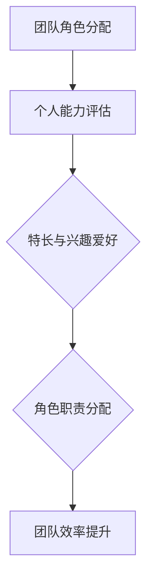

                 

## 《团队角色分配：发挥每个人的长处》

### 关键词
团队角色分配、个人长处、团队效率、协作、领导力、组织行为学

### 摘要
本文旨在探讨团队角色分配的重要性以及如何根据个人长处进行合理分配，以提升团队的整体效率和协作能力。文章将详细分析团队角色的概念、构成要素、常见角色及其分析方法，并提出团队角色分配的原则与方法，辅以实际案例和实践经验，为团队管理者提供实用的指导。

---

## 第1章 引言：团队角色分配的重要性

### 1.1 团队角色分配的概念

**核心概念与联系**：
团队角色分配是指在团队建设过程中，根据每个成员的能力、特长和兴趣爱好，为其分配相应的职责和任务。团队角色不仅包括对工作任务的分配，还包括对团队成员在团队中的位置和责任的界定。

**Mermaid 流程图**：

### 1.2 团队角色分配的目的

**提高团队效率**：通过将任务分配给最适合的人，可以最大化地利用每个人的能力，减少不必要的工作重复，从而提高工作效率。

**增强团队协作**：明确的角色分配有助于团队成员了解彼此的职责，减少误解和冲突，增强协作精神。

**促进个人成长**：团队成员在承担不同角色过程中，能够学习新技能、提高自身素质，实现个人成长。

### 1.3 为什么团队角色分配很重要

**团队成功的基石**：团队角色分配是团队成功的关键，它能够确保每个成员都能在合适的岗位上发挥最大潜力。

**资源优化**：合理的角色分配可以最大化利用团队资源，包括时间、技能和知识。

**团队稳定性**：明确的角色分配有助于建立稳定的团队结构，降低团队变动带来的风险。

---

## 第2章 团队的构成与角色分析

### 2.1 团队的构成要素

**团队成员**：团队成员是团队的核心，他们的能力、经验和态度直接影响团队的表现。

**团队目标**：团队目标是团队存在的目的，是指导团队行动的指南针。

**团队任务**：团队任务是团队在实现目标过程中需要完成的各项工作。

**团队资源**：团队资源包括人力、资金、技术等，是团队完成任务的保障。

### 2.2 常见团队角色分析

**领导者**：领导者是团队的灵魂，负责制定团队目标、规划团队策略和激励团队成员。

**执行者**：执行者是团队中的核心力量，负责完成具体的任务和目标。

**协调者**：协调者是团队的润滑剂，负责解决团队内部的冲突和矛盾，确保团队目标的顺利实现。

**专家**：专家是团队中的技术权威，负责提供专业知识和指导。

**观察者**：观察者是团队的旁观者，负责提供反馈和建议，帮助团队改进。

### 2.3 团队角色分析的方法

**SWOT分析**：通过分析团队的优势、劣势、机会和威胁，确定团队成员的最佳角色。

**贝尔宾团队角色理论**：根据贝尔宾团队角色理论，分析团队成员的性格特点和优势，为每个成员分配合适的角色。

**角色扮演**：通过角色扮演，让团队成员体验不同角色的职责和挑战，从而更好地理解团队角色的重要性。

---

## 第3章 团队角色分配的原则与方法

### 3.1 团队角色分配的原则

**因事设岗**：根据团队任务的性质和复杂程度，合理设置不同的岗位。

**以人为本**：尊重每个团队成员的个人特长和职业发展需求，做到人岗匹配。

**动态调整**：根据团队目标和任务的变化，适时调整团队成员的角色分配。

### 3.2 团队角色分配的方法

**自上而下**：由团队领导者根据团队目标和任务，对成员进行角色分配。

**自下而上**：团队成员根据自己的特长和兴趣，提出角色分配建议，由领导者协调确定。

**混合方法**：结合自上而下和自下而上的方法，综合考虑团队目标和成员特长，进行角色分配。

### 3.3 团队角色分配的注意事项

**确保透明**：团队角色分配的过程应保持透明，让每个成员都清楚自己的职责和任务。

**公平公正**：在角色分配过程中，应公平公正，避免因个人关系而影响角色分配的合理性。

**及时沟通**：在角色分配后，应定期与团队成员沟通，了解他们的工作状况和角色适应度，及时调整。

---

## 第4章 团队角色的适配与优化

### 4.1 团队角色的适配

**适配度评估**：通过问卷调查、绩效评估等方式，评估团队成员的角色适配度。

**角色调整**：根据适配度评估结果，对不适应的角色进行调整，确保每个成员都能在合适的岗位上发挥长处。

### 4.2 团队角色的优化策略

**定期培训**：通过定期培训，提高团队成员的技能和知识，增强角色适配度。

**团队文化建设**：建立积极向上的团队文化，增强团队凝聚力和角色认同感。

**激励机制**：设置合理的激励机制，鼓励团队成员积极承担和适应团队角色。

### 4.3 团队角色优化的实践案例

**案例1**：某互联网公司通过定期评估和调整，成功优化了团队角色分配，提升了团队整体效率。

**案例2**：某科技公司通过文化建设，提高了团队成员的角色认同感和团队凝聚力。

---

## 第5章 团队角色分配的挑战与应对

### 5.1 团队角色分配的常见挑战

**角色冲突**：团队成员在角色分配过程中，可能会出现职责不清、任务重复等问题。

**人员流动**：团队成员的流动可能会导致角色分配的不稳定，影响团队整体表现。

**技能匹配**：团队成员的技能水平和任务需求不匹配，可能导致工作效率降低。

### 5.2 挑战的应对策略

**明确职责**：制定明确的岗位职责说明书，确保团队成员清楚自己的职责范围。

**灵活调整**：根据实际情况，灵活调整团队成员的角色分配，确保团队稳定运行。

**培训提升**：通过培训，提升团队成员的技能水平，提高角色适配度。

### 5.3 挑战的案例分析

**案例1**：某创业公司在快速发展过程中，通过明确职责和灵活调整，成功应对了团队角色分配的挑战。

**案例2**：某大型企业通过建立内部人才库，有效提升了团队成员的技能匹配度，降低了角色冲突。

---

## 第6章 团队角色分配的企业实践

### 6.1 企业团队角色分配的实际案例

**案例1**：某电商公司在高速发展期，通过合理分配团队角色，提高了运营效率，实现了业务快速增长。

**案例2**：某科技公司通过团队角色优化，提升了研发团队的创新能力，推动了产品的迭代更新。

### 6.2 企业团队角色分配的流程

**需求分析**：分析团队目标和任务，明确角色需求。

**角色设定**：根据需求，设定不同团队角色的职责和任务。

**角色分配**：结合团队成员的特长和兴趣，进行角色分配。

**评估与调整**：定期评估角色适配度，根据需要调整角色分配。

### 6.3 企业团队角色分配的效果评估

**绩效评估**：通过绩效评估，了解团队成员的工作表现和角色适配度。

**团队反馈**：收集团队成员的反馈，了解他们对角色分配的满意度和建议。

**效果分析**：综合绩效评估和团队反馈，分析角色分配的效果，为后续优化提供依据。

---

## 第7章 团队角色分配的未来发展趋势

### 7.1 数字化时代团队角色分配的趋势

**数字化工具的应用**：利用数字化工具，如人工智能、大数据分析等，进行角色分配和团队管理。

**远程工作的角色分配**：随着远程工作的普及，如何进行远程团队角色分配成为重要议题。

### 7.2 自动化技术在团队角色分配中的应用

**自动化角色分配系统**：开发自动化角色分配系统，提高角色分配的效率和准确性。

**自动化流程优化**：利用自动化技术，优化团队角色分配的流程和流程管理。

### 7.3 未来团队角色分配的展望

**个性化和智能化**：未来团队角色分配将更加注重个性化和智能化，以满足不同团队和成员的需求。

**跨界融合**：团队角色分配将跨越不同领域和行业，实现跨领域的资源整合和角色互补。

---

## 第8章 总结与展望

### 8.1 本书内容总结

本书系统介绍了团队角色分配的概念、方法、原则以及在实际应用中的挑战与应对策略，为团队管理者提供了实用的指导。

### 8.2 团队角色分配的未来发展方向

**持续优化**：未来团队角色分配将不断优化，以适应快速变化的工作环境和团队需求。

**技术创新**：随着数字化和自动化技术的发展，团队角色分配将更加智能化和个性化。

### 8.3 对读者的建议

**实践与反思**：在团队角色分配的实际操作中，不断实践和反思，以提升团队的整体效率。

**持续学习**：关注行业动态和技术进步，不断提升自身的专业素养和团队管理能力。

---

作者：AI天才研究院/AI Genius Institute & 禅与计算机程序设计艺术 /Zen And The Art of Computer Programming

---

### 完整文章结构概述

本文将以《团队角色分配：发挥每个人的长处》为标题，分为八个主要章节，每个章节都有明确的主题和内容安排，旨在为读者提供关于团队角色分配的全面理解和实践指导。

#### 第1章 引言：团队角色分配的重要性
- **章节概述**：介绍团队角色分配的概念、目的以及重要性。
- **主要内容**：核心概念与联系（团队角色分配的概念与团队目标的联系）、团队角色分配的目的（提高效率、增强协作、促进个人成长）和为什么团队角色分配很重要。

#### 第2章 团队的构成与角色分析
- **章节概述**：分析团队的构成要素和常见角色。
- **主要内容**：团队的构成要素（团队成员、团队目标、团队任务、团队资源）、常见团队角色分析（领导者、执行者、协调者、专家、观察者）和团队角色分析的方法（SWOT分析、贝尔宾团队角色理论、角色扮演）。

#### 第3章 团队角色分配的原则与方法
- **章节概述**：讨论团队角色分配的原则和方法。
- **主要内容**：团队角色分配的原则（因事设岗、以人为本、动态调整）、团队角色分配的方法（自上而下、自下而上、混合方法）和团队角色分配的注意事项。

#### 第4章 团队角色的适配与优化
- **章节概述**：探讨如何使团队角色适应和优化。
- **主要内容**：团队角色的适配（适配度评估、角色调整）、团队角色的优化策略（定期培训、团队文化建设、激励机制）和团队角色优化的实践案例。

#### 第5章 团队角色分配的挑战与应对
- **章节概述**：分析团队角色分配过程中可能遇到的挑战和应对策略。
- **主要内容**：团队角色分配的常见挑战（角色冲突、人员流动、技能匹配）、应对策略（明确职责、灵活调整、培训提升）和挑战的案例分析。

#### 第6章 团队角色分配的企业实践
- **章节概述**：提供企业团队角色分配的实际案例和流程。
- **主要内容**：企业团队角色分配的实际案例（电商公司、科技公司）、角色分配的流程（需求分析、角色设定、角色分配、评估与调整）和效果评估（绩效评估、团队反馈、效果分析）。

#### 第7章 团队角色分配的未来发展趋势
- **章节概述**：展望团队角色分配在数字化时代和自动化技术中的应用和发展方向。
- **主要内容**：数字化时代团队角色分配的趋势（数字化工具应用、远程工作角色分配）、自动化技术在团队角色分配中的应用（自动化角色分配系统、自动化流程优化）和未来团队角色分配的展望（个性化和智能化、跨界融合）。

#### 第8章 总结与展望
- **章节概述**：总结全书内容并对未来进行展望。
- **主要内容**：本书内容总结、团队角色分配的未来发展方向（持续优化、技术创新）和对读者的建议（实践与反思、持续学习）。

通过以上章节的详细论述，本文将为读者提供一个全面、系统的团队角色分配指南，帮助他们在实际工作中更好地发挥每个人的长处，提升团队效率和协作能力。

