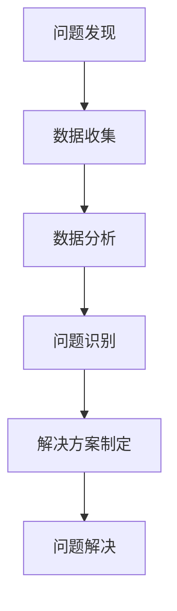

                 

# 《团队问题诊断：及时发现并解决团队问题》

关键词：团队问题诊断、问题识别、团队健康、改进措施、协作效率

摘要：本文将深入探讨团队问题诊断的重要性，以及如何通过科学的方法和工具来及时发现并解决团队问题，提高团队协作效率和整体健康。通过分析团队问题的核心概念和原理，结合实际案例，本文旨在为读者提供实用的诊断和解决策略，帮助团队克服障碍，实现持续成长。

## 设计思路

在设计本文的目录大纲时，我们首先明确了文章的核心主题——团队问题诊断。为了使文章内容更加丰富和实用，我们遵循以下步骤：

1. **核心概念与联系**：通过定义团队问题的概念，分析其分类和影响，展示团队问题诊断的流程和关键节点，使用Mermaid流程图进行可视化。

2. **核心算法原理讲解**：介绍团队问题诊断中可能涉及到的算法原理，如数据收集、数据分析、问题识别等，使用伪代码详细阐述。

3. **数学模型和数学公式**：如果团队问题诊断中涉及数学模型，我们将详细讲解模型原理、公式、参数设置等，使用LaTeX格式确保公式清晰易读。

4. **项目实战**：设计一个实际案例，展示如何诊断团队问题，包括开发环境搭建、源代码实现和解读。

5. **章节结构**：根据上述内容，设计详细的章节结构，确保每个章节都有明确的主题和目标。

### 核心概念与联系

#### 什么是团队问题？

团队问题是指在团队协作过程中，由于沟通、协作、资源分配、任务执行等方面的障碍，导致团队绩效和效率下降的现象。团队问题可能表现为团队成员间的冲突、目标不一致、职责不清、沟通不畅、任务拖延等。

#### 团队问题诊断的重要性

团队问题诊断是解决团队问题的关键步骤。通过及时诊断问题，团队可以：

1. **识别问题根源**：了解导致团队问题的主要原因，从而有针对性地进行改进。
2. **提高协作效率**：消除团队协作中的障碍，提高团队整体执行力。
3. **促进团队成长**：通过持续的问题诊断和改进，推动团队不断成长和进步。

#### 团队问题诊断的流程

团队问题诊断通常包括以下几个步骤：

1. **问题发现**：通过观察、调查、访谈等方法，发现团队存在的问题。
2. **问题分析**：对发现的问题进行深入分析，了解问题的性质、原因和影响。
3. **问题解决**：根据问题分析的结果，制定并实施解决方案，解决团队问题。

#### 团队问题诊断的关键节点

在团队问题诊断过程中，以下关键节点尤为重要：

1. **数据收集**：通过多种渠道收集与团队问题相关的数据，如问卷调查、会议记录、任务进度等。
2. **数据分析**：运用统计学、数据挖掘等方法，对收集到的数据进行分析，识别问题模式和趋势。
3. **问题识别**：基于数据分析结果，识别出团队中存在的具体问题。
4. **解决方案制定**：针对识别出的问题，制定具体的解决方案，并评估其可行性。

#### Mermaid流程图

以下是一个团队问题诊断的Mermaid流程图，展示了问题诊断的主要流程和关键节点：



## 核心算法原理讲解

#### 数据收集

数据收集是团队问题诊断的第一步，其核心是获取与团队问题相关的信息。以下是数据收集的伪代码：

```plaintext
function 数据收集() {
    // 初始化数据收集工具
    收集工具 = 初始化收集工具()

    // 收集问卷调查数据
    问卷数据 = 收集问卷数据(团队成员)

    // 收集会议记录数据
    会议记录数据 = 收集会议记录数据(团队会议)

    // 收集任务进度数据
    任务进度数据 = 收集任务进度数据(团队任务)

    // 返回收集到的数据
    return 问卷数据, 会议记录数据, 任务进度数据
}
```

#### 数据分析

数据分析是对收集到的数据进行分析和处理，以识别问题模式和趋势。以下是数据分析的伪代码：

```plaintext
function 数据分析(数据集) {
    // 数据预处理
    预处理数据 = 预处理数据集(数据集)

    // 应用统计学方法
    统计结果 = 应用统计学方法(预处理数据)

    // 应用数据挖掘方法
    挖掘结果 = 应用数据挖掘方法(预处理数据)

    // 返回分析结果
    return 统计结果, 挖掘结果
}
```

#### 问题识别

问题识别是基于数据分析结果，识别出团队中存在的具体问题。以下是问题识别的伪代码：

```plaintext
function 问题识别(分析结果) {
    // 初始化问题列表
    问题列表 = 初始化问题列表()

    // 识别团队问题
    问题列表 = 识别团队问题(分析结果)

    // 返回问题列表
    return 问题列表
}
```

## 数学模型和数学公式

#### 数学模型

在团队问题诊断中，我们可能会使用一些数学模型来辅助分析。以下是一个简单的数学模型——线性回归模型：

$$
y = wx + b
$$

其中，$y$ 是因变量，$x$ 是自变量，$w$ 是权重，$b$ 是偏置。

#### 参数设置

在设置参数时，我们需要考虑以下因素：

1. **样本大小**：样本大小应足够大，以确保模型的准确性。
2. **特征选择**：选择与团队问题相关的特征，以减少模型的复杂性。
3. **正则化**：为了防止过拟合，可以采用L1或L2正则化。

#### 举例说明

假设我们有一个关于团队效率的数据集，其中包含两个特征：团队成员数量($x_1$)和团队任务数量($x_2$)。我们使用线性回归模型来预测团队效率($y$)。

$$
y = wx_1 + bx_2 + b
$$

通过训练数据集，我们得到如下参数：

$$
w = 0.5, b = 0.3, b = 0.2
$$

#### 代码实现

以下是使用Python实现线性回归模型的示例代码：

```python
import numpy as np
from sklearn.linear_model import LinearRegression

# 训练数据集
X = np.array([[1, 2], [2, 3], [3, 4]])
y = np.array([1, 2, 3])

# 初始化线性回归模型
model = LinearRegression()

# 训练模型
model.fit(X, y)

# 预测
predictions = model.predict(X)

# 输出参数
print("权重：", model.coef_)
print("偏置：", model.intercept_)
```

## 项目实战

#### 开发环境搭建

为了进行团队问题诊断，我们需要搭建一个合适的技术环境。以下是开发环境搭建的步骤：

1. **选择开发工具**：选择合适的开发工具，如Python、R或MATLAB等。
2. **安装依赖库**：安装用于数据收集、数据分析和可视化等操作的依赖库，如NumPy、Pandas、Scikit-learn等。
3. **搭建数据存储**：选择合适的数据库或数据仓库，用于存储收集到的数据。

#### 源代码实现

以下是一个简单的团队问题诊断项目，包括数据收集、数据分析和问题识别的源代码实现：

```python
import pandas as pd
from sklearn.linear_model import LinearRegression

# 数据收集
def 数据收集():
    # 收集问卷调查数据
    问卷数据 = pd.read_csv("问卷调查数据.csv")

    # 收集会议记录数据
    会议记录数据 = pd.read_csv("会议记录数据.csv")

    # 收集任务进度数据
    任务进度数据 = pd.read_csv("任务进度数据.csv")

    return 问卷数据, 会议记录数据, 任务进度数据

# 数据分析
def 数据分析(数据集):
    # 数据预处理
    预处理数据 = 预处理数据集(数据集)

    # 应用统计学方法
    统计结果 = 应用统计学方法(预处理数据)

    # 应用数据挖掘方法
    挖掘结果 = 应用数据挖掘方法(预处理数据)

    return 统计结果, 挖掘结果

# 问题识别
def 问题识别(分析结果):
    # 初始化问题列表
    问题列表 = 初始化问题列表()

    # 识别团队问题
    问题列表 = 识别团队问题(分析结果)

    return 问题列表

# 主函数
def 主函数():
    # 数据收集
    问卷数据, 会议记录数据, 任务进度数据 = 数据收集()

    # 数据分析
    统计结果, 挖掘结果 = 数据分析(问卷数据)

    # 问题识别
    问题列表 = 问题识别(统计结果)

    # 输出结果
    print("问题列表：", 问题列表)

# 运行主函数
主函数()
```

#### 代码解读与分析

在上面的代码中，我们首先定义了三个函数：`数据收集`、`数据分析`和`问题识别`。这些函数分别负责数据收集、数据分析和问题识别的任务。

1. **数据收集**：通过读取CSV文件，收集问卷调查数据、会议记录数据和任务进度数据。
2. **数据分析**：对收集到的数据进行预处理，然后应用统计学方法进行数据分析，并返回分析结果。
3. **问题识别**：根据分析结果，识别出团队中存在的问题，并返回问题列表。

#### 实际案例分析和详细讲解剖析

为了更好地理解团队问题诊断的过程，我们来看一个实际案例。

**案例**：某公司的开发团队在项目执行过程中，发现团队成员之间的沟通不畅，导致任务进度缓慢。团队领导希望通过数据分析和问题诊断，找出问题的根源，并提出解决方案。

1. **数据收集**：团队领导通过问卷调查、会议记录和任务进度数据，收集了以下信息：

   - 问卷调查数据：包括团队成员对团队沟通的评价、对项目进度的满意度等。
   - 会议记录数据：包括团队会议的议题、讨论内容和决策结果等。
   - 任务进度数据：包括各个任务的完成情况、延迟原因等。

2. **数据分析**：对收集到的数据进行分析，发现以下问题：

   - 沟通不畅：团队成员之间的沟通频率低，信息传递不及时。
   - 任务分配不合理：部分成员任务过重，导致工作压力过大。
   - 目标不一致：团队成员对项目目标的理解存在差异，导致执行效率低下。

3. **问题识别**：根据数据分析结果，团队领导识别出以下问题：

   - 缺乏有效的沟通机制：团队成员之间的沟通渠道不畅。
   - 任务分配不合理：任务分配不均衡，部分成员工作负担过重。
   - 目标不一致：团队成员对项目目标的认知不一致，导致执行效率降低。

4. **解决方案制定**：针对识别出的问题，团队领导制定了以下解决方案：

   - 建立定期沟通机制：每周举行一次团队会议，讨论项目进展、沟通问题和解决方案。
   - 调整任务分配：根据团队成员的能力和兴趣，重新分配任务，确保工作负担均衡。
   - 统一项目目标：明确项目目标，确保团队成员对目标有统一的理解。

5. **问题解决**：团队领导在执行解决方案后，对团队进行了持续监控和评估。通过沟通机制的建立、任务分配的调整和项目目标的统一，团队协作效率显著提高，项目进度恢复正常。

#### 项目小结

通过本案例，我们可以看到团队问题诊断的过程和关键步骤。在实际应用中，团队问题诊断需要结合具体情况，灵活运用数据分析方法和工具，从而实现问题的有效识别和解决。

### 最佳实践 tips

1. **定期进行团队问题诊断**：团队问题诊断不应仅限于问题出现时，而应定期进行，以保持团队的健康和效率。

2. **数据驱动**：在团队问题诊断中，数据是最有力的支持。确保收集的数据全面、准确，并利用数据分析方法进行深入挖掘。

3. **透明沟通**：建立透明、开放的沟通渠道，鼓励团队成员表达意见和建议，有助于及时发现和解决问题。

4. **持续改进**：团队问题诊断不应止步于问题解决，而应作为持续改进的过程，推动团队不断进步。

### 小结

团队问题诊断是提高团队协作效率和整体健康的关键步骤。通过科学的方法和工具，团队可以及时发现并解决存在的问题，实现持续成长。本文介绍了团队问题的核心概念、诊断流程、核心算法原理、数学模型、项目实战，并提供了最佳实践 tips。希望读者能从中受益，提升团队问题诊断的能力。

### 注意事项

1. **数据安全**：在团队问题诊断过程中，要确保数据的隐私和安全，避免泄露敏感信息。
2. **平衡分析**：在数据分析时，要注意平衡定量分析和定性分析，避免过分依赖某一种方法。
3. **实际应用**：在项目实战中，要确保所采用的工具和方法适合实际情况，并进行充分的测试和验证。

### 拓展阅读

1. **《团队协作的艺术》**：作者通过案例分析，深入探讨了团队协作的原理和实践。
2. **《数据科学实战》**：本书详细介绍了数据科学的方法和技术，适用于团队问题诊断中的数据分析。
3. **《敏捷开发实践指南》**：敏捷开发强调持续反馈和改进，对团队问题诊断有很好的启示作用。

作者：AI天才研究院/AI Genius Institute & 禅与计算机程序设计艺术 /Zen And The Art of Computer Programming

