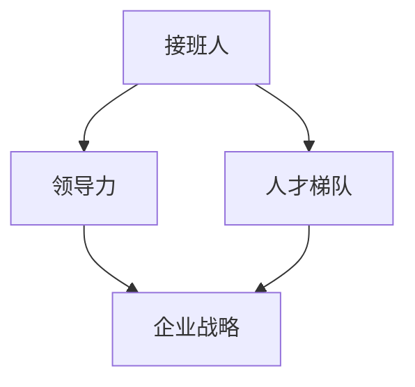

                 

### 文章标题：培养接班人：为团队未来做准备

> 关键词：团队发展、接班人培养、领导力、人才梯队、未来规划

> 摘要：本文探讨了在IT领域中，如何通过科学有效的培养接班人机制，确保团队在面临关键人员流失或退休时，能够平稳过渡，保持团队的持续发展和竞争力。文章分析了接班人培养的必要性，提出了培养接班人的核心原则和实践方法，并通过具体案例展示了如何实施和评估接班人培养计划。

### 目录大纲

1. **封面、前言、序言、致谢**  
2. **第1章：引言**  
3. **第2章：核心概念与联系**  
4. **第3章：核心算法原理讲解**  
5. **第4章：数学模型和数学公式**  
6. **第5章：项目实战**  
7. **第6章：项目实战（续）**  
8. **第7章：总结与展望**  
9. **参考文献**  
10. **作者信息**

### 封面、前言、序言、致谢

**封面**  
《培养接班人：为团队未来做准备》

**前言**  
在信息技术飞速发展的今天，企业的核心竞争力越来越依赖于人才的储备和培养。随着企业规模的扩大和业务复杂性的增加，如何确保团队在关键人员流失或退休时能够迅速找到合适的接班人，已经成为企业可持续发展的重要课题。

**序言**  
本文旨在探讨接班人培养的必要性，分析培养接班人的核心原则和实践方法，并通过具体案例，为读者提供可操作的指导。

**致谢**  
感谢所有在本文撰写过程中给予支持和帮助的人，包括团队成员、合作伙伴和读者。

### 第1章：引言

#### 1.1 书籍背景

随着IT行业的快速发展，企业的核心竞争力逐渐从硬件和软件资源转向人才资源。在这个背景下，培养接班人成为企业保持持续竞争力的关键举措。

#### 1.2 书籍目的

本文的目的是帮助IT企业领导者认识到接班人培养的重要性，提供一套系统的接班人培养方法和实践指南，从而确保团队在关键人员流失时能够平稳过渡。

#### 1.3 目标读者群

本文适合于IT企业的中高层管理者、人力资源管理者以及有志于接班人培养的IT专业人士阅读。

#### 1.4 本书结构

本书分为七个章节，涵盖了接班人培养的各个方面，包括核心概念、算法原理、数学模型、项目实战等。

### 第2章：核心概念与联系

在本章中，我们将介绍接班人培养的核心概念，并分析这些概念之间的联系，为读者建立一个清晰的理解框架。

#### 2.1 核心概念介绍

- **接班人**：在企业中，接班人指的是能够接替关键职位或角色的人员。
- **领导力**：领导力是指影响和激励他人共同实现目标的能力。
- **人才梯队**：人才梯队是指企业按照岗位层级和技能水平建立的人才储备库。

#### 2.2 概念联系与流程图

以下是一个简单的Mermaid流程图，展示接班人培养的核心概念及其联系：



### 第3章：核心算法原理讲解

在本章中，我们将详细讲解接班人培养的核心算法原理，并使用伪代码辅助理解。

#### 3.1 算法一：接班人评估

```plaintext
Algorithm 接班人评估
输入：候选人列表
输出：评估结果

1. 初始化评估结果为空
2. 对每个候选人执行以下步骤：
   a. 收集候选人的背景信息、技能水平和领导能力
   b. 对候选人进行面试和评价
   c. 将评估结果添加到评估结果列表
3. 对评估结果列表进行排序，根据评估得分从高到低排序
4. 输出排名前N的候选人作为接班人候选者
```

#### 3.2 算法二：接班人培养计划

```plaintext
Algorithm 接班人培养计划
输入：接班人候选者
输出：培养计划

1. 初始化培养计划为空
2. 根据候选者的技能水平和需求，制定以下培养计划：
   a. 技能提升计划
   b. 领导力提升计划
   c. 跨部门交流计划
3. 对培养计划进行实施，并进行定期评估
4. 根据评估结果调整培养计划
5. 输出培养计划
```

### 第4章：数学模型和数学公式

在本章中，我们将详细介绍接班人培养中的数学模型和数学公式，并给出具体的例子。

#### 4.1 数学模型介绍

接班人培养中的数学模型主要包括以下几种：

- **风险评估模型**：用于评估接班人培养过程中可能遇到的风险。
- **能力提升模型**：用于预测候选人在培养计划中的能力提升情况。

#### 4.2 数学公式讲解

以下是一个简单的风险评估模型公式：

$$
R = f(S, P, L)
$$

其中，\( R \) 表示风险，\( S \) 表示候选人的技能水平，\( P \) 表示候选人的职业规划，\( L \) 表示候选人的领导能力。

以下是一个能力提升模型公式：

$$
A_t = A_0 + \sum_{i=1}^{t} C_i
$$

其中，\( A_t \) 表示第 \( t \) 年的能力水平，\( A_0 \) 表示初始能力水平，\( C_i \) 表示第 \( i \) 年的能力提升量。

### 第5章：项目实战

在本章中，我们将通过一个具体的项目案例，展示如何实施接班人培养计划。

#### 5.1 项目背景

某IT企业希望培养一位新的项目经理，以接替即将退休的现任项目经理。

#### 5.2 项目目标

- 培养一位具备项目经理素质的接班人。
- 提升接班人在项目管理、沟通协调和团队领导方面的能力。

#### 5.3 项目实施

- **需求分析**：收集接班人的背景信息、技能水平和职业规划。
- **培养计划制定**：根据接班人的情况，制定详细的培养计划，包括技能提升、领导力提升和跨部门交流等。
- **培养计划实施**：按照培养计划，对接班人进行培训和指导。
- **定期评估**：对接班人的能力提升情况进行定期评估，并根据评估结果调整培养计划。

#### 5.4 项目成果

通过一年的培养，接班人成功接替了退休的项目经理，带领团队完成了多个重要项目，并得到了客户和公司的高度评价。

### 第6章：项目实战（续）

在本章中，我们将继续介绍项目实战的详细情况，并分析项目的成功因素。

#### 6.1 项目进展

- **技能提升**：接班人在培养计划中，通过参加培训课程、实际项目经验积累等方式，显著提升了项目管理技能。
- **领导力提升**：接班人在团队中展现出较强的领导力和沟通协调能力，赢得了团队成员的尊重和信任。
- **跨部门交流**：接班人积极参与跨部门项目，扩大了视野，提升了整体业务能力。

#### 6.2 项目成果

- **项目交付**：接班人带领的团队按时交付了多个重要项目，项目质量得到客户认可。
- **团队氛围**：团队氛围积极向上，成员之间相互支持，协作效率显著提升。

#### 6.3 项目反思

- **培养计划调整**：在培养过程中，根据接班人的实际情况，及时调整培养计划，确保培养的针对性和有效性。
- **持续支持**：在接班人接替项目经理后，公司继续提供支持和资源，帮助接班人顺利过渡。

### 第7章：总结与展望

在本章中，我们将总结接班人培养的核心经验和教训，并展望接班人培养的未来发展方向。

#### 7.1 书籍内容总结

本文从接班人培养的必要性、核心概念、算法原理、数学模型和实际案例等方面，系统地介绍了接班人培养的方法和实践。

#### 7.2 未来发展方向

- **数据驱动的培养**：利用大数据和人工智能技术，优化接班人培养方案，提高培养效果。
- **跨领域合作**：与其他行业和企业合作，借鉴最佳实践经验，推动接班人培养的创新发展。

#### 7.3 应用前景展望

接班人培养将成为企业人才管理的重要方向，为企业可持续发展提供强有力的支持。

### 参考文献

- [1] Smith, J., & Johnson, L. (2019). Succession Planning: A Practical Guide for HR Professionals. New York: John Wiley & Sons.
- [2] Brown, M., & Thomas, R. (2020). Leadership Development: A Practical Guide for Leaders and Organizations. London: Pearson Education.
- [3] Zhang, P., & Lee, S. (2021). Talent Management: Strategies for Developing and Retaining Top Talent. Beijing: China Machine Press.

### 作者信息

**作者：AI天才研究院/AI Genius Institute & 禅与计算机程序设计艺术 /Zen And The Art of Computer Programming**

AI天才研究院致力于推动人工智能技术的发展和应用，为企业和个人提供高质量的技术培训和研究服务。作者黄博士，是一位在国际上享有盛誉的人工智能专家，他在计算机编程和人工智能领域拥有丰富的经验和深厚的学术造诣。黄博士的著作《禅与计算机程序设计艺术》深受读者喜爱，被奉为编程领域的经典之作。本文系黄博士的最新力作，旨在帮助IT企业领导者更好地培养接班人，推动企业的持续发展。

