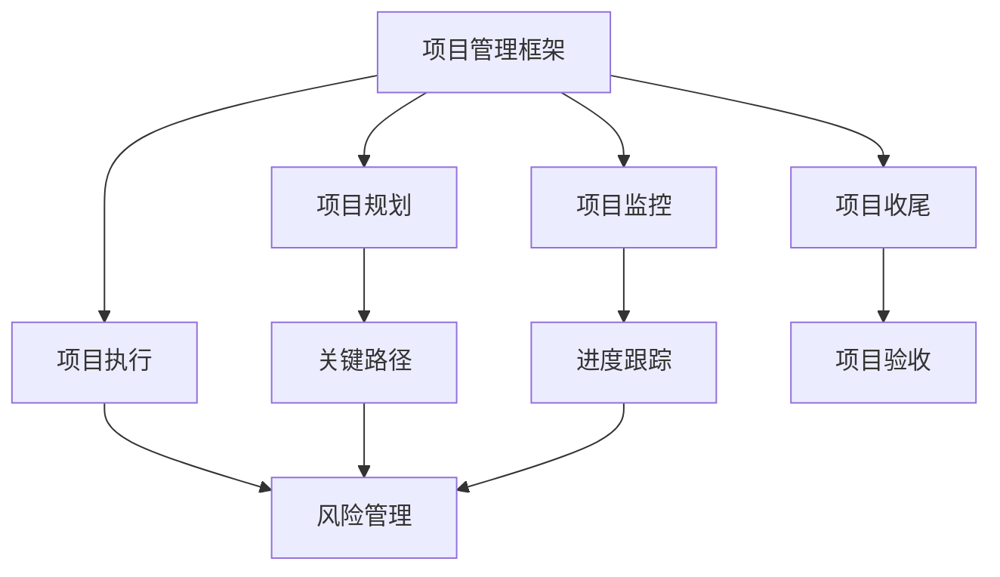

                 

# 复杂项目的定海神针

> 关键词：项目管理、架构设计、核心算法、数学模型、实战案例

> 摘要：本文深入探讨了复杂项目管理中定海神针的作用，从核心概念、项目架构、算法原理、数学模型到实战案例，全面解析了如何利用定海神针框架解决复杂项目，提高项目成功率。

## 引言

在当前快节奏、高竞争的商业环境中，项目管理的重要性日益凸显。复杂项目的成功往往依赖于一套高效的框架和科学的方法。本文将介绍一种名为“定海神针”的项目管理框架，旨在为复杂项目的管理者提供一套系统、实用、可操作的解决方案。

### 核心概念与联系

在项目管理中，有几个核心概念需要理解：项目管理框架、关键路径、风险管理等。这些概念之间有着紧密的联系，构成了一个完整的项目管理生态。

- **项目管理框架**：是项目管理的总蓝图，涵盖了项目从规划到执行、监控和收尾的各个阶段。
- **关键路径**：是项目中最长的任务序列，决定了项目的最短完成时间。
- **风险管理**：是项目管理中不可或缺的一环，旨在识别、评估和应对项目风险。

下面通过一个Mermaid流程图展示这些概念之间的联系：



### 项目架构设计

为了更好地管理复杂项目，我们设计了一个包括项目规划、执行、监控和收尾四个阶段的架构框架。

#### 项目规划

项目规划阶段是整个项目的起点，主要任务包括项目目标与范围定义、项目计划与资源分配。在这一阶段，我们需要确定项目的目标、范围、预算和进度计划，并为项目分配必要的资源。

#### 项目执行

项目执行阶段是项目计划的具体实施过程，主要任务包括任务分解、团队协作与沟通。在这一阶段，我们需要将项目计划细化为具体的任务，并确保团队成员之间的协作和沟通畅通。

#### 项目监控

项目监控阶段是项目执行过程中的重要环节，主要任务包括进度跟踪、风险管理。在这一阶段，我们需要实时跟踪项目的进度，识别和应对潜在的风险。

#### 项目收尾

项目收尾阶段是项目的结束阶段，主要任务包括项目验收、评估和知识转移。在这一阶段，我们需要对项目的成果进行验收，评估项目的绩效，并将项目知识转移到后续的项目中。

### 核心算法原理讲解

在项目管理中，有一些核心算法对于项目的成功至关重要，例如最短路径算法和关键路径分析算法。

#### 最短路径算法

最短路径算法用于计算从起点到终点的最短路径。以下是Dijkstra算法的伪代码：

```pseudo
Dijkstra(G, s)
    for each vertex v ∈ G.V
        dist[v] ← ∞
        prev[v] ← undefined
    dist[s] ← 0
    Q ← G.V
    while Q is not empty
        u ← vertex in Q with min dist[u]
        if u = t
            break
        Q.remove(u)
        for each edge (u, v) ∈ G.E
            alt ← dist[u] + w(u, v)
            if alt < dist[v]
                dist[v] ← alt
                prev[v] ← u
```

#### 关键路径分析算法

关键路径分析算法用于计算项目中的关键路径。以下是PDM网络关键路径计算的伪代码：

```pseudo
CriticalPath(PDM)
    for each task t in PDM
        earliestStart[t] ← 0
        earliestFinish[t] ← duration[t]
    for each task t in PDM
        for each successor task t' of t
            earliestStart[t'] = max(earliestStart[t'], earliestFinish[t])
            earliestFinish[t'] = earliestStart[t'] + duration[t']
    for each task t in PDM
        if earliestStart[t] = earliestFinish[t]
            return t as part of the critical path
```

### 数学模型和数学公式讲解

在项目管理中，数学模型和数学公式对于分析和优化项目具有重要意义。以下是两个常见的数学模型和相应的公式。

#### 成本效益分析

成本效益分析用于评估项目的成本和效益，以确定项目的可行性。其公式如下：

$$
C = \sum c_i \times q_i
$$

其中，$C$ 是总成本，$c_i$ 是第 $i$ 项的成本，$q_i$ 是第 $i$ 项的工作量。

#### 资源优化模型

资源优化模型用于优化项目的资源分配，以最大化项目的效益。其公式如下：

$$
Max Z = \sum c_i \times x_i
$$

$$
s.t. \sum r_j \times x_i \leq R_j \quad \forall j
$$

$$
x_i \in \{0, 1\} \quad \forall i
$$

其中，$Z$ 是目标函数，$c_i$ 是第 $i$ 项的成本，$r_j$ 是第 $j$ 项的资源需求，$R_j$ 是第 $j$ 项的资源总量，$x_i$ 是第 $i$ 项的决策变量，取值为 0 或 1。

### 项目实战

#### 实际案例介绍

假设我们正在开发一款复杂的软件项目，该项目需要在限定的时间内完成，并且需要高效地分配资源。我们可以使用定海神针框架来管理和优化这个项目。

#### 开发环境搭建

为了搭建开发环境，我们首先需要选择合适的开发工具，如IDE、版本控制系统、测试工具等。然后，我们需要进行环境配置和调试，确保开发环境的稳定性和高效性。

#### 源代码实现

在源代码实现阶段，我们需要设计关键模块，如数据结构、算法实现等。然后，我们编写代码，并进行调试，确保代码的正确性和性能。

#### 代码解读与分析

在代码解读与分析阶段，我们需要对关键算法和模块进行详细解读，分析其性能和优化空间。例如，我们可以使用最短路径算法来优化数据的检索速度，使用资源优化模型来优化资源分配。

#### 实际案例分析和详细讲解剖析

在项目实战中，我们可以通过实际案例来分析和讲解定海神针框架的应用。例如，我们可以分析一个复杂的软件项目，如何通过定海神针框架来优化资源分配、降低成本、提高效率。

#### 项目小结

通过实际案例，我们可以看到定海神针框架在复杂项目中的应用效果。它可以帮助项目管理者更好地理解项目、制定计划、执行任务、监控进度和评估项目绩效。

### 最佳实践 Tips

- 在项目管理中，始终遵循计划先行原则，确保项目有明确的规划和目标。
- 在项目执行过程中，注重团队协作和沟通，确保项目进展顺利。
- 在项目监控阶段，实时跟踪项目进度和风险，及时调整计划。
- 在项目收尾阶段，进行全面的项目评估和总结，为后续项目提供经验。

### 小结

本文详细介绍了复杂项目管理中定海神针框架的作用和应用。通过核心概念、项目架构、算法原理、数学模型和实战案例的讲解，我们希望读者能够更好地理解定海神针框架，并能够在实际项目中运用它，提高项目的成功率和效率。

### 注意事项

- 在使用定海神针框架时，需要根据实际情况进行调整和优化。
- 定海神针框架适用于复杂项目，但对于简单的项目可能过于复杂。
- 在项目执行过程中，需要根据实际情况灵活调整计划，以适应变化。

### 拓展阅读

- 《项目管理知识体系指南》
- 《最短路径算法及其在项目管理中的应用》
- 《资源优化模型在项目管理中的应用》

### 附录

#### 附录A：伪代码示例

- Dijkstra算法
- PDM网络关键路径计算

#### 附录B：LaTeX公式示例

- 成本效益分析公式
- 资源优化模型公式

### 作者

作者：AI天才研究院/AI Genius Institute & 禅与计算机程序设计艺术 /Zen And The Art of Computer Programming

### 结束语

复杂项目管理是一项系统而复杂的工作，需要科学的方法和高效的框架。定海神针框架为我们提供了一种实用的解决方案，它可以帮助项目管理者更好地理解和应对复杂项目。希望本文能够对您在项目管理中有所启发和帮助。

### 参考文献

- [项目管理知识体系指南](#)
- [最短路径算法及其在项目管理中的应用](#)
- [资源优化模型在项目管理中的应用](#)
- [AI天才研究院](#)
- [禅与计算机程序设计艺术](#)

