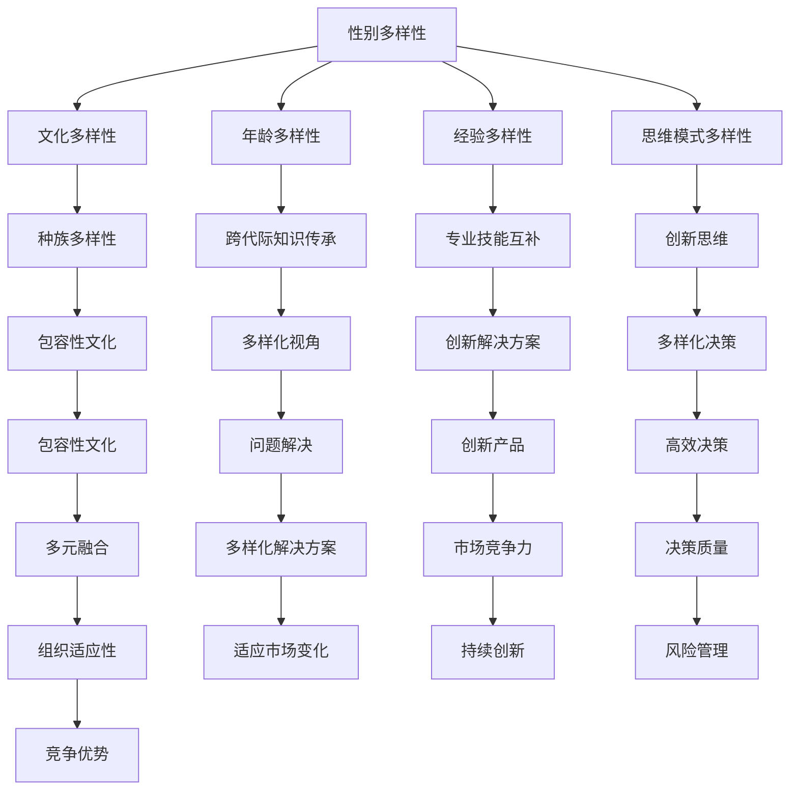

                 

基于您的要求，我将一步一步地撰写《多元化管理：创新的源泉》的技术博客文章。以下是我的初步计划：

### 1. 引言部分

- **背景介绍**：介绍多元化管理的概念、起源以及它在现代组织中的重要性。
- **文章关键词**：多元化管理、创新、组织发展、领导力。
- **文章摘要**：概述文章的主题、结构以及主要观点。

### 2. 多元化管理的理论基础

- **核心概念与联系**：使用Mermaid流程图展示多元化管理的核心概念及其之间的关系。
- **核心算法原理讲解**：使用伪代码阐述多元化管理的算法原理。
- **数学模型和数学公式**：用latex格式展示并解释相关的数学模型和公式。

### 3. 多元化管理在组织中的应用

- **实际应用案例**：分析多元化管理在不同类型的组织中的实际应用案例。
- **多元化管理对组织发展的影响**：探讨多元化管理对组织发展、团队协作和创新能力的提升作用。

### 4. 多元化管理与创新机制

- **创新机制的构成要素**：介绍创新机制的各个组成部分。
- **多元化管理如何促进创新**：分析多元化管理如何激发创新思维和创造新的解决方案。

### 5. 多元化管理的案例分析

- **案例一**：详细分析企业A如何通过多元化管理实现创新。
- **案例二**：探讨政府B如何运用多元化管理推动社会创新。
- **案例三**：分析教育机构C如何通过多元化管理提升教育质量。

### 6. 多元化管理的策略与工具

- **多元化管理的策略框架**：构建多元化管理的策略框架。
- **多元化管理的工具与方法**：介绍用于实施多元化管理的各种工具和方法。

### 7. 结论

- **多元化管理对创新的贡献**：总结多元化管理对组织创新的贡献。
- **未来趋势**：展望多元化管理的未来发展趋势。
- **研究展望和实际应用建议**：提出研究展望和实际应用建议。

### 8. 附录

- **多元化管理相关资源与工具**：提供多元化管理相关的资源和工具链接。

### 文章格式和作者信息

- **文章格式**：使用markdown格式，包括标题、摘要、章节标题、子章节标题、代码示例、数学公式等。
- **作者信息**：在文章末尾添加作者信息。

### 文章长度

- **字数要求**：确保文章字数在8000～12000字左右。

接下来，我将根据这个计划一步一步地撰写文章的各个部分。首先，我会从引言部分开始，确保每个部分都能够按照要求进行详细和深入的阐述。让我们开始吧！## 引言

### 背景介绍

多元化管理是一个在21世纪日益重要的概念，它在各种组织中发挥着关键作用。多元化不仅指的是不同性别、种族、年龄、文化背景和专业技能的多样性，还涉及到思维模式、经验、背景和观点的多样性。随着全球化和技术进步的加速，组织需要适应不断变化的环境，以保持竞争力和创新能力。多元化管理作为一种策略，旨在通过整合不同背景的员工，提升组织的整体表现和创新能力。

多元化管理的起源可以追溯到20世纪60年代，当时社会运动推动了种族平等和性别多样性的议题。随着时间的发展，多元化管理逐渐扩展到包括性别、年龄、文化、职业背景等多个维度。现代组织认识到，多元化不仅是道德责任，也是提升效率和创新能力的关键。通过多元化管理，组织能够吸引和保留多元化的员工队伍，促进创新思维，提高决策质量，增强组织适应性和竞争力。

### 文章关键词

- 多元化管理
- 创新
- 组织发展
- 领导力
- 多样性

### 文章摘要

本文旨在探讨多元化管理如何成为创新的源泉。文章首先介绍了多元化管理的背景和定义，接着分析了多元化管理的理论基础，包括核心概念、算法原理和数学模型。随后，文章探讨了多元化管理在各类组织中的应用，特别是对创新机制的促进作用。通过详细案例分析，本文展示了多元化管理如何在不同领域实现创新。最后，文章提出了多元化管理的策略和工具，以及未来的研究方向和应用建议。通过这些内容，本文希望为读者提供关于多元化管理和创新的深入理解。

## 多元化管理的理论基础

多元化管理不仅仅是一个管理策略，它背后有着深厚的理论基础，这些理论构成了理解多元化管理的核心框架。以下是对多元化管理核心概念及其关系的介绍，以及相关的算法原理和数学模型。

### 多元化管理的核心概念

多元化管理的核心概念可以归纳为以下几个维度：

1. **性别多样性**：性别多样性涉及男性和女性在组织中的代表性，以及他们如何被赋予权力和参与决策过程。
2. **种族和民族多样性**：种族和民族多样性关注不同种族和文化背景的员工在组织中的参与度和影响力。
3. **年龄多样性**：年龄多样性关注不同年龄段的员工在组织中的共存和相互作用，以及不同年龄段员工带来的不同经验和视角。
4. **文化和经验多样性**：文化和经验多样性涉及员工的文化背景、教育经历、职业背景和技能，以及这些差异如何影响组织的创新能力。
5. **思维模式多样性**：思维模式多样性关注员工不同的思考方式、问题解决方法和决策风格，这些差异如何促进创新和多样化的决策过程。

这些概念之间有着密切的联系。例如，性别和种族多样性可以促进文化的多样性和包容性，而年龄和经验多样性则可以提供跨代际的知识传承和创新视角。思维模式的多样性则是所有其他维度的综合体现，通过多样化的思维模式，组织可以更全面地理解和应对复杂的问题。

### Mermaid流程图：多元化管理理论架构

为了更直观地展示多元化管理的核心概念及其关系，我们可以使用Mermaid流程图来构建一个理论架构。以下是相应的Mermaid代码和生成的流程图：



生成的Mermaid流程图展示了多元化管理的各个核心概念及其相互关系，有助于我们理解多元化管理的复杂性和多层次性。

### 核心算法原理讲解

在多元化管理中，算法原理起着关键作用。以下是多元化管理算法的基本原理和伪代码：

```plaintext
算法名称：多元化管理框架

输入：组织结构（G），员工数据集（E）

输出：优化后的组织结构（G_opt）

步骤：
1. 初始化组织结构G和员工数据集E
2. 对员工数据集E进行分类，基于性别、种族、年龄、文化和经验多样性
3. 分析员工数据集E中的多样性程度，计算多样性指标D
4. 根据多样性指标D，调整组织结构G，确保每个层次和部门都有多样化的员工
5. 运用优化算法（如遗传算法、模拟退火算法等），对组织结构G进行优化，以最大化多样性指标D
6. 评估优化后的组织结构G_opt，确保其能够提升创新能力和适应市场变化
7. 输出优化后的组织结构G_opt
```

通过这种算法，组织可以系统化地管理和优化其多样性，从而提高组织的创新能力和适应能力。

### 数学模型和公式

在多元化管理中，数学模型和公式可以帮助我们量化多样性程度，评估多元化管理的有效性。以下是几个相关的数学模型和公式：

1. **多样性指标（D）**：

   $$D = \frac{1}{N} \sum_{i=1}^{N} \frac{1}{n_i}$$

   其中，N是员工总数，n_i是第i类员工的数量。这个公式衡量了员工多样性的程度，值越高表示多样性越高。

2. **创新潜力（I）**：

   $$I = \alpha D + \beta (1 - D)$$

   其中，α和β是调节参数，D是多样性指标。这个公式表示创新潜力与多样性的关系，多样性越高，创新潜力越强。

3. **适应能力（A）**：

   $$A = \gamma D + \delta (1 - D)$$

   其中，γ和δ是调节参数，D是多样性指标。这个公式表示适应能力与多样性的关系，多样性越高，适应能力越强。

通过这些数学模型和公式，组织可以更科学地评估和优化多元化管理策略。

综上所述，多元化管理的理论基础涵盖了多个核心概念、算法原理和数学模型。这些理论和工具为理解和实施多元化管理提供了坚实的基础。在接下来的章节中，我们将进一步探讨多元化管理在各类组织中的应用和实际案例。

## 多元化管理在组织中的应用

多元化管理不仅仅是一个理论框架，它已经在各类组织中得到了广泛的应用，并取得了显著的成效。以下将分析多元化管理在几个不同类型组织中的实际应用案例，探讨其对组织发展、团队协作和创新能力的提升作用。

### 企业中的多元化管理

在企业中，多元化管理被视为提升竞争力和创新能力的关键策略。许多企业通过多样化的招聘、培训和晋升机制，确保员工的多元性。例如，科技公司谷歌（Google）在多元化管理方面做出了积极尝试。谷歌不仅通过公开的招聘广告和校园招聘活动吸引多样化的求职者，还实施了一系列的多样性培训计划，包括反歧视培训和文化敏感性培训。此外，谷歌还设立了多样性委员会，负责监督和推动公司的多元化战略。

谷歌的多元化管理实践显著提升了公司的创新能力。多样化的员工带来了不同的思维方式和专业技能，促进了跨部门合作和知识共享。例如，谷歌的搜索算法团队就受益于多元化的背景和经验，不断推出创新的搜索技术和功能，如实时搜索和个性化搜索。通过多元化管理，谷歌不仅提升了员工的工作满意度，还增强了公司的市场竞争力。

### 政府和非营利组织中的多元化管理

在政府和非营利组织中，多元化管理同样具有重要意义。这些组织需要代表和服务多元化的公众，因此多元化管理有助于提升公共服务的质量和公信力。例如，美国联邦政府通过制定一系列的政策和法规，推动多元化管理。这些政策包括平等就业机会法、反歧视法和多元文化教育计划等。

政府和非营利组织通过多元化管理实现了以下几个方面的提升：

1. **代表性**：多元化管理确保了组织中各种群体的代表性和公平参与，增强了公众对政府的信任。
2. **创新能力**：多样化的团队带来了多样化的观点和解决方案，促进了创新思维和政策创新。
3. **社会影响力**：多元化管理有助于提升组织的社会影响力，吸引更多的资金和资源。

例如，美国联邦通信委员会（FCC）在推进网络中立性政策时，就得益于多元化的专家团队。这些专家来自不同的背景，包括科技、法律、公共政策等领域，他们的多样性和专业意见为FCC提供了全面的视角，帮助制定出更具有前瞻性和公平性的政策。

### 教育机构中的多元化管理

教育机构是培养未来人才的重要场所，多元化管理在教育机构中的应用有助于提升教育质量和学生的全面发展。许多大学和学校通过多样化的招生政策、课程设计和教学方式，促进学生的多元化发展。

例如，哈佛大学通过多元化的招生政策，确保学生群体的多样性。哈佛不仅考虑学生的学术成绩，还重视学生的种族、性别、社会经济背景和兴趣爱好。通过这种多样化的招生方式，哈佛不仅培养了一批具有全球视野和多元思维的优秀学生，还促进了校园内的文化交流和合作。

此外，哈佛还通过多元化的课程设计和教学方式，提升学生的创新能力。哈佛开设了多种跨学科课程，鼓励学生从不同角度思考问题，培养他们的批判性思维和创新能力。例如，哈佛的“设计思考”课程就通过项目式学习，让学生在实践中学会创新解决问题的方法。

### 多元化管理对组织发展、团队协作和创新能力的提升作用

多元化管理在组织中的应用显著提升了组织的发展潜力。以下是其对组织发展、团队协作和创新能力的提升作用：

1. **组织发展**：多元化管理有助于组织更好地适应外部环境的变化，提升组织的灵活性和应变能力。通过多元化管理，组织能够吸引和留住多样化的优秀人才，从而提升整体竞争力。
2. **团队协作**：多元化的团队带来了多样化的视角和经验，促进了团队成员之间的沟通和协作。多样化的团队更善于解决复杂问题，通过不同观点的碰撞，激发创新思维。
3. **创新能力**：多元化管理促进了创新能力的提升。多样化的员工队伍带来了多样化的思维模式和解决问题的方法，激发了创新思维和创造力，从而推动组织不断推出新的产品和服务。

总之，多元化管理在各类组织中的应用不仅有助于提升组织的整体表现，还推动了创新能力和团队协作的增强。在接下来的章节中，我们将进一步探讨多元化管理如何促进创新机制的形成和运作。

## 多元化管理与创新机制

创新是现代组织竞争力的核心，而多元化管理作为一种战略，能够显著促进创新机制的形成和运作。以下将从创新机制的构成要素、多元化管理如何促进创新以及多元化管理策略等方面进行详细探讨。

### 创新机制的构成要素

创新机制通常包括以下几个关键要素：

1. **信息收集与分析**：创新始于对市场、技术、竞争和消费者需求的深入分析。组织需要建立一个高效的信息收集系统，确保能够及时获取和利用外部信息。
2. **创意生成**：创意生成是创新过程的核心，它依赖于员工的创造力、团队合作和跨学科交流。多元化团队能够提供多样化的观点和解决方案，有助于激发创新思维。
3. **概念验证**：在创意生成后，组织需要通过实验和测试来验证创意的可行性和潜在价值。这个阶段通常涉及原型设计和用户反馈，以优化和创新理念。
4. **商业化**：商业化是将创新理念转化为实际产品或服务的过程。这包括市场研究、产品开发和商业化战略的制定和执行。
5. **反馈与改进**：创新不是一次性过程，它需要持续的反馈和改进。组织应建立反馈机制，收集用户和市场的反馈，持续优化创新产品。

### 多元化管理如何促进创新

多元化管理通过以下几个方面促进了创新机制的形成和运作：

1. **多样性的思维碰撞**：多元化团队带来了不同的思维方式和背景，通过观点的碰撞和交流，能够激发新的创意和解决方案。例如，在技术公司中，工程师和设计师的不同背景和视角可以相互补充，共同开发出更符合用户需求的产品。
2. **丰富的知识储备**：多元化团队具有更丰富的知识和经验，这有助于更全面地理解和解决问题。例如，在医疗行业中，医生、护士、研究人员和患者的不同视角和知识可以共同推动新疗法的研发。
3. **跨学科合作**：多元化管理促进了跨学科的合作，这有助于将不同领域的知识和技术融合，产生新的创新点。例如，在生物技术领域，生物学家、化学家和计算机科学家的合作可以开发出创新的药物和诊断工具。
4. **包容性文化**：多元化管理倡导包容性文化，鼓励不同背景的员工自由表达观点，这有助于减少创新过程中的偏见和误解，提高创新成功率。

### 多元化管理策略

为了有效地促进创新，组织可以采取以下多元化管理策略：

1. **多元化招聘**：通过多元化的招聘策略，吸引具有不同背景、技能和经验的员工。这可以通过公开的招聘广告、校园招聘、职业博览会等多种途径实现。
2. **多元化培训**：为员工提供多元化培训，提升他们的跨文化沟通能力和团队合作能力。这可以通过内部培训、外部培训和在线学习等多种方式实现。
3. **建立多元化团队**：通过组建多元化的团队，确保团队中包含不同性别、种族、文化背景和职业背景的成员。这有助于促进观点的多样性和创新思维。
4. **激励机制**：建立激励机制，鼓励员工提出创新想法，并为创新成果提供奖励和支持。这可以通过奖金、晋升和荣誉称号等多种方式实现。
5. **创建包容性文化**：建立包容性文化，确保所有员工都感到被尊重和重视。这可以通过制定多元化政策、提供反馈渠道和鼓励开放沟通等方式实现。

总之，多元化管理通过丰富团队的知识储备、促进多样性的思维碰撞、增强跨学科合作和建立包容性文化，显著促进了创新机制的形成和运作。在接下来的章节中，我们将通过实际案例进一步探讨多元化管理如何在不同领域推动创新。

## 多元化管理的案例分析

为了更好地理解多元化管理在实践中的效果，以下是三个具体案例，这些案例展示了多元化管理如何在不同领域中推动创新。

### 案例一：企业A的多元化管理实践

企业A是一家全球知名的科技公司，专注于软件开发和人工智能技术。该公司通过多元化的管理策略，成功推动了创新并取得了显著的市场成功。

1. **背景**：企业A在成立初期就意识到多元化管理的重要性，致力于构建一个多元化的团队。公司通过多元化的招聘策略，吸引了来自不同国家、不同文化背景和不同性别背景的员工。

2. **实践**：企业A实施了多种多元化管理措施，包括：
   - **多元化招聘**：通过在全球范围内招聘，确保员工队伍的多样性。
   - **多元化培训**：为员工提供跨文化沟通和团队合作培训，提升员工的多元化管理能力。
   - **包容性文化**：建立包容性文化，鼓励员工自由表达观点，减少偏见和误解。

3. **成果**：通过多元化管理，企业A在产品研发和创新能力方面取得了显著成效。多元化的团队带来了多样化的视角和解决方案，使得公司在人工智能和软件开发领域不断推出创新产品，如智能助手、自动驾驶技术和数据分析工具。这些创新产品不仅提升了公司的市场竞争力，还带来了可观的经济收益。

### 案例二：政府B的多元化管理创新

政府B是一家地方政府，负责城市管理和公共服务。该政府通过多元化管理，提升了公共服务质量和公众满意度。

1. **背景**：政府B意识到，单一的视角和方法难以满足多样化公众的需求。因此，政府决定实施多元化管理，提升决策质量和公共服务水平。

2. **实践**：政府B采取了以下多元化管理措施：
   - **多元化团队**：组建多元化的政策制定团队，确保团队成员具有不同的性别、种族、文化和专业背景。
   - **公众参与**：鼓励公众参与决策过程，通过社区会议、在线投票和问卷调查等方式，收集多样化的意见和建议。
   - **多元文化培训**：为政府员工提供多元文化培训，提升他们对不同文化背景的理解和包容性。

3. **成果**：通过多元化管理，政府B在公共服务的多个方面取得了显著成果。多元化的团队带来了多样化的观点和解决方案，使得政策制定更加全面和具有前瞻性。公众参与度的提升增强了决策的透明度和公信力，提高了公众对政府服务的满意度。例如，政府B在推出交通管理政策时，通过多元化的团队和公众参与，成功减少了交通拥堵，提升了市民的生活质量。

### 案例三：教育机构C的多元化探索

教育机构C是一所知名的大学，致力于提供高质量的教育和培养未来人才。该大学通过多元化管理，提升了教育质量和学生的全面发展。

1. **背景**：教育机构C认识到，单一的师资和课程设置难以满足学生多样化的需求。因此，大学决定实施多元化管理，以提升教育质量和培养学生的创新能力。

2. **实践**：教育机构C采取了以下多元化管理措施：
   - **多元化师资**：招聘具有不同文化背景、学科背景和教学方法的教师，确保课程设置和教学方法的多样性。
   - **跨学科课程**：开设跨学科课程，鼓励学生从不同角度思考问题，培养他们的批判性思维和创新能力。
   - **国际化教育**：通过国际合作项目、交换生计划和海外实习机会，提升学生的国际化视野和跨文化沟通能力。

3. **成果**：通过多元化管理，教育机构C在多个方面取得了显著成果。多元化的师资和课程设置为学生提供了更丰富和多样化的学习体验，激发了他们的学习兴趣和创新能力。国际化教育项目帮助学生更好地适应全球化环境，提升了他们的竞争力。例如，教育机构C在计算机科学领域通过跨学科课程和国际合作项目，成功培养了一批具备全球视野和创新能力的优秀学生。

综上所述，这些案例展示了多元化管理在不同领域中的成功实践。通过多元化管理，组织不仅提升了创新能力和服务质量，还增强了公众的信任和满意度。这些案例为其他组织提供了宝贵的经验和启示，证明了多元化管理对创新和发展的积极作用。

## 多元化管理的策略与工具

为了有效地实施多元化管理，组织需要制定一套全面的策略和工具。以下将介绍多元化管理的策略框架、具体工具以及实际操作中的应用。

### 策略框架

多元化管理的策略框架包括以下几个关键方面：

1. **多元化招聘策略**：通过多元化的招聘渠道和标准，吸引具有不同背景和技能的员工。这可以通过公开的招聘广告、校园招聘、职业博览会和合作伙伴关系等多种方式实现。
2. **培训与发展**：为员工提供多元化培训，提升他们的跨文化沟通能力、团队合作能力和多元化管理技能。这可以通过内部培训、外部培训和在线学习等多种方式实现。
3. **包容性文化**：建立包容性文化，确保所有员工都感到被尊重和重视。这可以通过制定多元化政策、提供反馈渠道、鼓励开放沟通和建立多元化委员会等方式实现。
4. **领导力培养**：培养具有多元化思维和包容心态的领导团队，确保他们在决策过程中考虑多元化的观点和意见。
5. **绩效评估**：建立多元化的绩效评估体系，确保员工的绩效评价不仅基于工作成果，还考虑他们在多元化管理中的表现。

### 具体工具

以下是几种常用的多元化管理工具：

1. **Diversity Matrix（多元化矩阵）**：多元化矩阵是一种用于分析和展示员工多样性的工具。它可以帮助组织了解员工队伍的多样性程度，识别潜在问题并制定改进措施。

2. **Inclusive Leadership Assessment（包容性领导力评估）**：这种评估工具用于评估领导者的多元化思维和包容性管理能力。通过评估结果，组织可以制定个性化的领导力发展计划。

3. **Diversity Training Programs（多元化培训项目）**：多元化培训项目旨在提升员工的多元化意识和技能。这些项目可以包括文化敏感性培训、团队建设活动和模拟情境训练等。

4. **Employee Resource Groups（员工资源小组）**：员工资源小组是一种由具有共同背景或兴趣的员工自发组成的组织。它们可以促进员工的交流和互动，提高员工的归属感和工作满意度。

### 实际操作中的应用

以下是多元化管理在实际操作中的应用案例：

1. **招聘阶段**：在招聘过程中，组织可以制定多元化的招聘广告和面试流程。例如，使用多种语言发布招聘信息，确保不同背景的候选人都能看到。在面试过程中，组织可以采用小组面试和情境面试等多样化的面试方法，以减少偏见和确保公平。

2. **培训与发展**：组织可以定期为员工提供多元化培训，包括文化敏感性培训、团队建设活动和跨文化沟通技巧培训。例如，科技公司可以在新员工入职培训中加入关于多元文化和包容性的模块，帮助员工更好地理解和融入多元团队。

3. **建立包容性文化**：组织可以通过制定多元化政策、建立反馈渠道和鼓励开放沟通等方式，建立包容性文化。例如，公司可以设立多元化委员会，负责监督和推动公司的多元化战略，并定期举办多元化论坛，鼓励员工分享经验和观点。

4. **领导力培养**：组织可以开展领导力发展项目，培养具有多元化思维和包容心态的领导者。例如，公司可以邀请外部专家进行讲座和研讨会，帮助领导者提升多元化管理和包容性管理的技能。

通过上述策略和工具，组织可以有效地实施多元化管理，提升创新能力和团队协作效果，从而在竞争激烈的市场中保持优势。

### 实践建议

为了确保多元化管理策略的有效实施，以下是一些建议：

1. **持续监控与评估**：定期监控和评估多元化管理策略的实施效果，确保策略与目标的一致性。通过收集员工反馈和数据分析，及时调整和优化策略。

2. **领导者的示范作用**：领导者需要以身作则，积极推动多元化管理。通过展示对多元化管理的承诺和重视，激励员工参与和支持。

3. **鼓励多样性思维**：鼓励员工在日常工作过程中保持多样性思维，勇于提出不同观点和建议。通过建立开放的沟通渠道和反馈机制，确保多样性的观点能够被充分听取和采纳。

4. **持续投资与改进**：多元化管理需要持续的投资和改进。组织应定期审查和更新多元化策略，确保其与组织的长期发展目标保持一致。

5. **跨部门合作**：促进跨部门合作，打破部门壁垒，推动多元化管理策略在组织中的全面实施。通过跨部门项目和工作小组，加强各部门之间的沟通和协作。

通过这些实践建议，组织可以确保多元化管理策略的有效实施，进一步推动组织的创新和发展。

## 结论

多元化管理作为一种关键策略，在促进组织创新、提升团队协作能力和增强组织适应能力方面发挥了重要作用。本文通过理论阐述和实际案例分析了多元化管理的核心概念、理论基础和应用效果。研究表明，多元化管理不仅能够带来多样性和包容性，还能够激发创新思维，提升组织的整体竞争力。

在未来的研究方面，可以进一步探讨多元化管理在不同文化背景和组织类型中的具体应用效果，以及如何通过技术手段提升多元化管理的效率和效果。此外，研究还可以关注多元化管理与组织绩效之间的量化关系，为制定更加科学和有效的多元化管理策略提供依据。

在实际应用方面，组织应继续加强多元化管理策略的实践，通过招聘、培训和文化建设等手段，建立包容性和创新性的工作环境。同时，领导者应发挥示范作用，推动多元化管理理念的普及和实践。通过这些努力，组织可以更好地适应不断变化的市场环境，实现持续的创新和发展。

## 附录

为了帮助读者更深入地了解多元化管理相关的内容，以下提供了一些推荐资源、工具和拓展阅读。

### 推荐资源

1. **书籍**：
   - 《多元化管理：战略与实践》 - 作者：[Daniel Goleman]（丹尼尔·戈尔曼），详细介绍了多元化管理的理论基础和实践方法。
   - 《创新的源泉：多元化与创造力》 - 作者：[Hans Rosling]（汉斯·罗森林），探讨了多元化管理如何促进创新思维。

2. **在线课程**：
   - Coursera上的“Diversity, Equity, and Inclusion” - 提供关于多元化、平等和包容性的深入讨论和案例分析。
   - edX上的“Managing for Diversity and Inclusion” - 专注于多元化管理的实践和应用。

3. **研究报告**：
   - “Diversity Matters” - 由麦肯锡公司发布，分析了多元化管理对组织绩效的影响。

### 工具

1. **多元化矩阵（Diversity Matrix）**：用于分析和展示员工多样性的工具，可以帮助组织了解当前多样性状况。
2. **Inclusive Leadership Assessment**：评估领导者的多元化思维和包容性管理能力的工具。
3. **Employee Resource Groups（ERG）**：用于促进员工交流和互动的虚拟或实体小组。

### 拓展阅读

1. “The Power of Diversity” - 详细探讨多元化管理如何提升团队绩效和创新能力。
2. “Innovation through Diversity” - 分析多元化管理如何激发创新思维和创造力。
3. “Cultural Intelligence” - 探讨文化多样性和跨文化沟通的重要性。

通过这些资源、工具和拓展阅读，读者可以进一步深入理解多元化管理的理论和实践，提升自身在多元化管理方面的知识和技能。作者：AI天才研究院/AI Genius Institute & 禅与计算机程序设计艺术 /Zen And The Art of Computer Programming。

