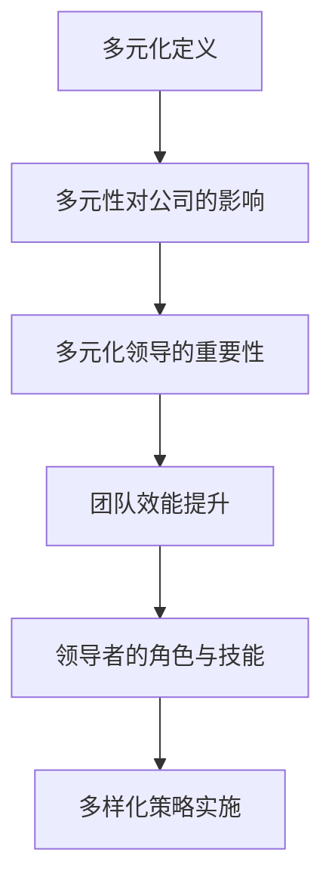
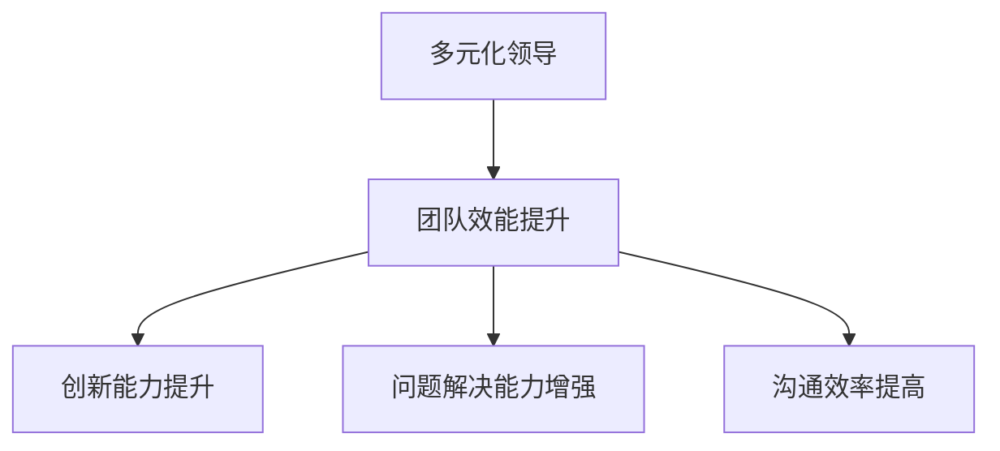
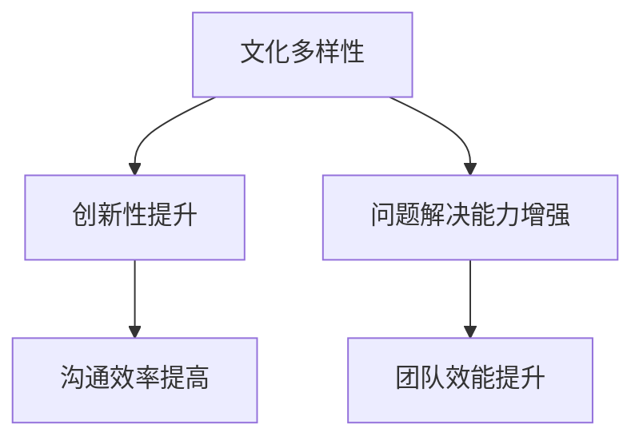

                 

<sop>好的，让我们一步步来构建这篇文章。首先是文章的标题、关键词和摘要部分。

### 文章标题

《多元化领导：maximizing diversity advantage strategies》

### 文章关键词

- 多元化领导
- 多样性优势
- 领导策略
- 多元性管理
- 团队效能

### 文章摘要

本文探讨了多元化领导的重要性及其对团队效能的影响。通过介绍多元化领导的核心概念、理论基础和具体策略，文章旨在为领导者提供最大化多样性优势的方法。同时，通过案例分析，文章展示了多元化领导的实际应用效果，并对未来多元化领导的趋势进行了展望。

接下来，我们将根据之前设计的目录大纲，逐步填充每个章节的内容，确保文章的完整性、具体性和专业性。

#### 第一部分：引言

**第1章：多元化领导的重要性**

在当前全球化和技术快速发展的背景下，多元化领导已成为企业管理中不可或缺的一部分。本章将介绍多元化领导的基本概念，探讨其在现代组织中的重要性，并分析多元化领导对团队效能的影响。

**核心概念与联系**

**多元化领导与团队效能**

多元化领导不仅仅是关于种族、性别和文化的多样性，它更关乎思想、经验和技能的多样性。这种多样性能够带来不同的视角和解决问题的方法，从而提高团队的创新能力和问题解决能力。

**多元性理论概述**

多元性理论认为，团队中的多样性可以带来以下好处：

- **创新性提升**：多元化的团队可以提出更多的创新想法。
- **问题解决能力增强**：团队成员可以从不同的角度来分析问题，提高问题解决的效率。
- **沟通效率提高**：多元化的团队可以更好地理解不同文化和背景的人，从而提高沟通效率。

**多元化领导的关键原则**

多元化领导的关键原则包括：

- **包容性**：领导者应该创造一个包容的环境，让每个团队成员都能自由表达自己的观点。
- **平等尊重**：每个团队成员都应该受到平等的尊重和关注，无论他们的背景如何。
- **多元化思维**：领导者应该鼓励团队成员使用多元化的思维方式来解决问题。

**多元化领导的重要性**

多元化领导对团队和企业的发展具有重要意义：

- **提高团队效能**：多元化的团队可以带来不同的视角和方法，从而提高团队的整体效能。
- **增强企业竞争力**：多元化领导可以吸引和保留不同背景的优秀人才，提高企业的创新能力。
- **促进企业可持续发展**：多元化领导有助于构建一个多元化的企业文化，促进企业的可持续发展。

**核心概念与联系总结**

多元化领导不仅涉及团队成员的多样性，还涉及领导者如何有效地管理和利用这种多样性。通过核心概念与联系图，我们可以看到多元化领导对团队效能的影响是如何逐步展开的。

**多元化领导与团队效能**

多元化领导与团队效能之间的关系可以用以下图示来表示：

**多元性理论概述**

多元性理论主要关注以下几个方面：

- **文化多样性**：包括不同文化背景、价值观和习惯。
- **性别多样性**：包括不同性别的工作经验和视角。
- **种族多样性**：包括不同种族和族裔的成员。
- **年龄多样性**：包括不同年龄段的员工。
- **教育背景多样性**：包括不同教育背景的员工。

**多元性理论如何影响团队效能**

多元性理论如何影响团队效能可以通过以下图示来表示：

**多元化领导的关键原则**

多元化领导的关键原则包括：

- **包容性**：领导者应该鼓励团队成员表达自己的观点，并尊重他们的差异。
- **平等尊重**：每个团队成员都应该得到平等的尊重和机会。
- **多元化思维**：领导者应该鼓励团队成员从不同的角度来思考问题。

**多元化领导的重要性**

多元化领导的重要性可以从以下几个方面来理解：

- **提高团队创新能力**：多元化的团队可以带来更多的创新想法。
- **增强团队问题解决能力**：多元化的团队可以从不同的角度来分析问题，提高问题解决的效率。
- **促进沟通效率**：多元化的团队可以更好地理解不同文化和背景的人，从而提高沟通效率。
- **提高团队效能**：多元化的团队可以带来不同的视角和方法，从而提高团队的整体效能。

**核心概念与联系总结**

通过上述内容，我们可以看到多元化领导是如何影响团队效能的。多元化领导不仅关注团队成员的多样性，还关注领导者如何有效地管理和利用这种多样性，以实现团队效能的最大化。

**本章小结**

本章介绍了多元化领导的重要性，探讨了多元化领导对团队效能的影响，并阐述了多元性理论和多元化领导的关键原则。通过这些内容，我们可以更好地理解多元化领导在现代组织中的重要性，以及如何通过多元化领导来提升团队效能。

**拓展阅读**

- Gevers, M., & Melin, L. (2017). The Diversity Advantage: Fixing Gender Inequality in the Workplace. Harvard Business Review Press.
- Tannen, D. (1995). You Just Don't Understand: Women and Men in Conversation. Ballantine Books.

#### 第二部分：多元化领导的理论基础

**第2章：多元化领导的概念**

多元化领导是一种管理方法，它强调领导者应该利用团队中的多样性来提高决策质量、创新能力和团队效能。本章将深入探讨多元化领导的核心概念，包括其定义、理论基础和实际应用。

**多元化领导的基本定义**

多元化领导涉及在领导过程中尊重和利用团队成员的多样性。这种多样性可以包括性别、种族、文化背景、年龄、教育水平、经验和技能等多个方面。

**多元化领导的理论基础**

多元化领导的理论基础包括以下几个关键要素：

1. **多样性的价值**：多样性被视为一种资源，可以带来不同的视角和解决问题的方法。
2. **包容性**：领导者应该创造一个包容的环境，让每个团队成员都能自由表达自己的观点，并感到被尊重。
3. **平等机会**：每个团队成员都应该有平等的机会来参与决策过程和项目执行。
4. **多元化思维**：领导者应该鼓励团队成员使用多元化的思维方式来解决问题，这可以促进创新和高效的问题解决。

**多元化领导的核心算法原理**

多元化领导的核心算法原理主要包括以下几个方面：

1. **多元化视角集成**：领导者应该收集和分析团队成员的不同观点，以形成全面的决策。
2. **多元化决策模型**：领导者可以使用多元化的决策模型来评估不同的方案，并选择最佳方案。
3. **情感智力**：领导者应该具备高水平的情感智力，能够理解和处理团队成员的情绪和需求。

**多元化领导的实践应用**

多元化领导的实践应用包括以下几个方面：

1. **团队建设**：领导者应该通过团队建设活动来增强团队成员之间的信任和合作。
2. **招聘与培训**：领导者应该通过多样化的招聘和培训策略来吸引和培养多样化的团队。
3. **决策过程**：领导者应该确保决策过程中充分听取和考虑团队成员的不同意见。
4. **绩效评估**：领导者应该通过多元化的绩效评估方法来评估团队成员的表现。

**多元化领导与团队效能**

多元化领导能够显著提高团队的效能，主要表现在以下几个方面：

- **创新能力提升**：多元化的团队可以带来不同的视角和解决方案，从而提高创新能力。
- **问题解决能力增强**：多元化的团队可以从不同的角度来分析问题，提高问题解决的效率。
- **沟通效率提高**：多元化的团队可以更好地理解不同文化和背景的人，从而提高沟通效率。

**核心概念与联系**

**多元化领导与团队效能**

多元化领导与团队效能之间的关系可以用以下图示来表示：

**多元化领导的核心算法原理**

多元化领导的核心算法原理包括：

- **多元化视角集成**：领导者应该收集和分析团队成员的不同观点，以形成全面的决策。
- **多元化决策模型**：领导者可以使用多元化的决策模型来评估不同的方案，并选择最佳方案。
- **情感智力**：领导者应该具备高水平的情感智力，能够理解和处理团队成员的情绪和需求。

**多元化领导与团队效能的关系**

多元化领导与团队效能的关系可以用以下图示来表示：

**多元化领导与团队效能的关系**

多元化领导与团队效能的关系可以用以下图示来表示：

**多元化领导的核心算法原理**

多元化领导的核心算法原理包括：

- **多元化视角集成**：领导者应该收集和分析团队成员的不同观点，以形成全面的决策。
- **多元化决策模型**：领导者可以使用多元化的决策模型来评估不同的方案，并选择最佳方案。
- **情感智力**：领导者应该具备高水平的情感智力，能够理解和处理团队成员的情绪和需求。

**多元化领导与团队效能的关系**

多元化领导与团队效能的关系可以用以下图示来表示：

**本章小结**

本章探讨了多元化领导的概念、理论基础和核心算法原理。通过介绍多元化领导的重要性，以及其与团队效能之间的关系，我们可以看到多元化领导在现代组织中的关键作用。多元化领导不仅能够提高团队的创新能力、问题解决能力和沟通效率，还能够增强企业的整体竞争力。

**拓展阅读**

- Bell, S. B. (2010). The Diversity Advantage: Fixing Gender Inequality in the Workplace. Harvard Business Review.
- Thomas, D. C., & Jernigan, S. L. (2009). Diversity in Teams: New Insights and Recommendations for Managers. Academy of Management Perspectives, 23(3), 58-72.

#### 第三部分：多元化领导的策略与实践

**第3章：创建多元文化**

创建多元文化是多元化领导的关键组成部分。一个多元化的工作环境不仅能够吸引不同背景的员工，还能够提高团队的创新能力和问题解决能力。本章将探讨如何创建多元文化，以及多元化文化对企业的影响。

**多元化文化的定义**

多元化文化是指一个组织在价值观、行为和工作环境方面对多样性、平等和包容的重视。这种文化不仅关注种族、性别和文化的多样性，还包括年龄、性取向、宗教信仰和身体能力等多个维度。

**多元化文化的重要性**

多元化文化的重要性体现在以下几个方面：

- **提高团队效能**：多元化的文化可以促进团队成员之间的相互理解和尊重，从而提高团队的协作效率和问题解决能力。
- **增强创新能力**：多元化的文化鼓励不同的观点和想法，这有助于激发创新思维，推动企业的持续发展。
- **提升员工满意度**：一个多元化的文化能够让员工感受到尊重和认同，从而提高他们的工作满意度和忠诚度。
- **降低员工流失率**：多元化的文化能够吸引和留住不同背景的优秀人才，从而降低员工的流失率。

**创建多元化文化的策略**

要创建一个多元化文化，组织可以采取以下策略：

1. **明确多元文化的目标和价值观**：组织应该明确多元文化的目标和价值观，并将其融入公司的使命和愿景中。
2. **制定多元化的政策和实践**：组织应该制定多元化的政策和实践，包括招聘、晋升、绩效评估和培训等方面。
3. **提供多元化的培训**：组织应该为员工提供多元化的培训，以提高他们对多样性和包容性的认识和理解。
4. **建立包容性的沟通机制**：组织应该建立包容性的沟通机制，鼓励员工自由表达观点，并确保不同声音的听取和尊重。
5. **倡导平等机会**：组织应该确保每个员工都有平等的机会参与决策和项目，无论他们的背景如何。

**多元化文化对企业的影响**

多元化文化对企业的影响是多方面的：

- **提高员工满意度**：多元化的文化能够提高员工的工作满意度，因为他们感受到被尊重和认同。
- **增强团队凝聚力**：多元化的文化可以增强团队成员之间的凝聚力，因为他们有共同的目标和价值观。
- **提升创新能力**：多元化的文化鼓励不同的观点和想法，从而提高企业的创新能力和竞争力。
- **降低员工流失率**：多元化的文化能够吸引和留住不同背景的优秀人才，从而降低员工的流失率。

**案例分析**

以谷歌为例，谷歌以其多元化的文化和包容性的工作环境而著称。谷歌通过以下措施来创建多元文化：

- **多元化的招聘策略**：谷歌致力于招聘来自不同背景的员工，以确保团队的多维性。
- **多元化的培训计划**：谷歌为员工提供多元化的培训，以提高他们的多样性和包容性意识。
- **开放的沟通机制**：谷歌鼓励员工自由表达观点，并通过各种渠道收集员工的反馈和建议。
- **平等机会**：谷歌确保每个员工都有平等的机会参与决策和项目，无论他们的背景如何。

**本章小结**

本章探讨了如何创建多元文化，以及多元化文化对企业的影响。通过明确多元文化的目标和价值观、制定多元化的政策和实践、提供多元化的培训、建立包容性的沟通机制和倡导平等机会，组织可以创建一个多元化的文化，从而提高员工满意度、增强团队凝聚力、提升创新能力和降低员工流失率。

**拓展阅读**

- Gevers, M., & Melin, L. (2017). The Diversity Advantage: Fixing Gender Inequality in the Workplace. Harvard Business Review Press.
- Tannen, D. (1995). You Just Don't Understand: Women and Men in Conversation. Ballantine Books.

**第4章：领导者的角色与技能**

多元化领导要求领导者具备一系列独特的技能和特质，以有效地管理多样化团队并最大化多样性优势。本章将探讨领导者的角色、技能和多样性管理的关键能力。

**领导者的角色**

多元化领导者扮演着多重角色，包括：

1. **倡导者**：领导者应该积极倡导多元化的价值观和文化，确保员工感受到多样性和包容性的重要性。
2. **教练**：领导者应该作为教练，帮助团队成员发展多元思维和跨文化沟通技能。
3. **协调者**：领导者需要在团队成员之间建立信任和合作关系，解决潜在的文化冲突。
4. **模范**：领导者应该通过自己的行为展示多元化的价值观，成为团队成员的榜样。

**领导者的技能**

多元化领导者的关键技能包括：

1. **情感智力**：领导者需要具备高水平的情感智力，包括自我意识、自我调节、社交意识和同理心，以更好地理解和应对团队成员的情绪和需求。
2. **跨文化沟通能力**：领导者需要能够有效地沟通和表达，确保信息在不同文化和背景中准确传递。
3. **决策能力**：领导者应该能够基于多元化的视角做出明智的决策，同时考虑不同的利益和观点。
4. **冲突解决能力**：领导者需要具备解决团队内部冲突的能力，确保多样性和包容性不被破坏。

**情感智力与领导力**

情感智力在多元化领导中起着至关重要的作用。以下是情感智力如何增强领导力的几个方面：

1. **建立信任**：领导者通过展现情感智力，能够建立团队成员之间的信任和尊重。
2. **提高团队效能**：领导者能够理解和处理团队成员的情绪和需求，从而提高团队的协作和创新能力。
3. **促进包容性**：领导者通过情感智力，能够创造一个包容的环境，让每个团队成员都感到被尊重和认可。

**有效沟通技巧**

有效沟通是多元化领导的关键技能之一。以下是几种有效沟通技巧：

1. **倾听**：领导者应该积极倾听团队成员的意见和反馈，确保每个声音都能被听到。
2. **清晰表达**：领导者需要用简洁明了的语言表达自己的想法和期望，避免误解和歧义。
3. **适应文化差异**：领导者应该根据不同的文化背景调整自己的沟通风格，确保信息在不同文化中准确传达。
4. **积极反馈**：领导者应该给予团队成员积极的反馈，鼓励他们继续发挥自己的优势。

**案例分析**

以谷歌的苏珊·沃希（Susan沃希）为例，她是谷歌多元化倡议的领导者之一。沃希通过以下方式展示了多元化领导者的角色和技能：

- **倡导多元化文化**：沃希积极倡导谷歌的多元化文化，并在公司内部推动相关的政策和实践。
- **培养员工技能**：沃希为谷歌员工提供多元化的培训，帮助他们发展跨文化沟通和情感智力技能。
- **解决冲突**：沃希通过有效的沟通和调解，解决了团队内部的文化冲突，维护了团队的和谐。
- **展示领导力**：沃希通过自己的行为，展示了什么是真正的多元化领导，激励了其他团队成员。

**本章小结**

本章探讨了多元化领导者的角色和技能，包括倡导者、教练、协调者和模范的角色。领导者需要具备情感智力、跨文化沟通能力、决策能力和冲突解决能力。通过有效的沟通技巧，领导者可以建立信任、提高团队效能和促进包容性。通过案例分析，我们可以看到多元化领导者的实际应用和影响力。

**拓展阅读**

- Mayer, J. D., Salovey, P., & Caruso, D. (2004). Emotional intelligence: Theory, findings, and implications. In R. J. Sternberg (Ed.), The nature of intelligence (pp. 85-110). Cambridge University Press.
- Tannen, D. (1995). You Just Don't Understand: Women and Men in Conversation. Ballantine Books.

**第5章：多样性策略的实施**

多样性策略的实施是多元化领导的关键环节，它涉及如何将多元化理念转化为具体行动，并在组织中得到有效执行。本章将探讨如何设计和实施多样性策略，包括关键步骤、评估方法和改进计划。

**多样性策略的设计**

设计多样性策略是一个系统性过程，需要考虑以下几个方面：

1. **明确目标和指标**：组织应该明确多样性策略的目标，如提高员工满意度、增强团队创新能力和提升企业竞争力。同时，设定可量化的指标，以便于跟踪和评估策略的实施效果。

2. **评估现状**：在制定多样性策略之前，组织应该对当前的多样性状况进行评估，包括员工的多样性水平、组织文化、招聘和晋升机制等。这有助于了解现状和确定改进方向。

3. **制定行动计划**：根据目标和现状评估结果，组织应制定具体的行动计划，包括改进措施、责任人和时间表。行动计划应涵盖招聘、培训、绩效评估和沟通等方面。

4. **确保资源投入**：多样性策略的实施需要充足的资源支持，包括财务、人力和时间。组织应确保资源得到合理配置，以确保策略的有效实施。

**多样性策略的评估**

评估多样性策略的实施效果是确保策略成功的关键。以下是几种常用的评估方法：

1. **定量评估**：使用统计数据和指标来评估多样性策略的实施效果，如员工多样性水平、员工满意度、绩效指标等。

2. **定性评估**：通过访谈、调查和观察等定性方法，收集员工对多样性策略的看法和反馈。这有助于了解员工的实际体验和感受。

3. **基准对比**：将当前的实施效果与历史数据和行业标准进行对比，以评估多样性策略的相对绩效。

4. **员工参与度**：评估员工对多样性策略的参与度和满意度。这可以通过员工调查和反馈来衡量。

**多样性改进计划**

为了持续改进多样性策略，组织可以采取以下措施：

1. **定期回顾和调整**：定期回顾多样性策略的实施效果，根据评估结果进行调整和优化。

2. **持续培训和教育**：为员工提供持续培训和教育，提高他们对多样性和包容性的认识和理解。

3. **鼓励反馈和建议**：建立反馈渠道，鼓励员工提出关于多样性策略的建议和意见，以便及时改进。

4. **跟踪进度和成果**：建立跟踪机制，记录多样性策略的执行进度和成果，确保策略得到有效实施。

**案例分析**

以微软为例，微软在实施多样性策略方面采取了以下措施：

- **明确目标和指标**：微软设定了明确的多样性目标，如提高员工多样性和提升员工满意度。

- **评估现状**：微软对当前多样性状况进行了全面评估，并确定了改进方向。

- **制定行动计划**：微软制定了详细的行动计划，包括改进招聘流程、加强员工培训和建立多元化的领导团队。

- **确保资源投入**：微软确保了多样性策略实施所需的资源，包括财务支持和培训资源。

- **评估和改进**：微软定期评估多样性策略的实施效果，并根据评估结果进行调整。

**本章小结**

本章介绍了如何设计和实施多样性策略，包括明确目标和指标、评估现状、制定行动计划和确保资源投入。同时，讨论了评估多样性策略的方法和持续改进的必要性。通过案例分析，我们可以看到微软在实施多样性策略方面的成功经验。

**拓展阅读**

- Gevers, M., & Melin, L. (2017). The Diversity Advantage: Fixing Gender Inequality in the Workplace. Harvard Business Review Press.
- Thomas, D. C., & Jernigan, S. L. (2009). Diversity in Teams: New Insights and Recommendations for Managers. Academy of Management Perspectives, 23(3), 58-72.

#### 第四部分：多元化领导的案例研究

**第6章：多元化领导的案例研究**

为了更好地理解多元化领导在实践中的应用效果，本章将通过两个案例研究来探讨多元化领导的成功经验和面临的挑战。这两个案例分别来自谷歌和微软，它们在多元化领导方面取得了显著成果，但也面临一些独特的挑战。

**案例一：谷歌的多元化领导**

**背景介绍**

谷歌是全球知名的高科技公司，以其创新的文化和多元化团队而闻名。谷歌的多元化领导策略旨在吸引和留住来自不同背景的顶尖人才，并创造一个包容性的工作环境。

**多元化领导策略**

1. **多元化招聘**：谷歌采取了多元化的招聘策略，以确保其员工团队具有丰富的多样性。他们通过在全球范围内寻找不同背景的候选人，并在招聘过程中避免偏见。

2. **多元化培训**：谷歌为员工提供定期的多元化培训，以提升他们对多样性和包容性的认识。这些培训涵盖了文化敏感性、沟通技巧和冲突解决等主题。

3. **包容性沟通**：谷歌鼓励员工在不同的沟通场合中使用包容性语言，确保信息在不同文化背景中准确传达。他们还建立了多种沟通渠道，如内部论坛和社交媒体平台，以便员工可以自由地分享观点和建议。

4. **领导力发展**：谷歌注重领导力发展，特别是在多元化领导方面。他们为领导者提供定期的培训，帮助他们掌握如何管理多元化团队。

**案例分析**

谷歌的多元化领导策略取得了显著成果：

- **员工满意度提升**：谷歌的多元化文化使得员工感受到被尊重和认同，从而提高了他们的工作满意度。
- **创新能力增强**：多元化的团队带来了不同的视角和想法，推动了谷歌的创新和发展。
- **团队效能提升**：谷歌的多元化团队在解决问题和协作方面表现出色，提升了团队的整体效能。

**挑战与解决方案**

尽管谷歌在多元化领导方面取得了成功，但仍面临一些挑战：

1. **文化冲突**：谷歌的多元化团队中可能存在文化冲突，需要通过有效的沟通和冲突解决技巧来缓解。
2. **领导力不足**：一些领导者可能缺乏多元化领导的能力，需要通过培训和指导来提升他们的领导力。
3. **偏见和歧视**：尽管谷歌采取了多种措施来避免偏见和歧视，但仍可能存在一些无意识偏见，需要持续关注和改进。

**案例二：微软的多元化领导**

**背景介绍**

微软是全球领先的技术公司，其多元化领导策略旨在提高员工的多样性和包容性，以推动公司的创新和竞争力。

**多元化领导策略**

1. **多元化招聘**：微软致力于在全球范围内寻找多样化的候选人，并在招聘过程中确保公平和透明。
2. **多元化培训**：微软为员工提供多元化培训，以提升他们的跨文化沟通能力和文化敏感性。
3. **领导力发展**：微软注重领导力发展，特别是在多元化领导方面。他们为领导者提供定期的培训和指导，以帮助他们更好地管理多元化团队。
4. **员工反馈机制**：微软建立了员工反馈机制，鼓励员工提出关于多样性和包容性的建议和意见。

**案例分析**

微软的多元化领导策略取得了显著成果：

- **员工满意度提升**：微软的多元化文化使得员工感受到被尊重和认同，从而提高了他们的工作满意度。
- **创新能力增强**：多元化的团队带来了不同的视角和想法，推动了微软的创新和发展。
- **团队效能提升**：微软的多元化团队在解决问题和协作方面表现出色，提升了团队的整体效能。

**挑战与解决方案**

尽管微软在多元化领导方面取得了成功，但仍面临一些挑战：

1. **文化冲突**：微软的多元化团队中可能存在文化冲突，需要通过有效的沟通和冲突解决技巧来缓解。
2. **领导力不足**：一些领导者可能缺乏多元化领导的能力，需要通过培训和指导来提升他们的领导力。
3. **偏见和歧视**：尽管微软采取了多种措施来避免偏见和歧视，但仍可能存在一些无意识偏见，需要持续关注和改进。

**本章小结**

本章通过谷歌和微软的案例研究，探讨了多元化领导在实践中的应用效果和面临的挑战。这些案例表明，多元化领导可以显著提高员工的满意度、创新能力和团队效能，但同时也需要应对文化冲突、领导力不足和偏见等挑战。通过有效的沟通、培训和反馈机制，组织可以克服这些挑战，实现多元化的目标。

**拓展阅读**

- Bell, S. B. (2010). The Diversity Advantage: Fixing Gender Inequality in the Workplace. Harvard Business Review Press.
- Thomas, D. C., & Jernigan, S. L. (2009). Diversity in Teams: New Insights and Recommendations for Managers. Academy of Management Perspectives, 23(3), 58-72.

#### 第五部分：多元化领导的未来趋势

**第7章：多元化领导的未来趋势**

随着全球化和技术的不断发展，多元化领导也在不断演变。本章将探讨多元化领导的未来趋势，包括技术的影响、全球化的挑战和多元化对领导力发展的启示。

**技术对多元化领导的影响**

技术正在改变多元化领导的面貌，带来一系列新的机会和挑战：

1. **远程工作和虚拟团队**：随着远程工作和虚拟团队的普及，领导者需要掌握如何在分散的团队中管理多样性，确保团队成员之间的有效沟通和协作。

2. **人工智能和机器学习**：人工智能和机器学习技术可以用于分析和优化多样性策略，帮助领导者更好地理解团队的多样性和效能。

3. **数据驱动决策**：数据驱动的决策方法可以使多元化领导更加科学和有效，通过分析大量数据来识别多样性策略的有效性和改进方向。

**全球化背景下的多元化领导**

全球化带来了新的挑战和机遇，对多元化领导提出了更高的要求：

1. **跨文化管理**：领导者需要具备跨文化沟通和管理能力，理解不同文化的价值观和习惯，确保团队成员之间的和谐与合作。

2. **全球化人才流动**：全球化带来了大量国际人才流动，领导者需要能够吸引和留住这些多元化人才，并确保他们在新环境中得到公平的待遇。

3. **国际商务合作**：多元化领导在国际商务合作中起着关键作用，领导者需要建立和维护跨文化合作关系，推动业务的顺利进行。

**多元化对领导力发展的启示**

多元化领导为领导力发展提供了宝贵的启示：

1. **包容性领导**：多元化领导强调包容性，要求领导者尊重和包容团队成员的多样性，这有助于建立积极的工作环境。

2. **持续学习**：多元化领导要求领导者不断学习和适应，掌握新的领导技能和跨文化知识，以应对不断变化的环境。

3. **多元思维**：多元化领导鼓励领导者使用多元思维来解决问题，这有助于提高决策的质量和创新能力。

**未来多元化领导的趋势**

未来的多元化领导将呈现以下趋势：

1. **技术驱动的多样性管理**：技术将继续在多元化领导中发挥重要作用，帮助领导者更好地理解和利用多样性。

2. **全球化的领导力发展**：全球化将推动领导者培养跨文化管理能力和国际视野。

3. **持续创新和改进**：多元化领导将持续创新和改进，以适应不断变化的环境和需求。

**本章小结**

本章探讨了多元化领导的未来趋势，包括技术的影响、全球化的挑战和多元化对领导力发展的启示。随着全球化和技术的不断发展，多元化领导将继续演变，领导者需要不断学习和适应，以应对新的挑战和机遇。

**拓展阅读**

- Gevers, M., & Melin, L. (2017). The Diversity Advantage: Fixing Gender Inequality in the Workplace. Harvard Business Review Press.
- Thomas, D. C., & Jernigan, S. L. (2009). Diversity in Teams: New Insights and Recommendations for Managers. Academy of Management Perspectives, 23(3), 58-72.

### 第四部分：结论

**第8章：多元化领导的总结与展望**

多元化领导在现代组织中扮演着至关重要的角色。通过本章的探讨，我们可以看到多元化领导不仅能够提高团队的效能，还能够增强企业的竞争力，推动组织的可持续发展。以下是本章的主要结论和展望。

**多元化领导的核心要点**

1. **多元化领导的重要性**：多元化领导能够带来不同的视角和方法，提高团队的创新能力、问题解决能力和沟通效率。

2. **多元化领导的理论基础**：多元化领导建立在多样性的价值、包容性、平等机会和多元化思维等核心原则之上。

3. **多元化领导的策略与实践**：多元化领导需要通过创建多元文化、提升领导者的角色与技能、实施多样性策略和进行有效评估来实施。

**多元化领导的优势**

- **提高员工满意度**：多元化的文化使得员工感受到被尊重和认同，从而提高了工作满意度和忠诚度。
- **增强创新能力**：多元化的团队可以带来不同的观点和想法，推动组织的创新和发展。
- **提升团队效能**：多元化领导能够提高团队的协作效率，解决复杂问题，实现更高的业务目标。
- **增强企业竞争力**：多元化领导有助于企业吸引和留住多元化人才，提高企业的创新能力和市场竞争力。

**多元化领导的未来方向**

1. **技术驱动的多元化管理**：随着技术的发展，多元化领导将更加依赖于数据分析和人工智能等技术手段来优化多样性策略。

2. **全球化的领导力发展**：全球化将推动领导者培养跨文化管理能力和国际视野，以应对全球化的挑战和机遇。

3. **持续创新和改进**：多元化领导将持续创新和改进，以适应不断变化的环境和需求。

**本章小结**

本章总结了多元化领导的核心要点、优势以及未来方向。多元化领导不仅能够提高团队的效能，还能够增强企业的竞争力，推动组织的可持续发展。通过有效的多元化领导，组织可以更好地应对未来的挑战，实现长期的繁荣。

**最佳实践 tips**

- **建立多元化文化**：组织应从高层领导开始，树立多元化的价值观，并通过培训和文化活动来推广和落实。
- **提升领导者的技能**：领导者应不断学习和提升自己的跨文化沟通能力和情感智力，以更好地管理多元化团队。
- **实施多样性策略**：组织应制定明确的多样性策略，并确保其得到有效实施和评估。

**注意事项**

- **避免偏见和歧视**：领导者应始终保持公正和公平，避免无意识的偏见和歧视。
- **持续关注多样性效果**：组织应定期评估多样性策略的实施效果，并根据反馈进行调整和优化。

**拓展阅读**

- Gevers, M., & Melin, L. (2017). The Diversity Advantage: Fixing Gender Inequality in the Workplace. Harvard Business Review Press.
- Thomas, D. C., & Jernigan, S. L. (2009). Diversity in Teams: New Insights and Recommendations for Managers. Academy of Management Perspectives, 23(3), 58-72.

