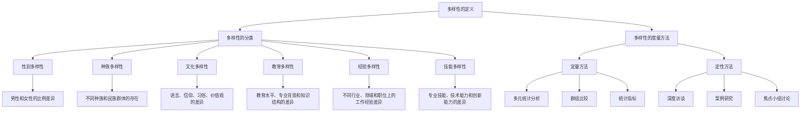

                 

### 多样性管理的基本概念与理论基础

多样性管理是一个重要的组织管理课题，它涉及到不同群体、背景、文化、观点和技能的整合与优化。理解多样性管理的概念、分类和理论基础，对于企业在全球化背景下实现高效运作和创新至关重要。

#### 多样性的定义与分类

**多样性的概念**：

多样性（Diversity）指的是在一个群体中，成员在性别、种族、国籍、年龄、文化背景、教育水平、职业经验、技能和能力等方面的差异。这些差异构成了群体内部的多样性，并且对群体的行为、决策和绩效产生深远影响。

**多样性的分类**：

多样性可以分为以下几类：

1. **性别多样性**：指在组织中的男性和女性比例差异。
2. **种族多样性**：指不同种族和民族群体的存在。
3. **文化多样性**：指在语言、信仰、习俗、价值观等方面的差异。
4. **教育多样性**：指成员的教育水平、专业背景和知识结构的差异。
5. **经验多样性**：指成员在不同行业、领域和职位上的工作经验差异。
6. **技能多样性**：指成员在专业技能、技术能力和创新能力等方面的差异。

**多样性的度量方法**：

多样性的度量方法包括定量和定性两种。定量方法如多元统计分析、群组比较和统计指标，定性方法如深度访谈、案例研究和焦点小组讨论。通过这些方法，可以全面评估一个群体或组织的多样性水平。

#### 多样性的重要性

**多样性对组织绩效的影响**：

多样性能够促进创新和创造力，因为不同的观点和经验可以激发新的想法和解决方案。研究表明，多样性较高的团队在问题解决、决策制定和创造性方面表现更好。

**多样性对团队创新的影响**：

多样性有助于团队从多个角度分析问题，识别潜在的挑战和机会。这种多元化的视角可以促进团队的创新能力和适应性，使团队在面对复杂多变的环境时更具竞争力。

**多样性对社会和谐的影响**：

多样性不仅对组织内部有积极影响，也对社会和谐有重要作用。一个包容性和多元化的社会能够更好地处理和解决社会冲突，增强社会的凝聚力和稳定性。

#### 多样性管理的理论基础

**多元文化理论**：

多元文化理论强调不同文化之间的平等和尊重，主张在组织内部建立多元文化的和谐共生环境。该理论认为，多样性是组织发展的宝贵资源，而不是需要消除的问题。

**多样性管理的组织行为学理论**：

组织行为学理论关注多样性如何影响个体的行为和群体的互动。研究表明，多样性可以促进学习、合作和团队建设，但也可能导致沟通障碍、偏见和冲突。因此，管理者需要采取措施，促进多样性带来的积极效应，同时减少其负面影响。

**多样性管理的心理学理论**：

心理学理论从个体层面探讨多样性对心理和行为的影响。该理论强调个体如何感知和适应多样性环境，以及多样性如何影响个体的自尊、动机和工作满意度。

### 背景介绍

多样性管理是一个全球性的趋势，随着全球化和技术进步，企业面临着越来越多元化的工作环境和市场需求。在这个背景下，如何有效管理多样性，发挥其优势，成为企业成功的关键。

### 核心概念与联系

多样性的核心概念包括多样性的定义、分类和度量方法。这些概念相互联系，共同构成了多样性管理的理论基础。例如，多样性的分类为我们提供了理解多样性的不同维度，而度量方法则帮助我们量化多样性的程度，以便进行有效的管理和评估。

下面是一个Mermaid流程图，展示了多样性管理核心概念之间的关系：



### 核心算法原理讲解

在多样性管理中，核心算法原理主要涉及多样性的度量方法。以下是一个简单的伪代码示例，用于计算一个团队中的多样性指数：

```python
# 输入：团队成员的属性列表（性别、种族、文化背景、教育水平等）
team_members = [{"gender": "男", "ethnicity": "汉族", "culture": "中国", "education": "本科"},
                {"gender": "女", "ethnicity": "白种人", "culture": "美国", "education": "硕士"},
                {"gender": "男", "ethnicity": "非洲裔", "culture": "非洲", "education": "博士"}]

# 计算多样性指数
def calculate_diversity(team_members):
    # 初始化多样性指数
    diversity_index = 0
    
    # 遍历团队成员，计算多样性
    for i in range(len(team_members)):
        for j in range(i + 1, len(team_members)):
            diversity_index += calculate_similarity_score(team_members[i], team_members[j])
    
    return diversity_index / (len(team_members) * (len(team_members) - 1))

# 计算两个成员之间的相似度得分
def calculate_similarity_score(member1, member2):
    # 根据不同属性计算相似度得分
    similarity_score = 0
    
    # 如果两个成员在性别、种族、文化背景、教育水平上相同，相似度得分为0
    if member1["gender"] == member2["gender"] and member1["ethnicity"] == member2["ethnicity"] and member1["culture"] == member2["culture"] and member1["education"] == member2["education"]:
        similarity_score = 0
    else:
        similarity_score = 1
    
    return similarity_score

# 计算团队的多样性指数
diversity_index = calculate_diversity(team_members)
print("团队的多样性指数为：", diversity_index)
```

### 数学模型和公式

在多样性管理中，可以使用一些数学模型和公式来衡量和优化多样性。以下是一个简单的例子，用于计算一个群体中的多样性指数（HDI，Human Development Index）：

$$
HDI = \frac{1}{3} \left( \frac{L}{E} + \frac{I}{E} + \frac{E}{L} \right)
$$

其中，$L$ 是预期寿命（Life Expectancy），$E$ 是教育水平（Education），$I$ 是收入水平（Income）。这个指数可以用来衡量一个群体在健康、教育和经济方面的多样性。

### 详细讲解与举例说明

假设一个团队的预期寿命（$L$）为75岁，平均受教育年限（$E$）为15年，平均收入水平（$I$）为每年5万美元。使用上述公式，我们可以计算这个团队的HDI：

$$
HDI = \frac{1}{3} \left( \frac{75}{15} + \frac{5}{15} + \frac{15}{75} \right)
$$

$$
HDI = \frac{1}{3} \left( 5 + 0.333 + 0.2 \right)
$$

$$
HDI = \frac{1}{3} \times 5.533
$$

$$
HDI = 1.844
$$

这意味着该团队在健康、教育和经济方面的多样性指数为1.844。这个值越高，表示团队的多样性水平越高。

### 小结

在这一部分，我们介绍了多样性管理的基本概念与理论基础。通过定义多样性的不同类别、阐述其重要性，以及介绍多样性管理的理论基础，我们为后续探讨多样性管理的策略与方法、发挥不同背景员工的优势等主题奠定了基础。多样性管理是一个复杂的领域，需要从多个角度进行深入研究和实践。在接下来的章节中，我们将继续探讨多样性管理的具体策略与方法，以及如何在实际组织中实施和评估多样性管理。

### 多样性管理的策略与方法

多样性管理不仅仅是一种理念，它需要通过一系列的策略与方法来具体实施。有效的多样性管理可以帮助组织充分利用不同背景员工的优势，提高团队绩效，促进创新。以下将详细介绍多样性管理的基本策略、具体方法和工具。

#### 多样性管理的基本策略

**战略规划**：

多样性管理需要从组织的高层战略层面进行规划。组织需要明确多样性管理的目标，并将其纳入组织的发展战略中。例如，制定多样性政策、确立多样性管理目标、分配资源等。

**组织结构**：

合理的组织结构可以促进多样性的实现。组织可以通过跨职能团队、多元化委员会和跨文化工作组等方式，确保多样性在组织内部的深入渗透。

**文化塑造**：

组织文化是多样性管理的基石。组织需要营造一个包容和尊重多元文化的环境，鼓励员工表达不同的观点，并对多样性的贡献给予认可和奖励。

#### 多样性管理的具体方法

**增加多样性招聘渠道**：

扩大招聘渠道，增加不同背景的候选人来源，有助于提高组织的多样性水平。组织可以通过参与多元化招聘活动、利用社交媒体平台和与多样性组织合作等方式，吸引多样化的候选人。

**多样性培训与教育**：

培训和教育是提升多样性管理意识和技能的重要手段。组织可以通过开展多样性和包容性培训课程，提高员工对多样性的认识和应对能力。

**多元化领导力培养**：

领导力培养是多样性管理的关键。组织需要培养和提拔具有多元化背景的领导者，确保他们在组织中发挥领导作用，推动多样性管理实践。

#### 多样性管理工具与技术

**多样性评估工具**：

多样性评估工具可以帮助组织了解自身的多样性水平，识别优势和不足。常见的多样性评估工具包括多样性指数、多元化评估问卷和多样性审计等。

**多样性管理软件**：

随着技术的发展，多样性管理软件逐渐成为组织进行多样性管理的有力工具。这些软件可以帮助组织收集、分析和报告多样性数据，提供实时反馈和改进建议。

**多元化创新方法**：

多元化创新方法如头脑风暴、思维导图和跨界合作等，可以促进团队成员的创造性思维，激发新的想法和解决方案。

### 多样性管理的案例分析

**国际公司A**：

国际公司A通过实施多元化战略，将多样性管理作为公司文化的一部分。公司设立了多样性委员会，定期评估和改进多样性管理实践。此外，公司还推出了多元化领导力培训计划，鼓励员工参与各种多样性活动和项目。这些举措不仅提高了员工的满意度和归属感，也增强了公司的创新能力和市场竞争力。

**国内企业B**：

国内企业B注重在招聘环节中增加多样性，通过与高校、社会团体和职业组织合作，吸引了大量来自不同背景的优秀人才。公司还定期举办多样性和包容性培训，提高员工对多样性的认识和应对能力。这些措施使得企业能够在快速变化的市场环境中保持竞争力，并实现了业务持续增长。

### 总结

多样性管理是一个多层次、多维度的复杂过程，需要组织在战略、结构、文化和方法等多个方面进行综合管理。通过制定明确的多样性管理策略，实施具体的管理方法，利用先进的管理工具，组织可以更好地发挥不同背景员工的优势，实现持续的创新和发展。

### 多样性管理的挑战与解决方案

在多样性管理实践中，组织往往面临多种挑战，这些挑战可能来自内部也可能来自外部。了解这些挑战并找到相应的解决方案，是确保多样性管理有效实施的关键。

#### 挑战一：文化冲突与偏见

**原因分析**：

文化冲突和偏见是多样性管理中常见的问题。不同文化背景的员工在价值观、沟通方式和行为习惯上可能存在差异，这可能导致误解和冲突。此外，组织内部的偏见和歧视也可能阻碍多样性的实现。

**解决方案**：

- **文化培训与教育**：组织可以通过开展文化培训，提高员工对不同文化的认识和理解，减少文化冲突。培训内容可以包括跨文化沟通技巧、文化敏感性训练等。
- **建立包容性文化**：组织需要积极营造一个包容性的工作环境，鼓励员工尊重和欣赏不同的文化和观点。可以通过设立多元文化庆祝活动、推行多元化政策等方式来实现。

#### 挑战二：组织适应性不足

**原因分析**：

组织适应性不足是多样性管理的另一个挑战。许多组织在多样性管理初期，可能会因为缺乏经验而无法有效应对多元化带来的变化。这可能导致组织结构、流程和决策机制的不适应。

**解决方案**：

- **建立多元化委员会**：组织可以设立专门的多元化委员会，负责评估和推动多样性管理的实施。委员会可以由来自不同背景的员工组成，确保多样性管理的决策过程更加多元和包容。
- **开展适应性培训**：组织可以开展适应性培训，帮助员工提高在多样性环境中的工作能力和应变能力。培训内容可以包括团队协作技巧、冲突解决策略等。

#### 挑战三：资源分配不均

**原因分析**：

在多样性管理过程中，资源分配不均可能成为影响多样性有效实施的因素。资源包括时间、资金、人力资源等。资源的不均衡可能导致某些多样化的努力得不到足够的支持。

**解决方案**：

- **确保资源公平分配**：组织需要确保多样性管理在资源分配上得到公平对待。可以通过设立专门的项目预算、优化人力资源配置等方式，确保多样化管理实践得到充分支持。
- **建立多样性目标责任制**：组织可以建立多样性目标责任制，明确各级管理者在多样性管理中的责任和任务，确保多样性管理得到全员的重视和参与。

#### 挑战四：绩效评估难度

**原因分析**：

多样性管理的绩效评估难度较大，因为多样性管理的效果往往难以量化。此外，评估标准和方法的制定也需要考虑多样性的复杂性和多样性目标的多样性。

**解决方案**：

- **制定多元评估标准**：组织需要制定适合多样性管理的评估标准，这些标准应包括定量和定性两个方面。定量标准可以包括多样性指标、员工满意度等，定性标准可以包括团队绩效、创新成果等。
- **持续反馈与改进**：组织应建立持续的反馈机制，定期收集和分析多样性管理的数据，并根据反馈结果进行调整和改进。反馈机制可以包括员工调查、定期会议等。

### 总结

多样性管理在实践中面临的挑战多种多样，但通过合理的策略和解决方案，组织可以克服这些挑战，实现多样性的有效管理。文化冲突与偏见、组织适应性不足、资源分配不均和绩效评估难度是多样性管理中的主要挑战。通过文化培训、建立包容性文化、设立多元化委员会、开展适应性培训、确保资源公平分配、建立多样性目标责任制、制定多元评估标准和持续反馈与改进等措施，组织可以更好地应对这些挑战，实现多样性的优势最大化。

### 多样性管理的绩效评估与反馈机制

为了确保多样性管理的有效实施，组织需要建立完善的绩效评估与反馈机制。通过定期的评估和反馈，组织可以了解多样性管理的效果，发现存在的问题，并进行相应的调整和改进。

#### 评估指标

在建立多样性管理的绩效评估体系时，组织需要设定一系列评估指标，这些指标应涵盖多个维度，包括：

- **多样性指标**：如性别、种族、文化、年龄、教育水平等方面的多样性比例。
- **员工满意度**：通过调查问卷和访谈，了解员工对多样性环境的满意度和归属感。
- **团队绩效**：评估多样性团队在项目完成度、创新成果、工作效率等方面的表现。
- **创新率**：衡量多样性对组织创新能力的提升程度。
- **多样性培训参与度**：评估员工参与多样性培训的积极性和培训效果。

#### 评估方法

评估方法包括定量和定性两种：

- **定量评估**：通过统计数据和调查问卷进行量化分析。例如，使用多样性指数、员工满意度评分、团队绩效评估等工具。
- **定性评估**：通过深度访谈、焦点小组讨论和案例分析等方式，获取员工对多样性管理的真实感受和反馈。

#### 反馈机制

建立有效的反馈机制是多样性管理持续改进的关键。反馈机制应包括以下几个方面：

- **定期反馈**：组织应定期进行多样性管理绩效评估，并将结果及时反馈给相关人员和部门。反馈周期可以根据组织的具体情况设定，例如每季度或每半年一次。
- **反馈渠道**：建立多种反馈渠道，如员工满意度调查、领导反馈会、匿名反馈系统等，确保员工的意见和建议能够畅通无阻地传递到管理层。
- **改进计划**：根据反馈结果，制定具体的改进计划。改进计划应包括明确的目标、措施和时间表，以确保多样性管理实践得到有效落实。
- **持续跟进**：在改进计划实施过程中，组织应持续跟进，评估改进措施的效果，并根据实际情况进行调整。

#### 实践案例

以下是一个企业多样性管理绩效评估与反馈机制的实践案例：

**企业名称**：某国际科技公司

**评估指标**：

- 多样性指标：性别、种族、文化背景、年龄和教育水平的多样性比例。
- 员工满意度：通过季度调查问卷了解员工对多样性环境的满意度。
- 团队绩效：评估跨文化团队在项目完成度、创新成果和工作效率等方面的表现。
- 创新率：统计多样性团队在一年内创新项目的数量和贡献度。

**评估方法**：

- 定量评估：通过统计数据和调查问卷收集多样性指标和员工满意度数据。
- 定性评估：通过组织领导层与员工的定期沟通，获取对多样性管理实践的真实反馈。

**反馈机制**：

- 定期反馈：每季度进行一次多样性管理绩效评估，并将结果反馈给相关人员和部门。
- 反馈渠道：设立员工满意度调查问卷、领导反馈会、匿名反馈系统等，确保员工意见能够畅通无阻地传递到管理层。
- 改进计划：根据反馈结果，制定具体的改进计划，包括提高跨文化沟通培训、优化多样性招聘策略等。
- 持续跟进：在改进计划实施过程中，定期评估改进措施的效果，并根据实际情况进行调整。

通过上述实践案例，我们可以看到，企业通过建立完善的绩效评估与反馈机制，不仅能够及时发现和解决多样性管理中存在的问题，还能够持续改进多样性管理实践，实现组织绩效的提升。

### 多样性管理相关资源与工具

在实施多样性管理的过程中，组织可以利用多种资源与工具来提高管理效率和效果。以下是一些推荐的书籍、网站和培训课程，以及常见的多样性管理工具和技术。

#### 书籍推荐

1. 《多样性管理：如何实现多元文化的共赢》（Diversity Management: Strategies for Creating Inclusive Organizational Cultures）
   - 作者：[麦格劳希尔教育](https://www.mheducation.com/)
   - 简介：本书详细介绍了多样性管理的理论和实践，提供了多种策略和方法，帮助组织建立包容性的文化。

2. 《多元文化组织中的领导力》（Leadership in Multicultural Organizations）
   - 作者：[谢尔比·钱德勒](https://www.amazon.com/Shelley-Chandler/e/B003J3MREO)
   - 简介：本书探讨了多元文化组织中的领导力挑战，提供了实用的领导技巧和管理策略。

3. 《多样性、包容性和社会正义》（Diversity, Inclusion, and Social Justice）
   - 作者：[芭芭拉·索尔尼](https://www.amazon.com/Barbara-Solnitsyn/e/B000AP2J7Y)
   - 简介：本书从社会正义的角度出发，讨论了多样性管理和包容性的重要性，以及如何实现社会正义。

#### 网站推荐

1. [美国多样性协会](https://diversitybestpractices.com/)
   - 简介：该网站提供了大量的多样性管理资源、案例研究和最佳实践，是了解多样性管理动态的好去处。

2. [国际多样性研究院](https://idrc.int/)
   - 简介：国际多样性研究院是一个专门研究和管理多样性的机构，提供多样化的研究和教育资源。

3. [多样性中心](https://diversitycenter.org/)
   - 简介：多样性中心致力于推广多样性和包容性，提供在线培训和研讨会，帮助组织提升多样性管理水平。

#### 培训课程

1. **《多样性管理基础》**：由国际多样性协会（IDRC）提供，课程内容包括多样性的定义、重要性、管理策略和实践。

2. **《跨文化沟通技巧》**：由哈佛大学扩展教育部门提供，课程旨在提高学员在多元文化环境中的沟通能力。

3. **《多样性培训与教育》**：由麦格劳希尔教育提供，课程涵盖多样性管理的理论和实践，适合不同层级的学员。

#### 常见多样性管理工具

1. **Diversity Builder**：一款在线工具，用于评估和提升组织的多样性管理水平。

2. **Inclusiveness@Work**：一款多样性评估软件，可以帮助组织识别多样性管理中的问题和机会。

3. **Cultural Intelligence (CQ) Assessment**：一款评估员工跨文化能力和意识的工具，帮助组织培养多元化思维和沟通能力。

通过这些资源与工具，组织可以更好地理解和实施多样性管理，提高团队绩效和创新能力。

### 结论与展望

多样性管理作为组织发展的关键战略，其重要性不容忽视。本文详细阐述了多样性管理的基本概念、策略与方法，并通过实践案例分析了多样性管理的挑战与解决方案。通过多样化的策略，如战略规划、组织结构优化、文化塑造、培训与教育等，组织可以充分发挥不同背景员工的优势，提升团队绩效和创新能力。

展望未来，多样性管理将继续在全球化和技术进步的推动下不断发展。新兴技术，如人工智能和大数据分析，将为多样性管理提供更科学的工具和方法。此外，随着社会对多样性、平等和包容性的关注度不断提高，多样性管理将成为企业可持续发展的重要组成部分。

为此，我们呼吁组织在多样性管理方面持续投入，不断优化管理实践，推动组织的创新和发展。通过建立完善的绩效评估与反馈机制，组织可以更好地应对多样性管理中的挑战，实现多样性管理的长效机制。最终，多样性管理不仅有助于提高组织的竞争力，也有助于构建一个更加和谐和包容的社会。作者：AI天才研究院 & 禅与计算机程序设计艺术。

