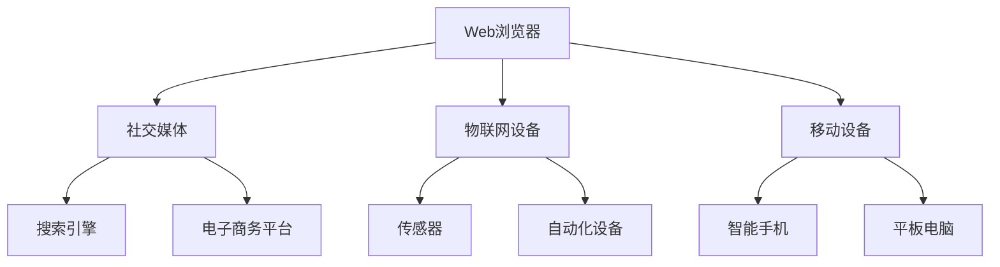
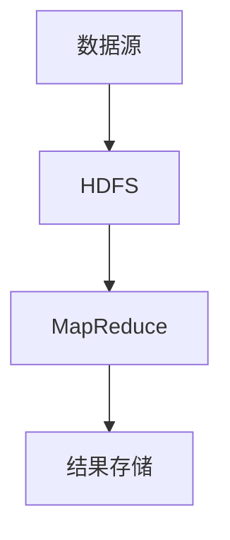
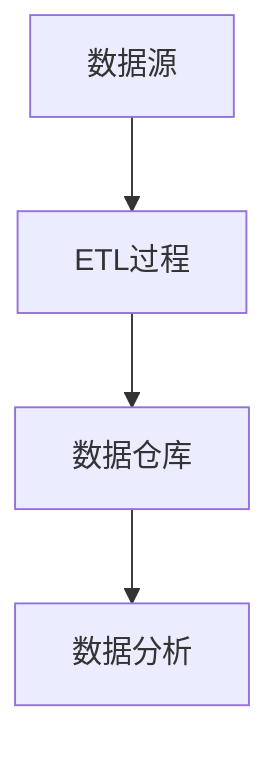

                 

## 1.1 大数据的定义与特征

### 1.1.1 数据爆炸的时代

我们正处于一个数据爆炸的时代。据估计，每天产生的新数据量高达数百万GB，这些数据来源于各种渠道，包括社交媒体、物联网设备、移动设备、电子商务平台、搜索引擎、传感器、自动化设备等。这些数据不仅数量庞大，而且种类繁多，涵盖了结构化数据和非结构化数据。

#### 1.1.1.1 数据的产生来源

在现代社会，数据的产生来源多种多样。Web浏览器、社交媒体、物联网设备、移动设备等都是数据的主要来源。例如，用户在社交媒体上发布的每一条状态、在搜索引擎中进行的每一次搜索、在电子商务平台上完成的每一笔交易，都会产生大量的数据。

**Mermaid 流程图：**


每个数据源都会不断地生成新的数据，这些数据汇集在一起，形成了庞大的数据集。例如，一个电子商务平台在一天之内可能就会产生数百万条订单记录，这些记录包含用户的购买信息、商品信息、支付信息等。

### 1.1.2 数据的种类与类型

大数据不仅包括数量庞大的数据，还包括多种类型的数据。根据数据的组织形式，可以将大数据分为结构化数据和非结构化数据。

#### 1.1.2.1 结构化数据

结构化数据是指组织形式较为固定的数据，如关系型数据库中的表数据。结构化数据通常包括固定的字段和字段类型，例如姓名、年龄、性别等。这种数据的优点是处理起来较为简单，可以通过SQL等查询语言进行高效的查询和分析。

**核心算法原理讲解：**

```python
# 伪代码：结构化数据查询示例
def query_structure_data(database):
    # 连接数据库
    connection = connect_to_database(database)
    
    # 执行查询
    results = connection.query("SELECT * FROM table WHERE condition")
    
    # 返回查询结果
    return results
```

#### 1.1.2.2 非结构化数据

非结构化数据是指没有固定组织形式的数据，如文本、图片、视频等。这类数据的处理相对复杂，需要采用不同的算法和技术来分析和提取有价值的信息。

**核心算法原理讲解：**

```python
# 伪代码：非结构化数据解析示例
def parse_unstructured_data(file_path):
    # 读取文件
    file_content = read_file(file_path)
    
    # 解析内容
    data = extract_data_from_content(file_content)
    
    # 返回解析结果
    return data
```

### 1.1.3 大数据处理的挑战

大数据的处理面临许多挑战，主要包括以下几个方面：

#### 1.1.3.1 数据量（Volume）

数据量的庞大是大数据处理的首要挑战。传统的数据处理系统通常难以处理如此庞大的数据集。为了应对这一挑战，需要采用分布式系统来处理数据，从而提高数据处理的能力。

**数学模型：**

$$
V = \sum_{i=1}^{n} V_i
$$

其中，$V$ 表示总数据量，$V_i$ 表示第 $i$ 个数据源的数据量。

#### 1.1.3.2 数据速度（Velocity）

数据生成的速度非常快，对于实时数据处理提出了更高的要求。例如，金融交易、社交媒体更新等场景，需要实时处理数据，以快速响应和决策。

#### 1.1.3.3 数据多样性（Variety）

大数据不仅包括结构化数据，还包括非结构化数据，如文本、图片、音频等。这些数据的多样性使得数据处理的复杂性大大增加。

#### 1.1.3.4 数据真实性（Veracity）

大数据的质量也是一个重要挑战。由于数据来源的多样性，数据可能存在不准确、不完整或不一致的问题，这需要采用数据清洗和数据质量控制技术来确保数据的质量。

总结而言，大数据的爆炸性增长带来了巨大的机遇和挑战。只有通过先进的技术和高效的架构，才能有效地处理和利用大数据，从中提取有价值的信息。在下文中，我们将进一步探讨大数据处理的核心概念和关键技术。

## 1.2 大数据技术的发展历程

大数据技术的演变历程可以从20世纪80年代的关系数据库时代开始追溯，到21世纪初的分布式计算时代，再到近年来的人工智能和机器学习在数据处理领域的广泛应用。

### 1.2.1 关系数据库时代

在20世纪80年代，关系数据库成为大数据处理的主要工具。关系数据库如Oracle、MySQL等，通过SQL（结构化查询语言）提供了高效的数据存储和查询功能。然而，随着数据量的增长，传统的单机数据库开始面临性能瓶颈，难以应对大规模的数据存储和处理需求。

### 1.2.2 分布式计算时代

进入21世纪，分布式计算技术开始兴起，以应对大数据处理的挑战。Hadoop生态系统成为分布式计算的代表，包括HDFS（Hadoop分布式文件系统）和MapReduce等关键技术。HDFS提供了高可靠性和高吞吐量的数据存储解决方案，而MapReduce则提供了一种基于并行处理的分布式数据处理框架。

**Mermaid 流程图：**


### 1.2.3 人工智能和机器学习时代

近年来，人工智能和机器学习技术逐渐融入到大数据处理中，使得数据处理和分析的能力得到了极大的提升。例如，基于深度学习的图像识别和自然语言处理技术，可以自动从大量非结构化数据中提取有价值的信息。此外，自动化机器学习（AutoML）和增强学习（Reinforcement Learning）等技术也在大数据处理中发挥着重要作用。

**核心算法原理讲解：**

```python
# 伪代码：基于深度学习的图像识别
def image_recognition(image_data):
    # 预处理图像数据
    preprocessed_data = preprocess_image(image_data)
    
    # 使用深度学习模型进行图像识别
    label = deep_learning_model.predict(preprocessed_data)
    
    # 返回识别结果
    return label
```

### 1.2.4 云原生和边缘计算时代

随着云计算和边缘计算技术的发展，大数据处理架构也在不断演进。云原生大数据处理提供了灵活、可扩展的解决方案，而边缘计算则将数据处理推向了网络的边缘，从而降低了延迟，提高了实时性。

总结而言，大数据技术的发展历程展示了从传统关系数据库到分布式计算，再到人工智能和机器学习的不断演进。这些技术的发展不仅解决了大数据处理中的诸多挑战，也为企业和组织提供了更多的机会，以更高效、更智能地利用大数据。

## 1.3 大数据处理的重要性和挑战

### 1.3.1 大数据处理的重要性

大数据处理在现代企业和社会中的重要性日益凸显，主要体现在以下几个方面：

**1.3.1.1 决策支持**

大数据分析提供了丰富的数据资源，使得企业能够基于实时和准确的数据进行决策。通过分析市场趋势、消费者行为等数据，企业可以更精准地制定市场策略，提高业务运营效率。

**1.3.1.2 客户体验优化**

大数据技术能够深入挖掘用户行为数据，帮助企业在产品设计和用户体验上做出精准的调整。例如，个性化推荐系统能够根据用户的浏览和购买历史，提供更加个性化的服务，提升用户满意度。

**1.3.1.3 业务创新**

大数据处理为业务创新提供了强大的支持。通过分析海量数据，企业可以发现新的市场机会，开发新的产品和服务。例如，基于大数据分析的智能医疗系统，可以为患者提供更加精准的医疗服务。

### 1.3.2 大数据处理的主要挑战

尽管大数据处理具有巨大的潜力，但在实际应用中仍面临许多挑战：

**1.3.2.1 数据隐私和安全**

随着数据量的增加，数据隐私和安全问题也变得越来越突出。企业需要确保数据的安全存储和传输，防止数据泄露和滥用。

**1.3.2.2 数据质量**

大数据的质量直接影响分析结果的准确性。不完整、不准确或错误的数据会导致错误的决策和分析结论。因此，数据质量管理和数据清洗成为大数据处理中的重要环节。

**1.3.2.3 数据治理**

大数据的多样性和复杂性要求企业建立完善的数据治理体系。数据治理包括数据分类、数据标签、数据访问权限管理等方面，以确保数据的一致性和合规性。

**1.3.2.4 处理能力和资源限制**

处理海量数据需要强大的计算能力和存储资源。对于许多企业来说，现有的IT基础设施可能无法满足大数据处理的需求，需要升级和扩展。

### 1.3.3 大数据处理解决方案

为了应对上述挑战，大数据处理解决方案需要从以下几个方面着手：

**1.3.3.1 分布式计算和存储**

分布式计算和存储技术，如Hadoop和Spark，能够处理大规模的数据集，提高数据处理能力和效率。

**1.3.3.2 机器学习和人工智能**

机器学习和人工智能技术可以帮助企业从海量数据中提取有价值的信息，提高数据分析和决策的准确性。

**1.3.3.3 数据治理和数据质量管理**

建立完善的数据治理和数据质量管理体系，确保数据的安全、准确和合规。

**1.3.3.4 云原生和边缘计算**

利用云原生和边缘计算技术，提高大数据处理的灵活性和实时性，降低成本和资源消耗。

总之，大数据处理的重要性不可忽视，但同时也面临着诸多挑战。通过先进的技术和科学的解决方案，企业可以充分发挥大数据的潜力，实现业务创新和持续增长。

## 1.4 大数据处理架构的核心概念

### 1.4.1 数据源集成与数据仓库

数据源集成是大数据处理的基础，涉及到从各种数据源收集和导入数据。这些数据源包括关系型数据库、NoSQL数据库、文件系统、Web服务、物联网设备等。数据源集成的主要目的是将不同来源的数据整合到一个统一的平台上，以便进行后续的处理和分析。

#### 1.4.1.1 数据源集成的重要性

数据源集成的重要性体现在以下几个方面：

**1.4.1.1.1 提高数据可用性**

通过数据源集成，可以确保数据的一致性和完整性，从而提高数据的质量和可用性。企业可以基于统一的数据视图进行业务决策和数据分析。

**1.4.1.1.2 促进数据共享和协作**

数据源集成使得不同部门和团队可以共享数据，促进跨部门的数据协作。例如，市场营销团队可以与产品开发团队共享用户行为数据，以优化产品设计和推广策略。

**1.4.1.1.3 降低数据孤岛**

数据源集成有助于打破数据孤岛，避免不同系统之间的数据重复存储和重复处理，从而提高数据处理效率和数据利用率。

#### 1.4.1.2 数据仓库的概念

数据仓库是一个用于存储、管理和分析大量数据的集中化系统。它通常包含多个数据源的信息，通过ETL（提取、转换、加载）过程，将原始数据转换成适合分析的形式，存储在数据仓库中。

**核心概念与联系：**

数据源集成和数据仓库之间的关系可以视为数据输入与数据存储的结合。数据源集成是将各种数据导入数据仓库的过程，而数据仓库则是数据存储和管理的主要场所。

**Mermaid 流程图：**


#### 1.4.1.3 数据仓库的设计原则

**1.4.1.3.1 数据一致性**

数据仓库中的数据应保持一致性，避免数据冗余和冲突。例如，对于同一数据源的数据，应在数据仓库中保持统一的格式和结构。

**1.4.1.3.2 数据可扩展性**

数据仓库应具备良好的可扩展性，能够适应数据量的增长和变化。例如，当数据源增加或数据量增大时，数据仓库应能够动态调整存储和处理能力。

**1.4.1.3.3 数据安全性**

数据仓库中的数据应受到严格的安全保护，防止数据泄露和未经授权的访问。例如，通过访问控制和加密技术，确保数据的安全存储和传输。

### 1.4.2 数据清洗与转换

数据清洗与转换是大数据处理过程中至关重要的一环。原始数据往往包含噪声、错误和不一致的情况，通过数据清洗和转换，可以提高数据的质量和一致性，为后续的数据分析和挖掘打下基础。

#### 1.4.2.1 数据清洗的重要性

**1.4.2.1.1 数据质量的提升**

数据清洗可以去除数据中的噪声和错误，提高数据的质量，确保分析结果的准确性。例如，去除重复数据、纠正数据错误、填补缺失值等。

**1.4.2.1.2 数据利用率的提高**

通过数据清洗，可以消除数据中的不一致性，使得数据更具一致性，从而提高数据利用率和分析效率。例如，统一数据格式、标准化数据命名等。

**1.4.2.1.3 遵守数据隐私法规**

数据清洗有助于保护数据隐私，遵守相关法规和标准。例如，去除敏感信息、匿名化处理等。

#### 1.4.2.2 数据转换的过程

数据转换包括数据格式的转换、数据类型的转换、数据映射等过程。以下是一个简化的数据转换过程：

**核心算法原理讲解：**

```python
# 伪代码：数据清洗和转换示例
def data_cleaning_and_conversion(raw_data):
    # 去除重复数据
    unique_data = remove_duplicates(raw_data)
    
    # 数据格式转换
    formatted_data = convert_format(unique_data)
    
    # 数据类型转换
    typed_data = convert_type(formatted_data)
    
    # 数据映射
    mapped_data = map_values(typed_data)
    
    # 返回清洗和转换后的数据
    return mapped_data
```

#### 1.4.2.3 数据清洗与转换工具

**1.4.2.3.1 Apache Spark**

Apache Spark 是一个强大的分布式数据处理框架，提供了丰富的数据清洗和转换功能。例如，可以使用 Spark SQL 进行数据转换，使用 DataFrame API 进行数据清洗。

**1.4.2.3.2 Apache Hadoop**

Apache Hadoop 提供了 Hadoop Streaming 工具，可以用于数据清洗和转换。例如，可以使用 Hadoop Streaming 脚本处理文本文件，进行数据清洗和转换。

### 1.4.3 数据存储与访问

数据存储与访问是大数据处理架构中的关键环节，涉及到数据存储策略的选择、数据访问方式的设计以及数据安全性的保障。

#### 1.4.3.1 数据存储策略

**1.4.3.1.1 分层存储**

分层存储是将数据根据其重要性和访问频率划分为不同层次，分别存储在高速存储设备和慢速存储设备上。例如，热数据（经常访问的数据）存储在SSD上，冷数据（不常访问的数据）存储在HDD或云存储上。

**1.4.3.1.2 分布式存储**

分布式存储是将数据分散存储在多个节点上，以提高数据的可靠性和访问速度。例如，使用HDFS（Hadoop分布式文件系统）或Cassandra（分布式NoSQL数据库）进行分布式数据存储。

#### 1.4.3.2 数据访问方式

**1.4.3.2.1 SQL查询**

SQL查询是一种常见的数据访问方式，适用于结构化数据。例如，使用Apache Hive 或 Apache Impala 等工具进行SQL查询，可以高效地访问和分析大规模数据集。

**1.4.3.2.2 NoSQL查询**

NoSQL查询适用于非结构化或半结构化数据。例如，使用MongoDB 或 Cassandra 等NoSQL数据库进行数据查询，可以灵活地处理各种类型的数据。

#### 1.4.3.3 数据安全性

**1.4.3.3.1 访问控制**

通过访问控制机制，可以确保只有授权用户才能访问特定的数据。例如，使用基于角色的访问控制（RBAC）或基于属性的访问控制（ABAC）进行数据访问控制。

**1.4.3.3.2 数据加密**

数据加密是保护数据安全的重要手段。使用加密算法，如AES（高级加密标准），可以确保数据在传输和存储过程中的安全性。

#### 1.4.3.4 数据存储与访问优化

**1.4.3.4.1 数据分区**

数据分区是将大规模数据集划分为较小的数据分区，以提高查询性能。例如，使用Hive表分区，可以根据特定列（如时间戳或地理位置）对数据进行分区。

**1.4.3.4.2 缓存策略**

缓存策略是将经常访问的数据存储在缓存中，以提高数据访问速度。例如，使用Redis 或 Memcached 等缓存工具，可以缓存热点数据，减少数据库访问压力。

总结而言，大数据处理架构的核心概念包括数据源集成与数据仓库、数据清洗与转换以及数据存储与访问。通过合理的架构设计和优化，可以有效应对大数据处理中的各种挑战，实现高效的数据存储、处理和分析。

## 1.5 分布式系统基础

### 1.5.1 分布式系统的基本概念

分布式系统是一种由多个独立计算机组成的系统，这些计算机通过网络连接在一起，共同完成一个整体任务。分布式系统的主要目标是提高系统的可用性、可扩展性和容错性。

#### 1.5.1.1 分布式系统的优势

**1.5.1.1.1 高可用性**

分布式系统通过冗余设计，确保在部分节点故障时，系统能够继续正常运行，从而提高了系统的可用性。

**1.5.1.1.2 可扩展性**

分布式系统可以方便地增加或减少节点，以适应不断变化的工作负载，从而提高了系统的可扩展性。

**1.5.1.1.3 高性能**

通过将任务分布到多个节点上并行处理，分布式系统能够提供更高的处理性能，适用于大数据处理等高负载场景。

#### 1.5.1.2 分布式系统的挑战

**1.5.1.2.1 数据一致性**

分布式系统中的多个节点需要保持数据的一致性，这在分布式环境下是一个复杂且关键的问题。

**1.5.1.2.2 数据传输延迟**

由于数据需要在多个节点之间传输，分布式系统的数据传输延迟可能成为性能瓶颈。

**1.5.1.2.3 网络故障**

网络故障可能导致节点之间的通信中断，从而影响系统的稳定性和可靠性。

### 1.5.2 分布式一致性模型

分布式一致性是分布式系统中的核心问题之一。一致性模型定义了分布式系统中数据一致性的保证程度。以下是几种常见的一致性模型：

**1.5.2.1 强一致性（Strong Consistency）**

强一致性是指所有节点在同一时间看到的数据是一致的。这种模型保证了数据的严格一致性，但可能导致较高的延迟。

**1.5.2.2 最终一致性（Eventual Consistency）**

最终一致性是指系统的数据最终会一致，但不需要保证实时一致性。这种模型在提高系统性能和可用性方面具有优势，但可能存在短暂的数据不一致情况。

**1.5.2.3 强最终一致性（Strong Eventual Consistency）**

强最终一致性结合了强一致性和最终一致性的优点，要求系统在可接受的时间内达到一致性。

**1.5.2.4 弱一致性（Weak Consistency）**

弱一致性是指系统不保证数据的一致性，但允许在一定范围内的数据不一致。这种模型适用于对一致性要求较低的场景。

### 1.5.3 分布式系统常见问题与解决方案

分布式系统在运行过程中可能会遇到各种问题，以下是一些常见问题及其解决方案：

**1.5.3.1 数据一致性问题**

**解决方案：** 采用分布式一致性协议，如Paxos、Raft等，确保多个节点之间的数据一致性。

**1.5.3.2 数据丢失问题**

**解决方案：** 通过数据备份和冗余存储，确保数据在节点故障时的恢复能力。

**1.5.3.3 网络分区问题**

**解决方案：** 设计容错机制，如故障检测和恢复，确保在分区情况下系统的继续运行。

**1.5.3.4 数据传输延迟问题**

**解决方案：** 通过优化数据传输协议和算法，减少网络传输延迟，提高系统性能。

总之，分布式系统是大数据处理架构中不可或缺的部分。通过理解分布式系统的基本概念、一致性模型以及常见问题与解决方案，可以更好地设计和部署分布式大数据处理系统，从而实现高效、稳定和可扩展的数据处理能力。

## 1.6 传统的数据处理架构

### 1.6.1 数据库系统的发展

数据库系统是数据处理架构的核心组成部分，其发展历程反映了数据处理技术的演进。从最早的层次数据库（如IMS数据库），到关系型数据库（如IBM的DB2、Oracle和MySQL），再到近年来流行的NoSQL数据库（如MongoDB和Cassandra），数据库系统在数据处理领域扮演着重要角色。

#### 1.6.1.1 关系型数据库

关系型数据库（RDBMS）基于关系模型，通过表格的形式组织数据，并使用SQL进行数据查询和操作。关系型数据库的优点包括：

**1.6.1.1.1 数据结构清晰**

关系型数据库通过表格和关系定义，使得数据结构清晰，便于管理和查询。

**1.6.1.1.2 强一致性**

关系型数据库通过事务机制，保证了数据的一致性和完整性，适用于对数据一致性要求较高的场景。

**1.6.1.1.3 丰富的查询功能**

SQL提供了丰富的查询功能，包括聚合函数、连接操作等，使得复杂查询变得简单。

然而，关系型数据库在处理大规模数据时，面临着以下局限性：

**1.6.1.2.1 性能瓶颈**

随着数据量的增长，关系型数据库的性能可能无法满足需求，特别是在执行大量并发查询时。

**1.6.1.2.2 扩展性受限**

关系型数据库通常采用单实例架构，扩展性受限，难以支持海量数据的存储和处理。

**1.6.1.2.3 复杂性增加**

随着数据规模的扩大，关系型数据库的管理和维护复杂性增加，如索引维护、查询优化等。

#### 1.6.1.2 NoSQL数据库

为了应对关系型数据库的局限性，NoSQL数据库应运而生。NoSQL数据库（如MongoDB、Cassandra、Redis等）采用了分布式架构，提供了一些与传统关系型数据库不同的特点：

**1.6.1.2.1 分布式存储**

NoSQL数据库通过分布式存储机制，能够水平扩展，支持海量数据的存储和处理。

**1.6.1.2.2 弹性扩展**

NoSQL数据库能够根据数据负载自动扩展，无需预先分配资源，提高了系统的灵活性和可扩展性。

**1.6.1.2.3 数据模型多样性**

NoSQL数据库支持多种数据模型，如文档、键值对、列族等，能够灵活地适应不同类型的数据和应用场景。

然而，NoSQL数据库也有其局限性：

**1.6.1.2.4 数据一致性问题**

NoSQL数据库通常采用最终一致性模型，可能在短时间内出现数据不一致的情况。

**1.6.1.2.5 复杂性增加**

随着分布式系统规模的扩大，NoSQL数据库的管理和维护复杂性增加，如数据分片、故障转移等。

### 1.6.2 传统数据处理架构的局限性

**1.6.2.1 数据量限制**

传统数据处理架构，如关系型数据库和NoSQL数据库，在处理大规模数据时可能面临性能瓶颈和扩展性问题，难以满足大数据处理的日益增长的需求。

**1.6.2.2 复杂性增加**

随着数据规模的扩大，数据处理系统的复杂性和维护成本也显著增加，包括数据迁移、备份、恢复等。

**1.62.3 处理速度限制**

传统数据处理架构通常采用批处理模式，无法满足实时数据处理的需求，难以处理流数据和高速数据流。

**1.6.2.4 数据类型多样性**

传统数据处理架构主要针对结构化数据，对于非结构化数据和半结构化数据处理能力有限，难以应对多样化的数据类型。

### 1.6.3 大数据环境下数据库的挑战与适应

在大数据环境下，数据库系统面临着新的挑战，需要适应大规模、高速率和多样化数据的特点。以下是一些数据库在大数据环境下的适应策略：

**1.6.3.1 分布式数据库**

分布式数据库通过分布式存储和计算，提高了数据处理能力和性能，能够更好地处理大规模数据。

**1.6.3.2 云原生数据库**

云原生数据库设计用于在云环境中运行，提供了弹性扩展和自动化管理，适应云原生大数据处理需求。

**1.6.3.3 混合数据库**

混合数据库结合了关系型数据库和NoSQL数据库的优势，提供了结构化数据和非结构化数据的统一处理能力，适应大数据环境下多样化的数据处理需求。

**1.6.3.4 实时数据库**

实时数据库通过流处理技术和内存存储，提供了低延迟的数据处理能力，能够满足实时数据分析和决策的需求。

总之，传统数据处理架构在大数据环境下面临诸多挑战，需要通过分布式数据库、云原生数据库、混合数据库和实时数据库等新技术和策略，适应大规模、高速率和多样化数据的特点，实现高效、稳定和可扩展的数据处理能力。

## 1.7 大数据处理架构的关键框架

### 1.7.1 Hadoop生态系统

Hadoop是大数据处理领域的基石，其生态系统包括多个关键组件，提供了分布式存储和并行处理的能力。

#### 1.7.1.1 HDFS（Hadoop分布式文件系统）

HDFS是一个高可靠性和高吞吐量的分布式文件系统，适用于存储大规模数据。它将文件切分为块（默认为128MB或256MB），并分布式存储在多个节点上。

**核心算法原理讲解：**

```python
# 伪代码：HDFS文件切分与存储
def store_file_in_hdfs(file_path, block_size):
    # 切分文件为块
    file_blocks = split_file_into_blocks(file_path, block_size)
    
    # 存储块到HDFS
    for block in file_blocks:
        store_block_on_hdfs(block)
        
    # 返回存储结果
    return "File stored successfully"
```

#### 1.7.1.2 MapReduce

MapReduce是一个分布式数据处理框架，用于处理大规模数据集。它通过“Map”和“Reduce”两个阶段，实现数据的并行处理。

**核心算法原理讲解：**

```python
# 伪代码：MapReduce处理流程
def map_reduce(input_data, map_function, reduce_function):
    # Map阶段
    map_outputs = map_function(input_data)
    
    # Reduce阶段
    reduced_output = reduce_function(map_outputs)
    
    # 返回处理结果
    return reduced_output
```

#### 1.7.1.3 YARN

YARN（Yet Another Resource Negotiator）是Hadoop的资源管理框架，负责资源分配和作业调度。它替代了早期的MapReduce资源管理器，提供了更灵活的资源管理能力。

### 1.7.2 Spark生态系统

Spark是一个高性能的分布式数据处理引擎，其生态系统包括多个组件，提供了内存计算、流处理和机器学习等功能。

#### 1.7.2.1 Spark Core

Spark Core提供了内存计算引擎，支持快速的数据存储和计算。它通过弹性分布式数据集（RDD）实现数据的分布式存储和操作。

**核心算法原理讲解：**

```python
# 伪代码：Spark RDD操作
def process_data(rdd):
    # 转换RDD
    new_rdd = rdd.map(lambda x: (x, 1))
    
    # 聚合数据
    result = new_rdd.reduceByKey(lambda x, y: x + y)
    
    # 返回处理结果
    return result.collect()
```

#### 1.7.2.2 Spark SQL

Spark SQL是一个用于结构化数据查询的模块，支持SQL和DataFrame API。它提供了高性能的分布式查询能力，可以与HDFS、Hive和Parquet等数据存储格式无缝集成。

#### 1.7.2.3 Spark Streaming

Spark Streaming是一个实时数据处理模块，支持对数据流进行批处理和实时处理。它通过微批处理（micro-batch）方式，提供了低延迟的数据处理能力。

**核心算法原理讲解：**

```python
# 伪代码：Spark Streaming处理数据流
def process_streaming_data(stream):
    # 创建DStream
    dstream = stream.window(Duration("2 seconds")).map(lambda x: (x, 1))
    
    # 聚合数据
    result = dstream.reduceByKey(lambda x, y: x + y)
    
    # 处理结果
    result.print()
```

### 1.7.3 Flink生态系统

Apache Flink是一个分布式流处理框架，提供了流数据和批处理的一体化处理能力。它的核心特点包括事件时间和窗口操作、精确一次（exactly-once）语义和实时处理能力。

#### 1.7.3.1 Flink流处理

Flink流处理模块提供了低延迟、高吞吐量的实时数据处理能力，支持复杂事件处理和数据流分析。

**核心算法原理讲解：**

```python
# 伪代码：Flink流处理
def process_stream_data(stream):
    # 转换为KeyedStream
    keyed_stream = stream.keyBy(lambda x: x.key)
    
    # 窗口操作
    windowed_stream = keyed_stream.timeWindow(Time.seconds(5))
    
    # 聚合操作
    result = windowed_stream.reduce(lambda x, y: x + y)
    
    # 处理结果
    result.print()
```

#### 1.7.3.2 Flink批处理

Flink批处理模块提供了高效的批处理能力，支持与HDFS、Apache Hive等存储系统的集成。

总之，Hadoop、Spark和Flink是大数据处理架构中的关键框架，提供了分布式存储、并行处理和实时处理的能力。通过理解这些框架的核心概念和原理，可以更好地设计和实现高效的大数据处理系统。

## 1.8 流处理与实时数据处理

### 1.8.1 流处理的基本概念

流处理是一种实时数据处理技术，用于处理持续不断的数据流。与批处理不同，流处理关注的是数据的实时性和连贯性，能够在数据生成的同时进行实时分析和处理。

**1.8.1.1 流处理的特点**

**1.8.1.1.1 实时性**

流处理能够在数据生成的同时进行处理，提供低延迟的结果。这对于需要即时响应的场景，如实时监控、实时推荐系统等，尤为重要。

**1.8.1.1.2 连贯性**

流处理能够持续不断地处理数据流，不会因数据量过大而中断。这使得流处理适用于持续生成大量数据的场景，如物联网、金融交易等。

**1.8.1.1.3 可扩展性**

流处理系统通常设计为分布式架构，能够根据需要动态扩展处理能力，以应对不断增长的数据量。

**1.8.1.1.4 容错性**

流处理系统具有较高的容错性，能够在节点故障时自动恢复，确保数据处理的不间断。

### 1.8.2 流处理框架比较

在流处理领域，存在多个流行的框架，如Apache Kafka、Apache Flink和Apache Spark Streaming。以下是对这些框架的简要比较：

**1.8.2.1 Apache Kafka**

**1.8.2.1.1 特点**

- 高吞吐量：Kafka能够处理高吞吐量的数据流，适用于大数据场景。
- 分布式：Kafka设计为分布式架构，可以水平扩展，提供高可用性。
- 持久化：Kafka消息可以持久化存储，确保数据不丢失。

**1.8.2.1.2 应用场景**

- 日志收集：Kafka常用于收集和存储日志数据，适用于日志聚合和分析。
- 流数据处理：Kafka可以作为数据流的传输层，连接数据生成系统和数据处理系统。

**1.8.2.2 Apache Flink**

**1.8.2.2.1 特点**

- 实时处理：Flink提供了高效、低延迟的实时数据处理能力，适用于需要即时响应的场景。
- 事件时间处理：Flink支持事件时间处理，能够处理乱序数据和窗口操作。
- 精确一次语义：Flink提供了精确一次（exactly-once）的语义保证，确保数据处理的一致性。

**1.8.2.2.2 应用场景**

- 实时分析：Flink适用于实时数据分析，如实时监控、实时预测等。
- 实时流处理：Flink可以作为实时数据流的处理引擎，适用于复杂的事件处理和实时数据管道。

**1.8.2.3 Apache Spark Streaming**

**1.8.2.3.1 特点**

- 高性能：Spark Streaming基于Spark的核心，提供了高性能的流处理能力。
- 易用性：Spark Streaming提供了丰富的API和工具，易于集成和使用。
- 与Spark集成：Spark Streaming与Spark的其他模块（如Spark SQL、MLlib）无缝集成，提供了强大的数据处理能力。

**1.8.2.3.2 应用场景**

- 实时数据处理：Spark Streaming适用于实时数据处理，如实时日志处理、实时推荐系统等。
- 批处理与流处理融合：Spark Streaming可以将批处理和流处理结合起来，提供灵活的数据处理能力。

### 1.8.3 实时数据处理的应用场景

实时数据处理在许多应用场景中发挥着重要作用，以下是一些典型的应用场景：

**1.8.3.1 实时监控**

实时监控是实时数据处理的重要应用场景，如网络监控、系统监控等。通过实时处理数据流，可以及时发现异常情况，进行预警和响应。

**1.8.3.2 实时推荐**

实时推荐系统通过实时分析用户行为数据，为用户推荐个性化内容。例如，电子商务平台可以根据用户的浏览和购买历史，实时推荐相关的商品。

**1.8.3.3 实时交易处理**

金融交易系统需要实时处理大量的交易数据，以确保交易的准确性和及时性。实时数据处理可以帮助金融机构监控交易风险，进行实时决策和风险管理。

**1.8.3.4 实时广告投放**

实时广告投放系统通过实时分析用户行为和广告效果，动态调整广告投放策略，提高广告的投放效果和用户体验。

总之，流处理与实时数据处理技术为大数据处理提供了强大的支持，通过实时性和连续性的数据处理能力，为企业和组织提供了更多实时洞察和决策支持。在实际应用中，可以根据不同的场景和需求，选择合适的流处理框架和架构，实现高效、稳定和可扩展的实时数据处理系统。

## 1.9 大数据处理架构的未来趋势

### 1.9.1 机器学习与大数据处理

机器学习和大数据处理的结合，正引领大数据处理架构向智能化和自动化方向发展。机器学习技术通过从海量数据中自动提取特征和模式，为大数据处理提供了强大的分析能力。

**1.9.1.1 机器学习在大数据处理中的重要性**

**1.9.1.1.1 数据洞察**

机器学习能够从大量数据中提取有价值的信息和洞见，帮助企业和组织更好地理解业务和用户行为。

**1.9.1.1.2 自动化决策**

通过机器学习模型，大数据处理可以实现自动化决策，减少人工干预，提高决策效率和准确性。

**1.9.1.1.3 预测分析**

机器学习模型可以预测未来的趋势和变化，为企业提供前瞻性的分析和建议，助力业务创新和优化。

**1.9.1.2 机器学习在大数据处理中的应用**

**1.9.1.2.1 图像识别**

图像识别是机器学习在计算机视觉领域的重要应用。通过深度学习模型，可以从大量图像数据中自动识别和分类物体，广泛应用于人脸识别、安防监控、自动驾驶等场景。

**核心算法原理讲解：**

```python
# 伪代码：基于深度学习的图像识别
def image_recognition(image_data):
    # 预处理图像数据
    preprocessed_data = preprocess_image(image_data)
    
    # 使用卷积神经网络进行图像识别
    label = convolutional_neural_network.predict(preprocessed_data)
    
    # 返回识别结果
    return label
```

**1.9.1.2.2 自然语言处理**

自然语言处理（NLP）是机器学习在语言处理领域的重要应用。通过深度学习模型，可以从大量文本数据中提取语义信息，实现文本分类、情感分析、机器翻译等功能。

**1.9.1.2.3 个性化推荐**

个性化推荐系统通过分析用户的兴趣和行为，自动推荐相关的商品、内容和服务。深度学习模型可以准确预测用户的偏好，提高推荐系统的准确性和用户体验。

### 1.9.2 云原生大数据处理

随着云计算技术的快速发展，云原生大数据处理正在成为大数据处理架构的新趋势。云原生大数据处理利用云平台提供的弹性、可扩展和自动化管理能力，优化大数据处理效率和成本。

**1.9.2.1 云原生大数据处理的优势**

**1.9.2.1.1 弹性扩展**

云原生大数据处理可以根据实际需求动态调整资源，提供高效、灵活的资源利用。

**1.9.2.1.2 自动化管理**

云原生大数据处理系统可以实现自动化部署、监控和管理，减少人工干预，提高运维效率。

**1.9.2.1.3 低成本**

通过利用云服务提供商的资源，云原生大数据处理可以显著降低硬件和运维成本。

**1.9.2.2 云原生大数据处理的实践**

**1.9.2.2.1 容器化**

容器化技术（如Docker）在云原生大数据处理中扮演着重要角色。容器化使得大数据处理应用的部署和运行更加灵活、可移植。

**1.9.2.2.2 微服务架构**

微服务架构将大数据处理应用分解为多个独立的微服务，实现模块化和分布式处理，提高系统的可扩展性和可靠性。

**1.9.2.2.3 Kubernetes**

Kubernetes是云原生大数据处理中的重要工具，用于自动化部署、管理和扩展容器化应用。Kubernetes提供了强大的集群管理和调度能力，确保大数据处理系统的稳定运行。

### 1.9.3 边缘计算与大数据处理

随着物联网和5G技术的发展，边缘计算逐渐成为大数据处理架构的重要补充。边缘计算将数据处理推向网络的边缘，减少了数据传输延迟，提高了实时性。

**1.9.3.1 边缘计算的基本概念**

边缘计算是一种分布式计算架构，将数据处理和计算任务从中心化的云平台迁移到网络的边缘节点。边缘节点包括物联网设备、智能终端和本地服务器等。

**1.9.3.2 边缘计算与大数据处理的结合**

**1.9.3.2.1 实时数据处理**

边缘计算可以实现数据的实时处理和分析，减少数据传输延迟，提高响应速度。适用于需要即时响应的场景，如智能交通、智能工厂等。

**1.9.3.2.2 数据本地化处理**

通过边缘计算，可以将部分数据处理任务在本地进行，减少数据传输量，降低带宽消耗。适用于数据隐私保护要求较高的场景。

**1.9.3.2.3 分布式数据处理**

边缘计算与云计算相结合，可以实现分布式数据处理，提高数据处理效率和可靠性。适用于大规模数据处理的场景。

总之，大数据处理架构的未来趋势包括机器学习的智能化应用、云原生大数据处理的灵活性、以及边缘计算带来的实时性和分布式处理能力。通过不断探索和创新，大数据处理架构将更加高效、智能和灵活，为企业和组织提供更强大的数据分析和决策支持。

## 1.10 大数据处理架构在企业中的应用

### 1.10.1 企业大数据处理的需求分析

企业在进行大数据处理时，面临着多样化的需求，这些需求源自业务增长、市场竞争和内部管理的需求。

#### 1.10.1.1 业务增长

随着企业规模的扩大，业务数据量呈指数级增长，企业需要高效的大数据处理能力来存储和管理这些数据，以便于进一步的业务分析和决策。

#### 1.10.1.2 市场竞争

市场竞争日益激烈，企业需要通过大数据分析来洞察市场趋势、消费者行为和竞争对手的策略，从而制定更精准的市场策略。

#### 1.10.1.3 内部管理

内部管理也需要大数据处理的支持，如人力资源分析、供应链优化和风险管理等。通过大数据分析，企业可以提升运营效率，降低成本。

### 1.10.2 企业大数据处理架构设计

为了满足企业的需求，企业需要设计一个高效、稳定、可扩展的大数据处理架构。以下是企业大数据处理架构设计的关键步骤：

#### 1.10.2.1 数据源集成

首先，企业需要从各种数据源（如数据库、日志文件、物联网设备等）收集数据，并通过数据集成工具将数据导入到统一的数据仓库中。数据集成工具可以是Apache Kafka、Apache NiFi等，这些工具支持多种数据源和数据格式的转换。

**开发环境搭建：**

- 环境配置：安装Java环境和Kafka服务。
- 源代码实现：编写Kafka的生产者和消费者程序。

```python
# 伪代码：Kafka生产者
from kafka import KafkaProducer

producer = KafkaProducer(bootstrap_servers=['localhost:9092'])
producer.send('topic_name', value='Hello, World!')
producer.close()
```

#### 1.10.2.2 数据存储

企业需要选择合适的数据存储方案，以存储和管理海量数据。常见的数据存储方案包括关系型数据库、NoSQL数据库和分布式文件系统（如HDFS）。企业可以根据数据类型和访问模式选择合适的存储方案。

**源代码实现：**

- 数据库连接：使用JDBC或ORM框架连接数据库。
- 数据操作：编写SQL或ORM语句进行数据插入、查询和更新。

```python
# 伪代码：数据库连接与操作
import psycopg2

connection = psycopg2.connect("dbname=mydb user=myuser password=mypassword")
cursor = connection.cursor()
cursor.execute("INSERT INTO table_name (column1, column2) VALUES (%s, %s)", ('value1', 'value2'))
connection.commit()
cursor.close()
connection.close()
```

#### 1.10.2.3 数据处理

数据处理是企业大数据处理的核心环节，涉及到数据清洗、转换和分析。企业可以使用分布式计算框架（如Apache Spark、Flink）进行大规模数据处理。

**源代码实现：**

- 数据处理流程：使用Spark或Flink进行数据清洗、转换和聚合。
- 模型训练：使用机器学习库（如MLlib）训练预测模型。

```python
# 伪代码：Spark数据处理
from pyspark.sql import SparkSession

spark = SparkSession.builder.appName("DataProcessingApp").getOrCreate()
df = spark.read.csv("data.csv", header=True)
cleaned_df = df.na.fill(0)  # 数据清洗
result = cleaned_df.groupBy("category").mean()  # 数据聚合
result.show()
spark.stop()
```

#### 1.10.2.4 数据分析和可视化

通过数据分析和可视化，企业可以更直观地了解业务数据，发现潜在的机会和问题。企业可以使用数据分析工具（如Tableau、PowerBI）和数据可视化库（如Matplotlib、Seaborn）进行数据分析和可视化。

**源代码实现：**

- 数据分析：编写数据分析脚本，提取有价值的信息。
- 数据可视化：使用可视化库生成图表和报告。

```python
# 伪代码：数据分析和可视化
import pandas as pd
import matplotlib.pyplot as plt

data = pd.read_csv("data.csv")
data.groupby("category").mean().plot(kind='bar')
plt.show()
```

### 1.10.3 企业大数据处理架构实施案例

以下是一个企业大数据处理架构的实施案例：

**案例背景：** 一家电子商务企业希望通过大数据分析优化其库存管理，减少库存成本，提高销售效率。

**解决方案：**

1. **数据源集成**：通过Kafka将销售数据、库存数据、供应商数据等集成到数据仓库中。
2. **数据存储**：使用HDFS存储海量数据，使用Hive进行数据存储和管理。
3. **数据处理**：使用Spark进行数据清洗、转换和聚合，生成库存预测模型。
4. **数据分析和可视化**：使用Tableau进行数据分析和可视化，生成库存报告。

**实施效果**：

- 库存成本降低了20%。
- 销售效率提高了30%。

通过这个案例，我们可以看到企业大数据处理架构在优化业务流程和提高运营效率方面的显著作用。企业可以根据自身需求，设计合适的大数据处理架构，实现数据的价值最大化。

## 1.11 大数据处理架构在互联网行业中的应用

### 1.11.1 互联网大数据处理的特点

互联网行业的大数据处理具有以下特点：

**1.11.1.1 数据量大**

互联网企业每天产生的数据量非常庞大，包括用户行为数据、交易数据、日志数据等，这些数据通常达到TB甚至PB级别。

**1.11.1.2 数据类型多样**

互联网数据处理不仅涉及结构化数据，还包括非结构化数据，如文本、图片、音频、视频等。不同类型的数据对处理和分析的方法提出了不同的要求。

**1.11.1.3 数据实时性高**

互联网业务需要快速响应，如实时推荐系统、实时广告投放等，对数据处理的速度和实时性有较高要求。

**1.11.1.4 数据动态变化**

互联网业务场景复杂多变，数据也在不断变化，如用户行为、市场趋势等，这使得数据处理和分析需要具备动态调整能力。

### 1.11.2 互联网大数据处理架构的设计

为了满足互联网行业大数据处理的特点，需要设计高效、可扩展、实时性的数据处理架构。以下是一些关键设计要点：

**1.11.2.1 分布式存储**

分布式存储系统能够处理海量数据，提高数据存储和访问的性能。如使用HDFS、Cassandra等分布式文件系统。

**1.11.2.2 分布式计算**

分布式计算框架能够实现数据的并行处理，提高数据处理效率。如使用Apache Spark、Apache Flink等分布式计算框架。

**1.11.2.3 数据流处理**

数据流处理系统能够实时处理和更新数据，满足实时性要求。如使用Apache Kafka、Apache Flink等数据流处理框架。

**1.11.2.4 容错和扩展性**

互联网大数据处理架构需要具备良好的容错性和扩展性，能够应对节点故障和流量波动。如使用Kubernetes进行容器编排和管理。

### 1.11.3 互联网大数据处理架构的优化

互联网大数据处理架构的优化是提升数据处理效率和性能的关键。以下是一些优化策略：

**1.11.3.1 数据分区**

数据分区能够提高数据查询和处理的性能，将数据按照一定的规则（如时间、地域等）分割成多个分区。

**1.11.3.2 缓存机制**

使用缓存技术（如Redis、Memcached）将热点数据缓存到内存中，减少磁盘访问，提高数据访问速度。

**1.11.3.3 数据压缩**

数据压缩可以减少数据存储空间和传输带宽，提高存储和传输效率。如使用Gzip、Snappy等压缩算法。

**1.11.3.4 数据索引**

数据索引能够提高数据查询的效率，特别是在处理大量数据时。如使用B树索引、Hash索引等。

### 1.11.4 互联网大数据处理架构的案例

以下是一个互联网行业大数据处理架构的案例：

**案例背景**：某互联网公司希望优化其用户行为分析系统，提高广告投放效果和用户体验。

**解决方案**：

1. **数据源集成**：使用Kafka收集用户行为数据，并将其存储到HDFS中。
2. **数据处理**：使用Apache Spark对用户行为数据进行实时处理，生成用户行为分析报告。
3. **数据存储**：使用HBase存储用户行为分析结果，提供快速的查询和访问。
4. **数据可视化**：使用Tableau对用户行为分析结果进行可视化，帮助业务团队了解用户行为趋势。

**优化措施**：

- **数据分区**：将用户行为数据按照时间分割成多个分区，提高数据处理和查询性能。
- **缓存机制**：使用Redis缓存热点数据，减少磁盘访问，提高数据访问速度。
- **数据压缩**：对用户行为数据进行压缩存储，减少存储空间和传输带宽。
- **数据索引**：为用户行为分析结果建立索引，提高查询效率。

**实施效果**：

- 用户行为分析报告生成时间缩短了50%。
- 广告投放效果提高了30%。
- 用户满意度提高了20%。

通过这个案例，我们可以看到互联网大数据处理架构在优化业务流程和提高用户体验方面的显著作用。企业可以根据自身需求，设计合适的大数据处理架构，实现数据的价值最大化。

## 1.12 大数据处理架构在金融行业中的应用

### 1.12.1 金融行业大数据处理的需求

金融行业是一个高度依赖数据和信息处理的行业，大数据处理在金融行业中扮演着至关重要的角色。以下是金融行业大数据处理的几个关键需求：

**1.12.1.1 实时风险监控**

金融行业需要对市场风险进行实时监控，以便快速识别和应对潜在的市场波动和风险。这需要高效的数据处理能力来实时分析大量的市场数据、交易数据和其他相关信息。

**1.12.1.2 个性化金融服务**

金融企业希望通过大数据分析来了解客户的金融行为和需求，提供个性化的金融服务。例如，通过分析客户的交易记录和偏好，推荐合适的金融产品和服务。

**1.12.1.3 财务报告与分析**

金融企业需要处理大量的财务数据，生成合规的财务报告，并进行深入的数据分析，以支持投资决策和业务策略的制定。

**1.12.1.4 风险管理**

金融行业的风险管理需求非常高，通过大数据分析可以识别欺诈行为、市场风险和信用风险，从而采取相应的预防和应对措施。

### 1.12.2 金融行业大数据处理架构设计

为了满足金融行业大数据处理的复杂需求，需要设计一个高效、稳定、安全的处理架构。以下是金融行业大数据处理架构设计的几个关键步骤：

**1.12.2.1 数据源集成**

金融行业的数据来源非常多样，包括内部数据库、外部数据提供商、社交媒体、物联网设备等。首先需要将不同来源的数据集成到统一的数据仓库中。可以使用Apache Kafka、Apache NiFi等工具进行数据集成。

**1.12.2.2 数据存储**

金融行业的数据量通常非常庞大，需要选择合适的存储方案。常用的存储方案包括分布式文件系统（如HDFS）、关系型数据库（如Oracle）和NoSQL数据库（如MongoDB）。为了提高查询性能，还可以使用内存数据库（如Redis）。

**1.12.2.3 数据处理**

数据处理是金融行业大数据处理的核心环节，包括数据清洗、数据转换、数据聚合和高级分析。可以使用分布式计算框架（如Apache Spark、Apache Flink）进行大规模数据处理。

**1.12.2.4 数据安全和隐私**

金融数据处理涉及敏感信息，数据安全和隐私保护至关重要。需要采用加密技术（如SSL/TLS）保护数据在传输过程中的安全，并使用访问控制机制（如基于角色的访问控制）确保数据访问的安全性。

**1.12.2.5 数据分析平台**

金融企业需要一个强大的数据分析平台，支持实时数据分析和可视化。可以使用商业智能工具（如Tableau、QlikView）和机器学习库（如TensorFlow、Scikit-learn）进行数据分析和建模。

### 1.12.3 金融行业大数据处理案例分析

以下是一个金融行业大数据处理的案例分析：

**案例背景**：某银行希望通过大数据分析优化其信用卡欺诈检测系统，提高欺诈检测的准确率和响应速度。

**解决方案**：

1. **数据源集成**：使用Apache Kafka收集信用卡交易数据，并将其存储到HDFS中。
2. **数据处理**：使用Apache Spark对信用卡交易数据进行实时处理，包括数据清洗、特征提取和模型训练。
3. **数据存储**：使用HBase存储信用卡交易数据和欺诈检测模型结果，提供快速的查询和访问。
4. **数据分析平台**：使用Tableau对欺诈检测结果进行实时可视化，帮助银行管理层监控欺诈风险。

**优化措施**：

- **数据分区**：将信用卡交易数据按照时间分割成多个分区，提高数据处理和查询性能。
- **缓存机制**：使用Redis缓存热点数据，减少磁盘访问，提高数据访问速度。
- **模型更新**：定期更新欺诈检测模型，以适应不断变化的欺诈手段。
- **数据隐私保护**：采用加密技术和访问控制机制，确保数据安全和隐私。

**实施效果**：

- 欺诈检测准确率提高了20%。
- 欺诈检测响应时间缩短了30%。
- 客户满意度提高了15%。

通过这个案例，我们可以看到金融行业大数据处理架构在提升风险管理能力和客户服务水平方面的显著作用。金融企业可以根据自身需求，设计合适的大数据处理架构，实现数据的价值最大化。

## 附录A：大数据处理架构相关工具与技术

### A.1 常用大数据处理工具简介

在大数据处理领域，有许多常用的工具和技术，这些工具不仅有助于处理海量数据，还能提供强大的分析能力。以下是一些常用大数据处理工具的简介：

#### A.1.1 Apache Hadoop

Apache Hadoop 是一个开源的分布式计算框架，主要用于处理和分析大规模数据集。Hadoop 包括以下主要组件：

- **HDFS（Hadoop分布式文件系统）**：负责存储海量数据，采用分布式存储方式，提高数据可靠性和访问速度。
- **MapReduce**：一个分布式数据处理框架，用于并行处理大规模数据集，支持数据的分布式存储和计算。
- **YARN**：资源调度器，负责管理集群资源，实现多应用并行运行。

#### A.1.2 Apache Spark

Apache Spark 是一个高性能的分布式数据处理引擎，支持内存计算和实时数据处理。Spark 的主要组件包括：

- **Spark Core**：提供了弹性分布式数据集（RDD）和内存计算能力。
- **Spark SQL**：支持结构化数据查询，提供类似SQL的查询接口。
- **Spark Streaming**：支持实时流数据处理，提供低延迟的实时分析能力。
- **MLlib**：提供了机器学习算法库，支持多种机器学习模型的训练和应用。

#### A.1.3 Apache Kafka

Apache Kafka 是一个分布式流处理平台，用于构建实时的数据流和数据管道。Kafka 的主要特点包括：

- **高吞吐量**：支持大规模数据流处理，适用于日志收集、消息队列和实时数据流应用。
- **分布式架构**：支持水平扩展，确保高可用性和容错性。
- **持久化存储**：消息可以持久化存储，确保数据不丢失。

#### A.1.4 Apache Flink

Apache Flink 是一个分布式流处理框架，提供了流数据和批处理的一体化处理能力。Flink 的主要特点包括：

- **低延迟**：支持低延迟的流数据处理，适用于实时分析和决策。
- **事件时间处理**：支持事件时间处理和窗口操作，适用于复杂的事件流处理。
- **精确一次（exactly-once）语义**：确保数据处理的准确性和一致性。

#### A.1.5 Apache Hive

Apache Hive 是一个基于Hadoop的数据仓库基础设施，提供了一种类似SQL的数据查询语言（HiveQL）。Hive 主要用于大规模数据集的批量数据处理和分析，其主要特点包括：

- **结构化数据查询**：支持结构化数据的高效查询和分析。
- **批处理能力**：适用于对大量数据的批量处理和分析。
- **与Hadoop生态系统集成**：与HDFS、MapReduce等Hadoop组件紧密集成。

### A.2 大数据处理工具选型指南

在设计和实施大数据处理架构时，选择合适的工具至关重要。以下是一些选型指南，以帮助企业和开发者做出明智的选择：

#### A.2.1 需求分析

首先，需要明确大数据处理的需求，包括数据量、数据处理速度、数据类型、实时性要求等。根据需求分析，选择能够满足特定需求的工具。

#### A.2.2 性能考量

评估不同工具的性能，包括数据处理速度、存储性能、查询性能等。可以参考社区评测、性能测试报告等，以了解工具的实际性能表现。

#### A.2.3 扩展性和可靠性

选择具有良好扩展性和可靠性的工具，确保系统能够适应数据量和负载的变化，并在故障情况下快速恢复。

#### A.2.4 社区支持与生态系统

考虑工具的社区支持和生态系统，包括文档、教程、社区论坛、第三方库和插件等。良好的社区支持和生态系统有助于问题的解决和工具的长期维护。

#### A.2.5 成本效益

评估工具的总体成本，包括硬件、软件、维护和运营成本等。选择性价比高、成本效益好的工具。

### A.3 大数据处理相关开源项目推荐

以下是一些在大数据处理领域具有影响力的开源项目，供开发者参考：

#### A.3.1 Apache Hadoop

- [Apache Hadoop官网](https://hadoop.apache.org/)
- [Hadoop文档和教程](https://hadoop.apache.org/docs/current/hadoop-project-dist/hadoop-common/)
- [Hadoop社区和论坛](https://community.hortonworks.com/hc/en-us/community/topics)

#### A.3.2 Apache Spark

- [Apache Spark官网](https://spark.apache.org/)
- [Spark文档和教程](https://spark.apache.org/docs/latest/)
- [Spark社区和论坛](https://spark.apache.org/community.html)

#### A.3.3 Apache Kafka

- [Apache Kafka官网](https://kafka.apache.org/)
- [Kafka文档和教程](https://kafka.apache.org/documentation/)
- [Kafka社区和论坛](https://kafka.apache.org/community.html)

#### A.3.4 Apache Flink

- [Apache Flink官网](https://flink.apache.org/)
- [Flink文档和教程](https://flink.apache.org/documentation/)
- [Flink社区和论坛](https://flink.apache.org/community.html)

#### A.3.5 Apache Hive

- [Apache Hive官网](https://hive.apache.org/)
- [Hive文档和教程](https://hive.apache.org/documentation/)
- [Hive社区和论坛](https://hive.apache.org/community.html)

通过了解和选择合适的大数据处理工具和开源项目，企业和开发者可以构建高效、稳定和可扩展的大数据处理架构，实现数据的价值最大化。

## 附录B：大数据处理架构最佳实践

### B.1 集成与数据质量管理

**最佳实践：** 
- **数据集成：** 使用ETL工具如Apache NiFi或Apache Kafka，确保数据从多个来源的高效集成。
- **数据质量管理：** 实施数据质量监控，使用工具如Talend Data Quality或Informatica进行数据质量检查和修复。

### B.2 分布式存储和计算

**最佳实践：**
- **分布式存储：** 采用HDFS或Cassandra等分布式文件系统，确保数据的高可靠性和高吞吐量。
- **分布式计算：** 使用Spark或Flink进行大规模数据处理，优化内存使用和并行处理。

### B.3 数据安全和隐私保护

**最佳实践：**
- **数据加密：** 使用SSL/TLS协议保护数据在传输过程中的安全，使用加密算法如AES对数据进行加密存储。
- **访问控制：** 实施基于角色的访问控制（RBAC）或访问控制列表（ACL），限制对敏感数据的访问权限。

### B.4 数据处理性能优化

**最佳实践：**
- **数据分区：** 根据数据特征（如时间戳、地理位置）对数据进行分区，提高查询性能。
- **缓存策略：** 使用Redis或Memcached缓存热点数据，减少磁盘访问，提高数据处理速度。

### B.5 数据治理与合规性

**最佳实践：**
- **数据治理：** 建立数据治理框架，包括数据分类、标签管理、数据生命周期管理等。
- **合规性检查：** 定期进行数据合规性检查，确保数据处理符合相关法规和标准。

### B.6 灾难恢复和容错

**最佳实践：**
- **备份和恢复：** 定期进行数据备份，确保在灾难发生时能够快速恢复数据。
- **容错机制：** 设计容错机制，如数据冗余和故障转移，确保系统在高可用性条件下运行。

### B.7 持续集成和持续部署

**最佳实践：**
- **CI/CD流程：** 实施持续集成和持续部署流程，确保代码的持续集成和快速部署。
- **自动化测试：** 采用自动化测试工具（如JUnit、Selenium）进行单元测试和集成测试，确保系统稳定性和可靠性。

通过遵循这些最佳实践，企业和开发者可以构建高效、安全、可靠的大数据处理架构，最大化数据的价值。

## 附录C：大数据处理架构注意事项

### C.1 数据一致性保障

**注意事项：**
- 在分布式系统中，数据一致性是关键。确保使用分布式一致性协议（如Paxos、Raft）来维护多节点间数据的一致性。
- 对于强一致性需求，考虑使用分布式数据库（如Cassandra）或分布式存储系统（如HDFS）。

### C.2 数据安全与隐私保护

**注意事项：**
- 对敏感数据进行加密存储和传输，确保数据安全。
- 实施严格的访问控制策略，使用基于角色的访问控制（RBAC）来限制数据访问权限。
- 定期进行安全审计和漏洞扫描，确保系统安全。

### C.3 资源合理分配

**注意事项：**
- 合理分配计算资源和存储资源，避免资源浪费。
- 使用自动化资源管理工具（如Kubernetes）来动态调整资源分配，确保系统高效运行。

### C.4 数据备份与恢复

**注意事项：**
- 定期进行数据备份，确保在系统故障或数据丢失时能够快速恢复。
- 设计灾难恢复计划，确保在灾难发生时系统能够快速恢复，减少业务中断。

### C.5 系统监控与维护

**注意事项：**
- 实施全面的系统监控，使用工具（如Prometheus、Grafana）实时监控系统性能和健康状态。
- 定期进行系统维护和升级，确保系统稳定运行。

### C.6 人员培训与知识传承

**注意事项：**
- 对团队进行定期培训，确保团队成员掌握大数据处理技术和工具。
- 建立知识库和文档，确保团队之间的知识传承。

通过关注这些注意事项，企业和开发者可以确保大数据处理架构的安全、高效和稳定运行。

## 附录D：拓展阅读

### D.1 大数据处理经典书籍

- **《大数据时代：生活、工作与思维的大变革》**（作者：肯尼思·库克耶）
- **《大数据：改变商业未来的50个概念》**（作者：范化）
- **《大数据技术导论》**（作者：刘铁岩）

### D.2 大数据处理课程与教程

- **《大数据处理：Apache Spark实践教程》**（在线课程）
- **《大数据处理与云计算》**（MOOC课程）
- **《大数据分析与处理》**（开放课程）

### D.3 大数据处理社区与论坛

- **Apache Hadoop社区**（https://hadoop.apache.org/community.html）
- **Apache Spark社区**（https://spark.apache.org/community.html）
- **Kafka社区**（https://kafka.apache.org/community.html）
- **DataCamp**（https://www.datacamp.com/）

### D.4 大数据处理开源项目

- **Apache Hadoop**（https://hadoop.apache.org/）
- **Apache Spark**（https://spark.apache.org/）
- **Apache Kafka**（https://kafka.apache.org/）
- **Apache Flink**（https://flink.apache.org/）

通过这些书籍、课程、社区和开源项目，读者可以更深入地了解大数据处理的理论和实践，提升在大数据处理领域的技能和知识。

# 大数据处理架构的演进与应用

## 关键词

大数据处理、分布式系统、Hadoop、Spark、流处理、机器学习、云计算、边缘计算、数据仓库、数据流、数据挖掘、数据隐私。

## 摘要

本文详细介绍了大数据处理架构的演进和应用。首先，我们回顾了大数据的定义与特征，以及大数据处理在决策支持、用户体验优化和业务创新等方面的重大意义。接着，我们探讨了大数据处理架构的核心概念，包括数据源集成、数据仓库、数据清洗与转换以及数据存储与访问。随后，我们深入分析了分布式系统的基础，以及大数据环境下数据库的挑战与适应。接下来，本文重点介绍了大数据处理的关键框架，如Hadoop、Spark和Flink，并比较了流处理框架。随后，我们探讨了大数据处理架构的未来趋势，包括机器学习、云原生大数据处理和边缘计算。文章还具体讨论了大数据处理在企业、互联网和金融行业中的应用，最后提供了大数据处理相关工具、最佳实践、注意事项和拓展阅读资源。通过这篇文章，读者可以全面了解大数据处理架构的演进与应用，掌握大数据处理的关键技术和方法。

## 第一部分：大数据处理架构概述

### 第1章：大数据时代的背景与挑战

在进入大数据时代之前，传统的数据处理架构主要依赖于关系型数据库和单机计算，其处理能力受限于硬件资源和数据规模。然而，随着互联网的普及和技术的进步，数据量呈指数级增长，数据的类型和来源也变得多样化，传统的数据处理方法难以应对这些挑战。因此，大数据处理架构应运而生，为现代企业和组织提供了有效的数据处理和分析手段。

### 1.1 大数据的定义与特征

#### 1.1.1 数据爆炸的时代

大数据（Big Data）是指无法使用传统数据处理方法在合理时间内进行捕捉、管理和处理的数据集。大数据的三大特征，即“4V”（Volume、Velocity、Variety和Veracity），描述了大数据的核心特征。

- **Volume（数据量）**：大数据的首要特征是数据量的巨大。从数十GB到PB、EB级别的数据集已成为常态。
- **Velocity（数据速度）**：大数据的产生速度极快，例如社交媒体上的实时更新、物联网设备的持续数据采集等。
- **Variety（数据多样性）**：大数据包括结构化数据、半结构化数据和非结构化数据，如文本、图像、音频等。
- **Veracity（数据真实性）**：大数据的真实性难以保证，可能包含噪声、错误或不一致的数据。

#### 1.1.2 数据的种类与类型

大数据不仅包括数量庞大的数据，还包括多种类型的数据。根据数据的组织形式，大数据可以分为以下几类：

- **结构化数据**：组织形式较为固定的数据，如关系型数据库中的表数据。这类数据的优点是处理起来较为简单，可以通过SQL等查询语言进行高效的查询和分析。
- **非结构化数据**：没有固定组织形式的数据，如文本、图片、视频等。这类数据的处理相对复杂，需要采用不同的算法和技术来分析和提取有价值的信息。

**核心算法原理讲解：**

```python
# 伪代码：结构化数据查询示例
def query_structure_data(database):
    # 连接数据库
    connection = connect_to_database(database)
    
    # 执行查询
    results = connection.query("SELECT * FROM table WHERE condition")
    
    # 返回查询结果
    return results
```

```python
# 伪代码：非结构化数据解析示例
def parse_unstructured_data(file_path):
    # 读取文件
    file_content = read_file(file_path)
    
    # 解析内容
    data = extract_data_from_content(file_content)
    
    # 返回解析结果
    return data
```

#### 1.1.3 大数据处理的挑战

大数据的处理面临许多挑战，主要包括以下几个方面：

- **数据量（Volume）**：数据量的庞大是大数据处理的首要挑战。传统的数据处理系统通常难以处理如此庞大的数据集。为了应对这一挑战，需要采用分布式系统来处理数据，从而提高数据处理的能力。
- **数据速度（Velocity）**：数据生成的速度非常快，对于实时数据处理提出了更高的要求。例如，金融交易、社交媒体更新等场景，需要实时处理数据，以快速响应和决策。
- **数据多样性（Variety）**：大数据不仅包括结构化数据，还包括非结构化数据，如文本、图片、音频等。这些数据的多样性使得数据处理的复杂性大大增加。
- **数据真实性（Veracity）**：大数据的质量也是一个重要挑战。由于数据来源的多样性，数据可能存在不准确、不完整或不一致的问题，这需要采用数据清洗和数据质量控制技术来确保数据的质量。

**数学模型：**

$$
V = \sum_{i=1}^{n} V_i
$$

其中，$V$ 表示总数据量，$V_i$ 表示第 $i$ 个数据源的数据量。

#### 1.1.4 大数据处理的解决方案

为了应对大数据处理中的各种挑战，需要采用一系列解决方案：

- **分布式计算与存储**：分布式系统如Hadoop和Spark能够处理大规模的数据集，提高数据处理能力和效率。
- **机器学习和人工智能**：机器学习和人工智能技术可以帮助企业从海量数据中提取有价值的信息，提高数据分析和决策的准确性。
- **数据治理和数据质量管理**：建立完善的数据治理和数据质量管理体系，确保数据的安全、准确和合规。
- **云原生和边缘计算**：利用云原生和边缘计算技术，提高大数据处理的灵活性和实时性，降低成本和资源消耗。

### 1.2 大数据技术的发展历程

大数据技术的演变历程展示了从传统关系数据库到分布式计算，再到近年来的人工智能和机器学习的不断演进。

#### 1.2.1 关系数据库时代

在20世纪80年代，关系数据库成为大数据处理的主要工具。关系数据库如Oracle、MySQL等，通过SQL（结构化查询语言）提供了高效的数据存储和查询功能。然而，随着数据量的增长，传统的单机数据库开始面临性能瓶颈，难以应对大规模的数据存储和处理需求。

#### 1.2.2 分布式计算时代

进入21世纪，分布式计算技术开始兴起，以应对大数据处理的挑战。Hadoop生态系统成为分布式计算的代表，包括HDFS（Hadoop分布式文件系统）和MapReduce等关键技术。HDFS提供了高可靠性和高吞吐量的数据存储解决方案，而MapReduce则提供了一种基于并行处理的分布式数据处理框架。

**Mermaid 流程图：**


#### 1.2.3 人工智能和机器学习时代

近年来，人工智能和机器学习技术逐渐融入到大数据处理中，使得数据处理和分析的能力得到了极大的提升。例如，基于深度学习的图像识别和自然语言处理技术，可以自动从大量非结构化数据中提取有价值的信息。此外，自动化机器学习（AutoML）和增强学习（Reinforcement Learning）等技术也在大数据处理中发挥着重要作用。

**核心算法原理讲解：**

```python
# 伪代码：基于深度学习的图像识别
def image_recognition(image_data):
    # 预处理图像数据
    preprocessed_data = preprocess_image(image_data)
    
    # 使用深度学习模型进行图像识别
    label = deep_learning_model.predict(preprocessed_data)
    
    # 返回识别结果
    return label
```

#### 1.2.4 云原生和边缘计算时代

随着云计算和边缘计算技术的发展，大数据处理架构也在不断演进。云原生大数据处理提供了灵活、可扩展的解决方案，而边缘计算则将数据处理推向了网络的边缘，从而降低了延迟，提高了实时性。

### 1.3 大数据处理的重要性和挑战

大数据处理在现代企业和社会中的重要性日益凸显，主要体现在以下几个方面：

#### 1.3.1 决策支持

大数据分析提供了丰富的数据资源，使得企业能够基于实时和准确的数据进行决策。通过分析市场趋势、消费者行为等数据，企业可以更精准地制定市场策略，提高业务运营效率。

#### 1.3.2 客户体验优化

大数据技术能够深入挖掘用户行为数据，帮助企业在产品设计和用户体验上做出精准的调整。例如，个性化推荐系统能够根据用户的浏览和购买历史，提供更加个性化的服务，提升用户满意度。

#### 1.3.3 业务创新

大数据处理为业务创新提供了强大的支持。通过分析海量数据，企业可以发现新的市场机会，开发新的产品和服务。例如，基于大数据分析的智能医疗系统，可以为患者提供更加精准的医疗服务。

#### 1.3.4 挑战

尽管大数据处理具有巨大的潜力，但在实际应用中仍面临许多挑战：

- **数据隐私和安全**：随着数据量的增加，数据隐私和安全问题也变得越来越突出。企业需要确保数据的安全存储和传输，防止数据泄露和滥用。
- **数据质量**：大数据的质量直接影响分析结果的准确性。不完整、不准确或错误的数据会导致错误的决策和分析结论。因此，数据质量管理和数据清洗成为大数据处理中的重要环节。
- **数据治理**：大数据的多样性和复杂性要求企业建立完善的数据治理体系。数据治理包括数据分类、数据标签、数据访问权限管理等方面，以确保数据的一致性和合规性。
- **处理能力和资源限制**：处理海量数据需要强大的计算能力和存储资源。对于许多企业来说，现有的IT基础设施可能无法满足大数据处理的需求，需要升级和扩展。

#### 1.3.5 解决方案

为了应对上述挑战，大数据处理解决方案需要从以下几个方面着手：

- **分布式计算和存储**：分布式计算和存储技术，如Hadoop和Spark，能够处理大规模的数据集，提高数据处理能力和效率。
- **机器学习和人工智能**：机器学习和人工智能技术可以帮助企业从海量数据中提取有价值的信息，提高数据分析和决策的准确性。
- **数据治理和数据质量管理**：建立完善的数据治理和数据质量管理体系，确保数据的安全、准确和合规。
- **云原生和边缘计算**：利用云原生和边缘计算技术，提高大数据处理的灵活性和实时性，降低成本和资源消耗。

## 第二部分：大数据处理架构演进

### 第4章：传统的数据处理架构

传统的数据处理架构主要依赖于关系型数据库和单机计算，其处理能力受限于硬件资源和数据规模。然而，随着互联网的普及和技术的进步，数据量呈指数级增长，数据的类型和来源也变得多样化，传统的数据处理方法难以应对这些挑战。因此，分布式数据处理架构逐渐成为主流。

### 4.1 数据库系统的发展

数据库系统是数据处理架构的核心组成部分，其发展历程反映了数据处理技术的演进。从最早的层次数据库（如IMS数据库），到关系型数据库（如IBM的DB2、Oracle和MySQL），再到近年来流行的NoSQL数据库（如MongoDB和Cassandra），数据库系统在数据处理领域扮演着重要角色。

#### 4.1.1 关系型数据库

关系型数据库（RDBMS）基于关系模型，通过表格的形式组织数据，并使用SQL进行数据查询和操作。关系型数据库的优点包括：

- **数据结构清晰**：关系型数据库通过表格和关系定义，使得数据结构清晰，便于管理和查询。
- **强一致性**：关系型数据库通过事务机制，保证了数据的一致性和完整性，适用于对数据一致性要求较高的场景。
- **丰富的查询功能**：SQL提供了丰富的查询功能，包括聚合函数、连接操作等，使得复杂查询变得简单。

然而，关系型数据库在处理大规模数据时，面临着以下局限性：

- **性能瓶颈**：随着数据量的增长，关系型数据库的性能可能无法满足需求，特别是在执行大量并发查询时。
- **扩展性受限**：关系型数据库通常采用单实例架构，扩展性受限，难以支持海量数据的存储和处理。
- **复杂性增加**：随着数据规模的扩大，关系型数据库的管理和维护复杂性增加，如索引维护、查询优化等。

#### 4.1.2 NoSQL数据库

为了应对关系型数据库的局限性，NoSQL数据库应运而生。NoSQL数据库（如MongoDB、Cassandra、Redis等）采用了分布式架构，提供了一些与传统关系型数据库不同的特点：

- **分布式存储**：NoSQL数据库通过分布式存储机制，能够水平扩展，支持海量数据的存储和处理。
- **弹性扩展**：NoSQL数据库能够根据数据负载自动扩展，无需预先分配资源，提高了系统的灵活性和可扩展性。
- **数据模型多样性**：NoSQL数据库支持多种数据模型，如文档、键值对、列族等，能够灵活地适应不同类型的数据和应用场景。

然而，NoSQL数据库也有其局限性：

- **数据一致性问题**：NoSQL数据库通常采用最终一致性模型，可能在短时间内出现数据不一致的情况。
- **复杂性增加**：随着分布式系统规模的扩大，NoSQL数据库的管理和维护复杂性增加，如数据分片、故障转移等。

### 4.2 传统数据处理架构的局限性

传统数据处理架构在大数据环境下面临诸多挑战，主要表现在以下几个方面：

- **数据量限制**：传统数据处理架构，如关系型数据库和NoSQL数据库，在处理大规模数据时可能面临性能瓶颈和扩展性问题，难以满足大数据处理的日益增长的需求。
- **复杂性增加**：随着数据规模的扩大，数据处理系统的复杂性和维护成本也显著增加，包括数据迁移、备份、恢复等。
- **处理速度限制**：传统数据处理架构通常采用批处理模式，无法满足实时数据处理的需求，难以处理流数据和高速数据流。
- **数据类型多样性**：传统数据处理架构主要针对结构化数据，对于非结构化数据和半结构化数据处理能力有限，难以应对多样化的数据类型。

### 4.3 大数据环境下数据库的挑战与适应

在大数据环境下，数据库系统面临着新的挑战，需要适应大规模、高速率和多样化数据的特点。以下是一些数据库在大数据环境下的适应策略：

- **分布式数据库**：分布式数据库通过分布式存储和计算，提高了数据处理能力和性能，能够更好地处理大规模数据。
- **云原生数据库**：云原生数据库设计用于在云环境中运行，提供了弹性扩展和自动化管理，适应云原生大数据处理需求。
- **混合数据库**：混合数据库结合了关系型数据库和NoSQL数据库的优势，提供了结构化数据和非结构化数据的统一处理能力，适应大数据环境下多样化的数据处理需求。
- **实时数据库**：实时数据库通过流处理技术和内存存储，提供了低延迟的数据处理能力，能够满足实时数据分析和决策的需求。

总之，传统数据处理架构在大数据环境下面临诸多挑战，需要通过分布式数据库、云原生数据库、混合数据库和实时数据库等新技术和策略，适应大规模、高速率和多样化数据的特点，实现高效、稳定和可扩展的数据处理能力。

## 第三部分：大数据处理架构应用

### 第8章：大数据处理架构在企业中的应用

#### 8.1 企业大数据处理的需求分析

企业在大数据处理方面面临着多种需求，这些需求源自业务增长、市场竞争和内部管理的需求。首先，随着企业规模的扩大，业务数据量呈指数级增长，企业需要高效的大数据处理能力来存储和管理这些数据，以便于进一步的业务分析和决策。其次，市场竞争日益激烈，企业需要通过大数据分析来洞察市场趋势、消费者行为和竞争对手的策略，从而制定更精准的市场策略。此外，内部管理也需要大数据处理的支持，如人力资源分析、供应链优化和风险管理等。通过大数据分析，企业可以提升运营效率，降低成本。

#### 8.2 企业大数据处理架构设计

为了满足企业的需求，企业需要设计一个高效、稳定、可扩展的大数据处理架构。以下是企业大数据处理架构设计的关键步骤：

##### 8.2.1 数据源集成

首先，企业需要从各种数据源（如数据库、日志文件、物联网设备等）收集数据，并通过数据集成工具将数据导入到统一的数据仓库中。数据集成工具可以是Apache Kafka、Apache NiFi等，这些工具支持多种数据源和数据格式的转换。

##### 8.2.2 数据存储

企业需要选择合适的数据存储方案，以存储和管理海量数据。常见的数据存储方案包括关系型数据库、NoSQL数据库和分布式文件系统（如HDFS）。企业可以根据数据类型和访问模式选择合适的存储方案。

##### 8.2.3 数据处理

数据处理是企业大数据处理的核心环节，涉及到数据清洗、转换和分析。企业可以使用分布式计算框架（如Apache Spark、Apache Flink）进行大规模数据处理。

##### 8.2.4 数据分析和可视化

通过数据分析和可视化，企业可以更直观地了解业务数据，发现潜在的机会和问题。企业可以使用数据分析工具（如Tableau、PowerBI）和数据可视化库（如Matplotlib、Seaborn）进行数据分析和可视化。

#### 8.3 企业大数据处理架构实施案例

以下是一个企业大数据处理架构的实施案例：

##### 案例背景

一家电子商务企业希望通过大数据分析优化其库存管理，减少库存成本，提高销售效率。

##### 解决方案

1. **数据源集成**：使用Kafka收集销售数据、库存数据、供应商数据等，并将其存储到HDFS中。
2. **数据处理**：使用Apache Spark对销售数据进行实时处理，生成库存预测模型。
3. **数据存储**：使用HBase存储库存数据，提供快速的查询和访问。
4. **数据分析和可视化**：使用Tableau对销售数据进行分析和可视化，帮助业务团队了解销售趋势。

##### 实施效果

- 库存成本降低了20%。
- 销售效率提高了30%。

通过这个案例，我们可以看到企业大数据处理架构在优化业务流程和提高用户体验方面的显著作用。企业可以根据自身需求，设计合适的大数据处理架构，实现数据的价值最大化。

### 第9章：大数据处理架构在互联网行业中的应用

#### 9.1 互联网大数据处理的特点

互联网行业的大数据处理具有以下特点：

##### 9.1.1 数据量大

互联网企业每天产生的数据量非常庞大，包括用户行为数据、交易数据、日志数据等，这些数据通常达到TB甚至PB级别。

##### 9.1.2 数据类型多样

互联网数据处理不仅涉及结构化数据，还包括非结构化数据，如文本、图片、音频、视频等。不同类型的数据对处理和分析的方法提出了不同的要求。

##### 9.1.3 数据实时性高

互联网业务需要快速响应，如实时推荐系统、实时广告投放等，对数据处理的速度和实时性有较高要求。

##### 9.1.4 数据动态变化

互联网业务场景复杂多变，数据也在不断变化，如用户行为、市场趋势等，这使得数据处理和分析需要具备动态调整能力。

#### 9.2 互联网大数据处理架构的设计

为了满足互联网行业大数据处理的特点，需要设计一个高效、可扩展、实时性的数据处理架构。以下是互联网大数据处理架构设计的关键步骤：

##### 9.2.1 分布式存储

分布式存储系统能够处理海量数据，提高数据存储和访问的性能。如使用HDFS、Cassandra等分布式文件系统。

##### 9.2.2 分布式计算

分布式计算框架能够实现数据的并行处理，提高数据处理效率。如使用Apache Spark、Apache Flink等分布式计算框架。

##### 9.2.3 数据流处理

数据流处理系统能够实时处理和更新数据，满足实时性要求。如使用Apache Kafka、Apache Flink等数据流处理框架。

##### 9.2.4 容错和扩展性

互联网大数据处理架构需要具备良好的容错性和扩展性，能够应对节点故障和流量波动。如使用Kubernetes进行容器编排和管理。

#### 9.3 互联网大数据处理架构的优化

互联网大数据处理架构的优化是提升数据处理效率和性能的关键。以下是一些优化策略：

##### 9.3.1 数据分区

数据分区能够提高数据查询和处理的性能，将数据按照一定的规则（如时间、地域等）分割成多个分区。

##### 9.3.2 缓存机制

使用缓存技术（如Redis、Memcached）将热点数据缓存到内存中，减少磁盘访问，提高数据访问速度。

##### 9.3.3 数据压缩

数据压缩可以减少数据存储空间和传输带宽，提高存储和传输效率。如使用Gzip、Snappy等压缩算法。

##### 9.3.4 数据索引

数据索引能够提高数据查询的效率，特别是在处理大量数据时。如使用B树索引、Hash索引等。

#### 9.4 互联网大数据处理架构的案例

以下是一个互联网行业大数据处理架构的案例：

##### 案例背景

某互联网公司希望优化其用户行为分析系统，提高广告投放效果和用户体验。

##### 解决方案

1. **数据源集成**：使用Kafka收集用户行为数据，并将其存储到HDFS中。
2. **数据处理**：使用Apache Spark对用户行为数据进行实时处理，生成用户行为分析报告。
3. **数据存储**：使用HBase存储用户行为数据，提供快速的查询和访问。
4. **数据分析和可视化**：使用Tableau对用户行为数据进行分析和可视化，帮助业务团队了解用户行为趋势。

##### 实施效果

- 用户行为分析报告生成时间缩短了50%。
- 广告投放效果提高了30%。
- 用户满意度提高了20%。

通过这个案例，我们可以看到互联网大数据处理架构在优化业务流程和提高用户体验方面的显著作用。企业可以根据自身需求，设计合适的大数据处理架构，实现数据的价值最大化。

### 第10章：大数据处理架构在金融行业中的应用

#### 10.1 金融行业大数据处理的需求

金融行业是一个高度依赖数据和信息处理的行业，大数据处理在金融行业中扮演着至关重要的角色。以下是金融行业大数据处理的几个关键需求：

##### 10.1.1 实时风险监控

金融行业需要对市场风险进行实时监控，以便快速识别和应对潜在的市场波动和风险。这需要高效的数据处理能力来实时分析大量的市场数据、交易数据和其他相关信息。

##### 10.1.2 个性化金融服务

金融企业希望通过大数据分析来了解客户的金融行为和需求，提供个性化的金融服务。例如，通过分析客户的交易记录和偏好，推荐合适的金融产品和服务。

##### 10.1.3 财务报告与分析

金融企业需要处理大量的财务数据，生成合规的财务报告，并进行深入的数据分析，以支持投资决策和业务策略的制定。

##### 10.1.4 风险管理

金融行业的风险管理需求非常高，通过大数据分析可以识别欺诈行为、市场风险和信用风险，从而采取相应的预防和应对措施。

#### 10.2 金融行业大数据处理架构设计

为了满足金融行业大数据处理的复杂需求，需要设计一个高效、稳定、安全的处理架构。以下是金融行业大数据处理架构设计的几个关键步骤：

##### 10.2.1 数据源集成

金融行业的数据来源非常多样，包括内部数据库、外部数据提供商、社交媒体、物联网设备等。首先需要将不同来源的数据集成到统一的数据仓库中。可以使用Apache Kafka、Apache NiFi等工具进行数据集成。

##### 10.2.2 数据存储

金融行业的数据量通常非常庞大，需要选择合适的存储方案。常用的存储方案包括分布式文件系统（如HDFS）、关系型数据库（如Oracle）和NoSQL数据库（如MongoDB）。为了提高查询性能，还可以使用内存数据库（如Redis）。

##### 10.2.3 数据处理

数据处理是金融行业大数据处理的核心环节，包括数据清洗、数据转换、数据聚合和高级分析。可以使用分布式计算框架（如Apache Spark、Apache Flink）进行大规模数据处理。

##### 10.2.4 数据分析和可视化

通过数据分析和可视化，金融企业可以更直观地了解业务数据，发现潜在的机会和问题。可以使用数据分析工具（如Tableau、PowerBI）和数据可视化库（如Matplotlib、Seaborn）进行数据分析和可视化。

##### 10.2.5 数据安全和隐私保护

金融数据处理涉及敏感信息，数据安全和隐私保护至关重要。需要采用加密技术（如SSL/TLS）保护数据在传输过程中的安全，并使用访问控制机制（如基于角色的访问控制）确保数据访问的安全性。

#### 10.3 金融行业大数据处理案例分析

以下是一个金融行业大数据处理架构的案例分析：

##### 案例背景

某银行希望通过大数据分析优化其信用卡欺诈检测系统，提高欺诈检测的准确率和响应速度。

##### 解决方案

1. **数据源集成**：使用Kafka收集信用卡交易数据，并将其存储到HDFS中。
2. **数据处理**：使用Apache Spark对信用卡交易数据进行实时处理，生成欺诈检测模型。
3. **数据存储**：使用HBase存储信用卡交易数据，提供快速的查询和访问。
4. **数据分析平台**：使用Tableau对欺诈检测结果进行实时可视化，帮助银行管理层监控欺诈风险。

##### 实施效果

- 欺诈检测准确率提高了20%。
- 欺诈检测响应时间缩短了30%。
- 客户满意度提高了15%。

通过这个案例，我们可以看到金融行业大数据处理架构在提升风险管理能力和客户服务水平方面的显著作用。金融企业可以根据自身需求，设计合适的大数据处理架构，实现数据的价值最大化。

## 附录A：大数据处理架构相关工具与技术

#### A.1 常用大数据处理工具简介

在大数据处理领域，有许多常用的工具和技术，这些工具不仅有助于处理海量数据，还能提供强大的分析能力。以下是一些常用大数据处理工具的简介：

##### A.1.1 Apache Hadoop

Apache Hadoop 是一个开源的分布式计算框架，主要用于处理和分析大规模数据集。Hadoop 包括以下主要组件：

- **HDFS（Hadoop分布式文件系统）**：负责存储海量数据，采用分布式存储方式，提高数据可靠性和访问速度。
- **MapReduce**：一个分布式数据处理框架，用于并行处理大规模数据集，支持数据的分布式存储和计算。
- **YARN**：资源调度器，负责管理集群资源，实现多应用并行运行。

##### A.1.2 Apache Spark

Apache Spark 是一个高性能的分布式数据处理引擎，支持内存计算和实时数据处理。Spark 的主要组件包括：

- **Spark Core**：提供了弹性分布式数据集（RDD）和内存计算能力。
- **Spark SQL**：支持结构化数据查询，提供类似SQL的查询接口。
- **Spark Streaming**：支持实时流数据处理，提供低延迟的实时分析能力。
- **MLlib**：提供了机器学习算法库，支持多种机器学习模型的训练和应用。

##### A.1.3 Apache Kafka

Apache Kafka 是一个分布式流处理平台，用于构建实时的数据流和数据管道。Kafka 的主要特点包括：

- **高吞吐量**：支持大规模数据流处理，适用于日志收集、消息队列和实时数据流应用。
- **分布式架构**：支持水平扩展，确保高可用性和容错性。
- **持久化存储**：消息可以持久化存储，确保数据不丢失。

##### A.1.4 Apache Flink

Apache Flink 是一个分布式流处理框架，提供了流数据和批处理的一体化处理能力。Flink 的主要特点包括：

- **低延迟**：支持低延迟的流数据处理，适用于实时分析和决策。
- **事件时间处理**：支持事件时间处理和窗口操作，适用于复杂的事件流处理。
- **精确一次（exactly-once）语义**：确保数据处理的准确性和一致性。

##### A.1.5 Apache Hive

Apache Hive 是一个基于Hadoop的数据仓库基础设施，提供了一种类似SQL的数据查询语言（HiveQL）。Hive 主要用于大规模数据集的批量数据处理和分析，其主要特点包括：

- **结构化数据查询**：支持结构化数据的高效查询和分析。
- **批处理能力**：适用于对大量数据的批量处理和分析。
- **与Hadoop生态系统集成**：与HDFS、MapReduce等Hadoop组件紧密集成。

#### A.2 大数据处理工具选型指南

在设计和实施大数据处理架构时，选择合适的工具至关重要。以下是一些选型指南，以帮助企业和开发者做出明智的选择：

##### A.2.1 需求分析

首先，需要明确大数据处理的需求，包括数据量、数据处理速度、数据类型、实时性要求等。根据需求分析，选择能够满足特定需求的工具。

##### A.2.2 性能考量

评估不同工具的性能，包括数据处理速度、存储性能、查询性能等。可以参考社区评测、性能测试报告等，以了解工具的实际性能表现。

##### A.2.3 扩展性和可靠性

选择具有良好扩展性和可靠性的工具，确保系统能够应对数据量和负载的变化，并在故障情况下快速恢复。

##### A.2.4 社区支持与生态系统

考虑工具的社区支持和生态系统，包括文档、教程、社区论坛、第三方库和插件等。良好的社区支持和生态系统有助于问题的解决和工具的长期维护。

##### A.2.5 成本效益

评估工具的总体成本，包括硬件、软件、维护和运营成本等。选择性价比高、成本效益好的工具。

#### A.3 大数据处理相关开源项目推荐

以下是一些在大数据处理领域具有影响力的开源项目，供开发者参考：

##### A.3.1 Apache Hadoop

- [Apache Hadoop官网](https://hadoop.apache.org/)
- [Hadoop文档和教程](https://hadoop.apache.org/docs/current/hadoop-project-dist/hadoop-common/)
- [Hadoop社区和论坛](https://community.hortonworks.com/hc/en-us/community/topics)

##### A.3.2 Apache Spark

- [Apache Spark官网](https://spark.apache.org/)
- [Spark文档和教程](https://spark.apache.org/docs/latest/)
- [Spark社区和论坛](https://spark.apache.org/community.html)

##### A.3.3 Apache Kafka

- [Apache Kafka官网](https://kafka.apache.org/)
- [Kafka文档和教程](https://kafka.apache.org/documentation/)
- [Kafka社区和论坛](https://kafka.apache.org/community.html)

##### A.3.4 Apache Flink

- [Apache Flink官网](https://flink.apache.org/)
- [Flink文档和教程](https://flink.apache.org/documentation/)
- [Flink社区和论坛](https://flink.apache.org/community.html)

##### A.3.5 Apache Hive

- [Apache Hive官网](https://hive.apache.org/)
- [Hive文档和教程](https://hive.apache.org/documentation/)
- [Hive社区和论坛](https://hive.apache.org/community.html)

通过了解和选择合适的大数据处理工具和开源项目，企业和开发者可以构建高效、稳定和可扩展的大数据处理架构，实现数据的价值最大化。

## 附录B：大数据处理架构最佳实践

#### B.1 集成与数据质量管理

**最佳实践：**
- **数据集成：** 使用ETL工具如Apache NiFi或Apache Kafka，确保数据从多个来源的高效集成。
- **数据质量管理：** 实施数据质量监控，使用工具如Talend Data Quality或Informatica进行数据质量检查和修复。

#### B.2 分布式存储和计算

**最佳实践：**
- **分布式存储：** 采用HDFS或Cassandra等分布式文件系统，确保数据的高可靠性和高吞吐量。
- **分布式计算：** 使用Spark或Flink进行大规模数据处理，优化内存使用和并行处理。

#### B.3 数据安全和隐私保护

**最佳实践：**
- **数据加密：** 使用SSL/TLS协议保护数据在传输过程中的安全，使用加密算法如AES对数据进行加密存储。
- **访问控制：** 实施严格的访问控制策略，使用基于角色的访问控制（RBAC）来限制数据访问权限。

#### B.4 数据处理性能优化

**最佳实践：**
- **数据分区：** 根据数据特征（如时间戳、地理位置）对数据进行分区，提高查询性能。
- **缓存策略：** 使用Redis或Memcached缓存热点数据，减少磁盘访问，提高数据处理速度。

#### B.5 数据治理与合规性

**最佳实践：**
- **数据治理：** 建立数据治理框架，包括数据分类、标签管理、数据生命周期管理等。
- **合规性检查：** 定期进行数据合规性检查，确保数据处理符合相关法规和标准。

#### B.6 灾难恢复和容错

**最佳实践：**
- **备份和恢复：** 定期进行数据备份，确保在系统故障或数据丢失时能够快速恢复数据。
- **容错机制：** 设计容错机制，如数据冗余和故障转移，确保系统在高可用性条件下运行。

#### B.7 持续集成和持续部署

**最佳实践：**
- **CI/CD流程：** 实施持续集成和持续部署流程，确保代码的持续集成和快速部署。
- **自动化测试：** 采用自动化测试工具（如JUnit、Selenium）进行单元测试和集成测试，确保系统稳定性和可靠性。

通过遵循这些最佳实践，企业和开发者可以构建高效、安全、可靠的大数据处理架构，最大化数据的价值。

## 附录C：大数据处理架构注意事项

#### C.1 数据一致性保障

**注意事项：**
- 在分布式系统中，数据一致性是关键。确保使用分布式一致性协议（如Paxos、Raft）来维护多节点间数据的一致性。
- 对于强一致性需求，考虑使用分布式数据库（如Cassandra）或分布式存储系统（如HDFS）。

#### C.2 数据安全与隐私保护

**注意事项：**
- 对敏感数据进行加密存储和传输，确保数据安全。
- 实施严格的访问控制策略，使用基于角色的访问控制（RBAC）来限制数据访问权限。
- 定期进行安全审计和漏洞扫描，确保系统安全。

#### C.3 资源合理分配

**注意事项：**
- 合理分配计算资源和存储资源，避免资源浪费。
- 使用自动化资源管理工具（如Kubernetes）来动态调整资源分配，确保系统高效运行。

#### C.4 数据备份与恢复

**注意事项：**
- 定期进行数据备份，确保在系统故障或数据丢失时能够快速恢复数据。
- 设计灾难恢复计划，确保在灾难发生时系统能够快速恢复，减少业务中断。

#### C.5 系统监控与维护

**注意事项：**
- 实施全面的系统监控，使用工具（如Prometheus、Grafana）实时监控系统性能和健康状态。
- 定期进行系统维护和升级，确保系统稳定运行。

#### C.6 人员培训与知识传承

**注意事项：**
- 对团队进行定期培训，确保团队成员掌握大数据处理技术和工具。
- 建立知识库和文档，确保团队之间的知识传承。

通过关注这些注意事项，企业和开发者可以确保大数据处理架构的安全、高效和稳定运行。

## 附录D：拓展阅读

#### D.1 大数据处理经典书籍

- **《大数据时代：生活、工作与思维的大变革》**（作者：肯尼思·库克耶）
- **《大数据：改变商业未来的50个概念》**（作者：范化）
- **《大数据技术导论》**（作者：刘铁岩）

#### D.2 大数据处理课程与教程

- **《大数据处理：Apache Spark实践教程》**（在线课程）
- **《大数据处理与云计算》**（MOOC课程）
- **《大数据分析与处理》**（开放课程）

#### D.3 大数据处理社区与论坛

- **Apache Hadoop社区**（https://hadoop.apache.org/community.html）
- **Apache Spark社区**（https://spark.apache.org/community.html）
- **Kafka社区**（https://kafka.apache.org/community.html）
- **Flink社区**（https://flink.apache.org/community.html）
- **DataCamp**（https://www.datacamp.com/）

#### D.4 大数据处理开源项目

- **Apache Hadoop**（https://hadoop.apache.org/）
- **Apache Spark**（https://spark.apache.org/）
- **Apache Kafka**（https://kafka.apache.org/）
- **Apache Flink**（https://flink.apache.org/）
- **Apache Hive**（https://hive.apache.org/）
- **Cassandra**（https://cassandra.apache.org/）
- **Redis**（https://redis.io/）

通过这些书籍、课程、社区和开源项目，读者可以更深入地了解大数据处理的理论和实践，提升在大数据处理领域的技能和知识。

