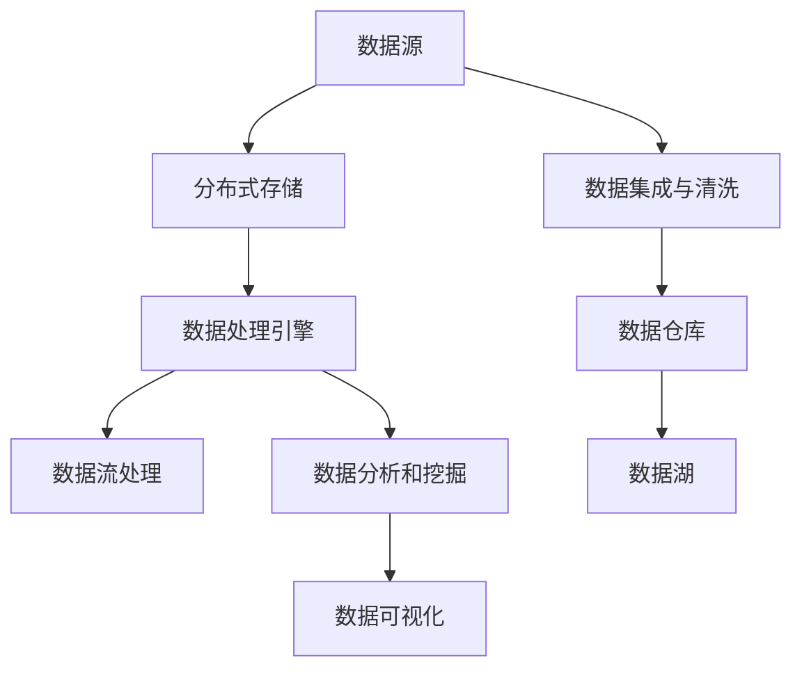

                 


## 引言

大数据时代已经到来，伴随着数据量的急剧增长，如何高效地处理和分析这些海量数据成为了一个亟待解决的问题。大数据处理框架作为一种解决方案，以其强大的数据处理能力和高效的数据分析能力受到了广泛关注。然而，目前市面上存在着多种大数据处理框架，如Hadoop、Spark、Flink等，每种框架都有其独特的优势和适用场景。因此，对于企业和开发者来说，选择合适的大数据处理框架至关重要。

本文旨在通过对主流大数据处理框架的深入比较与选择，帮助读者更好地理解各种框架的特点和适用场景，从而做出明智的决策。文章将分为以下几个部分：

1. **大数据处理概述**：介绍大数据处理的背景和挑战，以及大数据处理框架的核心概念。
2. **主流大数据处理框架介绍**：详细介绍Hadoop、Spark、Flink等主流大数据处理框架，包括其架构和核心原理。
3. **大数据处理框架比较**：从性能、功能、兼容性等方面对主流大数据处理框架进行比较。
4. **大数据处理框架选择策略**：提供选择大数据处理框架的策略和方法，包括项目需求分析、成本效益分析和技术栈兼容性分析等。
5. **实际应用案例分析**：通过实际案例，展示如何选择和部署大数据处理框架。
6. **结论**：总结文章的主要观点，并给出未来大数据处理框架发展的趋势。

本文将以逻辑清晰、结构紧凑、简单易懂的专业技术语言，结合Mermaid流程图、伪代码、数学模型和公式，以及实际应用案例，对大数据处理框架进行比较与选择，旨在为读者提供一份有深度、有思考、有见解的技术指南。

### 文章关键词

1. 大数据处理
2. 大数据处理框架
3. Hadoop
4. Spark
5. Flink
6. 性能比较
7. 选择策略

### 文章摘要

本文将深入探讨大数据处理框架的选择与比较。首先，介绍了大数据处理的背景和挑战，以及大数据处理框架的核心概念。接着，本文详细介绍了Hadoop、Spark和Flink等主流大数据处理框架，分析了它们的架构和核心原理。随后，从性能、功能、兼容性等多个维度对这三种框架进行了比较。在此基础上，本文提出了选择大数据处理框架的策略和方法，包括项目需求分析、成本效益分析和技术栈兼容性分析等。最后，通过实际应用案例分析，展示了如何在实际项目中选择和部署大数据处理框架。本文旨在为读者提供一份全面、深入、实用的技术指南。

### 大数据处理概述

随着互联网和物联网技术的飞速发展，数据量呈指数级增长。从社交媒体、电子商务到智能设备，各种数据源不断产生大量数据。这些数据包括结构化数据（如关系型数据库中的数据）、半结构化数据（如XML、JSON等）和非结构化数据（如图像、音频和视频等）。如何高效地存储、处理和分析这些海量数据，成为了当今IT领域的一个关键挑战。

#### 大数据处理挑战

大数据处理面临以下几个主要挑战：

1. **数据量（Volume）**：大数据的一个显著特征是其数据量的巨大。传统的数据处理工具和架构很难处理如此庞大的数据集。如何高效地存储和访问这些数据，成为了大数据处理的首要问题。
   
2. **数据类型（Variety）**：大数据不仅包括结构化数据，还包含半结构化数据和非结构化数据。这些数据类型的不同，使得数据处理变得更加复杂。如何处理多样化的数据类型，是大数据处理的另一个挑战。

3. **数据速度（Velocity）**：随着数据源的增多，数据生成的速度越来越快。例如，社交媒体平台每秒都会产生大量的新数据。如何快速处理这些实时数据，保持数据处理的及时性和有效性，是大数据处理的重要挑战。

4. **数据真实性（Veracity）**：大数据的质量和真实性也是一大挑战。由于数据来源的多样性和不确定性，数据可能存在错误、噪声和不一致的情况。如何确保数据的质量和真实性，是大数据处理过程中不可忽视的问题。

#### 大数据处理框架的核心概念

为了应对上述挑战，大数据处理框架应运而生。这些框架提供了一套完整的解决方案，包括数据的存储、处理和分析等功能。以下是一些核心概念：

1. **分布式存储**：分布式存储是将数据分散存储在多个节点上，以提高存储容量和访问速度。常见的大数据存储系统有HDFS（Hadoop分布式文件系统）和HBase。

2. **分布式计算**：分布式计算是将数据处理任务分解成多个子任务，分布在多个节点上并行执行，以加快处理速度。MapReduce、Spark和Flink等框架都采用了分布式计算模型。

3. **数据流处理**：数据流处理是对实时数据流进行处理和分析，以支持实时决策和监控。例如，Apache Flink和Apache Storm都是专门用于实时数据流处理的大数据框架。

4. **数据处理引擎**：数据处理引擎是大数据框架的核心组件，负责执行数据处理任务。常见的数据处理引擎包括MapReduce、Spark Core、Flink以及Impala等。

5. **数据分析和挖掘**：大数据处理框架通常集成了各种数据分析和挖掘工具，如Hive、Pig和Mahout等，以支持复杂的数据分析和机器学习任务。

6. **生态系统**：大数据处理框架通常有一个丰富的生态系统，包括各种工具和库，以支持数据集成、数据清洗、数据可视化等任务。

#### Mermaid 流程图

为了更好地解释大数据处理框架的核心概念，我们可以使用Mermaid流程图来展示其架构。



#### 核心算法原理讲解

在大数据处理框架中，数据处理引擎是核心组件。以下是几个常见的数据处理引擎的伪代码描述：

**MapReduce 伪代码：**

```python
function mapReduce(input, output):
    for each (key, value) in input:
        EmitIntermediate(key, value)
    for each (key, list of intermediate) in output:
        Emit ReducedKey, <combine(list of intermediate)>
```

**Spark Core 伪代码：**

```python
function sparkCore(rdd, transformationType):
    if transformationType is "map":
        newRDD = map(rdd, function(x): return (key, value))
    elif transformationType is "reduce":
        newRDD = reduceByKey(rdd, function((x, y): return x + y))
    return newRDD
```

**Flink 伪代码：**

```python
function flinkProcessing(stream):
    data = stream.map(function(x): return (key, value))
    result = data.reduce(function((x, y): return x + y))
    return result
```

#### 数学模型和公式

在大数据处理中，某些算法和模型需要用到数学公式来描述。例如，在MapReduce中，使用的Shuffle算法可以通过以下公式表示：

$$
Shuffle = \sum_{i=1}^{n} group_{i} \times distance_{i}
$$

其中，$group_{i}$ 表示第i个分组的数据量，$distance_{i}$ 表示第i个分组的数据需要传输的距离。

#### 总结

本节对大数据处理的背景、挑战和核心概念进行了介绍。通过Mermaid流程图、伪代码和数学模型，我们详细展示了大数据处理框架的基本架构和核心原理。下一节将深入介绍目前主流的大数据处理框架，包括Hadoop、Spark和Flink，分析它们的架构和原理。

### 主流大数据处理框架介绍

在当今的大数据领域，存在多种主流的大数据处理框架，其中Hadoop、Spark和Flink是最为著名的三种。这些框架各自拥有独特的架构和设计理念，适用于不同的应用场景。

#### Hadoop生态系统

**1. Hadoop概述**

Hadoop是一个开源的大数据处理框架，由Apache Software Foundation维护。它主要用于处理海量数据集，其核心组件包括HDFS（Hadoop Distributed File System）、MapReduce和YARN（Yet Another Resource Negotiator）。

**2. HDFS架构**

HDFS是一个分布式文件系统，用于存储大数据。其架构主要包括两个主要组件：NameNode和DataNode。

- **NameNode**：负责管理文件的元数据，如文件的目录结构、数据块映射信息等。它不存储实际的数据，但记录数据块在哪些DataNode上存储。
- **DataNode**：负责存储实际的数据块，并执行数据的读写操作。每个DataNode都向NameNode报告其存储状态和数据块的分布情况。

**3. MapReduce原理**

MapReduce是一种编程模型，用于处理分布式数据集。其基本思想是将大规模数据处理任务分解成两个阶段：Map阶段和Reduce阶段。

- **Map阶段**：将输入数据分成多个片段（Split），并为每个片段分配一个Map任务。Map任务处理输入片段，生成一组中间键值对。
- **Reduce阶段**：将Map阶段生成的中间键值对进行汇总和合并，生成最终的输出结果。

**4. YARN工作原理**

YARN是Hadoop的资源管理平台，用于管理计算资源，并支持多种数据处理引擎，如MapReduce、Spark等。

- ** ResourceManager**：负责分配和管理集群资源。
- **NodeManager**：运行在每个计算节点上，负责监控和管理该节点的资源使用情况，并执行分配给它的任务。

#### Spark生态系统

**1. Spark概述**

Spark是另一个开源的大数据处理框架，旨在提供比MapReduce更快的处理速度和更高的灵活性。Spark的核心组件包括Spark Core、Spark SQL、Spark Streaming和MLlib等。

**2. Spark架构**

Spark架构包括以下主要组件：

- **Spark Driver**：负责协调和管理整个计算过程，包括任务分发、进度报告等。
- **Executor**：运行在每个计算节点上，负责执行具体的计算任务，并返回结果。
- **Cluster Manager**：负责管理集群资源，常见的Cluster Manager有YARN、Mesos和Standalone等。

**3. Spark编程模型**

Spark提供了多种编程模型，包括：

- **Resilient Distributed Dataset (RDD)**：Spark的最基本抽象，用于表示一个不可变、可并行操作的数据集合。
- **DataFrame**：基于RDD的一种抽象，提供了更加丰富的SQL操作支持。
- **Dataset**：在DataFrame的基础上增加了强类型支持和优化编译，使得执行速度更快。

**4. Spark Streaming**

Spark Streaming是一个实时数据流处理框架，可以处理实时数据流并生成实时处理结果。其基本原理是将实时数据流分割成小批次，然后使用Spark的Batch Processing模型进行处理。

#### Flink生态系统

**1. Flink概述**

Flink是一个开源的流处理框架，支持批处理和流处理，旨在提供高性能和低延迟的数据处理能力。Flink的核心组件包括Flink Core、Flink SQL、Flink ML和Flink GraphX等。

**2. Flink架构**

Flink架构包括以下主要组件：

- **JobManager**：负责协调和管理整个计算过程，包括任务分发、进度报告等。
- **TaskManager**：运行在每个计算节点上，负责执行具体的计算任务，并返回结果。
- **Cluster Manager**：负责管理集群资源，常见的Cluster Manager有YARN、Mesos和Standalone等。

**3. Flink流处理能力**

Flink的核心特点是支持流处理，其基本原理是将数据流划分为多个事件，并在每个事件发生时立即进行处理。Flink提供的流处理API包括：

- **DataStream API**：用于表示和操作数据流。
- **Process Function API**：用于实现复杂的流处理逻辑，如状态维护和事件时间处理。

#### 总结

Hadoop、Spark和Flink是当前最流行的大数据处理框架，各自具有不同的架构和设计理念，适用于不同的应用场景。Hadoop以其稳定性和成熟性著称，Spark以其高性能和灵活性受到青睐，而Flink则以其强大的流处理能力和低延迟获得好评。下一节将对比分析这些框架的性能、功能、兼容性等方面的差异。

### 大数据处理框架比较

在了解了Hadoop、Spark和Flink等主流大数据处理框架的基本架构和原理之后，接下来我们将从性能、功能、兼容性等多个维度对这些框架进行比较，以帮助读者更好地选择适合自己项目需求的框架。

#### 性能比较

性能是选择大数据处理框架时最重要的考虑因素之一。以下从CPU性能、内存性能、网络性能三个方面进行比较。

**1. CPU性能**

- **Hadoop**：由于MapReduce的设计，其CPU性能依赖于大量的小任务并行执行。对于一些计算密集型的任务，Hadoop可能不如其他框架高效。
- **Spark**：Spark采用了基于内存的分布式计算模型，具有更高的CPU性能。特别是对于迭代计算任务，Spark可以在内存中缓存中间结果，显著提高计算速度。
- **Flink**：Flink同样具有高效的CPU性能，其流处理能力在许多基准测试中表现优异。Flink的及时性和低延迟特性使得其在处理实时数据流时具有优势。

**2. 内存性能**

- **Hadoop**：Hadoop在内存性能方面相对较弱，主要是因为MapReduce在执行过程中会频繁读写磁盘，导致内存使用效率不高。
- **Spark**：Spark采用了内存计算模型，可以将中间结果缓存到内存中，减少磁盘IO操作，从而提高内存性能。这种特性使得Spark在处理大规模迭代计算任务时表现优异。
- **Flink**：Flink同样支持内存计算，并且其内存管理机制能够有效减少内存碎片，提高内存使用效率。

**3. 网络性能**

- **Hadoop**：Hadoop在数据传输过程中使用了多个网络连接，可能会引入网络延迟和带宽瓶颈。
- **Spark**：Spark采用了基于内存的分布式计算模型，可以减少数据传输的次数，从而提高网络性能。
- **Flink**：Flink的网络性能在流处理方面表现优异，其高效的内部通信机制可以降低网络延迟和带宽消耗。

#### 功能比较

除了性能，框架的功能性也是选择的重要依据。以下从数据处理能力、生态系统完整性、扩展性和灵活性等方面进行比较。

**1. 数据处理能力**

- **Hadoop**：Hadoop擅长处理大规模批处理任务，但其在实时数据处理方面能力有限。
- **Spark**：Spark提供了强大的数据处理能力，特别是在迭代计算和实时数据处理方面表现优异。
- **Flink**：Flink同时支持批处理和流处理，具有强大的数据处理能力，并且在实时数据处理方面具有优势。

**2. 生态系统完整性**

- **Hadoop**：Hadoop拥有一个庞大的生态系统，包括HDFS、MapReduce、YARN、Hive、Pig等，提供了丰富的工具和库。
- **Spark**：Spark生态系统相对较小，但提供了Spark Core、Spark SQL、Spark Streaming和MLlib等核心组件，功能较为全面。
- **Flink**：Flink生态系统正在快速发展，包括Flink Core、Flink SQL、Flink ML和Flink GraphX等，提供了丰富的工具和库。

**3. 扩展性和灵活性**

- **Hadoop**：Hadoop具有良好的扩展性，可以方便地增加或减少计算资源，支持大规模集群部署。
- **Spark**：Spark也具有良好的扩展性，可以通过增加Executor来扩展计算资源。此外，Spark支持多种编程语言，如Scala、Python和Java，提供了较高的灵活性。
- **Flink**：Flink同样具有良好的扩展性，并且支持动态资源分配，可以根据任务需求动态调整资源分配。Flink还支持多种编程语言，如Java、Scala和Python，提供了较高的灵活性。

#### 兼容性比较

兼容性是选择大数据处理框架时需要考虑的重要因素之一。以下从数据源兼容性、数据格式兼容性和开发语言兼容性三个方面进行比较。

**1. 数据源兼容性**

- **Hadoop**：Hadoop支持多种数据源，包括HDFS、Amazon S3和其他文件系统，同时支持关系型数据库和NoSQL数据库。
- **Spark**：Spark同样支持多种数据源，包括HDFS、HBase、Cassandra、Amazon S3和Hive等。
- **Flink**：Flink支持多种数据源，包括HDFS、Cassandra、Kafka、Amazon S3和NoSQL数据库等。

**2. 数据格式兼容性**

- **Hadoop**：Hadoop支持多种数据格式，包括SequenceFile、Parquet、Avro、JSON和XML等。
- **Spark**：Spark支持多种数据格式，包括Parquet、ORC、JSON、Avro和CSV等。
- **Flink**：Flink支持多种数据格式，包括Parquet、ORC、JSON、Avro、CSV和Protobuf等。

**3. 开发语言兼容性**

- **Hadoop**：Hadoop主要使用Java进行编程，同时也支持Python（通过Pig和Hive）和Scala。
- **Spark**：Spark支持Scala、Python和Java三种主要编程语言，同时还提供了SparkR和SparkSQL等库，方便使用R和SQL进行数据处理。
- **Flink**：Flink支持Java、Scala和Python三种主要编程语言，提供了FLINK-ML和Flink-Gateway等库，方便使用机器学习和Web服务进行数据处理。

#### 总结

通过对Hadoop、Spark和Flink的性能、功能、兼容性等多方面的比较，我们可以得出以下结论：

- 如果项目主要涉及大规模批处理任务，Hadoop是一个不错的选择，其生态系统丰富，稳定性和成熟性较高。
- 如果项目需要处理实时数据流或迭代计算任务，Spark具有更高的性能和灵活性，是较为理想的选择。
- 如果项目需要同时处理批处理和流处理任务，并且对实时数据处理有较高要求，Flink是一个值得考虑的框架，其低延迟和高效性能在流处理方面具有显著优势。

选择大数据处理框架时，需要根据项目需求、性能要求、生态系统和支持的编程语言等多个方面进行综合考虑，以确保选择最适合的框架。

### 大数据处理框架选择策略

在选择合适的大数据处理框架时，需要综合考虑多个因素，以确保框架能够满足项目需求，同时具备良好的性能和可维护性。以下是一些常见的选择策略：

#### 项目需求分析

首先，需要明确项目的具体需求，包括数据量、数据类型、处理速度和实时性要求等。

**1. 数据量**

- **大规模数据**：对于处理海量数据（TB或PB级别）的项目，可以选择Hadoop或Spark，因为它们支持大规模数据集的处理。
- **中等规模数据**：对于处理中等规模数据（GB级别）的项目，Spark和Flink都是不错的选择，它们的高性能和灵活性能够满足需求。

**2. 数据类型**

- **结构化数据**：对于主要处理结构化数据的场景，可以使用Hadoop（通过Hive）或Spark SQL，它们提供了强大的SQL支持。
- **半结构化数据**：对于处理半结构化数据的场景，可以使用Spark（通过Spark SQL和DataFrame）或Flink，它们提供了更加灵活的数据处理能力。
- **非结构化数据**：对于处理非结构化数据的场景，如图像、音频和视频等，可以选择Flink，因为它支持流处理和复杂的数据类型处理。

**3. 处理速度和实时性要求**

- **低延迟**：如果项目对处理速度和实时性要求很高，如实时推荐系统或实时监控，可以选择Flink，因为它具有低延迟和高效的流处理能力。
- **可接受延迟**：如果项目对实时性的要求不高，可以选择Hadoop或Spark，因为它们在批处理和迭代计算任务上表现出色。

#### 成本效益分析

在项目需求分析的基础上，还需要进行成本效益分析，以确定选择哪种大数据处理框架在经济上更加合理。

**1. 成本构成**

- **硬件成本**：不同的框架对硬件资源的需求不同。例如，Hadoop和Spark通常需要更多的内存和CPU资源，而Flink可能对GPU资源有更高要求。
- **软件成本**：Hadoop和Spark都是开源框架，没有直接的软件成本。但Spark可能需要购买特定版本的许可证，而Flink的开源版本也足够满足大部分需求。
- **运维成本**：不同框架的运维成本也不同。例如，Hadoop的运维成本可能较高，因为它需要大量的配置和管理。Spark和Flink提供了更完善的自动化工具，降低了运维成本。

**2. 成本效益评估方法**

- **TCO（Total Cost of Ownership）**：计算框架的总体拥有成本，包括硬件成本、软件成本和运维成本。
- **ROI（Return on Investment）**：计算框架的投资回报率，通过预测框架带来的收益和成本的差异来评估。

#### 技术栈兼容性分析

框架的技术栈兼容性也是一个重要的考虑因素，它影响项目的开发效率和维护成本。

**1. 开发工具兼容性**

- **编程语言**：考虑框架支持的编程语言，如Java、Scala、Python等，是否与团队的技术栈兼容。
- **开发框架**：考虑框架是否支持常用的开发框架，如Spring、Hibernate等。

**2. 运维工具兼容性**

- **监控和日志**：考虑框架是否支持常用的监控和日志工具，如Kibana、Grafana、ELK（Elasticsearch、Logstash、Kibana）等。
- **集成和扩展**：考虑框架是否支持与其他工具和服务的集成，如Kafka、HDFS、Amazon S3等。

#### 综合策略

结合以上几个方面，可以制定一个综合性的选择策略：

1. **确定项目需求**：明确数据量、数据类型、处理速度和实时性要求等。
2. **评估成本效益**：通过TCO和ROI评估不同框架的经济性。
3. **分析技术栈兼容性**：考虑框架与现有技术栈的兼容性。
4. **优先级排序**：根据需求、成本和技术兼容性等因素，对候选框架进行排序，选择最合适的框架。

通过上述策略，可以更科学地选择合适的大数据处理框架，确保项目成功实施。

### 实际应用案例分析

为了更好地展示如何在实际项目中选择和部署大数据处理框架，以下我们将通过三个具体案例——银行业、零售业和医疗行业——来详细分析大数据处理框架的应用。

#### 银行业大数据处理案例

**1. 业务场景**

银行业涉及海量交易数据的处理，包括账户信息、交易记录、客户行为等。这些数据对于风险评估、欺诈检测和客户关系管理至关重要。因此，如何高效地处理和分析这些数据是银行面临的重要挑战。

**2. 大数据处理需求**

- **海量数据处理**：银行需要处理每天数以百万计的交易记录，数据量达到TB级别。
- **实时数据处理**：对交易数据进行实时监控，以快速识别异常交易和欺诈行为。
- **复杂分析需求**：需要对客户行为进行深入分析，以优化营销策略和提升客户满意度。

**3. 案例分析**

- **选择框架**：由于银行对实时数据处理和复杂分析有较高要求，选择Flink作为数据处理框架。Flink的流处理能力能够满足实时数据监控需求，而其强大的数据处理能力能够支持复杂分析任务。

- **框架部署**：银行搭建了一个基于Flink的实时数据处理平台。使用YARN作为Cluster Manager，负责资源管理和调度。在数据存储方面，使用HDFS存储海量交易记录，并使用HBase进行快速查询。

- **代码实现**：在Flink中，使用了DataStream API来处理实时交易数据流。通过定义自定义的Process Function，实现了实时欺诈检测和风险评估功能。

- **代码解读**：代码主要包括两个部分：数据读取和数据处理。数据读取部分使用Flink的Source Function从HDFS读取交易记录，数据处理部分使用Process Function进行实时分析和决策。

#### 零售行业大数据处理案例

**1. 业务场景**

零售行业的数据量巨大，包括商品信息、订单记录、库存数据、客户反馈等。零售企业通过大数据分析，优化供应链管理、提升客户体验和增加销售额。

**2. 大数据处理需求**

- **海量数据处理**：零售企业需要处理每天数以亿计的订单记录，数据量达到PB级别。
- **实时数据处理**：实时分析客户行为，优化促销策略和库存管理。
- **数据多样性**：处理多种类型的数据，包括结构化数据、半结构化数据和非结构化数据。

**3. 案例分析**

- **选择框架**：由于零售行业对数据多样性和实时性有较高要求，选择Spark作为数据处理框架。Spark的弹性分布式数据集（RDD）和DataFrame API能够处理多种类型的数据，并且其内存计算模型能够提高数据处理速度。

- **框架部署**：零售企业部署了一个基于Spark的分布式数据处理平台。使用Standalone Mode作为Cluster Manager，确保资源的高效利用。在数据存储方面，使用HDFS存储结构化数据，并使用HBase和Cassandra存储非结构化数据。

- **代码实现**：在Spark中，使用RDD API处理大规模数据集，使用DataFrame API进行数据转换和清洗。通过定义自定义的Transformer，实现了实时推荐系统和库存管理功能。

- **代码解读**：代码主要包括数据读取、数据转换和数据存储三个部分。数据读取部分使用Spark的Reader Function从不同数据源读取数据，数据转换部分使用Transformer进行数据处理，数据存储部分将处理结果存储到HDFS或其他数据存储系统中。

#### 医疗行业大数据处理案例

**1. 业务场景**

医疗行业涉及大量的医疗数据，包括患者信息、医学影像、医疗记录等。这些数据对于疾病预测、诊断和个性化治疗至关重要。

**2. 大数据处理需求**

- **海量数据处理**：医疗行业需要处理每天数以TB计的医疗数据，数据量巨大。
- **实时数据处理**：实时处理医学影像和医疗记录，提高诊断准确性和响应速度。
- **数据隐私和安全**：医疗数据涉及隐私和安全问题，需要确保数据的安全性和合规性。

**3. 案例分析**

- **选择框架**：由于医疗行业对数据安全和隐私保护有较高要求，选择Flink作为数据处理框架。Flink提供高效的数据处理能力和低延迟的流处理能力，同时支持数据加密和安全认证。

- **框架部署**：医疗企业部署了一个基于Flink的分布式数据处理平台。使用Kubernetes作为Cluster Manager，确保资源的高效利用和动态扩展。在数据存储方面，使用HDFS和Alluxio进行数据缓存和加速。

- **代码实现**：在Flink中，使用DataStream API处理流数据，使用Process Function实现实时医学影像分析和诊断功能。通过自定义的加密模块，确保数据处理过程中的数据安全。

- **代码解读**：代码主要包括数据读取、数据处理和数据存储三个部分。数据读取部分使用Flink的Source Function从不同数据源读取数据，数据处理部分使用Process Function进行数据分析和处理，数据存储部分将处理结果存储到数据库或其他数据存储系统中，并使用加密模块确保数据安全。

#### 总结

通过以上三个案例，我们可以看到不同行业在处理大数据时面临着不同的需求和挑战。根据项目需求、性能要求和技术栈兼容性，选择合适的大数据处理框架能够显著提高数据处理效率和效果。银行选择Flink以满足实时监控和复杂分析的需求，零售业选择Spark以满足海量数据处理的多样性，而医疗行业选择Flink以保障数据安全和隐私。这些案例为其他行业在处理大数据时提供了宝贵的参考和借鉴。

### 总结与展望

本文通过详细比较和分析Hadoop、Spark和Flink等主流大数据处理框架，从性能、功能、兼容性等多个维度为读者提供了全面的技术指南。通过对大数据处理背景和挑战的介绍，以及框架核心概念、架构和算法原理的深入讲解，读者可以更清晰地理解这些框架的特点和适用场景。

选择合适的大数据处理框架对于项目的成功至关重要。本文提供的选择策略，包括项目需求分析、成本效益分析和技术栈兼容性分析，可以帮助读者科学地做出决策。通过实际应用案例分析，读者可以看到不同行业如何根据自身需求选择和部署合适的大数据处理框架。

展望未来，随着数据量的不断增长和计算技术的进步，大数据处理框架将更加多样化和高效化。实时数据处理、机器学习和人工智能技术的深度融合，将带来更多创新和突破。例如，流处理框架如Flink将继续优化其性能和低延迟特性，为实时数据分析提供更强支持。此外，数据隐私和安全也将成为重要关注点，大数据处理框架将进一步加强数据加密和保护机制。

总之，大数据处理框架的发展将继续推动数据处理和数据分析技术的进步，为各行各业带来更多的机遇和挑战。希望本文能够为读者在学习和应用大数据处理技术过程中提供有价值的参考。

### 附录

#### 附录A：参考资料与工具介绍

1. **参考资料**
   - 《Hadoop权威指南》 - 蒂姆·柏顿（Tim Barret）等著
   - 《Spark技术内幕》 - 宋宝华等著
   - 《Flink：从入门到实战》 - 张海龙等著
   - Apache Hadoop官网：[http://hadoop.apache.org/](http://hadoop.apache.org/)
   - Apache Spark官网：[http://spark.apache.org/](http://spark.apache.org/)
   - Apache Flink官网：[http://flink.apache.org/](http://flink.apache.org/)

2. **工具介绍**
   - **HDFS**：Hadoop分布式文件系统，用于存储大数据。
   - **MapReduce**：Hadoop的核心组件，用于处理大规模数据集。
   - **YARN**：Hadoop的资源管理平台，用于管理集群资源。
   - **Spark Core**：Spark的核心组件，用于分布式计算。
   - **Spark SQL**：Spark的SQL支持库，用于结构化数据处理。
   - **Spark Streaming**：Spark的实时流处理库，用于处理实时数据流。
   - **Flink Core**：Flink的核心组件，用于分布式数据处理。
   - **Flink SQL**：Flink的SQL支持库，用于结构化数据处理。
   - **Flink Streaming**：Flink的流处理库，用于实时数据处理。

#### 附录B：大数据处理框架性能测试工具介绍

1. **Apache JMeter**：开源的性能测试工具，用于模拟大量用户并发访问，评估大数据处理框架的性能。
2. **Apache Spark Benchmark Suite**：Spark官方提供的性能测试套件，用于评估Spark的性能。
3. **Flink Performance Benchmarks**：Flink官方提供的性能测试工具，用于评估Flink的性能。
4. **Hadoop Tutorials**：Hadoop官方提供的性能测试教程和工具，用于评估Hadoop的性能。

#### 附录C：常见问题与解答

1. **Q：如何优化Hadoop的性能？**
   - **A**：可以通过优化HDFS的存储配置、调整MapReduce的任务调度参数、使用压缩算法来优化Hadoop的性能。

2. **Q：Spark和Flink哪个更适合实时数据处理？**
   - **A**：Flink更适合实时数据处理，因为它具有低延迟和高吞吐量的特性。而Spark虽然在实时数据处理方面也有一定的表现，但相比之下，Flink的实时能力更为突出。

3. **Q：如何选择大数据处理框架？**
   - **A**：根据项目需求、性能要求、生态系统和支持的编程语言等因素进行选择。例如，对于大规模批处理任务，可以选择Hadoop；对于实时数据处理任务，可以选择Flink；对于数据多样性要求高的项目，可以选择Spark。

#### 最佳实践 tips、小结、注意事项、拓展阅读等内容

- **最佳实践**：在实际项目中，建议先进行小规模的性能测试，再进行大规模部署。此外，定期监控和优化大数据处理框架的性能，确保系统稳定运行。
- **小结**：大数据处理框架的选择应基于具体项目需求，综合考虑性能、功能、兼容性等因素。
- **注意事项**：大数据处理过程中，数据安全和隐私保护至关重要。务必采用适当的数据加密和保护措施。
- **拓展阅读**：可以阅读《大数据处理：架构与实现》等书籍，深入了解大数据处理的最新技术和实践。

### 作者信息

**作者：AI天才研究院/AI Genius Institute & 禅与计算机程序设计艺术 /Zen And The Art of Computer Programming**

